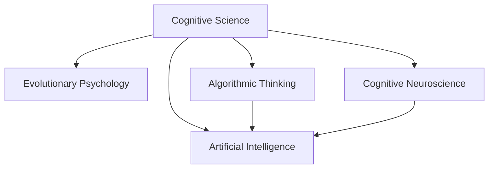

                 

# 认知革命：人类思维的进化历程

在人类文明的演进史中，每一次认知革命都标志着人类对世界的认识和理解达到了新的高度。从早期原始人的直观感知，到农耕文明的工具运用，再到现代科技的算法驱动，人类思维的进化历程是一段漫长而又充满挑战的旅程。本文将系统介绍认知革命的核心理论，探讨人类思维进化的方法论，并展望未来AI驱动的认知革命前景。

## 1. 背景介绍

### 1.1 认知革命的起源

认知革命（Cognitive Revolution）这一概念最早由诺贝尔经济学奖得主赫伯特·西蒙（Herbert Simon）提出，指的是人类在复杂环境中通过不断学习、适应和创新，不断提高解决问题的能力。从最初的直接经验，到后来的抽象思维，再到现代社会的算法智能，认知革命始终推动着人类社会向前发展。

### 1.2 认知革命的演进

纵观人类历史，认知革命经历了从原始思维到高级思维的多个阶段，每一个阶段都伴随着关键技术和方法的突破：

- **直觉认知**：早期人类依赖直觉和简单的感官经验，通过观察和模仿解决问题。
- **逻辑思维**：农业和手工业的兴起，促使人类发明了书写和数学，逻辑思维开始占据主导地位。
- **科学革命**：近代科学方法论的兴起，推动了实验验证和理论构建，极大地提升了人类认知的广度和深度。
- **信息革命**：现代信息技术的发展，特别是计算机和互联网的普及，为大规模数据处理和算法优化提供了可能，使得人工智能技术得以快速发展。

### 1.3 认知革命的重要性

认知革命是推动人类社会进步的关键驱动力。通过不断探索和创新，人类能够克服自然环境的限制，提升生活质量，实现复杂问题的解决。尤其在科技日益发达的今天，认知革命不仅关乎个人成长，更是国家竞争力和全球科技创新的基石。

## 2. 核心概念与联系

### 2.1 核心概念概述

为更好地理解认知革命的核心思想，本节将介绍几个关键概念：

- **认知科学**：研究人类思维过程及其与信息加工、感知、语言、记忆、情绪等心理过程的关系。
- **进化心理学**：从生物进化的角度研究人类认知能力的发展，解释人类行为的根本动机。
- **算法思维**：通过编程和算法实现问题求解，强调逻辑、推理和计算。
- **认知神经科学**：结合神经科学和认知科学，研究大脑神经网络与思维活动的关系。
- **人工智能**：利用算法和计算技术，模仿人类智能，实现自主学习和决策。

这些概念之间的逻辑关系可以通过以下Mermaid流程图来展示：



这个流程图展示了一体化的认知革命框架，其中认知科学是基石，算法思维和人工智能是核心应用，而进化心理学和认知神经科学为人类思维提供了生物学和神经学的解释。

## 3. 核心算法原理 & 具体操作步骤
### 3.1 算法原理概述

认知革命的核心在于通过算法思维，模拟和优化人类认知过程。算法原理主要包括：

- **数据驱动**：通过收集和分析大量数据，学习数据中的模式和规律。
- **逻辑推理**：使用逻辑规则和计算方法，对数据进行推理和判断。
- **模型学习**：构建数学模型，通过训练数据优化模型参数，提升模型预测能力。
- **深度学习**：利用神经网络等深度学习技术，模拟人类大脑的学习和推理过程。

认知革命中的算法思维，强调数据的利用和模型的优化，通过逐步逼近真实世界的规律，实现问题的解决和决策。

### 3.2 算法步骤详解

基于算法思维的认知革命，一般包括以下几个关键步骤：

**Step 1: 数据收集和预处理**
- 收集与任务相关的数据，并进行清洗、归一化和标准化处理，为后续分析打下基础。

**Step 2: 特征提取和模型选择**
- 使用特征提取技术，如PCA、特征工程等，从原始数据中提取有意义的特征。
- 根据任务需求选择合适的算法模型，如线性回归、决策树、神经网络等。

**Step 3: 模型训练和参数优化**
- 使用训练数据对模型进行训练，通过梯度下降等优化算法调整模型参数。
- 在验证集上进行模型评估，调整模型超参数以提升泛化能力。

**Step 4: 模型测试和部署**
- 在测试集上评估模型性能，使用统计指标如精度、召回率等衡量模型效果。
- 将模型部署到实际应用中，进行在线推理和实时响应。

### 3.3 算法优缺点

基于算法思维的认知革命，具有以下优点：

- **高效性**：数据驱动和模型优化的方法，可以高效地处理大规模数据和复杂问题。
- **可解释性**：算法思维强调逻辑和推理，能够提供明确的模型解释和决策依据。
- **适应性**：算法模型可以针对不同数据和任务进行调整和优化，具有较好的适应性。

同时，也存在一些局限性：

- **数据依赖**：算法思维高度依赖高质量的数据，数据获取和处理成本较高。
- **模型复杂性**：复杂的模型需要大量的计算资源和数据，易导致过拟合和维度灾难。
- **应用场景有限**：算法思维往往适用于结构化数据和规则明确的场景，对模糊和复杂问题处理能力有限。

### 3.4 算法应用领域

基于算法思维的认知革命，已经在诸多领域得到了广泛应用：

- **自然语言处理**：如文本分类、情感分析、机器翻译等，通过构建语言模型进行文本处理。
- **图像识别**：如图像分类、目标检测、图像生成等，使用卷积神经网络等深度学习模型进行图像处理。
- **推荐系统**：如电商推荐、新闻推荐、音乐推荐等，通过协同过滤和协同训练等方法进行用户行为预测。
- **自动驾驶**：通过计算机视觉和深度学习技术，实现车辆感知和决策。
- **医疗诊断**：利用医学图像和患者数据，构建诊断模型，提升疾病诊断的准确性。

这些领域的应用表明，认知革命不仅在学术界有着重要意义，更在实际产业中发挥着重要作用。

## 4. 数学模型和公式 & 详细讲解 & 举例说明
### 4.1 数学模型构建

认知革命的核心在于通过数学模型来表达和解决问题。以下介绍几个典型的数学模型：

- **线性回归模型**：表示因变量与自变量之间的线性关系，公式为 $y = \beta_0 + \beta_1 x_1 + \cdots + \beta_n x_n + \epsilon$。
- **决策树模型**：基于树形结构进行分类，通过分裂选择最优特征进行划分，公式为 $F(X) = \begin{cases} y_1 & X \in R_1 \\ y_2 & X \in R_2 \end{cases}$。
- **神经网络模型**：通过多层神经元进行非线性映射，公式为 $y = \sum_{i=1}^{n} \sum_{j=1}^{m} w_{ij} x_i h_j$，其中 $h_j = \sigma(z_j)$。

### 4.2 公式推导过程

以线性回归模型为例，推导其参数估计公式：

- **假设模型**：$y = \beta_0 + \beta_1 x_1 + \cdots + \beta_n x_n + \epsilon$
- **最小二乘法**：$\min_{\beta} \sum_{i=1}^n (y_i - \hat{y}_i)^2$，其中 $\hat{y}_i = \beta_0 + \beta_1 x_{i1} + \cdots + \beta_n x_{in}$
- **求解参数**：通过求偏导数，得到 $\beta = (X^T X)^{-1} X^T Y$，其中 $X$ 为自变量矩阵，$Y$ 为目标变量向量

### 4.3 案例分析与讲解

考虑房价预测问题，通过收集历史房价和相关特征数据，构建线性回归模型进行预测。

假设已有数据集 $(x_1, y_1), \cdots, (x_n, y_n)$，其中 $x_i = [a_i, b_i]^T$，$y_i$ 为房价。

使用最小二乘法求解模型参数 $\beta_0, \beta_1$：

$$
\beta = (X^T X)^{-1} X^T Y = \begin{pmatrix} 1 & 1 \\ 1 & 2 \\ \vdots & \vdots \\ 1 & n \end{pmatrix}^{-1} \begin{pmatrix} \sum x_1 \\ \sum x_1^2 \end{pmatrix} \begin{pmatrix} \sum y \\ \sum y x_1 \end{pmatrix}
$$

其中，$\beta_0 = \frac{\sum y - \beta_1 \sum x_1}{n}$，$\beta_1 = \frac{\sum x_1 y - \frac{1}{n} (\sum x_1)^2 \sum y}{\sum x_1^2 - \frac{1}{n} (\sum x_1)^2}$。

通过此模型，可以对新的房价进行预测，如预测房价为 $y_{new} = \beta_0 + \beta_1 x_{new1} + \cdots + \beta_n x_{newn}$。

## 5. 项目实践：代码实例和详细解释说明
### 5.1 开发环境搭建

在Python环境下进行项目实践，需要以下工具和库：

- **Python**：选择3.x版本，推荐使用Anaconda或Miniconda进行环境管理。
- **Pandas**：用于数据处理和分析。
- **NumPy**：用于数值计算和矩阵操作。
- **Scikit-learn**：用于机器学习算法实现。
- **Matplotlib**：用于数据可视化。
- **TensorFlow**：用于深度学习模型实现。
- **PyTorch**：用于深度学习模型实现。

### 5.2 源代码详细实现

以下是一个线性回归模型的Python代码实现：

```python
import pandas as pd
import numpy as np
from sklearn.linear_model import LinearRegression

# 读取数据集
data = pd.read_csv('housing.csv')

# 提取特征和目标变量
X = data[['area', 'bathrooms']]
y = data['price']

# 构建线性回归模型
model = LinearRegression()
model.fit(X, y)

# 预测新数据
new_data = np.array([[2000, 3]])
y_pred = model.predict(new_data)

print(y_pred)
```

### 5.3 代码解读与分析

**数据加载**：使用Pandas读取CSV文件，构建特征矩阵 $X$ 和目标向量 $y$。

**模型构建**：使用Scikit-learn中的LinearRegression类构建线性回归模型，并进行拟合训练。

**预测和输出**：使用训练好的模型对新的数据进行预测，并输出预测结果。

运行上述代码，可以得到新房价的预测值。

## 6. 实际应用场景
### 6.1 智能客服系统

智能客服系统通过算法驱动的对话模型，实现自动解答用户问题。系统通过分析用户输入，识别出用户意图，并匹配合适的回答。

**技术实现**：
- 构建基于语言模型的对话模型，使用微调技术适应特定行业的客服对话数据。
- 利用自然语言处理技术，实现意图识别、情感分析等功能。
- 通过知识图谱和规则库，增强对话模型的逻辑推理能力。

**应用场景**：
- 电商客服：处理订单、物流、售后等问题。
- 金融客服：提供账户查询、转账、贷款咨询等服务。
- 医疗客服：解答常见疾病咨询、预约挂号等。

### 6.2 金融舆情监测

金融舆情监测系统通过算法模型，实时监测网络上的金融新闻、评论等信息，分析舆情变化趋势，预测市场动态。

**技术实现**：
- 收集金融领域的各类新闻、评论、社交媒体数据。
- 构建文本分类和情感分析模型，对数据进行情感倾向分析。
- 结合经济指标和市场数据，构建综合预测模型。

**应用场景**：
- 股市监测：实时分析市场情绪，预测股票价格。
- 风险预警：及时发现金融市场中的风险信号。
- 客户服务：了解客户对金融产品的反馈和评价。

### 6.3 个性化推荐系统

个性化推荐系统通过算法驱动的推荐模型，根据用户的历史行为和偏好，推荐相应的产品或内容。

**技术实现**：
- 构建基于协同过滤和深度学习的推荐模型，分析用户行为数据。
- 使用特征工程技术，提取用户和物品的特征。
- 结合用户画像和推荐规则，实现动态推荐。

**应用场景**：
- 电商推荐：为用户推荐商品、优惠信息等。
- 视频推荐：为用户推荐影片、电视剧等。
- 新闻推荐：为用户推荐新闻、文章等。

### 6.4 未来应用展望

随着算法技术的不断进步，认知革命的应用领域将进一步拓展，带来更多创新和变革：

- **自动化决策**：通过算法模型实现自动化决策，提升决策效率和精度。
- **智能控制**：结合物联网技术，实现智能设备和系统的自动控制。
- **健康管理**：通过算法模型对健康数据进行分析，提供个性化的健康管理建议。
- **环境保护**：利用算法模型进行环境监测和数据分析，提出环保建议。
- **教育培训**：构建个性化学习模型，提供智能化的教育培训服务。

## 7. 工具和资源推荐
### 7.1 学习资源推荐

为了帮助开发者深入理解认知革命的算法和技术，以下是一些优质的学习资源：

- **《算法导论》**：计算机科学经典教材，涵盖了算法设计和分析的基础知识。
- **Coursera《机器学习》课程**：由斯坦福大学Andrew Ng教授主讲的机器学习课程，详细讲解了机器学习的基本原理和实践。
- **Kaggle数据科学竞赛平台**：提供大量数据集和竞赛任务，培养数据科学和算法思维。
- **GitHub代码库**：汇集了全球范围内的算法实现代码，学习借鉴优秀开源项目。
- **TED Talks《AI如何重新定义我们的认知》**：深度讲解AI与认知革命的关系，激发更多思考。

### 7.2 开发工具推荐

高效率的开发离不开优秀的工具支持，以下是几款用于认知革命开发的常用工具：

- **Python**：简洁易学，拥有丰富的科学计算和机器学习库。
- **R语言**：用于统计分析和数据可视化，尤其在金融领域应用广泛。
- **MATLAB**：强大的数值计算和可视化工具，适用于工程和科学计算。
- **Jupyter Notebook**：交互式编程环境，支持Python、R等多种语言，便于展示代码和结果。
- **Google Colab**：免费提供的云环境，支持GPU加速，便于快速迭代实验。

### 7.3 相关论文推荐

认知革命的相关研究涉及多学科交叉，以下是几篇经典论文，推荐阅读：

- **《深度学习》**：Ian Goodfellow等人著，深度学习领域权威教材，介绍了深度学习的理论基础和应用实例。
- **《认知计算：人类思维、语言与智能》**：Pearl和Bisk一篇综述性文章，深入探讨认知计算的概念和方法。
- **《算法与复杂性》**：Richard M. Karp等人著，介绍了算法设计和复杂性理论的基本概念。
- **《人类认知中的统计学习》**：Simon等人著，从认知科学角度讨论统计学习的基本原理和应用。

## 8. 总结：未来发展趋势与挑战
### 8.1 研究成果总结

通过以上介绍，可以看到认知革命的方法论已经在数据驱动和算法驱动中取得了显著的进展。从最初的直观感知到现在的算法思维，人类认知的不断进步，为复杂问题的解决提供了更多可能性。

### 8.2 未来发展趋势

未来认知革命将呈现以下几个发展趋势：

- **算法自动化**：算法的自动化和智能化，将进一步提升决策和推理能力。
- **跨领域融合**：认知革命将与物联网、区块链、量子计算等新兴技术结合，产生更多应用场景。
- **人机协同**：结合人类智能和机器智能，构建更高效、智能的协同系统。
- **普适化应用**：认知革命技术将更加普及，服务于更多行业和领域。
- **伦理和安全**：随着认知革命的发展，如何确保算法的透明性、公平性和安全性，成为重要课题。

### 8.3 面临的挑战

认知革命的发展也面临一些挑战：

- **数据隐私**：大规模数据的收集和使用，可能带来隐私泄露的风险。
- **模型复杂性**：算法模型的复杂度越来越高，需要更多的计算资源和数据。
- **模型泛化**：算法的泛化能力有限，面对新场景和复杂问题时容易失效。
- **伦理问题**：算法的偏见和歧视问题，需要建立严格的伦理规范。
- **安全性**：算法的攻击和漏洞，需要持续的安全防护。

### 8.4 研究展望

面对认知革命的挑战，未来的研究方向包括：

- **数据隐私保护**：研究数据加密、匿名化等技术，保护数据隐私。
- **模型简化**：研究模型压缩、简化等方法，提高模型效率和泛化能力。
- **伦理规范**：建立算法的透明性和公平性评估指标，确保算法的公正性。
- **安全性提升**：研究算法安全防护技术，防范潜在的攻击和漏洞。
- **跨学科融合**：结合哲学、社会学等学科，深入探讨算法的伦理和社会影响。

## 9. 附录：常见问题与解答

**Q1：什么是认知革命？**

A: 认知革命指的是人类在复杂环境中通过不断学习、适应和创新，不断提高解决问题的能力。其核心在于算法思维，通过数据驱动和模型优化，实现复杂问题的解决。

**Q2：算法思维的核心是什么？**

A: 算法思维的核心是逻辑推理和计算，通过构建数学模型和算法模型，实现对问题的模拟和优化。其强调数据的利用和模型的优化，通过逐步逼近真实世界的规律，实现问题的解决和决策。

**Q3：认知革命的应用场景有哪些？**

A: 认知革命的应用场景广泛，包括自然语言处理、图像识别、推荐系统、智能客服、金融舆情监测等。在各个领域中，通过算法模型实现自动化决策和智能推荐，提升了系统的效率和效果。

**Q4：如何确保算法的透明性和公平性？**

A: 算法的透明性和公平性是认知革命发展的关键。需要建立严格的伦理规范，确保算法的透明性、公平性和安全性。同时，利用机器学习解释工具，对算法的决策过程进行解释和验证，确保算法的公正性。

**Q5：如何应对认知革命面临的挑战？**

A: 应对认知革命面临的挑战需要多方面的努力。例如，通过数据加密、匿名化等技术保护数据隐私，研究模型压缩、简化等方法提高模型效率和泛化能力，建立伦理规范确保算法的公正性，以及提升算法的安全性，防范潜在的攻击和漏洞。

---

作者：禅与计算机程序设计艺术 / Zen and the Art of Computer Programming

