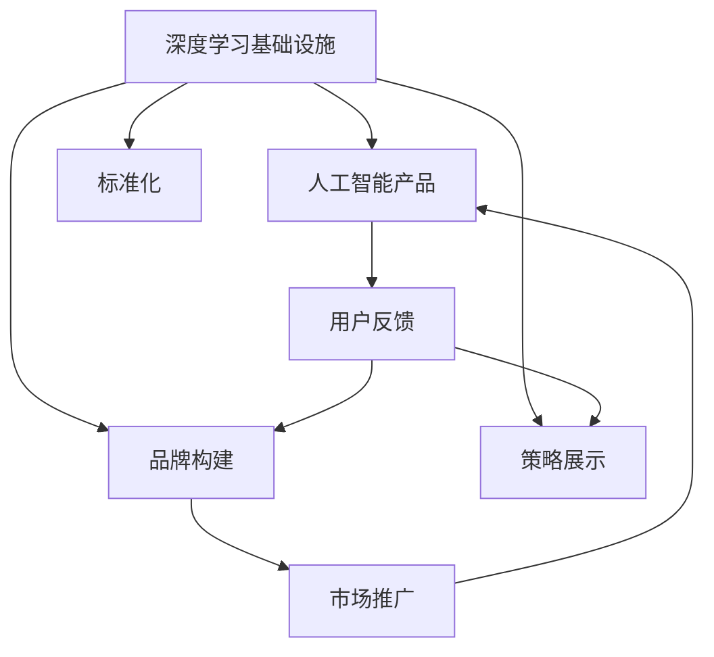

                 

# 讲好AI infra故事：贾扬清策略产品展示品牌构建

> 关键词：
- 深度学习基础设施 (DL Infrastructure)
- 人工智能产品 (AI Product)
- 品牌构建 (Brand Building)
- 策略展示 (Strategy Display)
- 标准化 (Standardization)

## 1. 背景介绍

### 1.1 问题由来

随着人工智能(AI)技术的飞速发展，深度学习(DL)技术已经成为AI应用的核心驱动力。但是，构建高效、可靠、可扩展的深度学习基础设施(DL Infrastructure)，成为了AI应用落地的一大瓶颈。目前，企业在应用深度学习技术时，往往会遇到以下挑战：

1. 数据准备难度大：深度学习模型需要大量的高质量数据，而数据的收集、清洗、标注等工作往往耗时耗力。
2. 模型训练资源昂贵：深度学习模型训练通常需要高性能的GPU/TPU资源，而训练大模型所需的硬件成本高昂。
3. 模型推理效率低：深度学习模型的推理速度较慢，难以满足实时性要求高的应用场景。
4. 模型复用性差：不同模型的底层架构和优化策略各异，难以在多个项目中复用。

这些问题严重制约了深度学习技术在企业内部的应用。为了解决这些问题，贾扬清教授提出了一系列策略，旨在构建一套标准化、可扩展、高效可靠的DL基础设施，支撑企业AI应用的快速迭代和落地。

### 1.2 问题核心关键点

为了构建高效、可靠、可扩展的DL基础设施，贾扬清教授强调以下几个核心关键点：

1. 构建通用化的数据处理管道：通过数据自动化处理，减少数据准备时间和成本。
2. 设计可扩展的模型训练框架：采用分布式训练策略，快速训练大模型。
3. 实现模型推理性能优化：通过模型压缩和优化，提升模型推理速度。
4. 推动模型跨平台复用：采用标准化的模型架构和优化策略，实现模型跨项目的复用。

这些关键点共同构成了贾扬清教授提出的DL基础设施建设的核心理念，为AI产品展示品牌的构建提供了坚实的基础。

## 2. 核心概念与联系

### 2.1 核心概念概述

为了深入理解贾扬清教授提出的DL基础设施建设策略，我们需要先了解以下几个核心概念：

- **深度学习基础设施 (DL Infrastructure)**：是指支撑深度学习模型训练和推理的软硬件环境，包括数据处理、模型训练、模型推理等多个环节。
- **人工智能产品 (AI Product)**：是企业应用AI技术的直接体现，包括各类基于DL模型的应用系统，如推荐系统、智能客服、图像识别等。
- **品牌构建 (Brand Building)**：是指通过战略规划、市场推广、用户反馈等手段，提升AI产品的影响力和市场占有率。
- **策略展示 (Strategy Display)**：是指通过标准化、可扩展、高效可靠的基础设施建设，支撑AI产品的快速迭代和落地。
- **标准化 (Standardization)**：是指在DL基础设施建设中，采用标准化的数据格式、模型架构和优化策略，提高系统的一致性和可复用性。

这些概念之间的联系可以通过以下Mermaid流程图来展示：



这个流程图展示了DL基础设施、AI产品、品牌构建、策略展示和标准化之间的相互关系。

## 3. 核心算法原理 & 具体操作步骤

### 3.1 算法原理概述

贾扬清教授提出的DL基础设施建设策略，其核心原理是基于以下几个关键算法：

1. **分布式训练算法**：通过将模型训练任务分配到多个计算节点上并行执行，提高模型训练速度和效率。
2. **模型压缩算法**：通过去除冗余参数、量化计算等方法，减少模型存储空间和计算资源消耗，提升模型推理速度。
3. **数据预处理算法**：通过自动化的数据清洗、标注、转换等处理，减少数据准备时间和成本，提高数据质量。
4. **模型复用策略**：通过采用标准化的模型架构和优化策略，实现模型在多个项目中的复用，提高开发效率。

这些算法共同构成了贾扬清教授提出的DL基础设施建设策略的核心算法框架，支撑着AI产品的快速迭代和落地。

### 3.2 算法步骤详解

基于贾扬清教授提出的DL基础设施建设策略，DL基础设施的构建主要分为以下几个步骤：

**Step 1: 数据准备**
- 收集和清洗数据，生成标准化的数据格式。
- 对数据进行标注，生成标注文件。
- 使用自动化的数据处理管道，将数据转换为模型训练所需的标准格式。

**Step 2: 模型训练**
- 设计可扩展的训练框架，采用分布式训练策略。
- 选择合适的优化算法和损失函数，进行模型训练。
- 定期在验证集上评估模型性能，根据评估结果调整训练参数。

**Step 3: 模型压缩**
- 对训练好的模型进行量化、剪枝、蒸馏等操作，减少模型参数量和计算资源消耗。
- 生成模型压缩后的二进制文件，用于模型推理。

**Step 4: 模型推理**
- 使用模型压缩后的二进制文件，进行模型推理。
- 对推理结果进行后处理，生成最终输出。
- 使用自动化的推理管道，将推理结果转化为可用的数据格式。

**Step 5: 模型复用**
- 设计标准化的模型架构和优化策略，支持模型跨项目的复用。
- 在新的项目中，快速部署和使用已有的模型。
- 对新项目的模型进行微调，使其适应特定的业务需求。

### 3.3 算法优缺点

贾扬清教授提出的DL基础设施建设策略，具有以下优点：

1. **高效性**：通过分布式训练和模型压缩，显著提高模型训练和推理速度。
2. **可扩展性**：通过标准化的数据处理和模型复用，支持大规模项目的快速迭代和落地。
3. **低成本**：通过自动化处理和复用，降低数据准备和模型维护成本。

同时，该策略也存在一些缺点：

1. **复杂度**：标准化和可扩展的实现需要一定的技术积累和开发成本。
2. **灵活性**：标准化的架构和策略可能无法完全满足特定场景的需求。
3. **资源需求**：分布式训练和模型推理需要高性能的硬件资源。

尽管存在这些缺点，但贾扬清教授提出的策略在整体上，仍然是一个高效、可靠、可扩展的DL基础设施建设方案。

### 3.4 算法应用领域

基于贾扬清教授提出的DL基础设施建设策略，已经在以下几个领域得到了广泛应用：

1. **推荐系统**：通过自动化的数据处理和模型训练，快速迭代推荐算法，提升用户体验。
2. **智能客服**：通过分布式训练和模型复用，支撑大规模智能客服系统的构建。
3. **图像识别**：通过模型压缩和推理优化，提升图像识别算法的实时性和准确性。
4. **语音识别**：通过模型压缩和推理优化，提升语音识别算法的实时性和准确性。
5. **自然语言处理**：通过模型复用和标准化，提升自然语言处理系统的开发效率和可复用性。

## 4. 数学模型和公式 & 详细讲解  
### 4.1 数学模型构建

贾扬清教授提出的DL基础设施建设策略，其数学模型主要涉及以下几个方面：

1. **分布式训练模型**：通过将训练任务分配到多个计算节点上并行执行，计算损失函数和梯度。
2. **模型压缩模型**：通过量化和剪枝等方法，减少模型参数量。
3. **数据预处理模型**：通过自动化的数据清洗和标注，生成标准化的数据格式。

以分布式训练模型为例，假设模型 $M$ 在数据集 $D$ 上的损失函数为 $L$，则分布式训练模型的优化目标为：

$$
\mathop{\min}_{\theta} \frac{1}{n} \sum_{i=1}^n \mathbb{E}[L(M(\cdot;\theta),x_i)]
$$

其中 $n$ 为计算节点的数量，$x_i$ 为第 $i$ 个训练样本。

通过分布式训练模型，可以将训练任务分解为多个子任务，每个子任务在计算节点上并行执行。每个计算节点计算子损失函数，然后将结果汇总，计算全局损失函数。最终通过梯度下降算法更新模型参数，完成分布式训练过程。

### 4.2 公式推导过程

以模型压缩模型为例，假设原始模型 $M$ 包含 $d$ 个参数，压缩后的模型 $M'$ 包含 $d'$ 个参数。则模型压缩的目标是最小化原始模型和压缩后模型之间的差异，即：

$$
\mathop{\min}_{M'} \sum_{i=1}^n \Vert M(x_i) - M'(x_i) \Vert^2
$$

其中 $n$ 为训练样本的数量，$x_i$ 为第 $i$ 个训练样本。

通过量化和剪枝等方法，可以有效地减少模型参数量和计算资源消耗，从而提升模型推理速度。常见的方法包括：

- **量化**：将浮点数参数转换为定点数，减少存储空间和计算资源消耗。
- **剪枝**：去除冗余的参数，减少计算复杂度。
- **蒸馏**：通过知识蒸馏技术，将大型模型压缩为小型模型，同时保留关键信息。

这些方法可以在模型训练过程中或训练后进行，具体实现过程可以参考相关论文和开源工具。

### 4.3 案例分析与讲解

以推荐系统为例，假设有一个包含 $m$ 个用户和 $n$ 个物品的推荐数据集 $D$，每个用户 $u$ 对物品 $i$ 的评分 $r_{ui}$ 组成矩阵 $R$。推荐系统的目标是最小化预测评分与实际评分之间的差距，即：

$$
\mathop{\min}_{\theta} \sum_{u=1}^m \sum_{i=1}^n (r_{ui} - f(R_{ui};\theta))^2
$$

其中 $f(\cdot;\theta)$ 为推荐模型的评分函数，$\theta$ 为模型参数。

在实际应用中，推荐系统通常采用协同过滤、矩阵分解、深度学习等方法进行建模。通过分布式训练和模型压缩等技术，可以提高推荐系统的训练和推理效率，从而实现实时推荐和个性化推荐，提升用户体验。

## 5. 项目实践：代码实例和详细解释说明
### 5.1 开发环境搭建

为了实现贾扬清教授提出的DL基础设施建设策略，我们需要搭建一个高效、可扩展的开发环境。以下是具体的搭建流程：

1. **选择开发平台**：可以选择Linux或Windows操作系统，根据实际需求选择不同的版本。
2. **安装Python和相关库**：安装Python 3.x版本，并使用pip或conda安装TensorFlow、PyTorch等深度学习库。
3. **配置GPU/TPU**：如果需要进行大规模模型训练，需要配置高性能的GPU或TPU资源。
4. **安装数据处理工具**：安装Pandas、NumPy等数据处理工具，以及自动化的数据处理管道。
5. **配置分布式训练环境**：使用Spark、MPI等工具，配置分布式训练环境。

### 5.2 源代码详细实现

以推荐系统为例，以下是使用TensorFlow构建推荐模型的代码实现：

```python
import tensorflow as tf
import numpy as np

# 数据准备
R = np.random.randn(1000, 1000)
user_ids = np.random.randint(0, 1000, size=(1000,))
item_ids = np.random.randint(0, 1000, size=(1000,))
rui = np.random.randn(1000)

# 定义推荐模型
class Recommender(tf.keras.Model):
    def __init__(self, hidden_size=64):
        super(Recommender, self).__init__()
        self.hidden_size = hidden_size
        self.fc1 = tf.keras.layers.Dense(self.hidden_size, activation='relu')
        self.fc2 = tf.keras.layers.Dense(1)
        
    def call(self, inputs):
        x = self.fc1(inputs)
        x = self.fc2(x)
        return x

# 定义优化器和损失函数
model = Recommender()
loss_fn = tf.keras.losses.MeanSquaredError()
optimizer = tf.keras.optimizers.Adam(learning_rate=0.001)

# 训练模型
for i in range(100):
    with tf.GradientTape() as tape:
        y_pred = model(R)
        loss = loss_fn(y_pred, rui)
    grads = tape.gradient(loss, model.trainable_variables)
    optimizer.apply_gradients(zip(grads, model.trainable_variables))
```

在实际应用中，需要将数据处理、模型训练、模型推理、模型复用等环节集成到统一的开发环境中，通过流水线的方式进行自动化处理，从而提高开发效率和系统性能。

### 5.3 代码解读与分析

以上代码实现了使用TensorFlow构建推荐模型的全过程，包括数据准备、模型定义、优化器和损失函数定义、模型训练等。

在实际应用中，需要根据具体需求调整模型架构和训练策略，例如选择不同的神经网络结构、优化器、学习率等。同时，还需要考虑分布式训练、模型压缩等技术的应用，提升系统性能和可扩展性。

## 6. 实际应用场景

### 6.1 推荐系统

推荐系统是贾扬清教授提出的DL基础设施建设策略的一个重要应用场景。通过自动化的数据处理和模型训练，快速迭代推荐算法，提升用户体验。

在实际应用中，推荐系统通常采用协同过滤、矩阵分解、深度学习等方法进行建模。通过分布式训练和模型压缩等技术，可以提高推荐系统的训练和推理效率，从而实现实时推荐和个性化推荐，提升用户体验。

### 6.2 智能客服

智能客服是另一个重要的应用场景。通过分布式训练和模型复用，支撑大规模智能客服系统的构建，提高客户咨询的响应速度和准确性。

在实际应用中，智能客服系统通常采用文本分类、情感分析、对话生成等技术进行建模。通过标准化的数据格式和模型架构，实现模型跨项目的复用，从而提升系统开发效率和可扩展性。

### 6.3 图像识别

图像识别是贾扬清教授提出的DL基础设施建设策略的另一个重要应用场景。通过模型压缩和推理优化，提升图像识别算法的实时性和准确性，满足实时性要求高的应用场景。

在实际应用中，图像识别系统通常采用卷积神经网络(CNN)等方法进行建模。通过量化和剪枝等方法，可以有效地减少模型参数量和计算资源消耗，从而提升模型推理速度，满足实时性要求高的应用场景。

### 6.4 未来应用展望

基于贾扬清教授提出的DL基础设施建设策略，未来在以下几个领域将有更广阔的应用前景：

1. **医疗诊断**：通过自动化的数据处理和模型训练，快速迭代医疗诊断算法，提高诊断准确性。
2. **金融预测**：通过分布式训练和模型复用，支撑大规模金融预测系统的构建，提高预测精度。
3. **城市治理**：通过模型压缩和推理优化，提升城市治理系统的实时性和准确性，实现智能化城市管理。
4. **智能制造**：通过自动化的数据处理和模型训练，快速迭代智能制造算法，提高生产效率。

随着DL基础设施建设策略的不断完善和应用，相信在更多领域将有更广阔的应用前景，为各行各业带来深远的影响。

## 7. 工具和资源推荐
### 7.1 学习资源推荐

为了帮助开发者深入理解贾扬清教授提出的DL基础设施建设策略，以下是一些优质的学习资源推荐：

1. **深度学习框架**：学习TensorFlow、PyTorch等深度学习框架，掌握模型训练和推理的基础知识。
2. **分布式训练**：学习Spark、MPI等分布式训练工具，掌握大规模模型训练的策略。
3. **模型压缩**：学习TensorFlow Model Optimization (TFO)等模型压缩工具，掌握模型压缩和优化的技巧。
4. **数据处理**：学习Pandas、NumPy等数据处理工具，掌握数据清洗、标注和转换的流程。
5. **自动机器学习(AutoML)**：学习AutoKeras、Hyperopt等AutoML工具，掌握模型调参和优化的技术。

### 7.2 开发工具推荐

为了实现贾扬清教授提出的DL基础设施建设策略，以下是几款常用的开发工具推荐：

1. **TensorFlow**：开源深度学习框架，支持分布式训练和模型推理。
2. **PyTorch**：开源深度学习框架，灵活易用，支持模型压缩和优化。
3. **Spark**：开源分布式计算框架，支持大规模数据处理和分布式训练。
4. **AutoKeras**：开源自动机器学习工具，支持模型调参和优化。
5. **TFO**：TensorFlow Model Optimization工具，支持模型压缩和优化。

合理利用这些工具，可以显著提升DL基础设施的开发效率，加速模型的迭代和优化。

### 7.3 相关论文推荐

贾扬清教授的研究成果广泛应用于DL基础设施建设策略的各个方面，以下是几篇代表性论文推荐：

1. **《Deep Learning》**：深度学习领域的经典教材，涵盖深度学习的基础知识和最新研究进展。
2. **《Distributed Deep Learning》**：深度学习领域的经典论文，介绍分布式训练和优化算法。
3. **《Model Compression》**：深度学习领域的经典论文，介绍模型压缩和优化的技术。
4. **《AutoML》**：自动机器学习领域的经典论文，介绍自动调参和优化的技术。

这些论文代表了大规模DL基础设施建设策略的研究脉络，为后续研究提供了坚实的理论基础。

## 8. 总结：未来发展趋势与挑战
### 8.1 研究成果总结

贾扬清教授提出的DL基础设施建设策略，在实际应用中已经取得了显著的成果。通过分布式训练、模型压缩、模型复用等技术，显著提升了深度学习模型的训练和推理效率，支持了AI产品的快速迭代和落地。

这些研究成果主要体现在以下几个方面：

1. **高效性**：通过分布式训练和模型压缩，显著提高模型训练和推理速度。
2. **可扩展性**：通过标准化的数据处理和模型复用，支持大规模项目的快速迭代和落地。
3. **低成本**：通过自动化处理和复用，降低数据准备和模型维护成本。

### 8.2 未来发展趋势

展望未来，贾扬清教授提出的DL基础设施建设策略将呈现以下几个发展趋势：

1. **自动化水平提升**：通过自动化机器学习(AutoML)等技术，进一步提升模型的调参和优化效率。
2. **多模态融合**：通过融合视觉、语音、文本等多模态数据，提升模型的泛化能力和适用性。
3. **边缘计算**：通过边缘计算技术，将DL基础设施部署到分布式计算环境中，满足实时性要求高的应用场景。
4. **联邦学习**：通过联邦学习技术，实现模型在分布式环境下的协同训练，保护数据隐私。
5. **模型解释性增强**：通过因果推断和知识蒸馏等技术，提升模型的解释性和可解释性。

### 8.3 面临的挑战

尽管贾扬清教授提出的DL基础设施建设策略在实际应用中已经取得了显著的成果，但在迈向更加智能化、普适化应用的过程中，仍面临以下挑战：

1. **数据质量**：数据质量和数据标注的准确性直接影响模型的性能和泛化能力。
2. **模型复杂度**：大模型的复杂度和计算资源消耗较大，需要有效的压缩和优化技术。
3. **硬件资源**：深度学习模型对硬件资源的需求较大，如何高效利用硬件资源成为关键问题。
4. **模型复用**：标准化的模型架构和优化策略可能无法完全满足特定场景的需求。
5. **模型安全**：大模型的输入和输出可能会产生有害信息，如何保护模型安全成为重要问题。

### 8.4 研究展望

面向未来，我们需要在以下几个方面进行深入研究：

1. **多模态融合技术**：研究如何通过融合视觉、语音、文本等多模态数据，提升模型的泛化能力和适用性。
2. **分布式计算技术**：研究如何通过分布式计算和联邦学习等技术，实现模型在分布式环境下的协同训练，保护数据隐私。
3. **自动化调参技术**：研究如何通过自动化机器学习(AutoML)等技术，进一步提升模型的调参和优化效率。
4. **模型解释性技术**：研究如何通过因果推断和知识蒸馏等技术，提升模型的解释性和可解释性。
5. **模型安全性技术**：研究如何通过模型安全审计、数据脱敏等技术，保护模型安全。

这些研究方向将推动DL基础设施建设策略的进一步完善和应用，为AI产品展示品牌的构建提供坚实的技术基础。

## 9. 附录：常见问题与解答

**Q1：什么是深度学习基础设施 (DL Infrastructure)**？

A: 深度学习基础设施是指支撑深度学习模型训练和推理的软硬件环境，包括数据处理、模型训练、模型推理等多个环节。

**Q2：如何构建高效、可靠、可扩展的DL基础设施？**

A: 构建高效、可靠、可扩展的DL基础设施，需要采用标准化的数据处理和模型架构，支持模型跨项目的复用。同时，需要设计可扩展的模型训练框架，采用分布式训练策略，快速训练大模型。

**Q3：什么是人工智能产品 (AI Product)**？

A: 人工智能产品是企业应用AI技术的直接体现，包括各类基于深度学习模型的应用系统，如推荐系统、智能客服、图像识别等。

**Q4：什么是品牌构建 (Brand Building)**？

A: 品牌构建是指通过战略规划、市场推广、用户反馈等手段，提升AI产品的影响力和市场占有率。

**Q5：什么是策略展示 (Strategy Display)**？

A: 策略展示是指通过标准化、可扩展、高效可靠的基础设施建设，支撑AI产品的快速迭代和落地。

**Q6：什么是标准化 (Standardization)**？

A: 标准化是指在DL基础设施建设中，采用标准化的数据格式、模型架构和优化策略，提高系统的一致性和可复用性。

这些问题的解答，帮助我们更好地理解贾扬清教授提出的DL基础设施建设策略，掌握AI产品展示品牌的构建方法，提升AI技术的实际应用能力。

---

作者：禅与计算机程序设计艺术 / Zen and the Art of Computer Programming

