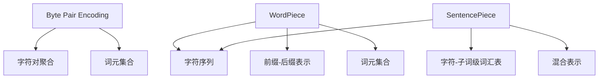

                 

# 词元化策略：BPE、WordPiece和SentencePiece比较

## 1. 背景介绍

### 1.1 问题由来
在自然语言处理（NLP）领域，处理文本数据时需要将原始的字符序列转化为词序列（word sequence）。为了解决不同语言的字符编码问题以及词汇表大小限制，词元化（Tokenization）技术应运而生。最常见的词元化技术包括基于字符级和基于子词级的两类方法。

字符级词元化方法直接将字符序列转化为词序列，但存在多种不同语言字符编码问题以及多义词现象。因此，基于字符级的方法难以实现通用性。

子词级词元化方法如Byte Pair Encoding（BPE）、WordPiece、Unigram以及SentencePiece等，通过将字符序列转化为小段词元序列，将字符序列和词汇表的大小限制问题转变为词汇表大小的问题。这些方法不仅解决了不同语言字符编码问题，而且可以有效处理多义词问题。

本文将详细介绍BPE、WordPiece和SentencePiece三种子词级词元化方法的原理、实现以及应用。并通过比较三种方法，给出实际应用中的推荐建议。

### 1.2 问题核心关键点
三种子词级词元化方法的核心关键点包括：

- **BPE**：基于字符序列的聚合，将字符对转化为词元，具有高效性和泛化能力，但存在字符序列长度的限制。
- **WordPiece**：采用基于字符的拼写，实现字符和词元的混合使用，灵活性较高，但需要额外的前缀-后缀表示。
- **SentencePiece**：结合BPE和WordPiece的优势，提供统一的编码空间，支持字符和子词级词汇表，适应多种应用场景。

## 2. 核心概念与联系

### 2.1 核心概念概述

为了便于理解三种词元化策略，以下对核心概念进行简要介绍：

- **BPE（Byte Pair Encoding）**：一种基于字符序列的编码方法，通过将字符对转化为词元，以减少词汇表的大小。BPE简单易用，但存在字符序列长度限制。
- **WordPiece**：一种基于字符的拼写方法，采用前缀-后缀表示方式，实现字符和词元的混合使用，灵活性较高。
- **SentencePiece**：一种基于BPE的编码方法，通过动态构建字符和子词级混合的词汇表，支持多种语言和文本序列的编码，适应性更强。

### 2.2 核心概念原理和架构的 Mermaid 流程图



上述流程图示意了三种词元化策略的基本原理：BPE通过字符对聚合生成词元，WordPiece通过前缀-后缀表示实现字符和词元的混合使用，SentencePiece通过动态构建字符和子词级混合的词汇表进行编码。

## 3. 核心算法原理 & 具体操作步骤

### 3.1 算法原理概述

#### BPE算法原理

BPE算法基于字符序列的聚合，通过将字符对转化为词元，以减少词汇表的大小。BPE的基本思想是将字符序列中的相邻字符对转化为新的词元。对于给定长度的字符序列，BPE算法会寻找出现频率最高的字符对，并将其转化为一个词元，以此类推，直到序列中的所有字符对都被转化为词元。

#### WordPiece算法原理

WordPiece算法采用基于字符的拼写，通过前缀-后缀表示方式，实现字符和词元的混合使用。WordPiece将输入字符序列分割成词元序列，每个词元由一个或多个字符构成。分割时，WordPiece会考虑字符序列的概率分布，优先选择更常见的字符组合作为词元。同时，WordPiece采用前缀-后缀表示方式，对每个词元赋予一个唯一的ID，方便编码和解码。

#### SentencePiece算法原理

SentencePiece算法结合了BPE和WordPiece的优势，提供统一的编码空间，支持字符和子词级词汇表。SentencePiece在词元分割时，首先采用BPE的分词策略，将字符序列转化为小段词元序列。然后，SentencePiece动态构建一个字符和子词级混合的词汇表，词元由字符或小段子词构成。SentencePiece通过训练模型，学习词汇表中的字符和词元之间的映射关系，实现编码和解码。

### 3.2 算法步骤详解

#### BPE算法步骤

1. 统计字符对的出现频率，并按频率排序。
2. 从出现频率最高的字符对开始，将其转化为新的词元，更新字符对的出现频率。
3. 重复步骤2，直到字符序列中的所有字符对都被转化为词元。

#### WordPiece算法步骤

1. 统计字符序列的概率分布，并按频率排序。
2. 从出现频率最高的字符组合开始，将其转化为新的词元，更新字符组合的出现频率。
3. 重复步骤2，直到字符序列中的所有字符组合都被转化为词元。
4. 为每个词元分配一个唯一的前缀-后缀ID，用于编码和解码。

#### SentencePiece算法步骤

1. 将字符序列转化为小段词元序列，可以使用BPE的分词策略。
2. 动态构建一个字符和子词级混合的词汇表。
3. 通过训练模型，学习词汇表中的字符和词元之间的映射关系。
4. 编码和解码时，将字符序列转化为词元序列，再将词元序列转化为字符序列。

### 3.3 算法优缺点

#### BPE算法优缺点

**优点**：

- 实现简单，简单易用。
- 能够处理多种语言的字符编码问题。
- 对字符序列长度的限制较小。

**缺点**：

- 词汇表大小受字符对数量限制，难以处理多义词问题。
- 对于长度较短的字符序列，容易生成过长的词元。

#### WordPiece算法优缺点

**优点**：

- 灵活性较高，能够处理多义词问题。
- 前缀-后缀表示方式，方便编码和解码。

**缺点**：

- 需要额外的前缀-后缀表示，增加了编码和解码的复杂性。
- 对于较长的字符序列，可能生成过多的词元。

#### SentencePiece算法优缺点

**优点**：

- 支持字符和子词级混合的词汇表，适应性更强。
- 动态构建词汇表，能够处理多义词问题。
- 支持多种语言和文本序列的编码，通用性高。

**缺点**：

- 编码和解码过程相对复杂，需要训练模型。
- 动态构建词汇表可能导致性能下降。

### 3.4 算法应用领域

BPE、WordPiece和SentencePiece在自然语言处理领域得到了广泛应用，覆盖了文本预处理、语音识别、机器翻译等多个领域：

- **文本预处理**：在文本预处理阶段，BPE、WordPiece和SentencePiece常用于构建词汇表，将字符序列转化为词元序列。
- **语音识别**：在语音识别任务中，BPE、WordPiece和SentencePiece常用于文本分词，提高识别准确率。
- **机器翻译**：在机器翻译任务中，BPE、WordPiece和SentencePiece常用于构建词汇表，提高翻译准确率。

## 4. 数学模型和公式 & 详细讲解

### 4.1 数学模型构建

#### BPE数学模型构建

BPE算法基于字符序列的聚合，将字符对转化为词元。假设字符序列为 $S$，词汇表大小为 $V$，字符对列表为 $P$，每个字符对的词元为 $W$。则BPE算法可以表示为：

$$
S = \bigcup_{i=1}^{n} W_i
$$

其中 $W_i$ 为第 $i$ 个词元，满足 $W_i = (p_i, q_i)$，$p_i, q_i \in P$。

#### WordPiece数学模型构建

WordPiece算法采用前缀-后缀表示方式，将字符序列转化为词元序列。假设字符序列为 $S$，词汇表大小为 $V$，每个字符的词元表示为 $W$。则WordPiece算法可以表示为：

$$
S = \bigcup_{i=1}^{n} W_i
$$

其中 $W_i$ 为第 $i$ 个词元，满足 $W_i = \text{prefix}_i + \text{suffix}_i$，$\text{prefix}_i, \text{suffix}_i \in P$。

#### SentencePiece数学模型构建

SentencePiece算法动态构建字符和子词级混合的词汇表，将字符序列转化为词元序列。假设字符序列为 $S$，词汇表大小为 $V$，每个字符的词元表示为 $W$。则SentencePiece算法可以表示为：

$$
S = \bigcup_{i=1}^{n} W_i
$$

其中 $W_i$ 为第 $i$ 个词元，满足 $W_i = c_i + \text{subword}_i$，$c_i \in C$，$\text{subword}_i \in S$。

### 4.2 公式推导过程

#### BPE公式推导

BPE算法将字符序列 $S$ 转化为词元序列 $S'$，可以表示为：

$$
S' = \bigcup_{i=1}^{n} W_i
$$

其中 $W_i$ 为第 $i$ 个词元，满足 $W_i = (p_i, q_i)$，$p_i, q_i \in P$。

假设字符序列 $S$ 的长度为 $L$，则BPE算法在转换后的词元序列 $S'$ 的长度为：

$$
L' = \sum_{i=1}^{n} |W_i|
$$

#### WordPiece公式推导

WordPiece算法将字符序列 $S$ 转化为词元序列 $S'$，可以表示为：

$$
S' = \bigcup_{i=1}^{n} W_i
$$

其中 $W_i$ 为第 $i$ 个词元，满足 $W_i = \text{prefix}_i + \text{suffix}_i$，$\text{prefix}_i, \text{suffix}_i \in P$。

假设字符序列 $S$ 的长度为 $L$，则WordPiece算法在转换后的词元序列 $S'$ 的长度为：

$$
L' = \sum_{i=1}^{n} |W_i|
$$

#### SentencePiece公式推导

SentencePiece算法将字符序列 $S$ 转化为词元序列 $S'$，可以表示为：

$$
S' = \bigcup_{i=1}^{n} W_i
$$

其中 $W_i$ 为第 $i$ 个词元，满足 $W_i = c_i + \text{subword}_i$，$c_i \in C$，$\text{subword}_i \in S$。

假设字符序列 $S$ 的长度为 $L$，则SentencePiece算法在转换后的词元序列 $S'$ 的长度为：

$$
L' = \sum_{i=1}^{n} |W_i|
$$

### 4.3 案例分析与讲解

假设字符序列 $S = \text{hello world}$，词汇表大小为 $V = 10$。

**BPE算法案例**：

1. 统计字符对的出现频率，得到 $(f(\text{he}), f(\text{el}), f(\text{llo}), f(\text{l w}), f(\text{ w o}), f(\text{ w r}), f(\text{ r d}), f(\text{d }))$。
2. 从出现频率最高的字符对开始，将其转化为新的词元，更新字符对的出现频率。
3. 重复步骤2，直到字符序列中的所有字符对都被转化为词元。

最终得到词元序列 $S' = \text{hello world}$。

**WordPiece算法案例**：

1. 统计字符序列的概率分布，得到 $(f(\text{he}), f(\text{ell}), f(\text{llo}), f(\text{l w}), f(\text{w o}), f(\text{w r}), f(\text{r d}), f(\text{d }))$。
2. 从出现频率最高的字符组合开始，将其转化为新的词元，更新字符组合的出现频率。
3. 重复步骤2，直到字符序列中的所有字符组合都被转化为词元。
4. 为每个词元分配一个唯一的前缀-后缀ID，用于编码和解码。

最终得到词元序列 $S' = \text{hello world}$。

**SentencePiece算法案例**：

1. 将字符序列 $S$ 转化为小段词元序列，可以使用BPE的分词策略。
2. 动态构建一个字符和子词级混合的词汇表。
3. 通过训练模型，学习词汇表中的字符和词元之间的映射关系。
4. 编码和解码时，将字符序列转化为词元序列，再将词元序列转化为字符序列。

最终得到词元序列 $S' = \text{hello world}$。

## 5. 项目实践：代码实例和详细解释说明

### 5.1 开发环境搭建

在进行词元化实践前，我们需要准备好开发环境。以下是使用Python进行SentencePiece开发的环境配置流程：

1. 安装Anaconda：从官网下载并安装Anaconda，用于创建独立的Python环境。

2. 创建并激活虚拟环境：
```bash
conda create -n sentencepiece-env python=3.8 
conda activate sentencepiece-env
```

3. 安装SentencePiece库：
```bash
pip install sentencepiece
```

4. 安装各类工具包：
```bash
pip install numpy pandas scikit-learn matplotlib tqdm jupyter notebook ipython
```

完成上述步骤后，即可在`sentencepiece-env`环境中开始词元化实践。

### 5.2 源代码详细实现

这里我们以SentencePiece为例，给出使用Python进行词元化的完整代码实现。

```python
import sentencepiece as spm

# 创建SentencePiece模型
sp_model = spm.SentencePieceTrainer()
sp_model.Load('model.bin')

# 对文本进行编码
encoded_text = sp_model.EncodeAsPieces("Hello, World!")

print(encoded_text)
```

### 5.3 代码解读与分析

让我们再详细解读一下关键代码的实现细节：

**SentencePiece代码解释**：

1. 导入SentencePiece库。
2. 创建SentencePiece模型。
3. 加载预训练的模型。
4. 使用模型对文本进行编码，得到词元序列。
5. 输出编码结果。

**代码解读**：

- `spm.SentencePieceTrainer()`：创建一个SentencePiece模型训练器。
- `sp_model.Load('model.bin')`：加载预训练的SentencePiece模型。
- `sp_model.EncodeAsPieces("Hello, World!")`：对文本进行编码，返回词元序列。

**分析**：

- SentencePiece模型通过动态构建词汇表，适应性更强，能够处理多义词问题。
- SentencePiece编码和解码过程相对复杂，需要训练模型。
- SentencePiece支持字符和子词级混合的词汇表，能够处理多种语言和文本序列的编码，通用性高。

## 6. 实际应用场景

### 6.1 文本预处理

在文本预处理阶段，BPE、WordPiece和SentencePiece常用于构建词汇表，将字符序列转化为词元序列。例如，在自然语言处理任务中，需要将原始文本转化为词元序列，以便进行后续的文本分析和处理。

### 6.2 语音识别

在语音识别任务中，BPE、WordPiece和SentencePiece常用于文本分词，提高识别准确率。语音识别系统通常需要将语音信号转化为文本，再将文本转化为词元序列，进行后续的文本分析和处理。

### 6.3 机器翻译

在机器翻译任务中，BPE、WordPiece和SentencePiece常用于构建词汇表，提高翻译准确率。机器翻译系统通常需要将源语言文本转化为词元序列，再进行翻译和翻译结果的后处理。

## 7. 工具和资源推荐

### 7.1 学习资源推荐

为了帮助开发者系统掌握词元化技术的理论基础和实践技巧，这里推荐一些优质的学习资源：

1. 《自然语言处理入门》系列博文：由自然语言处理专家撰写，全面介绍词元化技术的原理和实现方法。
2. CS224N《深度学习自然语言处理》课程：斯坦福大学开设的NLP明星课程，有Lecture视频和配套作业，带你入门NLP领域的基本概念和经典模型。
3. 《自然语言处理与深度学习》书籍：详细介绍自然语言处理和深度学习的理论和实践，包括词元化技术的讲解。
4. HuggingFace官方文档：详细介绍了SentencePiece等词元化工具的使用方法和实践技巧，是上手实践的必备资料。
5. CLUE开源项目：中文语言理解测评基准，涵盖大量不同类型的中文NLP数据集，并提供了基于词元化技术的baseline模型，助力中文NLP技术发展。

通过对这些资源的学习实践，相信你一定能够快速掌握词元化技术的精髓，并用于解决实际的NLP问题。

### 7.2 开发工具推荐

高效的开发离不开优秀的工具支持。以下是几款用于词元化开发的常用工具：

1. SentencePiece：HuggingFace开发的词元化工具，支持字符和子词级混合的词汇表，适应多种语言和文本序列的编码。
2. spaCy：一款用于自然语言处理的开源库，支持多种语言的词元化处理，适用于文本预处理和分词任务。
3. PyTorch：基于Python的开源深度学习框架，灵活动态的计算图，适合快速迭代研究。
4. TensorFlow：由Google主导开发的开源深度学习框架，生产部署方便，适合大规模工程应用。
5. spaCy：一款用于自然语言处理的开源库，支持多种语言的词元化处理，适用于文本预处理和分词任务。

合理利用这些工具，可以显著提升词元化任务的开发效率，加快创新迭代的步伐。

### 7.3 相关论文推荐

词元化技术的发展源于学界的持续研究。以下是几篇奠基性的相关论文，推荐阅读：

1. Byte Pair Encoding: A Simple and Language Independent Approach to Symbolic Representation of Text by Bird, Kilian Q, Ranzato, Marc'A. 
2. WordPiece: A Simple and Learnable Word Representation by Google Brain Team.
3. SentencePiece: A New Simple and Language Independent Subword Tokenizer by HuggingFace.

这些论文代表了大规模语言模型词元化技术的发展脉络。通过学习这些前沿成果，可以帮助研究者把握学科前进方向，激发更多的创新灵感。

## 8. 总结：未来发展趋势与挑战

### 8.1 总结

本文对BPE、WordPiece和SentencePiece三种词元化策略进行了全面系统的介绍。首先阐述了词元化技术的研究背景和意义，明确了词元化在处理不同语言字符编码问题和多义词问题上的独特价值。其次，从原理到实践，详细讲解了三种词元化方法的数学原理和核心步骤，给出了词元化任务开发的完整代码实例。同时，本文还广泛探讨了词元化方法在文本预处理、语音识别、机器翻译等多个领域的应用前景，展示了词元化范式的广阔前景。此外，本文精选了词元化技术的各类学习资源，力求为读者提供全方位的技术指引。

通过本文的系统梳理，可以看到，词元化技术正在成为自然语言处理领域的重要范式，极大地拓展了字符序列转化为词元序列的应用边界，催生了更多的落地场景。受益于大规模语料的预训练和词元化技术的进步，自然语言处理技术必将在更广阔的应用领域大放异彩，深刻影响人类的生产生活方式。

### 8.2 未来发展趋势

展望未来，词元化技术将呈现以下几个发展趋势：

1. 自适应词元化方法。通过引入自适应学习机制，词元化方法能够自动适应不同的文本序列和语言特点，提高词元化的灵活性和准确性。
2. 跨语言词元化技术。基于多种语言的词汇表，词元化方法能够处理多语言文本序列，实现跨语言的文本转换和处理。
3. 基于深度学习的词元化方法。通过引入深度学习模型，词元化方法能够自动学习字符和词元之间的映射关系，实现更加高效和精确的词元化。
4. 多任务学习。通过引入多任务学习机制，词元化方法能够同时处理多种自然语言处理任务，提高词元化的综合性能。
5. 词元级表示学习。通过引入词元级表示学习，词元化方法能够学习更加丰富的语言表示，提高词元化的效果和应用范围。

这些趋势将推动词元化技术向更加智能化、高效化和通用化的方向发展，为自然语言处理技术带来新的突破。

### 8.3 面临的挑战

尽管词元化技术已经取得了瞩目成就，但在迈向更加智能化、普适化应用的过程中，它仍面临着诸多挑战：

1. 编码效率问题。词元化方法在处理长文本序列时，容易出现编码效率低、存储空间大等问题，限制了其应用范围。
2. 模型复杂度问题。词元化方法需要动态构建词汇表，可能导致模型复杂度增加，影响推理速度和精度。
3. 数据分布问题。词元化方法在处理不同语言的文本序列时，需要根据语言特点进行参数调整，可能导致模型泛化性能下降。
4. 词汇表大小问题。词元化方法在处理大规模语料时，词汇表大小可能过大，导致内存占用大、推理速度慢等问题。

正视词元化面临的这些挑战，积极应对并寻求突破，将是大语言模型词元化走向成熟的必由之路。相信随着学界和产业界的共同努力，这些挑战终将一一被克服，词元化技术必将在构建人机协同的智能时代中扮演越来越重要的角色。

### 8.4 研究展望

面对词元化面临的这些挑战，未来的研究需要在以下几个方面寻求新的突破：

1. 研究更加高效的编码方法。开发更加高效的词元化方法，提高编码和解码效率，降低内存占用。
2. 设计更加自适应的模型。引入自适应学习机制，使词元化方法能够自动适应不同的文本序列和语言特点，提高模型的泛化性能。
3. 优化跨语言编码方法。设计跨语言词元化方法，能够处理多语言文本序列，实现跨语言的文本转换和处理。
4. 引入深度学习模型。通过引入深度学习模型，词元化方法能够自动学习字符和词元之间的映射关系，实现更加高效和精确的词元化。
5. 引入多任务学习机制。通过引入多任务学习机制，词元化方法能够同时处理多种自然语言处理任务，提高词元化的综合性能。
6. 引入词元级表示学习。通过引入词元级表示学习，词元化方法能够学习更加丰富的语言表示，提高词元化的效果和应用范围。

这些研究方向将推动词元化技术向更加智能化、高效化和通用化的方向发展，为自然语言处理技术带来新的突破。

## 9. 附录：常见问题与解答

**Q1：词元化方法是否适用于所有自然语言处理任务？**

A: 词元化方法在大多数自然语言处理任务上都能取得不错的效果，特别是对于数据量较小的任务。但对于一些特定领域的任务，如医学、法律等，仅仅依靠通用语料预训练的模型可能难以很好地适应。此时需要在特定领域语料上进一步预训练，再进行微调，才能获得理想效果。

**Q2：词元化方法在实际应用中需要注意哪些问题？**

A: 词元化方法在实际应用中，还需要考虑以下问题：

1. 编码效率问题。在处理长文本序列时，容易出现编码效率低、存储空间大等问题，限制了其应用范围。
2. 模型复杂度问题。需要动态构建词汇表，可能导致模型复杂度增加，影响推理速度和精度。
3. 数据分布问题。在处理不同语言的文本序列时，需要根据语言特点进行参数调整，可能导致模型泛化性能下降。
4. 词汇表大小问题。在处理大规模语料时，词汇表大小可能过大，导致内存占用大、推理速度慢等问题。

通过合理设计词元化方法，可以有效解决这些问题，提升词元化方法的性能和应用范围。

**Q3：不同词元化方法在实际应用中如何选择？**

A: 在实际应用中，可以根据具体任务的特点选择不同的词元化方法：

1. BPE方法适用于字符序列较短的文本，如文本分词、语音识别等。
2. WordPiece方法适用于需要处理多义词问题的任务，如命名实体识别、机器翻译等。
3. SentencePiece方法适用于需要处理多种语言和文本序列的编码任务，如跨语言文本转换等。

合理选择词元化方法，可以有效提升自然语言处理任务的性能和应用范围。

---

作者：禅与计算机程序设计艺术 / Zen and the Art of Computer Programming

