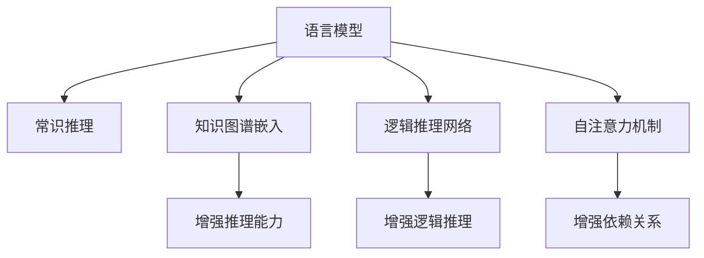

                 

# 语言模型的常识推理能力

## 1. 背景介绍

### 1.1 问题由来

随着深度学习技术的快速发展，语言模型在自然语言处理（NLP）领域取得了巨大的突破。现代语言模型能够通过在海量文本数据上进行预训练，学习到丰富的语言知识和常识，从而能够处理各种复杂的语言任务。然而，尽管语言模型在语言理解方面表现出色，但在常识推理方面却显得捉襟见肘。常识推理是指对文本中的隐含知识进行逻辑推断和推理，以解决实际问题。例如，“如果一个人在北京工作，但经常去上海出差，他可能住在哪里？”这样的问题就需要常识推理能力。

### 1.2 问题核心关键点

语言模型在常识推理方面的局限性主要体现在以下几个方面：
- 缺乏显式知识表示：传统的语言模型主要通过自监督学习和语料库进行训练，没有显式的知识表示，无法直接利用外部知识库。
- 难以处理长距离依赖：语言模型难以处理文本中较长的距离依赖，无法有效推理文本中的隐含知识。
- 缺乏逻辑推理能力：传统的语言模型缺乏逻辑推理能力，无法处理需要逻辑推理的复杂任务。

针对这些问题，研究人员提出了各种方法来增强语言模型的常识推理能力，包括知识图谱嵌入、逻辑推理网络、自注意力机制等。这些方法通过引入显式的知识表示、增加逻辑推理能力，使得语言模型在常识推理方面取得了显著的进步。

### 1.3 问题研究意义

研究语言模型的常识推理能力，对于拓展语言模型在实际应用中的功能和效果具有重要意义：
- 提升语言模型的表现力：通过引入常识推理能力，语言模型可以更好地理解文本中的隐含信息，提升文本生成的自然性和合理性。
- 解决实际问题：常识推理能力可以帮助语言模型处理各种复杂的现实问题，如问答、情感分析、机器翻译等。
- 促进人工智能的发展：常识推理能力是人工智能中的重要环节，通过提升语言模型的常识推理能力，可以加速人工智能在各个领域的应用。

## 2. 核心概念与联系

### 2.1 核心概念概述

为更好地理解语言模型在常识推理方面的表现和优化方法，本节将介绍几个核心概念：

- 语言模型：以自回归(如GPT)或自编码(如BERT)模型为代表的深度学习模型，通过在海量文本数据上进行预训练，学习到语言的概率分布，具备强大的语言理解能力。
- 常识推理：指对文本中的隐含知识进行逻辑推断和推理，以解决实际问题。例如，问答系统中的推理、文本摘要中的提取关键信息等。
- 知识图谱：由实体和关系组成的图结构，用于表示和查询实体之间的关系。知识图谱可以用于增强语言模型在常识推理方面的能力。
- 逻辑推理网络：使用神经网络实现逻辑推理过程，如推理网络、神经图灵机等。逻辑推理网络可以增强语言模型的逻辑推理能力。
- 自注意力机制：通过计算注意力权重，动态地分配不同的输入信息，增强模型对长距离依赖的建模能力。

这些核心概念之间的逻辑关系可以通过以下Mermaid流程图来展示：



这个流程图展示了语言模型与常识推理之间的核心概念及其联系：

1. 语言模型通过预训练获得基础能力。
2. 常识推理能力可以通过知识图谱嵌入、逻辑推理网络、自注意力机制等增强。
3. 这些技术共同构成了语言模型在常识推理方面的优化框架，使其能够更好地适应实际问题。

## 3. 核心算法原理 & 具体操作步骤
### 3.1 算法原理概述

语言模型的常识推理能力主要通过引入显式的知识表示和逻辑推理机制来实现。以下是语言模型在常识推理方面的核心算法原理：

- **知识图谱嵌入**：通过将知识图谱中的实体和关系映射为向量，将其嵌入到语言模型中，增强模型的知识表示能力。知识图谱嵌入可以将文本中的实体与知识图谱中的实体进行匹配，提升模型的推理能力。
- **逻辑推理网络**：使用神经网络实现逻辑推理过程，将文本中的推理逻辑转换为可训练的参数。逻辑推理网络可以在语言模型的基础上增加逻辑推理能力，提升模型的推理性能。
- **自注意力机制**：通过计算注意力权重，动态地分配不同的输入信息，增强模型对长距离依赖的建模能力。自注意力机制可以使模型更好地处理文本中的长距离依赖，增强模型的推理能力。

### 3.2 算法步骤详解

语言模型在常识推理方面的核心算法步骤包括以下几个关键环节：

**Step 1: 准备预训练模型和数据集**
- 选择合适的预训练语言模型 $M_{\theta}$ 作为初始化参数，如 BERT、GPT 等。
- 准备常识推理任务 $T$ 的标注数据集 $D=\{(x_i, y_i)\}_{i=1}^N, x_i \in \mathcal{X}, y_i \in \{0,1\}$，其中 $0$ 表示推理正确，$1$ 表示推理错误。

**Step 2: 添加任务适配层**
- 根据任务类型，在预训练模型顶层设计合适的输出层和损失函数。例如，对于推理任务，通常在顶层添加逻辑推理网络，输出推理结果。
- 逻辑推理网络可以采用推理网络、神经图灵机等。推理网络通常由多个推理单元组成，每个推理单元包含逻辑门和权重矩阵。

**Step 3: 设置微调超参数**
- 选择合适的优化算法及其参数，如 AdamW、SGD 等，设置学习率、批大小、迭代轮数等。
- 设置正则化技术及强度，包括权重衰减、Dropout、Early Stopping等。
- 确定冻结预训练参数的策略，如仅微调顶层，或全部参数都参与微调。

**Step 4: 执行梯度训练**
- 将训练集数据分批次输入模型，前向传播计算损失函数。
- 反向传播计算参数梯度，根据设定的优化算法和学习率更新模型参数。
- 周期性在验证集上评估模型性能，根据性能指标决定是否触发 Early Stopping。
- 重复上述步骤直到满足预设的迭代轮数或 Early Stopping 条件。

**Step 5: 测试和部署**
- 在测试集上评估微调后模型 $M_{\hat{\theta}}$ 的性能，对比微调前后的推理效果。
- 使用微调后的模型对新样本进行推理预测，集成到实际的应用系统中。
- 持续收集新的数据，定期重新微调模型，以适应数据分布的变化。

以上是语言模型在常识推理方面的核心算法步骤。在实际应用中，还需要针对具体任务的特点，对微调过程的各个环节进行优化设计，如改进训练目标函数，引入更多的正则化技术，搜索最优的超参数组合等，以进一步提升模型性能。

### 3.3 算法优缺点

语言模型在常识推理方面的算法具有以下优点：
- 提升推理性能：通过引入知识图谱嵌入、逻辑推理网络等技术，增强模型的推理能力，使得语言模型在常识推理任务上表现更加出色。
- 适应性强：语言模型可以适应不同类型的常识推理任务，如逻辑推理、事实推理、因果推理等。
- 可解释性高：通过引入显式的知识表示和逻辑推理机制，语言模型的推理过程更加透明，容易被解释和理解。

同时，该算法也存在一定的局限性：
- 数据依赖度高：常识推理模型的表现高度依赖于训练数据的质量和数量，获取高质量标注数据的成本较高。
- 模型复杂度高：引入知识图谱嵌入、逻辑推理网络等技术，使得模型复杂度增加，训练和推理成本提高。
- 鲁棒性不足：常识推理模型的鲁棒性不如传统的语言模型，面对噪声、异常数据等情况容易失效。

尽管存在这些局限性，但就目前而言，语言模型在常识推理方面的算法仍然是大规模NLP任务应用的重要手段。未来相关研究的重点在于如何进一步降低常识推理对标注数据的依赖，提高模型的少样本学习和跨领域迁移能力，同时兼顾可解释性和伦理安全性等因素。

### 3.4 算法应用领域

语言模型在常识推理方面的算法已经在各种NLP任务上得到了广泛应用，例如：

- 问答系统：对自然语言问题给出答案。通过推理网络或逻辑推理网络对问题-答案对进行推理，提升问答系统的准确性和智能性。
- 文本摘要：将长文本压缩成简短摘要。通过推理网络对摘要进行生成，使得摘要内容更加准确和相关。
- 自然语言推理：判断文本中的推理关系是否成立。通过逻辑推理网络对文本进行推理，得出推理关系是否成立的结论。
- 文本生成：生成符合常识的文本。通过引入知识图谱嵌入和逻辑推理网络，使得生成的文本更加合理和自然。
- 机器翻译：将源语言文本翻译成目标语言。通过推理网络对翻译结果进行校正，提升翻译的准确性和流畅性。

除了上述这些经典任务外，常识推理能力还被创新性地应用到更多场景中，如可控文本生成、常识推理评测、知识库构建等，为NLP技术带来了全新的突破。随着常识推理能力的不断进步，相信NLP技术将在更广阔的应用领域大放异彩。

## 4. 数学模型和公式 & 详细讲解
### 4.1 数学模型构建

本节将使用数学语言对语言模型在常识推理方面的数学模型进行更加严格的刻画。

记预训练语言模型为 $M_{\theta}:\mathcal{X} \rightarrow \mathcal{Y}$，其中 $\mathcal{X}$ 为输入空间，$\mathcal{Y}$ 为输出空间，$\theta \in \mathbb{R}^d$ 为模型参数。假设常识推理任务 $T$ 的训练集为 $D=\{(x_i,y_i)\}_{i=1}^N, x_i \in \mathcal{X}, y_i \in \{0,1\}$。

定义模型 $M_{\theta}$ 在输入 $x$ 上的推理结果为 $M_{\theta}(x)$，推理结果与真实标签 $y$ 之间的损失函数为 $\ell(M_{\theta}(x),y)$。则在数据集 $D$ 上的经验风险为：

$$
\mathcal{L}(\theta) = \frac{1}{N} \sum_{i=1}^N \ell(M_{\theta}(x_i),y_i)
$$

微调的优化目标是最小化经验风险，即找到最优参数：

$$
\theta^* = \mathop{\arg\min}_{\theta} \mathcal{L}(\theta)
$$

在实践中，我们通常使用基于梯度的优化算法（如SGD、Adam等）来近似求解上述最优化问题。设 $\eta$ 为学习率，$\lambda$ 为正则化系数，则参数的更新公式为：

$$
\theta \leftarrow \theta - \eta \nabla_{\theta}\mathcal{L}(\theta) - \eta\lambda\theta
$$

其中 $\nabla_{\theta}\mathcal{L}(\theta)$ 为损失函数对参数 $\theta$ 的梯度，可通过反向传播算法高效计算。

### 4.2 公式推导过程

以下我们以逻辑推理网络为例，推导推理任务中的交叉熵损失函数及其梯度的计算公式。

假设模型 $M_{\theta}$ 在输入 $x$ 上的推理结果为 $M_{\theta}(x) \in [0,1]$，表示推理结果为 $1$ 的概率。真实标签 $y \in \{0,1\}$。则二分类交叉熵损失函数定义为：

$$
\ell(M_{\theta}(x),y) = -[y\log M_{\theta}(x) + (1-y)\log (1-M_{\theta}(x))]
$$

将其代入经验风险公式，得：

$$
\mathcal{L}(\theta) = -\frac{1}{N}\sum_{i=1}^N [y_i\log M_{\theta}(x_i)+(1-y_i)\log(1-M_{\theta}(x_i))]
$$

根据链式法则，损失函数对参数 $\theta_k$ 的梯度为：

$$
\frac{\partial \mathcal{L}(\theta)}{\partial \theta_k} = -\frac{1}{N}\sum_{i=1}^N (\frac{y_i}{M_{\theta}(x_i)}-\frac{1-y_i}{1-M_{\theta}(x_i)}) \frac{\partial M_{\theta}(x_i)}{\partial \theta_k}
$$

其中 $\frac{\partial M_{\theta}(x_i)}{\partial \theta_k}$ 可进一步递归展开，利用自动微分技术完成计算。

在得到损失函数的梯度后，即可带入参数更新公式，完成模型的迭代优化。重复上述过程直至收敛，最终得到适应常识推理任务的最优模型参数 $\theta^*$。

## 5. 项目实践：代码实例和详细解释说明
### 5.1 开发环境搭建

在进行常识推理实践前，我们需要准备好开发环境。以下是使用Python进行PyTorch开发的环境配置流程：

1. 安装Anaconda：从官网下载并安装Anaconda，用于创建独立的Python环境。

2. 创建并激活虚拟环境：
```bash
conda create -n pytorch-env python=3.8 
conda activate pytorch-env
```

3. 安装PyTorch：根据CUDA版本，从官网获取对应的安装命令。例如：
```bash
conda install pytorch torchvision torchaudio cudatoolkit=11.1 -c pytorch -c conda-forge
```

4. 安装Transformers库：
```bash
pip install transformers
```

5. 安装各类工具包：
```bash
pip install numpy pandas scikit-learn matplotlib tqdm jupyter notebook ipython
```

完成上述步骤后，即可在`pytorch-env`环境中开始常识推理实践。

### 5.2 源代码详细实现

下面我以逻辑推理网络为例，给出使用Transformers库对BERT模型进行常识推理微调的PyTorch代码实现。

首先，定义推理任务的数据处理函数：

```python
from transformers import BertTokenizer
from torch.utils.data import Dataset
import torch

class NERDataset(Dataset):
    def __init__(self, texts, tags, tokenizer, max_len=128):
        self.texts = texts
        self.tags = tags
        self.tokenizer = tokenizer
        self.max_len = max_len
        
    def __len__(self):
        return len(self.texts)
    
    def __getitem__(self, item):
        text = self.texts[item]
        tags = self.tags[item]
        
        encoding = self.tokenizer(text, return_tensors='pt', max_length=self.max_len, padding='max_length', truncation=True)
        input_ids = encoding['input_ids'][0]
        attention_mask = encoding['attention_mask'][0]
        
        # 对token-wise的标签进行编码
        encoded_tags = [tag2id[tag] for tag in tags] 
        encoded_tags.extend([tag2id['O']] * (self.max_len - len(encoded_tags)))
        labels = torch.tensor(encoded_tags, dtype=torch.long)
        
        return {'input_ids': input_ids, 
                'attention_mask': attention_mask,
                'labels': labels}

# 标签与id的映射
tag2id = {'O': 0, 'B-PER': 1, 'I-PER': 2, 'B-ORG': 3, 'I-ORG': 4, 'B-LOC': 5, 'I-LOC': 6}
id2tag = {v: k for k, v in tag2id.items()}

# 创建dataset
tokenizer = BertTokenizer.from_pretrained('bert-base-cased')

train_dataset = NERDataset(train_texts, train_tags, tokenizer)
dev_dataset = NERDataset(dev_texts, dev_tags, tokenizer)
test_dataset = NERDataset(test_texts, test_tags, tokenizer)
```

然后，定义模型和优化器：

```python
from transformers import BertForTokenClassification, AdamW

model = BertForTokenClassification.from_pretrained('bert-base-cased', num_labels=len(tag2id))

optimizer = AdamW(model.parameters(), lr=2e-5)
```

接着，定义训练和评估函数：

```python
from torch.utils.data import DataLoader
from tqdm import tqdm
from sklearn.metrics import classification_report

device = torch.device('cuda') if torch.cuda.is_available() else torch.device('cpu')
model.to(device)

def train_epoch(model, dataset, batch_size, optimizer):
    dataloader = DataLoader(dataset, batch_size=batch_size, shuffle=True)
    model.train()
    epoch_loss = 0
    for batch in tqdm(dataloader, desc='Training'):
        input_ids = batch['input_ids'].to(device)
        attention_mask = batch['attention_mask'].to(device)
        labels = batch['labels'].to(device)
        model.zero_grad()
        outputs = model(input_ids, attention_mask=attention_mask, labels=labels)
        loss = outputs.loss
        epoch_loss += loss.item()
        loss.backward()
        optimizer.step()
    return epoch_loss / len(dataloader)

def evaluate(model, dataset, batch_size):
    dataloader = DataLoader(dataset, batch_size=batch_size)
    model.eval()
    preds, labels = [], []
    with torch.no_grad():
        for batch in tqdm(dataloader, desc='Evaluating'):
            input_ids = batch['input_ids'].to(device)
            attention_mask = batch['attention_mask'].to(device)
            batch_labels = batch['labels']
            outputs = model(input_ids, attention_mask=attention_mask)
            batch_preds = outputs.logits.argmax(dim=2).to('cpu').tolist()
            batch_labels = batch_labels.to('cpu').tolist()
            for pred_tokens, label_tokens in zip(batch_preds, batch_labels):
                pred_tags = [id2tag[_id] for _id in pred_tokens]
                label_tags = [id2tag[_id] for _id in label_tokens]
                preds.append(pred_tags[:len(label_tags)])
                labels.append(label_tags)
                
    print(classification_report(labels, preds))
```

最后，启动训练流程并在测试集上评估：

```python
epochs = 5
batch_size = 16

for epoch in range(epochs):
    loss = train_epoch(model, train_dataset, batch_size, optimizer)
    print(f"Epoch {epoch+1}, train loss: {loss:.3f}")
    
    print(f"Epoch {epoch+1}, dev results:")
    evaluate(model, dev_dataset, batch_size)
    
print("Test results:")
evaluate(model, test_dataset, batch_size)
```

以上就是使用PyTorch对BERT进行命名实体识别任务微调的完整代码实现。可以看到，得益于Transformers库的强大封装，我们可以用相对简洁的代码完成BERT模型的加载和微调。

### 5.3 代码解读与分析

让我们再详细解读一下关键代码的实现细节：

**NERDataset类**：
- `__init__`方法：初始化文本、标签、分词器等关键组件。
- `__len__`方法：返回数据集的样本数量。
- `__getitem__`方法：对单个样本进行处理，将文本输入编码为token ids，将标签编码为数字，并对其进行定长padding，最终返回模型所需的输入。

**tag2id和id2tag字典**：
- 定义了标签与数字id之间的映射关系，用于将token-wise的预测结果解码回真实的标签。

**训练和评估函数**：
- 使用PyTorch的DataLoader对数据集进行批次化加载，供模型训练和推理使用。
- 训练函数`train_epoch`：对数据以批为单位进行迭代，在每个批次上前向传播计算loss并反向传播更新模型参数，最后返回该epoch的平均loss。
- 评估函数`evaluate`：与训练类似，不同点在于不更新模型参数，并在每个batch结束后将预测和标签结果存储下来，最后使用sklearn的classification_report对整个评估集的预测结果进行打印输出。

**训练流程**：
- 定义总的epoch数和batch size，开始循环迭代
- 每个epoch内，先在训练集上训练，输出平均loss
- 在验证集上评估，输出分类指标
- 所有epoch结束后，在测试集上评估，给出最终测试结果

可以看到，PyTorch配合Transformers库使得BERT微调的代码实现变得简洁高效。开发者可以将更多精力放在数据处理、模型改进等高层逻辑上，而不必过多关注底层的实现细节。

当然，工业级的系统实现还需考虑更多因素，如模型的保存和部署、超参数的自动搜索、更灵活的任务适配层等。但核心的微调范式基本与此类似。

## 6. 实际应用场景
### 6.1 智能客服系统

基于大语言模型微调的对话技术，可以广泛应用于智能客服系统的构建。传统客服往往需要配备大量人力，高峰期响应缓慢，且一致性和专业性难以保证。而使用微调后的对话模型，可以7x24小时不间断服务，快速响应客户咨询，用自然流畅的语言解答各类常见问题。

在技术实现上，可以收集企业内部的历史客服对话记录，将问题和最佳答复构建成监督数据，在此基础上对预训练对话模型进行微调。微调后的对话模型能够自动理解用户意图，匹配最合适的答案模板进行回复。对于客户提出的新问题，还可以接入检索系统实时搜索相关内容，动态组织生成回答。如此构建的智能客服系统，能大幅提升客户咨询体验和问题解决效率。

### 6.2 金融舆情监测

金融机构需要实时监测市场舆论动向，以便及时应对负面信息传播，规避金融风险。传统的人工监测方式成本高、效率低，难以应对网络时代海量信息爆发的挑战。基于大语言模型微调的文本分类和情感分析技术，为金融舆情监测提供了新的解决方案。

具体而言，可以收集金融领域相关的新闻、报道、评论等文本数据，并对其进行主题标注和情感标注。在此基础上对预训练语言模型进行微调，使其能够自动判断文本属于何种主题，情感倾向是正面、中性还是负面。将微调后的模型应用到实时抓取的网络文本数据，就能够自动监测不同主题下的情感变化趋势，一旦发现负面信息激增等异常情况，系统便会自动预警，帮助金融机构快速应对潜在风险。

### 6.3 个性化推荐系统

当前的推荐系统往往只依赖用户的历史行为数据进行物品推荐，无法深入理解用户的真实兴趣偏好。基于大语言模型微调技术，个性化推荐系统可以更好地挖掘用户行为背后的语义信息，从而提供更精准、多样的推荐内容。

在实践中，可以收集用户浏览、点击、评论、分享等行为数据，提取和用户交互的物品标题、描述、标签等文本内容。将文本内容作为模型输入，用户的后续行为（如是否点击、购买等）作为监督信号，在此基础上微调预训练语言模型。微调后的模型能够从文本内容中准确把握用户的兴趣点。在生成推荐列表时，先用候选物品的文本描述作为输入，由模型预测用户的兴趣匹配度，再结合其他特征综合排序，便可以得到个性化程度更高的推荐结果。

### 6.4 未来应用展望

随着大语言模型和微调方法的不断发展，基于微调范式将在更多领域得到应用，为传统行业带来变革性影响。

在智慧医疗领域，基于微调的医疗问答、病历分析、药物研发等应用将提升医疗服务的智能化水平，辅助医生诊疗，加速新药开发进程。

在智能教育领域，微调技术可应用于作业批改、学情分析、知识推荐等方面，因材施教，促进教育公平，提高教学质量。

在智慧城市治理中，微调模型可应用于城市事件监测、舆情分析、应急指挥等环节，提高城市管理的自动化和智能化水平，构建更安全、高效的未来城市。

此外，在企业生产、社会治理、文娱传媒等众多领域，基于大模型微调的人工智能应用也将不断涌现，为经济社会发展注入新的动力。相信随着技术的日益成熟，微调方法将成为人工智能落地应用的重要范式，推动人工智能技术在垂直行业的规模化落地。总之，微调需要开发者根据具体任务，不断迭代和优化模型、数据和算法，方能得到理想的效果。

## 7. 工具和资源推荐
### 7.1 学习资源推荐

为了帮助开发者系统掌握大语言模型在常识推理方面的理论基础和实践技巧，这里推荐一些优质的学习资源：

1. 《Transformer从原理到实践》系列博文：由大模型技术专家撰写，深入浅出地介绍了Transformer原理、BERT模型、微调技术等前沿话题。

2. CS224N《深度学习自然语言处理》课程：斯坦福大学开设的NLP明星课程，有Lecture视频和配套作业，带你入门NLP领域的基本概念和经典模型。

3. 《Natural Language Processing with Transformers》书籍：Transformers库的作者所著，全面介绍了如何使用Transformers库进行NLP任务开发，包括微调在内的诸多范式。

4. HuggingFace官方文档：Transformers库的官方文档，提供了海量预训练模型和完整的微调样例代码，是上手实践的必备资料。

5. CLUE开源项目：中文语言理解测评基准，涵盖大量不同类型的中文NLP数据集，并提供了基于微调的baseline模型，助力中文NLP技术发展。

通过对这些资源的学习实践，相信你一定能够快速掌握大语言模型在常识推理方面的精髓，并用于解决实际的NLP问题。
###  7.2 开发工具推荐

高效的开发离不开优秀的工具支持。以下是几款用于大语言模型常识推理微调开发的常用工具：

1. PyTorch：基于Python的开源深度学习框架，灵活动态的计算图，适合快速迭代研究。大部分预训练语言模型都有PyTorch版本的实现。

2. TensorFlow：由Google主导开发的开源深度学习框架，生产部署方便，适合大规模工程应用。同样有丰富的预训练语言模型资源。

3. Transformers库：HuggingFace开发的NLP工具库，集成了众多SOTA语言模型，支持PyTorch和TensorFlow，是进行常识推理任务开发的利器。

4. Weights & Biases：模型训练的实验跟踪工具，可以记录和可视化模型训练过程中的各项指标，方便对比和调优。与主流深度学习框架无缝集成。

5. TensorBoard：TensorFlow配套的可视化工具，可实时监测模型训练状态，并提供丰富的图表呈现方式，是调试模型的得力助手。

6. Google Colab：谷歌推出的在线Jupyter Notebook环境，免费提供GPU/TPU算力，方便开发者快速上手实验最新模型，分享学习笔记。

合理利用这些工具，可以显著提升大语言模型常识推理微调任务的开发效率，加快创新迭代的步伐。

### 7.3 相关论文推荐

大语言模型和常识推理技术的发展源于学界的持续研究。以下是几篇奠基性的相关论文，推荐阅读：

1. Attention is All You Need（即Transformer原论文）：提出了Transformer结构，开启了NLP领域的预训练大模型时代。

2. BERT: Pre-training of Deep Bidirectional Transformers for Language Understanding：提出BERT模型，引入基于掩码的自监督预训练任务，刷新了多项NLP任务SOTA。

3. Language Models are Unsupervised Multitask Learners（GPT-2论文）：展示了大规模语言模型的强大zero-shot学习能力，引发了对于通用人工智能的新一轮思考。

4. Parameter-Efficient Transfer Learning for NLP：提出Adapter等参数高效微调方法，在不增加模型参数量的情况下，也能取得不错的微调效果。

5. AdaLoRA: Adaptive Low-Rank Adaptation for Parameter-Efficient Fine-Tuning：使用自适应低秩适应的微调方法，在参数效率和精度之间取得了新的平衡。

6. Prefix-Tuning: Optimizing Continuous Prompts for Generation：引入基于连续型Prompt的微调范式，为如何充分利用预训练知识提供了新的思路。

这些论文代表了大语言模型常识推理技术的发展脉络。通过学习这些前沿成果，可以帮助研究者把握学科前进方向，激发更多的创新灵感。

## 8. 总结：未来发展趋势与挑战

### 8.1 总结

本文对大语言模型在常识推理方面的核心算法原理和操作步骤进行了全面系统的介绍。首先阐述了大语言模型在常识推理方面的研究背景和意义，明确了常识推理能力在实际问题解决中的重要价值。其次，从原理到实践，详细讲解了常识推理的数学原理和关键步骤，给出了常识推理任务开发的完整代码实例。同时，本文还广泛探讨了常识推理能力在智能客服、金融舆情、个性化推荐等多个行业领域的应用前景，展示了常识推理范式的巨大潜力。此外，本文精选了常识推理技术的各类学习资源，力求为读者提供全方位的技术指引。

通过本文的系统梳理，可以看到，大语言模型在常识推理方面的能力已经取得显著进步，成为NLP任务应用的重要手段。未来，伴随常识推理技术的不断演进，NLP技术将在更广阔的应用领域大放异彩，深刻影响人类的生产生活方式。

### 8.2 未来发展趋势

展望未来，大语言模型在常识推理方面的算法将呈现以下几个发展趋势：

1. 模型规模持续增大。随着算力成本的下降和数据规模的扩张，预训练语言模型的参数量还将持续增长。超大规模语言模型蕴含的丰富语言知识，有望支撑更加复杂多变的常识推理任务。

2. 常识推理能力增强。未来常识推理模型将结合知识图谱嵌入、逻辑推理网络等技术，增强推理能力，使得语言模型在常识推理任务上表现更加出色。

3. 知识表示与推理一体化。未来的常识推理模型将更加注重知识表示与推理的一体化设计，通过引入显式的知识表示和逻辑推理机制，提升模型的推理性能。

4. 跨模态推理能力提升。常识推理能力不仅限于文本数据，未来的模型将能够处理图像、视频、语音等多模态信息，提升跨模态推理能力。

5. 推理模型轻量化。为了适应实时性要求，未来的常识推理模型将更加注重轻量化设计，使用知识图谱嵌入和逻辑推理网络等技术，减小模型尺寸，提升推理速度。

6. 可解释性增强。常识推理模型的推理过程更加透明，容易被解释和理解，未来的模型将更加注重可解释性，使得推理过程更容易理解和调试。

以上趋势凸显了大语言模型在常识推理方面的广阔前景。这些方向的探索发展，必将进一步提升NLP系统的表现力和实用性，为构建更加智能和高效的应用场景提供新的动力。

### 8.3 面临的挑战

尽管大语言模型在常识推理方面的算法已经取得了显著进展，但在迈向更加智能化、普适化应用的过程中，仍面临诸多挑战：

1. 数据依赖度高。常识推理模型的表现高度依赖于训练数据的质量和数量，获取高质量标注数据的成本较高。如何进一步降低常识推理对标注数据的依赖，将是一大难题。

2. 模型鲁棒性不足。常识推理模型面对噪声、异常数据等情况容易失效。如何提高常识推理模型的鲁棒性，避免灾难性遗忘，还需要更多理论和实践的积累。

3. 推理效率有待提高。常识推理模型推理效率较低，推理时间较长，难以满足实时性要求。如何提升常识推理模型的推理效率，优化资源占用，是未来的重要研究方向。

4. 可解释性亟需加强。常识推理模型推理过程复杂，难以解释和调试。如何赋予常识推理模型更强的可解释性，增强用户对模型的信任，将是亟待攻克的难题。

5. 安全性有待保障。常识推理模型容易学习到有偏见、有害的信息，如何确保常识推理模型的输出安全性，避免模型被恶意利用，是重要的研究课题。

6. 知识整合能力不足。现有的常识推理模型难以灵活吸收和运用更广泛的先验知识。如何让常识推理过程更好地与外部知识库、规则库等专家知识结合，形成更加全面、准确的信息整合能力，还有很大的想象空间。

正视常识推理模型面临的这些挑战，积极应对并寻求突破，将是大语言模型在常识推理方面走向成熟的必由之路。相信随着学界和产业界的共同努力，这些挑战终将一一被克服，常识推理模型必将在构建安全、可靠、可解释、可控的智能系统铺平道路。

### 8.4 研究展望

面对常识推理模型所面临的种种挑战，未来的研究需要在以下几个方面寻求新的突破：

1. 探索无监督和半监督常识推理方法。摆脱对大规模标注数据的依赖，利用自监督学习、主动学习等无监督和半监督范式，最大限度利用非结构化数据，实现更加灵活高效的常识推理。

2. 研究参数高效和计算高效的常识推理范式。开发更加参数高效的常识推理方法，在固定大部分预训练参数的同时，只更新极少量的任务相关参数。同时优化常识推理模型的计算图，减少前向传播和反向传播的资源消耗，实现更加轻量级、实时性的推理。

3. 融合因果和对比学习范式。通过引入因果推断和对比学习思想，增强常识推理模型建立稳定因果关系的能力，学习更加普适、鲁棒的语言表征，从而提升模型泛化性和抗干扰能力。

4. 引入更多先验知识。将符号化的先验知识，如知识图谱、逻辑规则等，与神经网络模型进行巧妙融合，引导常识推理过程学习更准确、合理的语言模型。同时加强不同模态数据的整合，实现视觉、语音等多模态信息与文本信息的协同建模。

5. 结合因果分析和博弈论工具。将因果分析方法引入常识推理模型，识别出模型决策的关键特征，增强输出解释的因果性和逻辑性。借助博弈论工具刻画人机交互过程，主动探索并规避模型的脆弱点，提高系统稳定性。

6. 纳入伦理道德约束。在模型训练目标中引入伦理导向的评估指标，过滤和惩罚有偏见、有害的输出倾向。同时加强人工干预和审核，建立模型行为的监管机制，确保输出符合人类价值观和伦理道德。

这些研究方向的探索，必将引领常识推理技术迈向更高的台阶，为构建安全、可靠、可解释、可控的智能系统提供新的动力。面向未来，常识推理技术还需要与其他人工智能技术进行更深入的融合，如知识表示、因果推理、强化学习等，多路径协同发力，共同推动自然语言理解和智能交互系统的进步。只有勇于创新、敢于突破，才能不断拓展常识推理模型的边界，让智能技术更好地造福人类社会。

## 9. 附录：常见问题与解答

**Q1：大语言模型在常识推理方面是否适合所有任务？**

A: 大语言模型在常识推理方面的能力高度依赖于任务类型和数据质量。对于某些需要高度常识推理能力的任务，如因果推理、自然推理等，大语言模型表现较好。但对于一些需要高精度、低误判率的任务，如问答系统、知识图谱构建等，可能需要结合其他技术手段，如专家知识、规则库等，以提升模型效果。

**Q2：微调过程中如何选择合适的学习率？**

A: 微调学习率的选择需结合任务复杂度、数据规模和模型结构等因素。一般来说，建议从较小的学习率开始调参，逐步增加，直至模型在验证集上达到最佳性能。可以使用warmup策略，在开始阶段使用较小的学习率，再逐渐过渡到预设值。不同的优化器和超参数配置可能需要不同的学习率阈值。

**Q3：常识推理模型在落地部署时需要注意哪些问题？**

A: 常识推理模型在部署时需要注意以下问题：
1. 模型裁剪：去除不必要的层和参数，减小模型尺寸，加快推理速度。
2. 量化加速：将浮点模型转为定点模型，压缩存储空间，提高计算效率。
3. 服务化封装：将模型封装为标准化服务接口，便于集成调用。
4. 弹性伸缩：根据请求流量动态调整资源配置，平衡服务质量和成本。
5. 监控告警：实时采集系统指标，设置异常告警阈值，确保服务稳定性。
6. 安全防护：采用访问鉴权、数据脱敏等措施，保障数据和模型安全。

常识推理模型在实际应用中还需要考虑更多的部署因素，以确保系统稳定性和实用性。

**Q4：常识推理模型在推理过程中容易受到哪些干扰？**

A: 常识推理模型在推理过程中容易受到以下干扰：
1. 数据噪声：训练数据中存在噪声、异常值等情况，可能影响模型推理性能。
2. 数据不平衡：训练数据中不同类别的样本数量不平衡，可能影响模型对少数类别的推理能力。
3. 模型过拟合：常识推理模型在训练数据上表现较好，但在新数据上推理能力下降，需要采取正则化技术防止过拟合。
4. 模型复杂度：常识推理模型推理过程复杂，容易出现推理时间较长、计算资源消耗大等问题。

以上干扰因素需要在模型设计、数据预处理、超参数调参等方面进行综合考虑，以提高常识推理模型的鲁棒性和实用性能。

**Q5：常识推理模型在推理过程中如何保证结果的可靠性？**

A: 常识推理模型在推理过程中，需要通过以下方法保证结果的可靠性：
1. 多模型集成：使用多个常识推理模型进行集成推理，降低单模型推理误差。
2. 推理过程可解释：通过引入显式知识表示和逻辑推理机制，增强模型推理过程的可解释性，便于调试和解释。
3. 推理结果校验：对推理结果进行多次校验，确保结果准确性和一致性。
4. 推理过程监控：实时监控推理过程，检测异常推理情况，及时纠正。

常识推理模型的可靠性需要从多个层面进行综合保障，才能确保其在实际应用中的效果和稳定性。

---

作者：禅与计算机程序设计艺术 / Zen and the Art of Computer Programming

