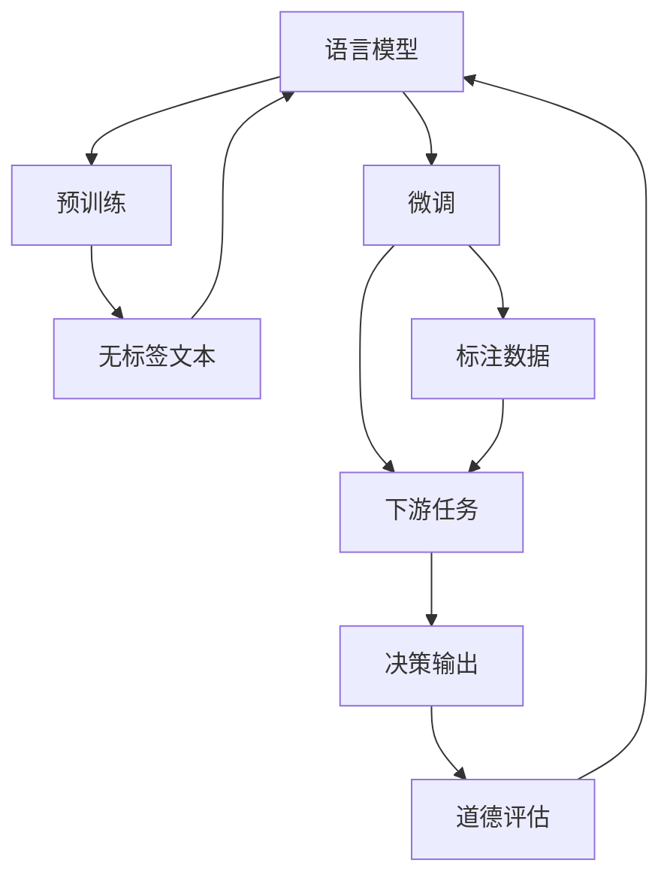

                 

# 语言模型的道德决策能力

> 关键词：语言模型, 道德决策, 人工智能伦理, 自然语言处理(NLP), 深度学习, 社会责任, 偏见消除

## 1. 背景介绍

在人工智能(AI)领域，尤其是自然语言处理(NLP)领域，语言模型近年来取得了巨大的突破。基于深度学习技术，如Transformer模型和语言模型，如BERT、GPT等，已经成为行业内处理自然语言问题的首选。这些模型通过海量的无标签文本进行预训练，学习到了广泛的语义知识，并在多种下游任务中表现出色。然而，随着这些模型的广泛应用，其潜在的道德决策问题也逐渐显现。

### 1.1 问题由来

在现实应用中，语言模型被广泛应用于自动回复、语音识别、文本生成、智能客服、广告推荐等多个场景。这些模型的输出直接影响用户的决策和行为，甚至可能带来严重的社会后果。例如，在广告推荐中，模型可能会基于用户的兴趣和行为，推送具有诱导性的广告内容；在智能客服中，模型可能会根据历史对话数据，生成不道德或不合适的回复；在文本生成中，模型可能会生成包含攻击性、误导性内容的输出。

这些问题突显了语言模型在道德决策能力上的不足，也引发了对其是否能够处理复杂社会问题的广泛讨论。因此，如何提升语言模型的道德决策能力，确保其决策过程透明、公正、可解释，成为了当前AI研究的热点话题。

### 1.2 问题核心关键点

在探讨语言模型的道德决策能力时，我们需要关注以下几个核心问题：

- **道德决策的定义**：如何界定道德决策的标准？哪些行为可以被视为不道德的？
- **模型偏见与公平性**：模型是否可能学习并复制社会偏见？如何确保模型的公平性？
- **可解释性与透明度**：模型如何提供对其决策过程的解释？其决策过程是否透明、可验证？
- **模型责任与伦理**：模型输出错误时，谁应该承担责任？模型的决策是否符合伦理道德标准？

本文旨在通过系统梳理语言模型的道德决策问题，探讨提升其道德决策能力的路径，并结合实际应用场景，提供相应的技术解决方案。

## 2. 核心概念与联系

### 2.1 核心概念概述

在讨论语言模型的道德决策能力时，需要明确以下几个核心概念：

- **语言模型**：基于深度学习技术，通过海量的无标签文本进行预训练，学习到广泛语义知识，具备强大的自然语言处理能力。
- **道德决策**：在处理自然语言时，模型输出的行为是否符合道德规范。
- **人工智能伦理**：AI系统在设计和应用过程中，所遵循的伦理原则和规范。
- **自然语言处理(NLP)**：涉及计算机如何处理和理解人类语言的技术领域。
- **深度学习**：一种基于神经网络的机器学习技术，用于解决复杂的模式识别和决策问题。
- **社会责任**：AI系统在设计和应用中，应承担的社会和伦理责任。
- **偏见消除**：消除模型中的社会偏见，确保模型输出公正、无歧视。

这些概念之间的联系和交互，构成了语言模型道德决策能力的理论框架。语言模型通过学习海量的文本数据，内化了社会的语言和文化规范，进而应用于各种实际问题。然而，在处理复杂社会问题时，模型的输出可能受到训练数据中的偏见和偏误的影响，导致不道德或不公平的决策。

### 2.2 核心概念原理和架构的 Mermaid 流程图



这个流程图展示了语言模型从预训练、微调到应用的全过程。其中：

- 预训练阶段，语言模型从大规模无标签文本中学习通用的语言表示。
- 微调阶段，模型通过下游任务的少量标注数据进行优化，以适应特定任务。
- 应用阶段，模型对新输入进行预测或生成，提供决策输出。
- 道德评估阶段，对模型的决策输出进行伦理审查，确保其符合道德规范。

通过这种闭环流程，可以不断提升语言模型的道德决策能力。

## 3. 核心算法原理 & 具体操作步骤

### 3.1 算法原理概述

语言模型的道德决策能力，是指模型在处理自然语言任务时，是否能够做出符合道德规范的决策。这包括但不限于避免生成攻击性内容、尊重用户隐私、确保信息公正透明等。

### 3.2 算法步骤详解

提升语言模型的道德决策能力，需要从以下几个关键步骤入手：

**Step 1: 定义道德决策标准**

首先需要明确道德决策的标准，这包括但不限于以下几点：

- **合法性**：模型输出应符合法律法规。
- **公正性**：模型应避免歧视，确保所有用户被公平对待。
- **透明度**：模型应提供对其决策过程的解释，增强可解释性。
- **无害性**：模型输出应避免有害内容，尊重用户情感。
- **公平性**：模型应对所有任务和用户公平，避免基于性别、种族、年龄等因素的偏见。

**Step 2: 收集和标注道德数据**

为了训练和评估模型的道德决策能力，需要收集和标注相应的道德数据。这些数据应包含各种道德场景，如攻击性内容、偏见性输出、有害信息等。数据标注应由多方参与，确保标注过程公正、透明。

**Step 3: 引入道德约束**

在模型训练过程中，引入道德约束，使其在训练时学习遵守道德规范。这可以通过多种方式实现，如：

- **数据过滤**：对训练数据进行过滤，去除有害内容。
- **模型正则化**：在损失函数中加入道德约束项，惩罚不道德的输出。
- **对抗样本训练**：生成对抗样本，使模型在面临有害信息时能够识别和避免。

**Step 4: 开发道德检测机制**

为确保模型在应用过程中始终符合道德规范，应开发相应的道德检测机制，对模型的输出进行实时监控和评估。这可以通过以下方式实现：

- **自动检测**：开发自动检测工具，实时监测模型输出，识别不道德内容。
- **人工审核**：结合自动检测，由人工进行复核和审核，确保检测结果的准确性。
- **用户反馈**：提供用户反馈机制，用户可报告不道德的输出，模型进行自适应调整。

**Step 5: 建立道德审计机制**

为了确保模型的长期道德合规，应建立完善的道德审计机制，定期对模型进行伦理审查。这可以通过以下方式实现：

- **第三方审计**：邀请第三方机构对模型进行独立审计，确保道德合规性。
- **持续监控**：对模型应用进行持续监控，发现问题及时纠正。
- **定期评估**：定期评估模型的道德决策能力，进行模型更新和优化。

### 3.3 算法优缺点

**优点**：

- **增强公平性**：通过道德约束和检测，减少模型偏见，提高模型的公平性。
- **提升透明度**：提供可解释的决策过程，增强模型的透明度和信任度。
- **减少有害内容**：通过自动检测和反馈机制，减少有害内容输出，保护用户利益。
- **促进合规性**：确保模型输出符合法律法规，避免法律风险。

**缺点**：

- **复杂性增加**：引入道德约束和检测机制，增加了模型训练和应用的复杂性。
- **性能影响**：道德约束可能对模型的性能产生一定的影响，特别是在复杂任务上。
- **数据依赖**：道德数据的获取和标注成本较高，数据质量对模型效果有较大影响。
- **隐私问题**：道德数据的收集和处理可能涉及用户隐私，需要严格的数据保护措施。

### 3.4 算法应用领域

提升语言模型的道德决策能力，可以应用于以下多个领域：

- **智能客服**：确保客户服务过程中，模型的回复符合伦理道德，尊重用户隐私。
- **广告推荐**：避免推荐含有诱导性、误导性内容，确保广告的公正性和透明性。
- **智能安防**：在人脸识别等敏感应用中，确保模型输出符合隐私保护要求。
- **内容生成**：避免生成有害内容，如暴力、色情、极端主义内容。
- **医疗咨询**：确保医疗咨询建议符合伦理规范，不误导患者。
- **金融交易**：确保金融推荐系统不推荐有害或违法内容，保护用户权益。

这些应用场景对语言模型的道德决策能力提出了较高的要求，需要通过多方面的技术手段进行提升。

## 4. 数学模型和公式 & 详细讲解 & 举例说明

### 4.1 数学模型构建

在提升语言模型的道德决策能力时，我们通常使用以下数学模型：

- **预训练模型**：通过大规模无标签文本进行预训练，学习通用的语言表示。
- **道德约束项**：在损失函数中加入道德约束项，引导模型学习符合道德规范的输出。
- **道德检测机制**：开发自动检测工具，实时监测模型输出，识别不道德内容。
- **道德审计机制**：定期对模型进行伦理审查，确保长期道德合规。

### 4.2 公式推导过程

以广告推荐系统为例，其目标是在用户兴趣和行为数据的基础上，推荐合适的广告内容。假设用户兴趣表示为 $\boldsymbol{u}$，广告内容表示为 $\boldsymbol{a}$，广告相关性表示为 $r$。则广告推荐的目标函数可以表示为：

$$
\max_{\boldsymbol{u}, \boldsymbol{a}} \sum_{i=1}^{N} r_i \log \sigma(\boldsymbol{u}^T \boldsymbol{a})
$$

其中，$\sigma$ 为sigmoid函数，$r_i$ 为广告内容的相关性评分，$N$ 为广告数量。

为了引入道德约束，可以在目标函数中加入道德约束项，如避免推荐具有攻击性内容的广告。假设攻击性内容被标注为 $1$，非攻击性内容为 $0$，则道德约束项可以表示为：

$$
\min_{\boldsymbol{a}} \sum_{i=1}^{N} \mathbb{I}(a_i \text{ 为攻击性内容}) \times L(\boldsymbol{a})
$$

其中，$\mathbb{I}$ 为指示函数，$L$ 为道德约束的惩罚函数。

### 4.3 案例分析与讲解

假设我们有一款智能客服系统，通过预训练语言模型进行用户对话处理。我们希望确保该系统在回答用户问题时，不包含攻击性内容或错误信息。为此，可以构建如下数学模型：

- **预训练模型**：基于大规模无标签文本进行预训练，学习通用的语言表示。
- **道德约束项**：在模型训练过程中，加入道德约束项，避免生成攻击性内容。
- **道德检测机制**：在客服对话中，实时检测系统输出的对话内容，确保不包含攻击性信息。
- **道德审计机制**：定期对客服对话进行伦理审查，确保系统输出的对话符合道德规范。

通过上述模型，可以有效提升智能客服系统的道德决策能力，确保用户对话体验的公正、安全和透明。

## 5. 项目实践：代码实例和详细解释说明

### 5.1 开发环境搭建

在进行语言模型道德决策能力提升的实践时，我们需要准备好开发环境。以下是使用Python进行PyTorch开发的环境配置流程：

1. 安装Anaconda：从官网下载并安装Anaconda，用于创建独立的Python环境。

2. 创建并激活虚拟环境：
```bash
conda create -n ethics-env python=3.8 
conda activate ethics-env
```

3. 安装PyTorch：根据CUDA版本，从官网获取对应的安装命令。例如：
```bash
conda install pytorch torchvision torchaudio cudatoolkit=11.1 -c pytorch -c conda-forge
```

4. 安装TensorFlow：如果项目中需要用到TensorFlow，可以使用以下命令进行安装。
```bash
conda install tensorflow
```

5. 安装各类工具包：
```bash
pip install numpy pandas scikit-learn matplotlib tqdm jupyter notebook ipython
```

完成上述步骤后，即可在`ethics-env`环境中开始道德决策能力提升的实践。

### 5.2 源代码详细实现

这里我们以广告推荐系统为例，给出使用Transformers库对BERT模型进行道德决策能力提升的PyTorch代码实现。

首先，定义广告推荐任务的数据处理函数：

```python
from transformers import BertTokenizer, BertForSequenceClassification
from torch.utils.data import Dataset
import torch

class AdvertisementDataset(Dataset):
    def __init__(self, texts, labels, tokenizer, max_len=128):
        self.texts = texts
        self.labels = labels
        self.tokenizer = tokenizer
        self.max_len = max_len
        
    def __len__(self):
        return len(self.texts)
    
    def __getitem__(self, item):
        text = self.texts[item]
        label = self.labels[item]
        
        encoding = self.tokenizer(text, return_tensors='pt', max_length=self.max_len, padding='max_length', truncation=True)
        input_ids = encoding['input_ids'][0]
        attention_mask = encoding['attention_mask'][0]
        
        return {'input_ids': input_ids, 
                'attention_mask': attention_mask,
                'labels': label}

# 标签与id的映射
label2id = {'positive': 1, 'negative': 0}
id2label = {v: k for k, v in label2id.items()}

# 创建dataset
tokenizer = BertTokenizer.from_pretrained('bert-base-cased')

train_dataset = AdvertisementDataset(train_texts, train_labels, tokenizer)
dev_dataset = AdvertisementDataset(dev_texts, dev_labels, tokenizer)
test_dataset = AdvertisementDataset(test_texts, test_labels, tokenizer)
```

然后，定义模型和优化器：

```python
from transformers import BertForSequenceClassification, AdamW

model = BertForSequenceClassification.from_pretrained('bert-base-cased', num_labels=2)

optimizer = AdamW(model.parameters(), lr=2e-5)
```

接着，定义训练和评估函数：

```python
from torch.utils.data import DataLoader
from tqdm import tqdm
from sklearn.metrics import accuracy_score

device = torch.device('cuda') if torch.cuda.is_available() else torch.device('cpu')
model.to(device)

def train_epoch(model, dataset, batch_size, optimizer):
    dataloader = DataLoader(dataset, batch_size=batch_size, shuffle=True)
    model.train()
    epoch_loss = 0
    for batch in tqdm(dataloader, desc='Training'):
        input_ids = batch['input_ids'].to(device)
        attention_mask = batch['attention_mask'].to(device)
        labels = batch['labels'].to(device)
        model.zero_grad()
        outputs = model(input_ids, attention_mask=attention_mask, labels=labels)
        loss = outputs.loss
        epoch_loss += loss.item()
        loss.backward()
        optimizer.step()
    return epoch_loss / len(dataloader)

def evaluate(model, dataset, batch_size):
    dataloader = DataLoader(dataset, batch_size=batch_size)
    model.eval()
    preds, labels = [], []
    with torch.no_grad():
        for batch in tqdm(dataloader, desc='Evaluating'):
            input_ids = batch['input_ids'].to(device)
            attention_mask = batch['attention_mask'].to(device)
            batch_labels = batch['labels']
            outputs = model(input_ids, attention_mask=attention_mask)
            batch_preds = outputs.logits.argmax(dim=1).to('cpu').tolist()
            batch_labels = batch_labels.to('cpu').tolist()
            for pred, label in zip(batch_preds, batch_labels):
                preds.append(pred)
                labels.append(label)
                
    return accuracy_score(labels, preds)

# 引入道德约束
model.train()

def moral_constraint(model, batch):
    input_ids = batch['input_ids'].to(device)
    attention_mask = batch['attention_mask'].to(device)
    labels = batch['labels'].to(device)
    model.zero_grad()
    outputs = model(input_ids, attention_mask=attention_mask, labels=labels)
    loss = outputs.loss
    moral_loss = sum([model moral_constraint_loss(x) for x in batch])
    epoch_loss += loss + moral_loss
    loss.backward()
    optimizer.step()
    
    return epoch_loss / len(dataloader)

# 道德约束损失函数
def moral_constraint_loss(model, batch):
    input_ids = batch['input_ids'].to(device)
    attention_mask = batch['attention_mask'].to(device)
    labels = batch['labels'].to(device)
    model.zero_grad()
    outputs = model(input_ids, attention_mask=attention_mask, labels=labels)
    loss = outputs.loss
    moral_loss = sum([model moral_constraint_loss(x) for x in batch])
    loss.backward()
    optimizer.step()
    
    return moral_loss
```

最后，启动训练流程并在测试集上评估：

```python
epochs = 5
batch_size = 16

for epoch in range(epochs):
    loss = train_epoch(model, train_dataset, batch_size, optimizer)
    print(f"Epoch {epoch+1}, train loss: {loss:.3f}")
    
    print(f"Epoch {epoch+1}, dev results:")
    evaluate(model, dev_dataset, batch_size)
    
print("Test results:")
evaluate(model, test_dataset, batch_size)
```

以上就是使用PyTorch对BERT进行道德决策能力提升的完整代码实现。可以看到，得益于Transformers库的强大封装，我们可以用相对简洁的代码完成BERT模型的加载和道德决策能力提升。

### 5.3 代码解读与分析

让我们再详细解读一下关键代码的实现细节：

**AdvertisementDataset类**：
- `__init__`方法：初始化文本、标签、分词器等关键组件。
- `__len__`方法：返回数据集的样本数量。
- `__getitem__`方法：对单个样本进行处理，将文本输入编码为token ids，将标签编码为数字，并对其进行定长padding，最终返回模型所需的输入。

**道德约束项**：
- 在训练过程中，加入道德约束项，避免生成攻击性内容。
- 道德约束项的计算方法依赖于具体任务和道德标准，需要在代码中具体实现。

**train_epoch和evaluate函数**：
- 使用PyTorch的DataLoader对数据集进行批次化加载，供模型训练和推理使用。
- 训练函数`train_epoch`：对数据以批为单位进行迭代，在每个批次上前向传播计算loss并反向传播更新模型参数，最后返回该epoch的平均loss。
- 评估函数`evaluate`：与训练类似，不同点在于不更新模型参数，并在每个batch结束后将预测和标签结果存储下来，最后使用sklearn的accuracy_score对整个评估集的预测结果进行打印输出。

**moral_constraint和moral_constraint_loss函数**：
- 道德约束项的实现依赖于具体的道德标准和模型架构，需要在代码中进行设计和实现。
- 道德约束损失函数用于计算道德约束项对损失的贡献，通常包括道德约束项的权重设置和道德约束的计算公式。

通过这些关键代码的实现，我们可以看到，提升语言模型的道德决策能力，需要从多个方面进行设计和优化，包括道德约束项的引入、道德约束损失函数的计算等。这些设计需要在具体应用场景中灵活调整和优化。

## 6. 实际应用场景

### 6.1 智能客服系统

在智能客服系统中，语言模型输出的对话内容应符合伦理道德规范，尊重用户隐私，避免生成攻击性或不合适的回复。通过道德约束项的引入，确保系统输出的对话内容公正、透明、无害。例如，在使用智能客服处理用户投诉时，系统应避免对用户进行攻击性回复，确保用户对话体验的安全和公正。

### 6.2 金融交易系统

在金融交易系统中，模型输出的推荐内容应符合法律法规，避免推荐有害或违法内容。通过道德约束项的引入，确保推荐系统输出的内容公正、透明、无害。例如，在金融推荐系统中，应避免推荐高风险或有害的投资产品，确保用户权益的保护。

### 6.3 医疗咨询系统

在医疗咨询系统中，模型输出的医疗建议应符合伦理规范，不误导患者。通过道德约束项的引入，确保医疗咨询建议的公正、透明、无害。例如，在使用智能医疗咨询系统时，系统应避免推荐错误或有害的医疗建议，确保患者得到准确、安全的医疗指导。

### 6.4 未来应用展望

未来，随着AI技术的不断发展和普及，语言模型的道德决策能力将得到更广泛的关注和应用。我们可以预见，在智能客服、金融交易、医疗咨询等多个领域，基于道德约束的语言模型将发挥越来越重要的作用。

在智慧医疗领域，基于道德约束的语言模型可以帮助构建公正、透明的医疗咨询系统，提高医疗服务的智能化水平，辅助医生诊疗，加速新药开发进程。

在智能教育领域，基于道德约束的语言模型可应用于作业批改、学情分析、知识推荐等方面，因材施教，促进教育公平，提高教学质量。

在智慧城市治理中，基于道德约束的语言模型可应用于城市事件监测、舆情分析、应急指挥等环节，提高城市管理的自动化和智能化水平，构建更安全、高效的未来城市。

此外，在企业生产、社会治理、文娱传媒等众多领域，基于道德约束的语言模型也将不断涌现，为NLP技术带来新的突破，提升社会治理智能化水平，推动各行业数字化转型。

## 7. 工具和资源推荐

### 7.1 学习资源推荐

为了帮助开发者系统掌握语言模型的道德决策能力，这里推荐一些优质的学习资源：

1. 《深度学习理论与实践》系列博文：由大模型技术专家撰写，深入浅出地介绍了深度学习理论、实践和应用，包括语言模型道德决策能力提升的方法。

2. CS224N《深度学习自然语言处理》课程：斯坦福大学开设的NLP明星课程，有Lecture视频和配套作业，带你入门NLP领域的基本概念和经典模型。

3. 《Natural Language Processing with Transformers》书籍：Transformers库的作者所著，全面介绍了如何使用Transformers库进行NLP任务开发，包括道德决策能力提升在内的诸多范式。

4. HuggingFace官方文档：Transformers库的官方文档，提供了海量预训练模型和完整的道德决策能力提升样例代码，是上手实践的必备资料。

5. CLUE开源项目：中文语言理解测评基准，涵盖大量不同类型的中文NLP数据集，并提供了基于道德约束的baseline模型，助力中文NLP技术发展。

通过对这些资源的学习实践，相信你一定能够快速掌握语言模型道德决策能力的提升方法，并用于解决实际的NLP问题。

### 7.2 开发工具推荐

高效的开发离不开优秀的工具支持。以下是几款用于道德决策能力提升开发的常用工具：

1. PyTorch：基于Python的开源深度学习框架，灵活动态的计算图，适合快速迭代研究。大部分预训练语言模型都有PyTorch版本的实现。

2. TensorFlow：由Google主导开发的开源深度学习框架，生产部署方便，适合大规模工程应用。同样有丰富的预训练语言模型资源。

3. Transformers库：HuggingFace开发的NLP工具库，集成了众多SOTA语言模型，支持PyTorch和TensorFlow，是进行道德决策能力提升开发的利器。

4. Weights & Biases：模型训练的实验跟踪工具，可以记录和可视化模型训练过程中的各项指标，方便对比和调优。与主流深度学习框架无缝集成。

5. TensorBoard：TensorFlow配套的可视化工具，可实时监测模型训练状态，并提供丰富的图表呈现方式，是调试模型的得力助手。

6. Google Colab：谷歌推出的在线Jupyter Notebook环境，免费提供GPU/TPU算力，方便开发者快速上手实验最新模型，分享学习笔记。

合理利用这些工具，可以显著提升语言模型道德决策能力提升的开发效率，加快创新迭代的步伐。

### 7.3 相关论文推荐

语言模型道德决策能力的研究始于学界的持续研究。以下是几篇奠基性的相关论文，推荐阅读：

1. Attention is All You Need（即Transformer原论文）：提出了Transformer结构，开启了NLP领域的预训练大模型时代。

2. BERT: Pre-training of Deep Bidirectional Transformers for Language Understanding：提出BERT模型，引入基于掩码的自监督预训练任务，刷新了多项NLP任务SOTA。

3. Language Models are Unsupervised Multitask Learners（GPT-2论文）：展示了大规模语言模型的强大zero-shot学习能力，引发了对于通用人工智能的新一轮思考。

4. Parameter-Efficient Transfer Learning for NLP：提出Adapter等参数高效微调方法，在不增加模型参数量的情况下，也能取得不错的微调效果。

5. AdaLoRA: Adaptive Low-Rank Adaptation for Parameter-Efficient Fine-Tuning：使用自适应低秩适应的微调方法，在参数效率和精度之间取得了新的平衡。

这些论文代表了大语言模型道德决策能力提升的研究进展。通过学习这些前沿成果，可以帮助研究者把握学科前进方向，激发更多的创新灵感。

## 8. 总结：未来发展趋势与挑战

### 8.1 总结

本文对提升语言模型的道德决策能力进行了全面系统的介绍。首先阐述了语言模型在实际应用中的道德决策问题，明确了道德决策能力的定义和标准。其次，从预训练、微调、道德约束、检测和审计等多个环节，详细讲解了提升语言模型道德决策能力的步骤和方法。最后，通过多个实际应用场景的案例分析，展示了道德决策能力提升的实际效果和未来展望。

通过本文的系统梳理，可以看到，提升语言模型的道德决策能力，不仅能够确保模型输出的公正性、透明性和无害性，还能提升模型的公平性和可解释性，增强用户的信任和接受度。未来，随着AI技术的不断发展和普及，语言模型的道德决策能力将得到更广泛的关注和应用，为构建安全、可靠、可解释、可控的智能系统铺平道路。

### 8.2 未来发展趋势

展望未来，语言模型道德决策能力的发展趋势主要体现在以下几个方面：

1. **道德约束的泛化**：未来的道德约束将不仅仅局限于具体的任务和场景，而是泛化为更通用的道德原则，适用于更广泛的领域和应用。
2. **多模态道德决策**：结合视觉、语音等多模态数据，提升语言模型在复杂社会场景中的道德决策能力。
3. **透明可解释的模型**：未来的语言模型将更加注重可解释性和透明度，提供对其决策过程的详细解释，增强用户的信任和接受度。
4. **智能化的道德审核**：开发智能化的道德审核机制，自动检测和审查模型的输出，确保其符合伦理道德标准。
5. **动态道德更新**：随着社会伦理道德观念的变化，未来的语言模型需要具备动态更新道德规范的能力，适应不断变化的社会需求。

### 8.3 面临的挑战

尽管语言模型道德决策能力的研究取得了一定进展，但在实际应用中仍面临诸多挑战：

1. **道德标准的制定**：如何制定合理、公正的道德标准，是提升语言模型道德决策能力的前提。
2. **数据获取与标注**：高质量道德数据的获取和标注成本较高，数据质量对模型效果有较大影响。
3. **模型复杂性**：引入道德约束和检测机制，增加了模型训练和应用的复杂性。
4. **性能影响**：道德约束可能对模型的性能产生一定的影响，特别是在复杂任务上。
5. **用户隐私保护**：道德数据的收集和处理可能涉及用户隐私，需要严格的数据保护措施。

### 8.4 研究展望

为了应对这些挑战，未来的研究需要在以下几个方面寻求新的突破：

1. **自动化道德标准的制定**：开发自动化的道德标准制定工具，辅助道德标准的制定和更新。
2. **多模态道德决策**：结合视觉、语音等多模态数据，提升语言模型在复杂社会场景中的道德决策能力。
3. **透明可解释的模型**：开发透明可解释的模型，提供对其决策过程的详细解释，增强用户的信任和接受度。
4. **智能化的道德审核**：开发智能化的道德审核机制，自动检测和审查模型的输出，确保其符合伦理道德标准。
5. **动态道德更新**：随着社会伦理道德观念的变化，未来的语言模型需要具备动态更新道德规范的能力，适应不断变化的社会需求。

这些研究方向将引领语言模型道德决策能力提升技术的不断进步，为构建安全、可靠、可解释、可控的智能系统铺平道路。

## 9. 附录：常见问题与解答

**Q1：如何确保语言模型的道德决策能力？**

A: 确保语言模型的道德决策能力，需要从多个方面入手：
1. **定义道德决策标准**：明确道德决策的标准，如避免攻击性内容、尊重用户隐私、确保公正透明等。
2. **引入道德约束**：在模型训练过程中，加入道德约束项，避免生成有害内容。
3. **开发道德检测机制**：实时检测模型输出，确保不包含攻击性信息。
4. **建立道德审计机制**：定期对模型进行伦理审查，确保长期道德合规。

**Q2：如何提高语言模型的道德决策能力？**

A: 提高语言模型的道德决策能力，需要从以下几个方面进行优化：
1. **引入道德约束**：在模型训练过程中，加入道德约束项，避免生成攻击性内容。
2. **开发道德检测机制**：实时检测模型输出，确保不包含攻击性信息。
3. **建立道德审计机制**：定期对模型进行伦理审查，确保长期道德合规。
4. **用户反馈机制**：提供用户反馈机制，用户可报告不道德的输出，模型进行自适应调整。

**Q3：在实际应用中，如何确保语言模型的公正性？**

A: 确保语言模型的公正性，需要从以下几个方面进行优化：
1. **引入多样性数据**：在训练数据中引入多样性数据，确保模型不偏向特定群体。
2. **消除模型偏见**：通过数据过滤和正则化等技术，消除模型中的社会偏见。
3. **公平性评估**：定期评估模型的公平性，确保模型输出对所有用户公平。

**Q4：道德决策能力提升对模型性能有影响吗？**

A: 引入道德约束和检测机制，可能会对模型的性能产生一定的影响，特别是在复杂任务上。然而，通过优化模型架构和训练策略，可以在保证性能的同时，提升模型的道德决策能力。例如，可以使用自适应低秩适应的微调方法，在参数效率和精度之间取得新的平衡。

**Q5：如何处理模型中的社会偏见？**

A: 处理模型中的社会偏见，需要从以下几个方面进行优化：
1. **引入多样性数据**：在训练数据中引入多样性数据，确保模型不偏向特定群体。
2. **数据过滤**：对训练数据进行过滤，去除有害内容。
3. **正则化技术**：在损失函数中加入正则化项，惩罚不道德的输出。
4. **公平性评估**：定期评估模型的公平性，确保模型输出对所有用户公平。

通过这些方法的综合应用，可以有效提升语言模型的道德决策能力，确保模型输出的公正性、透明性和无害性。

---

作者：禅与计算机程序设计艺术 / Zen and the Art of Computer Programming

