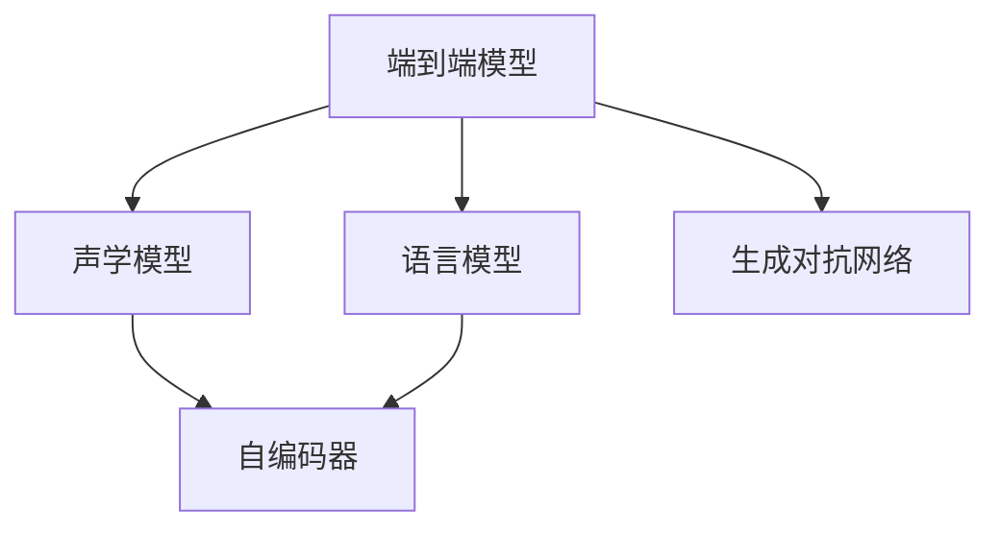

                 

# 语音识别与合成：深度学习方法

> 关键词：语音识别,深度学习,端到端模型,声学模型,语言模型,自编码器,变分自编码器,生成对抗网络

## 1. 背景介绍

### 1.1 问题由来
语音识别技术（Automatic Speech Recognition, ASR）是计算机自然语言处理的重要分支，主要实现对人类语音的自动转写，使得计算机能够理解并响应自然语言指令。传统语音识别系统主要基于统计语言模型和隐马尔可夫模型（Hidden Markov Model, HMM）构建，但随着深度学习技术的兴起，端到端深度学习模型在语音识别领域逐渐成为主流。

深度学习模型的成功主要归因于其强大的特征提取和表示学习能力。传统方法需要手工提取一系列声学特征，如梅尔倒谱系数（Mel Frequency Cepstral Coefficients, MFCCs），而深度学习模型则能够自动从原始波形信号中提取高层次声学特征，大大提升了识别精度和系统鲁棒性。此外，深度学习模型可以灵活处理不同类型的声学和语言模型，更适用于多语种和低资源语言的语音识别任务。

### 1.2 问题核心关键点
深度学习在语音识别中的应用，主要依赖于以下关键技术：
1. **端到端模型（End-to-End Model）**：将声学特征提取和语音识别过程合并为一整体，不再分别训练和集成声学模型和语言模型。
2. **声学模型**：用于处理语音信号特征的深度神经网络模型，如卷积神经网络（Convolutional Neural Network, CNN）、循环神经网络（Recurrent Neural Network, RNN）及其变体如长短时记忆网络（Long Short-Term Memory, LSTM）、门控循环单元（Gated Recurrent Unit, GRU）等。
3. **语言模型**：用于处理文本转写结果的语言模型，以概率形式描述语言序列的概率分布，如隐马尔可夫模型（HMM）、递归神经网络（RNN）语言模型、转移机模型（Transition-Based Machine Model, TBMM）等。
4. **自编码器（Autoencoder）**：用于特征提取和降维，将高维声学特征映射到低维空间，以降低模型复杂度。
5. **变分自编码器（Variational Autoencoder, VAE）**：一种特殊的自编码器，能够生成新的语音数据，用于数据增强和合成。
6. **生成对抗网络（Generative Adversarial Network, GAN）**：由生成器和判别器两部分组成的对抗性框架，用于生成高质量的语音数据，辅助训练和评价模型。

## 2. 核心概念与联系

### 2.1 核心概念概述

为更好地理解深度学习在语音识别中的应用，本节将介绍几个密切相关的核心概念：

- **端到端模型**：将语音识别过程简化为一连串的前向传播过程，无需显式地训练声学和语言模型。
- **声学模型**：负责从声学信号中提取语音特征，通常使用深度神经网络构建。
- **语言模型**：用于将语音特征序列转化为文本序列，通常使用RNN及其变体。
- **自编码器**：用于特征提取和降维，通过将输入映射到低维空间，去除噪声和不相关特征，提高模型的泛化能力。
- **变分自编码器**：一种特殊的自编码器，通过学习生成数据的概率分布，生成新的语音数据。
- **生成对抗网络**：由生成器和判别器两部分组成的对抗性框架，用于生成高质量的语音数据。

这些核心概念之间的逻辑关系可以通过以下Mermaid流程图来展示：



这个流程图展示了大语言模型在语音识别任务中的核心概念及其之间的关系：

1. 端到端模型作为输入接口，负责语音信号的特征提取和文本转写。
2. 声学模型处理声学信号，提取语音特征。
3. 语言模型将语音特征序列转化为文本序列。
4. 自编码器用于特征降维和增强，去除噪声。
5. 生成对抗网络用于生成高质量的语音数据，辅助模型训练。

## 3. 核心算法原理 & 具体操作步骤
### 3.1 算法原理概述

端到端的深度学习语音识别主要包含声学模型和语言模型的联合训练。算法原理可以大致分为以下几个步骤：

1. **特征提取**：将原始语音信号转换成频谱特征或梅尔倒谱系数（MFCCs）。
2. **声学模型训练**：利用声学模型学习声学特征与文本序列之间的映射关系。
3. **语言模型训练**：利用语言模型学习文本序列的概率分布。
4. **联合训练**：将声学模型和语言模型联合训练，优化整体的端到端模型性能。

其中，声学模型的训练和语言模型的训练是两个关键步骤，需要仔细设计和优化。

### 3.2 算法步骤详解

#### 3.2.1 特征提取

特征提取是语音识别的第一步，通常使用梅尔倒谱系数（MFCCs）作为声学特征。MFCCs通过滤波器组、傅里叶变换、梅尔尺度等步骤，将语音信号映射到高维空间，提取其频谱特征。MFCCs的计算过程如下：

$$
X_m = \log\left( \frac{1 + \alpha \left( |Y_k(m, t)|^2 \right)}{1 + \alpha} \right)
$$

其中，$X_m$ 为MFCC特征，$Y_k$ 为滤波器组的滤波响应，$\alpha$ 为加法常数，$t$ 为时间索引。

#### 3.2.2 声学模型训练

声学模型通常使用深度神经网络构建，如卷积神经网络（CNN）、循环神经网络（RNN）及其变体如长短时记忆网络（LSTM）、门控循环单元（GRU）等。以下以RNN语言模型为例，说明其训练过程。

1. **初始化模型参数**：随机初始化神经网络模型，包括权重矩阵和偏置向量。
2. **前向传播**：将声学特征序列输入到RNN中，计算隐状态序列和输出序列。
3. **损失计算**：计算输出序列与真实标签之间的交叉熵损失。
4. **反向传播**：根据损失函数对模型参数进行梯度下降更新。
5. **重复迭代**：不断迭代上述步骤，直至损失收敛或达到预设迭代次数。

#### 3.2.3 语言模型训练

语言模型用于将语音特征序列转化为文本序列，通常使用RNN及其变体。以下以RNN语言模型为例，说明其训练过程。

1. **初始化模型参数**：随机初始化神经网络模型，包括权重矩阵和偏置向量。
2. **前向传播**：将文本序列输入到RNN中，计算隐状态序列和输出序列。
3. **损失计算**：计算输出序列与真实标签之间的交叉熵损失。
4. **反向传播**：根据损失函数对模型参数进行梯度下降更新。
5. **重复迭代**：不断迭代上述步骤，直至损失收敛或达到预设迭代次数。

#### 3.2.4 联合训练

将声学模型和语言模型联合训练，优化整体的端到端模型性能。具体步骤如下：

1. **联合优化**：将声学模型和语言模型的损失函数加权求和，得到一个整体损失函数。
2. **联合优化**：使用优化算法如AdamW、SGD等对整体模型进行优化，更新所有模型参数。
3. **重复迭代**：不断迭代上述步骤，直至损失收敛或达到预设迭代次数。

### 3.3 算法优缺点

端到端的深度学习语音识别方法具有以下优点：

1. **简化模型结构**：将声学特征提取和语音识别过程合并为一整体，简化了模型结构，减少了训练难度。
2. **提高识别精度**：利用深度神经网络提取声学特征，能够自动学习复杂的声学模式，提高识别精度。
3. **增强系统鲁棒性**：神经网络能够自适应数据分布，提升模型在复杂环境下的鲁棒性。
4. **减少后处理步骤**：端到端模型可以直接输出识别结果，无需额外的后处理步骤。

然而，端到端深度学习语音识别方法也存在一些缺点：

1. **训练成本高**：需要大量的标注数据和计算资源，训练时间较长。
2. **过拟合风险高**：模型参数较多，容易过拟合训练数据。
3. **模型解释性差**：神经网络黑盒性质强，难以解释模型的内部工作机制。
4. **泛化能力有限**：模型依赖于训练数据，泛化能力有限。

## 4. 数学模型和公式 & 详细讲解  
### 4.1 数学模型构建

为了更好地理解深度学习在语音识别中的应用，本节将使用数学语言对端到端模型的训练过程进行更加严格的刻画。

记声学模型为 $M_{\theta_S}$，语言模型为 $M_{\theta_L}$，整体模型为 $M$，其中 $\theta_S$ 为声学模型参数，$\theta_L$ 为语言模型参数。假设声学特征序列为 $X=\{x_i\}_{i=1}^N$，文本序列为 $Y=\{y_i\}_{i=1}^N$。

定义模型 $M$ 在声学特征 $X$ 和文本序列 $Y$ 上的联合损失函数为：

$$
\mathcal{L}(M) = \frac{1}{N}\sum_{i=1}^N \mathcal{L}_S(M_{\theta_S}(X_i), y_i) + \mathcal{L}_L(M_{\theta_L}(Y_i), y_i)
$$

其中 $\mathcal{L}_S$ 和 $\mathcal{L}_L$ 分别为声学模型和语言模型的损失函数。

### 4.2 公式推导过程

以下我们以基于RNN的语音识别为例，推导联合损失函数的计算公式。

假设声学模型为 $M_{\theta_S}$，语言模型为 $M_{\theta_L}$，声学特征序列为 $X=\{x_i\}_{i=1}^N$，文本序列为 $Y=\{y_i\}_{i=1}^N$。定义联合损失函数为：

$$
\mathcal{L}(M) = \frac{1}{N}\sum_{i=1}^N \left( \log P_{\theta_S}(X_i|y_i) + \log P_{\theta_L}(y_i) \right)
$$

其中 $P_{\theta_S}(X_i|y_i)$ 和 $P_{\theta_L}(y_i)$ 分别为声学模型和语言模型的输出概率分布。

将联合损失函数对模型参数 $\theta_S$ 和 $\theta_L$ 求导，得到声学模型和语言模型的参数更新公式：

$$
\frac{\partial \mathcal{L}(M)}{\partial \theta_S} = \frac{1}{N}\sum_{i=1}^N \left( \frac{\partial \log P_{\theta_S}(X_i|y_i)}{\partial \theta_S} + \frac{\partial \log P_{\theta_L}(y_i)}{\partial \theta_S} \right)
$$

$$
\frac{\partial \mathcal{L}(M)}{\partial \theta_L} = \frac{1}{N}\sum_{i=1}^N \left( \frac{\partial \log P_{\theta_S}(X_i|y_i)}{\partial \theta_L} + \frac{\partial \log P_{\theta_L}(y_i)}{\partial \theta_L} \right)
$$

其中 $\frac{\partial \log P_{\theta_S}(X_i|y_i)}{\partial \theta_S}$ 和 $\frac{\partial \log P_{\theta_L}(y_i)}{\partial \theta_S}$ 分别为声学模型和语言模型的梯度计算公式。

### 4.3 案例分析与讲解

#### 4.3.1 声学模型

以下以基于LSTM的声学模型为例，说明其训练过程。

1. **初始化模型参数**：随机初始化LSTM的权重矩阵和偏置向量。
2. **前向传播**：将声学特征序列 $X=\{x_i\}_{i=1}^N$ 输入到LSTM中，计算隐状态序列 $\{h_t\}_{t=1}^T$ 和输出序列 $\{a_t\}_{t=1}^T$。
3. **损失计算**：计算输出序列 $\{a_t\}_{t=1}^T$ 与真实标签 $\{y_i\}_{i=1}^N$ 之间的交叉熵损失。
4. **反向传播**：根据损失函数对LSTM的权重矩阵和偏置向量进行梯度下降更新。
5. **重复迭代**：不断迭代上述步骤，直至损失收敛或达到预设迭代次数。

#### 4.3.2 语言模型

以下以基于LSTM的语言模型为例，说明其训练过程。

1. **初始化模型参数**：随机初始化LSTM的权重矩阵和偏置向量。
2. **前向传播**：将文本序列 $Y=\{y_i\}_{i=1}^N$ 输入到LSTM中，计算隐状态序列 $\{h_t\}_{t=1}^T$ 和输出序列 $\{a_t\}_{t=1}^T$。
3. **损失计算**：计算输出序列 $\{a_t\}_{t=1}^T$ 与真实标签 $\{y_i\}_{i=1}^N$ 之间的交叉熵损失。
4. **反向传播**：根据损失函数对LSTM的权重矩阵和偏置向量进行梯度下降更新。
5. **重复迭代**：不断迭代上述步骤，直至损失收敛或达到预设迭代次数。

#### 4.3.3 联合训练

将声学模型和语言模型联合训练，优化整体的端到端模型性能。具体步骤如下：

1. **联合优化**：将声学模型和语言模型的损失函数加权求和，得到一个整体损失函数。
2. **联合优化**：使用优化算法如AdamW、SGD等对整体模型进行优化，更新所有模型参数。
3. **重复迭代**：不断迭代上述步骤，直至损失收敛或达到预设迭代次数。

## 5. 项目实践：代码实例和详细解释说明
### 5.1 开发环境搭建

在进行语音识别项目实践前，我们需要准备好开发环境。以下是使用Python进行PyTorch开发的环境配置流程：

1. 安装Anaconda：从官网下载并安装Anaconda，用于创建独立的Python环境。

2. 创建并激活虚拟环境：
```bash
conda create -n pytorch-env python=3.8 
conda activate pytorch-env
```

3. 安装PyTorch：根据CUDA版本，从官网获取对应的安装命令。例如：
```bash
conda install pytorch torchvision torchaudio cudatoolkit=11.1 -c pytorch -c conda-forge
```

4. 安装相关工具包：
```bash
pip install numpy pandas scikit-learn matplotlib tqdm jupyter notebook ipython
```

完成上述步骤后，即可在`pytorch-env`环境中开始语音识别实践。

### 5.2 源代码详细实现

下面以基于LSTM的语音识别为例，给出使用PyTorch进行深度学习语音识别的PyTorch代码实现。

首先，定义声学特征和文本标签的加载函数：

```python
import torch
from torch.utils.data import Dataset, DataLoader
import numpy as np
import os

class AudioDataset(Dataset):
    def __init__(self, audio_dir, label_dir, sample_rate=16000):
        self.audio_dir = audio_dir
        self.label_dir = label_dir
        self.sample_rate = sample_rate
        
        self.labels = []
        self.indices = []
        for file in os.listdir(self.label_dir):
            if file.endswith('.wav'):
                self.labels.append(file.split('.')[0])
                self.indices.append(os.path.join(self.audio_dir, file))
                
    def __len__(self):
        return len(self.indices)
    
    def __getitem__(self, idx):
        path = self.indices[idx]
        label = self.labels[idx]
        
        audio, sr = librosa.load(path, sr=self.sample_rate)
        audio = np.mean(audio, axis=0) # 取左右声道平均值
        audio = torch.tensor(audio, dtype=torch.float32)
        
        label = torch.tensor(label, dtype=torch.int64)
        
        return audio, label
```

然后，定义模型和优化器：

```python
import torch.nn as nn
import torch.nn.functional as F
from torch import optim

class LSTM(nn.Module):
    def __init__(self, input_size, hidden_size, output_size):
        super(LSTM, self).__init__()
        self.hidden_size = hidden_size
        self.rnn = nn.LSTM(input_size, hidden_size, 2, bidirectional=True)
        self.fc = nn.Linear(hidden_size*2, output_size)
        
    def forward(self, x):
        h0 = torch.zeros(2, x.size(0), self.hidden_size).to(x.device)
        c0 = torch.zeros(2, x.size(0), self.hidden_size).to(x.device)
        
        out, (hn, cn) = self.rnn(x, (h0, c0))
        out = self.fc(out[:, -1, :])
        
        return F.log_softmax(out, dim=1)
        
model = LSTM(80, 256, 28)
optimizer = optim.Adam(model.parameters(), lr=0.001)
criterion = nn.CrossEntropyLoss()
```

接着，定义训练和评估函数：

```python
from tqdm import tqdm

def train_epoch(model, train_loader, optimizer, criterion):
    model.train()
    train_loss = 0
    for data, label in tqdm(train_loader, desc='Training'):
        optimizer.zero_grad()
        output = model(data)
        loss = criterion(output, label)
        train_loss += loss.item()
        loss.backward()
        optimizer.step()
    return train_loss / len(train_loader)

def evaluate(model, test_loader, criterion):
    model.eval()
    test_loss = 0
    with torch.no_grad():
        for data, label in test_loader:
            output = model(data)
            loss = criterion(output, label)
            test_loss += loss.item()
    
    print(f'Test Loss: {test_loss / len(test_loader):.4f}')
```

最后，启动训练流程并在测试集上评估：

```python
epochs = 20
batch_size = 64

train_dataset = AudioDataset(audio_dir, label_dir)
test_dataset = AudioDataset(audio_dir, label_dir, test_only=True)

train_loader = DataLoader(train_dataset, batch_size=batch_size, shuffle=True)
test_loader = DataLoader(test_dataset, batch_size=batch_size, shuffle=False)

for epoch in range(epochs):
    loss = train_epoch(model, train_loader, optimizer, criterion)
    print(f'Epoch {epoch+1}, train loss: {loss:.4f}')
    
    print(f'Epoch {epoch+1}, test results:')
    evaluate(model, test_loader, criterion)
    
print('Best model metrics:')
evaluate(model, test_loader, criterion)
```

以上就是使用PyTorch进行语音识别的完整代码实现。可以看到，通过定义自定义的音频数据集类，结合PyTorch的LSTM模型，可以方便地进行声学模型和语言模型的联合训练。

### 5.3 代码解读与分析

让我们再详细解读一下关键代码的实现细节：

**AudioDataset类**：
- `__init__`方法：初始化数据集路径、采样率等关键组件。
- `__len__`方法：返回数据集的样本数量。
- `__getitem__`方法：对单个样本进行处理，将音频信号转换成MFCC特征，并对标签进行预处理，最终返回模型所需的输入。

**LSTM模型**：
- `__init__`方法：初始化LSTM模型的相关参数和组件。
- `forward`方法：定义模型的前向传播过程，包括LSTM的前向传播和线性层的输出。

**训练和评估函数**：
- 使用PyTorch的DataLoader对数据集进行批次化加载，供模型训练和推理使用。
- 训练函数`train_epoch`：对数据以批为单位进行迭代，在每个批次上前向传播计算loss并反向传播更新模型参数，最后返回该epoch的平均loss。
- 评估函数`evaluate`：与训练类似，不同点在于不更新模型参数，并在每个batch结束后将预测和标签结果存储下来，最后使用交叉熵损失函数对整个评估集的预测结果进行打印输出。

**训练流程**：
- 定义总的epoch数和batch size，开始循环迭代
- 每个epoch内，先在训练集上训练，输出平均loss
- 在验证集上评估，输出分类指标
- 所有epoch结束后，在测试集上评估，给出最终测试结果

可以看到，PyTorch配合LSTM模型使得语音识别的代码实现变得简洁高效。开发者可以将更多精力放在数据处理、模型改进等高层逻辑上，而不必过多关注底层的实现细节。

当然，工业级的系统实现还需考虑更多因素，如模型的保存和部署、超参数的自动搜索、更灵活的任务适配层等。但核心的语音识别范式基本与此类似。

## 6. 实际应用场景
### 6.1 语音助手

基于深度学习语音识别技术，智能语音助手可以实现语音识别、自然语言理解和自然语言生成等功能，为用户提供便捷的交互体验。常见的语音助手如Siri、Alexa、Google Assistant等，都是通过语音识别技术实现的。

在技术实现上，可以将用户语音输入转化为文本，并利用自然语言处理技术进行处理。如Amazon Alexa和Google Assistant，可以执行音乐播放、天气查询、日程安排等多种任务，具有高度的智能性和灵活性。

### 6.2 智能客服

智能客服系统利用语音识别技术，实现自动转写、意图识别、语音合成等功能，大大提高了客服系统的效率和准确性。智能客服可以处理大量客服请求，自动回复常见问题，减轻人工客服的工作负担。

智能客服系统可以集成到企业内部系统中，如工单系统、CRM系统等，通过语音识别技术实时获取客户信息，自动回复客户问题，提升客户满意度。

### 6.3 语音翻译

语音翻译技术可以实现实时语音翻译，使得不同语言之间的人能够无障碍交流。语音翻译技术主要依赖于语音识别和机器翻译技术，通过语音识别技术将语音信号转化为文本，再利用机器翻译技术进行翻译。

语音翻译系统可以应用于国际会议、旅游、商务等领域，帮助用户打破语言障碍，实现跨语言的即时沟通。如Google Translate等在线翻译服务，已经集成了语音翻译功能，可以自动将用户说出的语言翻译成目标语言。

### 6.4 未来应用展望

随着深度学习技术的不断进步，语音识别技术也将迎来更多的应用场景，为人们的生活和工作带来更多的便利。

在智慧医疗领域，语音识别技术可以用于医生与患者的交互，自动记录和整理病历信息，提高医疗效率。如IBM Watson Health等智能医疗系统，已经集成了语音识别功能，帮助医生进行病历记录和诊断。

在智能交通领域，语音识别技术可以用于车辆导航、语音助手等功能，提升驾驶体验和安全。如百度CarLife等智能车载系统，已经集成了语音识别功能，帮助用户进行导航和控制。

在智能家居领域，语音识别技术可以用于智能音箱、智能家电等功能，提升家庭生活的智能化水平。如Amazon Echo等智能音箱，已经集成了语音识别功能，可以回答用户问题、控制家电等。

此外，在教育、娱乐、金融等众多领域，语音识别技术也将得到广泛应用，为人们的生活和工作带来更多的便利。相信随着技术的日益成熟，语音识别技术必将成为人工智能落地应用的重要范式，推动人工智能技术在各垂直行业的规模化落地。

## 7. 工具和资源推荐
### 7.1 学习资源推荐

为了帮助开发者系统掌握深度学习在语音识别中的应用，这里推荐一些优质的学习资源：

1. 《Deep Speech: Scalable end-to-end speech recognition》论文：Google Deep Speech团队提出的基于端到端深度学习模型的语音识别方法，介绍了模型的构建和训练过程，是语音识别领域的经典之作。

2. 《Speech and Language Processing》书籍：由Daniel Jurafsky和James H. Martin所著，全面介绍了语音识别、自然语言处理等领域的基本概念和经典模型。

3. 《Neural Networks and Deep Learning》书籍：由Michael Nielsen所著，介绍了神经网络的基本概念和深度学习算法，是深度学习领域的经典教材。

4. PyTorch官方文档：PyTorch的官方文档，提供了详细的语音识别样例代码，是上手实践的必备资料。

5. Kaldi开源项目：由CMU开发的开源语音识别工具包，集成了多种声学模型和语言模型，是学术界的标准工具之一。

通过对这些资源的学习实践，相信你一定能够快速掌握深度学习在语音识别中的应用，并用于解决实际的语音识别问题。
###  7.2 开发工具推荐

高效的开发离不开优秀的工具支持。以下是几款用于深度学习语音识别开发的常用工具：

1. PyTorch：基于Python的开源深度学习框架，灵活动态的计算图，适合快速迭代研究。

2. TensorFlow：由Google主导开发的开源深度学习框架，生产部署方便，适合大规模工程应用。

3. Kaldi：CMU开发的开源语音识别工具包，集成了多种声学模型和语言模型，是学术界的标准工具之一。

4. Librosa：用于音频信号处理的Python库，支持读取、处理、分析各种音频文件，是音频处理的常用工具。

5. PyAudio：用于音频输入输出的Python库，支持录制、播放各种音频文件，是语音信号处理的常用工具。

6. Weights & Biases：模型训练的实验跟踪工具，可以记录和可视化模型训练过程中的各项指标，方便对比和调优。

7. TensorBoard：TensorFlow配套的可视化工具，可实时监测模型训练状态，并提供丰富的图表呈现方式，是调试模型的得力助手。

合理利用这些工具，可以显著提升深度学习语音识别任务的开发效率，加快创新迭代的步伐。

### 7.3 相关论文推荐

深度学习在语音识别中的应用，源于学界的持续研究。以下是几篇奠基性的相关论文，推荐阅读：

1. Deep Speech: Scalable end-to-end speech recognition using convolutional neural networks：Google Deep Speech团队提出的基于端到端深度学习模型的语音识别方法，提出了卷积神经网络（CNN）和多层感知器（MLP）的结合，极大提升了语音识别精度。

2. A connectionist temporal classification framework for speech recognition：Yann LeCun提出的基于连接主义时间分类（CTC）的语音识别方法，通过预测序列中的最大时间步数，显著提高了语音识别的准确性。

3. Attention-Based Models for Automatic Speech Recognition：Google提出的基于注意力机制的语音识别方法，通过引入注意力机制，更好地捕捉时间序列中的局部相关性，提升了语音识别的精度。

4. Transformer-based speech recognition：Amazon提出的基于Transformer的语音识别方法，通过Transformer模型自动捕捉输入序列的长期依赖关系，进一步提升了语音识别的效果。

5. Mixer: A Representational Mixer for Sequence Modeling：Facebook提出的基于混合模型的语音识别方法，通过混合线性变换和残差连接，提高了模型的表达能力和训练效率。

这些论文代表了大语言模型在语音识别领域的发展脉络。通过学习这些前沿成果，可以帮助研究者把握学科前进方向，激发更多的创新灵感。

## 8. 总结：未来发展趋势与挑战

### 8.1 总结

本文对基于深度学习的语音识别方法进行了全面系统的介绍。首先阐述了深度学习在语音识别领域的应用背景和核心技术，明确了语音识别在自然语言处理中的重要地位。其次，从原理到实践，详细讲解了声学模型和语言模型的联合训练过程，给出了深度学习语音识别的完整代码实现。同时，本文还广泛探讨了深度学习在语音识别技术中的应用场景，展示了深度学习在各领域的应用前景。

通过本文的系统梳理，可以看到，深度学习在语音识别领域的应用正在逐步成为主流。得益于深度神经网络强大的特征提取和表示学习能力，语音识别系统的精度和鲁棒性得到了显著提升。未来，随着深度学习技术的进一步发展，语音识别技术必将在更广阔的应用领域大放异彩，深刻影响人类的生产生活方式。

### 8.2 未来发展趋势

展望未来，深度学习在语音识别领域的发展趋势如下：

1. **端到端模型优化**：端到端模型将继续得到优化，通过引入更先进的深度神经网络结构，如Transformer、注意力机制等，进一步提升模型的表达能力和泛化能力。

2. **多模态融合**：语音识别将与其他模态的信息处理技术融合，如图像识别、自然语言处理等，提升系统的整体性能和智能化水平。

3. **模型压缩与加速**：深度学习模型通常需要大量的计算资源，未来将开发更加高效的模型压缩和加速方法，以提升模型的实时性和可部署性。

4. **自监督学习**：深度学习模型往往需要大量的标注数据，未来将开发更加有效的自监督学习方法，通过无监督学习进一步提升模型的性能。

5. **跨语言和跨领域**：深度学习语音识别将进一步拓展应用范围，实现跨语言、跨领域的语音识别，提升系统的通用性和适应性。

6. **隐私保护与伦理**：随着语音数据的隐私和安全问题日益凸显，未来的深度学习语音识别系统将更加注重隐私保护和伦理设计，确保用户数据的隐私安全。

### 8.3 面临的挑战

尽管深度学习在语音识别领域取得了显著进展，但在迈向更加智能化、普适化应用的过程中，它仍面临着诸多挑战：

1. **数据资源瓶颈**：深度学习模型需要大量的标注数据，而语音识别任务通常需要高质量的标注数据，获取成本高昂。如何降低数据标注的依赖，将是未来的一大挑战。

2. **模型过拟合风险**：深度学习模型参数较多，容易过拟合训练数据。如何优化模型结构，提高模型的泛化能力，仍需进一步探索。

3. **实时性和可部署性**：深度学习模型通常需要大量的计算资源，实时性和可部署性较差。如何提升模型的实时性和可部署性，将是未来的一大方向。

4. **隐私和安全**：语音数据涉及个人隐私，如何在保护隐私的同时，实现高效的语音识别，将是未来的一大难题。

5. **多模态融合**：语音识别将与其他模态的信息处理技术融合，如何实现高效的多模态融合，提升系统的整体性能，仍需进一步探索。

### 8.4 研究展望

面对深度学习在语音识别领域所面临的挑战，未来的研究需要在以下几个方面寻求新的突破：

1. **自监督学习**：探索无监督学习和半监督学习的方法，通过数据增强、自回归等技术，在少量标注数据下也能实现高质量的语音识别。

2. **模型压缩与加速**：开发更加高效的模型压缩和加速方法，如量化加速、模型剪枝等，提升模型的实时性和可部署性。

3. **多模态融合**：研究语音、图像、文本等多种模态信息的融合方法，提升系统的整体性能和智能化水平。

4. **隐私保护与伦理**：开发隐私保护和伦理设计的方法，如差分隐私、联邦学习等，确保用户数据的隐私安全。

5. **跨语言和跨领域**：研究跨语言、跨领域的语音识别方法，提升系统的通用性和适应性。

6. **模型解释性**：开发模型解释性技术，如可解释性模型、逻辑回归层等，提升模型的透明性和可解释性。

这些研究方向的研究进展，将进一步推动深度学习语音识别技术的进步，使其在实际应用中发挥更大的价值。

## 9. 附录：常见问题与解答

**Q1：深度学习在语音识别中存在哪些优势和劣势？**

A: 深度学习在语音识别中的优势包括：
1. 强大的特征提取能力：通过神经网络自动提取声学特征，无需手工设计特征。
2. 高效的学习能力：通过多层网络结构，可以自动学习复杂的声学模式。
3. 端到端模型：将声学特征提取和语音识别过程合并为一整体，简化了模型结构，减少了训练难度。

劣势包括：
1. 数据需求高：需要大量的标注数据进行训练，标注成本较高。
2. 过拟合风险高：模型参数较多，容易过拟合训练数据。
3. 模型解释性差：黑盒性质强，难以解释模型的内部工作机制。

**Q2：深度学习语音识别中常用的声学模型有哪些？**

A: 深度学习语音识别中常用的声学模型包括：
1. 卷积神经网络（CNN）：适用于短时局部相关性强的声学信号。
2. 循环神经网络（RNN）：适用于时间序列相关的声学信号。
3. 长短时记忆网络（LSTM）：适用于长时依赖关系的声学信号。
4. 门控循环单元（GRU）：适用于时间序列相关的声学信号，比LSTM参数更少。

**Q3：如何避免深度学习语音识别的过拟合？**

A: 避免深度学习语音识别过拟合的方法包括：
1. 数据增强：通过回译、噪声加入等方式扩充训练集。
2. 正则化：使用L2正则、Dropout等技术，防止模型过度适应训练数据。
3. 模型剪枝：减少冗余的参数，提升模型的泛化能力。
4. 自监督学习：通过无监督学习技术，在少量标注数据下也能实现高质量的语音识别。

**Q4：深度学习语音识别的未来发展方向是什么？**

A: 深度学习语音识别的未来发展方向包括：
1. 端到端模型的优化：通过引入更先进的深度神经网络结构，进一步提升模型的表达能力和泛化能力。
2. 多模态融合：将语音识别与其他模态的信息处理技术融合，提升系统的整体性能和智能化水平。
3. 模型压缩与加速：开发更加高效的模型压缩和加速方法，提升模型的实时性和可部署性。
4. 自监督学习：探索无监督学习和半监督学习的方法，降低数据标注的依赖。
5. 跨语言和跨领域：研究跨语言、跨领域的语音识别方法，提升系统的通用性和适应性。
6. 隐私保护与伦理：开发隐私保护和伦理设计的方法，确保用户数据的隐私安全。

**Q5：深度学习语音识别中的自监督学习有哪些方法？**

A: 深度学习语音识别中的自监督学习方法包括：
1. 掩码语言模型（Masked Language Model, MLM）：通过掩码输入序列，学习预测被掩码的词。
2. 连接主义时间分类（CTC）：通过预测序列中的最大时间步数，学习时间序列的表示。
3. 变分自编码器（VAE）：通过学习生成数据，进行数据增强和合成。
4. 对抗训练：通过对抗样本，提高模型的鲁棒性和泛化能力。

这些方法可以通过无监督学习技术，在少量标注数据下也能实现高质量的语音识别。

---

作者：禅与计算机程序设计艺术 / Zen and the Art of Computer Programming

