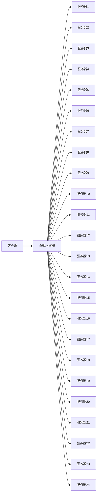

                 

# 负载均衡技术：提高系统可用性和性能

> 关键词：负载均衡, 高可用性, 系统性能, 网络流量, 虚拟IP, 健康检查

## 1. 背景介绍

在现代计算机系统中，随着应用程序的日益复杂和用户访问量的激增，保证系统的可用性和性能变得越来越重要。系统的高可用性和高性能要求我们必须正确地分配网络流量，确保系统不会因为某个服务器的故障或过载而导致整个系统的瘫痪。负载均衡技术应运而生，通过均衡分配网络流量，提高系统的可靠性、可用性和性能。

### 1.1 问题由来
随着互联网和云计算的普及，应用服务的访问量急剧增加。一方面，数据中心和云平台上的服务器资源有限；另一方面，用户在任何时间、任何地点都能访问应用，对服务的要求越来越高。如何在有限的服务器资源上，提供稳定可靠的服务，成为众多IT公司亟待解决的问题。

### 1.2 问题核心关键点
负载均衡的核心问题在于如何高效地将客户端请求分发到服务器上，避免单点故障和服务器过载，同时确保快速响应和高效计算。主要体现在以下几个方面：

- 分配策略：选择合适的负载均衡算法，合理分配网络流量。
- 高可用性：确保系统不会因为单个服务器的故障而影响整体服务。
- 性能优化：通过多服务器协作，提高系统处理请求的速度和响应时间。

## 2. 核心概念与联系

### 2.1 核心概念概述

为了更好地理解负载均衡技术，我们需要先了解一些关键概念：

- **负载均衡器(Load Balancer)**：是一种分发网络流量的设备，可以通过轮询、加权轮询、最少连接数等策略将请求分配到不同的服务器上。
- **健康检查(Health Check)**：用于检测服务器的状态，确保只有健康的服务器才能接收请求，避免将请求发送到故障或过载的服务器。
- **虚拟IP(Virtual IP)**：一个IP地址用于接收网络流量，而多个实际服务器共享该IP地址，保证系统的可靠性和可扩展性。
- **高可用性(High Availability)**：系统能够在故障发生时快速切换，保证服务不中断。

### 2.2 核心概念原理和架构的 Mermaid 流程图



这个流程图展示了负载均衡系统的基本架构，其中客户端请求首先到达负载均衡器，负载均衡器根据一定的规则，将请求转发到不同的服务器上，保证了系统的可靠性和可扩展性。

## 3. 核心算法原理 & 具体操作步骤

### 3.1 算法原理概述

负载均衡技术的核心在于如何公平且高效地分配请求。常见的负载均衡算法包括：

- **轮询(Round Robin)**：按照顺序依次将请求分配到服务器上。
- **加权轮询(Weighted Round Robin)**：根据服务器的负载情况，对服务器进行加权，分配更多的请求给负载较低的服务器。
- **最少连接数(Least Connections)**：将请求分配给当前连接数最少的服务器。
- **IP散列(IP Hash)**：将客户端IP地址的哈希值与服务器数量进行取模，将请求分配给对应的服务器。
- **随机(Random)**：随机选择一个服务器进行请求分发。

这些算法的选择要根据具体的应用场景和需求来确定，以达到最优的负载均衡效果。

### 3.2 算法步骤详解

一个典型的负载均衡过程包括以下步骤：

**Step 1: 收集请求**
客户端发送请求，负载均衡器接收请求。

**Step 2: 选择服务器**
根据选择的算法，负载均衡器选择接受请求的服务器。

**Step 3: 转发请求**
负载均衡器将请求转发给选择的服务器，服务器处理请求并返回响应。

**Step 4: 处理响应**
负载均衡器接收服务器响应，将响应返回给客户端。

**Step 5: 健康检查**
负载均衡器定期检查服务器的健康状态，确保只有健康的服务器接受请求。

**Step 6: 故障转移**
如果某个服务器出现故障，负载均衡器将请求转发到其他健康的服务器上。

**Step 7: 统计分析**
负载均衡器统计服务器的负载和性能数据，进行分析和优化。

### 3.3 算法优缺点

负载均衡算法有其优缺点，具体如下：

#### 优点：
- **公平性**：各个服务器接受请求的机会均等，避免了某个服务器的过载。
- **高可用性**：即使某个服务器故障，系统也能快速将请求转发到其他服务器上，保证服务不中断。
- **性能优化**：多个服务器协同工作，提高了系统的处理能力和响应速度。

#### 缺点：
- **延迟**：选择服务器和转发请求的过程会带来一定的延迟，可能会影响请求的实时性。
- **单点故障**：负载均衡器自身可能成为系统瓶颈，单点故障会严重影响系统的可用性。
- **复杂性**：不同的负载均衡算法需要根据具体场景进行配置和调整，配置不当可能导致效率低下。

### 3.4 算法应用领域

负载均衡技术广泛应用于互联网、云计算、高可用性系统等领域，具体如下：

- **互联网应用**：如电子商务、在线视频、社交网络等，需要保证高并发和高可用性。
- **云计算平台**：如AWS、Azure、Google Cloud等，通过负载均衡技术提供弹性计算和存储资源。
- **高可用性系统**：如金融系统、电信系统、政府服务系统等，需要保证系统不间断地提供服务。
- **CDN(内容分发网络)**：如Cloudflare、Akamai等，通过负载均衡技术加速内容分发，提高访问速度。
- **游戏服务器**：如王者荣耀、DOTA2等，通过负载均衡技术实现游戏服务的平滑负载，提高用户体验。

## 4. 数学模型和公式 & 详细讲解

### 4.1 数学模型构建

为了更好地理解负载均衡算法的数学模型，我们以轮询算法为例进行推导。设系统中有 $N$ 个服务器，每个服务器处理请求的速度为 $c_i$，单位时间内处理的请求数 $n$，则轮询算法的数学模型如下：

- **期望请求处理时间**：$E = \frac{n}{N}$
- **期望请求响应时间**：$T = E + \frac{1}{N} \sum_{i=1}^N \frac{1}{c_i}$

### 4.2 公式推导过程

轮询算法的基本流程如下：

1. 客户端发送请求。
2. 负载均衡器选择一个服务器。
3. 服务器处理请求。
4. 服务器返回响应。

设 $T_i$ 为第 $i$ 个服务器处理请求的时间，$C_i$ 为第 $i$ 个服务器的处理速度，则期望处理时间 $E$ 为：

$$
E = \frac{1}{N} \sum_{i=1}^N \frac{T_i}{c_i}
$$

由于每个服务器处理请求的时间近似相等，设 $T = \frac{1}{N} \sum_{i=1}^N T_i$，则期望处理时间 $E$ 为：

$$
E = \frac{1}{N} \sum_{i=1}^N \frac{T}{c_i} = \frac{T}{N} \sum_{i=1}^N \frac{1}{c_i}
$$

设每个服务器单位时间内处理的请求数为 $n$，则总处理时间 $T$ 为：

$$
T = \frac{n}{N} \sum_{i=1}^N \frac{1}{c_i}
$$

将 $T$ 代入 $E$ 的公式中，得到期望处理时间 $E$ 为：

$$
E = \frac{n}{N^2} \sum_{i=1}^N \frac{1}{c_i}
$$

由于每个服务器处理请求的时间近似相等，设 $T = \frac{1}{N} \sum_{i=1}^N T_i$，则期望处理时间 $E$ 为：

$$
E = \frac{T}{N} \sum_{i=1}^N \frac{1}{c_i}
$$

将 $T$ 代入 $E$ 的公式中，得到期望处理时间 $E$ 为：

$$
E = \frac{n}{N^2} \sum_{i=1}^N \frac{1}{c_i}
$$

### 4.3 案例分析与讲解

以Nginx为例，Nginx是一个高性能的Web服务器和反向代理，支持轮询、加权轮询、IP散列等多种负载均衡算法。

#### 案例1：轮询算法

```nginx
upstream backend {
    server 10.0.0.1:80;
    server 10.0.0.2:80;
    server 10.0.0.3:80;
}

server {
    listen 80;
    server_name example.com;
    location / {
        proxy_pass http://backend;
    }
}
```

以上配置实现了轮询算法，将请求轮询分配到三个服务器上。

#### 案例2：加权轮询算法

```nginx
upstream backend {
    server 10.0.0.1:80 weight=1;
    server 10.0.0.2:80 weight=2;
    server 10.0.0.3:80 weight=3;
}

server {
    listen 80;
    server_name example.com;
    location / {
        proxy_pass http://backend;
    }
}
```

以上配置实现了加权轮询算法，将请求分配到三个服务器上，加权参数分别为1、2、3，负载较低的服务器接受更多的请求。

## 5. 项目实践：代码实例和详细解释说明

### 5.1 开发环境搭建

为了实现负载均衡功能，我们需要搭建一个高可用性系统。以下是一个典型的负载均衡系统开发环境搭建流程：

1. 准备硬件资源：至少准备三台服务器，分别作为负载均衡器、主服务器和备用服务器。
2. 安装操作系统：在所有服务器上安装相同的操作系统，如CentOS、Ubuntu等。
3. 配置网络环境：在所有服务器上配置相同的IP地址和子网掩码。
4. 安装Nginx：在所有服务器上安装Nginx，并配置反向代理功能。
5. 配置数据库：将所有服务器的数据库配置文件备份到主服务器上。
6. 配置健康检查：在Nginx中配置健康检查功能，定期检查服务器的状态。
7. 配置故障转移：在Nginx中配置故障转移策略，将请求自动转移到备用服务器。

完成上述步骤后，即可在测试环境中进行负载均衡系统的测试。

### 5.2 源代码详细实现

以下是一个基于Nginx的负载均衡配置示例：

```nginx
upstream backend {
    server 10.0.0.1:80;
    server 10.0.0.2:80;
    server 10.0.0.3:80;
}

server {
    listen 80;
    server_name example.com;
    location / {
        proxy_pass http://backend;
    }
}
```

以上配置实现了轮询算法，将请求轮询分配到三个服务器上。

### 5.3 代码解读与分析

负载均衡系统的代码实现相对简单，但配置和调试需要一定的经验和技巧。

**Nginx配置文件**：
- `upstream`指令定义了反向代理的后台服务器列表。
- `server`指令定义了具体的服务器配置项，如IP地址、端口号、权重等。
- `location`指令定义了反向代理的请求处理规则。

**健康检查配置**：
- `proxy_check`指令定义了健康检查规则，定期检查服务器的状态。
- `proxy_next_upstream`指令定义了故障转移策略，将请求自动转移到备用服务器。

**负载均衡算法**：
- **轮询算法**：每个请求按照顺序依次分配给服务器。
- **加权轮询算法**：根据服务器的负载情况，对服务器进行加权，分配更多的请求给负载较低的服务器。
- **最少连接数算法**：将请求分配给当前连接数最少的服务器。
- **IP散列算法**：将客户端IP地址的哈希值与服务器数量进行取模，将请求分配给对应的服务器。
- **随机算法**：随机选择一个服务器进行请求分发。

## 6. 实际应用场景

### 6.1 互联网应用

互联网应用是最常见的负载均衡应用场景之一，如电子商务、在线视频、社交网络等。

#### 场景1：电子商务平台

电子商务平台需要保证高并发和高可用性。负载均衡器通过轮询或加权轮询算法，将请求分配到不同的服务器上，确保系统的稳定性和可靠性。

#### 场景2：在线视频平台

在线视频平台需要处理大量的并发请求，负载均衡器通过IP散列或随机算法，将请求分配到不同的服务器上，提高系统的处理能力和响应速度。

### 6.2 云计算平台

云计算平台需要提供弹性计算和存储资源，负载均衡器通过轮询或最少连接数算法，将请求分配到不同的服务器上，保证系统的扩展性和可用性。

#### 场景1：AWS EC2实例

AWS EC2实例需要处理大量的并发请求，负载均衡器通过轮询或加权轮询算法，将请求分配到不同的EC2实例上，确保系统的稳定性和可靠性。

#### 场景2：Kubernetes集群

Kubernetes集群需要处理大量的并发请求，负载均衡器通过IP散列或随机算法，将请求分配到不同的Kubernetes节点上，提高系统的处理能力和响应速度。

### 6.3 高可用性系统

高可用性系统需要保证系统不间断地提供服务，负载均衡器通过轮询或健康检查算法，将请求分配到不同的服务器上，确保系统的可靠性和可用性。

#### 场景1：金融系统

金融系统需要保证不间断地提供服务，负载均衡器通过轮询或加权轮询算法，将请求分配到不同的服务器上，确保系统的稳定性和可靠性。

#### 场景2：电信系统

电信系统需要处理大量的并发请求，负载均衡器通过IP散列或最少连接数算法，将请求分配到不同的服务器上，提高系统的处理能力和响应速度。

## 7. 工具和资源推荐

### 7.1 学习资源推荐

为了帮助开发者系统掌握负载均衡技术，这里推荐一些优质的学习资源：

1. **《高可用性系统设计》**：这是一本经典的系统设计书籍，详细介绍了高可用性系统的设计思路和实现方法，对理解负载均衡技术非常有帮助。
2. **《负载均衡技术与实现》**：这是一本介绍负载均衡技术的书籍，涵盖了各种负载均衡算法和实际应用案例。
3. **《Nginx权威指南》**：这本书是Nginx的经典手册，详细介绍了Nginx的安装、配置和调试方法。
4. **《高可用性系统开发》**：这是一门介绍高可用性系统开发的课程，涵盖了各种高可用性技术和负载均衡算法。
5. **《负载均衡技术与实战》**：这是一本实战型的负载均衡书籍，介绍了多种负载均衡技术和工具的实际应用案例。

### 7.2 开发工具推荐

为了实现负载均衡功能，我们需要使用一些常用的开发工具：

1. **Nginx**：Nginx是一个高性能的Web服务器和反向代理，支持轮询、加权轮询、IP散列等多种负载均衡算法。
2. **HAProxy**：HAProxy是一个高可用性负载均衡器，支持轮询、加权轮询、最少连接数等多种负载均衡算法。
3. **Apache HTTP Server**：Apache是一个高性能的Web服务器，支持轮询、IP散列等多种负载均衡算法。
4. **Kubernetes**：Kubernetes是一个容器编排平台，支持负载均衡和故障转移功能。
5. **Consul**：Consul是一个服务发现和配置管理工具，支持负载均衡和故障转移功能。

### 7.3 相关论文推荐

为了深入理解负载均衡技术，可以参考以下几篇相关论文：

1. **Load-Balancing Algorithms for Large-Scale Web-Services**：这篇文章介绍了多种负载均衡算法及其应用场景。
2. **High-Availability Web Services with Amazon EC2 Elastic Load Balancing**：这篇文章介绍了AWS EC2实例的负载均衡技术及其高可用性实现。
3. **Practical Guide to High-Availability Web Services in Kubernetes**：这篇文章介绍了Kubernetes集群的负载均衡和故障转移技术。
4. **Scalable Load Balancing Algorithms for High-Performance Clusters**：这篇文章介绍了多种负载均衡算法在高性能集群中的应用。
5. **Health Checks in Web Applications**：这篇文章介绍了健康检查技术的实现方法及其应用场景。

## 8. 总结：未来发展趋势与挑战

### 8.1 总结

本文对负载均衡技术进行了全面系统的介绍，涵盖了负载均衡的核心概念、算法原理、操作步骤和实际应用场景。通过本文的系统梳理，可以看到，负载均衡技术在互联网、云计算、高可用性系统等领域具有广泛的应用，对系统的可靠性、可用性和性能具有重要影响。

### 8.2 未来发展趋势

展望未来，负载均衡技术将呈现以下几个发展趋势：

1. **自适应算法**：未来的负载均衡算法将更加智能，能够根据实时数据动态调整分配策略，提高系统的响应速度和负载均衡效率。
2. **分布式算法**：未来的负载均衡算法将更加分布式，能够处理大规模的网络流量，提高系统的可扩展性和可靠性。
3. **智能化管理**：未来的负载均衡系统将更加智能化，能够实时监控系统的状态，自动调整负载均衡策略，提高系统的可用性和性能。
4. **多维度优化**：未来的负载均衡系统将更加注重多维度优化，如性能优化、故障转移、安全防护等，提高系统的综合性能。
5. **新兴技术融合**：未来的负载均衡系统将更加融合新兴技术，如人工智能、机器学习、区块链等，提高系统的智能化和安全性。

### 8.3 面临的挑战

尽管负载均衡技术已经取得了显著进展，但在迈向更加智能化、普适化应用的过程中，仍面临以下挑战：

1. **数据同步问题**：在分布式负载均衡系统中，各个节点的数据同步是一个难题，如何实现高效的数据同步，确保各个节点的状态一致，是一个重要问题。
2. **高并发问题**：在高并发场景下，负载均衡系统的性能瓶颈可能会凸显，如何优化系统的性能，提高并发处理能力，是一个重要问题。
3. **安全性问题**：负载均衡系统需要保证数据和服务的安全，如何设计安全机制，防止攻击和数据泄露，是一个重要问题。
4. **扩展性问题**：负载均衡系统需要具备良好的扩展性，如何设计可扩展的架构，应对大规模的数据流量和应用场景，是一个重要问题。
5. **算法优化问题**：现有的负载均衡算法在特定场景下可能会失效，如何优化算法，提高算法的适应性和鲁棒性，是一个重要问题。

### 8.4 研究展望

为了解决上述挑战，未来的负载均衡技术需要在以下几个方面进行深入研究：

1. **分布式同步技术**：研究分布式同步技术，实现各个节点的数据同步，确保系统的状态一致。
2. **高性能优化技术**：研究高性能优化技术，优化系统的性能，提高系统的并发处理能力。
3. **安全防护技术**：研究安全防护技术，设计安全机制，防止攻击和数据泄露，确保系统的安全性。
4. **可扩展架构设计**：研究可扩展架构设计，设计可扩展的负载均衡系统，应对大规模的数据流量和应用场景。
5. **算法优化研究**：研究算法优化研究，提高算法的适应性和鲁棒性，优化算法的性能。

## 9. 附录：常见问题与解答

**Q1：负载均衡算法有哪些？**

A: 常见的负载均衡算法包括轮询、加权轮询、最少连接数、IP散列、随机等。不同的算法适用于不同的应用场景，需要根据具体需求进行选择。

**Q2：负载均衡器有哪些？**

A: 常见的负载均衡器包括Nginx、HAProxy、Apache HTTP Server等。这些负载均衡器支持多种负载均衡算法，可以根据具体需求进行选择。

**Q3：负载均衡系统如何实现高可用性？**

A: 负载均衡系统可以通过健康检查、故障转移等技术实现高可用性。当某个服务器出现故障时，负载均衡器会将请求自动转移到其他健康的服务器上，确保系统不间断地提供服务。

**Q4：负载均衡系统的性能瓶颈有哪些？**

A: 负载均衡系统的性能瓶颈包括数据同步、高并发、安全性、扩展性、算法优化等。需要根据具体需求进行优化和改进。

**Q5：负载均衡系统如何实现可扩展性？**

A: 负载均衡系统可以通过分布式设计、可扩展架构设计等技术实现可扩展性。当负载增加时，可以通过增加节点数量等方式，提高系统的处理能力。

---

作者：禅与计算机程序设计艺术 / Zen and the Art of Computer Programming

