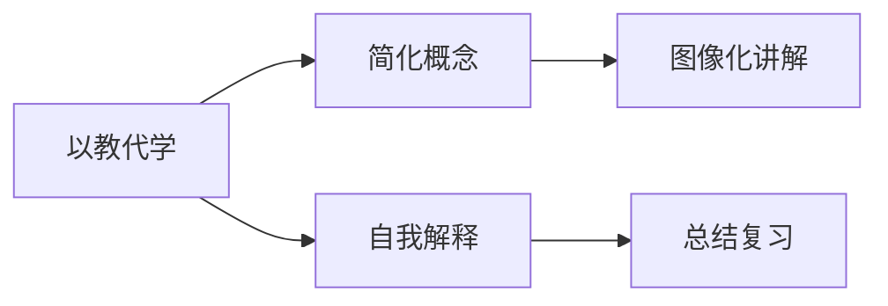

                 

## 1. 背景介绍

费曼学习法（Feynman Technique），也称为费曼技巧或费曼图法，源自于著名物理学家理查德·费曼（Richard Feynman）提出的一种学习策略。费曼认为，学习一项新知识的关键在于以教代学，即通过教授他人来巩固和加深自己的理解。费曼学习法的核心理念是通过讲解和演示，将复杂的知识转化为易于理解的形式，从而更好地掌握和应用。

然而，在实际应用中，费曼学习法存在着一些常见的误解和误区，这些误解不仅影响了其教学效果，也限制了其适用范围。本文将深入探讨费曼学习法的核心原理，澄清其常见的误解，并探讨其在不同场景中的应用和优化。

## 2. 核心概念与联系

### 2.1 核心概念概述

费曼学习法的核心概念包括以下几个方面：

- **以教代学**：通过教授他人来加深自己的理解和掌握新知识。
- **简化概念**：将复杂概念简化，用易于理解的方式进行讲解。
- **自我解释**：通过自我解释来测试和巩固对知识的理解。
- **图像化讲解**：利用图形、图表等形象化工具，帮助理解和记忆。

这些概念之间的联系可以概括为：通过教授他人（以教代学），简化和图像化（简化概念）新知识，并通过自我解释（自我解释）来测试和巩固自己的理解。

### 2.2 核心概念原理和架构的 Mermaid 流程图



该图展示了费曼学习法的核心步骤：首先通过教授他人（以教代学），简化概念（简化概念），然后进行自我解释（自我解释），并最终进行总结复习（总结复习）。

## 3. 核心算法原理 & 具体操作步骤

### 3.1 算法原理概述

费曼学习法的算法原理主要基于以下几点：

- **简化**：将复杂概念分解为更简单的子概念，便于理解和记忆。
- **图像化**：利用图表、图像等辅助工具，将抽象概念具象化。
- **讲解**：通过口头或书面形式，将简化和图像化后的知识传授给他人。
- **反馈**：在讲解过程中，接受听众的反馈，进一步优化讲解内容和方式。
- **总结**：将讲解内容整理总结，形成系统化的知识体系。

### 3.2 算法步骤详解

费曼学习法的具体操作步骤可以分为以下几个步骤：

**Step 1: 确定学习目标**
- 明确需要学习的新知识或技能。
- 列出学习目标，确保目标具体且可量化。

**Step 2: 自我讲解**
- 尝试将目标知识以简单、易于理解的方式讲解给自己。
- 遇到困难时，查找相关资料进行补充学习。

**Step 3: 简化概念**
- 将复杂概念进一步分解为更简单的子概念。
- 利用图表、图像等辅助工具，将抽象概念具象化。

**Step 4: 图像化讲解**
- 使用图表、图像等形象化工具，将简化后的知识讲解给自己。
- 确保讲解内容简明扼要，易于理解。

**Step 5: 自我测试**
- 尝试将简化后的知识讲解给他人，接受反馈并进一步优化。
- 通过书面形式记录讲解内容，进行自我测试。

**Step 6: 总结复习**
- 将讲解内容整理总结，形成系统化的知识体系。
- 定期复习和回顾，加深理解和记忆。

### 3.3 算法优缺点

费曼学习法的优点在于：

- **深入理解**：通过讲解和简化，帮助深入理解复杂概念。
- **记忆深刻**：通过图像化和自我测试，加深记忆。
- **灵活应用**：方法灵活，适用于多种学习场景。

其缺点包括：

- **依赖讲授对象**：需要找到合适的听众，且讲授对象可能需要一定的专业知识背景。
- **时间成本**：尤其是初期阶段，讲解和反馈过程可能耗费大量时间。
- **心理压力**：讲授过程中可能会遇到困难，产生心理压力。

### 3.4 算法应用领域

费曼学习法在多个领域都有广泛应用，包括但不限于：

- **学习新知识**：适用于各种学科的学习，如数学、物理、计算机科学等。
- **技能培训**：适用于技术、项目管理、沟通技巧等软技能的培训。
- **教学指导**：适用于教师的教学准备和学生的基础知识巩固。
- **知识传播**：适用于科普、学术讲座、企业培训等场景。

## 4. 数学模型和公式 & 详细讲解 & 举例说明

### 4.1 数学模型构建

费曼学习法的数学模型可以简单地表示为：

$$ \text{学习效果} = f(\text{简化程度}, \text{讲解方式}, \text{反馈质量}, \text{复习频率}) $$

其中，$ f $表示一个综合函数，代表学习效果与简化程度、讲解方式、反馈质量和复习频率之间的关系。

### 4.2 公式推导过程

为了更好地理解费曼学习法的数学模型，我们需要进一步推导出其中各个因素对学习效果的具体影响。假设每个学习者有 $ n $ 个知识点需要掌握，每个知识点的简化程度为 $ s_i $，讲解方式为 $ m_i $，反馈质量为 $ f_i $，复习频率为 $ r_i $。则学习效果的数学模型可以表示为：

$$ \text{学习效果} = \sum_{i=1}^{n} w_i \cdot s_i \cdot m_i \cdot f_i \cdot r_i $$

其中，$ w_i $ 表示第 $ i $ 个知识点对学习效果的权重。

### 4.3 案例分析与讲解

以学习线性代数为例，我们通过费曼学习法的四个步骤来详细分析：

**Step 1: 确定学习目标**
- 学习目标：掌握线性代数中的矩阵乘法。

**Step 2: 自我讲解**
- 尝试将矩阵乘法的概念简化并讲解给自己，例如：“矩阵乘法是两个矩阵通过特定规则相乘得到一个新的矩阵。”

**Step 3: 简化概念**
- 将矩阵乘法进一步分解为矩阵的向量乘法、矩阵的矩阵乘法等更简单的子概念。
- 使用图表和图像来辅助理解，例如：绘制矩阵的维度和运算规则。

**Step 4: 图像化讲解**
- 使用图表和图像来讲解矩阵乘法，例如：通过画图展示矩阵乘法的运算规则和步骤。
- 确保讲解内容简明扼要，易于理解。

**Step 5: 自我测试**
- 尝试将矩阵乘法讲解给他人，接受反馈并进一步优化讲解内容。
- 通过书面形式记录讲解内容，进行自我测试。

**Step 6: 总结复习**
- 将讲解内容整理总结，形成系统化的知识体系。
- 定期复习和回顾，加深理解和记忆。

## 5. 项目实践：代码实例和详细解释说明

### 5.1 开发环境搭建

为了进行费曼学习法的实践，我们需要搭建一个支持多种学习场景的开发环境。以下是一个基本的开发环境搭建流程：

1. **安装开发工具**：如PyCharm、VSCode等。
2. **配置开发环境**：安装Python、Pip、Anaconda等依赖。
3. **安装相关库**：如NumPy、Pandas、Matplotlib等。
4. **创建项目目录**：例如创建一个名为`feynman_learning`的Python项目。

### 5.2 源代码详细实现

以下是一个简单的Python代码示例，用于模拟费曼学习法的讲解过程：

```python
import numpy as np
import matplotlib.pyplot as plt

def matrix_multiplication(A, B):
    """矩阵乘法"""
    return np.dot(A, B)

def simple_explanation():
    """简化讲解"""
    return "矩阵乘法是两个矩阵通过特定规则相乘得到一个新的矩阵。"

def visualize():
    """图像化讲解"""
    A = np.array([[1, 2], [3, 4]])
    B = np.array([[5, 6], [7, 8]])
    C = matrix_multiplication(A, B)
    plt.imshow(C, cmap='gray')
    plt.title("矩阵乘法结果")
    plt.show()

def feedback():
    """获取反馈"""
    print("您的讲解是否清晰易懂？")
    response = input()
    return response

def summarize():
    """总结复习"""
    return "矩阵乘法的定义是两个矩阵通过特定规则相乘得到一个新的矩阵。"

if __name__ == "__main__":
    print(simple_explanation())
    visualize()
    response = feedback()
    print(summarize())
```

### 5.3 代码解读与分析

这段代码通过Python实现了费曼学习法的讲解过程：

1. **`matrix_multiplication`函数**：实现矩阵乘法的计算。
2. **`simple_explanation`函数**：简化讲解，说明矩阵乘法的基本概念。
3. **`visualize`函数**：图像化讲解，使用Matplotlib库绘制矩阵乘法的结果。
4. **`feedback`函数**：获取反馈，询问用户对讲解的评价。
5. **`summarize`函数**：总结复习，对矩阵乘法进行总结。

### 5.4 运行结果展示

通过运行这段代码，我们可以得到以下输出：

1. **简化讲解**："矩阵乘法是两个矩阵通过特定规则相乘得到一个新的矩阵。"
2. **图像化讲解**：矩阵乘法结果的图像。
3. **反馈**：用户对讲解的评价。
4. **总结复习**："矩阵乘法的定义是两个矩阵通过特定规则相乘得到一个新的矩阵。"

## 6. 实际应用场景

### 6.1 教育培训

在教育培训领域，费曼学习法可以用于学生和教师的学习准备和教学准备。例如，教师可以通过费曼学习法来准备上课内容，确保讲解清晰易懂；学生可以通过费曼学习法来巩固和复习课堂知识。

### 6.2 技术培训

在技术培训领域，费曼学习法可以用于开发者技能培训和知识传播。例如，开发者可以通过费曼学习法来讲解新的技术或框架，帮助团队成员理解。

### 6.3 项目管理

在项目管理领域，费曼学习法可以用于团队协作和任务分配。例如，项目经理可以通过费曼学习法来解释项目目标和任务，确保团队成员理解并明确任务要求。

### 6.4 未来应用展望

未来，费曼学习法将在更多领域得到应用，例如：

- **个性化学习**：通过大数据和人工智能技术，定制个性化的学习路径和讲解方式。
- **虚拟教练**：开发虚拟教练应用，帮助用户进行自我学习和讲解。
- **跨文化交流**：利用费曼学习法，促进不同语言和文化背景的学习者之间的交流和理解。

## 7. 工具和资源推荐

### 7.1 学习资源推荐

为了帮助用户系统掌握费曼学习法，以下是一些优质的学习资源推荐：

1. **《费曼学习法：提升学习能力与创新思维的秘籍》**：介绍了费曼学习法的核心理念和应用方法，适合初学者入门。
2. **《The Feynman Technique: A Proven Method to Accelerate Your Learning》**：作者保罗·道格拉斯（Paul Douglas）在书中详细介绍了费曼学习法的各个步骤和实践技巧，适合进阶学习。
3. **在线课程**：如Coursera、Udemy等平台上的相关课程，提供系统化的学习路径和实战案例。

### 7.2 开发工具推荐

为了支持费曼学习法的实践，以下是一些常用的开发工具推荐：

1. **Python**：支持费曼学习法的讲解和可视化，简单易学。
2. **PyCharm**：支持Python开发，提供丰富的调试和开发工具。
3. **Jupyter Notebook**：支持交互式编程和可视化，适合教学和讲解。
4. **GitHub**：支持代码版本控制和协作，方便团队合作。

### 7.3 相关论文推荐

以下是一些关于费曼学习法的研究论文，供读者参考：

1. **"Feynman Technique: A Simple, Universal Method for Teaching and Learning"**：作者Soroush Vosoughi等人在论文中介绍了费曼学习法的理论基础和应用方法。
2. **"Teaching Feynman: Visualizing the Feynman Technique for Learning Mathematics"**：作者Gene Kim等人在论文中详细介绍了费曼学习法在数学教育中的应用。
3. **"The Feynman Technique: A Science-Based Learning Method"**：作者Patrick Cox等人在论文中探讨了费曼学习法的科学依据和实际应用效果。

## 8. 总结：未来发展趋势与挑战

### 8.1 总结

本文对费曼学习法的核心原理进行了详细阐述，澄清了其常见的误解，并探讨了其在不同场景中的应用和优化。通过系统的介绍，希望能够帮助用户更好地理解和应用费曼学习法。

### 8.2 未来发展趋势

费曼学习法的未来发展趋势包括：

- **技术整合**：与人工智能、大数据等技术结合，提升个性化学习和自动讲解效果。
- **跨文化应用**：推广到不同语言和文化背景的学习者，促进跨文化交流和理解。
- **新应用场景**：拓展到更多领域，如虚拟教练、在线教育等。

### 8.3 面临的挑战

费曼学习法面临的挑战包括：

- **适用性问题**：某些复杂概念难以通过简化和图像化进行讲解。
- **时间成本**：讲解和反馈过程可能耗费大量时间。
- **技术门槛**：需要一定的技术背景和实践经验。

### 8.4 研究展望

未来，费曼学习法需要在以下几个方面进行研究：

- **多模态讲解**：结合音频、视频等多模态信息，提升讲解效果。
- **智能反馈**：利用人工智能技术，提供实时反馈和优化建议。
- **动态调整**：根据用户反馈动态调整讲解方式，提高学习效果。

## 9. 附录：常见问题与解答

### Q1：费曼学习法的核心步骤是什么？

**A1**：费曼学习法的核心步骤包括简化概念、图像化讲解、自我测试和总结复习。

### Q2：费曼学习法适用于哪些学习场景？

**A2**：费曼学习法适用于各种学科的学习、技能培训、教学指导、知识传播等场景。

### Q3：费曼学习法的优点和缺点分别是什么？

**A3**：费曼学习法的优点包括深入理解、记忆深刻、灵活应用；缺点包括依赖讲授对象、时间成本、心理压力。

### Q4：如何使用费曼学习法进行学习？

**A4**：首先确定学习目标，然后进行自我讲解、简化概念、图像化讲解、自我测试和总结复习。

### Q5：费曼学习法与传统学习方法的区别是什么？

**A5**：费曼学习法强调通过讲解和简化来理解知识，而传统学习方法往往侧重于反复记忆和练习。

---

作者：禅与计算机程序设计艺术 / Zen and the Art of Computer Programming

