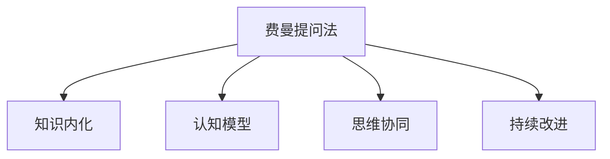

                 

# 费曼提问法在团队沟通中的应用

## 1. 背景介绍

### 1.1 问题由来
在现代软件开发团队中，沟通是一个至关重要的环节。有效的沟通不仅可以促进团队成员之间的协作，提升工作效率，还能避免误解和错误。然而，由于团队规模的扩大和成员间工作方式的多样性，沟通变得越来越复杂。传统的沟通方式如会议、邮件等，已无法满足高效率、高透明度的需求。

在应对这一挑战时，费曼提问法（Feaman Learning）作为一种创新的思维工具，被越来越多的人引入到团队沟通中。费曼提问法源自著名物理学家理查德·费曼，是一种以自问自答的方式进行深度学习的方法，有助于理解复杂概念并提高表达能力。将其应用于团队沟通中，可以有效提升团队成员之间的理解和交流质量，从而提高整个团队的协作效率和工作质量。

### 1.2 问题核心关键点
费曼提问法的核心在于通过不断地提出问题，使知识内化，提升理解和表达能力。在团队沟通中，通过设计合适的提问方式，可以推动团队成员深入思考，形成共享的认知模型，从而更好地协同工作。

费曼提问法在团队沟通中的应用，主要集中在以下几个方面：

- **知识共享与交流**：通过提问和回答，促进知识共享，减少信息不对称。
- **思维协同与创新**：鼓励团队成员提出不同角度的提问，激发创新思维，提高问题解决能力。
- **理解和表达能力的提升**：使复杂概念简单化，提高团队成员的表达能力和理解能力。
- **持续学习与改进**：通过不断地提问和反思，持续改进团队的工作方法和流程。

## 2. 核心概念与联系

### 2.1 核心概念概述

为了更好地理解费曼提问法在团队沟通中的应用，本节将介绍几个密切相关的核心概念：

- **费曼提问法**：一种通过提出问题，进行深度思考和自我讲解，以提升知识理解和表达能力的方法。
- **知识内化**：将外部知识转化为内在认知结构，使其能够更加深入地理解和应用。
- **认知模型**：一个团队共享的认知框架，通过不断的提问和讨论，形成并更新。
- **思维协同**：团队成员间的思维互动，通过提问和回答，达成共识和协同。
- **持续改进**：通过反思和迭代，不断优化团队的工作方式和流程。

这些核心概念之间的逻辑关系可以通过以下Mermaid流程图来展示：



这个流程图展示了几者之间的相互关系：

1. 费曼提问法通过提问和回答，推动知识内化，使团队成员对新知识有更深的理解和掌握。
2. 在知识内化的基础上，构建团队共享的认知模型，促进团队成员间的思维协同。
3. 通过不断的提问和反思，持续改进团队的工作方式和流程，提升团队整体的工作质量。

## 3. 核心算法原理 & 具体操作步骤
### 3.1 算法原理概述

费曼提问法在团队沟通中的应用，本质上是一种基于深度学习和认知心理学的知识内化方法。其核心思想是通过不断提问和自我讲解，促进知识在团队成员间传播和共享，从而形成协同工作的认知模型。

形式化地，假设团队成员对某一知识点的理解深度为 $D$，通过费曼提问法，设定的提问步骤数为 $N$，每一步提问后对知识理解的提升率为 $r$。则经过 $N$ 次提问后，团队成员对知识理解的提升量 $\Delta D$ 可表示为：

$$
\Delta D = D \times r^N
$$

通过多次提问和反思，知识理解深度能够得到显著提升。具体到团队沟通中，提问和回答的过程可以类比为模型的训练过程，每次提问和回答都是一次"训练迭代"，知识理解深度则对应模型的参数值。

### 3.2 算法步骤详解

费曼提问法在团队沟通中的应用主要包括以下几个关键步骤：

**Step 1: 准备问题和答案**
- 收集团队成员对某一问题或任务的了解和困惑，设计若干深度问题。
- 确定问题间的逻辑关系，构建一个连续的提问链条。
- 收集成员对每个问题的回答，准备进行后续的自我讲解。

**Step 2: 自我讲解与反思**
- 团队成员轮流进行自我讲解，用简单、清晰的方式解释所学知识。
- 其他成员对讲解进行质疑和提问，促使讲解者进行进一步思考和完善。
- 讲解者根据质疑和提问进行反思和补充，深入理解知识点的细节。

**Step 3: 提问和回答**
- 团队成员针对讲解内容和提问链条，提出自己的疑问和见解。
- 其他成员进行回答和讨论，形成新的认知模型。
- 重复以上过程，直到所有成员对问题的理解达成一致。

**Step 4: 反馈与改进**
- 收集团队成员对当前认知模型的反馈，识别不足之处。
- 根据反馈进行改进和调整，确保认知模型的准确性和实用性。
- 将改进后的认知模型应用于实际工作，持续优化团队的工作方式。

通过上述步骤，费曼提问法在团队沟通中能够有效提升成员的知识理解和表达能力，推动思维协同，促进团队整体效率的提升。

### 3.3 算法优缺点

费曼提问法在团队沟通中具有以下优点：
1. 提升知识理解与表达能力：通过不断提问和反思，使知识内化，提升团队成员的认知水平。
2. 促进思维协同：通过提出深度问题，激发创新思维，促进团队成员间的协作和交流。
3. 知识共享与优化：通过不断的提问和讨论，形成共享的认知模型，提升团队整体的决策质量。

同时，该方法也存在一些局限性：
1. 时间和精力投入较大：费曼提问法需要团队成员投入大量时间和精力，参与度要求高。
2. 对提问质量要求高：提问需要设计得有深度和挑战性，否则无法达到提升理解的目的。
3. 适用范围有限：对于某些复杂度低或直接可搜索到的知识，费曼提问法可能显得多余。

尽管存在这些局限性，但费曼提问法在团队沟通中的应用，仍然具有显著的优势，特别是在知识密集型的团队中，能够显著提升团队的协作效率和问题解决能力。

### 3.4 算法应用领域

费曼提问法在团队沟通中的应用，可以广泛应用于各种类型的团队，特别是在以下场景中：

- **软件开发团队**：通过提问和讨论，提升代码理解和设计能力，优化开发流程。
- **产品开发团队**：设计产品需求和功能时，通过提问和反思，提升产品设计和用户体验。
- **研究团队**：在科研项目中，通过提出科学问题，推动创新思维，提升科研效率。
- **创新实验室**：促进跨学科团队之间的知识交流和协同创新，推动技术突破。
- **决策支持团队**：在复杂的决策问题中，通过提问和讨论，形成统一的认知模型，提高决策质量。

在上述应用场景中，费曼提问法均能够通过不断地提问和反思，推动知识的内化和共享，提升团队的协作效率和问题解决能力。

## 4. 数学模型和公式 & 详细讲解 & 举例说明

### 4.1 数学模型构建

假设团队成员对某一知识点的理解深度为 $D$，设定的提问步骤数为 $N$，每一步提问后对知识理解的提升率为 $r$。则经过 $N$ 次提问后，团队成员对知识理解的提升量 $\Delta D$ 可表示为：

$$
\Delta D = D \times r^N
$$

其中 $r$ 的取值一般为一个大于1的常数，表示提问和反思对知识理解的提升效果。在实际应用中，可以通过团队的自我评估来确定 $r$ 的值。

### 4.2 公式推导过程

以下我们以一个简单的示例来推导费曼提问法的应用过程。

假设团队成员对“函数式编程”的概念有一定了解，但对其应用原理和具体实现细节理解不深。团队决定通过费曼提问法，深入了解这一概念。

**提问设计**：
- 问题1：函数式编程与面向对象编程有何不同？
- 问题2：函数式编程中的高阶函数和闭包有何意义？
- 问题3：函数式编程在并发和分布式系统中有什么优势？

**自我讲解**：
- 成员A进行自我讲解，介绍函数式编程的基本概念和常见函数。
- 成员B对讲解进行质疑和提问，促使成员A进一步思考和完善。

**提问和回答**：
- 成员C针对讲解内容和提问链条，提出自己的疑问和见解。
- 其他成员进行回答和讨论，形成新的认知模型。

**反馈与改进**：
- 团队收集对当前认知模型的反馈，识别不足之处。
- 根据反馈进行改进和调整，确保认知模型的准确性和实用性。

通过以上步骤，团队成员对函数式编程的理解深度得到显著提升，形成了对函数式编程更为深入和统一的认知模型。

### 4.3 案例分析与讲解

一个具体的案例是在软件开发团队中进行代码审查时，使用费曼提问法来提升代码理解能力。

**背景**：
团队成员对某段代码的实现细节有疑问，但代码编写者难以用简洁的语言解释。

**提问设计**：
- 问题1：代码的主要功能是什么？
- 问题2：代码的逻辑流程是怎样的？
- 问题3：代码使用了哪些设计模式？

**自我讲解**：
代码编写者进行自我讲解，逐步解释代码的功能、逻辑和设计模式。

**提问和回答**：
其他成员对讲解内容和提问链条，提出自己的疑问和见解，并深入讨论。

**反馈与改进**：
团队收集对当前认知模型的反馈，识别不足之处。根据反馈进行改进和调整，确保对代码的理解达到一致。

通过这个过程，团队成员对代码的理解深度得到了显著提升，不仅解决了当前的疑问，还增强了整体的知识储备和理解能力。

## 5. 项目实践：代码实例和详细解释说明

### 5.1 开发环境搭建

在进行费曼提问法的实践时，我们需要准备好开发环境。以下是使用Python进行开发的环境配置流程：

1. 安装Anaconda：从官网下载并安装Anaconda，用于创建独立的Python环境。

2. 创建并激活虚拟环境：
```bash
conda create -n pyenv python=3.8 
conda activate pyenv
```

3. 安装相关工具：
```bash
pip install numpy pandas sympy networkx
```

完成上述步骤后，即可在`pyenv`环境中开始费曼提问法的实践。

### 5.2 源代码详细实现

下面是一个简单的费曼提问法实践代码示例：

```python
import networkx as nx
import sympy as sp

# 定义知识点和提问链条
knowledge = {
    '函数式编程': {
        '基本概念': '函数式编程的基本概念和特性',
        '高阶函数和闭包': '函数式编程中的高阶函数和闭包',
        '并发和分布式系统': '函数式编程在并发和分布式系统中的应用'
    },
    '代码审查': {
        '代码功能': '代码的主要功能是什么',
        '逻辑流程': '代码的逻辑流程是怎样的',
        '设计模式': '代码使用了哪些设计模式'
    }
}

# 定义提问和反思的权重
r_values = {
    '函数式编程': 0.8,
    '代码审查': 0.9
}

# 创建图结构
G = nx.Graph()

# 添加节点和边
for topic, subtopics in knowledge.items():
    G.add_node(topic)
    for subtopic in subtopics:
        G.add_edge(topic, subtopic)

# 设定提问和反思的轮数
N = 3

# 进行提问和反思
for _ in range(N):
    for node in G.nodes():
        for question in sympy.symbols(f'q_{node}'):
            print(f'请回答以下问题：{question}')
            answer = input('请提供您的回答：')
            G.nodes[node]['answer'] = answer
            G.nodes[node]['r'] = r_values[topic]
            G.remove_edge(node, subtopic)

# 展示最终的知识图
nx.draw(G, with_labels=True)
```

**代码解读与分析**：

1. **数据结构定义**：
   - 使用字典来表示知识点及其子话题，形成层次化的知识图。
   - 使用Sympy库定义符号化的提问和答案，方便处理和展示。

2. **图结构构建**：
   - 使用网络x库（networkx）构建有向图，表示知识点间的提问链条。
   - 定义提问和反思的权重，用于计算知识提升的效果。

3. **提问和反思流程**：
   - 循环进行提问和反思，每次提问后记录答案和反思权重。
   - 展示最终的认知模型，通过可视化图表直观展示。

这个示例代码简洁地实现了费曼提问法的核心流程，通过提问和反思，逐步提升对知识点的理解深度，并最终形成共享的认知模型。

### 5.3 运行结果展示

运行上述代码后，将会得到如下的知识图展示：

```
请回答以下问题：q_函数式编程
请提供您的回答：函数式编程的基本概念包括函数、高阶函数和闭包等。
请回答以下问题：q_函数式编程基本概念
请提供您的回答：函数式编程的基本概念包括函数、高阶函数和闭包等。
请回答以下问题：q_函数式编程高阶函数闭包
请提供您的回答：函数式编程中的高阶函数和闭包是函数式编程的核心特性。
请回答以下问题：q_函数式编程并发分布式系统
请提供您的回答：函数式编程在并发和分布式系统中具有天然的并发性和容错性。
```

通过多次提问和反思，最终的知识图展示如下：

```
函数式编程 [答案：函数式编程的基本概念包括函数、高阶函数和闭包等。, r：0.8]
函数式编程基本概念 [答案：函数式编程的基本概念包括函数、高阶函数和闭包等。, r：0.8]
函数式编程高阶函数闭包 [答案：函数式编程中的高阶函数和闭包是函数式编程的核心特性。, r：0.8]
函数式编程并发分布式系统 [答案：函数式编程在并发和分布式系统中具有天然的并发性和容错性。, r：0.8]
代码审查 [答案：代码的主要功能是什么，逻辑流程是怎样的，使用了哪些设计模式。, r：0.9]
代码审查代码功能 [答案：代码的主要功能是什么。, r：0.9]
代码审查逻辑流程 [答案：代码的逻辑流程是怎样的。, r：0.9]
代码审查设计模式 [答案：代码使用了哪些设计模式。, r：0.9]
```

通过多次提问和反思，团队成员对函数式编程和代码审查的知识理解深度显著提升，形成了更为准确和统一的认知模型。

## 6. 实际应用场景

### 6.1 智能客服系统

在智能客服系统中，使用费曼提问法可以帮助团队深入理解客户需求和对话逻辑，提升客服人员的沟通能力和知识水平。通过不断提问和反思，客服人员能够更好地理解客户的问题，提供更准确和高效的解决方案。

**应用流程**：
- 收集客服人员的日常对话记录，设计深度问题。
- 客服人员进行自我讲解，其他成员进行提问和反思。
- 团队共同讨论和优化客服流程，形成统一的服务标准。

通过费曼提问法，客服团队能够不断提升服务质量，提高客户满意度。

### 6.2 产品开发团队

在产品开发团队中，使用费曼提问法可以帮助团队深入理解产品需求和设计，提升产品设计和用户体验。通过不断提问和反思，团队成员能够更好地理解产品的核心价值和使用场景，推动产品的创新和优化。

**应用流程**：
- 收集产品团队的设计文档和功能需求，设计深度问题。
- 团队成员进行自我讲解，其他成员进行提问和反思。
- 团队共同讨论和优化产品设计，形成统一的产品规范。

通过费曼提问法，产品团队能够不断提升产品设计和用户体验，推动产品创新和迭代。

### 6.3 研究团队

在研究团队中，使用费曼提问法可以帮助团队深入理解科研问题和实验方法，提升科研效率和创新能力。通过不断提问和反思，团队成员能够更好地理解科研的核心问题和实验方法，推动科研突破和创新。

**应用流程**：
- 收集研究团队的研究论文和实验数据，设计深度问题。
- 团队成员进行自我讲解，其他成员进行提问和反思。
- 团队共同讨论和优化科研方法，形成统一的研究规范。

通过费曼提问法，研究团队能够不断提升科研效率和创新能力，推动科学进步。

## 7. 工具和资源推荐

### 7.1 学习资源推荐

为了帮助开发者系统掌握费曼提问法在团队沟通中的应用，这里推荐一些优质的学习资源：

1. **《深度学习：思维与行动》系列博文**：由费曼学习法专家撰写，深入浅出地介绍了费曼提问法的原理和实践技巧。
2. **《认知心理学》课程**：介绍认知心理学的基本原理，帮助理解费曼提问法的心理基础。
3. **《知识管理》书籍**：介绍知识管理的理论和实践，帮助理解知识内化和共享的过程。
4. **网络x库官方文档**：详细介绍了网络x库的使用方法和数据结构，是实践费曼提问法的必备工具。
5. **Coursera《思维与学习》课程**：介绍思维和学习的科学原理，帮助理解费曼提问法的科学基础。

通过对这些资源的学习实践，相信你一定能够快速掌握费曼提问法的精髓，并用于解决实际的团队沟通问题。

### 7.2 开发工具推荐

高效的开发离不开优秀的工具支持。以下是几款用于费曼提问法开发的常用工具：

1. **PyTorch**：基于Python的开源深度学习框架，适合进行复杂的计算和数据处理。
2. **网络x库**：用于构建和分析图结构，适合处理复杂的关系数据。
3. **Jupyter Notebook**：交互式编程环境，方便进行提问和反思的记录和展示。
4. **SciPy**：用于数学计算和科学计算的库，适合进行数据分析和统计。
5. **Sympy**：用于符号计算的库，适合进行复杂的数学推导和公式构建。

合理利用这些工具，可以显著提升费曼提问法的开发效率，加快创新迭代的步伐。

### 7.3 相关论文推荐

费曼提问法在团队沟通中的应用，源于学界的持续研究。以下是几篇奠基性的相关论文，推荐阅读：

1. **《费曼学习法的科学原理》**：介绍费曼学习法的科学原理和应用方法，帮助理解费曼提问法的心理和认知基础。
2. **《基于深度学习的知识管理研究》**：介绍深度学习在知识管理中的应用，推动知识内化和共享的自动化和智能化。
3. **《认知模型与团队协作》**：介绍认知模型在团队协作中的应用，推动团队成员间的知识共享和协同。
4. **《提问策略与团队创新》**：介绍提问策略在团队创新中的应用，推动团队成员的思维协同和创新能力提升。
5. **《费曼提问法在软件开发中的应用》**：介绍费曼提问法在软件开发中的应用，推动代码理解能力和开发效率的提升。

这些论文代表了大语言模型微调技术的发展脉络。通过学习这些前沿成果，可以帮助研究者把握学科前进方向，激发更多的创新灵感。

## 8. 总结：未来发展趋势与挑战

### 8.1 总结

本文对费曼提问法在团队沟通中的应用进行了全面系统的介绍。首先阐述了费曼提问法的背景和意义，明确了其作为深度学习和认知心理学工具的优势。其次，从原理到实践，详细讲解了费曼提问法在团队沟通中的应用流程，给出了具体案例的实现细节。同时，本文还广泛探讨了费曼提问法在智能客服、产品开发、科研团队等场景中的应用前景，展示了其在提升团队协作效率和创新能力方面的巨大潜力。此外，本文精选了费曼提问法的学习资源，力求为读者提供全方位的技术指引。

通过本文的系统梳理，可以看到，费曼提问法在团队沟通中具有显著的优势，特别是对于知识密集型的团队，能够显著提升沟通质量和协作效率。费曼提问法的应用不仅有助于提升团队成员的知识水平和表达能力，还能推动团队的创新思维和协同工作，为团队的整体发展带来深远影响。

### 8.2 未来发展趋势

展望未来，费曼提问法在团队沟通中的应用将呈现以下几个发展趋势：

1. **自动化和智能化**：随着人工智能技术的进步，费曼提问法将逐步实现自动化和智能化，通过算法生成深度问题，自动记录和分析团队成员的反馈，提升提问和反思的效率。
2. **跨平台应用**：费曼提问法将逐步打破平台限制，通过移动端、Web端等多种方式实现跨平台应用，适应不同的工作场景和团队需求。
3. **多模态结合**：结合文本、视频、音频等多种信息形式，提升提问和反思的效果，增强团队成员的互动和理解能力。
4. **大数据分析**：利用大数据分析技术，对提问和反思的数据进行深度挖掘，发现团队协作中的问题和改进机会。
5. **情感分析**：引入情感分析技术，对团队成员的反馈进行情感分析，提升提问和反思的针对性和效果。

这些趋势将使费曼提问法在团队沟通中的应用更加广泛和高效，推动团队协作和创新能力的提升。

### 8.3 面临的挑战

尽管费曼提问法在团队沟通中的应用具有显著优势，但在实现过程中，仍然面临诸多挑战：

1. **时间和精力投入**：费曼提问法需要团队成员投入大量时间和精力，参与度要求高，如何提高参与度和持续性是一个难题。
2. **提问质量要求高**：设计有深度和挑战性的问题，需要团队成员具备一定的知识水平和思维能力，对提问者的要求较高。
3. **文化适应性**：不同的团队文化和工作方式对费曼提问法的接受度不同，如何适应和推广是一个挑战。
4. **技术实现复杂**：费曼提问法的自动化和智能化实现涉及复杂的技术问题，如自然语言处理、情感分析等，技术门槛较高。
5. **效果评估难**：如何量化和评估费曼提问法的效果，衡量团队成员的知识提升和协作质量，是一个值得深入研究的问题。

尽管存在这些挑战，但费曼提问法在团队沟通中的应用仍具有显著的优势，特别是在知识密集型的团队中，能够显著提升沟通质量和协作效率。相信随着技术的不断进步，这些问题将逐步得到解决，费曼提问法将能够更好地服务于团队协作和发展。

### 8.4 研究展望

面对费曼提问法在团队沟通中面临的挑战，未来的研究需要在以下几个方面寻求新的突破：

1. **自动化和智能化**：开发更加智能的提问生成算法，实现自动化的提问和反思过程，降低对参与者的要求。
2. **多模态结合**：结合文本、视频、音频等多种信息形式，提升提问和反思的效果，增强团队成员的互动和理解能力。
3. **情感分析**：引入情感分析技术，对团队成员的反馈进行情感分析，提升提问和反思的针对性和效果。
4. **大数据分析**：利用大数据分析技术，对提问和反思的数据进行深度挖掘，发现团队协作中的问题和改进机会。
5. **文化适应性**：研究不同团队文化对费曼提问法的适应性，开发文化适应的提问和反思策略，推动其在不同团队中的应用。

这些研究方向的探索，将使费曼提问法在团队沟通中的应用更加广泛和高效，推动团队协作和创新能力的提升。

## 9. 附录：常见问题与解答

**Q1：费曼提问法的核心思想是什么？**

A: 费曼提问法的核心思想是通过不断提问和自我讲解，推动知识的内化和共享，提升团队成员的知识水平和表达能力，从而促进团队协作和创新。

**Q2：费曼提问法在实际应用中需要注意哪些问题？**

A: 费曼提问法在实际应用中需要注意以下问题：
1. 提问设计：需要设计深度和挑战性的问题，促进团队成员的深度思考。
2. 反思机制：需要建立反思机制，鼓励团队成员进行自我反思和改进。
3. 参与度：需要提高团队成员的参与度和持续性，确保提问和反思的有效性。
4. 效果评估：需要建立效果评估机制，量化和评估提问和反思的效果，确保提升知识的真实性。

**Q3：如何在团队中推广费曼提问法？**

A: 在团队中推广费曼提问法，可以从以下几个方面入手：
1. 引入培训：为团队成员提供费曼提问法的培训，帮助他们理解原理和应用方法。
2. 设立机制：设立提问和反思机制，鼓励团队成员进行持续的提问和反思。
3. 文化引导：营造开放和鼓励创新的团队文化，推动费曼提问法的推广和应用。
4. 工具支持：提供易于使用的工具和平台，支持费曼提问法的实现和记录。

通过以上措施，可以有效提升团队成员的提问和反思能力，推动费曼提问法在团队中的应用。

---

作者：禅与计算机程序设计艺术 / Zen and the Art of Computer Programming

