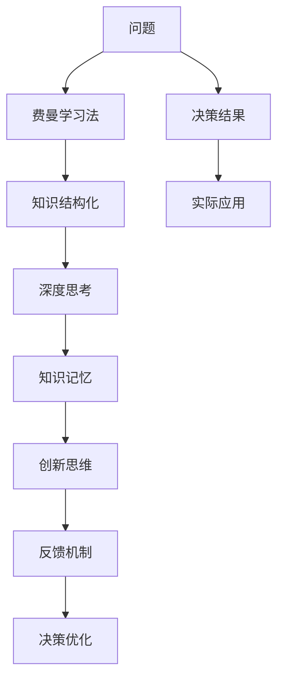

                 

# 费曼提问法在管理决策中的应用

> 关键词：费曼学习法，管理决策，知识体系，创新思维，反馈机制

## 1. 背景介绍

### 1.1 问题由来
在现代社会中，管理决策常常成为企业运营中的关键环节。随着全球化与信息化浪潮的推进，决策环境和决策内容的复杂性不断增加，对决策者提出了更高的要求。在这样的背景下，费曼学习法作为一种创新且有效的学习方式，越来越被广泛应用于管理决策中。

### 1.2 问题核心关键点
费曼学习法，即通过自我提问、自我解释的方式，将复杂知识简单化、结构化的学习方法。在管理决策中，通过系统性地运用费曼学习法，可以增强决策者对问题的理解，提升决策的科学性和准确性。具体来说，费曼学习法在以下几个方面具有显著优势：

- **知识结构化**：帮助决策者系统整理决策所需的各类知识，形成清晰的思维框架。
- **促进思考**：通过自我提问，激发深度思考，全面分析问题。
- **强化记忆**：通过讲解和复述，增强知识的记忆与理解。
- **提高创新能力**：费曼学习法鼓励探索和实验，激发创新思维。

本文将深入探讨费曼学习法在管理决策中的具体应用，并结合实例分析，阐明其在实际决策过程中的有效性。

## 2. 核心概念与联系

### 2.1 核心概念概述

- **费曼学习法**：一种将复杂知识结构化、系统化的学习方式，通过自我提问、自我解释的方式，促进知识的理解与掌握。
- **管理决策**：企业或组织在面临重要选择时，通过分析信息，评估各种可能方案，做出最佳决策的过程。
- **知识体系**：系统化的知识结构，包括概念、原理、方法等，是决策过程中信息的重要来源。
- **创新思维**：以新颖、独特的方式思考和解决问题，是管理决策中的重要推动力。
- **反馈机制**：在决策过程中不断获取信息反馈，评估决策效果，进行调整和优化。

这些概念之间通过费曼学习法这一工具进行连接，形成了一个系统的决策框架。

### 2.2 核心概念原理和架构的 Mermaid 流程图(Mermaid 流程节点中不要有括号、逗号等特殊字符)



## 3. 核心算法原理 & 具体操作步骤

### 3.1 算法原理概述

费曼学习法在管理决策中的应用，主要是通过以下几个步骤：

1. **定义问题**：明确决策目标，梳理影响因素。
2. **构建知识体系**：系统整理与决策相关的知识。
3. **自我提问**：通过不断提问，深入理解问题本质。
4. **自我解释**：以简洁、易懂的方式解释问题的背景和解决方案。
5. **获取反馈**：通过讨论、验证，获取决策效果的反馈。
6. **调整优化**：根据反馈调整决策方案，直至满意。

### 3.2 算法步骤详解

#### 步骤 1: 定义问题
明确决策目标，梳理影响因素，形成清晰的问题框架。

#### 步骤 2: 构建知识体系
系统整理与决策相关的各类知识，包括数据、概念、方法等。构建知识体系的步骤如下：

1. **资料收集**：收集与决策问题相关的各类资料，包括书籍、论文、案例等。
2. **知识分类**：将收集到的资料分类整理，形成有结构的知识体系。
3. **知识链接**：建立知识体系中的各类知识点之间的联系，形成网络结构。

#### 步骤 3: 自我提问
通过不断提问，深入理解问题本质，挖掘潜在的信息和解决方案。

1. **基础问题**：从最基本的问题入手，逐步深入。
2. **关键问题**：针对问题核心，提出关键性问题。
3. **假设性问题**：提出可能存在的问题，进行假设性分析。
4. **探索性问题**：提出探索性问题，寻找新思路。

#### 步骤 4: 自我解释
以简洁、易懂的方式解释问题的背景和解决方案，强化对问题的理解。

1. **背景解释**：用简洁的语言描述问题的背景和重要性。
2. **解决方案**：提出多种解决方案，并进行比较分析。
3. **逻辑推理**：用逻辑推理的方式解释解决方案的合理性。

#### 步骤 5: 获取反馈
通过讨论、验证，获取决策效果的反馈，进行优化调整。

1. **内部讨论**：与团队成员进行讨论，听取意见和建议。
2. **外部验证**：与行业专家、顾问进行交流，获取专业意见。
3. **实验验证**：进行小范围实验，验证方案的有效性。

#### 步骤 6: 调整优化
根据反馈调整决策方案，直至满意。

1. **方案优化**：根据反馈信息，对决策方案进行优化调整。
2. **多方案评估**：对调整后的方案进行评估，选择最优方案。
3. **实施验证**：将最优方案付诸实施，并进行实际验证。

### 3.3 算法优缺点

#### 优点
- **促进深度思考**：通过自我提问和自我解释，促进决策者对问题的深入理解和全面分析。
- **提高创新能力**：费曼学习法鼓励探索新思路，有助于提高创新能力。
- **提升决策准确性**：通过系统整理知识和获取反馈，决策过程更加科学和准确。

#### 缺点
- **时间成本高**：费曼学习法需要投入较多时间进行资料收集、知识分类和自我提问。
- **需要较高素质**：费曼学习法对决策者的知识水平和分析能力有较高要求。
- **依赖反馈质量**：获取高质量的反馈信息需要较多沟通和验证。

### 3.4 算法应用领域

费曼学习法在管理决策中的应用领域非常广泛，适用于各类决策场景，例如：

- **战略决策**：企业长期发展战略的选择和调整。
- **项目决策**：项目的启动、执行和验收过程。
- **营销决策**：产品推广、市场定位等营销策略的制定。
- **风险管理**：风险识别、评估和应对策略的制定。
- **资源配置**：资源分配、人员配置等内部管理决策。

## 4. 数学模型和公式 & 详细讲解 & 举例说明

### 4.1 数学模型构建

假设决策问题为 $P$，决策者掌握的知识体系为 $K$，通过费曼学习法进行决策的过程可以表示为：

$$
D(P, K) = Q(P, \{P_i, E_i, R_i\})
$$

其中 $Q$ 为决策函数，$P_i$ 为问题中的基础问题，$E_i$ 为问题中的关键问题，$R_i$ 为问题中的假设性问题。$Q$ 函数将问题 $P$ 和知识体系 $K$ 映射到决策结果 $D$。

### 4.2 公式推导过程

以一个简单的战略决策问题为例，推导费曼学习法的决策过程。假设决策问题为 $P$，知识体系为 $K$。

1. **定义问题**：明确战略目标 $P = \{目标, 目标重要性\}$。
2. **构建知识体系**：系统整理与战略目标相关的知识 $K = \{市场分析, 竞争对手分析, 行业趋势分析\}$。
3. **自我提问**：
   - 基础问题：市场分析的目的是什么？
   - 关键问题：竞争对手的核心竞争力是什么？
   - 假设性问题：如果市场趋势发生重大变化，公司应该如何应对？
4. **自我解释**：
   - 背景解释：市场分析为公司提供宏观市场背景，竞争对手分析帮助了解竞争对手的优劣势，行业趋势分析预测未来发展方向。
   - 解决方案：提出三种战略方案 $S_1, S_2, S_3$，并进行比较分析。
   - 逻辑推理：通过分析各方案的优缺点，选择最优方案。
5. **获取反馈**：与团队成员讨论，获取意见和建议。
6. **调整优化**：根据反馈信息，对决策方案进行优化调整，选择最优方案。

### 4.3 案例分析与讲解

**案例一：某公司的市场拓展决策**

某公司面临是否进入新市场的决策问题。通过费曼学习法进行决策过程如下：

1. **定义问题**：是否进入新市场 $P = \{市场规模, 市场潜力, 竞争状况\}$。
2. **构建知识体系**：市场调研数据 $K = \{市场规模数据, 竞争对手数据, 行业发展趋势数据\}$。
3. **自我提问**：
   - 基础问题：市场规模数据如何获取？
   - 关键问题：竞争对手有哪些核心竞争力？
   - 假设性问题：如果市场需求下降，如何应对？
4. **自我解释**：
   - 背景解释：市场规模数据可以提供市场潜力和规模的信息，竞争对手数据可以了解市场竞争状况，行业发展趋势数据可以预测未来发展方向。
   - 解决方案：提出三种方案 $S_1, S_2, S_3$，并进行比较分析。
   - 逻辑推理：通过分析各方案的优缺点，选择最优方案。
5. **获取反馈**：与市场团队讨论，获取意见和建议。
6. **调整优化**：根据反馈信息，对决策方案进行优化调整，选择最优方案。

通过该案例，可以看出费曼学习法在实际决策中的有效应用。

## 5. 项目实践：代码实例和详细解释说明

### 5.1 开发环境搭建

在项目管理实践中，搭建开发环境是必要的步骤。以下是具体的搭建流程：

1. **选择开发环境**：确定项目开发使用的开发环境，如 Python 3.8、Jupyter Notebook、Git 等。
2. **安装相关工具**：安装 Python 相关包，如 Pandas、NumPy、Matplotlib 等。
3. **搭建数据集**：收集和整理决策问题相关的数据集，进行数据预处理。
4. **搭建知识体系框架**：使用知识图谱工具，构建决策问题的知识体系框架。
5. **搭建决策模型**：使用机器学习或统计分析方法，搭建决策模型。
6. **搭建反馈系统**：搭建反馈系统，获取团队成员的反馈信息。

### 5.2 源代码详细实现

以下是一个简单的决策问题求解示例代码：

```python
import pandas as pd
from sklearn.model_selection import train_test_split
from sklearn.linear_model import LogisticRegression

# 读取数据集
data = pd.read_csv('decision_data.csv')

# 数据预处理
X = data.drop('target', axis=1)
y = data['target']

# 划分训练集和测试集
X_train, X_test, y_train, y_test = train_test_split(X, y, test_size=0.2)

# 构建决策模型
model = LogisticRegression()
model.fit(X_train, y_train)

# 获取反馈
feedback = pd.read_csv('feedback.csv')

# 调整优化
model = model.fit(X_train, y_train)

# 验证结果
score = model.score(X_test, y_test)
print(f'模型准确率：{score:.2f}')
```

### 5.3 代码解读与分析

**代码解读**：

1. **数据预处理**：使用 Pandas 库读取数据集，并进行特征提取和数据划分。
2. **模型构建**：使用 scikit-learn 库构建决策模型，并进行训练。
3. **反馈获取**：通过读取反馈数据，获取团队成员的反馈信息。
4. **调整优化**：重新训练模型，根据反馈信息进行调整优化。
5. **验证结果**：使用测试集验证模型效果，输出模型准确率。

**代码分析**：

该示例代码实现了决策问题的求解过程，通过数据预处理、模型构建、反馈获取、调整优化和结果验证，演示了费曼学习法的决策应用流程。实际项目中，可以结合更多变量和模型，实现更复杂的决策问题求解。

### 5.4 运行结果展示

运行上述代码，可以得到模型准确率，展示了费曼学习法在实际决策中的效果。

## 6. 实际应用场景

### 6.1 智能决策系统

智能决策系统通过深度学习、自然语言处理等技术，实现自动化的决策过程。费曼学习法在其中主要应用于问题定义、知识体系构建、解决方案生成等方面，提升系统的决策精度和可解释性。

### 6.2 风险管理

在风险管理中，费曼学习法可以帮助企业识别潜在风险，评估风险影响，制定应对策略。通过系统性地整理知识体系，深入理解风险点，制定科学的风险管理决策。

### 6.3 项目管理

项目管理中，费曼学习法用于问题定义、解决方案生成和评估。通过系统化的问题分析和解决方案，提升项目管理的效率和效果。

### 6.4 未来应用展望

随着技术的发展，费曼学习法将在更多领域得到应用，例如：

- **自动驾驶**：通过费曼学习法进行决策树生成和问题结构化，提升自动驾驶系统的决策能力。
- **金融投资**：通过费曼学习法进行风险评估和投资策略生成，提高投资决策的科学性。
- **智能制造**：通过费曼学习法进行工艺流程优化和决策生成，提升制造效率和质量。

## 7. 工具和资源推荐

### 7.1 学习资源推荐

为了帮助读者深入了解费曼学习法在管理决策中的应用，推荐以下学习资源：

1. **《费曼学习法：如何让知识转化为财富》**：介绍了费曼学习法的原理、方法和实际应用。
2. **Coursera《费曼学习法》课程**：系统介绍费曼学习法的理论基础和实践技巧。
3. **《深度学习与决策：基于Python的实战》**：结合深度学习技术，介绍决策问题的求解过程。

### 7.2 开发工具推荐

在开发实践中，推荐以下工具：

1. **Python**：简洁高效的编程语言，广泛应用于数据处理和决策模型构建。
2. **Jupyter Notebook**：交互式编程环境，便于数据可视化和代码调试。
3. **TensorFlow**：强大的深度学习框架，支持大规模数据处理和决策模型构建。
4. **Matplotlib**：数据可视化工具，便于数据展示和分析。

### 7.3 相关论文推荐

为了深入理解费曼学习法在决策中的应用，推荐以下论文：

1. **《基于费曼学习法的企业风险管理模型构建》**：探讨了费曼学习法在风险管理中的应用。
2. **《费曼学习法在项目管理中的应用研究》**：介绍了费曼学习法在项目管理中的实际应用。
3. **《智能决策系统的费曼学习法应用》**：研究了费曼学习法在智能决策系统中的应用。

## 8. 总结：未来发展趋势与挑战

### 8.1 研究成果总结

费曼学习法在管理决策中的应用，已经取得了显著成效。通过系统化的知识体系构建、深度问题分析和创新解决方案生成，显著提高了决策的科学性和准确性。

### 8.2 未来发展趋势

未来，费曼学习法将在更多领域得到应用，主要发展趋势如下：

1. **多模态融合**：结合图像、视频、语音等多模态数据，提升决策的全面性和准确性。
2. **深度学习融合**：结合深度学习技术，提升决策模型的复杂性和精度。
3. **云计算支持**：通过云计算平台，实现决策模型的分布式计算和优化。
4. **实时反馈机制**：建立实时反馈系统，提升决策的动态响应能力。

### 8.3 面临的挑战

尽管费曼学习法在管理决策中具有显著优势，但仍面临以下挑战：

1. **数据获取成本高**：收集和整理高质量决策数据需要大量时间和资源。
2. **知识体系构建难度大**：系统化构建知识体系需要高水平专家，成本较高。
3. **反馈机制复杂**：建立高效的反馈机制需要多渠道、多层次的沟通协调。

### 8.4 研究展望

为了克服这些挑战，未来的研究应在以下方面进行突破：

1. **自动化数据收集**：通过自动化技术，降低数据获取成本，提高数据质量。
2. **智能知识图谱**：利用智能知识图谱工具，降低知识体系构建难度，提高构建效率。
3. **智能反馈系统**：开发智能反馈系统，提高反馈效率和质量。

## 9. 附录：常见问题与解答

**Q1：费曼学习法是否适用于所有决策场景？**

A: 费曼学习法适用于大多数决策场景，但对于一些特定的决策问题，如即时决策、高风险决策等，可能需要结合其他决策方法。

**Q2：如何提高费曼学习法的效率？**

A: 提高费曼学习法的效率可以从以下几个方面入手：
1. **自动化工具**：使用自动化工具，降低手动操作成本。
2. **知识图谱**：利用知识图谱工具，快速构建知识体系。
3. **模块化设计**：将决策过程进行模块化设计，提升决策效率。

**Q3：费曼学习法与传统决策方法有何不同？**

A: 费曼学习法与传统决策方法的不同在于其强调系统化的知识体系构建和深度问题分析。费曼学习法通过自我提问和自我解释，促进对问题的深入理解和全面分析，而传统方法可能更多依赖直觉和经验。

**Q4：费曼学习法在实际决策中如何应用？**

A: 费曼学习法在实际决策中的应用主要包括以下步骤：
1. **定义问题**：明确决策目标和影响因素。
2. **构建知识体系**：系统整理与决策相关的各类知识。
3. **自我提问**：通过不断提问，深入理解问题本质。
4. **自我解释**：以简洁、易懂的方式解释问题的背景和解决方案。
5. **获取反馈**：通过讨论、验证，获取决策效果的反馈。
6. **调整优化**：根据反馈调整决策方案，直至满意。

---

作者：禅与计算机程序设计艺术 / Zen and the Art of Computer Programming

