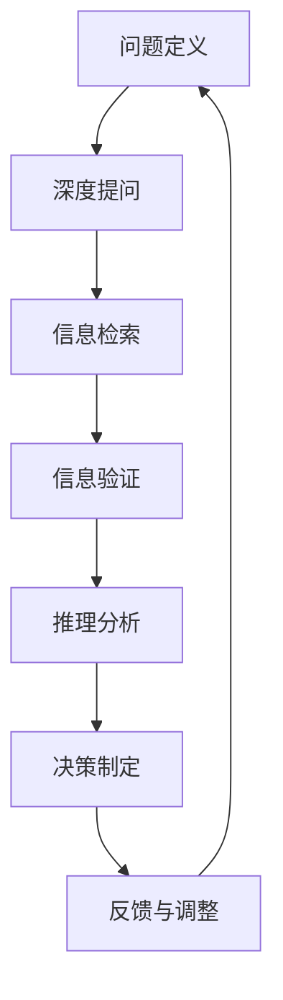

                 

## 1. 背景介绍

在管理学中，决策制定是一个复杂且充满挑战的过程。决策者需要综合考虑多种因素，包括数据、经验、知识、情感等，以做出最优选择。传统的决策制定方法，如决策树、SWOT分析等，虽然在某种程度上有效，但在信息量和复杂性不断增加的现代商业环境中，显得有些力不从心。

费曼提问法（Feynman Technique）源于著名物理学家理查德·费曼的思考方法，旨在通过提问和解答来深入理解和掌握复杂概念。将这一方法引入管理决策中，能够帮助决策者系统化地分析问题，全面掌握相关信息，从而做出更科学、更合理的决策。

## 2. 核心概念与联系

### 2.1 核心概念概述

费曼提问法基于以下几个核心概念：

- **费曼学习法**：通过向自己提问，将复杂知识转化为易懂的语言，巩固学习成果。
- **深度提问**：针对目标问题，提出一系列深入且具体的问题，引导思维向核心要素深入。
- **结构化思考**：将问题分解为多个层次和维度，形成系统化的思考框架。
- **信息检索**：利用已知信息或知识库，查找和验证问题的答案，不断迭代优化。

这些概念在管理决策中的应用，能够帮助决策者系统化、结构化地分析问题，深入挖掘问题的本质，并利用已有信息辅助决策制定。

### 2.2 核心概念原理和架构的 Mermaid 流程图



这个流程图展示了费曼提问法在管理决策中的应用过程：

1. **问题定义**：明确决策目标和需要解决的具体问题。
2. **深度提问**：针对问题，提出一系列深入且具体的问题，逐步深入问题本质。
3. **信息检索**：利用已知信息或知识库，查找和验证问题的答案。
4. **信息验证**：对检索到的信息进行交叉验证，确保其准确性和可靠性。
5. **推理分析**：综合推理分析，形成对问题的全面理解。
6. **决策制定**：基于分析结果，做出最优决策。
7. **反馈与调整**：根据决策结果和反馈，不断调整和优化决策过程。

## 3. 核心算法原理 & 具体操作步骤

### 3.1 算法原理概述

费曼提问法的核心在于通过深度提问和信息检索，深入理解问题本质，形成全面且准确的决策支持。其原理可以概括为以下几个步骤：

1. **问题定义**：明确决策目标和需要解决的具体问题。
2. **深度提问**：针对问题，提出一系列深入且具体的问题，逐步深入问题本质。
3. **信息检索**：利用已知信息或知识库，查找和验证问题的答案。
4. **信息验证**：对检索到的信息进行交叉验证，确保其准确性和可靠性。
5. **推理分析**：综合推理分析，形成对问题的全面理解。
6. **决策制定**：基于分析结果，做出最优决策。
7. **反馈与调整**：根据决策结果和反馈，不断调整和优化决策过程。

### 3.2 算法步骤详解

#### 3.2.1 问题定义

在管理决策中，明确决策目标和问题至关重要。具体步骤如下：

1. **确定决策范围**：明确决策涉及的具体范围，包括时间、空间、人员、资源等。
2. **确定决策目标**：明确决策希望达到的具体目标，如提高效率、增加收益、降低成本等。
3. **确定决策标准**：明确决策的评估标准，如时间、成本、质量、风险等。

#### 3.2.2 深度提问

深度提问是费曼提问法的核心步骤，通过深入且具体的问题，逐步挖掘问题的本质。具体步骤如下：

1. **基本问题**：从最基本的问题入手，逐步深入，如“公司目前的运营状况如何？”。
2. **详细问题**：针对基本问题，提出更具体的问题，如“公司的销售渠道有哪些？”。
3. **深层次问题**：继续深入，提出更深层次的问题，如“公司如何提高渠道效率？”。
4. **关键问题**：挖掘问题的核心，如“公司的主要竞争对手是谁？”。

#### 3.2.3 信息检索

信息检索是利用已知信息或知识库，查找和验证问题的答案。具体步骤如下：

1. **收集信息**：收集相关的历史数据、行业报告、专家意见等。
2. **整理信息**：将收集的信息进行整理和分类，形成结构化的信息库。
3. **验证信息**：对收集的信息进行交叉验证，确保其准确性和可靠性。

#### 3.2.4 信息验证

信息验证是确保信息准确性和可靠性的重要步骤，具体步骤如下：

1. **数据来源验证**：确认数据的来源是否可靠，避免使用虚假或过时的数据。
2. **数据一致性验证**：检查不同数据源之间的一致性，确保数据的一致性和可信度。
3. **数据质量验证**：对数据进行质量检查，如完整性、准确性、时效性等。

#### 3.2.5 推理分析

推理分析是综合已有信息，形成对问题的全面理解，具体步骤如下：

1. **分析数据**：对收集的数据进行分析，找出数据之间的关联和规律。
2. **模型构建**：根据分析结果，构建数学模型或决策树，形成决策支持。
3. **情景模拟**：对构建的模型进行情景模拟，评估不同决策方案的效果。

#### 3.2.6 决策制定

决策制定是基于分析结果，做出最优决策，具体步骤如下：

1. **方案评估**：评估不同决策方案的优缺点，形成决策备选方案。
2. **方案选择**：根据决策标准，选择最优决策方案。
3. **决策执行**：制定执行计划，明确责任人和时间节点。

#### 3.2.7 反馈与调整

反馈与调整是确保决策科学性的重要步骤，具体步骤如下：

1. **结果评估**：评估决策执行效果，收集反馈信息。
2. **结果分析**：分析反馈信息，找出问题点和改进点。
3. **调整优化**：根据分析结果，调整和优化决策过程。

### 3.3 算法优缺点

#### 3.3.1 优点

1. **系统化分析**：通过结构化的提问和分析，系统化地掌握问题本质，避免遗漏重要信息。
2. **深度挖掘**：通过深入提问，逐步深入问题本质，形成全面且准确的理解。
3. **信息验证**：通过信息验证，确保信息的准确性和可靠性，避免决策失误。
4. **决策支持**：通过推理分析，形成科学决策支持，提高决策质量。
5. **持续优化**：通过反馈与调整，不断优化决策过程，提升决策效果。

#### 3.3.2 缺点

1. **耗时较长**：深度提问和信息验证需要大量时间和精力，可能影响决策时效性。
2. **依赖信息源**：信息检索依赖已有信息和知识库，可能存在信息不全或过时的问题。
3. **需要专业知识**：费曼提问法需要深厚的专业知识，对决策者要求较高。

### 3.4 算法应用领域

费曼提问法适用于多种管理决策场景，包括但不限于：

- **战略决策**：通过深度提问和信息验证，全面分析市场需求和竞争环境，制定科学战略。
- **业务优化**：通过信息检索和推理分析，识别业务流程中的瓶颈和改进点，优化业务流程。
- **项目规划**：通过深度提问和信息验证，明确项目目标和关键要素，制定详细项目计划。
- **人力资源管理**：通过信息检索和推理分析，评估人才储备和培训需求，制定人力资源规划。
- **风险管理**：通过深度提问和信息验证，识别和管理潜在的风险点，制定风险应对策略。

## 4. 数学模型和公式 & 详细讲解 & 举例说明

### 4.1 数学模型构建

费曼提问法主要基于深度提问和信息检索，并不涉及复杂的数学模型。然而，在信息验证和推理分析过程中，可能需要利用一些统计方法和数学模型。以下是一个简单的例子：

假设公司需要评估销售渠道的效果，我们可以建立如下数学模型：

1. **数据收集**：收集不同销售渠道的销售额和成本。
2. **数据建模**：建立线性回归模型，表示销售额与成本的关系。
3. **结果分析**：分析模型的系数和统计显著性，评估渠道效果。

### 4.2 公式推导过程

假设公司收集到两个销售渠道的数据，销售额和成本分别为：

- 渠道1：销售额 $Y_1 = 100, 120, 150$，成本 $C_1 = 50, 60, 70$。
- 渠道2：销售额 $Y_2 = 80, 90, 100$，成本 $C_2 = 40, 50, 60$。

建立线性回归模型：

$$
Y = \beta_0 + \beta_1 X + \epsilon
$$

其中 $Y$ 表示销售额，$X$ 表示成本，$\beta_0$ 和 $\beta_1$ 为模型系数，$\epsilon$ 为误差项。

利用最小二乘法求解模型系数：

$$
\beta_0 = \frac{N \sum XY - \sum X \sum Y}{N \sum X^2 - (\sum X)^2}
$$

$$
\beta_1 = \frac{\sum XY - \sum X \sum Y}{\sum X^2 - (\sum X)^2}
$$

其中 $N$ 为样本数，$\sum XY$ 为销售额与成本的乘积之和，$\sum X^2$ 为成本的平方和，$\sum Y^2$ 为销售额的平方和，$\sum X$ 为成本的总和，$\sum Y$ 为销售额的总和。

### 4.3 案例分析与讲解

假设公司通过深度提问和信息检索，发现渠道1和渠道2的效果不同。通过信息验证，确认数据的可靠性和一致性。利用线性回归模型，对渠道1和渠道2进行建模和分析。结果显示，渠道1的系数 $\beta_1 = 2.5$，渠道2的系数 $\beta_1 = 1.5$，表明渠道1的边际效应更大。基于分析结果，公司决定优先投入渠道1。

## 5. 项目实践：代码实例和详细解释说明

### 5.1 开发环境搭建

在管理决策中应用费曼提问法，需要以下开发环境：

1. **Python**：Python是数据分析和机器学习的主流语言，拥有丰富的数据处理和模型构建库。
2. **Jupyter Notebook**：Jupyter Notebook是交互式编程环境，适合数据探索和模型验证。
3. **NumPy**：NumPy是Python中的科学计算库，用于数据处理和数组操作。
4. **Pandas**：Pandas是数据处理库，用于数据清洗和分析。
5. **Scikit-learn**：Scikit-learn是机器学习库，用于构建和验证模型。
6. **TensorFlow或PyTorch**：用于构建深度学习模型。

以下是在Jupyter Notebook中搭建Python环境的步骤：

1. 安装Anaconda：从官网下载并安装Anaconda，用于创建独立的Python环境。
2. 创建并激活虚拟环境：
```bash
conda create -n myenv python=3.8 
conda activate myenv
```
3. 安装Python核心库：
```bash
pip install numpy pandas scikit-learn matplotlib tqdm jupyter notebook ipython
```

完成上述步骤后，即可在`myenv`环境中开始决策模型构建。

### 5.2 源代码详细实现

以下是一个简单的决策模型构建示例：

```python
import numpy as np
import pandas as pd
from sklearn.linear_model import LinearRegression

# 模拟数据
X = np.array([50, 60, 70, 40, 50, 60]).reshape((-1, 1))
Y = np.array([100, 120, 150, 80, 90, 100])
C = np.array([50, 60, 70, 40, 50, 60])

# 构建线性回归模型
model = LinearRegression()
model.fit(X, Y)

# 预测新数据
new_X = np.array([80, 90]).reshape((-1, 1))
predictions = model.predict(new_X)
print(predictions)
```

### 5.3 代码解读与分析

这段代码首先定义了销售额和成本的模拟数据，然后构建了线性回归模型，并预测了新的成本对应的销售额。代码解读如下：

1. `numpy`和`pandas`用于数据处理和数组操作。
2. `sklearn`中的`LinearRegression`用于构建线性回归模型。
3. `fit`方法用于模型训练，`predict`方法用于预测新数据。
4. 打印预测结果。

## 6. 实际应用场景

### 6.1 战略决策

战略决策是企业最高层面的决策，需要全面分析市场环境和竞争环境。通过深度提问和信息验证，可以系统化地掌握相关信息，形成科学战略。

1. **市场环境分析**：通过深度提问和信息检索，分析市场需求、趋势和竞争环境，识别市场机会。
2. **内部资源评估**：通过信息验证和推理分析，评估公司内部资源，包括技术、人才、资金等，制定资源配置策略。
3. **战略规划**：基于分析结果，制定公司战略规划，明确发展方向和目标。

### 6.2 业务优化

业务优化是提高企业运营效率和盈利能力的关键环节。通过信息检索和推理分析，可以识别业务流程中的瓶颈和改进点，优化业务流程。

1. **业务流程分析**：通过深度提问和信息验证，识别业务流程中的瓶颈和问题点。
2. **改进方案设计**：基于分析结果，设计改进方案，如流程优化、资源调配等。
3. **实施和评估**：执行改进方案，并根据评估结果不断优化。

### 6.3 项目规划

项目规划是确保项目成功实施的重要环节。通过深度提问和信息验证，可以明确项目目标和关键要素，制定详细项目计划。

1. **项目目标定义**：通过深度提问和信息验证，明确项目目标和关键要素，如时间、成本、资源等。
2. **项目计划制定**：基于分析结果，制定详细的项目计划，明确任务分工和时间节点。
3. **执行和监控**：执行项目计划，并根据监控结果不断调整。

### 6.4 未来应用展望

未来，费曼提问法在管理决策中的应用将更加广泛和深入。随着技术的不断进步，费曼提问法将与大数据、人工智能等技术深度融合，提升决策的科学性和准确性。

1. **大数据应用**：通过大数据技术，收集和分析海量数据，提供更全面、深入的信息支持。
2. **人工智能应用**：结合人工智能技术，如机器学习、自然语言处理等，提升决策的自动化和智能化水平。
3. **多学科融合**：将费曼提问法与其他学科知识相结合，如经济学、心理学、社会学等，提升决策的全面性和科学性。

## 7. 工具和资源推荐

### 7.1 学习资源推荐

为了帮助决策者系统掌握费曼提问法，以下是一些优质的学习资源：

1. **《费曼学习法》系列博文**：由费曼本人及专家学者撰写，深入浅出地介绍了费曼学习法的核心思想和应用方法。
2. **Coursera《学习如何学习》课程**：由加州大学圣地亚哥分校开设，系统介绍费曼学习法的原理和实践技巧。
3. **《深度学习：人工智能实践》书籍**：介绍了深度学习在企业管理中的应用，包括费曼学习法的应用。
4. **费曼学习法官网**：提供了丰富的学习资源和工具，帮助用户系统掌握费曼学习法的核心思想和应用方法。
5. **《管理决策科学》书籍**：介绍了管理决策的科学方法和工具，包括费曼学习法的应用。

### 7.2 开发工具推荐

费曼提问法在管理决策中的应用，需要借助各种工具和平台。以下是一些常用的开发工具：

1. **Jupyter Notebook**：交互式编程环境，适合数据分析和模型验证。
2. **Python**：数据分析和机器学习的主流语言，拥有丰富的数据处理和模型构建库。
3. **NumPy**：Python中的科学计算库，用于数据处理和数组操作。
4. **Pandas**：数据处理库，用于数据清洗和分析。
5. **Scikit-learn**：机器学习库，用于构建和验证模型。
6. **TensorFlow或PyTorch**：用于构建深度学习模型。
7. **Tableau或Power BI**：数据可视化工具，用于数据展示和分析。

### 7.3 相关论文推荐

费曼提问法在管理决策中的应用，源于学界的持续研究。以下是几篇奠基性的相关论文，推荐阅读：

1. **《费曼学习法：一种科学学习法》**：介绍了费曼学习法的原理和应用方法。
2. **《基于费曼学习法的知识管理方法》**：探讨了费曼学习法在知识管理中的应用。
3. **《费曼学习法在项目管理中的应用》**：介绍了费曼学习法在项目管理中的应用方法和案例。
4. **《费曼学习法在商业决策中的应用》**：探讨了费曼学习法在商业决策中的应用。
5. **《费曼学习法在风险管理中的应用》**：介绍了费曼学习法在风险管理中的应用。

## 8. 总结：未来发展趋势与挑战

### 8.1 总结

费曼提问法在管理决策中的应用，提供了一种系统化、结构化的决策制定方法。通过深度提问和信息验证，能够深入挖掘问题本质，形成全面且准确的决策支持。结合大数据、人工智能等技术，费曼提问法将进一步提升决策的科学性和准确性。

### 8.2 未来发展趋势

未来，费曼提问法在管理决策中的应用将呈现以下几个发展趋势：

1. **技术融合**：费曼提问法将与其他技术深度融合，如大数据、人工智能等，提升决策的科学性和自动化水平。
2. **应用广泛**：费曼提问法将在更多领域得到应用，如医疗、金融、教育等，成为一种通用的决策制定方法。
3. **个性化应用**：费曼提问法将结合不同行业特点，形成个性化、定制化的决策制定方法。
4. **多学科融合**：费曼提问法将与其他学科知识相结合，提升决策的全面性和科学性。

### 8.3 面临的挑战

尽管费曼提问法在管理决策中的应用前景广阔，但仍面临诸多挑战：

1. **时间成本**：深度提问和信息验证需要大量时间和精力，可能影响决策时效性。
2. **信息源依赖**：费曼提问法依赖已有信息和知识库，可能存在信息不全或过时的问题。
3. **技术门槛**：费曼提问法需要深厚的专业知识，对决策者要求较高。

### 8.4 研究展望

未来的研究需要在以下几个方面寻求新的突破：

1. **自动化**：开发智能化的决策辅助工具，自动化地进行信息检索和推理分析。
2. **多模态融合**：结合视觉、语音等多模态数据，提升决策的全面性和准确性。
3. **数据驱动**：基于大数据技术，实时收集和分析决策所需信息，提升决策的及时性和动态性。
4. **知识图谱**：利用知识图谱技术，构建全面的知识体系，提供更加深入的信息支持。

这些研究方向的探索发展，必将引领费曼提问法在管理决策中的应用走向更高的台阶，为决策者提供更加科学、高效的决策支持。

## 9. 附录：常见问题与解答

### 9.1 常见问题解答

**Q1：费曼提问法的基本步骤是什么？**

A: 费曼提问法的基本步骤包括问题定义、深度提问、信息检索、信息验证、推理分析、决策制定和反馈与调整。

**Q2：费曼提问法在管理决策中的优势是什么？**

A: 费曼提问法通过深度提问和信息验证，系统化地掌握问题本质，形成全面且准确的决策支持。

**Q3：费曼提问法在管理决策中是否需要技术支持？**

A: 费曼提问法需要数据分析和机器学习等技术支持，特别是信息检索和推理分析环节。

**Q4：费曼提问法在管理决策中如何提高决策时效性？**

A: 通过自动化工具和平台，实现信息检索和推理分析的自动化，提高决策效率。

**Q5：费曼提问法在管理决策中如何应对信息源不足的问题？**

A: 结合大数据技术，实时收集和分析决策所需信息，提升信息全面性和可靠性。

---

作者：禅与计算机程序设计艺术 / Zen and the Art of Computer Programming

