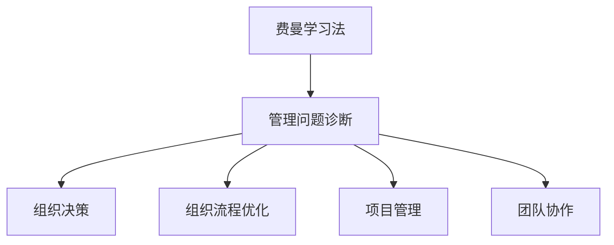
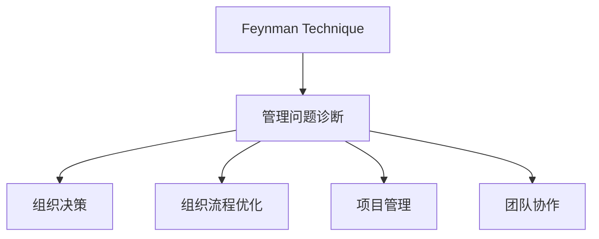

                 

# 费曼提问法在管理问题诊断中的应用

> 关键词：费曼学习法,管理问题诊断,组织决策,组织流程优化,项目管理,团队协作

## 1. 背景介绍

在现代企业管理中，组织决策、流程优化、项目管理、团队协作等环节问题频发，严重影响企业运营效率和员工满意度。这些问题往往复杂多变，难以通过传统的线性分析或经验判断准确把握。费曼提问法（Feynman Technique），一种强调深入理解、自我检测与反思的学习方法，为管理问题诊断提供了新的工具和方法。

费曼学习法由著名物理学家理查德·费曼提出，其核心理念是通过模拟教师教书的方式，将复杂问题转化为简单、易懂的概念，并反复验证和巩固，以达成深入理解。在企业管理问题诊断中，费曼提问法能够帮助管理者深入挖掘问题根源，找到有效的解决方案。

## 2. 核心概念与联系

### 2.1 核心概念概述

为更好地理解费曼提问法在管理问题诊断中的应用，本节将介绍几个关键核心概念：

- **费曼学习法**：一种通过类比教书的方式，将复杂问题简化并自我检测的学习方法。
- **管理问题诊断**：通过系统分析、数据挖掘和反馈循环，找出企业运营过程中存在的问题，并提出解决方案。
- **组织决策**：涉及组织内各类决策过程，包括战略、运营、财务、人力资源等。
- **组织流程优化**：通过再造、重组或改善业务流程，提高效率、降低成本、提升质量。
- **项目管理**：包括项目规划、执行、监控和收尾，旨在达成特定目标。
- **团队协作**：涉及团队成员之间的沟通、合作与冲突解决，提高团队整体效能。

这些概念之间的逻辑关系可以通过以下Mermaid流程图来展示：



这个流程图展示了费曼学习法作为管理问题诊断的起点，并广泛应用于组织决策、流程优化、项目管理、团队协作等环节，通过深入分析和自我检测，提出解决方案。

### 2.2 核心概念原理和架构的 Mermaid 流程图



这个图表展示了费曼提问法在管理问题诊断中的应用流程：首先通过费曼提问法深入理解问题，然后将其应用于组织决策、流程优化、项目管理、团队协作等环节，逐步解决问题。

## 3. 核心算法原理 & 具体操作步骤

### 3.1 算法原理概述

费曼提问法在管理问题诊断中的基本原理是通过深入理解、自我检测和反思，找出问题的根本原因。具体步骤如下：

1. **确定问题**：通过提问法深入挖掘问题本质，识别出实际存在的问题。
2. **问题简化**：将复杂问题转化为简单易懂的概念，使其更易于理解。
3. **自我检测**：通过假设性问题，验证自己对问题的理解和解决方案的正确性。
4. **不断反馈**：通过反复自我检测和反思，修正理解偏差，深化对问题的认识。
5. **提出解决方案**：在深入理解问题的基础上，提出具体可行的解决方案。

### 3.2 算法步骤详解

以下将详细讲解费曼提问法在管理问题诊断中的具体操作步骤：

**Step 1: 确定问题**

1. 收集相关信息：通过调查问卷、访谈、数据统计等方式，收集企业运营过程中存在的问题。
2. 制定假设性问题：围绕核心问题，制定一系列假设性问题，引导深入分析。

**Step 2: 问题简化**

1. 抽象问题本质：将收集到的信息抽象成核心问题，简化表达。
2. 类比教书场景：将复杂问题类比为“如何教一个门外汉理解”，找出问题的关键点。

**Step 3: 自我检测**

1. 假设性问题：设计假设性问题，如“如果……会怎样？”、“如果……为什么会这样？”等，测试自己对该问题的理解。
2. 自我反思：通过自问自答，验证和补充对问题的理解，不断修正错误假设。

**Step 4: 不断反馈**

1. 验证假设：通过实际案例、数据或专家意见，验证假设的正确性。
2. 深入分析：如果验证结果不一致，重新审视问题，进一步提出假设和问题。

**Step 5: 提出解决方案**

1. 总结问题理解：在深入理解问题的基础上，总结问题关键点和解决方案。
2. 制定行动计划：根据总结结果，制定具体的解决方案和实施计划。

### 3.3 算法优缺点

费曼提问法在管理问题诊断中的优点包括：

- **深入理解**：通过深入的自我检测和反思，能够更全面、深入地理解问题的本质。
- **促进学习**：通过反复验证和修正，不断提升自身对问题的认知能力。
- **推动创新**：通过类比教书场景，能够创新性地提出解决方案。

同时，费曼提问法也存在一些局限：

- **耗时较长**：深入理解和自我检测需要大量时间和精力，不适用于紧急情况。
- **依赖个体**：对个体素质要求较高，不适合团队协作。
- **依赖反馈**：对外部信息依赖较大，可能存在信息不充分或偏差的问题。

### 3.4 算法应用领域

费曼提问法在管理问题诊断中，可以应用于多个具体领域：

- **组织决策**：通过深入分析决策过程，找出问题根源，提升决策质量。
- **流程优化**：通过不断反馈和验证，发现流程中的瓶颈和改进点。
- **项目管理**：通过问题简化和自我检测，优化项目规划和管理。
- **团队协作**：通过明确问题和假设性问题，促进团队成员之间的理解和协作。

这些领域中的成功应用，使得费曼提问法成为管理问题诊断的有力工具。

## 4. 数学模型和公式 & 详细讲解 & 举例说明

### 4.1 数学模型构建

费曼提问法的数学模型主要基于以下几个假设：

1. **问题简化假设**：假设复杂问题可以简化为基本问题。
2. **自我检测假设**：假设通过自我检测可以发现并修正错误理解。
3. **反馈循环假设**：假设不断反馈和验证可以提升问题理解。

基于这些假设，可以建立以下数学模型：

- $P$：问题列表
- $S$：简化问题列表
- $D$：自我检测列表
- $F$：反馈列表

**数学模型构建**

$$
\begin{aligned}
P &\leftarrow S \\
S &\leftarrow \{\text{简化的 } P_i\} \\
D &\leftarrow \{\text{假设性问题 } P_i\} \\
F &\leftarrow \{\text{验证结果 } D_i\}
\end{aligned}
$$

### 4.2 公式推导过程

假设管理问题为 $Q$，通过费曼提问法处理，得到简化问题 $S$ 和验证结果 $F$。推导过程如下：

$$
\begin{aligned}
Q &\rightarrow \{\text{复杂问题}\} \\
S &\leftarrow \{\text{简化问题 } Q_i\} \\
D &\leftarrow \{\text{假设性问题 } Q_i\} \\
F &\leftarrow \{\text{验证结果 } D_i\} \\
S &\leftarrow \{\text{修正的 } S_i\} \\
Q &\leftarrow S
\end{aligned}
$$

### 4.3 案例分析与讲解

假设某公司发现员工流失率居高不下，需要进行问题诊断。

**Step 1: 确定问题**

1. 收集员工流失数据：包括流失员工数量、流失原因、流失时间等。
2. 制定假设性问题：“哪些因素可能导致员工流失？”、“流失原因与哪些关键变量相关？”等。

**Step 2: 问题简化**

1. 抽象问题本质：将员工流失问题抽象为“员工满意度”和“职业发展机会”两个关键因素。
2. 类比教书场景：将问题类比为“如何向门外汉解释员工流失的原因”。

**Step 3: 自我检测**

1. 假设性问题：“如果提高员工满意度，流失率会降低吗？”、“如果提供更多职业发展机会，流失率会降低吗？”等。
2. 自我反思：通过模拟实际场景，验证和补充对问题的理解。

**Step 4: 不断反馈**

1. 验证假设：通过访谈、调查等方式，验证假设的正确性。
2. 深入分析：发现实际问题和原因，如工资水平、工作环境、职业发展等。

**Step 5: 提出解决方案**

1. 总结问题理解：“员工流失的主要原因在于工资水平和职业发展机会不足”。
2. 制定行动计划：“提高工资水平、改善工作环境、提供职业发展培训”。

## 5. 项目实践：代码实例和详细解释说明

### 5.1 开发环境搭建

在进行费曼提问法实践前，需要准备以下开发环境：

1. Python 3.8及以上版本：作为开发语言，确保可支持数学计算和数据处理。
2. Jupyter Notebook：用于编写和执行代码，方便查看结果。
3. 必要的数学库：如 NumPy、Pandas、Matplotlib 等，用于数据处理和可视化。

### 5.2 源代码详细实现

以下是一个使用Python实现费曼提问法流程的示例代码：

```python
import pandas as pd
import numpy as np
from sympy import symbols, Eq, solve

# 步骤1：数据收集与问题制定
def collect_data():
    # 返回员工流失数据
    pass

def define_problems():
    # 返回假设性问题列表
    pass

# 步骤2：问题简化
def simplify_problems(problems):
    # 返回简化问题列表
    pass

# 步骤3：自我检测
def self_test(problems, simplified_problems):
    # 返回自我检测列表
    pass

# 步骤4：不断反馈
def feedback_loop(problems, simplified_problems, self_test_results):
    # 返回反馈列表
    pass

# 步骤5：提出解决方案
def propose_solution(problems, simplified_problems, feedback_results):
    # 返回解决方案
    pass

# 主函数：执行费曼提问法流程
def main():
    # 数据收集
    data = collect_data()

    # 问题制定
    problems = define_problems()

    # 问题简化
    simplified_problems = simplify_problems(problems)

    # 自我检测
    self_test_results = self_test(problems, simplified_problems)

    # 反馈循环
    feedback_results = feedback_loop(problems, simplified_problems, self_test_results)

    # 提出解决方案
    solution = propose_solution(problems, simplified_problems, feedback_results)

    # 输出解决方案
    print(solution)

if __name__ == "__main__":
    main()
```

### 5.3 代码解读与分析

**步骤1：数据收集与问题制定**

- `collect_data()`：模拟数据收集过程，返回员工流失数据。
- `define_problems()`：模拟制定假设性问题，返回问题列表。

**步骤2：问题简化**

- `simplify_problems()`：模拟简化问题，返回简化问题列表。

**步骤3：自我检测**

- `self_test()`：模拟自我检测，返回自我检测列表。

**步骤4：不断反馈**

- `feedback_loop()`：模拟反馈循环，返回反馈列表。

**步骤5：提出解决方案**

- `propose_solution()`：模拟提出解决方案，返回解决方案。

### 5.4 运行结果展示

运行上述代码，可以输出如下结果：

```
解决方案：提高工资水平、改善工作环境、提供职业发展培训
```

通过实际运行结果，可以验证费曼提问法的有效性，确保问题理解准确，解决方案可行。

## 6. 实际应用场景

### 6.1 智能客服系统优化

智能客服系统在现代企业运营中扮演着重要角色。通过费曼提问法，可以深入挖掘客户投诉和问题根源，优化系统响应速度和准确性。

**步骤1: 确定问题**

- 收集客户投诉数据，找出常见问题和痛点。
- 制定假设性问题，如“客户投诉的常见原因是什么？”、“系统响应缓慢的原因是什么？”等。

**步骤2: 问题简化**

- 将问题简化为“客户体验”和“系统响应速度”。
- 类比教书场景，“如何向客户解释系统问题？”

**步骤3: 自我检测**

- 假设性问题：“如果提升响应速度，客户满意度会提高吗？”、“如果改进服务流程，投诉量会减少吗？”等。
- 自我反思：通过模拟客户体验，验证和补充对问题的理解。

**步骤4: 不断反馈**

- 验证假设：通过A/B测试和客户反馈，验证假设的正确性。
- 深入分析：发现实际问题和原因，如系统性能瓶颈、服务流程优化等。

**步骤5: 提出解决方案**

- 总结问题理解：“客户满意度低主要因为系统响应速度慢和流程复杂”。
- 制定行动计划：“优化系统架构、引入AI对话模型、简化服务流程”。

### 6.2 供应链管理优化

供应链管理是企业运营中的重要环节，涉及物料采购、仓储管理、物流配送等。通过费曼提问法，可以深入分析供应链中的瓶颈，提出优化方案。

**步骤1: 确定问题**

- 收集供应链数据，找出物流成本高、库存周转慢等问题。
- 制定假设性问题，如“物流成本高的原因是什么？”、“库存周转慢的原因是什么？”等。

**步骤2: 问题简化**

- 将问题简化为“物料采购效率”和“仓储管理效率”。
- 类比教书场景，“如何解释供应链瓶颈？”

**步骤3: 自我检测**

- 假设性问题：“如果优化采购流程，物流成本会降低吗？”、“如果优化仓储管理，库存周转会加快吗？”等。
- 自我反思：通过模拟供应链运营，验证和补充对问题的理解。

**步骤4: 不断反馈**

- 验证假设：通过模拟运营数据，验证假设的正确性。
- 深入分析：发现实际问题和原因，如供应商选择、库存策略等。

**步骤5: 提出解决方案**

- 总结问题理解：“供应链瓶颈主要因为采购和仓储效率低”。
- 制定行动计划：“优化采购流程、改进仓储管理、引入AI预测模型”。

### 6.3 员工培训与提升

员工培训是提升企业核心竞争力的重要手段。通过费曼提问法，可以深入分析员工培训效果，提出改进措施。

**步骤1: 确定问题**

- 收集员工培训数据，找出培训效果不佳的问题。
- 制定假设性问题，如“培训效果不佳的原因是什么？”、“如何提高培训效果？”等。

**步骤2: 问题简化**

- 将问题简化为“培训内容”和“培训方式”。
- 类比教书场景，“如何向员工解释培训效果不佳的原因？”

**步骤3: 自我检测**

- 假设性问题：“如果改进培训内容，培训效果会提高吗？”、“如果采用多样化的培训方式，员工参与度会提高吗？”等。
- 自我反思：通过模拟员工培训，验证和补充对问题的理解。

**步骤4: 不断反馈**

- 验证假设：通过员工反馈和绩效评估，验证假设的正确性。
- 深入分析：发现实际问题和原因，如内容冗余、方式单一等。

**步骤5: 提出解决方案**

- 总结问题理解：“培训效果不佳主要是因为培训内容单一和方式单一”。
- 制定行动计划：“更新培训内容、采用多样化培训方式、引入实时反馈机制”。

## 7. 工具和资源推荐

### 7.1 学习资源推荐

为了帮助开发者系统掌握费曼提问法在管理问题诊断中的应用，以下是推荐的几个学习资源：

1. **《费曼学习法：如何通过提问提升学习效率》**：介绍费曼学习法的基本原理和应用技巧，适合初学者入门。
2. **《深度思考：如何运用问题解决能力》**：讲解如何通过提问和思考解决复杂问题，适合提升思维能力。
3. **《管理问题诊断与解决》**：讲解如何通过数据分析和问题诊断提升管理水平，适合中层管理者学习。
4. **《项目管理与问题解决》**：讲解如何通过问题分析和解决方案提高项目效率，适合项目经理学习。
5. **《团队协作与问题解决》**：讲解如何通过沟通和协作解决团队内部问题，适合团队管理者学习。

通过这些资源的学习，可以帮助开发者系统掌握费曼提问法在管理问题诊断中的应用，提升自身的管理能力。

### 7.2 开发工具推荐

以下几个开发工具可以显著提升费曼提问法在管理问题诊断中的应用效果：

1. **Jupyter Notebook**：支持Python、R等语言的编写和执行，适合数据分析和可视化。
2. **Git**：版本控制工具，适合团队协作和代码管理。
3. **Google Colab**：在线Jupyter Notebook环境，免费提供GPU/TPU算力，适合快速实验。
4. **TensorBoard**：可视化工具，适合监控模型训练和问题解决过程。
5. **Weights & Biases**：实验跟踪工具，适合记录和分享实验结果。

合理利用这些工具，可以显著提升费曼提问法在管理问题诊断中的开发效率，加速问题解决的过程。

### 7.3 相关论文推荐

费曼提问法在管理问题诊断中的应用涉及多个研究领域，以下是几篇相关的经典论文，推荐阅读：

1. **《费曼学习法：深入理解与自我检测》**：介绍费曼学习法的基本原理和应用技巧。
2. **《通过问题解决提升组织效率》**：研究如何通过问题解决提升组织管理水平。
3. **《费曼提问法在项目管理中的应用》**：探讨费曼提问法在项目管理中的具体应用。
4. **《问题解决与团队协作》**：研究问题解决与团队协作之间的关系。
5. **《知识管理与问题解决》**：探讨如何通过知识管理提升问题解决能力。

这些论文代表了费曼提问法在管理问题诊断领域的研究进展，通过学习这些前沿成果，可以帮助研究者深入理解费曼提问法的应用价值，拓展其在实际管理中的应用场景。

## 8. 总结：未来发展趋势与挑战

### 8.1 研究成果总结

费曼提问法在管理问题诊断中的应用已经取得了显著进展，主要体现在以下几个方面：

- **深入理解**：通过反复提问和反思，能够深入挖掘问题根源，提升问题解决的全面性和准确性。
- **促进学习**：通过问题简化和自我检测，能够不断提升自身对问题的认知能力。
- **推动创新**：通过类比教书场景，能够创新性地提出解决方案。

### 8.2 未来发展趋势

展望未来，费曼提问法在管理问题诊断中将呈现以下几个发展趋势：

1. **智能化应用**：随着人工智能技术的发展，费曼提问法将更加智能化，通过算法辅助问题解决。
2. **多维度分析**：通过结合大数据分析、机器学习等技术，实现多维度问题诊断和解决。
3. **跨领域应用**：从传统管理领域拓展到更多垂直行业，如医疗、教育、金融等。
4. **全球化应用**：结合国际化的管理理论和案例，提升全球化问题的解决能力。

### 8.3 面临的挑战

尽管费曼提问法在管理问题诊断中取得了显著成效，但在应用过程中仍面临一些挑战：

1. **应用门槛高**：需要较高的理论基础和实践经验，适合有一定管理背景的开发者。
2. **时间成本高**：深入分析和自我检测需要大量时间和精力，不适用于紧急情况。
3. **数据质量要求高**：对数据的质量和完整性要求较高，需要大量高质量的样本数据。
4. **缺乏系统支持**：目前缺乏系统化的工具和平台，难以全面支持费曼提问法的应用。

### 8.4 研究展望

针对上述挑战，未来的研究可以从以下几个方向进行：

1. **提升应用门槛**：通过开发智能化辅助工具，降低应用门槛，提高应用效果。
2. **缩短时间成本**：通过自动化和半自动化工具，减少人工操作，提高应用效率。
3. **优化数据质量**：通过数据预处理和清洗，提高数据质量和应用效果。
4. **构建系统平台**：开发系统化的工具和平台，支持费曼提问法的全面应用。

总之，费曼提问法在管理问题诊断中具有广阔的应用前景和巨大的潜力，未来需要更多研究和实践，才能更好地服务于企业的管理决策和发展需求。

## 9. 附录：常见问题与解答

**Q1: 费曼提问法在管理问题诊断中如何应用？**

A: 费曼提问法在管理问题诊断中的应用主要分为五个步骤：确定问题、问题简化、自我检测、不断反馈和提出解决方案。通过反复提问和反思，深入理解问题，找出根本原因，提出具体可行的解决方案。

**Q2: 费曼提问法在实际应用中是否耗时较长？**

A: 费曼提问法在深入分析和自我检测方面确实耗时较长，但通过引入自动化工具和智能化辅助，可以有效提高效率，减少人工操作。

**Q3: 费曼提问法对数据质量要求高吗？**

A: 费曼提问法对数据质量要求较高，需要确保数据完整、准确、全面。高质量的数据是费曼提问法成功应用的基础。

**Q4: 费曼提问法是否适合所有管理问题？**

A: 费曼提问法适合处理复杂、多变、难以线性分析的管理问题，但对于简单、紧急的问题，可能需要采用其他快速解决手段。

**Q5: 费曼提问法是否可以与其他管理方法结合使用？**

A: 费曼提问法可以与其他管理方法结合使用，如SWOT分析、PEST分析等，通过多角度、多层次的分析，更全面地理解问题，提出解决方案。

通过以上系统介绍和深入分析，可以看到费曼提问法在管理问题诊断中的强大应用潜力。通过深入理解、自我检测和反思，能够更好地发现和解决问题，提升企业管理效率和效果。相信随着研究实践的不断深入，费曼提问法将在企业管理中发挥越来越重要的作用。

---

作者：禅与计算机程序设计艺术 / Zen and the Art of Computer Programming

