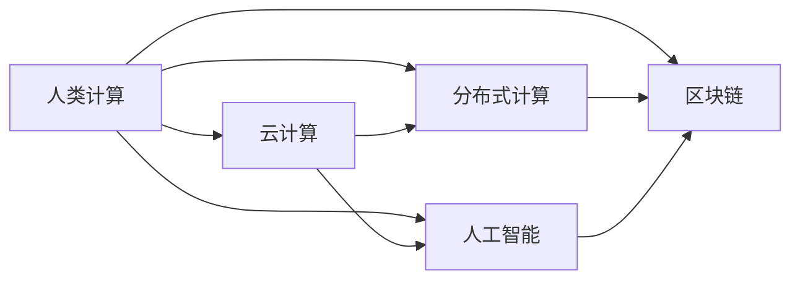

                 

# 赋能个人与社区：人类计算的社会价值

> 关键词：人类计算, 社会价值, 分布式计算, 云计算, 人工智能, 区块链

## 1. 背景介绍

### 1.1 问题由来
随着科技的飞速发展，人类计算（Human Computation）正成为连接人与人、人与机器的重要纽带。其本质是将复杂任务分解为简单、可操作的小任务，通过大量人的协作完成。例如众包平台上的图片标记、在线调查、科学实验等。这种模式不仅大幅降低了任务成本，还能快速获取大量数据，促进知识的积累和创新。

近年来，随着人工智能（AI）和大数据技术的崛起，人类计算的规模和深度不断扩大，开始融入更广泛的场景。从自然语言处理到复杂系统的设计，人类计算展示了其强大的适应性和潜力。本文将从人类计算的社会价值出发，探讨其在现代社会中的重要作用，及其面临的挑战与未来的发展方向。

## 2. 核心概念与联系

### 2.1 核心概念概述

要理解人类计算的社会价值，首先需要了解几个关键概念：

- **人类计算（Human Computation）**：通过人的协作，解决复杂计算问题的一种方法。该方法依赖于大规模分布式协作，典型平台如Amazon Mechanical Turk、CrowdFlower等。

- **云计算（Cloud Computing）**：基于网络提供可扩展、按需的服务，如计算资源、存储、软件应用等。云计算极大地降低了计算和存储成本，使得人类计算成为可能。

- **分布式计算（Distributed Computing）**：将大任务分解为多个子任务，通过网络分布式执行，典型技术如MapReduce、Spark等。分布式计算极大提升了任务处理效率和扩展性。

- **人工智能（Artificial Intelligence）**：模拟人类智能的机器系统，主要涉及数据获取、算法训练、模型优化等过程。AI推动了人类计算的智能化，通过机器学习和大数据技术，人类计算的效率和质量得到大幅提升。

- **区块链（Blockchain）**：一种去中心化的分布式账本技术，提供透明、不可篡改的数据记录。区块链为人类计算提供了新的信任机制，尤其在数据隐私和透明性要求高的场景中。

这些概念之间的逻辑关系可以通过以下Mermaid流程图来展示：



该图展示了人类计算与其他计算模式和技术的关系，其中云计算、分布式计算、人工智能和区块链都是人类计算的重要支撑和补充。

### 2.2 核心概念原理和架构

人类计算的核心原理是通过大量人的协作，将复杂任务分解为可管理的小任务，通过网络分布式执行，完成整个计算过程。这种模式不仅降低了成本，还大幅提升了任务处理的效率和可扩展性。

架构上，人类计算系统主要由以下几个部分组成：

- **任务分解引擎**：将复杂任务分解为可操作的小任务。
- **任务调度中心**：管理任务执行，匹配合适的人力和资源。
- **数据存储与处理中心**：存储计算任务所需的输入数据和中间结果，处理任务执行过程中产生的输出数据。
- **人机交互界面**：提供任务描述和结果展示，便于任务参与者和监督者的协作。
- **质量控制机制**：通过自动检查和人工审核，确保任务执行质量和数据一致性。

这些部分共同构成了人类计算的核心框架，使得大规模、复杂任务的完成成为可能。

## 3. 核心算法原理 & 具体操作步骤

### 3.1 算法原理概述

人类计算的算法原理主要围绕任务分解、任务调度和质量控制展开。其核心目标是通过大量人的协作，高效、低成本地完成复杂计算任务。以下是几个核心算法概述：

1. **任务分解算法**：将复杂任务分解为可操作的小任务，如图片标记、文本分类、图像识别等。任务分解算法需要考虑任务的难易程度、任务之间的依赖关系、任务执行时间和成本等。

2. **任务调度算法**：在任务分解后，需要设计高效的调度算法，将任务分配给合适的人力资源。调度算法需要考虑任务执行时间、人力资源可用性和任务依赖关系。

3. **质量控制算法**：为了确保任务执行质量，需要在任务执行过程中进行质量控制，包括任务提交前的自动检查和人工审核。质量控制算法需要设计合理的评价标准和审核机制。

### 3.2 算法步骤详解

人类计算的主要步骤包括：

1. **任务设计**：明确计算任务的目标和要求，设计可操作的子任务，并定义任务执行的评价标准。

2. **任务分配**：根据任务需求，分配计算资源，包括人力资源、计算设备和存储设备。任务调度算法需要动态调整资源分配，确保任务高效执行。

3. **任务执行**：通过网络将任务分配给合适的人力资源，并提供必要的工具和界面，便于任务执行。

4. **任务监控与反馈**：实时监控任务执行情况，记录任务执行数据，并在任务执行过程中提供反馈，帮助任务执行者优化执行流程。

5. **任务完成与评价**：完成任务后，进行任务结果的评价，确保任务质量符合要求，并记录任务执行数据，用于后续分析和优化。

### 3.3 算法优缺点

人类计算的主要优点包括：

- **成本低**：通过大量人的协作，极大地降低了计算成本。
- **灵活性高**：可以处理各种复杂任务，灵活适应不同场景。
- **数据丰富**：大量人力的参与，使得数据获取和处理更为丰富。

缺点主要集中在：

- **执行效率低**：人工协作的效率远低于机器执行，任务处理时间较长。
- **质量不稳定**：任务执行者的技能和状态差异较大，影响任务质量的一致性。
- **依赖人力**：需要大量人力资源，受限于人力可用性和人力资源管理。

### 3.4 算法应用领域

人类计算的应用领域非常广泛，主要涵盖以下几个方面：

- **科学研究**：如天文学观测数据处理、基因组学数据分析、气候变化研究等，需要大量数据处理和分析。

- **工业生产**：如制造业的零件分类、质量检测、生产调度等，需要大量的手工操作和数据处理。

- **金融服务**：如金融市场数据分析、信用评分、风险评估等，需要处理大量非结构化数据。

- **公共服务**：如公共健康数据收集、城市管理、社会调查等，需要收集和处理大规模数据。

- **社交网络**：如在线调查、社交媒体数据分析、网络社区管理等，需要收集和处理用户数据。

- **艺术创作**：如音乐制作、电影制作、游戏设计等，需要大量的创意和手工操作。

## 4. 数学模型和公式 & 详细讲解 & 举例说明

### 4.1 数学模型构建

人类计算的数学模型通常基于任务分解和任务调度设计。以下是一个简化的数学模型框架：

- **任务分解模型**：将复杂任务 $T$ 分解为 $N$ 个子任务 $T_i$，其中 $i=1,2,...,N$。任务分解模型可以用集合表示：$\mathcal{T}=\{T_1, T_2, ..., T_N\}$。

- **任务调度模型**：在任务 $T_i$ 被分配给任务执行者 $U_j$ 后，任务执行的时间为 $t_{i,j}$，其中 $j=1,2,...,M$。任务调度模型可以用矩阵表示：$\mathbf{t} = (t_{i,j})_{N \times M}$。

- **任务质量评价模型**：任务执行者的技能 $S_k$ 和状态 $C_k$ 对任务执行质量 $Q_k$ 有影响，任务质量评价模型可以用函数表示：$Q_k=f(S_k, C_k)$。

### 4.2 公式推导过程

- **任务分解公式**：
$$
T = \bigcup_{i=1}^N T_i
$$

- **任务调度公式**：
$$
t_{i,j} = f(S_j, C_j, T_i)
$$

- **任务质量评价公式**：
$$
Q_k = g(S_k, C_k, T_i)
$$

其中，$f$ 和 $g$ 分别表示任务调度和质量评价的函数形式。

### 4.3 案例分析与讲解

以一个简单的在线调查任务为例，说明人类计算的数学模型应用：

- **任务分解**：将调查任务分解为多个子任务，如问题设计、调查问卷设计、数据分析等。

- **任务调度**：根据参与者的专业背景和可用时间，将任务分配给合适的人力资源。

- **任务质量评价**：根据参与者的反馈和数据处理结果，评估任务执行质量。

## 5. 项目实践：代码实例和详细解释说明

### 5.1 开发环境搭建

为了实现一个简单的人类计算系统，可以使用Python和Flask框架搭建一个基本的在线调查平台。以下是开发环境的搭建流程：

1. 安装Python和Flask：
```bash
sudo apt-get install python3 python3-pip
pip3 install flask
```

2. 搭建Flask应用：
```python
from flask import Flask, request, jsonify

app = Flask(__name__)

@app.route('/submit', methods=['POST'])
def submit_task():
    data = request.get_json()
    task_id = data['task_id']
    result = data['result']
    return jsonify({'status': 'success', 'task_id': task_id, 'result': result})

if __name__ == '__main__':
    app.run(debug=True, port=5000)
```

3. 部署应用：使用AWS或Google Cloud等云平台部署Flask应用，提供在线任务提交接口。

### 5.2 源代码详细实现

以下是一个简单的在线调查任务的Flask应用实现，包含任务提交和任务处理逻辑：

```python
from flask import Flask, request, jsonify

app = Flask(__name__)

@app.route('/submit', methods=['POST'])
def submit_task():
    data = request.get_json()
    task_id = data['task_id']
    result = data['result']
    return jsonify({'status': 'success', 'task_id': task_id, 'result': result})

@app.route('/process', methods=['POST'])
def process_task():
    data = request.get_json()
    task_id = data['task_id']
    result = data['result']
    # 处理任务逻辑
    # ...
    return jsonify({'status': 'success', 'task_id': task_id, 'result': result})

if __name__ == '__main__':
    app.run(debug=True, port=5000)
```

### 5.3 代码解读与分析

- **任务提交接口**：用于接收参与者提交的任务结果。
- **任务处理接口**：用于处理和评估提交的任务结果。
- **任务调度机制**：通过API将任务分配给合适的人力资源，并记录任务执行数据。
- **质量控制机制**：通过API自动检查任务结果，并提供人工审核接口。

## 6. 实际应用场景

### 6.1 科学研究

人类计算在科学研究中有着广泛的应用，尤其是在数据处理和分析领域。例如，天文学家利用众包平台进行星系分类、星系图像标记等任务，通过大量人的协作，大幅提升了数据处理速度和质量。

### 6.2 公共服务

公共服务领域也是人类计算的重要应用场景，如城市管理、交通规划、社会调查等。通过在线调查和数据收集，政府部门可以获取大量市民反馈，用于决策支持和公共服务优化。

### 6.3 金融服务

金融行业需要处理大量非结构化数据，如金融市场分析、信用评分等。人类计算可以通过众包平台获取大量数据标注和分析结果，帮助金融机构提高数据处理效率和决策质量。

### 6.4 未来应用展望

未来，随着人工智能和大数据技术的进一步发展，人类计算的应用场景将更加广泛。以下是对未来应用的展望：

- **智能城市**：通过人类计算平台收集和处理大量城市数据，实现智能交通管理、环境监测、应急响应等功能。

- **精准医疗**：利用人类计算平台收集和分析患者数据，实现个性化医疗和健康管理。

- **环境保护**：通过人类计算平台收集和分析环境数据，支持气候变化研究和环境保护决策。

- **自动驾驶**：利用人类计算平台标注和测试自动驾驶数据，提高自动驾驶系统的性能和安全。

- **工业自动化**：通过人类计算平台收集和分析工业数据，支持工业生产调度、质量控制和故障诊断等。

## 7. 工具和资源推荐

### 7.1 学习资源推荐

为了深入了解人类计算，推荐以下学习资源：

1. 《Human Computation: From Crowds to Crowdsourcing》（《人类计算：从大众到众包》）：详细介绍了人类计算的基本概念、应用场景和未来发展趋势。

2. 《Crowdsourcing: Detailed Analysis》（《众包：详细分析》）：介绍了众包平台的工作原理和案例分析。

3. 《Crowdsourcing and Data Mining: From Volunteered to Participatory Data Science》（《众包和数据挖掘：从志愿者到参与式数据科学》）：讨论了人类计算在数据科学中的应用。

4. 《The Great crowd: The power of slow thinks in a fast world》（《伟大的众包：快世界中的慢思》）：探讨了人类计算在现代社会中的重要性。

5. 《Human Computation in Neuroscience》（《神经科学中的人类计算》）：讨论了人类计算在认知科学和神经科学中的应用。

### 7.2 开发工具推荐

以下是一些常用的人类计算开发工具：

1. Amazon Mechanical Turk：提供众包任务的在线平台，支持任务分配和结果提交。

2. CrowdFlower：提供在线调查和数据标注服务，支持多种任务类型和行业应用。

3. CoderTag：提供在线代码审核和测试平台，支持软件开发和测试任务。

4. Clickworkers：提供在线图像标注和视频处理服务，支持计算机视觉和图像识别任务。

5. Google Forms：提供在线调查和数据收集工具，支持多种问卷类型和数据格式。

### 7.3 相关论文推荐

以下几篇论文代表了大规模人类计算的研究进展：

1. "Crowdsourcing Strategies for Obtaining High-Quality Permissions"（《获得高质量许可的众包策略》）：讨论了众包平台的任务分配策略和质量控制方法。

2. "Crowdsourcing: Trusted Systems for Human Intelligence"（《众包：人类智慧的可信系统》）：介绍了众包平台的任务管理和信任机制。

3. "Human Computation: Economics and Volunteering"（《人类计算：经济与志愿》）：探讨了人类计算的经济模型和志愿机制。

4. "Human Computation in Science and Engineering"（《科学和工程中的人类计算》）：讨论了人类计算在科学和工程中的应用。

5. "Human Computation: Concepts, Methodologies, Applications, and Future Directions"（《人类计算：概念、方法、应用与未来方向》）：综述了人类计算的基本概念、方法和应用方向。

## 8. 总结：未来发展趋势与挑战

### 8.1 研究成果总结

本文系统介绍了人类计算的基本概念、核心算法和实际应用，展示了其强大的社会价值。人类计算通过大量人的协作，极大地降低了任务成本，提升了任务处理效率和数据获取质量，具有广泛的应用前景。

### 8.2 未来发展趋势

未来，人类计算将继续拓展其应用领域，以下是几个趋势方向：

- **智能化**：与人工智能技术的结合，使得人类计算更加智能化，能够处理更复杂和动态的任务。

- **自动化**：通过自动化任务分配和质量控制，提升人类计算系统的效率和准确性。

- **多样化**：涵盖更多行业和领域，如医疗、金融、农业等，拓展人类计算的应用场景。

- **国际化**：利用多语言和多文化背景的协作，提升任务处理的适应性和多样性。

- **多模态**：结合视觉、听觉、触觉等多模态信息，提升任务处理的全面性和自然性。

### 8.3 面临的挑战

尽管人类计算具有巨大的潜力，但在实际应用中也面临一些挑战：

- **质量控制**：任务执行者的技能和状态不稳定，影响任务质量的一致性。

- **任务管理**：任务分配和调度的复杂性，需要高效的算法和管理机制。

- **数据隐私**：参与者的数据隐私和安全性，需要严格的保护措施。

- **用户参与**：如何吸引和保持大量用户参与，需要创新的激励机制和用户体验设计。

- **技术整合**：人类计算与人工智能、云计算、区块链等技术的整合，需要协同优化。

### 8.4 研究展望

未来，人类计算的研究方向可以集中在以下几个方面：

- **质量控制机制**：设计更有效的任务质量评价和审核机制，确保任务执行质量。

- **智能化算法**：开发智能化任务分解和调度算法，提升任务处理效率和适应性。

- **多模态融合**：结合多模态信息，提升任务处理的全面性和自然性。

- **隐私保护**：设计隐私保护机制，确保参与者的数据安全和隐私保护。

- **用户激励**：设计有效的用户激励机制，吸引和保持大量用户参与。

总之，人类计算在现代社会中具有重要的社会价值，但其应用面临诸多挑战。通过不断创新和优化，人类计算将能够更好地发挥其社会价值，助力社会和经济的可持续发展。

---

作者：禅与计算机程序设计艺术 / Zen and the Art of Computer Programming

