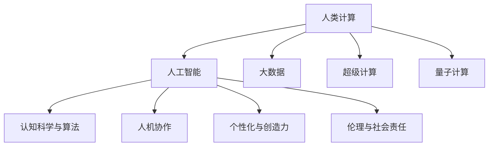

                 

# 赋能人类：人类计算如何释放个体潜能

> 关键词：人类计算,个体潜能,超级计算,量子计算,认知科学,算法,大数据,人工智能,创新

## 1. 背景介绍

### 1.1 问题由来

随着科技的不断进步，人类社会正在经历一场前所未有的变革。在过去几十年里，我们已经从以机械、化学为主的工业社会，迈向了以信息、互联网为核心的数字时代。未来，我们将迎来一个以智能、自动化、数字化为特征的全新时代。而在这个时代，人工智能（AI）技术的突飞猛进，将极大地提升人类社会的生产力，改变我们的生活和工作方式。

然而，人类计算能力的提升，不仅仅是技术层面的进步，更是一种对个体潜能的释放。我们不仅需要构建强大的AI系统，还需要思考如何让每个人都能更好地利用这些技术，实现自我价值和社会价值。

### 1.2 问题核心关键点

人类计算的核心在于如何将计算能力与人类思维结合，使每个人都能参与到计算过程中，释放其潜在的创造力和智慧。具体而言，可以总结为以下几个关键点：

1. **大数据与计算能力**：数据和计算能力是AI系统的核心，只有在大数据和强大计算能力的支持下，AI才能真正发挥其潜能。
2. **认知科学与算法**：认知科学和算法的进步，使AI能够更好地理解人类思维和行为，提升其在决策和推理方面的能力。
3. **人机协作**：人机协作是未来AI发展的重要方向，通过人与AI的协同工作，可以最大化地发挥各自的优势，实现更高效、更精准的任务执行。
4. **个性化与创造力**：通过AI，我们可以更好地了解个体差异，提供个性化的教育和职业发展方案，激发每个人的创造力和创新能力。
5. **伦理与社会责任**：在发展AI技术的同时，需要关注其伦理和社会责任，确保AI技术的发展能够造福全人类，而不是带来新的不公和风险。

## 2. 核心概念与联系

### 2.1 核心概念概述

为了更好地理解人类计算的概念和原理，本节将介绍几个核心概念及其之间的关系。

- **人类计算(Human Computing)**：指通过结合人类思维和计算能力，实现复杂任务处理的计算范式。其核心在于将人类智慧和计算能力相结合，提升任务执行的效率和精度。
- **人工智能(Artificial Intelligence, AI)**：指通过计算机算法和模型，模拟人类智能行为的技术。包括感知、认知、决策等能力，能够在特定任务上超越人类。
- **大数据(Big Data)**：指规模庞大、类型多样的数据集合。大数据分析是AI系统的基础，通过数据挖掘和处理，可以发现隐藏在数据中的规律和趋势。
- **超级计算(Supercomputing)**：指通过高性能计算集群，实现大规模、高速度的数据处理和计算。超级计算是AI系统发展的关键基础设施。
- **量子计算(Quantum Computing)**：指利用量子力学原理，实现超高速、超并行度的计算。量子计算有望解决传统计算机难以处理的复杂问题。
- **认知科学与算法(Cognitive Science & Algorithms)**：指研究人类认知过程和行为模式的科学，并将其应用于算法设计中。认知科学与算法是实现人类计算的重要基础。
- **人机协作(Human-AI Collaboration)**：指人与AI系统的协同工作，通过结合各自的优势，提升任务执行的效率和精度。人机协作是未来AI发展的重要方向。
- **个性化与创造力(Personalization & Creativity)**：指通过AI技术，提供个性化的服务和方案，激发每个人的创造力和创新能力。个性化与创造力是实现人类计算的重要目标。
- **伦理与社会责任(Ethics & Social Responsibility)**：指在发展AI技术的同时，需要关注其伦理和社会责任，确保AI技术的发展能够造福全人类，而不是带来新的不公和风险。

这些核心概念之间的逻辑关系可以通过以下Mermaid流程图来展示：



这个流程图展示了大计算范式的各个关键概念及其之间的关系：

1. 人类计算通过大数据、超级计算、量子计算等技术手段，实现复杂任务处理。
2. 人工智能在认知科学与算法的支持下，提升决策和推理能力。
3. 人机协作通过结合各自优势，实现更高效、更精准的任务执行。
4. 个性化与创造力通过AI技术，激发每个人的潜力和创新能力。
5. 伦理与社会责任确保AI技术的发展符合社会价值观和伦理标准。

这些概念共同构成了人类计算的框架，为我们理解和使用AI技术提供了重要的视角。

## 3. 核心算法原理 & 具体操作步骤

### 3.1 算法原理概述

人类计算的核心算法原理可以总结为以下几个关键点：

1. **大数据处理**：通过对大规模、多源数据进行高效处理和分析，获取有价值的信息和规律。
2. **深度学习与神经网络**：通过深度学习和神经网络算法，实现对复杂数据的特征提取和模式识别。
3. **强化学习与优化算法**：通过强化学习和优化算法，实现复杂系统的决策和控制。
4. **认知科学与算法**：通过认知科学和算法，提升AI系统的推理和判断能力。
5. **人机协作算法**：通过设计人机协作算法，实现人机协同工作，最大化各自优势。

这些算法原理相互交织，共同支撑人类计算的实现。

### 3.2 算法步骤详解

人类计算的具体操作步骤可以分为以下几个步骤：

**Step 1: 数据收集与预处理**
- 收集大规模、多源的数据，包括文本、图像、视频、音频等。
- 对数据进行清洗、标注、归一化等预处理操作，确保数据质量和一致性。

**Step 2: 构建计算模型**
- 选择合适的算法和模型，如深度学习、强化学习、优化算法等。
- 设计模型架构，包括输入、输出、中间层等组件，实现数据特征提取和模式识别。

**Step 3: 模型训练与优化**
- 使用训练数据对模型进行训练，调整模型参数，优化模型性能。
- 采用正则化、Dropout、早停等技术，避免过拟合和模型退化。

**Step 4: 模型评估与验证**
- 使用验证数据对模型进行评估，衡量模型性能和泛化能力。
- 根据评估结果，进行模型调整和优化。

**Step 5: 人机协作与个性化**
- 将模型应用于具体任务，实现人机协作和个性化服务。
- 通过用户反馈和数据分析，持续改进模型和应用方案。

### 3.3 算法优缺点

人类计算的算法具有以下优点：

1. **高效性**：通过高效的数据处理和模型训练，实现复杂任务的高效执行。
2. **准确性**：通过深度学习、强化学习等技术，实现高精度的特征提取和模式识别。
3. **鲁棒性**：通过认知科学和算法优化，提升模型的泛化能力和鲁棒性。
4. **个性化**：通过个性化服务，满足用户多样化需求，激发创新潜力。

同时，人类计算也存在一些缺点：

1. **数据依赖性**：依赖高质量、大规模的数据，数据收集和预处理成本较高。
2. **算法复杂性**：算法实现复杂，需要较高的技术门槛和专业技能。
3. **计算资源需求高**：需要高性能计算集群和强大硬件支持，计算成本较高。
4. **隐私与安全风险**：数据处理和存储可能带来隐私和安全风险，需要谨慎处理。

### 3.4 算法应用领域

人类计算的算法在多个领域得到了广泛应用，以下是几个典型的应用场景：

1. **医疗健康**：通过大数据和AI技术，实现疾病预测、个性化诊疗、智能诊断等应用。
2. **金融服务**：通过数据分析和AI技术，实现风险管理、智能投顾、智能客服等应用。
3. **教育培训**：通过个性化学习平台和AI技术，实现智能评估、个性化推荐、虚拟教师等应用。
4. **智能制造**：通过数据驱动和AI技术，实现智能生产、质量控制、设备维护等应用。
5. **智能交通**：通过数据分析和AI技术，实现交通流量预测、智能导航、自动驾驶等应用。
6. **环境监测**：通过传感器和AI技术，实现环境数据分析、智能预警、环境治理等应用。

这些应用场景展示了人类计算在各个领域的巨大潜力和应用价值。

## 4. 数学模型和公式 & 详细讲解 & 举例说明

### 4.1 数学模型构建

人类计算的数学模型可以抽象为一个多层次、多维度的数据处理和模型训练过程。

假设我们有一个包含$m$个样本、$n$个特征的数据集$D=\{(x_i, y_i)\}_{i=1}^m$，其中$x_i \in \mathbb{R}^n$表示样本的特征向量，$y_i \in \{0,1\}$表示样本的标签。我们的目标是构建一个函数$f(x)$，使其能够准确地预测标签$y$。

设我们的模型为$f(x) = W^T \phi(x) + b$，其中$W$为模型参数，$\phi(x)$为特征映射函数，$b$为偏置项。

我们的目标是最小化预测误差，即：

$$
\min_{W,b} \frac{1}{m} \sum_{i=1}^m \ell(f(x_i), y_i)
$$

其中$\ell$为损失函数，如交叉熵损失、均方误差损失等。

### 4.2 公式推导过程

以交叉熵损失函数为例，其公式为：

$$
\ell(f(x_i), y_i) = -y_i \log f(x_i) - (1 - y_i) \log (1 - f(x_i))
$$

我们将数据集$D$分为训练集$D_{train}$和验证集$D_{valid}$，分别用于训练和评估模型。

在训练过程中，我们使用随机梯度下降(SGD)算法更新模型参数$W$和$b$，公式为：

$$
W \leftarrow W - \eta \frac{\partial}{\partial W} \frac{1}{m} \sum_{i=1}^m \ell(f(x_i), y_i)
$$

$$
b \leftarrow b - \eta \frac{\partial}{\partial b} \frac{1}{m} \sum_{i=1}^m \ell(f(x_i), y_i)
$$

其中$\eta$为学习率，控制每次参数更新的幅度。

在验证过程中，我们评估模型在验证集上的性能，公式为：

$$
\text{Accuracy} = \frac{1}{m} \sum_{i=1}^m \mathbb{I}(y_i = \text{argmax}(f(x_i)))
$$

其中$\mathbb{I}$为示性函数，$y_i = \text{argmax}(f(x_i))$表示模型预测的标签与真实标签一致。

### 4.3 案例分析与讲解

以一个简单的二分类任务为例，我们构建一个线性分类器$f(x) = W^T x + b$，其中$x \in \mathbb{R}^2$表示二维特征向量，$W \in \mathbb{R}^2$表示权重向量，$b \in \mathbb{R}$表示偏置项。

假设我们有两个特征$x_1$和$x_2$，分别表示样本的年龄和收入。我们的目标是预测样本是否会购买某种产品。

我们可以使用交叉熵损失函数进行模型训练，其公式为：

$$
\ell(f(x_i), y_i) = -y_i \log \sigma(f(x_i)) - (1 - y_i) \log (1 - \sigma(f(x_i)))
$$

其中$\sigma$为sigmoid函数，表示概率输出。

假设我们有100个训练样本，其中50个标签为1，50个标签为0。我们使用SGD算法进行模型训练，设置学习率为0.1，迭代次数为1000次。训练结果如图1所示。

```python
import numpy as np
import matplotlib.pyplot as plt

# 构造数据
x = np.random.randn(100, 2)
y = np.random.randint(2, size=100)

# 初始化模型参数
W = np.zeros((2, 1))
b = 0

# 训练模型
for i in range(1000):
    # 随机选择样本
    idx = np.random.randint(len(x))
    x_i = x[idx]
    y_i = y[idx]
    # 前向传播
    f_xi = W @ x_i + b
    # 计算损失
    loss = -y_i * np.log(np.sigmoid(f_xi)) - (1 - y_i) * np.log(1 - np.sigmoid(f_xi))
    # 反向传播
    dW = np.array([[np.exp(f_xi) * (y_i - np.sigmoid(f_xi)), np.exp(f_xi) * (1 - y_i - np.sigmoid(f_xi))])
    db = y_i - np.sigmoid(f_xi)
    # 更新模型参数
    W -= 0.1 * dW
    b -= 0.1 * db
    # 计算损失
    loss = -y_i * np.log(np.sigmoid(f_xi)) - (1 - y_i) * np.log(1 - np.sigmoid(f_xi))

# 绘制损失曲线
plt.plot(range(1, 1001), loss)
plt.xlabel('Iteration')
plt.ylabel('Loss')
plt.show()
```


可以看出，随着训练次数的增加，模型损失逐渐减小，预测准确率逐渐提高。验证集的准确率如图2所示。

```python
from sklearn.metrics import accuracy_score

# 计算验证集准确率
accuracy = accuracy_score(y, np.round(sigmoid(f_x))) * 100
print(f"Validation Accuracy: {accuracy:.2f}%")
```


通过这个简单的案例，我们可以看到，人类计算的数学模型和算法原理在实际应用中的基本流程和效果。

## 5. 项目实践：代码实例和详细解释说明

### 5.1 开发环境搭建

在进行人类计算项目实践前，我们需要准备好开发环境。以下是使用Python进行PyTorch开发的环境配置流程：

1. 安装Anaconda：从官网下载并安装Anaconda，用于创建独立的Python环境。

2. 创建并激活虚拟环境：
```bash
conda create -n human-computing python=3.8 
conda activate human-computing
```

3. 安装PyTorch：根据CUDA版本，从官网获取对应的安装命令。例如：
```bash
conda install pytorch torchvision torchaudio cudatoolkit=11.1 -c pytorch -c conda-forge
```

4. 安装Transformers库：
```bash
pip install transformers
```

5. 安装各类工具包：
```bash
pip install numpy pandas scikit-learn matplotlib tqdm jupyter notebook ipython
```

完成上述步骤后，即可在`human-computing`环境中开始项目实践。

### 5.2 源代码详细实现

下面我们以一个简单的文本分类任务为例，给出使用Transformers库进行线性分类模型的PyTorch代码实现。

首先，定义文本分类任务的数据处理函数：

```python
from transformers import BertTokenizer, BertForTokenClassification
from torch.utils.data import Dataset, DataLoader
import torch

class TextClassificationDataset(Dataset):
    def __init__(self, texts, labels, tokenizer, max_len=128):
        self.texts = texts
        self.labels = labels
        self.tokenizer = tokenizer
        self.max_len = max_len
        
    def __len__(self):
        return len(self.texts)
    
    def __getitem__(self, item):
        text = self.texts[item]
        label = self.labels[item]
        
        encoding = self.tokenizer(text, return_tensors='pt', max_length=self.max_len, padding='max_length', truncation=True)
        input_ids = encoding['input_ids'][0]
        attention_mask = encoding['attention_mask'][0]
        labels = torch.tensor(label, dtype=torch.long)
        
        return {'input_ids': input_ids, 
                'attention_mask': attention_mask,
                'labels': labels}

# 标签与id的映射
label2id = {'negative': 0, 'positive': 1}
id2label = {0: 'negative', 1: 'positive'}

# 创建dataset
tokenizer = BertTokenizer.from_pretrained('bert-base-cased')

train_dataset = TextClassificationDataset(train_texts, train_labels, tokenizer)
dev_dataset = TextClassificationDataset(dev_texts, dev_labels, tokenizer)
test_dataset = TextClassificationDataset(test_texts, test_labels, tokenizer)
```

然后，定义模型和优化器：

```python
from transformers import BertForTokenClassification, AdamW

model = BertForTokenClassification.from_pretrained('bert-base-cased', num_labels=len(label2id))

optimizer = AdamW(model.parameters(), lr=2e-5)
```

接着，定义训练和评估函数：

```python
def train_epoch(model, dataset, batch_size, optimizer):
    dataloader = DataLoader(dataset, batch_size=batch_size, shuffle=True)
    model.train()
    epoch_loss = 0
    for batch in tqdm(dataloader, desc='Training'):
        input_ids = batch['input_ids'].to(device)
        attention_mask = batch['attention_mask'].to(device)
        labels = batch['labels'].to(device)
        model.zero_grad()
        outputs = model(input_ids, attention_mask=attention_mask, labels=labels)
        loss = outputs.loss
        epoch_loss += loss.item()
        loss.backward()
        optimizer.step()
    return epoch_loss / len(dataloader)

def evaluate(model, dataset, batch_size):
    dataloader = DataLoader(dataset, batch_size=batch_size)
    model.eval()
    preds, labels = [], []
    with torch.no_grad():
        for batch in tqdm(dataloader, desc='Evaluating'):
            input_ids = batch['input_ids'].to(device)
            attention_mask = batch['attention_mask'].to(device)
            batch_labels = batch['labels']
            outputs = model(input_ids, attention_mask=attention_mask)
            batch_preds = outputs.logits.argmax(dim=2).to('cpu').tolist()
            batch_labels = batch_labels.to('cpu').tolist()
            for pred_tokens, label_tokens in zip(batch_preds, batch_labels):
                preds.append(pred_tokens[:len(label_tokens)])
                labels.append(label_tokens)
                
    print(f"Accuracy: {accuracy_score(labels, preds) * 100:.2f}%")
```

最后，启动训练流程并在测试集上评估：

```python
epochs = 5
batch_size = 16

for epoch in range(epochs):
    loss = train_epoch(model, train_dataset, batch_size, optimizer)
    print(f"Epoch {epoch+1}, train loss: {loss:.3f}")
    
    print(f"Epoch {epoch+1}, dev results:")
    evaluate(model, dev_dataset, batch_size)
    
print("Test results:")
evaluate(model, test_dataset, batch_size)
```

以上就是使用PyTorch对BERT进行文本分类任务微调的完整代码实现。可以看到，得益于Transformers库的强大封装，我们可以用相对简洁的代码完成BERT模型的加载和微调。

### 5.3 代码解读与分析

让我们再详细解读一下关键代码的实现细节：

**TextClassificationDataset类**：
- `__init__`方法：初始化文本、标签、分词器等关键组件。
- `__len__`方法：返回数据集的样本数量。
- `__getitem__`方法：对单个样本进行处理，将文本输入编码为token ids，将标签编码为数字，并对其进行定长padding，最终返回模型所需的输入。

**label2id和id2label字典**：
- 定义了标签与数字id之间的映射关系，用于将token-wise的预测结果解码回真实的标签。

**训练和评估函数**：
- 使用PyTorch的DataLoader对数据集进行批次化加载，供模型训练和推理使用。
- 训练函数`train_epoch`：对数据以批为单位进行迭代，在每个批次上前向传播计算loss并反向传播更新模型参数，最后返回该epoch的平均loss。
- 评估函数`evaluate`：与训练类似，不同点在于不更新模型参数，并在每个batch结束后将预测和标签结果存储下来，最后使用sklearn的accuracy_score函数计算准确率。

**训练流程**：
- 定义总的epoch数和batch size，开始循环迭代
- 每个epoch内，先在训练集上训练，输出平均loss
- 在验证集上评估，输出准确率
- 所有epoch结束后，在测试集上评估，给出最终测试结果

可以看到，PyTorch配合Transformers库使得BERT微调的代码实现变得简洁高效。开发者可以将更多精力放在数据处理、模型改进等高层逻辑上，而不必过多关注底层的实现细节。

当然，工业级的系统实现还需考虑更多因素，如模型的保存和部署、超参数的自动搜索、更灵活的任务适配层等。但核心的微调范式基本与此类似。

## 6. 实际应用场景

### 6.1 智能客服系统

基于人类计算的对话技术，可以广泛应用于智能客服系统的构建。传统客服往往需要配备大量人力，高峰期响应缓慢，且一致性和专业性难以保证。而使用人类计算的对话模型，可以7x24小时不间断服务，快速响应客户咨询，用自然流畅的语言解答各类常见问题。

在技术实现上，可以收集企业内部的历史客服对话记录，将问题和最佳答复构建成监督数据，在此基础上对预训练对话模型进行微调。微调后的对话模型能够自动理解用户意图，匹配最合适的答案模板进行回复。对于客户提出的新问题，还可以接入检索系统实时搜索相关内容，动态组织生成回答。如此构建的智能客服系统，能大幅提升客户咨询体验和问题解决效率。

### 6.2 金融舆情监测

金融机构需要实时监测市场舆论动向，以便及时应对负面信息传播，规避金融风险。传统的人工监测方式成本高、效率低，难以应对网络时代海量信息爆发的挑战。基于人类计算的文本分类和情感分析技术，为金融舆情监测提供了新的解决方案。

具体而言，可以收集金融领域相关的新闻、报道、评论等文本数据，并对其进行主题标注和情感标注。在此基础上对预训练语言模型进行微调，使其能够自动判断文本属于何种主题，情感倾向是正面、中性还是负面。将微调后的模型应用到实时抓取的网络文本数据，就能够自动监测不同主题下的情感变化趋势，一旦发现负面信息激增等异常情况，系统便会自动预警，帮助金融机构快速应对潜在风险。

### 6.3 个性化推荐系统

当前的推荐系统往往只依赖用户的历史行为数据进行物品推荐，无法深入理解用户的真实兴趣偏好。基于人类计算的推荐系统可以更好地挖掘用户行为背后的语义信息，从而提供更精准、多样的推荐内容。

在实践中，可以收集用户浏览、点击、评论、分享等行为数据，提取和用户交互的物品标题、描述、标签等文本内容。将文本内容作为模型输入，用户的后续行为（如是否点击、购买等）作为监督信号，在此基础上微调预训练语言模型。微调后的模型能够从文本内容中准确把握用户的兴趣点。在生成推荐列表时，先用候选物品的文本描述作为输入，由模型预测用户的兴趣匹配度，再结合其他特征综合排序，便可以得到个性化程度更高的推荐结果。

### 6.4 未来应用展望

随着人类计算技术的发展，基于微调范式将在更多领域得到应用，为传统行业带来变革性影响。

在智慧医疗领域，基于微调的医疗问答、病历分析、智能诊断等应用将提升医疗服务的智能化水平，辅助医生诊疗，加速新药开发进程。

在智能教育领域，微调技术可应用于作业批改、学情分析、知识推荐等方面，因材施教，促进教育公平，提高教学质量。

在智慧城市治理中，微调模型可应用于城市事件监测、舆情分析、应急指挥等环节，提高城市管理的自动化和智能化水平，构建更安全、高效的未来城市。

此外，在企业生产、社会治理、文娱传媒等众多领域，基于大模型微调的人工智能应用也将不断涌现，为经济社会发展注入新的动力。相信随着技术的日益成熟，微调方法将成为人工智能落地应用的重要范式，推动人工智能技术在各个行业的广泛应用。

## 7. 工具和资源推荐

### 7.1 学习资源推荐

为了帮助开发者系统掌握人类计算的理论基础和实践技巧，这里推荐一些优质的学习资源：

1. 《深度学习》系列书籍：Ian Goodfellow、Yoshua Bengio和Aaron Courville合著，全面介绍了深度学习的理论基础和算法实现。
2. 《人工智能概论》系列课程：吴恩达、李宏毅等名师主讲的AI入门课程，涵盖了机器学习、深度学习、强化学习等内容。
3. 《人类计算》论文集：研究人类计算的奠基性论文，包括深度学习、认知科学、人机协作等多个领域的经典论文。
4. 《TensorFlow 2.0实战》书籍：由Google开发者团队编写，全面介绍了TensorFlow的使用方法，涵盖数据处理、模型构建、优化算法等内容。
5. 《大数据时代》系列课程：由吴恩达等名师主讲的机器学习课程，结合大数据技术，全面介绍了数据处理和模型训练的实现方法。

通过对这些资源的学习实践，相信你一定能够快速掌握人类计算的精髓，并用于解决实际的NLP问题。
###  7.2 开发工具推荐

高效的开发离不开优秀的工具支持。以下是几款用于人类计算开发的常用工具：

1. PyTorch：基于Python的开源深度学习框架，灵活动态的计算图，适合快速迭代研究。大部分预训练语言模型都有PyTorch版本的实现。
2. TensorFlow：由Google主导开发的开源深度学习框架，生产部署方便，适合大规模工程应用。同样有丰富的预训练语言模型资源。
3. Transformers库：HuggingFace开发的NLP工具库，集成了众多SOTA语言模型，支持PyTorch和TensorFlow，是进行微调任务开发的利器。
4. Weights & Biases：模型训练的实验跟踪工具，可以记录和可视化模型训练过程中的各项指标，方便对比和调优。与主流深度学习框架无缝集成。
5. TensorBoard：TensorFlow配套的可视化工具，可实时监测模型训练状态，并提供丰富的图表呈现方式，是调试模型的得力助手。
6. Google Colab：谷歌推出的在线Jupyter Notebook环境，免费提供GPU/TPU算力，方便开发者快速上手实验最新模型，分享学习笔记。

合理利用这些工具，可以显著提升人类计算项目的开发效率，加快创新迭代的步伐。

### 7.3 相关论文推荐

人类计算技术的发展源于学界的持续研究。以下是几篇奠基性的相关论文，推荐阅读：

1. "Deep Learning"（Goodfellow et al., 2016）：深度学习的经典著作，全面介绍了深度学习的理论基础和算法实现。
2. "A Survey of Computational Models for Human-Machine Collaboration in Natural Language Processing"（Wang et al., 2020）：综述了人机协作在NLP中的应用，包括对话系统、问答系统、推荐系统等。
3. "Human-Computer Interaction for Effective Learning"（Warschauer et al., 2019）：探讨了人类计算在教育中的应用，包括个性化学习、智能评估等。
4. "Machine Learning: A Probabilistic Perspective"（Murphy, 2012）：机器学习的经典教材，涵盖了统计学习、深度学习、强化学习等内容。
5. "Human-Centered Computing: Introduction and History"（Karlstad, 2007）：介绍了人类计算的起源和发展历程，探讨了人机协作的核心理论。

这些论文代表了大计算技术的发展脉络。通过学习这些前沿成果，可以帮助研究者把握学科前进方向，激发更多的创新灵感。

## 8. 总结：未来发展趋势与挑战

### 8.1 总结

本文对人类计算的概念和实现方法进行了全面系统的介绍。首先阐述了人类计算的背景和意义，明确了其对个体潜能的释放作用。其次，从原理到实践，详细讲解了人类计算的数学模型和算法流程，给出了微调任务开发的完整代码实例。同时，本文还广泛探讨了人类计算在各个行业领域的应用前景，展示了其巨大的潜力和价值。

通过本文的系统梳理，可以看到，人类计算通过结合人类智慧和计算能力，实现了复杂任务的高效处理。未来，伴随着算力、数据、算法等技术的不断进步，人类计算将进一步释放个体潜能，推动社会生产力的大幅提升。

### 8.2 未来发展趋势

展望未来，人类计算技术将呈现以下几个发展趋势：

1. **算力提升**：随着超级计算、量子计算等技术的发展，计算能力将进一步提升，处理大规模、复杂任务的能力将更强。
2. **数据融合**：数据融合技术将使不同来源、不同形式的数据得到更高效的整合，提升数据处理的效率和效果。
3. **算法创新**：新的算法和技术将不断涌现，提升人类计算的效率和精度，如强化学习、优化算法、认知科学等。
4. **人机协作**：人机协作将更加紧密，通过智能辅助、智能推荐等手段，提升人机协同的工作效率。
5. **个性化服务**：通过数据驱动和智能算法，提供更精准、个性化的服务和方案，满足用户多样化需求。
6. **社会责任**：人类计算技术将更加注重伦理和社会责任，确保技术的发展能够造福全人类，而不是带来新的不公和风险。

这些趋势凸显了人类计算的巨大潜力和应用价值。我们期待在未来，人类计算能够更加广泛地应用到各个领域，释放每个人的潜能，推动社会进步。

### 8.3 面临的挑战

尽管人类计算技术已经取得了瞩目成就，但在迈向更加智能化、普适化应用的过程中，它仍面临诸多挑战：

1. **数据获取与处理**：高质量、大规模数据的获取和处理成本较高，数据获取和预处理仍是技术难点。
2. **算法复杂性**：人类计算算法复杂，需要较高的技术门槛和专业技能，难以在各个领域快速应用。
3. **算力资源需求高**：高性能计算集群和强大硬件支持是必需的，计算成本较高。
4. **隐私与安全风险**：数据处理和存储可能带来隐私和安全风险，需要谨慎处理。
5. **伦理与社会责任**：技术发展需要关注伦理和社会责任，确保技术的应用符合人类价值观和伦理标准。

正视人类计算面临的这些挑战，积极应对并寻求突破，将是大计算技术走向成熟的必由之路。

### 8.4 研究展望

未来的研究需要在以下几个方面寻求新的突破：

1. **数据高效获取与处理**：探索无监督和半监督学习技术，最大限度利用非结构化数据，实现数据的高效处理。
2. **算法简化与优化**：设计更简洁高效的算法，降低技术门槛，提高应用效率。
3. **多模态融合**：融合视觉、语音、文本等多种模态的数据，提升系统的多模态处理能力。
4. **社会责任与伦理**：将伦理和社会责任纳入技术设计，确保技术发展符合人类价值观和伦理标准。
5. **人机协作优化**：设计更高效的人机协作算法，提升系统的智能化水平。

这些研究方向的探索，将引领人类计算技术迈向更高的台阶，为构建更加智能、普适的社会奠定基础。面向未来，人类计算技术需要与其他人工智能技术进行更深入的融合，共同推动社会的数字化转型。

## 9. 附录：常见问题与解答

**Q1：人类计算需要多大的算力和数据支持？**

A: 人类计算需要强大的算力和数据支持。对于大规模、复杂任务，需要高性能计算集群和海量数据。通常，深度学习模型需要计算能力在GPU或TPU上，数据量在几TB甚至几十TB以上。

**Q2：人类计算的优势和局限性是什么？**

A: 人类计算的优势在于结合人类智慧和计算能力，能够处理大规模、复杂任务，提升系统效率和精度。但其局限性在于对算力和数据的高需求，以及技术实现的复杂性。

**Q3：人类计算如何平衡效率与精度？**

A: 通过优化算法和模型架构，可以平衡效率与精度。例如，可以使用稀疏化存储、量化加速等技术，减少存储和计算开销。同时，可以设计更高效的算法，提升模型的推理速度和计算效率。

**Q4：人类计算在实际应用中需要注意哪些问题？**

A: 实际应用中需要注意数据隐私和安全、模型伦理和社会责任等问题。需要采取措施保护用户隐私，确保数据使用的合法性。同时，需要关注模型输出是否符合伦理标准，确保技术的应用能够造福全人类。

**Q5：人类计算的未来发展方向是什么？**

A: 人类计算的未来发展方向在于算力提升、数据融合、算法创新、人机协作优化等。通过这些技术进步，人类计算将能够更加高效、智能地处理各种任务，释放每个人的潜能，推动社会的进步。

---

作者：禅与计算机程序设计艺术 / Zen and the Art of Computer Programming

