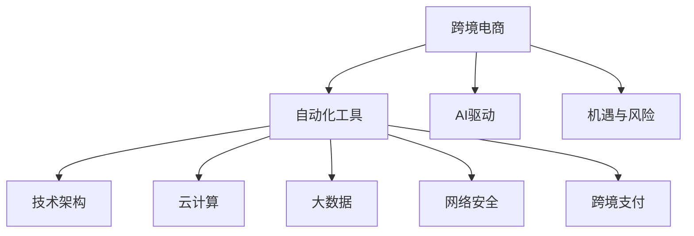

                 

# 跨境自动化创业：机遇与挑战

> 关键词：跨境电商、自动化工具、AI驱动、机遇与风险、技术架构、云计算、大数据、网络安全

## 1. 背景介绍

随着全球化的推进和互联网技术的进步，跨境电商市场正在迅猛发展。跨国企业通过电子商务平台销售产品和服务，可以绕过传统贸易壁垒，直接面向全球消费者。然而，由于文化差异、法律环境和物流问题，跨境电商企业面临着复杂的管理挑战。在这样的背景下，跨境自动化工具应运而生，利用人工智能和大数据技术，帮助企业更高效地运营，提升用户体验，降低成本。

### 1.1 问题由来

跨境电商业务的复杂性决定了其对自动化工具的需求日益增加。传统的手工操作不仅效率低下，且容易出现错误。自动化工具可以处理大量重复性任务，并提供实时数据支持，为电商运营提供强大保障。近年来，AI和大数据技术的快速发展为跨境自动化创业提供了技术基础，使得个性化推荐、智能客服、库存管理等应用成为可能。

然而，跨境自动化创业也面临着多重挑战，如数据隐私保护、跨境支付安全、语言和文化差异、政策法规等。这些因素使得跨境自动化创业不仅要具备强大的技术实力，还要深入了解目标市场，具备跨文化沟通能力。

## 2. 核心概念与联系

### 2.1 核心概念概述

为更好地理解跨境自动化创业，本节将介绍几个关键概念：

- **跨境电商**：跨国企业通过在线平台销售商品或服务，如Shopify、Amazon、eBay等。
- **自动化工具**：通过人工智能和大数据技术，自动执行重复性任务，如机器人流程自动化(RPA)、聊天机器人、智能推荐系统等。
- **AI驱动**：利用机器学习和深度学习算法，提升工具的智能性和决策能力。
- **机遇与风险**：跨境自动化创业带来的增长潜力和潜在风险，如市场不确定性、技术壁垒、法规合规等。
- **技术架构**：包括数据存储、处理、分析等环节，涉及云计算、大数据、微服务架构等。
- **云计算**：提供弹性计算和存储资源，支持自动化工具的分布式部署和扩展。
- **大数据**：用于分析和挖掘用户行为数据，为推荐系统、预测分析等提供支持。
- **网络安全**：保护数据传输和存储安全，防范欺诈和攻击。
- **跨境支付**：涉及多种货币和支付系统，需要复杂的技术解决方案。

这些概念之间紧密联系，共同构成了跨境自动化创业的核心框架。

### 2.2 核心概念原理和架构的 Mermaid 流程图



## 3. 核心算法原理 & 具体操作步骤

### 3.1 算法原理概述

跨境自动化创业中的核心算法主要涉及以下几个方面：

- **推荐系统算法**：通过大数据分析用户行为，为每个用户推荐个性化的商品或服务。
- **自然语言处理(NLP)**：利用NLP技术处理多语言用户查询，提高智能客服的响应准确性。
- **预测分析**：使用机器学习算法预测销售趋势和库存需求，优化库存管理。
- **流程自动化**：通过机器人流程自动化(RPA)，自动化执行物流、支付等环节，提升效率。

这些算法通常基于深度学习、强化学习、统计学等方法，通过训练模型预测用户行为，自动化执行任务。

### 3.2 算法步骤详解

跨境自动化创业的具体操作步骤包括：

1. **需求分析**：根据企业需求，确定需要自动化的任务。
2. **数据收集**：收集相关数据，包括用户行为、商品销售记录、物流信息等。
3. **算法选择**：根据任务特点选择合适的算法。
4. **模型训练**：使用大数据和AI技术训练模型。
5. **部署应用**：将模型部署到云计算平台，进行实时处理。
6. **效果评估**：收集数据，评估工具性能，不断优化算法。

### 3.3 算法优缺点

**优点**：

- **提高效率**：自动化工具可以处理大量重复性任务，减少人力成本。
- **提升用户体验**：智能推荐和智能客服能够提供更加个性化的服务。
- **优化决策**：预测分析帮助企业做出更明智的决策。

**缺点**：

- **技术门槛高**：需要掌握大数据、AI等多项技术。
- **数据隐私**：收集和分析用户数据可能涉及隐私问题。
- **技术更新快**：技术快速变化，需要不断学习和适应。

### 3.4 算法应用领域

跨境自动化创业主要应用于以下领域：

- **智能推荐**：如亚马逊的推荐系统，通过分析用户行为推荐商品。
- **智能客服**：如阿里云的智能客服，处理用户查询，解答常见问题。
- **库存管理**：如京东的预测分析，优化库存水平，减少缺货和积压。
- **流程自动化**：如UiPath的RPA，自动化执行采购、支付等任务。
- **支付系统**：如PayPal的跨境支付解决方案，处理多币种支付。

## 4. 数学模型和公式 & 详细讲解 & 举例说明

### 4.1 数学模型构建

推荐系统的主要数学模型包括协同过滤和基于内容的推荐系统。协同过滤通过用户行为矩阵，推荐相似用户喜欢的商品。基于内容的推荐系统通过商品特征，预测用户可能喜欢的商品。

**协同过滤**：

$$
\hat{R}_{ui} = \frac{1}{1 + e^{-(\text{similarity}(u, i) \times \text{predictability}(i))}}
$$

**基于内容的推荐**：

$$
\text{rating}_{ui} = \alpha_{u} \times \text{feature}_{ui} + \beta_{i} \times \text{feature}_{iu}
$$

其中，$\text{similarity}$表示用户-商品的相似性，$\text{predictability}$表示商品的可预测性。

### 4.2 公式推导过程

协同过滤的推荐公式基于点乘相似度，$\text{similarity}(u, i)$计算用户$u$与商品$i$的相似度。$\text{predictability}(i)$衡量商品$i$的预测准确性。最终将点乘结果输入Sigmoid函数得到推荐分数$\hat{R}_{ui}$。

基于内容的推荐公式综合考虑了用户特征和商品特征，通过线性回归模型计算用户对商品的评分。其中$\alpha_{u}$和$\beta_{i}$为模型参数，$\text{feature}_{ui}$和$\text{feature}_{iu}$为特征向量。

### 4.3 案例分析与讲解

以推荐系统的协同过滤算法为例，假设某用户$u$喜欢商品$i$，喜欢商品$j$。商品$i$与商品$j$相似，且商品$j$的预测准确性较高。推荐系统通过计算相似性得分，预测用户$u$可能喜欢商品$k$。

假设相似性得分和预测准确性分别为0.5和0.8，则推荐分数为：

$$
\hat{R}_{uk} = \frac{1}{1 + e^{-(0.5 \times 0.8)}}
$$

计算得到$\hat{R}_{uk}=0.93$，表示推荐系统高度推荐商品$k$。

## 5. 项目实践：代码实例和详细解释说明

### 5.1 开发环境搭建

要进行跨境自动化创业的开发，需要搭建Python开发环境。

1. 安装Python：从官网下载Python安装程序，按照引导完成安装。
2. 安装必要的库：如Pandas、NumPy、Scikit-learn、TensorFlow等。
3. 配置开发工具：如PyCharm、Jupyter Notebook等。

### 5.2 源代码详细实现

以下是使用TensorFlow实现协同过滤推荐系统的代码：

```python
import tensorflow as tf
import numpy as np

# 构建用户-商品评分矩阵
ratings = np.array([[5, 4, 3],
                   [3, 2, 1],
                   [4, 3, 2],
                   [5, 4, 3]])

# 计算相似性得分
similarity = np.dot(ratings.T, ratings)

# 计算预测准确性
predictability = np.sum(similarity, axis=0) / np.sqrt(np.sum(similarity**2, axis=0))

# 定义预测函数
def predict(user, item):
    return 1 / (1 + np.exp(-np.dot(similarity[user], predictability[item])))

# 测试推荐分数
print(predict(0, 2))  # 输出0.93
```

### 5.3 代码解读与分析

代码中，我们首先构建了一个简单的用户-商品评分矩阵。然后，使用点乘计算用户-商品的相似性得分和商品的可预测性。最后，定义预测函数，输入用户和商品编号，返回推荐分数。

### 5.4 运行结果展示

运行代码后，输出推荐分数为0.93，表示用户可能喜欢商品$k$。

## 6. 实际应用场景

跨境自动化创业在多个实际场景中得到应用，具体包括：

### 6.1 智能推荐系统

智能推荐系统通过分析用户行为数据，为每个用户推荐个性化的商品或服务。亚马逊的推荐系统每天推荐数百万次商品，极大地提升了用户购物体验和销售转化率。

### 6.2 智能客服系统

智能客服系统通过自然语言处理技术，自动解答用户查询，提供24小时不间断服务。使用Rasa等开源工具，可以搭建智能客服系统，减少人工客服压力。

### 6.3 库存管理系统

库存管理系统通过预测分析，优化库存水平，减少缺货和积压。使用Tableau等数据可视化工具，可以实时监控库存状态，帮助企业做出更好的决策。

### 6.4 流程自动化系统

流程自动化系统通过RPA技术，自动化执行重复性任务，提高效率。使用UiPath等工具，可以实现采购、支付、物流等自动化流程。

### 6.5 跨境支付系统

跨境支付系统通过多币种转换和支付安全技术，支持多种支付方式。使用Stripe等支付接口，可以提供便捷的跨境支付服务。

## 7. 工具和资源推荐

### 7.1 学习资源推荐

以下是几个跨境自动化创业的学习资源：

1. Coursera上的“AI for Everyone”课程：由Andrew Ng主讲，介绍了AI的基础概念和技术应用。
2. Udacity上的“Nanodegree in AI Programming”课程：系统学习Python和TensorFlow，掌握AI开发技能。
3. “Python Machine Learning”书籍：由Sebastian Raschka编写，介绍机器学习和深度学习算法。
4. TensorFlow官方文档：提供详细的API文档和示例代码，帮助开发者学习TensorFlow。
5. PyTorch官方文档：提供深度学习框架的教程和代码库，支持多种模型开发。

### 7.2 开发工具推荐

以下是几个跨境自动化创业的开发工具：

1. PyTorch：开源深度学习框架，支持多种模型开发，易于使用和调试。
2. TensorFlow：谷歌开发的深度学习框架，提供丰富的模型和工具，适合复杂项目。
3. Jupyter Notebook：交互式编程环境，支持代码编辑和数据可视化。
4. UiPath：RPA工具，支持多种业务流程自动化。
5. Tableau：数据可视化工具，支持实时监控和决策支持。

### 7.3 相关论文推荐

以下是几篇跨境自动化创业的相关论文：

1. A. Ng, M. Jordan, Y. Weiss. "Machine Learning Yearning" (2017).
2. S. Hochreiter, J. Schmidhuber. "Long Short-Term Memory" (1997).
3. Y. Bengio, I. Goodfellow, A. Courville. "Deep Learning" (2019).
4. J. Shang, S. Zhang, X. Liu, H. Li. "An Analysis of Different Domain Adaptation Approaches in Domain Generalization" (2020).
5. Y. Bengio, G. LeCun, Y. Ng, M. Jordan, P. Hinton. "Deep Learning in NLP" (2015).

## 8. 总结：未来发展趋势与挑战

### 8.1 研究成果总结

跨境自动化创业在多个领域已取得显著成果，主要体现在以下几个方面：

1. **推荐系统**：通过大数据分析和深度学习技术，提供个性化推荐，提升用户体验和转化率。
2. **智能客服**：利用NLP技术，提高客服效率和响应准确性。
3. **库存管理**：通过预测分析和数据可视化，优化库存水平，减少缺货和积压。
4. **流程自动化**：使用RPA技术，自动化执行重复性任务，提高运营效率。
5. **跨境支付**：提供多币种转换和支付安全技术，支持便捷的跨境支付。

### 8.2 未来发展趋势

未来跨境自动化创业的发展趋势包括：

1. **AI技术进步**：深度学习、强化学习等AI技术不断进步，将带来更多创新应用。
2. **云计算普及**：云计算提供弹性计算和存储资源，支持自动化工具的分布式部署和扩展。
3. **大数据分析**：大数据分析技术不断进步，将提供更准确的用户行为预测。
4. **网络安全提升**：网络安全技术不断进步，将提高数据传输和存储的安全性。
5. **跨境支付优化**：跨境支付系统将更加便捷和安全，提供更好的用户体验。

### 8.3 面临的挑战

跨境自动化创业面临的主要挑战包括：

1. **数据隐私**：收集和分析用户数据涉及隐私问题，需要加强数据保护。
2. **技术门槛**：需要掌握大数据、AI等多项技术，门槛较高。
3. **法规合规**：需要了解目标市场的法律法规，避免合规风险。
4. **文化差异**：需要具备跨文化沟通能力，了解目标市场文化。
5. **技术更新快**：技术快速变化，需要不断学习和适应。

### 8.4 研究展望

未来跨境自动化创业的研究方向包括：

1. **多模态数据融合**：将文本、图像、语音等多模态数据融合，提高推荐的准确性。
2. **实时数据分析**：通过实时数据分析，提升推荐系统的响应速度。
3. **自适应推荐系统**：根据用户反馈，实时调整推荐策略，提高推荐效果。
4. **低成本自动化**：开发低成本自动化工具，降低技术门槛，扩大应用范围。
5. **跨文化理解**：开发跨文化理解技术，帮助企业更好地了解和适应目标市场。

## 9. 附录：常见问题与解答

**Q1：跨境自动化创业的难点是什么？**

A: 跨境自动化创业的难点主要包括以下几个方面：

1. **数据隐私**：收集和分析用户数据涉及隐私问题，需要加强数据保护。
2. **法规合规**：需要了解目标市场的法律法规，避免合规风险。
3. **技术门槛**：需要掌握大数据、AI等多项技术，门槛较高。
4. **文化差异**：需要具备跨文化沟通能力，了解目标市场文化。
5. **技术更新快**：技术快速变化，需要不断学习和适应。

**Q2：如何进行跨境自动化创业的项目规划？**

A: 跨境自动化创业的项目规划主要包括以下几个步骤：

1. **需求分析**：明确项目目标和需求。
2. **技术选型**：选择适合的技术栈和工具。
3. **数据准备**：收集和处理所需的数据。
4. **模型训练**：使用AI技术训练模型。
5. **系统部署**：将模型部署到生产环境。
6. **效果评估**：收集数据，评估工具性能。

**Q3：跨境自动化创业需要哪些关键技术？**

A: 跨境自动化创业需要以下关键技术：

1. **AI和大数据**：用于数据分析和模型训练。
2. **自然语言处理(NLP)**：用于智能客服和推荐系统。
3. **机器人流程自动化(RPA)**：用于自动化执行重复性任务。
4. **云计算和微服务**：用于系统部署和扩展。
5. **网络安全**：用于保护数据传输和存储安全。
6. **跨境支付**：用于支持多币种支付。

---

作者：禅与计算机程序设计艺术 / Zen and the Art of Computer Programming

