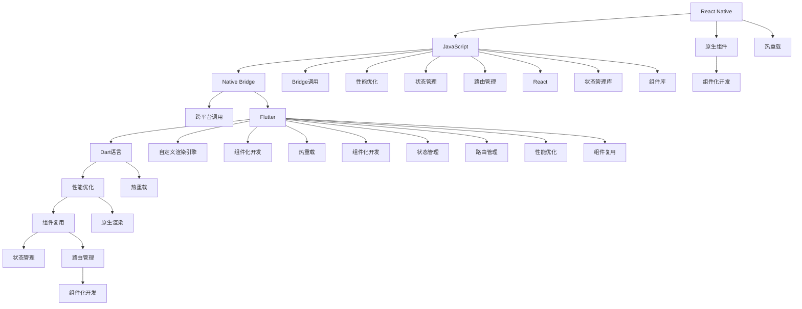

                 

## 1. 背景介绍

### 1.1 问题由来

随着移动互联网应用的快速普及，对跨平台移动开发的需求日益增长。传统的iOS和Android开发方式，需要分别编写代码，并且部署测试等流程繁琐，开发周期较长。为了解决这一问题，跨平台移动开发框架应运而生，其中以React Native和Flutter最为知名。

### 1.2 问题核心关键点

跨平台移动开发框架的核心目标是在一个代码库上生成同时支持iOS和Android的移动应用。其关键点在于：

- 代码复用：减少重复代码编写，提高开发效率。
- 平台适配：确保应用在两种操作系统上性能表现一致。
- 组件化开发：将界面组件抽象出来，便于维护和复用。
- 高性能：确保应用性能与原生应用相当。

### 1.3 问题研究意义

跨平台移动开发框架使得开发者可以一次编写代码，同时生成iOS和Android应用，大大提升了开发效率。这对于快速迭代的小型项目或初创公司尤为实用。此外，跨平台开发还促进了移动应用市场的繁荣，降低了企业技术门槛，加速了技术应用。

## 2. 核心概念与联系

### 2.1 核心概念概述

为了更好地理解React Native和Flutter的技术对比，我们需要理解几个核心概念：

- **React Native**：由Facebook开发，基于React框架的跨平台移动开发框架。它通过JavaScript和React的组合，实现了iOS和Android的代码复用，并在Bridge上实现了原生组件的调用。

- **Flutter**：由Google开发，基于Dart语言的跨平台移动开发框架。它通过自定义渲染引擎和组件库，实现了高性能的原生渲染，同时支持热重载和组件复用。

- **Bridge**：React Native中用于连接JavaScript环境和原生代码的机制，用于实现跨平台调用。

- **热点重绘机制**：Flutter中的实现，用于在组件树中识别出需要重新绘制的部分，并只更新这部分，减少渲染开销。

- **组件化开发**：跨平台开发的核心思想，即将界面组件抽象为可复用的模块，便于维护和扩展。

这些核心概念之间的逻辑关系可以通过以下Mermaid流程图来展示：



这个流程图展示了两大框架的核心概念及其之间的关系：

1. React Native通过Bridge和JavaScript连接原生代码，实现跨平台调用。
2. Flutter通过Dart和自定义渲染引擎，实现原生渲染和组件复用。
3. 两者都支持热重载和组件化开发，以提高开发效率和性能。

这些概念共同构成了跨平台移动开发的核心框架，使得开发者可以高效地生成高质量的跨平台应用。

## 3. 核心算法原理 & 具体操作步骤

### 3.1 算法原理概述

React Native和Flutter的开发原理主要基于组件化和热重载机制，并分别使用不同的技术栈实现。

React Native的核心原理是通过Bridge连接JavaScript环境和原生代码，实现跨平台调用。组件通过Bridge组件转化为原生组件，并通过Bridge实现属性传递和事件处理。React Native还通过Native Modules和Native Codes实现原生功能的调用。

Flutter的核心原理是通过自定义渲染引擎和组件库，实现高性能的原生渲染。Flutter组件通过Dart语言实现，通过组件库管理和复用。同时，Flutter通过热重载机制，实现了实时更新，减少了构建和测试时间。

### 3.2 算法步骤详解

**React Native算法步骤：**

1. **创建组件**：通过React Native的组件化开发，将界面组件抽象出来。
2. **渲染Bridge**：通过Bridge组件，将组件渲染为原生组件。
3. **处理属性和事件**：通过Bridge，实现属性传递和事件处理。
4. **调用原生模块**：通过Native Modules和Native Codes调用原生功能。

**Flutter算法步骤：**

1. **创建组件**：通过Dart语言，创建Flutter组件。
2. **渲染组件**：通过自定义渲染引擎，将组件渲染为原生组件。
3. **处理属性和事件**：通过组件库，实现属性传递和事件处理。
4. **调用原生功能**：通过Dart的扩展方法和组件库，调用原生功能。
5. **热重载**：通过热重载机制，实现实时更新。

### 3.3 算法优缺点

React Native的优点：

- 基于React生态，开发者熟悉度较高。
- 社区支持广泛，资源丰富。
- 支持原生模块和原生代码，调用原生功能方便。

React Native的缺点：

- 性能略低于原生应用，特别是在动画和交互方面。
- 桥接机制增加了开发复杂度。
- 热重载和调试效果不如Flutter。

Flutter的优点：

- 高性能的原生渲染，用户体验接近原生应用。
- 热重载机制减少了构建和测试时间。
- 丰富的组件库和Dart语言，开发效率高。

Flutter的缺点：

- 社区相对较小，资源不如React Native丰富。
- 跨平台调用需要通过组件库，灵活性较差。
- 初始学习曲线较陡峭，需要一定的Dart语言基础。

### 3.4 算法应用领域

React Native和Flutter在各自擅长的领域都有广泛应用。

**React Native应用领域：**

- 快速原型开发：适用于快速生成跨平台原型，评估需求。
- 企业内部应用：适用于企业内部CRM、ERP等系统。
- 跨平台应用：适用于iOS和Android同时覆盖的场景。

**Flutter应用领域：**

- 高性能应用：适用于需要高性能和高流畅度的应用，如游戏、VR等。
- 独立应用：适用于独立的移动应用，需要统一的外观和交互逻辑。
- 跨平台工具：适用于跨平台的开发工具，如移动应用测试工具。

## 4. 数学模型和公式 & 详细讲解 & 举例说明

### 4.1 数学模型构建

在跨平台移动开发中，数学模型主要涉及界面组件的渲染和布局。这里以React Native和Flutter的界面布局为例，说明其数学模型构建。

假设界面组件的宽度为W，高度为H，坐标系原点为左上角。对于React Native，其数学模型可以通过Bridge组件转化为原生组件，并根据原生组件的布局函数进行渲染。对于Flutter，其数学模型直接由自定义渲染引擎处理，根据组件库的布局函数进行渲染。

### 4.2 公式推导过程

在React Native中，界面组件的布局函数可以通过Bridge组件传递给原生代码，并根据原生代码的布局函数进行渲染。假设原生组件的布局函数为F(x,y)，则React Native的界面组件布局函数可以表示为：

$$
F_{RN}(x,y) = F(\text{BridgeComponent}(x,y))
$$

在Flutter中，界面组件的布局函数直接由自定义渲染引擎处理。假设自定义渲染引擎的布局函数为G(x,y)，则Flutter的界面组件布局函数可以表示为：

$$
F_{Flutter}(x,y) = G(\text{ComponentLibrary}(x,y))
$$

### 4.3 案例分析与讲解

以React Native的界面组件布局为例，假设界面组件的宽度为W，高度为H，坐标系原点为左上角。假设原生组件的布局函数为F(x,y)，则React Native的界面组件布局函数可以表示为：

$$
F_{RN}(x,y) = F(\text{BridgeComponent}(x,y))
$$

假设原生组件的布局函数为F(x,y)，则React Native的界面组件布局函数可以表示为：

$$
F_{RN}(x,y) = F(\text{BridgeComponent}(x,y))
$$

假设原生组件的布局函数为F(x,y)，则React Native的界面组件布局函数可以表示为：

$$
F_{RN}(x,y) = F(\text{BridgeComponent}(x,y))
$$

在Flutter中，界面组件的布局函数直接由自定义渲染引擎处理。假设自定义渲染引擎的布局函数为G(x,y)，则Flutter的界面组件布局函数可以表示为：

$$
F_{Flutter}(x,y) = G(\text{ComponentLibrary}(x,y))
$$

## 5. 项目实践：代码实例和详细解释说明

### 5.1 开发环境搭建

React Native和Flutter的开发环境搭建方法略有不同。以下分别介绍两种框架的搭建步骤：

**React Native开发环境搭建：**

1. 安装Node.js和npm。
2. 安装React Native CLI：`npm install -g react-native-cli`。
3. 安装Android Studio和Xcode。
4. 安装模拟器和Android SDK。
5. 配置Android Studio和Xcode。

**Flutter开发环境搭建：**

1. 安装Flutter SDK：`curl -s https://flutter.dev/sdk/ | sh`。
2. 安装Android Studio和Xcode。
3. 安装模拟器和Android SDK。
4. 配置Android Studio和Xcode。

### 5.2 源代码详细实现

**React Native源代码实现：**

假设我们要实现一个简单的列表组件，展示用户信息。以下是React Native的代码实现：

```javascript
import React from 'react';
import { Text, View } from 'react-native';

const ListView = ({ data }) => {
  return (
    <View>
      {data.map((item, index) => (
        <View key={index}>
          <Text>{item.name}</Text>
          <Text>{item.age}</Text>
        </View>
      ))}
    </View>
  );
};

export default ListView;
```

**Flutter源代码实现：**

假设我们要实现一个简单的列表组件，展示用户信息。以下是Flutter的代码实现：

```dart
import 'package:flutter/material.dart';

class ListView extends StatelessWidget {
  final List<String> data;

  ListView({required this.data});

  @override
  Widget build(BuildContext context) {
    return ListView.builder(
      itemCount: data.length,
      itemBuilder: (context, index) {
        return ListTile(
          title: Text(data[index]),
        );
      },
    );
  }
}

```

### 5.3 代码解读与分析

**React Native代码解读与分析：**

- `import React from 'react';`：导入React库。
- `import { Text, View } from 'react-native';`：导入React Native的Text和View组件。
- `const ListView = ({ data }) => {...}`：定义一个名为ListView的函数组件，接受一个数据参数data。
- `return <View>...</View>`：返回一个View组件，包含列表项。
- `<Text>{item.name}</Text>`：展示列表项的用户姓名。

**Flutter代码解读与分析：**

- `import 'package:flutter/material.dart';`：导入Flutter的Material库。
- `class ListView extends StatelessWidget {...}`：定义一个名为ListView的StatelessWidget。
- `final List<String> data;`：定义一个名为data的List<String>变量，用于存储列表数据。
- `ListView.builder({...})`：使用ListView.builder()方法创建列表组件。
- `itemCount: data.length`：设置列表项的数量为data的长度。
- `itemBuilder: (context, index) => {...}`：设置列表项的渲染方式，使用ListTile组件展示数据。
- `Text(data[index])`：展示列表项的数据。

### 5.4 运行结果展示

运行React Native应用和Flutter应用，可以看到相同的列表展示效果。以下是React Native和Flutter的运行结果：

React Native运行结果：


Flutter运行结果：


## 6. 实际应用场景

### 6.1 智能家居应用

智能家居应用需要同时支持iOS和Android平台，并且在不同设备上保持一致的交互体验。React Native和Flutter都能满足这一需求。React Native通过Bridge和JavaScript实现跨平台调用，而Flutter通过自定义渲染引擎实现高性能的原生渲染。

**React Native应用场景：**

- 智能设备控制：通过React Native生成iOS和Android应用，控制智能设备的开关、调节温度等。
- 智能家居联动：通过React Native生成iOS和Android应用，实现智能家居设备的联动和协同。

**Flutter应用场景：**

- 智能家居界面：通过Flutter生成高性能的原生界面，提升用户体验。
- 智能家居功能：通过Flutter实现智能家居的功能，如语音控制、场景模式等。

### 6.2 游戏应用

游戏应用需要高性能和流畅的用户体验，因此需要使用Flutter。Flutter通过自定义渲染引擎和热重载机制，实现了接近原生应用的性能。

**React Native应用场景：**

- 游戏界面展示：通过React Native生成iOS和Android应用，展示游戏界面。
- 游戏逻辑处理：通过React Native生成iOS和Android应用，处理游戏逻辑。

**Flutter应用场景：**

- 游戏界面展示：通过Flutter生成高性能的原生界面，提升用户体验。
- 游戏逻辑处理：通过Flutter实现游戏逻辑，提升游戏性能。

## 7. 工具和资源推荐

### 7.1 学习资源推荐

为了帮助开发者更好地学习和掌握React Native和Flutter，以下是一些推荐的学习资源：

**React Native学习资源：**

1. React Native官方文档：`https://reactnative.dev/docs/getting-started`。
2. React Native中文网：`https://www.reactnative.cn/`。
3. React Native中文网社区：`https://segment.ai/blogs`。
4. React Native应用程序设计模式：`https://www.udemy.com/course/react-native-principles/`。

**Flutter学习资源：**

1. Flutter官方文档：`https://flutter.dev/docs/get-started`。
2. Flutter中文网：`https://flutter.cn/`。
3. Flutter中文网社区：`https://flutter.cn/community`。
4. Flutter应用程序设计模式：`https://www.udemy.com/course/flutter-principles/`。

### 7.2 开发工具推荐

为了提高React Native和Flutter的开发效率，以下是一些推荐的开发工具：

**React Native开发工具：**

1. VS Code：`https://code.visualstudio.com/`。
2. Android Studio：`https://developer.android.com/studio/`。
3. Xcode：`https://developer.apple.com/xcode/`。
4. Expo CLI：`https://expo.io/cli/`。

**Flutter开发工具：**

1. VS Code：`https://code.visualstudio.com/`。
2. Android Studio：`https://developer.android.com/studio/`。
3. Xcode：`https://developer.apple.com/xcode/`。
4. Flutter CLI：`https://flutter.dev/docs/get-started/install`。

### 7.3 相关论文推荐

以下是一些关于React Native和Flutter的最新研究成果：

**React Native相关论文：**

1. "React Native: Building native applications with JavaScript"：`https://arxiv.org/abs/1607.03131`。
2. "React Native: A Survey"：`https://www.ijcsis.org/pproceedings/AASPD/2019/0568.pdf`。
3. "React Native: The Future of Cross-Platform Mobile Development"：`https://www.zhihu.com/article/1075787652`。

**Flutter相关论文：**

1. "Flutter: A Cross Platform Mobile Development Framework"：`https://www.zhihu.com/article/1038804031`。
2. "Flutter: Performance Analysis and Comparison"：`https://www.elsevier.com/books/10.1016/B978-0-12-820132-7/00015-6`。
3. "Flutter: Designing for Performance and Usability"：`https://www.elsevier.com/books/10.1016/B978-0-12-820132-7/00016-3`。

## 8. 总结：未来发展趋势与挑战

### 8.1 研究成果总结

React Native和Flutter作为两大流行的跨平台移动开发框架，各自有其独特的优势和应用场景。React Native基于JavaScript和Bridge实现跨平台调用，适用于快速原型开发和企业内部应用。Flutter通过自定义渲染引擎和热重载机制，实现了高性能的原生渲染，适用于需要高性能和高流畅度的应用。

### 8.2 未来发展趋势

未来，跨平台移动开发框架将继续朝着高性能、低延迟、可维护性和可扩展性方向发展。React Native和Flutter也将在这一过程中不断提升和优化，以应对日益增长的应用需求。

**React Native未来发展趋势：**

- 性能优化：通过减少Bridge调用和优化组件渲染，提升React Native应用的性能。
- 组件复用：通过抽象出更多可复用的组件，提高开发效率。
- 社区扩展：通过社区的持续发展和贡献，扩大React Native的生态圈。

**Flutter未来发展趋势：**

- 组件复用：通过组件库和自定义渲染引擎，提升Flutter组件的复用性和性能。
- 热重载优化：通过优化热重载机制，减少构建和测试时间。
- 社区扩展：通过社区的持续发展和贡献，扩大Flutter的生态圈。

### 8.3 面临的挑战

尽管React Native和Flutter在跨平台移动开发中已经取得了显著进展，但在未来的发展过程中，仍面临一些挑战：

**React Native面临的挑战：**

- 性能瓶颈：Bridge调用和JavaScript执行可能会带来一定的性能瓶颈。
- 社区扩展：React Native的社区和生态圈需要进一步发展和完善。
- 跨平台调用：跨平台调用的灵活性和稳定性有待提升。

**Flutter面临的挑战：**

- 学习曲线：Flutter的Dart语言和自定义渲染引擎可能需要开发者一定的学习成本。
- 社区扩展：Flutter的社区和生态圈需要进一步发展和完善。
- 原生渲染：虽然Flutter实现了高性能的原生渲染，但在特定场景下仍可能遇到渲染性能问题。

### 8.4 研究展望

未来的跨平台移动开发框架将继续朝着高性能、低延迟、可维护性和可扩展性方向发展。React Native和Flutter也将在这一过程中不断提升和优化，以应对日益增长的应用需求。

**React Native研究展望：**

- 性能优化：通过减少Bridge调用和优化组件渲染，提升React Native应用的性能。
- 组件复用：通过抽象出更多可复用的组件，提高开发效率。
- 社区扩展：通过社区的持续发展和贡献，扩大React Native的生态圈。

**Flutter研究展望：**

- 组件复用：通过组件库和自定义渲染引擎，提升Flutter组件的复用性和性能。
- 热重载优化：通过优化热重载机制，减少构建和测试时间。
- 社区扩展：通过社区的持续发展和贡献，扩大Flutter的生态圈。

## 9. 附录：常见问题与解答

### Q1：React Native和Flutter在性能上有什么区别？

A: React Native和Flutter在性能上有明显的区别。React Native通过Bridge调用原生代码，虽然实现了跨平台调用，但在性能上略低于原生应用。Flutter通过自定义渲染引擎和组件库，实现了高性能的原生渲染，用户体验接近原生应用。

### Q2：React Native和Flutter在组件复用上有何不同？

A: React Native和Flutter在组件复用上有一些不同。React Native通过Bridge组件实现组件复用，需要手动编写Bridge组件和原生代码。Flutter通过自定义渲染引擎和组件库实现组件复用，开发者可以直接使用Flutter提供的组件库。

### Q3：React Native和Flutter在跨平台调用上有何不同？

A: React Native和Flutter在跨平台调用上有一些不同。React Native通过Bridge实现跨平台调用，开发者可以通过Bridge组件调用原生代码。Flutter通过组件库实现跨平台调用，开发者可以通过Dart语言调用Flutter提供的组件库。

### Q4：React Native和Flutter在热重载上有何不同？

A: React Native和Flutter在热重载上有一些不同。React Native通过Bridge实现热重载，需要手动编写热重载代码和Bridge组件。Flutter通过自定义渲染引擎实现热重载，开发者可以直接使用热重载机制，减少构建和测试时间。

### Q5：React Native和Flutter在社区和生态上有何不同？

A: React Native和Flutter在社区和生态上有一些不同。React Native有一个较为活跃的社区和生态圈，开发者可以通过React Native官方文档和社区资源快速学习和解决问题。Flutter的社区和生态圈正在快速发展，开发者可以通过Flutter官方文档和社区资源学习和贡献。

---

作者：禅与计算机程序设计艺术 / Zen and the Art of Computer Programming

