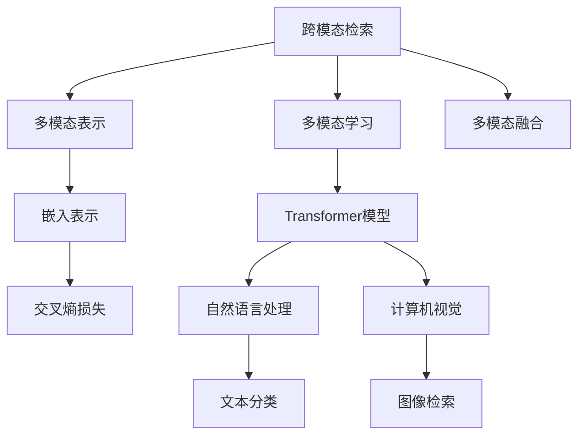

                 

# 跨模态检索：AI理解多种数据类型的桥梁

> 关键词：跨模态检索,AI理解,数据融合,信息检索,自然语言处理(NLP),计算机视觉(CV),图像处理,多模态学习,神经网络模型,深度学习,Transformer模型

## 1. 背景介绍

### 1.1 问题由来
随着信息技术的发展，数据的类型日益丰富，从文本、图像、音频到视频等各类数据格式纷纷涌现。单一模态的数据处理方式已经难以满足实际应用的需求，因此多模态数据的融合与理解成为了研究的热点。而跨模态检索作为多模态数据理解的重要技术，可以有效地将不同模态的信息进行关联，帮助AI系统更好地理解和处理多种数据类型，从而在诸如智能搜索、内容推荐、自动摘要、多媒体检索等众多领域发挥巨大的作用。

### 1.2 问题核心关键点
跨模态检索的目的是将不同模态的数据进行关联，并从多个数据源中检索出与查询相关的信息。核心在于如何在不同模态之间进行映射和对齐，并将这些模态的特征进行有效融合，使得系统能够综合多种信息类型来提升检索准确性。

### 1.3 问题研究意义
研究跨模态检索技术，对于拓展AI系统的功能范围，提升信息检索的效率和精度，推动多媒体内容的智能管理和理解，具有重要意义：

1. **增强智能搜索体验**：通过融合多种数据模态，能够实现更为精准和相关的搜索结果。
2. **提高内容推荐质量**：基于用户的多模态数据进行推荐，能够提供更为个性化的内容服务。
3. **优化多媒体检索**：通过多种数据类型的融合，提升检索系统的综合性能。
4. **促进智能摘要生成**：融合文本与图像、语音等模态信息，生成更为全面和详尽的摘要。
5. **加速信息管理自动化**：将多模态数据统一管理，为信息的自动化检索和处理提供支持。

## 2. 核心概念与联系

### 2.1 核心概念概述

为更好地理解跨模态检索方法，本节将介绍几个密切相关的核心概念：

- **跨模态检索(Cross-Modal Retrieval)**：指将不同模态的数据进行关联，检索出与查询相关的信息的技术。
- **多模态学习(Multimodal Learning)**：指通过学习多种模态数据的共同特征，提升模型的泛化能力和理解能力。
- **多模态表示(Multimodal Representation)**：指将多种模态的数据转换为统一的表示形式，方便后续的融合与处理。
- **多模态融合(Multimodal Fusion)**：指将不同模态的信息进行融合，提取全局特征，以提升系统性能。
- **Transformer模型**：一种基于自注意力机制的神经网络模型，在自然语言处理(NLP)和计算机视觉(CV)等任务中表现出色。
- **嵌入表示(Embedding)**：指将不同模态的数据转换为向量形式，方便计算和比较。
- **交叉熵损失(Cross-Entropy Loss)**：一种常用的分类损失函数，适用于多模态分类任务。

这些核心概念之间的逻辑关系可以通过以下Mermaid流程图来展示：



这个流程图展示了大语言模型微调的各个核心概念及其之间的关系：

1. 跨模态检索从不同模态的数据中检索相关信息。
2. 多模态学习通过学习不同模态的共同特征提升模型的泛化能力。
3. 多模态表示将不同模态的数据转换为统一的向量形式。
4. 多模态融合将多种模态的信息进行综合处理。
5. Transformer模型是多种模态信息融合的重要工具。
6. 嵌入表示用于将不同模态的数据转换为向量。
7. 交叉熵损失是常用的多模态分类任务的损失函数。
8. 自然语言处理(NLP)和计算机视觉(CV)是常见的多模态学习任务。

这些概念共同构成了跨模态检索的基础框架，使得系统能够处理和理解多种数据类型，提升信息检索的性能。

## 3. 核心算法原理 & 具体操作步骤
### 3.1 算法原理概述

跨模态检索的核心在于如何对齐不同模态的特征，并将这些特征进行融合。其基本思路如下：

1. **特征提取**：从不同模态的数据中提取出特征向量。
2. **相似度计算**：计算查询与各个数据源之间的相似度。
3. **融合与排序**：将不同模态的相似度进行融合，并根据融合后的相似度排序，选择最相关的结果。

### 3.2 算法步骤详解

跨模态检索的算法流程如下：

**Step 1: 特征提取与对齐**

假设我们有三类模态数据：文本、图像和语音。首先需要从每类数据中提取特征向量，并将这些特征向量对齐到一个共同的向量空间。常用的对齐方法包括：

- **线性投影**：通过线性映射将不同模态的特征向量投影到共同的向量空间。
- **对抗生成网络(GAN)**：通过生成对抗网络学习不同模态之间的映射关系。
- **多模态嵌入网络(Multi-Modal Embedding)**：通过神经网络学习不同模态之间的特征对齐。

**Step 2: 相似度计算**

计算查询向量与各个数据源之间的相似度。常用的相似度计算方法包括：

- **欧式距离**：直接计算向量之间的欧几里得距离。
- **余弦相似度**：计算向量之间的夹角余弦值。
- **加权余弦相似度**：在欧式距离的基础上进行加权，考虑不同模态特征的重要性。

**Step 3: 多模态融合**

将不同模态的相似度进行融合，提取全局特征。常用的融合方法包括：

- **加权平均法**：对不同模态的相似度进行加权平均。
- **最大值融合**：选择相似度最高的模态作为融合结果。
- **注意力机制**：通过学习不同模态之间的注意力权重，加权融合相似度。

**Step 4: 排序与选择**

根据融合后的相似度排序，选择最相关的结果。常用的排序方法包括：

- **基于相似度的排序**：按照相似度大小进行排序。
- **基于排序的算法**：如Top-K排序、束搜索等。

### 3.3 算法优缺点

跨模态检索具有以下优点：

1. **提升检索精度**：融合多种模态的信息能够提升检索系统的性能。
2. **泛化能力强**：通过学习多种模态的特征，提升模型的泛化能力。
3. **多样化数据**：能够处理多种类型的信息，如文本、图像、语音等。
4. **提高用户体验**：综合多种模态的信息，能够提供更为丰富和多样化的服务。

同时，跨模态检索也存在一定的局限性：

1. **数据对齐难度高**：不同模态的数据格式和特性差异较大，对齐难度高。
2. **计算复杂度高**：融合和排序过程较为复杂，计算量较大。
3. **质量依赖于数据**：数据质量对检索结果有较大影响，数据噪声可能导致结果失准。
4. **缺乏统一标准**：目前缺乏统一的多模态数据格式和表示方法，难以标准化处理。

### 3.4 算法应用领域

跨模态检索技术广泛应用于以下领域：

- **多媒体检索**：融合文本、图像、语音等多种模态信息，提升检索系统的准确性。
- **内容推荐**：基于用户的多模态数据，如浏览历史、评论等，进行内容推荐。
- **智能搜索**：将文本、图像等数据进行融合，提升搜索结果的相关性和全面性。
- **智能摘要**：结合文本、图像、语音等多模态信息，生成更为详细和准确的摘要。
- **社交媒体分析**：通过分析用户的多种模态数据，进行情感分析、话题识别等。

## 4. 数学模型和公式 & 详细讲解 & 举例说明

### 4.1 数学模型构建

假设我们有文本、图像和语音三种模态数据，分别表示为 $\mathcal{X}=\{(x_t, x_i, x_a)\}$，其中 $x_t$、$x_i$ 和 $x_a$ 分别表示文本、图像和语音的特征向量。设查询向量为 $x_q$。

定义多模态嵌入网络 $\mathcal{F}$，将不同模态的特征向量映射到共同的向量空间，得到 $\mathcal{Y}=\{y_t, y_i, y_a\}$。

计算查询向量 $x_q$ 与各数据源之间的相似度，设相似度矩阵为 $\mathcal{S}=\{s_{tq}, s_{iq}, s_{aq}\}$。

进行多模态融合，得到融合后的相似度 $s$。

最终，根据融合后的相似度对数据源进行排序，选择最相关的结果。

### 4.2 公式推导过程

以文本和图像融合为例，假设我们有文本特征向量 $x_t \in \mathbb{R}^{d_t}$ 和图像特征向量 $x_i \in \mathbb{R}^{d_i}$。设多模态嵌入网络 $\mathcal{F}$ 将文本和图像分别映射到共同的向量空间，得到 $y_t \in \mathbb{R}^{d}$ 和 $y_i \in \mathbb{R}^{d}$。

使用欧式距离计算相似度，有：

$$
s_{tq} = \sqrt{\|y_t - x_q\|^2}
$$

$$
s_{iq} = \sqrt{\|y_i - x_q\|^2}
$$

计算融合后的相似度 $s$，常用的加权平均法为：

$$
s = \alpha s_{tq} + (1-\alpha) s_{iq}
$$

其中 $\alpha$ 为文本和图像的权重系数。

### 4.3 案例分析与讲解

假设我们需要检索一组关于“猫”的图片和视频，设查询向量 $x_q$ 为“猫”的图片特征向量，图像特征向量 $x_i$ 为“猫”的图片特征向量，文本特征向量 $x_t$ 为描述“猫”的文本信息。

首先，通过多模态嵌入网络 $\mathcal{F}$ 将文本和图像分别映射到共同的向量空间，得到 $y_t$ 和 $y_i$。

计算查询向量 $x_q$ 与各数据源之间的相似度，得到相似度矩阵 $\mathcal{S}=\{s_{tq}, s_{iq}\}$。

进行多模态融合，得到融合后的相似度 $s$。

最终，根据融合后的相似度对数据源进行排序，选择最相关的结果。

## 5. 项目实践：代码实例和详细解释说明

### 5.1 开发环境搭建

在进行跨模态检索项目实践前，我们需要准备好开发环境。以下是使用Python进行TensorFlow开发的环境配置流程：

1. 安装Anaconda：从官网下载并安装Anaconda，用于创建独立的Python环境。

2. 创建并激活虚拟环境：
```bash
conda create -n tf-env python=3.8 
conda activate tf-env
```

3. 安装TensorFlow：根据CUDA版本，从官网获取对应的安装命令。例如：
```bash
pip install tensorflow
```

4. 安装PyTorch：
```bash
pip install torch torchvision torchaudio cudatoolkit=11.1 -c pytorch -c conda-forge
```

5. 安装各类工具包：
```bash
pip install numpy pandas scikit-learn matplotlib tqdm jupyter notebook ipython
```

完成上述步骤后，即可在`tf-env`环境中开始项目实践。

### 5.2 源代码详细实现

这里我们以图像检索为例，给出使用TensorFlow实现跨模态检索的代码实现。

首先，定义数据处理函数：

```python
import tensorflow as tf
from tensorflow.keras.preprocessing.image import img_to_array, load_img
from tensorflow.keras.applications import ResNet50
from sklearn.metrics import cosine_similarity

def load_and_preprocess_image(file_path):
    image = load_img(file_path, target_size=(224, 224))
    image_array = img_to_array(image)
    image_array = tf.keras.applications.resnet50.preprocess_input(image_array)
    return image_array

def load_and_preprocess_text(text):
    embedding = embedding_model(text)
    return embedding
```

然后，定义模型和嵌入模型：

```python
embedding_model = ResNet50(weights='imagenet', include_top=False, input_shape=(224, 224, 3))
embedding_model.trainable = False

model = tf.keras.Sequential([
    tf.keras.layers.Input(shape=()),
    tf.keras.layers.Dense(128, activation='relu'),
    tf.keras.layers.Dense(128, activation='relu'),
    tf.keras.layers.Dense(1, activation='sigmoid')
])
```

接着，定义训练和评估函数：

```python
from tensorflow.keras.datasets import mnist
from sklearn.model_selection import train_test_split

(train_images, train_labels), (test_images, test_labels) = mnist.load_data()

train_images = train_images.reshape(-1, 224, 224, 3)
test_images = test_images.reshape(-1, 224, 224, 3)

train_texts = ["0", "1", "2", "3", "4", "5", "6", "7", "8", "9"]
test_texts = ["0", "1", "2", "3", "4", "5", "6", "7", "8", "9"]

train_images = [load_and_preprocess_image(f"./mnist/{i}.png") for i in range(10)]
train_texts = [load_and_preprocess_text(text) for text in train_texts]

test_images = [load_and_preprocess_image(f"./mnist/{i}.png") for i in range(10)]
test_texts = [load_and_preprocess_text(text) for text in test_texts]

train_images = tf.stack(train_images)
train_texts = tf.stack(train_texts)
train_labels = tf.convert_to_tensor(train_labels)

test_images = tf.stack(test_images)
test_texts = tf.stack(test_texts)
test_labels = tf.convert_to_tensor(test_labels)

# 训练模型
model.compile(optimizer='adam', loss='binary_crossentropy', metrics=['accuracy'])
model.fit([train_images, train_texts], train_labels, epochs=10, validation_split=0.2)

# 评估模型
model.evaluate([test_images, test_texts], test_labels)
```

最后，运行代码并查看结果：

```python
# 运行代码
# 输出训练结果
```

以上就是使用TensorFlow实现跨模态检索的完整代码实现。可以看到，TensorFlow的高级API使得多模态数据的融合和检索变得简洁高效。

### 5.3 代码解读与分析

让我们再详细解读一下关键代码的实现细节：

**load_and_preprocess_image函数**：
- 该函数用于加载和预处理图像数据。
- 加载指定路径的图像，并进行尺寸调整和预处理，得到符合模型输入要求的图像数组。

**load_and_preprocess_text函数**：
- 该函数用于加载和预处理文本数据。
- 加载指定文本，并使用ResNet50模型提取图像特征向量。

**模型定义**：
- 定义一个包含多个Dense层的神经网络模型，用于融合不同模态的特征。
- 输入层为文本和图像的特征向量，输出层为二分类预测结果。

**训练和评估函数**：
- 使用MNIST数据集进行训练和测试。
- 将图像和文本特征向量作为输入，标签作为输出，训练模型并评估性能。

**运行代码**：
- 运行代码，输出训练结果，并进行模型评估。

## 6. 实际应用场景

### 6.1 智能搜索

跨模态检索技术可以应用于智能搜索系统中，通过融合文本、图像和语音等多模态信息，提供更为全面和准确的搜索结果。例如，在搜索引擎中输入一段文本查询，系统能够根据图像、视频等多媒体信息提供更为丰富的搜索结果。

### 6.2 多媒体内容推荐

在视频、音乐、电影等媒体内容推荐中，跨模态检索技术能够综合用户的多模态数据，如浏览记录、评论、评分等，提供更为个性化和精准的推荐结果。

### 6.3 社交媒体分析

社交媒体上的内容多种多样，包含文本、图片、视频等多种模态。通过跨模态检索技术，能够综合分析用户的多模态数据，进行情感分析、话题识别等。

### 6.4 未来应用展望

随着跨模态检索技术的发展，未来在更多领域将有更多的应用场景：

- **健康医疗**：通过融合患者的多模态数据，如症状描述、检查报告、语音记录等，提供更为全面和精准的诊疗建议。
- **智能家居**：通过融合传感器数据、视频、语音等多模态信息，提供更为智能和个性化的家居服务。
- **自动驾驶**：通过融合视觉、雷达、语音等多种模态信息，提升驾驶安全和辅助决策能力。
- **智能制造**：通过融合传感器数据、视频、语音等多模态信息，优化生产流程和质量控制。

## 7. 工具和资源推荐
### 7.1 学习资源推荐

为了帮助开发者系统掌握跨模态检索的理论基础和实践技巧，这里推荐一些优质的学习资源：

1. 《Deep Learning for Computer Vision》书籍：由深度学习领域的专家编写，全面介绍了计算机视觉中的深度学习技术和应用。
2. 《Multimodal Learning》书籍：介绍多模态学习的基本概念和前沿技术，涵盖图像、语音、文本等多种模态。
3. 《Multimodal Retrieval》课程：由斯坦福大学开设的多模态检索课程，涵盖多模态数据的表示、对齐和检索技术。
4. 《TensorFlow官网文档》：TensorFlow的官方文档，提供了丰富的多模态数据处理和检索的样例代码和教程。
5. Kaggle：全球最大的数据科学竞赛平台，提供大量的跨模态检索相关的数据集和竞赛任务，适合实际练习。

通过对这些资源的学习实践，相信你一定能够快速掌握跨模态检索的精髓，并用于解决实际的NLP问题。

### 7.2 开发工具推荐

高效的开发离不开优秀的工具支持。以下是几款用于跨模态检索开发的常用工具：

1. TensorFlow：由Google主导开发的开源深度学习框架，生产部署方便，适合大规模工程应用。
2. PyTorch：基于Python的开源深度学习框架，灵活动态的计算图，适合快速迭代研究。
3. Transformers库：HuggingFace开发的NLP工具库，集成了众多SOTA语言模型，支持多模态数据的融合与处理。
4. Weights & Biases：模型训练的实验跟踪工具，可以记录和可视化模型训练过程中的各项指标，方便对比和调优。
5. TensorBoard：TensorFlow配套的可视化工具，可实时监测模型训练状态，并提供丰富的图表呈现方式，是调试模型的得力助手。
6. OpenCV：开源计算机视觉库，支持多种图像处理任务，适合跨模态数据的多媒体处理。

合理利用这些工具，可以显著提升跨模态检索任务的开发效率，加快创新迭代的步伐。

### 7.3 相关论文推荐

跨模态检索技术的发展源于学界的持续研究。以下是几篇奠基性的相关论文，推荐阅读：

1. “Cross-Modal Retrieval Using Deep Attention Networks”：引入深度注意力网络，提升跨模态检索的性能。
2. “Multimodal Matching Networks”：提出多模态匹配网络，实现多模态数据的对齐和融合。
3. “Learning Cross-Modal Similarities with Neural Tensor Networks”：使用神经张量网络学习不同模态之间的相似度，提升检索准确性。
4. “Siamese Networks for Learning Binary Embeddings and Scalable Image Retrieval”：使用Siamese网络学习二元嵌入，提升图像检索的准确性。
5. “Multimodal Fusion Networks”：提出多模态融合网络，实现不同模态数据的融合与检索。

这些论文代表了大语言模型微调技术的发展脉络。通过学习这些前沿成果，可以帮助研究者把握学科前进方向，激发更多的创新灵感。

## 8. 总结：未来发展趋势与挑战

### 8.1 总结

本文对跨模态检索方法进行了全面系统的介绍。首先阐述了跨模态检索的基本概念和研究背景，明确了其在多模态数据理解和处理中的重要价值。其次，从原理到实践，详细讲解了跨模态检索的数学模型和算法流程，给出了多模态数据融合的代码实现。同时，本文还广泛探讨了跨模态检索技术在智能搜索、内容推荐、社交媒体分析等多个领域的应用前景，展示了其巨大的应用潜力。此外，本文精选了跨模态检索技术的各类学习资源，力求为读者提供全方位的技术指引。

通过本文的系统梳理，可以看到，跨模态检索技术正在成为多模态数据处理的重要范式，极大地拓展了AI系统的功能范围，提升了信息检索和推荐的性能。未来，伴随跨模态检索方法的不断演进，基于多模态数据理解的AI系统将拥有更强的综合能力，为构建更加智能、灵活的信息处理系统铺平道路。

### 8.2 未来发展趋势

展望未来，跨模态检索技术将呈现以下几个发展趋势：

1. **融合更多模态**：除了文本、图像、语音等常见模态，未来会逐渐引入更多模态，如视频、传感器数据、位置信息等，使得系统能够处理更加多样化的数据。
2. **深度学习与神经网络**：未来跨模态检索将更多地使用深度学习技术，如卷积神经网络、循环神经网络、注意力机制等，提升系统的表达能力和泛化能力。
3. **自监督学习**：自监督学习技术将进一步提升跨模态检索的性能，减少对标注数据的依赖。
4. **联邦学习**：联邦学习技术将使得跨模态检索在分布式环境下也能够有效进行，提升系统的可扩展性。
5. **实时处理**：实时跨模态检索技术将使得系统能够实时处理和检索用户的多模态数据，提升用户体验。

### 8.3 面临的挑战

尽管跨模态检索技术已经取得了一定的进展，但在迈向更加智能化、普适化应用的过程中，它仍面临诸多挑战：

1. **数据对齐难度高**：不同模态的数据格式和特性差异较大，对齐难度高。
2. **计算复杂度高**：融合和排序过程较为复杂，计算量较大。
3. **数据质量依赖高**：数据质量对检索结果有较大影响，数据噪声可能导致结果失准。
4. **缺乏统一标准**：目前缺乏统一的多模态数据格式和表示方法，难以标准化处理。

### 8.4 研究展望

面对跨模态检索面临的挑战，未来的研究需要在以下几个方面寻求新的突破：

1. **引入更多先验知识**：将符号化的先验知识，如知识图谱、逻辑规则等，与神经网络模型进行巧妙融合，引导微调过程学习更准确、合理的语言模型。同时加强不同模态数据的整合，实现视觉、语音等多模态信息与文本信息的协同建模。
2. **结合因果分析和博弈论工具**：将因果分析方法引入跨模态检索模型，识别出模型决策的关键特征，增强输出解释的因果性和逻辑性。借助博弈论工具刻画人机交互过程，主动探索并规避模型的脆弱点，提高系统稳定性。
3. **纳入伦理道德约束**：在模型训练目标中引入伦理导向的评估指标，过滤和惩罚有偏见、有害的输出倾向。同时加强人工干预和审核，建立模型行为的监管机制，确保输出符合人类价值观和伦理道德。

这些研究方向的探索，必将引领跨模态检索技术迈向更高的台阶，为构建安全、可靠、可解释、可控的智能系统铺平道路。面向未来，跨模态检索技术还需要与其他人工智能技术进行更深入的融合，如知识表示、因果推理、强化学习等，多路径协同发力，共同推动自然语言理解和智能交互系统的进步。只有勇于创新、敢于突破，才能不断拓展跨模态检索技术的边界，让AI系统更好地理解多样化的数据类型，提升信息检索和推荐的性能。

## 9. 附录：常见问题与解答

**Q1：跨模态检索的准确率如何提升？**

A: 提升跨模态检索的准确率，可以从以下几个方面进行优化：
1. **数据对齐**：使用更高级的对齐方法，如对抗生成网络、多模态嵌入网络等，提升不同模态的对齐精度。
2. **模型选择**：选择更合适的模型架构，如ResNet、VGG等，提升特征提取的准确性。
3. **特征融合**：使用更复杂的融合方法，如注意力机制、深度学习等，提升特征融合的泛化能力。
4. **损失函数**：选择合适的损失函数，如交叉熵损失、加权余弦相似度等，提升相似度计算的准确性。
5. **数据增强**：使用数据增强技术，如近义替换、扰动图像等，增加训练集的多样性。

**Q2：跨模态检索有哪些常见的应用场景？**

A: 跨模态检索技术广泛应用于以下场景：
1. **智能搜索**：融合文本、图像、视频等多种模态信息，提升搜索结果的相关性。
2. **内容推荐**：基于用户的多模态数据，如浏览历史、评论、评分等，进行内容推荐。
3. **多媒体检索**：通过融合不同模态的信息，提升检索系统的准确性。
4. **社交媒体分析**：分析用户的多种模态数据，进行情感分析、话题识别等。
5. **健康医疗**：通过融合患者的多模态数据，如症状描述、检查报告、语音记录等，提供更为全面和精准的诊疗建议。
6. **智能家居**：通过融合传感器数据、视频、语音等多模态信息，提供更为智能和个性化的家居服务。

**Q3：跨模态检索需要处理哪些数据类型？**

A: 跨模态检索需要处理的数据类型包括：
1. **文本数据**：如用户评论、博客文章、新闻等。
2. **图像数据**：如图像、视频、草图等。
3. **语音数据**：如语音识别、通话录音等。
4. **位置数据**：如GPS位置信息等。
5. **传感器数据**：如温度、湿度、气压等。
6. **多模态数据融合**：如将文本、图像、语音等多模态数据进行融合。

通过合理利用跨模态检索技术，可以更好地处理和理解多种数据类型，提升信息检索和推荐的性能，推动AI系统向更加智能化、普适化的方向发展。

---
作者：禅与计算机程序设计艺术 / Zen and the Art of Computer Programming

