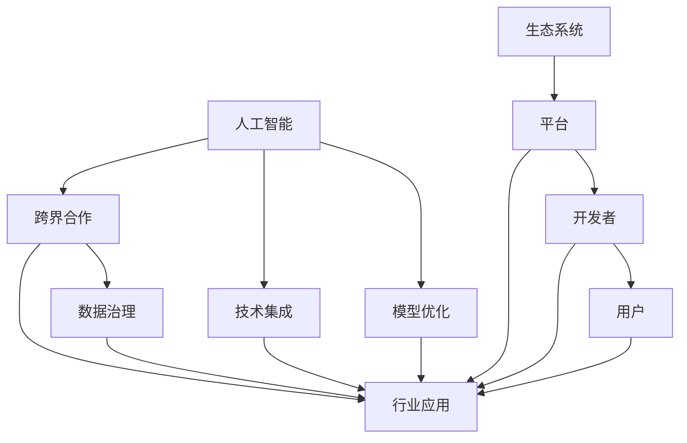

                 

# 跨界合作：Lepton AI的生态系统构建

> 关键词：
    - 人工智能
    - 跨界合作
    - 生态系统
    - 数据治理
    - 行业应用
    - 技术集成
    - 模型优化

## 1. 背景介绍

在人工智能技术的快速发展下，单一的技术平台或解决方案已难以满足日益复杂和多元化的应用需求。Lepton AI正是在这样的背景下应运而生，致力于构建一个开放、协作的人工智能生态系统，推动人工智能在各个行业的应用与发展。本文将介绍Lepton AI的生态系统构建思路、核心技术、跨界合作模式和未来展望。

## 2. 核心概念与联系

### 2.1 核心概念概述

Lepton AI的生态系统构建基于几个核心概念，包括人工智能（AI）、跨界合作、数据治理、行业应用、技术集成和模型优化。这些概念相互关联，共同构成了Lepton AI的生态系统框架。

- **人工智能**：利用机器学习、深度学习等技术，通过数据处理、模型训练、推理等过程，实现智能化的自动化决策、问题解决等。

- **跨界合作**：Lepton AI倡导各行业、各学科领域的专家和组织，共同参与到AI技术研发、应用推广等各个环节中，形成广泛的合作关系。

- **数据治理**：建立标准化的数据治理机制，确保数据的质量、安全、隐私等方面，为AI模型的训练和应用提供坚实的数据基础。

- **行业应用**：将AI技术应用于医疗、金融、教育、智能制造等具体行业，解决实际问题，提升业务效率和用户体验。

- **技术集成**：将AI技术与现有的IT系统、业务流程进行深度集成，实现无缝对接，避免技术孤岛。

- **模型优化**：不断改进和优化AI模型，提升其性能、准确性和泛化能力，满足不同应用场景的需求。

### 2.2 核心概念原理和架构的 Mermaid 流程图



这个流程图展示了Lepton AI生态系统的核心组件及其相互关系。人工智能是生态系统的核心驱动力，跨界合作、数据治理、行业应用、技术集成和模型优化共同构成生态系统的支持体系，通过平台将AI技术转化为实际应用，最终服务于开发者和用户。

## 3. 核心算法原理 & 具体操作步骤

### 3.1 算法原理概述

Lepton AI生态系统的构建遵循一系列算法原理，包括但不限于以下方面：

- **分布式训练**：通过分布式计算技术，在大规模数据集上进行高效、快速的模型训练，提升模型性能。
- **自适应学习**：根据数据分布和应用场景的变化，自动调整模型参数，适应不同的应用需求。
- **知识图谱嵌入**：将知识图谱中的实体、关系等结构化信息嵌入到模型中，提升模型的领域知识水平。
- **联邦学习**：多方的数据在本地训练模型，并通过加密的方式共享模型参数，保护数据隐私。
- **元学习**：学习如何学习，通过泛化适应不同领域的新任务，提高模型泛化能力。

### 3.2 算法步骤详解

Lepton AI生态系统的构建主要包括以下几个关键步骤：

1. **需求分析**：与目标行业和领域专家进行深入交流，明确需求和目标。
2. **数据准备**：收集、清洗、标注数据，确保数据质量。
3. **模型选择**：根据需求选择合适的AI模型，如卷积神经网络（CNN）、循环神经网络（RNN）、Transformer等。
4. **模型训练**：利用分布式训练和自适应学习等技术，在数据集上进行模型训练。
5. **知识图谱嵌入**：将行业知识图谱嵌入到模型中，提升模型领域知识水平。
6. **模型评估**：在验证集上评估模型性能，调整模型参数。
7. **集成部署**：将模型集成到目标应用系统中，进行部署和测试。
8. **持续优化**：根据反馈和新的数据，不断优化模型，提升性能。

### 3.3 算法优缺点

#### 优点：

1. **高效协作**：跨界合作模式使得Lepton AI能够聚集各行业的专家和组织，形成高效的技术合作。
2. **数据治理**：通过标准化的数据治理机制，确保数据质量和安全性，为模型训练提供坚实基础。
3. **技术集成**：将AI技术与现有IT系统深度集成，实现无缝对接，避免技术孤岛。
4. **模型优化**：不断改进和优化AI模型，提升其性能和泛化能力，满足不同应用场景的需求。

#### 缺点：

1. **数据隐私**：跨界合作涉及大量敏感数据，需要严格的数据隐私保护措施。
2. **成本高**：大规模数据集和分布式训练需要高昂的计算资源和成本。
3. **复杂度**：涉及多个行业和技术的集成，可能导致系统复杂度增加。

### 3.4 算法应用领域

Lepton AI生态系统的构建适用于多个领域，包括但不限于：

- **医疗健康**：利用AI技术进行疾病预测、诊断、治疗方案推荐等。
- **金融服务**：进行信用评估、风险管理、客户行为分析等。
- **教育培训**：提供个性化学习推荐、智能辅导等。
- **智能制造**：实现设备维护、质量控制、供应链优化等。
- **智能交通**：进行交通流量预测、智能调度、安全监控等。

## 4. 数学模型和公式 & 详细讲解 & 举例说明

### 4.1 数学模型构建

Lepton AI生态系统中的数学模型构建主要基于以下几个数学框架：

- **机器学习**：利用监督学习、无监督学习、半监督学习等算法，进行模型训练。
- **深度学习**：使用卷积神经网络（CNN）、循环神经网络（RNN）、Transformer等架构，进行特征提取和模式识别。
- **自然语言处理（NLP）**：使用BERT、GPT等模型，进行文本处理和语义分析。
- **图像处理**：使用CNN等模型，进行图像分类、目标检测等任务。

### 4.2 公式推导过程

以深度学习中的卷积神经网络（CNN）为例，其基本结构包括卷积层、池化层、全连接层等。公式推导如下：

$$
y = W^TX + b
$$

其中，$X$ 为输入特征，$W$ 为权重矩阵，$b$ 为偏置向量，$y$ 为输出结果。

在卷积层中，使用卷积核对输入特征进行卷积操作，公式如下：

$$
y = \sum_i \sum_j W_{i,j} * X_{i,j}
$$

其中，$W$ 为卷积核，$X$ 为输入特征，$y$ 为卷积输出。

### 4.3 案例分析与讲解

以医疗健康领域为例，Lepton AI利用AI技术进行疾病预测和诊断。首先，收集和清洗患者的历史医疗数据，包括病历、检查结果、治疗记录等。然后，选择合适的卷积神经网络（CNN）模型，对图像和文本数据进行处理和分析。在模型训练过程中，利用分布式训练和自适应学习等技术，不断优化模型参数，提高预测准确性。最后，将训练好的模型集成到医疗系统中，进行疾病预测和诊断。

## 5. 项目实践：代码实例和详细解释说明

### 5.1 开发环境搭建

Lepton AI生态系统的开发环境搭建主要包括以下几个步骤：

1. **选择合适的编程语言和框架**：如Python、PyTorch、TensorFlow等。
2. **安装必要的软件包**：如NumPy、Pandas、scikit-learn等。
3. **配置分布式计算环境**：如Spark、Hadoop等。
4. **部署模型和应用系统**：如Docker、Kubernetes等。

### 5.2 源代码详细实现

以下是一个简单的代码示例，展示了如何使用Python和TensorFlow进行卷积神经网络（CNN）的模型训练：

```python
import tensorflow as tf
from tensorflow.keras import layers

# 定义CNN模型
model = tf.keras.Sequential([
    layers.Conv2D(32, (3, 3), activation='relu', input_shape=(32, 32, 3)),
    layers.MaxPooling2D((2, 2)),
    layers.Conv2D(64, (3, 3), activation='relu'),
    layers.MaxPooling2D((2, 2)),
    layers.Conv2D(128, (3, 3), activation='relu'),
    layers.MaxPooling2D((2, 2)),
    layers.Flatten(),
    layers.Dense(128, activation='relu'),
    layers.Dense(10, activation='softmax')
])

# 编译模型
model.compile(optimizer='adam', loss='sparse_categorical_crossentropy', metrics=['accuracy'])

# 训练模型
model.fit(train_images, train_labels, epochs=10, validation_data=(test_images, test_labels))
```

### 5.3 代码解读与分析

以上代码实现了简单的卷积神经网络（CNN）模型训练。代码首先定义了CNN的各层结构，包括卷积层、池化层、全连接层等。然后，使用`compile`方法编译模型，指定优化器、损失函数和评估指标。最后，使用`fit`方法训练模型，指定训练数据、标签、训练轮数和验证数据。

## 6. 实际应用场景

### 6.4 未来应用展望

Lepton AI生态系统在未来具有广阔的应用前景。随着AI技术的不断进步，Lepton AI将进一步拓展其应用范围，推动各行业的数字化转型。以下是几个具体的未来应用场景：

1. **智能城市**：利用AI技术进行交通流量预测、智能调度、安全监控等，提升城市治理效率。
2. **智能制造**：实现设备维护、质量控制、供应链优化等，推动制造业的智能化升级。
3. **智能医疗**：进行疾病预测、诊断、治疗方案推荐等，提升医疗服务质量。
4. **金融科技**：进行信用评估、风险管理、客户行为分析等，推动金融行业的数字化转型。
5. **教育培训**：提供个性化学习推荐、智能辅导等，提升教育质量。

## 7. 工具和资源推荐

### 7.1 学习资源推荐

1. **Lepton AI官方文档**：Lepton AI的官方文档提供了丰富的学习资源，包括模型训练、数据治理、技术集成等方面的内容。
2. **在线课程**：如Coursera、Udacity等平台的AI相关课程，涵盖机器学习、深度学习、自然语言处理等领域。
3. **书籍**：如《深度学习》、《机器学习实战》等经典书籍，提供系统的理论知识和实践指导。
4. **技术博客**：如Medium、TechCrunch等平台的AI技术博客，分享最新的研究进展和应用案例。

### 7.2 开发工具推荐

1. **Python**：Python是目前最流行的AI编程语言，拥有丰富的科学计算和机器学习库。
2. **PyTorch**：基于Python的深度学习框架，支持动态计算图和高效的模型训练。
3. **TensorFlow**：由Google开发的深度学习框架，支持分布式训练和高效的模型推理。
4. **Jupyter Notebook**：交互式的编程环境，方便代码调试和可视化。
5. **Keras**：高层次的深度学习框架，简化模型的构建和训练过程。

### 7.3 相关论文推荐

1. **《分布式深度学习》**：探讨分布式计算技术在深度学习中的应用。
2. **《数据治理》**：介绍数据质量管理、数据隐私保护等数据治理技术。
3. **《跨界合作》**：探讨跨界合作模式在AI技术发展中的重要作用。
4. **《人工智能的伦理与安全》**：探讨人工智能技术的伦理和安全问题，提出相应的解决方案。

## 8. 总结：未来发展趋势与挑战

### 8.1 研究成果总结

Lepton AI的生态系统构建已经取得了显著的进展，推动了AI技术在各个行业的应用与发展。在数据治理、跨界合作、技术集成和模型优化等方面，Lepton AI提供了丰富的经验和解决方案。

### 8.2 未来发展趋势

1. **技术融合**：AI技术与其他技术的深度融合，如区块链、物联网、5G等，将进一步拓展AI应用场景。
2. **边缘计算**：边缘计算技术的引入，使得AI模型在分布式、低延迟环境中发挥更大作用。
3. **量子计算**：量子计算技术的发展，有望大幅提升AI模型的计算效率和能力。
4. **可解释性AI**：通过可解释性AI技术，提高AI模型的透明度和可信度，提升用户接受度。
5. **联邦学习**：联邦学习技术的应用，保护数据隐私，促进跨界合作。

### 8.3 面临的挑战

1. **数据隐私**：跨界合作中涉及大量敏感数据，需要严格的数据隐私保护措施。
2. **计算资源**：大规模数据集和分布式训练需要高昂的计算资源和成本。
3. **模型泛化**：AI模型在不同领域和场景中的泛化能力仍需进一步提升。
4. **伦理与安全**：AI技术的伦理和安全问题仍需进一步研究，确保技术的良性发展。

### 8.4 研究展望

未来，Lepton AI将继续在数据治理、跨界合作、技术集成和模型优化等方面进行深入研究，推动AI技术的不断发展和进步。同时，Lepton AI将积极探索新技术、新应用，为各个行业的数字化转型提供有力支持。

## 9. 附录：常见问题与解答

**Q1: 如何选择合适的AI模型？**

A: 选择合适的AI模型需要考虑数据类型、任务需求、计算资源等因素。如文本处理任务适合使用Transformer模型，图像处理任务适合使用CNN模型。

**Q2: 如何进行数据预处理？**

A: 数据预处理包括数据清洗、特征提取、数据增强等步骤。使用Pandas、NumPy等工具进行数据处理，确保数据质量。

**Q3: 如何优化模型性能？**

A: 优化模型性能的方法包括调整模型结构、选择优化器、调整超参数等。使用模型训练过程中的验证集和测试集进行模型评估和优化。

**Q4: 如何进行模型集成？**

A: 模型集成是将多个模型组合起来，提高整体性能。可以使用模型投票、模型堆叠等方法进行集成。

**Q5: 如何保护数据隐私？**

A: 保护数据隐私的方法包括数据加密、差分隐私、联邦学习等。确保数据在传输和存储过程中的安全性。

---

作者：禅与计算机程序设计艺术 / Zen and the Art of Computer Programming

