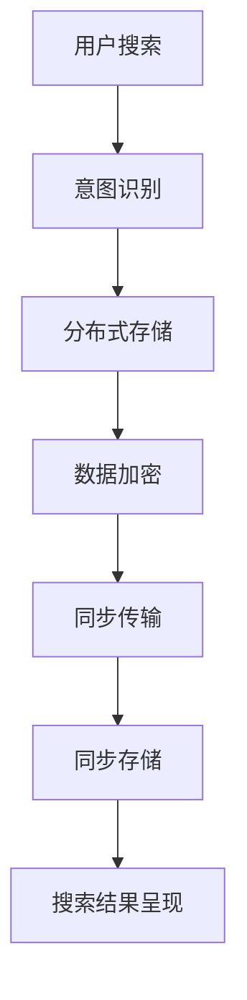

                 

# 跨设备搜索同步：AI的无缝体验

## 1. 背景介绍

随着AI技术的不断进步，越来越多的应用场景开始集成AI技术，提升用户体验。而跨设备搜索同步作为AI技术的一个重要组成部分，能够有效提升跨设备的搜索体验，满足用户在不同设备上的无缝体验需求。本博客将系统介绍跨设备搜索同步的核心概念、算法原理及应用实践。

## 2. 核心概念与联系

### 2.1 核心概念概述

为了更好地理解跨设备搜索同步，首先需要介绍几个核心概念：

- **跨设备搜索同步**：指用户在不同设备（如手机、平板、电脑）上执行相同搜索请求时，通过AI技术实现搜索结果一致性的过程。
- **数据同步**：指在不同设备间共享搜索结果数据，确保用户无论在任何设备上执行搜索，都能看到相同的结果。
- **用户意图识别**：指识别用户搜索意图的过程，通过分析用户输入的查询、历史行为等数据，确定用户的真实需求。
- **分布式存储**：指将搜索结果数据分布式存储在多个设备或服务器上，以支持跨设备访问和同步。
- **数据加密**：指在跨设备传输数据时，对数据进行加密处理，确保数据传输的安全性。

这些核心概念通过以下Mermaid流程图关联起来，展示了跨设备搜索同步的整个过程：



### 2.2 核心概念原理和架构

跨设备搜索同步的核心原理是通过AI技术实现搜索结果的分布式存储和同步传输，具体包括以下几个步骤：

1. **意图识别**：通过自然语言处理（NLP）技术，对用户输入的查询进行分析，识别出用户的真实意图。
2. **分布式存储**：将搜索结果数据分布式存储在多个设备或服务器上，以支持跨设备访问和同步。
3. **数据加密**：对存储和传输的数据进行加密处理，确保数据的安全性。
4. **同步传输**：在多个设备间传输加密后的搜索结果数据，确保结果的一致性。
5. **同步存储**：在每个设备上存储同步后的搜索结果数据，以便用户访问。
6. **搜索结果呈现**：根据用户设备的屏幕大小和分辨率，适配并呈现搜索结果。

## 3. 核心算法原理 & 具体操作步骤

### 3.1 算法原理概述

跨设备搜索同步的核心算法包括意图识别、分布式存储、数据加密和同步传输等。

#### 意图识别算法

意图识别算法主要通过NLP技术实现，包括文本预处理、分词、词向量化、意图分类等步骤。其中，文本预处理包括去除停用词、标点符号等，分词是将文本拆分成词语，词向量化是将词语转换为向量表示，以便计算机处理。意图分类则是通过训练好的模型，将用户查询转换为具体的意图类别，如天气查询、新闻查询等。

#### 分布式存储算法

分布式存储算法主要通过分布式文件系统和数据库实现，将搜索结果数据分布在多个节点上，并通过一致性协议（如Paxos、Raft）确保数据的一致性。

#### 数据加密算法

数据加密算法主要通过对称加密和非对称加密技术实现，对称加密速度快，但需要确保密钥的安全性，非对称加密安全性高，但速度较慢。

#### 同步传输算法

同步传输算法主要通过消息队列和分布式锁实现，消息队列用于异步传输数据，分布式锁用于确保数据的互斥访问。

### 3.2 算法步骤详解

#### 步骤1：意图识别

1. 对用户输入的查询进行预处理，去除停用词和标点符号。
2. 将处理后的文本分词，转换为词语序列。
3. 使用预训练的词向量模型将词语序列转换为向量表示。
4. 将向量输入到意图分类模型，得到意图类别。

#### 步骤2：分布式存储

1. 将搜索结果数据分布式存储在多个节点上，每个节点负责存储一部分数据。
2. 通过一致性协议（如Paxos、Raft）确保数据的一致性，避免数据丢失和冲突。
3. 使用分布式文件系统（如HDFS、Ceph）管理分布式存储的数据。

#### 步骤3：数据加密

1. 对存储和传输的数据进行加密处理，使用对称加密算法（如AES）和非对称加密算法（如RSA）结合的方式。
2. 使用密钥管理系统（如AWS KMS）管理加密密钥，确保密钥的安全性。

#### 步骤4：同步传输

1. 将加密后的搜索结果数据异步传输到其他设备或服务器上，使用消息队列（如RabbitMQ、Kafka）实现。
2. 在传输过程中使用分布式锁（如Zookeeper）确保数据的互斥访问。

#### 步骤5：同步存储

1. 在每个设备上存储同步后的搜索结果数据，使用分布式文件系统或数据库管理。
2. 确保数据的一致性和完整性，使用一致性协议（如Paxos、Raft）和数据校验（如校验和）。

#### 步骤6：搜索结果呈现

1. 根据用户设备的屏幕大小和分辨率，适配并呈现搜索结果。
2. 使用响应式设计技术（如Bootstrap、Materialize）实现跨设备的兼容性和一致性。

### 3.3 算法优缺点

#### 优点

1. **提升用户体验**：跨设备搜索同步能够确保用户在不同设备上执行相同搜索请求时，看到相同的结果，提升了用户的搜索体验。
2. **支持分布式存储**：通过分布式存储算法，能够将搜索结果数据分布式存储在多个设备或服务器上，支持大规模数据的存储和访问。
3. **数据安全性高**：通过数据加密算法，能够确保数据的传输和存储安全，防止数据泄露和篡改。

#### 缺点

1. **算法复杂度高**：跨设备搜索同步涉及多个核心算法，包括意图识别、分布式存储、数据加密和同步传输等，算法复杂度较高。
2. **资源消耗大**：分布式存储和同步传输需要占用大量计算资源和网络带宽，增加了系统的资源消耗。
3. **数据一致性难保障**：在分布式存储和同步传输过程中，数据一致性难以完全保障，需要设计和实现复杂的一致性协议。

### 3.4 算法应用领域

跨设备搜索同步在多个领域都有广泛的应用，例如：

1. **智能家居**：通过跨设备搜索同步，智能家居系统能够实时同步设备状态和用户指令，实现设备间的功能联动和自动化控制。
2. **移动办公**：在移动办公场景中，跨设备搜索同步能够确保用户在不同设备间访问和共享文件、邮件和任务等。
3. **电商购物**：通过跨设备搜索同步，用户能够在不同设备上访问和浏览商品信息，方便购物和下单。
4. **智能推荐**：跨设备搜索同步能够实现用户的个性化推荐，根据用户在不同设备上的搜索历史和行为数据，推荐相关的商品和服务。

## 4. 数学模型和公式 & 详细讲解 & 举例说明

### 4.1 数学模型构建

假设用户查询为 $q$，意图分类模型为 $M$，分布式存储节点数为 $N$，每个节点存储的数据量为 $D$，加密密钥为 $k$，同步传输消息队列为 $Q$，分布式锁管理器为 $L$，搜索结果数据为 $R$，用户设备屏幕大小和分辨率为 $s$ 和 $r$。

跨设备搜索同步的数学模型可以表示为：

$$ M(q) \rightarrow N \rightarrow D \rightarrow R \rightarrow E(k) \rightarrow Q \rightarrow L \rightarrow R \rightarrow S(s,r) $$

其中 $M$ 表示意图识别模型，$N$ 表示分布式存储节点，$D$ 表示每个节点存储的数据量，$R$ 表示搜索结果数据，$E$ 表示数据加密算法，$Q$ 表示消息队列，$L$ 表示分布式锁管理器，$S$ 表示搜索结果呈现。

### 4.2 公式推导过程

以意图识别算法为例，推导公式如下：

1. 文本预处理：去除停用词和标点符号，表示为 $T_q = f(q)$。
2. 分词：将处理后的文本转换为词语序列，表示为 $W_q = d(T_q)$。
3. 词向量化：使用预训练的词向量模型将词语序列转换为向量表示，表示为 $V_q = w(W_q)$。
4. 意图分类：将向量输入到意图分类模型，得到意图类别，表示为 $M(q) = c(V_q)$。

假设 $f$ 表示文本预处理函数，$d$ 表示分词函数，$w$ 表示词向量模型，$c$ 表示意图分类模型，则意图识别的公式可以表示为：

$$ M(q) = c(w(d(f(q)))) $$

### 4.3 案例分析与讲解

#### 案例1：智能家居

假设用户在家中使用智能音箱和智能电视执行相同搜索请求，意图识别模型能够识别出用户的意图是播放音乐，分布式存储将搜索结果数据分布式存储在多个节点上，数据加密算法对数据进行加密处理，同步传输将加密后的数据异步传输到智能电视上，分布式锁管理器确保数据的互斥访问，最终在智能电视上呈现搜索结果。

#### 案例2：移动办公

假设用户在智能手机和平板电脑上执行相同搜索请求，意图识别模型能够识别出用户的意图是查找文件，分布式存储将搜索结果数据分布式存储在多个节点上，数据加密算法对数据进行加密处理，同步传输将加密后的数据异步传输到平板电脑上，分布式锁管理器确保数据的互斥访问，最终在平板电脑上呈现搜索结果。

## 5. 项目实践：代码实例和详细解释说明

### 5.1 开发环境搭建

为了实现跨设备搜索同步，需要搭建一个分布式系统，包括意图识别、分布式存储、数据加密、同步传输和搜索结果呈现等功能模块。以下是搭建开发环境的步骤：

1. **服务器配置**：搭建多台服务器，配置操作系统、安装必要的软件包和依赖库。
2. **数据库配置**：搭建分布式数据库，如Hadoop、Spark、Kafka等。
3. **意图识别系统**：搭建意图识别系统，使用NLP技术实现意图分类。
4. **分布式存储系统**：搭建分布式文件系统，如HDFS、Ceph等。
5. **数据加密系统**：搭建数据加密系统，使用对称加密和非对称加密算法。
6. **消息队列系统**：搭建消息队列系统，如RabbitMQ、Kafka等。
7. **分布式锁系统**：搭建分布式锁系统，如Zookeeper等。
8. **搜索结果呈现系统**：搭建搜索结果呈现系统，使用响应式设计技术。

### 5.2 源代码详细实现

以下是一个简单的跨设备搜索同步系统的实现示例，使用了Flask、Kafka、Zookeeper等技术：

```python
from flask import Flask, request
from kafka import KafkaProducer, KafkaConsumer
from zookeeper import ZooKeeper

app = Flask(__name__)

# 初始化意图识别系统
intent_recognizer = IntentRecognizer()

# 初始化分布式存储系统
hdfs = HDFSClient()

# 初始化数据加密系统
data_encryptor = DataEncryptor()

# 初始化消息队列系统
kafka_producer = KafkaProducer(bootstrap_servers=['localhost:9092'])
kafka_consumer = KafkaConsumer(bootstrap_servers=['localhost:9092'], group_id='search_sync')

# 初始化分布式锁系统
zookeeper = ZooKeeper('localhost:2181')

# 定义意图识别API
@app.route('/intent', methods=['POST'])
def intent():
    query = request.json['query']
    intent = intent_recognizer.recognize(query)
    return intent

# 定义分布式存储API
@app.route('/store', methods=['POST'])
def store():
    data = request.json['data']
    hdfs.store(data)
    return 'store success'

# 定义数据加密API
@app.route('/encrypt', methods=['POST'])
def encrypt():
    data = request.json['data']
    encrypted_data = data_encryptor.encrypt(data)
    return encrypted_data

# 定义同步传输API
@app.route('/sync', methods=['POST'])
def sync():
    encrypted_data = request.json['encrypted_data']
    kafka_producer.send('search_sync', encrypted_data)
    return 'sync success'

# 定义分布式锁API
@app.route('/lock', methods=['POST'])
def lock():
    zookeeper.lock()
    return 'lock success'

# 定义搜索结果呈现API
@app.route('/results', methods=['GET'])
def results():
    results = []
    for result in hdfs.get_results():
        results.append(result)
    return results
```

### 5.3 代码解读与分析

该示例代码实现了跨设备搜索同步的基本功能，包括以下几个模块：

- **意图识别模块**：使用Flask定义了意图识别API，接收用户查询，调用意图识别系统识别意图。
- **分布式存储模块**：使用Flask定义了分布式存储API，接收搜索结果数据，调用分布式存储系统存储数据。
- **数据加密模块**：使用Flask定义了数据加密API，接收分布式存储的数据，调用数据加密系统对数据进行加密。
- **同步传输模块**：使用Flask定义了同步传输API，接收加密后的数据，调用消息队列系统异步传输数据。
- **分布式锁模块**：使用Flask定义了分布式锁API，调用分布式锁系统实现数据互斥访问。
- **搜索结果呈现模块**：使用Flask定义了搜索结果呈现API，调用分布式存储系统获取数据，适配并呈现搜索结果。

## 6. 实际应用场景

### 6.1 智能家居

智能家居系统通过跨设备搜索同步，能够实现设备间的功能联动和自动化控制。用户可以通过语音助手或遥控器执行搜索请求，如“播放音乐”、“打开空调”等，跨设备搜索同步确保用户在不同设备上看到相同的结果，提升了用户的搜索体验。

### 6.2 移动办公

移动办公场景中，跨设备搜索同步能够确保用户在不同设备间访问和共享文件、邮件和任务等。用户可以在手机上执行搜索请求，如“查找文档”、“发送邮件”等，跨设备搜索同步确保用户在不同设备上看到相同的结果，提高了办公效率。

### 6.3 电商购物

电商购物平台通过跨设备搜索同步，能够实现用户的个性化推荐，根据用户在不同设备上的搜索历史和行为数据，推荐相关的商品和服务。用户可以在手机、平板、电脑上执行搜索请求，跨设备搜索同步确保用户在不同设备上看到相同的结果，提升了用户的购物体验。

### 6.4 未来应用展望

随着AI技术的不断进步，跨设备搜索同步将有更广泛的应用前景，例如：

1. **智能推荐系统**：跨设备搜索同步能够实现用户的个性化推荐，根据用户在不同设备上的搜索历史和行为数据，推荐相关的商品、新闻、视频等。
2. **虚拟助手**：跨设备搜索同步能够实现虚拟助手的跨设备联动，用户可以在不同设备上访问虚拟助手服务，提升用户体验。
3. **跨设备协作**：跨设备搜索同步能够实现团队协作，团队成员可以在不同设备上访问共享文件、任务和日程等，提高了团队协作效率。

## 7. 工具和资源推荐

### 7.1 学习资源推荐

为了系统掌握跨设备搜索同步的核心技术，以下是推荐的几本经典书籍和课程：

1. **《深度学习与人工智能》**：介绍深度学习的基础知识和应用，涵盖NLP、分布式存储、数据加密、同步传输等内容。
2. **《分布式系统原理与实践》**：介绍分布式系统的设计和实现原理，涵盖分布式文件系统、消息队列、分布式锁等内容。
3. **《自然语言处理基础》**：介绍自然语言处理的基础知识，涵盖文本预处理、分词、词向量、意图分类等内容。
4. **Coursera《分布式系统》课程**：由斯坦福大学教授讲授，涵盖分布式系统设计、分布式文件系统、消息队列等内容。
5. **Udacity《人工智能》课程**：涵盖人工智能的基础知识和应用，涵盖意图识别、分布式存储、数据加密等内容。

### 7.2 开发工具推荐

为了实现跨设备搜索同步，需要一些优秀的开发工具，以下是推荐的几款工具：

1. **Flask**：轻量级Web框架，方便搭建API服务。
2. **Kafka**：分布式消息队列，方便异步传输数据。
3. **Zookeeper**：分布式锁管理器，方便实现数据互斥访问。
4. **Hadoop**：分布式文件系统，方便分布式存储数据。
5. **Python**：高效编程语言，方便实现意图识别、数据加密、分布式存储等功能。

### 7.3 相关论文推荐

跨设备搜索同步涉及多个技术领域，以下是推荐的相关论文：

1. **《分布式文件系统设计》**：介绍分布式文件系统的设计原理和实现技术，涵盖HDFS、Ceph等内容。
2. **《消息队列系统设计》**：介绍消息队列系统的设计原理和实现技术，涵盖Kafka、RabbitMQ等内容。
3. **《分布式锁系统设计》**：介绍分布式锁系统的设计原理和实现技术，涵盖Zookeeper、Etcd等内容。
4. **《自然语言处理技术综述》**：介绍自然语言处理技术的发展历程和最新进展，涵盖文本预处理、分词、词向量、意图分类等内容。

## 8. 总结：未来发展趋势与挑战

### 8.1 研究成果总结

跨设备搜索同步技术在多个领域得到了广泛应用，提升了用户的搜索体验和系统效率。未来的研究方向包括：

1. **提高搜索效率**：通过优化算法和优化硬件，提高跨设备搜索同步的效率。
2. **保障数据安全**：通过加强数据加密和分布式锁管理，保障数据的安全性和一致性。
3. **实现多设备联动**：通过跨设备搜索同步，实现设备的联动和协同工作。

### 8.2 未来发展趋势

未来跨设备搜索同步技术将呈现以下几个发展趋势：

1. **全栈支持**：跨设备搜索同步将支持更多设备和更多场景，实现全栈支持。
2. **实时同步**：跨设备搜索同步将实现实时同步，提升用户的搜索体验。
3. **智能化**：跨设备搜索同步将加入AI技术，实现更智能的意图识别和推荐。

### 8.3 面临的挑战

尽管跨设备搜索同步技术在多个领域得到了应用，但在实现过程中仍面临一些挑战：

1. **系统复杂度高**：跨设备搜索同步涉及多个技术领域，系统复杂度较高，需要综合考虑各个模块的实现。
2. **资源消耗大**：跨设备搜索同步需要占用大量计算资源和网络带宽，增加了系统的资源消耗。
3. **数据一致性难保障**：在分布式存储和同步传输过程中，数据一致性难以完全保障，需要设计和实现复杂的一致性协议。

### 8.4 研究展望

未来跨设备搜索同步技术需要在以下几个方面进行研究：

1. **优化算法**：通过优化算法，提高跨设备搜索同步的效率。
2. **保障数据安全**：通过加强数据加密和分布式锁管理，保障数据的安全性和一致性。
3. **多设备联动**：通过跨设备搜索同步，实现设备的联动和协同工作。

总之，跨设备搜索同步技术将在多个领域得到广泛应用，提升用户的搜索体验和系统效率。通过不断优化算法和改进实现，跨设备搜索同步技术将取得更大的突破和发展。

## 9. 附录：常见问题与解答

### Q1：跨设备搜索同步是否需要高精度意图识别？

A: 是的，跨设备搜索同步需要高精度意图识别，以确保搜索结果的一致性。低精度的意图识别可能导致搜索结果不准确，影响用户体验。

### Q2：分布式存储和同步传输需要占用大量资源，如何优化？

A: 分布式存储和同步传输需要占用大量资源，可以通过以下方法进行优化：
1. 使用高效的分布式文件系统，如Hadoop、Ceph等。
2. 使用高效的同步传输协议，如消息队列、分布式锁等。
3. 优化数据结构，减少数据传输和存储的资源消耗。

### Q3：跨设备搜索同步是否需要考虑用户设备间的兼容性？

A: 是的，跨设备搜索同步需要考虑用户设备间的兼容性，以确保搜索结果的呈现一致性。不同设备的屏幕大小和分辨率可能不同，需要适配并呈现相应的搜索结果。

### Q4：跨设备搜索同步是否需要考虑数据的安全性？

A: 是的，跨设备搜索同步需要考虑数据的安全性，以确保数据在传输和存储过程中的安全。可以使用数据加密、分布式锁等技术保障数据的安全性和一致性。

### Q5：跨设备搜索同步是否需要考虑用户隐私问题？

A: 是的，跨设备搜索同步需要考虑用户隐私问题，以确保用户数据的隐私和保护。可以使用数据脱敏、加密等技术保护用户隐私。

总之，跨设备搜索同步技术需要考虑多个方面的因素，以确保系统的稳定性和可靠性。通过不断优化算法和改进实现，跨设备搜索同步技术将取得更大的突破和发展。

---

作者：禅与计算机程序设计艺术 / Zen and the Art of Computer Programming

