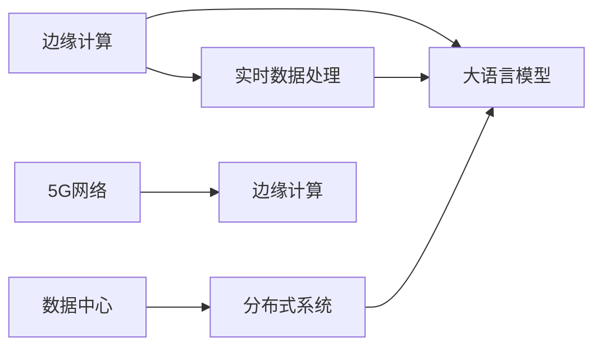

                 

# 边缘计算与 LLM：低延迟、高效率的 AI

> 关键词：边缘计算, 低延迟, 高效率, 人工智能, 大语言模型, 实时数据, 边缘服务器, 5G, IoT

## 1. 背景介绍

### 1.1 问题由来

近年来，人工智能(AI)技术在各行业的应用越来越广泛，包括自动驾驶、医疗诊断、金融风控等。然而，由于AI模型计算量大、存储需求高，在传统集中式计算环境中往往难以满足实时性要求。特别是在智能设备众多、数据分布广泛的应用场景中，中心化的数据处理方式已经难以适应高并发、低延迟的应用需求。边缘计算作为新兴的计算范式，正逐渐成为AI系统优化的重要手段。

大语言模型(Large Language Model, LLM)作为当前AI领域的明星技术，具备强大的自然语言理解和生成能力。但传统的大模型训练和推理过程需要依赖中心化的大型服务器，这不仅在计算资源、带宽消耗等方面带来巨大压力，也难以实现实时交互和本地化推理。因此，如何将大语言模型的强大能力与边缘计算的低延迟、高效处理特点相结合，成为当前AI领域的重要研究方向。

### 1.2 问题核心关键点

边缘计算与大语言模型结合的核心关键点主要包括以下几个方面：

1. **实时性**：通过边缘计算设备在本地完成计算和推理，能够大大缩短数据传输延迟，提升系统的实时性。
2. **计算效率**：边缘计算能够充分利用本地计算资源，避免中心化的高带宽和网络传输开销，提升系统处理效率。
3. **隐私保护**：边缘计算可以将敏感数据留在本地处理，减少了数据传输和存储风险，保护用户隐私。
4. **可扩展性**：边缘计算能够根据实际需求灵活扩展计算资源，适应不同规模的业务需求。

### 1.3 问题研究意义

边缘计算与大语言模型结合的研究具有重要意义：

1. **提升AI系统的实时性**：结合边缘计算的低延迟特点，AI系统能够在本地完成复杂计算和推理，提升实时响应能力。
2. **提高系统处理效率**：通过利用边缘计算的本地计算资源，避免不必要的中心化数据传输，提升整体处理效率。
3. **保护用户隐私**：边缘计算可以将数据本地处理，减少数据传输和存储风险，保护用户隐私安全。
4. **优化网络负载**：将数据处理任务分解到边缘计算节点，可以减轻中心化服务器的计算和存储负担，优化网络负载。
5. **支持复杂应用**：边缘计算与大语言模型的结合，可以支持更多实时性要求高的应用场景，如智能家居、工业控制等。

## 2. 核心概念与联系

### 2.1 核心概念概述

为更好地理解边缘计算与大语言模型结合的原理和架构，本节将介绍几个关键概念：

- **边缘计算(Edge Computing)**：一种分布式计算模式，通过在靠近数据源的本地设备上进行计算和存储，减少数据传输和延迟，提升系统的实时性和效率。
- **大语言模型(Large Language Model, LLM)**：一种基于深度学习技术构建的模型，通过大量文本数据训练，具备强大的自然语言理解和生成能力。
- **实时数据处理(Real-time Data Processing)**：指在数据产生后，实时进行数据采集、存储、处理和传输，以支持实时决策和应用。
- **数据中心(Cloud Data Center)**：集中存放数据和计算资源的服务器集群，能够提供大规模的计算和存储能力。
- **分布式系统(Distributed System)**：由多个节点组成的系统，能够通过网络协同工作，提升系统的可靠性和扩展性。
- **5G网络**：第五代移动通信技术，提供更高的带宽和更低的延迟，支持物联网、车联网等新兴应用。

这些概念之间的逻辑关系可以通过以下Mermaid流程图来展示：



这个流程图展示了边缘计算与大语言模型结合的基本流程：

1. 边缘计算设备获取实时数据。
2. 数据在边缘设备上进行处理和存储。
3. 大语言模型在边缘设备上推理和生成。
4. 数据中心提供分布式计算支持。
5. 5G网络支撑边缘计算的低延迟和高效性。

这些概念共同构成了边缘计算与大语言模型结合的基础框架，使得其在实时性、计算效率、隐私保护等方面发挥巨大优势。

## 3. 核心算法原理 & 具体操作步骤
### 3.1 算法原理概述

边缘计算与大语言模型结合的算法原理，本质上是通过将大语言模型的推理任务分解到边缘设备上，利用边缘计算的低延迟和高效性，实现AI系统的实时处理和本地推理。

假设存在一个本地边缘设备，其上部署了预训练的大语言模型 $M_{\theta}$。对于一个实时输入的文本 $x$，边缘计算的过程包括以下步骤：

1. **数据预处理**：将输入文本 $x$ 进行预处理，如分词、向量嵌入等。
2. **本地推理**：在边缘设备上，利用模型参数 $\theta$ 对预处理后的文本 $x$ 进行推理计算，得到输出结果 $y$。
3. **结果后处理**：根据任务需求，对推理结果 $y$ 进行后处理，如解码、分类等。
4. **数据存储**：将处理结果 $y$ 存储在本地设备中，或通过5G网络发送到云端进行进一步分析。

这个流程展示了边缘计算与大语言模型结合的基本算法原理，即在本地边缘设备上完成计算和推理，减少数据传输和延迟，提升系统的实时性和效率。

### 3.2 算法步骤详解

以下详细描述边缘计算与大语言模型结合的具体操作步骤：

**Step 1: 准备边缘计算环境**

1. 选择合适的边缘计算设备，如物联网设备、工业控制设备等。
2. 安装部署边缘计算平台，如 Amazon AWS Greengrass、Microsoft Azure IoT Edge 等。
3. 配置边缘计算设备的计算资源和网络连接，确保能够支持大语言模型的推理计算。

**Step 2: 选择大语言模型**

1. 选择适合的应用场景的大语言模型，如 BERT、GPT-3、RoBERTa 等。
2. 在边缘计算设备上安装和部署预训练的大语言模型。
3. 根据需要调整模型的参数和超参数，如学习率、批大小等。

**Step 3: 数据预处理和本地推理**

1. 将输入数据进行预处理，转换为模型所需的输入格式，如文本分词、向量嵌入等。
2. 在边缘设备上，使用大语言模型对预处理后的数据进行推理计算。
3. 根据任务需求，对推理结果进行后处理，如解码、分类等。

**Step 4: 结果存储和分发**

1. 将处理结果存储在本地设备中，或通过5G网络发送到云端进行进一步分析。
2. 根据业务需求，将推理结果发送给客户端或其他系统进行处理和应用。

### 3.3 算法优缺点

边缘计算与大语言模型结合的算法具有以下优点：

1. **低延迟**：边缘计算能够将计算和推理任务在本地完成，避免数据传输和网络延迟，提升系统的实时性。
2. **高效性**：利用本地计算资源，避免不必要的中心化数据传输，提升整体处理效率。
3. **隐私保护**：将数据留在本地处理，减少数据传输和存储风险，保护用户隐私。
4. **可扩展性**：根据实际需求灵活扩展计算资源，适应不同规模的业务需求。
5. **支持复杂应用**：支持更多实时性要求高的应用场景，如智能家居、工业控制等。

同时，该方法也存在一些局限性：

1. **计算资源有限**：边缘设备的计算资源有限，可能无法处理过于复杂的推理任务。
2. **数据分布不均**：边缘设备分散，不同设备的数据处理能力可能存在差异。
3. **维护复杂**：边缘计算设备分布广泛，维护和管理难度较大。
4. **网络延迟**：边缘计算设备可能位于网络边缘，网络延迟仍会影响部分实时性要求高的应用。

尽管存在这些局限性，但总体而言，边缘计算与大语言模型结合在实时性、计算效率、隐私保护等方面具有显著优势，能够适应多样化的应用需求。

### 3.4 算法应用领域

边缘计算与大语言模型结合的算法在多个领域具有广泛应用前景：

1. **智能家居**：利用大语言模型和边缘计算，实现智能语音助手、智能家居控制等功能，提升用户体验。
2. **工业控制**：在工业设备上部署大语言模型，实现实时监测、故障诊断、预测维护等功能，提升工业自动化水平。
3. **智能医疗**：利用边缘计算和大语言模型，实现实时语音识别、疾病诊断等功能，提高医疗服务效率和准确性。
4. **车联网**：在车载设备上部署大语言模型，实现语音助手、导航指引等功能，提升驾驶安全性和用户体验。
5. **智能城市**：在城市监控设备上部署大语言模型，实现实时数据分析、安全监控等功能，提升城市管理水平。
6. **智慧农业**：在农业设备上部署大语言模型，实现实时数据监测、农业知识推荐等功能，提升农业生产效率。

## 4. 数学模型和公式 & 详细讲解
### 4.1 数学模型构建

边缘计算与大语言模型结合的数学模型主要涉及大语言模型的推理计算和边缘设备的本地处理。以下以自然语言推理任务为例，描述其数学模型构建过程。

假设输入文本 $x$ 经过分词和向量嵌入后，转换为模型所需的输入张量 $X$。在边缘计算设备上，使用大语言模型 $M_{\theta}$ 对输入 $X$ 进行推理计算，得到输出 $Y$。模型推理过程可以用以下数学公式表示：

$$
Y = M_{\theta}(X)
$$

其中 $Y$ 为模型输出，$\theta$ 为模型参数，$X$ 为输入张量。

### 4.2 公式推导过程

以下对上述数学公式进行详细推导：

1. **向量嵌入**：将输入文本 $x$ 转换为向量嵌入矩阵 $X$，每个词嵌入到一个 $d$ 维向量空间中。
2. **模型推理**：在边缘计算设备上，使用预训练的大语言模型 $M_{\theta}$ 对输入张量 $X$ 进行推理计算。
3. **后处理**：根据任务需求，对模型输出 $Y$ 进行解码、分类等后处理操作，得到最终结果。

### 4.3 案例分析与讲解

以智能家居中的应用为例，说明边缘计算与大语言模型结合的具体过程：

**应用场景**：智能语音助手

**输入**：用户语音指令

**预处理**：
- 将语音指令转换为文本
- 进行分词和向量嵌入

**模型推理**：
- 使用预训练的大语言模型对输入文本进行推理计算
- 得到输出结果，如指令执行结果、自然语言响应等

**后处理**：
- 对输出结果进行解码、分类等操作
- 将结果反馈给用户，完成语音助手的任务

通过上述过程，可以清晰地看到边缘计算与大语言模型结合的具体应用场景和实现流程。

## 5. 项目实践：代码实例和详细解释说明
### 5.1 开发环境搭建

在进行项目实践前，需要准备以下开发环境：

1. **边缘计算设备**：选择适合的边缘计算设备，如物联网设备、工业控制设备等。
2. **边缘计算平台**：选择适合的边缘计算平台，如 Amazon AWS Greengrass、Microsoft Azure IoT Edge 等。
3. **大语言模型**：选择适合的应用场景的大语言模型，如 BERT、GPT-3、RoBERTa 等。
4. **编程语言**：选择适合的编程语言，如 Python、C++ 等。

### 5.2 源代码详细实现

以下是使用 Python 实现边缘计算与大语言模型结合的代码示例：

```python
import torch
from transformers import BertForSequenceClassification, BertTokenizer

# 准备边缘计算设备
device = torch.device('cpu')  # 使用本地 CPU

# 准备大语言模型
model = BertForSequenceClassification.from_pretrained('bert-base-uncased', num_labels=2)
model.to(device)

# 准备数据集
tokenizer = BertTokenizer.from_pretrained('bert-base-uncased')
inputs = tokenizer("Hello, world!", return_tensors="pt").to(device)
labels = torch.tensor([1]).to(device)

# 模型推理
with torch.no_grad():
    outputs = model(**inputs, labels=labels)
    logits = outputs.logits
    probs = torch.softmax(logits, dim=1)

# 结果后处理
predicted_label = torch.argmax(probs, dim=1).item()

# 输出结果
print(f"Predicted label: {predicted_label}")
```

以上代码展示了在本地边缘设备上使用大语言模型进行推理计算的示例，具体步骤如下：

1. **准备边缘计算设备**：在本例中，使用本地 CPU 作为边缘计算设备。
2. **准备大语言模型**：加载预训练的 BERT 模型，并迁移到本地设备上。
3. **准备数据集**：对输入文本进行分词和向量嵌入，转换为模型所需的输入张量。
4. **模型推理**：在本地设备上使用模型进行推理计算，得到输出结果。
5. **结果后处理**：对模型输出进行解码、分类等操作，得到最终结果。
6. **输出结果**：将结果输出到控制台，供进一步处理。

### 5.3 代码解读与分析

代码中的关键部分包括：

- **边缘计算设备**：使用本地 CPU 作为边缘计算设备，避免中心化的网络传输和计算开销。
- **大语言模型**：加载预训练的 BERT 模型，并迁移到本地设备上。
- **数据集准备**：对输入文本进行分词和向量嵌入，转换为模型所需的输入张量。
- **模型推理**：使用模型进行推理计算，得到输出结果。
- **结果后处理**：对模型输出进行解码、分类等操作，得到最终结果。
- **输出结果**：将结果输出到控制台，供进一步处理。

## 6. 实际应用场景
### 6.1 智能家居

智能家居是边缘计算与大语言模型结合的一个重要应用场景。通过在本地设备上部署大语言模型，可以实现智能语音助手、智能家居控制等功能，提升用户体验。

**应用示例**：智能语音助手

**输入**：用户语音指令

**预处理**：
- 将语音指令转换为文本
- 进行分词和向量嵌入

**模型推理**：
- 使用预训练的大语言模型对输入文本进行推理计算
- 得到输出结果，如指令执行结果、自然语言响应等

**后处理**：
- 对输出结果进行解码、分类等操作
- 将结果反馈给用户，完成语音助手的任务

通过以上过程，智能家居系统能够实时响应用户指令，提供语音控制、智能推荐等功能，提升家居设备的智能化水平。

### 6.2 工业控制

在工业设备上部署大语言模型，可以实现实时监测、故障诊断、预测维护等功能，提升工业自动化水平。

**应用示例**：工业设备故障诊断

**输入**：设备传感器数据

**预处理**：
- 对传感器数据进行预处理，转换为模型所需的输入格式
- 进行分词和向量嵌入

**模型推理**：
- 使用预训练的大语言模型对输入数据进行推理计算
- 得到输出结果，如设备状态、故障诊断等

**后处理**：
- 对模型输出进行解码、分类等操作
- 根据输出结果进行设备维护和预警

通过以上过程，工业设备能够实现实时监测和故障诊断，提升设备的稳定性和安全性。

### 6.3 智能医疗

利用边缘计算和大语言模型，实现实时语音识别、疾病诊断等功能，提高医疗服务效率和准确性。

**应用示例**：实时疾病诊断

**输入**：患者语音描述症状

**预处理**：
- 将语音描述转换为文本
- 进行分词和向量嵌入

**模型推理**：
- 使用预训练的大语言模型对输入文本进行推理计算
- 得到输出结果，如疾病诊断、治疗建议等

**后处理**：
- 对输出结果进行解码、分类等操作
- 将结果反馈给医生，辅助诊断和治疗

通过以上过程，智能医疗系统能够实时处理患者语音描述，提供疾病诊断和治疗建议，提升医疗服务的效率和准确性。

### 6.4 车联网

在车载设备上部署大语言模型，实现语音助手、导航指引等功能，提升驾驶安全性和用户体验。

**应用示例**：车载语音助手

**输入**：司机语音指令

**预处理**：
- 将语音指令转换为文本
- 进行分词和向量嵌入

**模型推理**：
- 使用预训练的大语言模型对输入文本进行推理计算
- 得到输出结果，如导航指引、语音反馈等

**后处理**：
- 对输出结果进行解码、分类等操作
- 将结果反馈给司机，辅助驾驶

通过以上过程，车载设备能够实时响应用户指令，提供导航指引、语音反馈等功能，提升驾驶安全性和用户体验。

### 6.5 智能城市

在城市监控设备上部署大语言模型，实现实时数据分析、安全监控等功能，提升城市管理水平。

**应用示例**：智能安防系统

**输入**：视频监控数据

**预处理**：
- 对视频数据进行预处理，转换为模型所需的输入格式
- 进行分词和向量嵌入

**模型推理**：
- 使用预训练的大语言模型对输入数据进行推理计算
- 得到输出结果，如异常检测、目标跟踪等

**后处理**：
- 对模型输出进行解码、分类等操作
- 根据输出结果进行安全预警和处理

通过以上过程，智能安防系统能够实时监测视频数据，提供异常检测、目标跟踪等功能，提升城市安全性和管理水平。

### 6.6 智慧农业

在农业设备上部署大语言模型，实现实时数据监测、农业知识推荐等功能，提升农业生产效率。

**应用示例**：农业知识推荐

**输入**：农业传感器数据

**预处理**：
- 对传感器数据进行预处理，转换为模型所需的输入格式
- 进行分词和向量嵌入

**模型推理**：
- 使用预训练的大语言模型对输入数据进行推理计算
- 得到输出结果，如农业知识推荐、作物生长预测等

**后处理**：
- 对模型输出进行解码、分类等操作
- 将结果反馈给农民，辅助农业生产

通过以上过程，智慧农业系统能够实时监测传感器数据，提供农业知识推荐、作物生长预测等功能，提升农业生产效率和产量。

## 7. 工具和资源推荐
### 7.1 学习资源推荐

为了帮助开发者系统掌握边缘计算与大语言模型结合的理论基础和实践技巧，这里推荐一些优质的学习资源：

1. **《边缘计算技术与应用》**：详细介绍了边缘计算的基本概念、技术架构和应用场景，适合初学者入门。
2. **《深度学习与边缘计算》**：介绍深度学习在边缘计算中的应用，包括模型推理、数据处理等关键技术。
3. **《边缘计算编程实战》**：提供边缘计算的编程实践案例，帮助开发者掌握边缘计算平台和编程技术。
4. **《人工智能与边缘计算》**：结合人工智能和大语言模型，介绍其在边缘计算中的应用和优化方法。
5. **《边缘计算与智能系统》**：探讨边缘计算在智能系统中的应用，包括智能家居、智能医疗、智能城市等。

通过对这些资源的学习实践，相信你一定能够快速掌握边缘计算与大语言模型结合的精髓，并用于解决实际的NLP问题。

### 7.2 开发工具推荐

高效的开发离不开优秀的工具支持。以下是几款用于边缘计算与大语言模型结合开发的常用工具：

1. **AWS Greengrass**：Amazon 提供的边缘计算平台，支持 Python、C++ 等编程语言，适合部署大语言模型。
2. **Azure IoT Edge**：Microsoft 提供的边缘计算平台，支持 C#、Python 等编程语言，适合部署大语言模型。
3. **TensorFlow Lite**：Google 提供的轻量级模型推理框架，支持边缘计算设备上的推理计算。
4. **PyTorch**：基于 Python 的深度学习框架，支持边缘计算设备上的推理计算。
5. **AWS SageMaker**：Amazon 提供的云端机器学习平台，支持边缘计算设备上的模型部署和推理。

合理利用这些工具，可以显著提升边缘计算与大语言模型结合的开发效率，加快创新迭代的步伐。

### 7.3 相关论文推荐

边缘计算与大语言模型结合的研究源于学界的持续研究。以下是几篇奠基性的相关论文，推荐阅读：

1. **Edge Computing: A Computational Model for Smartphone Applications**：提出边缘计算的概念，讨论其基本原理和应用场景。
2. **Edge Computing: A Survey**：综述边缘计算的发展现状和研究方向，涵盖计算架构、网络技术、应用场景等。
3. **Edge Computing for AI Applications**：讨论边缘计算在 AI 中的应用，包括模型推理、数据处理等关键技术。
4. **Large Language Models for Edge Computing**：探讨大语言模型在边缘计算中的应用，包括实时推理、本地存储等。
5. **Edge Computing and IoT**：讨论边缘计算与物联网的结合，包括设备计算、数据管理等。

这些论文代表了大语言模型与边缘计算结合的研究进展，通过学习这些前沿成果，可以帮助研究者把握学科前进方向，激发更多的创新灵感。

## 8. 总结：未来发展趋势与挑战

### 8.1 总结

本文对边缘计算与大语言模型结合的方法进行了全面系统的介绍。首先阐述了边缘计算和大语言模型的基本概念及其结合的优势，明确了结合范式在实时性、计算效率、隐私保护等方面的独特价值。其次，从原理到实践，详细讲解了边缘计算与大语言模型结合的数学模型和算法流程，给出了完整的代码实例和详细解释说明。同时，本文还广泛探讨了结合方法在智能家居、工业控制、智能医疗等多个领域的应用前景，展示了结合范式的广泛应用潜力。

通过本文的系统梳理，可以看到，边缘计算与大语言模型结合的方法在实时性、计算效率、隐私保护等方面具有显著优势，能够适应多样化的应用需求。未来，伴随边缘计算技术的不断演进和大语言模型的持续进步，两者结合的潜力将进一步释放，推动AI系统向更高效、智能、安全的方向发展。

### 8.2 未来发展趋势

展望未来，边缘计算与大语言模型结合的研究将呈现以下几个发展趋势：

1. **技术融合加速**：边缘计算和大语言模型将进一步融合，利用边缘计算的低延迟和高效性，提升大语言模型的实时推理能力。
2. **应用场景扩展**：结合方法将覆盖更多实时性要求高的应用场景，如智能家居、智能医疗、智能城市等。
3. **模型优化提升**：开发更加高效的模型推理算法和计算图优化技术，提升边缘计算设备的处理效率。
4. **数据协同优化**：利用边缘计算的网络优势，实现本地数据与云端数据的协同处理，提升整体系统性能。
5. **安全性和隐私保护**：进一步加强边缘计算与大语言模型结合的安全性和隐私保护措施，确保数据和模型安全。
6. **模型压缩与优化**：开发更小的模型和算法，提升边缘计算设备的推理速度和资源利用效率。

这些趋势凸显了边缘计算与大语言模型结合的广阔前景，技术融合、应用场景扩展、模型优化等方面都将迎来新的突破，推动AI系统向更加高效、智能、安全的方向发展。

### 8.3 面临的挑战

尽管边缘计算与大语言模型结合的研究已经取得了一些进展，但在迈向更加智能化、普适化应用的过程中，仍面临诸多挑战：

1. **计算资源有限**：边缘设备的计算资源有限，可能无法处理过于复杂的推理任务。
2. **数据分布不均**：边缘设备分散，不同设备的数据处理能力可能存在差异。
3. **维护复杂**：边缘计算设备分布广泛，维护和管理难度较大。
4. **网络延迟**：边缘计算设备可能位于网络边缘，网络延迟仍会影响部分实时性要求高的应用。
5. **安全性问题**：边缘计算与大语言模型结合可能面临更多安全风险，如数据泄露、模型攻击等。
6. **隐私保护**：在本地设备上处理数据时，隐私保护措施需要更加严格，以防止敏感数据泄露。

尽管存在这些挑战，但总体而言，边缘计算与大语言模型结合在实时性、计算效率、隐私保护等方面具有显著优势，能够适应多样化的应用需求。未来，需要在技术融合、应用场景扩展、模型优化等方面进行深入研究，解决现有问题，推动技术成熟和应用落地。

### 8.4 研究展望

面对边缘计算与大语言模型结合所面临的种种挑战，未来的研究需要在以下几个方面寻求新的突破：

1. **优化边缘计算平台**：进一步优化边缘计算平台的技术架构和性能，提升边缘设备的计算和存储能力。
2. **开发更小模型**：开发更小的模型和算法，提升边缘计算设备的推理速度和资源利用效率。
3. **强化隐私保护**：在本地设备上处理数据时，加强隐私保护措施，防止敏感数据泄露。
4. **提升模型安全性**：加强模型和算法的安全性设计，防止数据泄露和模型攻击。
5. **融合多模态数据**：将符号化的先验知识与神经网络模型进行融合，提升模型的智能水平和鲁棒性。
6. **引入因果分析**：利用因果分析方法，识别出模型决策的关键特征，增强输出解释的因果性和逻辑性。
7. **集成多种技术**：将边缘计算与大语言模型结合与多种技术进行融合，如知识表示、因果推理、强化学习等，推动AI系统向更高效、智能、安全的方向发展。

这些研究方向的探索，必将引领边缘计算与大语言模型结合技术迈向更高的台阶，为构建安全、可靠、可解释、可控的智能系统铺平道路。面向未来，边缘计算与大语言模型结合技术还需要与其他人工智能技术进行更深入的融合，共同推动自然语言理解和智能交互系统的进步。只有勇于创新、敢于突破，才能不断拓展语言模型的边界，让智能技术更好地造福人类社会。

## 9. 附录：常见问题与解答

**Q1：边缘计算与大语言模型结合的主要优势是什么？**

A: 边缘计算与大语言模型结合的主要优势包括：
1. **低延迟**：在本地设备上进行计算和推理，避免数据传输和网络延迟，提升系统的实时性。
2. **高效性**：利用本地计算资源，避免不必要的中心化数据传输，提升整体处理效率。
3. **隐私保护**：将数据留在本地处理，减少数据传输和存储风险，保护用户隐私。
4. **可扩展性**：根据实际需求灵活扩展计算资源，适应不同规模的业务需求。
5. **支持复杂应用**：支持更多实时性要求高的应用场景，如智能家居、智能医疗、智能城市等。

**Q2：如何选择合适的边缘计算设备？**

A: 选择边缘计算设备时需要考虑以下因素：
1. **计算能力**：边缘设备应具备足够的计算能力，支持大语言模型的推理计算。
2. **存储能力**：边缘设备应具备足够的存储能力，支持模型的参数和数据存储。
3. **网络连接**：边缘设备应具备良好的网络连接能力，支持模型的数据传输和网络通信。
4. **安全性**：边缘设备应具备良好的安全性设计，防止数据泄露和模型攻击。
5. **可扩展性**：边缘设备应具备良好的可扩展性，支持动态扩展计算资源。

**Q3：边缘计算与大语言模型结合的开发流程是怎样的？**

A: 边缘计算与大语言模型结合的开发流程主要包括以下步骤：
1. **准备边缘计算环境**：选择合适的边缘计算设备和平台，配置计算资源和网络连接。
2. **准备大语言模型**：选择适合的应用场景的大语言模型，加载和部署预训练模型。
3. **数据预处理**：对输入数据进行预处理，转换为模型所需的输入格式。
4. **模型推理**：在边缘设备上使用大语言模型进行推理计算，得到输出结果。
5. **结果后处理**：对模型输出进行解码、分类等操作，得到最终结果。
6. **结果存储和分发**：将处理结果存储在本地设备中，或通过5G网络发送到云端进行进一步分析。

**Q4：边缘计算与大语言模型结合的缺点是什么？**

A: 边缘计算与大语言模型结合的缺点主要包括以下几点：
1. **计算资源有限**：边缘设备的计算资源有限，可能无法处理过于复杂的推理任务。
2. **数据分布不均**：边缘设备分散，不同设备的数据处理能力可能存在差异。
3. **维护复杂**：边缘计算设备分布广泛，维护和管理难度较大。
4. **网络延迟**：边缘计算设备可能位于网络边缘，网络延迟仍会影响部分实时性要求高的应用。
5. **安全性问题**：边缘计算与大语言模型结合可能面临更多安全风险，如数据泄露、模型攻击等。
6. **隐私保护**：在本地设备上处理数据时，隐私保护措施需要更加严格，以防止敏感数据泄露。

**Q5：边缘计算与大语言模型结合在实际应用中需要注意哪些问题？**

A: 边缘计算与大语言模型结合在实际应用中需要注意以下问题：
1. **计算资源优化**：需要优化边缘计算设备的计算资源，提升其处理能力。
2. **数据分布均衡**：需要平衡不同边缘设备的数据处理能力，避免数据分布不均。
3. **网络延迟优化**：需要优化边缘计算设备的网络连接，降低网络延迟。
4. **安全性和隐私保护**：需要加强边缘计算设备的安全性和隐私保护措施，防止数据泄露和模型攻击。
5. **模型优化**：需要优化边缘计算设备上的模型推理算法，提升其推理速度和效率。
6. **系统维护**：需要加强边缘计算设备的维护和管理，确保系统的稳定性和可靠性。

**Q6：未来边缘计算与大语言模型结合的发展方向是什么？**

A: 未来边缘计算与大语言模型结合的发展方向主要包括以下几个方面：
1. **技术融合加速**：边缘计算和大语言模型将进一步融合，利用边缘计算的低延迟和高效性，提升大语言模型的实时推理能力。
2. **应用场景扩展**：结合方法将覆盖更多实时性要求高的应用场景，如智能家居、智能医疗、智能城市等。
3. **模型优化提升**：开发更加高效的模型推理算法和计算图优化技术，提升边缘计算设备的处理效率。
4. **数据协同优化**：利用边缘计算的网络优势，实现本地数据与云端数据的协同处理，提升整体系统性能。
5. **安全性和隐私保护**：进一步加强边缘计算与大语言模型结合的安全性和隐私保护措施，确保数据和模型安全。
6. **模型压缩与优化**：开发更小的模型和算法，提升边缘计算设备的推理速度和资源利用效率。

**Q7：如何设计有效的边缘计算与大语言模型结合的系统架构？**

A: 设计有效的边缘计算与大语言模型结合的系统架构主要包括以下步骤：
1. **选择合适的边缘计算设备**：选择具备足够计算和存储能力，支持网络连接和安全性设计的设备。
2. **准备大语言模型**：选择适合应用场景的大语言模型，加载和部署预训练模型。
3. **设计数据流**：设计数据预处理、模型推理和结果后处理的流程，确保数据流的高效和实时性。
4. **优化计算资源**：优化边缘计算设备的计算资源，提升其处理能力。
5. **加强安全性和隐私保护**：加强边缘计算设备的安全性和隐私保护措施，防止数据泄露和模型攻击。
6. **部署和管理**：将系统部署到边缘设备上，并进行有效的管理和维护，确保系统的稳定性和可靠性。

通过以上步骤，可以设计出高效、安全、可靠的边缘计算与大语言模型结合的系统架构，推动AI系统向更加高效、智能、安全的方向发展。

