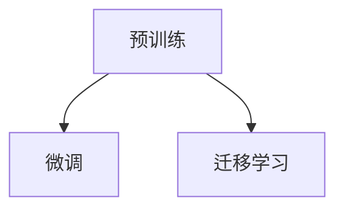

                 

# 迁移学习在NLP中的应用：从预训练到微调

> 关键词：迁移学习, 预训练, 微调, 自然语言处理(NLP), 文本分类, 情感分析, 机器翻译

## 1. 背景介绍

### 1.1 问题由来

自然语言处理（Natural Language Processing，NLP）作为人工智能的一个重要分支，涉及文本数据的处理与分析。传统NLP方法通常依赖于手工设计的特征工程，但随着深度学习技术的发展，基于神经网络的端到端模型逐渐成为主流。其中，迁移学习（Transfer Learning）是一种显著提高模型泛化能力的方法，尤其在大规模预训练模型的应用中，取得了令人瞩目的成果。

本文将重点讨论如何通过预训练和微调技术，提升NLP任务的性能。具体来说，我们将详细阐述预训练和微调的概念与原理，并通过实例说明其在文本分类、情感分析、机器翻译等NLP任务中的应用。

### 1.2 问题核心关键点

预训练和微调技术的核心在于以下两点：
- **预训练**：通过无监督学习任务在大规模语料库上训练模型，使其学习到通用的语言特征和知识。
- **微调**：在预训练模型基础上，通过有监督的微调任务，优化模型在特定任务上的性能。

预训练和微调技术的结合，使得模型能够在少量标注数据上取得显著的性能提升，同时减少了从头训练所需的时间和数据成本。

### 1.3 问题研究意义

预训练和微调技术在NLP领域的应用具有重要意义：
- **提升模型泛化能力**：通过预训练，模型可以学习到语言的基本结构和特征，进而提升在新数据上的泛化能力。
- **降低开发成本**：预训练模型可以作为“起点”，通过微调直接应用于新任务，避免了从头训练的高昂成本。
- **加速任务适配**：微调过程可以快速训练模型，使其适应特定任务，缩短开发周期。
- **促进技术创新**：预训练和微调技术的不断改进，推动了NLP技术的快速发展，催生了诸如自然语言理解、问答系统等新兴技术。
- **拓展应用领域**：NLP技术通过预训练和微调，可以应用于医疗、金融、教育等多个行业，推动这些领域的数字化转型。

## 2. 核心概念与联系

### 2.1 核心概念概述

为了更好地理解预训练和微调技术，我们首先介绍几个核心概念：

- **预训练**：在大规模无标签语料库上，通过自监督学习任务训练神经网络模型，使其学习到语言的基本结构和特征。
- **微调**：在预训练模型基础上，通过有监督的微调任务，优化模型在特定任务上的性能。
- **迁移学习**：将在一个任务上学习到的知识迁移到另一个相关任务上，提升模型在新任务上的泛化能力。

这些概念之间的联系可以借助以下Mermaid流程图来展示：



这个流程图展示了预训练、微调和迁移学习之间的关系：预训练模型可以作为“特征提取器”，通过微调进一步适应特定任务，同时通过迁移学习，可以将预训练模型的知识迁移到新的任务上。

## 3. 核心算法原理 & 具体操作步骤

### 3.1 算法原理概述

预训练和微调技术的核心原理可以概括为以下几点：

- **预训练**：在大规模无标签语料库上，通过自监督学习任务训练神经网络模型，使其学习到语言的基本结构和特征。
- **微调**：在预训练模型基础上，通过有监督的微调任务，优化模型在特定任务上的性能。

以文本分类任务为例，预训练模型首先通过掩码语言模型（Masked Language Modeling, MLM）任务学习语言的基本结构和特征。然后，在微调任务中，将文本分类任务的数据集作为监督信号，进一步训练模型，使其能够准确分类文本。

### 3.2 算法步骤详解

预训练和微调的具体步骤如下：

**Step 1: 准备数据集**
- 收集大规模无标签语料库，如维基百科、新闻等。
- 将语料库划分为训练集和验证集。

**Step 2: 选择预训练模型**
- 选择合适的预训练模型，如BERT、GPT等。
- 加载预训练模型权重。

**Step 3: 添加微调任务**
- 根据微调任务，设计合适的任务适配层，如线性分类器或解码器。
- 设计损失函数，如交叉熵损失。

**Step 4: 设置微调超参数**
- 选择合适的优化器，如AdamW。
- 设置学习率、批大小、迭代轮数等。

**Step 5: 执行微调**
- 使用预训练模型作为初始化参数，在微调任务上训练模型。
- 使用验证集评估模型性能，根据性能调整超参数。

**Step 6: 测试和部署**
- 在测试集上评估微调后模型的性能。
- 将模型部署到实际应用中。

### 3.3 算法优缺点

预训练和微调技术有以下优点：

- **泛化能力强**：预训练模型在大规模语料库上学习到的特征具有很强的泛化能力，能够在新的数据集上取得不错的性能。
- **开发成本低**：预训练模型可以作为起点，通过微调快速适应新任务，减少了从头训练的时间和数据成本。
- **效率高**：微调过程通常需要较少的训练数据和较短的时间，适用于多种NLP任务。

同时，也存在一些缺点：

- **数据依赖**：微调模型的性能高度依赖于标注数据的质量和数量，标注数据的获取和处理成本较高。
- **过拟合风险**：微调过程中，模型可能会过拟合训练数据，导致在新数据上泛化能力下降。
- **模型复杂**：预训练和微调模型通常结构复杂，需要较强的计算资源和存储空间。

### 3.4 算法应用领域

预训练和微调技术广泛应用于以下领域：

- **文本分类**：如情感分析、主题分类、垃圾邮件过滤等。
- **命名实体识别**：识别文本中的人名、地名、机构名等特定实体。
- **关系抽取**：从文本中抽取实体之间的语义关系。
- **问答系统**：对自然语言问题给出答案。
- **机器翻译**：将源语言文本翻译成目标语言。
- **文本摘要**：将长文本压缩成简短摘要。
- **对话系统**：使机器能够与人自然对话。

## 4. 数学模型和公式 & 详细讲解 & 举例说明

### 4.1 数学模型构建

预训练和微调过程通常使用神经网络模型，以下以BERT为例，介绍其数学模型构建。

**BERT模型**：由两部分组成，编码器（Transformer编码器）和池化层。编码器负责将输入文本转换为向量表示，池化层则将向量表示转换为分类或回归等任务所需的输出。

假设输入为 $x$，预训练模型的输出为 $h$，微调任务的目标为 $y$，则损失函数可以表示为：

$$
\mathcal{L} = \frac{1}{N} \sum_{i=1}^N \ell(h_i, y_i)
$$

其中 $\ell$ 为损失函数，$h_i$ 为模型在输入 $x_i$ 上的输出。

### 4.2 公式推导过程

以文本分类任务为例，推导BERT模型的微调公式。

假设预训练模型的输出为 $h$，任务适配层的输出为 $t$，损失函数为交叉熵损失，则微调的公式为：

$$
\mathcal{L} = -\frac{1}{N} \sum_{i=1}^N y_i \log(t_i) + (1 - y_i) \log(1 - t_i)
$$

其中 $y_i$ 为真实标签，$t_i$ 为模型预测输出。

### 4.3 案例分析与讲解

以情感分析任务为例，介绍预训练和微调的具体步骤。

1. **数据准备**：收集包含情感标签的文本数据集，如IMDB电影评论数据集。
2. **预训练模型加载**：加载预训练的BERT模型权重，并将其设置为微调模型的初始参数。
3. **任务适配层设计**：设计一个线性分类器，将BERT的输出转换为情感分类结果。
4. **微调过程**：在带有情感标签的训练数据上，使用交叉熵损失函数进行微调。
5. **性能评估**：在验证集上评估微调后的模型性能，并根据评估结果调整超参数。

## 5. 项目实践：代码实例和详细解释说明

### 5.1 开发环境搭建

以下是在Python环境中使用PyTorch进行BERT微调的具体步骤：

1. 安装Anaconda：从官网下载并安装Anaconda。
2. 创建并激活虚拟环境：
```bash
conda create -n pytorch-env python=3.8 
conda activate pytorch-env
```

3. 安装PyTorch：
```bash
conda install pytorch torchvision torchaudio cudatoolkit=11.1 -c pytorch -c conda-forge
```

4. 安装Transformers库：
```bash
pip install transformers
```

5. 安装各类工具包：
```bash
pip install numpy pandas scikit-learn matplotlib tqdm jupyter notebook ipython
```

### 5.2 源代码详细实现

以下是在Python中实现BERT微调的代码示例：

```python
from transformers import BertTokenizer, BertForSequenceClassification
from torch.utils.data import Dataset, DataLoader
import torch
from sklearn.metrics import accuracy_score

class SentimentDataset(Dataset):
    def __init__(self, texts, labels):
        self.texts = texts
        self.labels = labels
        self.tokenizer = BertTokenizer.from_pretrained('bert-base-uncased')

    def __len__(self):
        return len(self.texts)

    def __getitem__(self, item):
        text = self.texts[item]
        label = self.labels[item]
        
        encoding = self.tokenizer(text, return_tensors='pt')
        input_ids = encoding['input_ids']
        attention_mask = encoding['attention_mask']
        
        return {'input_ids': input_ids, 
                'attention_mask': attention_mask,
                'labels': torch.tensor(label)}

tokenizer = BertTokenizer.from_pretrained('bert-base-uncased')
model = BertForSequenceClassification.from_pretrained('bert-base-uncased', num_labels=2)

device = torch.device('cuda') if torch.cuda.is_available() else torch.device('cpu')
model.to(device)

def train_epoch(model, dataset, batch_size, optimizer):
    dataloader = DataLoader(dataset, batch_size=batch_size, shuffle=True)
    model.train()
    epoch_loss = 0
    for batch in dataloader:
        input_ids = batch['input_ids'].to(device)
        attention_mask = batch['attention_mask'].to(device)
        labels = batch['labels'].to(device)
        model.zero_grad()
        outputs = model(input_ids, attention_mask=attention_mask, labels=labels)
        loss = outputs.loss
        epoch_loss += loss.item()
        loss.backward()
        optimizer.step()
    return epoch_loss / len(dataloader)

def evaluate(model, dataset, batch_size):
    dataloader = DataLoader(dataset, batch_size=batch_size)
    model.eval()
    preds, labels = [], []
    with torch.no_grad():
        for batch in dataloader:
            input_ids = batch['input_ids'].to(device)
            attention_mask = batch['attention_mask'].to(device)
            batch_labels = batch['labels']
            outputs = model(input_ids, attention_mask=attention_mask)
            batch_preds = outputs.logits.argmax(dim=1).to('cpu').tolist()
            batch_labels = batch_labels.to('cpu').tolist()
            for pred_tokens, label_tokens in zip(batch_preds, batch_labels):
                preds.append(pred_tokens)
                labels.append(label_tokens)
    
    return accuracy_score(labels, preds)

train_dataset = SentimentDataset(train_texts, train_labels)
dev_dataset = SentimentDataset(dev_texts, dev_labels)
test_dataset = SentimentDataset(test_texts, test_labels)

epochs = 3
batch_size = 16
learning_rate = 2e-5
optimizer = AdamW(model.parameters(), lr=learning_rate)

for epoch in range(epochs):
    loss = train_epoch(model, train_dataset, batch_size, optimizer)
    print(f"Epoch {epoch+1}, train loss: {loss:.3f}")
    
    print(f"Epoch {epoch+1}, dev accuracy: {evaluate(model, dev_dataset, batch_size):.3f}")
    
print(f"Test accuracy: {evaluate(model, test_dataset, batch_size):.3f}")
```

### 5.3 代码解读与分析

以上代码实现了使用BERT模型进行情感分析任务的微调。

- **SentimentDataset类**：用于将文本和标签转换为模型所需的输入。
- **tokenizer**：用于将文本分词，并转换为模型所需的格式。
- **BertForSequenceClassification**：BERT的序列分类器，用于进行情感分析。
- **train_epoch**：微调模型的训练函数，包括前向传播、反向传播和优化。
- **evaluate**：模型在验证集和测试集上的评估函数。
- **主循环**：循环训练和评估，调整超参数以优化模型性能。

## 6. 实际应用场景

### 6.1 智能客服系统

基于预训练和微调技术的智能客服系统能够提供7x24小时不间断服务，快速响应客户咨询，并生成自然流畅的回答。该系统可以预训练通用的对话模型，然后在特定领域的任务（如医疗咨询、金融咨询等）上进行微调，以适应用户的多样化需求。

### 6.2 金融舆情监测

金融机构可以收集大量的新闻报道、社交媒体评论等文本数据，并对其进行情感分析。通过预训练和微调技术，构建金融舆情监测系统，实时监测市场舆情变化，预测金融市场趋势，帮助机构及时应对风险。

### 6.3 个性化推荐系统

个性化推荐系统可以根据用户的历史行为数据，结合预训练的文本表示模型，进行微调以生成推荐结果。通过预训练的通用语言模型，推荐系统可以理解用户的兴趣点，提供更加精准、个性化的推荐。

### 6.4 未来应用展望

未来，预训练和微调技术将在更多领域得到应用，为各行各业带来变革性影响。在智慧医疗、智能教育、智慧城市治理等领域，预训练和微调技术将推动相关领域的数字化转型，提升社会整体的智能化水平。

## 7. 工具和资源推荐

### 7.1 学习资源推荐

为了帮助开发者系统掌握预训练和微调技术，推荐以下学习资源：

1. 《自然语言处理与深度学习》课程：斯坦福大学开设的NLP课程，涵盖基础概念和经典模型。
2. 《深度学习》书籍：Ian Goodfellow等所著，介绍深度学习的基础理论和实践。
3. 《Transformer从原理到实践》系列博文：介绍Transformer原理和微调技术。
4. HuggingFace官方文档：提供预训练模型的下载和微调样例代码。

### 7.2 开发工具推荐

常用的预训练和微调开发工具包括：

1. PyTorch：灵活的深度学习框架，支持多种神经网络模型。
2. TensorFlow：生产部署方便，支持大规模深度学习应用。
3. Transformers库：提供预训练模型和微调工具，方便快速开发NLP应用。
4. Weights & Biases：实验跟踪工具，记录和可视化训练过程。
5. TensorBoard：可视化工具，监测模型训练状态和性能。

### 7.3 相关论文推荐

预训练和微调技术的演进源于学界的持续研究，推荐以下相关论文：

1. Attention is All You Need：Transformer的原始论文，提出了自注意力机制。
2. BERT: Pre-training of Deep Bidirectional Transformers for Language Understanding：BERT模型的论文，介绍掩码语言模型预训练技术。
3. Parameter-Efficient Transfer Learning for NLP：介绍Adapter等参数高效微调方法。
4. AdaLoRA: Adaptive Low-Rank Adaptation for Parameter-Efficient Fine-Tuning：开发自适应低秩适应的微调方法。

## 8. 总结：未来发展趋势与挑战

### 8.1 研究成果总结

预训练和微调技术在NLP领域取得了显著成果，广泛应用于文本分类、情感分析、机器翻译等多个任务。预训练模型的通用性和泛化能力显著提升，微调技术的灵活性和高效性得到了充分验证。

### 8.2 未来发展趋势

未来预训练和微调技术的发展趋势包括：

1. 模型规模持续增大：随着算力成本的下降和数据规模的扩张，预训练模型参数量将进一步增加，提升模型对语言现象的建模能力。
2. 微调方法日趋多样：除了全参数微调，更多参数高效的微调方法将涌现，如Adapter、LoRA等，提升微调的效率和效果。
3. 持续学习成为常态：模型需要不断学习新知识，以适应数据分布的变化。
4. 少样本学习成为热点：研究如何在少样本条件下，通过预训练和微调技术提升模型性能。
5. 多模态微调崛起：融合视觉、语音等多模态数据，提升语言模型的表征能力。

### 8.3 面临的挑战

尽管预训练和微调技术取得了显著成果，但在应用过程中仍面临以下挑战：

1. 数据依赖：微调模型对标注数据的质量和数量高度依赖，标注成本较高。
2. 过拟合风险：微调过程中，模型可能会过拟合训练数据，导致泛化能力下降。
3. 推理效率低：大规模模型推理速度慢，需要优化推理过程以提升效率。
4. 可解释性不足：模型决策过程缺乏可解释性，难以进行调试和优化。
5. 安全性和伦理问题：模型可能学习到有偏见、有害的信息，造成安全隐患。

### 8.4 研究展望

未来的研究重点在于：

1. 降低微调对标注数据的依赖，探索无监督和半监督微调方法。
2. 开发更多参数高效的微调方法，如Prefix-Tuning、LoRA等。
3. 融合因果学习和对比学习，提升模型的鲁棒性和泛化能力。
4. 引入先验知识，增强模型的理解能力和推理能力。
5. 加强模型解释性，提升模型的可解释性和可审计性。
6. 设计伦理导向的评估指标，确保模型输出符合人类价值观。

## 9. 附录：常见问题与解答

**Q1：预训练和微调技术适用于所有NLP任务吗？**

A: 预训练和微调技术适用于大多数NLP任务，特别是对于数据量较小的任务。但对于一些特定领域的任务，如医疗、法律等，预训练模型需要进一步在特定领域语料上进行微调，才能取得理想效果。

**Q2：如何选择预训练模型？**

A: 根据任务的性质选择合适的预训练模型。对于文本分类、情感分析等任务，可以使用BERT、RoBERTa等通用模型；对于问答系统、机器翻译等任务，可以使用GPT、T5等模型。

**Q3：微调过程中如何避免过拟合？**

A: 可以通过以下方法避免过拟合：
1. 数据增强：通过回译、近义替换等方式扩充训练集。
2. 正则化：使用L2正则、Dropout等技术。
3. 早停：在验证集上监测性能，提前停止训练以避免过拟合。
4. 参数高效微调：只调整少量参数，保持大部分预训练权重不变。

**Q4：预训练和微调技术在落地部署时需要注意哪些问题？**

A: 预训练和微调模型在落地部署时需要注意以下问题：
1. 模型裁剪：去除不必要的层和参数，减小模型尺寸。
2. 量化加速：将浮点模型转为定点模型，优化计算效率。
3. 服务化封装：将模型封装为标准化服务接口，便于集成调用。
4. 弹性伸缩：根据请求流量动态调整资源配置。
5. 监控告警：实时采集系统指标，设置异常告警阈值。
6. 安全防护：采用访问鉴权、数据脱敏等措施，保障数据和模型安全。

总之，预训练和微调技术在NLP领域具有广泛的应用前景，通过不断优化和改进，将在更多领域发挥重要作用。

