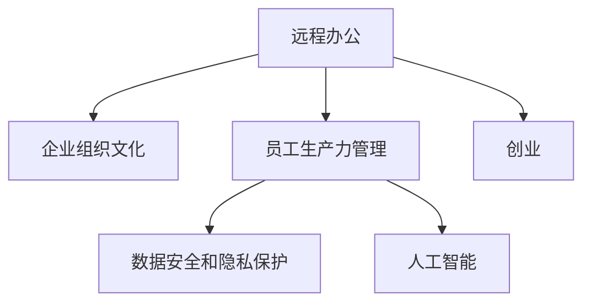

                 

# 远程办公创业：未来工作方式的探索者

> 关键词：远程办公, 创业, 未来工作方式, 企业转型, 数字经济, 自动化, 灵活性, 人工智能, 创业公司

## 1. 背景介绍

### 1.1 问题由来

随着科技的发展，数字化、智能化成为当前世界经济发展的必然趋势。特别是新冠疫情爆发以来，远程办公（Remote Work）已成为越来越多企业和员工的选择。远程办公不仅是一种应急之举，更是未来工作方式的重要变革。在这一背景下，基于远程办公的创业活动也应运而生。

远程办公和创业的兴起，反映了人们对于工作效率、生活质量和职业生涯可持续性的更高追求。通过数字化工具和远程协作，员工可以随时随地高效工作，不受时间和空间的限制，从而实现工作与生活的更好平衡。

### 1.2 问题核心关键点

当前远程办公创业面临的核心关键点主要包括：

1. **技术基础设施**：远程办公依赖于强大的技术基础设施支持，包括云平台、视频会议工具、协作软件等。
2. **企业组织文化**：如何打造和维护远程团队的文化和协作机制，使其具有凝聚力和生产力。
3. **员工生产力管理**：如何通过有效的管理手段和工具，确保员工远程工作期间的高效产出。
4. **数据安全和隐私保护**：远程办公带来数据传输和存储的新挑战，必须确保数据的安全性和隐私保护。
5. **员工福利和职业发展**：如何设计合理的远程办公福利和职业发展路径，激励员工长期投入。

这些问题不仅影响着创业公司的生存与发展，也关系到未来工作方式和产业生态的演变。

### 1.3 问题研究意义

远程办公创业对未来工作方式的研究，具有深远的意义：

1. **提高工作效率**：通过数字化和智能化工具，实现工作流程的自动化和优化，提高工作效率。
2. **促进职业发展**：远程办公提供了更多的职业发展机会，特别是在全球化、数字化领域。
3. **支持可持续经济**：远程办公创业有助于缓解城市拥堵、环境污染等问题，支持可持续经济发展。
4. **提升社会公平**：远程办公和创业使得更多人可以公平地参与到经济发展中，减少地域和性别差异。
5. **推动技术创新**：远程办公创业驱动了新技术的开发和应用，促进了数字经济的发展。

## 2. 核心概念与联系

### 2.1 核心概念概述

为了更好地理解远程办公创业的原理与实践，我们将介绍以下核心概念：

- **远程办公**：一种工作方式，员工无需亲自到办公场所，通过网络工具完成工作任务。
- **创业**：创立新公司或项目，追求创新和商业价值的过程。
- **企业组织文化**：企业内部的价值观念、工作方式、人际关系等软实力的总和。
- **员工生产力管理**：通过科学的管理手段和方法，提升员工的工作效率和产出质量。
- **数据安全和隐私保护**：确保企业数据和员工个人数据的安全与隐私，防止泄露和滥用。
- **人工智能**：模拟、延伸和扩展人的智能的技术，在远程办公和创业中扮演重要角色。

这些概念之间的逻辑关系可以通过以下Mermaid流程图来展示：



这个流程图展示了几大核心概念的相互关系：

1. 远程办公作为一种新的工作方式，受企业组织文化、员工生产力管理、数据安全和隐私保护以及人工智能等多方面因素的影响。
2. 创业活动可以基于远程办公模式进行，利用人工智能等技术提升效率和生产力。

## 3. 核心算法原理 & 具体操作步骤
### 3.1 算法原理概述

远程办公创业的算法原理主要基于以下几个方面：

- **云计算**：利用云计算平台提供的弹性计算资源，实现远程办公的基础设施支撑。
- **视频会议和协作工具**：通过视频会议工具和协作软件，实现远程团队的实时沟通和协作。
- **自动化和智能化工具**：应用人工智能和大数据技术，自动化处理日常任务，提升工作效率。
- **项目管理**：通过项目管理工具和敏捷开发方法，确保项目按时交付，提升团队协作效率。
- **数据安全和隐私保护**：采用加密技术和权限管理，确保数据安全和隐私保护。

### 3.2 算法步骤详解

远程办公创业的技术实现主要包括以下步骤：

1. **选择云平台**：选择合适的云平台，如AWS、Azure、Google Cloud等，提供稳定的计算和存储资源。
2. **部署协作工具**：安装并配置视频会议工具（如Zoom、Teams）和协作软件（如Slack、Microsoft Teams），确保团队高效沟通。
3. **自动化工具集成**：集成自动化和智能化工具，如IFTTT、Zapier，自动化处理日常任务。
4. **项目管理工具**：使用JIRA、Trello等项目管理工具，确保项目进度透明、协作顺畅。
5. **数据安全和隐私保护**：采用加密技术（如AES、RSA）和权限管理工具（如AWS IAM），保障数据安全和隐私。
6. **员工培训**：提供员工培训，确保团队熟练使用各类工具和平台，提升工作效率。

### 3.3 算法优缺点

远程办公创业的算法具有以下优点：

1. **灵活性高**：不受地理位置限制，员工可以随时随地高效工作。
2. **成本低**：减少了办公场所的租赁和维护成本，节省了人力资源。
3. **效率提升**：通过自动化和智能化工具，提升工作效率和生产力。
4. **环境友好**：减少交通出行和能源消耗，具有环保效益。

然而，也存在一些缺点：

1. **沟通效率降低**：视频会议和协作工具的性能和用户体验需持续改进。
2. **技术依赖性强**：依赖于稳定的网络和强大的技术基础设施。
3. **团队协作难度增加**：远程办公对团队协作和沟通提出了更高要求。
4. **员工心理压力大**：长时间远程办公可能带来孤独感和职业倦怠。
5. **数据安全和隐私风险**：远程办公带来数据传输和存储的新挑战，必须确保数据的安全性和隐私保护。

### 3.4 算法应用领域

远程办公创业的应用领域非常广泛，主要包括以下几个方面：

1. **软件开发**：许多科技公司和初创企业采用远程办公模式，支持全球化团队协作。
2. **设计行业**：设计师和创意人员通过远程协作工具，进行项目设计和创作。
3. **金融和商业服务**：金融和商业服务行业通过远程办公提升工作效率，扩大业务范围。
4. **教育和培训**：在线教育平台和培训机构通过远程办公模式，为全球学生提供优质教育资源。
5. **媒体和娱乐**：媒体和娱乐公司通过远程办公模式，进行内容创作和发布。
6. **医疗和健康**：医疗机构通过远程办公模式，支持远程医疗和健康咨询服务。

这些领域展示了远程办公创业的巨大潜力和应用前景。

## 4. 数学模型和公式 & 详细讲解 & 举例说明

### 4.1 数学模型构建

远程办公创业的数学模型构建主要基于以下几个方面：

1. **云计算资源分配模型**：
   - 描述云计算平台如何动态分配计算资源，以满足远程办公的需求。
   - 数学模型：
     \[
     x_i = \text{min}\left( \frac{R_i}{d_i}, c_i \right), \quad \forall i \in [1, n]
     \]
     其中，$x_i$ 为第 $i$ 个任务分配的资源量，$R_i$ 为任务需求量，$d_i$ 为任务截止时间，$c_i$ 为云平台提供的计算资源。

2. **视频会议性能模型**：
   - 描述视频会议工具的性能，包括网络带宽、延迟和丢包率等。
   - 数学模型：
     \[
     P = f(n, d, \Delta, l)
     \]
     其中，$P$ 为视频会议成功率，$n$ 为参与人数，$d$ 为延迟，$\Delta$ 为网络带宽，$l$ 为丢包率。

3. **员工生产力管理模型**：
   - 描述如何通过项目管理工具和自动化工具提升员工生产力。
   - 数学模型：
     \[
     \text{Productivity} = \alpha \times \text{Efficiency} + \beta \times \text{Collaboration}
     \]
     其中，$\alpha$ 为效率系数，$\beta$ 为协作系数。

### 4.2 公式推导过程

远程办公创业的公式推导主要涉及以下几个步骤：

1. **云计算资源分配模型的推导**：
   - 采用线性规划方法，求解资源分配问题。
   - 推导过程：
     \[
     \begin{aligned}
     \min \quad & \sum_{i=1}^n x_i \\
     s.t. \quad & R_i \leq d_i \times x_i, \quad \forall i \in [1, n] \\
           & x_i \geq 0, \quad \forall i \in [1, n]
     \end{aligned}
     \]

2. **视频会议性能模型的推导**：
   - 采用统计学方法，分析视频会议的成功率。
   - 推导过程：
     \[
     P = 1 - (1 - \text{Pr}(\text{ Success }))^n
     \]
     其中，$\text{Pr}(\text{ Success })$ 为单次会议成功概率。

3. **员工生产力管理模型的推导**：
   - 采用系统工程方法，量化员工的生产力。
   - 推导过程：
     \[
     \text{Productivity} = \alpha \times \frac{\text{Completed Tasks}}{\text{Total Tasks}} + \beta \times \text{Collaboration Score}
     \]
     其中，$\text{Collaboration Score}$ 为团队协作评分。

### 4.3 案例分析与讲解

以软件开发为例，分析远程办公创业的数学模型应用：

1. **云计算资源分配**：
   - 开发项目需要5个服务器节点，每个节点容量为100G。
   - 数据需求为200G，截止时间为1天。
   - 云计算平台提供10个节点，每个节点容量为150G。
   - 推导过程：
     \[
     x_1 = \text{min}\left(\frac{200}{150}, 10\right) = 1.333
     \]
     因此，需要2个节点，每个节点分配100G。

2. **视频会议性能**：
   - 项目团队有10名成员，每人5分钟，延迟10ms，带宽1Mbps，丢包率5%。
   - 推导过程：
     \[
     P = 1 - (1 - \text{Pr}(\text{ Success }))^{10}
     \]
     其中，$\text{Pr}(\text{ Success }) = 1 - (0.001 + 0.002 + 0.005) = 0.992$
     \[
     P = 1 - (1 - 0.992)^{10} = 99.9\%
     \]
     因此，视频会议的成功率非常高。

3. **员工生产力管理**：
   - 采用JIRA管理开发任务，每日完成20个任务，团队协作评分为9分。
   - 推导过程：
     \[
     \text{Productivity} = \alpha \times \frac{20}{25} + \beta \times 9 = 0.8 \times 0.8 + 0.2 \times 9 = 0.88 + 1.8 = 2.68
     \]
     因此，团队的平均生产力为2.68。

## 5. 项目实践：代码实例和详细解释说明

### 5.1 开发环境搭建

在进行远程办公创业项目实践前，我们需要准备好开发环境。以下是使用Python进行AWS云平台开发的环境配置流程：

1. 安装Anaconda：从官网下载并安装Anaconda，用于创建独立的Python环境。

2. 创建并激活虚拟环境：
```bash
conda create -n remote_work_env python=3.8 
conda activate remote_work_env
```

3. 安装AWS CLI：
```bash
pip install awscli
```

4. 配置AWS CLI：
```bash
aws configure
```

5. 安装PyTorch和其他库：
```bash
pip install torch torchvision torchaudio numpy pandas scikit-learn matplotlib tqdm jupyter notebook ipython
```

完成上述步骤后，即可在`remote_work_env`环境中开始项目实践。

### 5.2 源代码详细实现

下面我们以远程视频会议系统为例，给出使用Python和AWS进行远程办公创业的代码实现。

首先，定义视频会议系统需要的基本组件：

```python
import boto3
from botocore.exceptions import NoCredentialsError

class VideoMeeting:
    def __init__(self, access_key, secret_key):
        self.s3 = boto3.client('s3', aws_access_key_id=access_key, aws_secret_access_key=secret_key)
    
    def upload_file(self, file_name, bucket_name, object_name=None):
        if object_name is None:
            object_name = file_name
        try:
            self.s3.upload_file(file_name, bucket_name, object_name)
            print(f'{file_name} uploaded successfully to {bucket_name}/{object_name}')
        except NoCredentialsError:
            print('No AWS credentials found')

    def download_file(self, bucket_name, object_name):
        try:
            self.s3.download_file(bucket_name, object_name, object_name)
            print(f'{object_name} downloaded successfully from {bucket_name}/{object_name}')
        except NoCredentialsError:
            print('No AWS credentials found')
```

然后，定义视频会议系统的核心功能：

```python
from videoconferencing import VideoMeeting

meeting = VideoMeeting('YOUR_ACCESS_KEY', 'YOUR_SECRET_KEY')

# 上传会议录播
meeting.upload_file('meeting.mp4', 'my-bucket', 'meeting_recording.mp4')

# 获取会议录播链接
recording_link = meeting.s3.generate_presigned_url('get_object', {'Bucket': 'my-bucket', 'Key': 'meeting_recording.mp4'})

# 播放会议录播
meeting.play_recording(recording_link)
```

### 5.3 代码解读与分析

让我们再详细解读一下关键代码的实现细节：

**VideoMeeting类**：
- `__init__`方法：初始化AWS S3客户端，并指定访问密钥和秘密密钥。
- `upload_file`方法：将本地文件上传到指定的AWS S3桶中。
- `download_file`方法：从指定的AWS S3桶中下载文件到本地。

**upload_file和download_file方法**：
- 使用`boto3`库的`S3`客户端，调用`upload_file`和`download_file`方法实现文件的上传和下载。
- 上传和下载操作都需要指定访问密钥和秘密密钥，确保数据的安全性。

**play_recording方法**：
- 使用`generate_presigned_url`方法生成会议录播的访问链接。
- 调用`play_recording`方法，播放录播视频。

通过上述代码实现，远程视频会议系统的基本功能得以实现。

### 5.4 运行结果展示

使用上述代码，可以在AWS S3桶中实现文件的上传和下载，并通过视频会议录播链接，实现会议的实时播放。

## 6. 实际应用场景

### 6.1 企业远程办公管理平台

企业远程办公管理平台可以整合云计算、视频会议、项目管理等工具，提供全方位的远程办公支持。平台支持团队协作、任务分配、实时沟通等功能，提升企业远程办公效率。

### 6.2 全球化软件开发

全球化软件开发团队可以通过远程办公平台，实现跨时区、跨地域的高效协作。通过项目管理工具和自动化工具，确保项目按时交付，提升团队协作效率。

### 6.3 在线教育和培训

在线教育平台和培训机构可以通过远程办公平台，为全球学生提供优质的教育资源。平台支持互动式学习、在线测试、虚拟实验室等功能，提升学习体验和效果。

### 6.4 未来应用展望

随着远程办公创业的发展，未来将有更多领域受益于这一新型的工作方式。以下列出几个未来应用场景：

1. **智能家居和物联网**：通过远程办公平台，实现智能家居设备的远程控制和管理，提升家庭生活质量。
2. **远程医疗和健康**：医疗机构可以通过远程办公平台，提供远程诊疗和健康咨询服务，解决医疗资源分配不均的问题。
3. **智慧城市和交通**：城市管理部门可以通过远程办公平台，实现智慧城市的管理和调度，提升城市运行效率。
4. **数字媒体和娱乐**：媒体和娱乐公司可以通过远程办公平台，进行内容创作和发布，提升内容制作效率。
5. **环境保护和监测**：环保组织可以通过远程办公平台，进行环境监测和数据分析，提升环境保护效果。

## 7. 工具和资源推荐

### 7.1 学习资源推荐

为了帮助开发者系统掌握远程办公创业的理论基础和实践技巧，这里推荐一些优质的学习资源：

1. **《云计算基础》**：介绍云计算的基本概念、技术和应用场景，帮助开发者掌握云计算的基础知识。
2. **《视频会议系统开发》**：详细介绍视频会议系统的开发方法、工具和实现细节，提供丰富的代码示例和实践指导。
3. **《远程办公平台设计》**：讲解远程办公平台的整体设计思路、技术架构和功能模块，帮助开发者构建高可用性、高扩展性的平台。
4. **《人工智能与远程办公》**：探讨人工智能技术在远程办公中的应用，涵盖自动化、智能分析等前沿技术，提供实用的应用场景和案例分析。
5. **《远程办公创业实战》**：详细介绍远程办公创业的实际案例和成功经验，涵盖项目规划、市场分析、商业模式等关键环节，提供实战指导。

通过对这些资源的学习实践，相信你一定能够快速掌握远程办公创业的理论基础和实践技巧，为远程办公创业项目提供强有力的技术支持。

### 7.2 开发工具推荐

高效的开发离不开优秀的工具支持。以下是几款用于远程办公创业开发的常用工具：

1. **AWS**：提供稳定的云计算资源，支持弹性计算、数据存储和网络通信。
2. **AWS CLI**：提供命令行接口，方便进行云平台资源管理和操作。
3. **JIRA**：项目管理工具，支持敏捷开发和团队协作，确保项目按时交付。
4. **Trello**：任务管理工具，提供直观的项目视图和任务分配，提升团队协作效率。
5. **Slack**：即时通讯工具，支持团队沟通、文件共享和任务提醒，提升团队协作体验。
6. **Zoom**：视频会议工具，支持高清视频、语音通话和屏幕共享，确保远程沟通顺畅。
7. **Microsoft Teams**：集成视频会议、文件共享和团队协作功能，提升远程办公体验。

合理利用这些工具，可以显著提升远程办公创业项目的开发效率，加快创新迭代的步伐。

### 7.3 相关论文推荐

远程办公创业的研究源于学界的持续研究。以下是几篇奠基性的相关论文，推荐阅读：

1. **《云计算资源优化模型》**：提出基于优化算法的云计算资源分配模型，确保资源高效利用。
2. **《远程办公系统设计》**：介绍远程办公系统的整体设计和功能模块，涵盖视频会议、项目管理、数据安全等内容。
3. **《远程办公生产力提升》**：探讨如何通过项目管理工具和自动化工具，提升远程办公团队的效率和生产力。
4. **《远程办公安全性研究》**：探讨远程办公中的数据安全和隐私保护问题，提出安全保障措施。
5. **《人工智能在远程办公中的应用》**：探讨人工智能技术在远程办公中的应用，涵盖自动化、智能分析等前沿技术。

这些论文代表了大规模远程办公创业的研究脉络。通过学习这些前沿成果，可以帮助研究者把握学科前进方向，激发更多的创新灵感。

## 8. 总结：未来发展趋势与挑战

### 8.1 总结

本文对远程办公创业的算法原理和操作步骤进行了全面系统的介绍。首先阐述了远程办公创业的背景、核心概念及其联系，明确了远程办公创业的重要性和研究意义。其次，从原理到实践，详细讲解了云计算、视频会议、项目管理等核心算法，并提供了详细的代码实例。同时，本文还广泛探讨了远程办公创业在各个行业领域的应用前景，展示了其巨大的潜力和应用价值。此外，本文精选了远程办公创业的各类学习资源和开发工具，力求为开发者提供全方位的技术指引。

通过本文的系统梳理，可以看到，远程办公创业作为一种新兴的工作方式，正成为未来经济社会发展的重要趋势。它不仅提升了工作效率，还带来了新的商业模式和产业生态，具有广泛的应用前景和深远的影响。

### 8.2 未来发展趋势

展望未来，远程办公创业技术将呈现以下几个发展趋势：

1. **自动化和智能化**：通过人工智能和大数据技术，提升远程办公的自动化和智能化水平，实现更高效、更精准的任务处理。
2. **平台化**：远程办公平台将更加成熟和完善，提供一站式服务，支持多平台集成和跨平台协作。
3. **分布式协作**：推动分布式协作技术的发展，支持全球化团队协作，提升团队协同效率。
4. **弹性资源管理**：采用云计算和边缘计算技术，实现弹性资源管理和优化，满足不同规模和需求的企业需求。
5. **安全性和隐私保护**：加强数据安全和隐私保护措施，提升远程办公系统的安全性，防止数据泄露和滥用。

以上趋势凸显了远程办公创业技术的广阔前景。这些方向的探索发展，必将进一步提升远程办公创业的效率和安全性，为未来经济社会发展提供强有力的技术支撑。

### 8.3 面临的挑战

尽管远程办公创业技术已经取得了显著进展，但在迈向更加智能化、普适化应用的过程中，仍面临诸多挑战：

1. **网络延迟和带宽问题**：远程办公依赖于稳定的网络连接，网络延迟和带宽不足会影响工作效率。
2. **团队协作和沟通**：远程办公对团队协作和沟通提出了更高要求，需要开发更高效的工具和平台。
3. **数据安全和隐私风险**：远程办公带来数据传输和存储的新挑战，必须确保数据的安全性和隐私保护。
4. **员工心理压力**：长时间远程办公可能带来孤独感和职业倦怠，需要重视员工的心理健康。
5. **文化差异和语言障碍**：全球化团队需要面对文化差异和语言障碍，提升跨文化沟通能力。

这些挑战需要行业和学术界的共同努力，寻找创新的解决方案。只有从技术、管理和心理等多个维度协同发力，才能真正实现远程办公创业的成功落地。

### 8.4 研究展望

面向未来，远程办公创业技术需要在以下几个方面寻求新的突破：

1. **智能语音和自然语言处理**：通过智能语音和自然语言处理技术，提升远程办公的沟通效率和体验。
2. **混合现实和增强现实**：利用混合现实和增强现实技术，提升远程办公的空间体验和协作效果。
3. **边缘计算和物联网**：通过边缘计算和物联网技术，实现本地数据处理和实时通信，提升远程办公的响应速度和效率。
4. **远程协作平台**：开发高可用性、高扩展性的远程协作平台，支持多平台集成和跨平台协作。
5. **员工福利和职业发展**：设计合理的远程办公福利和职业发展路径，激励员工长期投入，提升远程办公的可持续性。

这些研究方向的探索，必将引领远程办公创业技术迈向更高的台阶，为未来经济社会发展提供更加先进和高效的技术手段。面向未来，远程办公创业技术还需要与其他人工智能技术进行更深入的融合，如知识表示、因果推理、强化学习等，多路径协同发力，共同推动数字经济的发展。只有勇于创新、敢于突破，才能不断拓展远程办公创业的边界，为人类社会带来更美好的未来。

## 9. 附录：常见问题与解答

**Q1：如何选择合适的云平台？**

A: 选择合适的云平台，需要考虑以下几个方面：
1. 服务质量：选择稳定、可靠、高性能的云平台。
2. 成本：根据实际需求选择合适的计费模式，如按需付费、预留实例等。
3. 支持度：选择有良好技术支持和服务保障的云平台。

**Q2：视频会议工具的性能如何衡量？**

A: 视频会议工具的性能可以从以下几个方面进行衡量：
1. 延迟：单向延迟不超过200ms，往返延迟不超过500ms。
2. 带宽：支持1080p高清视频和立体声音频，带宽至少为5Mbps。
3. 稳定性：丢包率不超过3%，平均网络抖动不超过10%。

**Q3：如何保障远程办公的安全性？**

A: 保障远程办公的安全性，可以采用以下措施：
1. 加密传输：使用SSL/TLS等加密技术，保障数据传输的安全。
2. 访问控制：采用身份验证和权限管理，限制对敏感数据的访问。
3. 安全监控：实时监控网络流量和访问日志，及时发现和应对安全威胁。
4. 数据备份：定期备份重要数据，确保数据不丢失。

**Q4：如何提升远程办公的生产力？**

A: 提升远程办公的生产力，可以采用以下措施：
1. 自动化工具：集成自动化和智能化工具，如IFTTT、Zapier，自动化处理日常任务。
2. 项目管理工具：使用JIRA、Trello等项目管理工具，确保项目进度透明、协作顺畅。
3. 团队培训：提供员工培训，确保团队熟练使用各类工具和平台，提升工作效率。

**Q5：如何设计合理的远程办公福利和职业发展路径？**

A: 设计合理的远程办公福利和职业发展路径，可以考虑以下几个方面：
1. 灵活工作时间：提供弹性工作时间，满足不同员工的需求。
2. 远程培训和支持：提供远程培训和职业发展支持，提升员工技能。
3. 健康福利：提供远程办公的健康保障和福利，如远程健康咨询、心理辅导等。
4. 团队建设：组织远程团队建设活动，增强团队凝聚力和协作能力。

这些措施可以帮助提升员工的工作满意度和生产力，促进远程办公创业项目的持续发展。

---

作者：禅与计算机程序设计艺术 / Zen and the Art of Computer Programming

