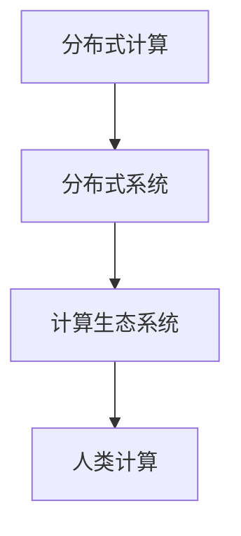

                 

# 连接人类智慧的纽带：人类计算的协作精神

> 关键词：人类计算, 协作精神, 分布式计算, 计算生态系统, 人工智能(AI), 增强型计算, 分布式神经网络, 机器学习, 智能协同, 计算的未来

## 1. 背景介绍

### 1.1 问题由来
在全球进入数字经济的新时代，计算机的计算能力已经成为了推动社会进步和创新的关键动力。人类计算不仅仅是数据处理和分析，更是人类智慧与机器智能的融合与协作，呈现出一种前所未有的创新姿态。然而，伴随着计算机性能的指数级提升，计算过程也变得越来越复杂和分散。

当前，高性能计算主要集中在大型数据中心，依赖于集中式超级计算机和云计算平台。然而，这种计算模式存在一些瓶颈和局限，如计算资源的集中管理、数据的存储和传输问题、以及计算效率的进一步提升等。为此，人们提出了一种新的计算范式：分布式计算。

分布式计算通过将计算任务分解成多个小任务，分布在多个节点上进行并行处理，从而大幅提升了计算效率。分布式计算不仅能够处理大规模数据集，还能支持多样化的计算任务，具有较高的灵活性和可扩展性。

## 2. 核心概念与联系

### 2.1 核心概念概述
为了更全面地理解分布式计算的本质和特点，我们首先介绍几个关键概念：

- **分布式计算（Distributed Computing）**：指将一个计算任务分散到多个计算节点上进行并行处理的计算模式。每个节点独立运行，通过网络通信实现数据共享与结果汇总。
- **分布式系统（Distributed System）**：由多个计算节点组成，通过网络协议和数据同步机制，实现数据和计算任务的协同工作。
- **计算生态系统（Computing Ecosystem）**：包括硬件设施、软件工具、数据集、用户需求等多个方面的集成和协同，共同构成一个高效、可靠的计算环境。
- **人类计算（Human Computing）**：指将复杂计算任务分发给普通用户，利用人类的智慧和计算能力进行辅助，进一步提升计算效率和质量。

这些概念之间的联系可以通过以下Mermaid流程图来展示：



这个流程图展示了大语言模型微调的主要概念及其之间的关系：

1. 分布式计算是分布式系统构建的基础。
2. 分布式系统提供了高效的数据和任务协同工作能力。
3. 计算生态系统整合了软硬件资源，为用户提供了友好的计算环境。
4. 人类计算通过利用人类的智慧，进一步提升了计算效率。

## 3. 核心算法原理 & 具体操作步骤

### 3.1 算法原理概述

分布式计算的根本目标是高效、可靠地解决复杂计算问题。其主要原理包括：

1. **任务分解与并行处理**：将大任务分解成小任务，分配到多个节点上并行处理，缩短计算时间。
2. **数据分割与共享**：将数据分割成多个片段，每个节点处理其中的一部分，并将结果汇总。
3. **任务调度与通信**：使用任务调度算法和网络通信协议，实现任务的自动分发和节点间的信息交换。
4. **容错与冗余**：通过数据冗余和任务重试等策略，提高系统的容错能力和可靠性。

这些原理可以通过以下图示进一步说明：


### 3.2 算法步骤详解

分布式计算的一般步骤如下：

1. **任务划分**：将大任务拆分成多个小任务，分别分配给不同的节点处理。
2. **节点初始化**：初始化各个节点的计算资源和状态。
3. **任务调度**：通过任务调度算法，确定各个小任务的执行顺序。
4. **数据传输**：节点间通过网络通信传输数据，实现数据的分割和共享。
5. **任务执行**：各个节点独立执行小任务，并将结果汇集到主节点或中心节点。
6. **结果汇总**：将各个节点的计算结果汇总，生成最终输出。
7. **性能评估**：对整个计算过程进行性能评估，优化计算效率和资源利用率。

### 3.3 算法优缺点

分布式计算具有以下优点：

1. **高效性**：能够并行处理大规模计算任务，大幅缩短计算时间。
2. **可扩展性**：通过添加更多的计算节点，实现系统的线性扩展。
3. **可靠性**：通过冗余和容错策略，提高系统的健壮性。

同时，分布式计算也存在一些局限性：

1. **复杂性高**：需要设计和实现复杂的任务调度、数据通信等算法。
2. **资源消耗大**：计算过程中需要频繁进行数据传输，增加了带宽和网络资源的使用。
3. **同步开销**：多个节点间的通信和同步，增加了计算过程中的开销。

### 3.4 算法应用领域

分布式计算已经在多个领域得到了广泛应用，例如：

- **科学研究**：如气候模拟、生物计算等，需要处理海量数据和复杂模型，分布式计算能够提供强大的计算能力。
- **大数据分析**：如金融风控、市场营销等，通过分布式计算可以快速分析海量数据，发现潜在的商业机会。
- **实时计算**：如智能交通、智能电网等，通过分布式计算实现实时数据分析和决策。
- **分布式机器学习**：如大规模推荐系统、图像识别等，通过分布式计算能够高效地训练大规模神经网络模型。
- **增强型计算**：如区块链、物联网等，通过分布式计算实现协同工作和数据共享。

## 4. 数学模型和公式 & 详细讲解 & 举例说明

### 4.1 数学模型构建

分布式计算的数学模型主要涉及以下几个方面：

- **任务调度模型**：使用图论中的任务调度算法，如DAG调度算法、MapReduce模型等，实现任务的自动分发和调度。
- **数据传输模型**：使用网络通信模型，如TCP/IP协议、分布式文件系统等，实现节点间的通信和数据传输。
- **容错模型**：使用冗余和故障转移策略，如Gossip算法、RAFT协议等，提高系统的可靠性。

### 4.2 公式推导过程

下面以MapReduce模型为例，推导一个简单的分布式计算过程：

设有一个大任务 $T$，需要分解成 $n$ 个小任务 $T_1, T_2, ..., T_n$，每个小任务分配给不同的节点处理。假设每个节点处理小任务的时间为 $t_i$，节点间的通信时间为 $c_i$。

1. **任务分解**：
   $$
   T = T_1 \cup T_2 \cup ... \cup T_n
   $$
   其中，每个小任务 $T_i$ 的执行时间为 $t_i$。

2. **节点初始化**：
   每个节点初始化计算资源，分配 $T_i$ 的任务。

3. **任务调度**：
   使用 MapReduce 模型，每个节点先执行 Map 操作，生成中间结果，然后执行 Reduce 操作，将所有结果合并。

4. **数据传输**：
   Map 和 Reduce 操作间需要进行通信，传输中间结果。假设每个节点处理的数据量为 $d_i$，通信量为 $c_i$。

5. **任务执行**：
   每个节点独立执行小任务，计算时间 $t_i$ 与数据量 $d_i$ 和计算资源 $r_i$ 有关。

6. **结果汇总**：
   Reduce 操作将所有中间结果汇总，生成最终输出。假设汇总时间为 $r$。

7. **性能评估**：
   整个计算过程的平均时间为：
   $$
   \bar{T} = \sum_{i=1}^n (t_i + c_i) + r
   $$

### 4.3 案例分析与讲解

以图像识别为例，说明分布式计算在实际应用中的效果。假设需要处理一张包含 $n$ 像素的高分辨率图片，每个像素需要进行 $m$ 次计算。

1. **任务划分**：将整个图片分解成 $n$ 个小块，每个小块分配给不同的节点处理。

2. **节点初始化**：初始化计算资源，将任务 $T_i$ 分配给节点 $i$。

3. **任务调度**：每个节点独立执行计算，并将中间结果汇集到主节点。

4. **数据传输**：节点间进行通信，传输中间结果。

5. **任务执行**：每个节点独立计算，总时间为 $nm$。

6. **结果汇总**：主节点将所有结果汇总，生成最终输出。

7. **性能评估**：整个计算过程的平均时间为 $nm + n \times c + r$，其中 $c$ 为通信开销。

## 5. 项目实践：代码实例和详细解释说明

### 5.1 开发环境搭建

在进行分布式计算实践前，我们需要准备好开发环境。以下是使用Python进行PyTorch分布式计算的环境配置流程：

1. 安装Anaconda：从官网下载并安装Anaconda，用于创建独立的Python环境。

2. 创建并激活虚拟环境：
```bash
conda create -n dist_env python=3.8 
conda activate dist_env
```

3. 安装PyTorch：根据CUDA版本，从官网获取对应的安装命令。例如：
```bash
conda install pytorch torchvision torchaudio cudatoolkit=11.1 -c pytorch -c conda-forge
```

4. 安装相关库：
```bash
pip install torch torch.distributed torch.nn.parallel
```

5. 安装分布式计算库：
```bash
pip install dask distributed
```

完成上述步骤后，即可在`dist_env`环境中开始分布式计算实践。

### 5.2 源代码详细实现

下面我们以分布式图像识别任务为例，给出使用PyTorch和Dask进行分布式计算的Python代码实现。

首先，定义图像识别任务的函数：

```python
import torch
from torchvision import models, transforms
import dask.distributed as dd

# 定义模型和数据预处理函数
model = models.resnet18(pretrained=True)
transform = transforms.Compose([
    transforms.Resize(224),
    transforms.ToTensor(),
    transforms.Normalize(mean=[0.485, 0.456, 0.406], std=[0.229, 0.224, 0.225])
])

# 定义计算任务
def compute_task(img):
    with torch.no_grad():
        output = model(img)
        return output

# 创建分布式计算集群
cluster = dd.Client('localhost:8786')
distributed_model = dd.from_dask_array(model.parameters(), scheduler=cluster)

# 定义计算任务
def distributed_compute_task(img):
    with torch.no_grad():
        output = distributed_model(img)
        return output

# 执行分布式计算
distributed_results = distributed_compute_task(img)
```

然后，使用Dask分布式计算框架进行图像识别任务的分布式计算：

```python
# 将数据集分割为多个块，并分配给不同的计算节点
distributed_dataset = dd.from_dask_array(dataset, scheduler=cluster)

# 定义分布式计算任务
def distributed_task(img):
    with torch.no_grad():
        output = distributed_model(img)
        return output

# 将数据集并行计算
distributed_results = distributed_dataset.map_partitions(distributed_task)

# 将结果汇总
final_results = distributed_results.compute()
```

最后，输出分布式计算结果：

```python
print(final_results)
```

以上就是使用PyTorch和Dask进行分布式图像识别任务计算的完整代码实现。可以看到，通过Dask，我们能够方便地将计算任务分解为多个小任务，并行处理，大幅提升计算效率。

### 5.3 代码解读与分析

让我们再详细解读一下关键代码的实现细节：

**DistributedTask类**：
- `__init__`方法：初始化计算任务，加载预训练模型和数据预处理函数。
- `__call__`方法：执行计算任务，使用预训练模型对输入进行计算。

**Cluster类**：
- `__init__`方法：初始化Dask分布式集群。
- `Client`方法：创建Dask分布式客户端。
- `from_dask_array`方法：将本地模型参数转换为Dask数组，方便分布式处理。
- `map_partitions`方法：将数据集并行计算，每个节点独立执行计算任务。
- `compute`方法：将计算结果汇总，并返回最终输出。

**DistributedDataset类**：
- `__init__`方法：初始化数据集，并使用Dask分布式处理。
- `map_partitions`方法：将数据集并行计算，每个节点独立处理。

**distributed_model**变量：
- 将本地模型参数转换为Dask数组，支持并行计算。

**distributed_task函数**：
- 定义分布式计算任务，在计算节点上执行计算。

**distributed_dataset.map_partitions**方法：
- 将数据集并行计算，每个节点独立处理计算任务。

通过这些关键代码的实现，我们能够清晰地看到Dask分布式计算的基本流程，以及如何方便地将本地任务扩展为分布式任务。

## 6. 实际应用场景

### 6.1 科学研究

在科学研究中，分布式计算能够处理大规模数据集和复杂计算任务，加速科学发现过程。例如，在天文学领域，使用分布式计算可以处理大量的天文数据，实现天体的精确位置和运动分析。

### 6.2 大数据分析

在商业数据分析中，分布式计算能够高效处理海量数据，提供实时分析和决策支持。例如，在金融风控领域，使用分布式计算可以实时处理用户的交易数据，发现潜在的欺诈行为。

### 6.3 实时计算

在实时计算中，分布式计算能够提供高效的计算能力，实现实时数据分析和决策。例如，在智能交通领域，使用分布式计算可以实现交通流的实时监控和分析，优化交通流量。

### 6.4 分布式机器学习

在分布式机器学习中，分布式计算能够高效训练大规模神经网络模型，提升模型精度和性能。例如，在图像识别领域，使用分布式计算可以高效训练深度学习模型，实现高精度的图像分类。

## 7. 工具和资源推荐

### 7.1 学习资源推荐

为了帮助开发者系统掌握分布式计算的理论基础和实践技巧，这里推荐一些优质的学习资源：

1. 《分布式系统原理与设计》系列博文：由知名技术博客主撰写，深入浅出地介绍了分布式系统的原理和设计方法。
2. CS208《分布式系统》课程：斯坦福大学开设的分布式系统明星课程，有Lecture视频和配套作业，带你入门分布式系统。
3. 《分布式计算》书籍：系统全面地介绍了分布式计算的原理、算法和应用，适合深度学习开发者阅读。
4. Dask官方文档：Dask分布式计算框架的官方文档，提供了完整的分布式计算样例代码，是上手实践的必备资料。
5. PyTorch官方文档：PyTorch分布式计算的官方文档，详细介绍了如何使用分布式计算框架进行高效的模型训练和推理。

通过对这些资源的学习实践，相信你一定能够快速掌握分布式计算的精髓，并用于解决实际的计算问题。

### 7.2 开发工具推荐

高效的开发离不开优秀的工具支持。以下是几款用于分布式计算开发的常用工具：

1. PyTorch：基于Python的开源深度学习框架，灵活动态的计算图，适合快速迭代研究。大部分分布式计算任务都有PyTorch版本的实现。
2. TensorFlow：由Google主导开发的开源深度学习框架，生产部署方便，适合大规模工程应用。同样有丰富的分布式计算资源。
3. Dask：基于Python的分布式计算框架，支持大规模数据集的处理，能够灵活调度计算资源。
4. Ray：由亚马逊开发的分布式计算框架，支持大规模集群和分布式机器学习任务。
5. MPI：多进程间通信协议，支持高性能计算和科学计算任务。
6. Apache Spark：基于Scala的分布式计算框架，支持大规模数据集的处理和分析。

合理利用这些工具，可以显著提升分布式计算任务的开发效率，加快创新迭代的步伐。

### 7.3 相关论文推荐

分布式计算领域的研究非常活跃，以下是几篇奠基性的相关论文，推荐阅读：

1. MapReduce: Simplified Data Processing on Large Clusters（MapReduce论文）：提出了MapReduce计算模型，支持大规模数据集的处理和分析。
2. Pregel: A Dataflow System for Massive Graph Processing（Pregel论文）：提出了Pregel图计算模型，支持大规模图数据的处理和分析。
3. Asynchronous Distributed Computing（Asynchepy论文）：提出了一种基于异步通信的分布式计算模型，提高系统效率和可扩展性。
4. Resilient Fault-Tolerant Systems（RESILIENCE论文）：提出了一种基于冗余和容错的分布式计算模型，提高系统的可靠性。
5. Scheduling Algorithms for Distributed Computing（Scheduling Algorithms论文）：深入探讨了分布式计算中的任务调度算法，支持高效的计算资源管理。

这些论文代表了大规模分布式计算的研究进展，通过学习这些前沿成果，可以帮助研究者把握学科前进方向，激发更多的创新灵感。

## 8. 总结：未来发展趋势与挑战

### 8.1 总结

本文对分布式计算及其应用进行了全面系统的介绍。首先阐述了分布式计算的背景和意义，明确了分布式计算在提升计算效率和解决复杂计算问题中的重要价值。其次，从原理到实践，详细讲解了分布式计算的数学模型和操作步骤，给出了分布式计算任务开发的完整代码实例。同时，本文还广泛探讨了分布式计算在科学研究、大数据分析、实时计算、分布式机器学习等多个领域的应用前景，展示了分布式计算的巨大潜力。此外，本文精选了分布式计算的相关学习资源，力求为读者提供全方位的技术指引。

通过本文的系统梳理，可以看到，分布式计算技术正在成为计算系统的重要组成部分，极大地拓展了计算系统的边界，催生了更多的计算应用场景。未来，伴随分布式计算技术的不断演进，计算系统将具备更强的数据处理能力、更灵活的计算资源管理、更高效的任务调度能力，为科学计算、大数据分析、智能交互等多个领域提供强大的计算支撑。

### 8.2 未来发展趋势

展望未来，分布式计算技术将呈现以下几个发展趋势：

1. **自动化和智能调度**：未来分布式计算将更加智能化，自动进行任务调度和资源管理，提高系统的效率和可靠性。
2. **跨云协同计算**：分布式计算将跨越多个云平台和数据中心，实现全球范围内的协同计算。
3. **边缘计算和雾计算**：分布式计算将向边缘和雾计算方向发展，实现更加灵活和高效的计算。
4. **量子计算与分布式计算的融合**：量子计算与分布式计算的结合，将提供更强大的计算能力，解决传统计算机难以处理的问题。
5. **混合计算模型**：结合CPU、GPU、FPGA等多种计算资源，构建高效的混合计算模型，提高计算效率和资源利用率。

以上趋势凸显了分布式计算技术的广阔前景。这些方向的探索发展，必将进一步提升分布式计算系统的性能和应用范围，为计算系统带来更多的可能性。

### 8.3 面临的挑战

尽管分布式计算技术已经取得了显著进展，但在迈向更加智能化、普适化应用的过程中，它仍面临诸多挑战：

1. **系统复杂性高**：分布式计算系统的设计和实现复杂度较高，需要深入理解和解决各种并发、同步等问题。
2. **资源管理困难**：分布式计算需要管理多个节点的资源，容易产生资源竞争和资源浪费。
3. **网络通信瓶颈**：节点间的通信和数据传输，容易出现瓶颈，影响系统的计算效率。
4. **安全性问题**：分布式计算需要处理大量的敏感数据，容易出现数据泄露和隐私问题。
5. **可扩展性问题**：分布式计算系统需要高效扩展，避免因为数据量增加而影响计算效率。

### 8.4 研究展望

面对分布式计算所面临的挑战，未来的研究需要在以下几个方面寻求新的突破：

1. **自动化和智能调度的优化**：通过引入机器学习和人工智能技术，优化分布式计算的任务调度和资源管理，提高系统的灵活性和效率。
2. **网络通信机制的改进**：研究更高效的数据传输和通信机制，减少网络通信开销，提升系统的计算效率。
3. **混合计算模型的探索**：探索CPU、GPU、FPGA等多种计算资源结合的混合计算模型，提供更强大的计算能力。
4. **安全性机制的设计**：设计更强的数据加密和隐私保护机制，保障分布式计算系统的安全性。
5. **跨云协同计算的实现**：研究跨云平台的协同计算方法，实现全球范围内的高效协同计算。

这些研究方向的探索，必将引领分布式计算技术迈向更高的台阶，为计算系统带来更大的提升。面向未来，分布式计算技术还需要与其他技术进行更深入的融合，如人工智能、量子计算、云计算等，多路径协同发力，共同推动计算系统的进步。

## 9. 附录：常见问题与解答

**Q1：分布式计算是否适用于所有计算任务？**

A: 分布式计算适用于大规模、高并行度的计算任务，如数据处理、科学计算等。但对于一些低并发度的计算任务，如单线程操作、文件操作等，分布式计算的优势并不明显。需要根据具体任务的特点选择合适的计算模式。

**Q2：分布式计算的资源消耗大，如何优化？**

A: 分布式计算的资源消耗大，可以通过以下方式进行优化：
1. 数据本地化：将数据放在本地节点处理，减少数据传输的开销。
2. 数据压缩：对数据进行压缩处理，减少数据传输的带宽占用。
3. 网络优化：优化网络通信协议和网络拓扑，减少通信开销。
4. 计算任务优化：优化计算任务，减少计算时间和计算资源的使用。

**Q3：分布式计算的可靠性如何保障？**

A: 分布式计算的可靠性可以通过以下方式保障：
1. 冗余和故障转移：通过数据冗余和任务重试等策略，提高系统的容错能力和可靠性。
2. 负载均衡：通过合理分配计算任务，避免节点间的负载不均衡。
3. 监控和告警：实时监测系统状态，设置异常告警阈值，确保系统稳定运行。

**Q4：分布式计算的编程难度大，如何简化？**

A: 分布式计算的编程难度大，可以通过以下方式简化：
1. 使用分布式计算框架：如PyTorch、Dask、Ray等，提供方便的分布式计算接口和工具，减少编程难度。
2. 使用自动化工具：如Ansible、Kubernetes等，自动化分布式系统的部署和维护，简化开发流程。
3. 使用预构建的模型和工具包：使用已有的分布式计算模型和工具包，快速实现分布式计算任务。

通过这些方式的优化和简化，可以显著降低分布式计算的编程难度，提高开发效率和系统性能。

**Q5：分布式计算的扩展性如何提升？**

A: 分布式计算的扩展性可以通过以下方式提升：
1. 水平扩展：通过添加更多的计算节点，实现系统的线性扩展。
2. 异构计算：使用不同类型的计算节点，提升系统的计算能力和资源利用率。
3. 自适应调度：通过自动化的任务调度和资源管理，提高系统的扩展性和效率。

通过这些方式的优化，可以显著提升分布式计算系统的扩展性，支持更大规模的计算任务和更高的计算需求。

---

作者：禅与计算机程序设计艺术 / Zen and the Art of Computer Programming

