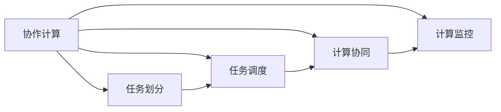

                 

# 连接人类智慧的纽带：人类计算的协作精神

> 关键词：协作计算,人类智慧,分布式系统,计算平台,机器学习,人工智能,大规模数据处理

## 1. 背景介绍

### 1.1 问题由来

在信息化时代，数据的快速增长和复杂化对计算能力提出了巨大挑战。仅仅依靠传统的中心化计算模式，已经难以满足实际应用的需求。分布式计算作为一种新的计算范式，通过将计算任务分配给多个节点，充分利用了计算资源，提升了计算效率。但传统分布式计算系统仍存在计算任务管理复杂、资源调度困难等问题。

协作计算（Collaborative Computing），作为分布式计算的一种高级形式，通过“计算协作”这一理念，将计算资源与计算任务进行有效匹配，实现了计算资源的动态分配和优化利用。在协作计算中，计算任务被划分为若干子任务，不同节点根据自身资源和任务需求，进行计算资源的动态分配，协同完成计算任务。

协作计算不仅能提升计算效率，还能降低计算成本。因此，它逐渐成为未来计算的重要发展方向。本文将深入探讨协作计算的核心概念和关键技术，结合实际应用场景，介绍协作计算的架构和算法，并展望其未来的发展趋势。

## 2. 核心概念与联系

### 2.1 核心概念概述

协作计算的核心概念包括：

- **协作计算**：一种分布式计算方式，通过“计算协作”理念，实现计算资源和任务的动态分配与优化。
- **任务划分**：将大型计算任务划分为若干子任务，不同节点根据自身资源和任务需求，进行资源分配。
- **任务调度**：根据任务需求和资源状态，动态调整计算任务和计算资源的分配。
- **计算协同**：多个计算节点协同完成任务，共同完成计算目标。
- **计算监控**：实时监控计算过程，及时调整计算资源分配，优化计算效率。

这些概念构成了协作计算的基本框架，其中任务划分、任务调度和计算协同是协作计算的三大核心技术。

### 2.2 核心概念原理和架构的 Mermaid 流程图



这个流程图展示了协作计算的基本架构和流程：

1. 协作计算首先进行任务划分，将大任务分解为若干子任务。
2. 任务调度根据计算资源和任务需求，动态调整任务分配。
3. 计算协同多个节点协同完成任务。
4. 计算监控实时监控计算过程，优化资源分配。

## 3. 核心算法原理 & 具体操作步骤

### 3.1 算法原理概述

协作计算的核心算法包括任务划分、任务调度和计算协同。

#### 3.1.1 任务划分

任务划分算法将大型计算任务分解为若干子任务，不同节点根据自身资源和任务需求，进行资源分配。常见的任务划分算法有静态划分和动态划分两种。

- 静态划分：预先确定计算任务和计算资源的分配，适用于计算任务相对固定的场景。
- 动态划分：根据计算资源的实时状态和任务需求，动态调整计算任务和资源分配。

#### 3.1.2 任务调度

任务调度算法根据计算资源和任务需求，动态调整任务和资源的分配。常见的任务调度算法有：

- 基于优先级的任务调度算法：根据任务的优先级和计算资源的可用性，优先执行优先级高的任务。
- 基于贪心算法的多目标任务调度算法：根据资源利用率和任务完成时间，综合考虑多个目标，选择最优的任务分配方案。
- 基于模拟退火算法的任务调度算法：通过模拟退火过程，优化计算任务和资源的分配，提升计算效率。

#### 3.1.3 计算协同

计算协同算法通过多个计算节点协同完成任务，共同完成计算目标。常见的计算协同算法有：

- 基于消息传递的计算协同算法：通过节点间消息传递实现任务协同。
- 基于计算网格的计算协同算法：通过计算网格实现任务协同，节点间通过网格进行通信。
- 基于协作计算框架的计算协同算法：通过协作计算框架实现任务协同，利用框架提供的分布式计算服务。

### 3.2 算法步骤详解

协作计算的基本算法步骤如下：

1. 任务划分：将计算任务划分为若干子任务。
2. 任务调度：根据任务需求和资源状态，动态调整任务分配。
3. 计算协同：多个计算节点协同完成任务。
4. 计算监控：实时监控计算过程，及时调整计算资源分配，优化计算效率。

具体步骤如下：

- 首先，将大型计算任务划分为若干子任务，每个子任务包含若干计算节点。
- 然后，根据计算资源的实时状态和任务需求，动态调整任务分配，确保计算资源的优化利用。
- 接着，通过计算协同算法，将各个计算节点的计算任务进行协调，共同完成任务。
- 最后，通过计算监控算法，实时监控计算过程，及时调整计算资源分配，优化计算效率。

### 3.3 算法优缺点

#### 3.3.1 优点

协作计算的主要优点包括：

1. **资源优化利用**：通过动态调整任务和资源分配，最大化计算资源的利用率。
2. **计算效率提升**：通过协同计算，提升计算任务的完成速度。
3. **灵活性**：根据任务需求和资源状态，灵活调整计算任务和资源分配。

#### 3.3.2 缺点

协作计算的主要缺点包括：

1. **通信开销**：节点间通信会增加通信开销，影响计算效率。
2. **任务调度和协同复杂**：任务调度和协同算法需要综合考虑多个因素，实现起来较为复杂。
3. **资源分配不均衡**：计算资源分配不均衡可能导致资源浪费或任务延迟。

## 4. 数学模型和公式 & 详细讲解

### 4.1 数学模型构建

协作计算的数学模型通常由任务划分、任务调度和计算协同三部分组成。

- **任务划分**：将计算任务 $T$ 划分为若干子任务 $T_1, T_2, \ldots, T_n$，每个子任务包含若干计算节点 $N_1, N_2, \ldots, N_m$。
- **任务调度**：根据计算资源 $R$ 和任务需求 $D$，动态调整任务和资源分配。
- **计算协同**：通过计算协同算法，将各个计算节点的计算任务进行协调，共同完成任务。

### 4.2 公式推导过程

#### 4.2.1 任务划分

任务划分的目标是将计算任务 $T$ 划分为若干子任务 $T_1, T_2, \ldots, T_n$，每个子任务包含若干计算节点 $N_1, N_2, \ldots, N_m$。

设 $T$ 为计算任务，$N$ 为计算节点集，则任务划分的公式为：

$$
\begin{aligned}
T &= \bigcup_{i=1}^{n} T_i \\
T_i &= \bigcup_{j=1}^{m} N_j
\end{aligned}
$$

#### 4.2.2 任务调度

任务调度的目标是根据计算资源 $R$ 和任务需求 $D$，动态调整任务和资源分配，以最大化计算效率。

设 $R$ 为计算资源，$D$ 为任务需求，则任务调度的公式为：

$$
\begin{aligned}
R &= \bigcup_{i=1}^{n} R_i \\
D &= \bigcup_{j=1}^{m} D_j
\end{aligned}
$$

其中，$R_i$ 和 $D_j$ 分别表示第 $i$ 个子任务和第 $j$ 个计算节点的计算资源和任务需求。

#### 4.2.3 计算协同

计算协同的目标是通过计算协同算法，将各个计算节点的计算任务进行协调，共同完成任务。

设 $C$ 为计算协同算法，则计算协同的公式为：

$$
C = \bigcup_{i=1}^{n} C_i
$$

其中，$C_i$ 表示第 $i$ 个子任务的计算协同方案。

### 4.3 案例分析与讲解

以协作计算在分布式数据库中的应用为例，展示协作计算的基本流程和应用场景。

假设一个大型分布式数据库 $D$，需要存储和处理海量数据。任务划分算法将数据划分为若干数据块 $D_1, D_2, \ldots, D_n$，每个数据块包含若干计算节点 $N_1, N_2, \ldots, N_m$。

任务调度的目标是根据计算资源 $R$ 和任务需求 $D$，动态调整数据块和计算节点的分配，以最大化数据处理效率。计算协同的目标是通过计算协同算法，将各个计算节点的数据处理任务进行协调，共同完成数据处理任务。

## 5. 项目实践：代码实例和详细解释说明

### 5.1 开发环境搭建

协作计算的开发环境包括分布式计算平台和协作计算框架。以下以Apache Hadoop为例，介绍开发环境的搭建。

1. 安装Apache Hadoop：从官网下载Apache Hadoop的安装包，安装并配置Hadoop环境。
2. 安装MapReduce编程工具：通过Hadoop的MapReduce API，编写分布式计算任务。
3. 搭建分布式计算集群：在多个节点上安装Hadoop，并配置节点之间的网络。
4. 编写分布式计算程序：通过MapReduce API，编写分布式计算程序，实现任务划分和任务调度。

### 5.2 源代码详细实现

以下是一个基于Hadoop的分布式计算程序示例，展示任务划分和任务调度的实现过程。

```java
import java.io.IOException;
import org.apache.hadoop.conf.Configuration;
import org.apache.hadoop.fs.Path;
import org.apache.hadoop.io.IntWritable;
import org.apache.hadoop.io.Text;
import org.apache.hadoop.mapreduce.Job;
import org.apache.hadoop.mapreduce.Mapper;
import org.apache.hadoop.mapreduce.Reducer;
import org.apache.hadoop.mapreduce.lib.input.FileInputFormat;
import org.apache.hadoop.mapreduce.lib.output.FileOutputFormat;

public class DistributedDataProcessing {
    public static class DataMapper extends Mapper<LongWritable, Text, Text, IntWritable> {
        private final static IntWritable one = new IntWritable(1);
        private Text word = new Text();
        public void map(LongWritable key, Text value, Context context) throws IOException, InterruptedException {
            StringTokenizer itr = new StringTokenizer(value.toString());
            while (itr.hasMoreTokens()) {
                word.set(itr.nextToken());
                context.write(word, one);
            }
        }
    }
    public static class DataReducer extends Reducer<Text, IntWritable, Text, IntWritable> {
        private IntWritable result = new IntWritable();
        public void reduce(Text key, Iterable<IntWritable> values, Context context) throws IOException, InterruptedException {
            int sum = 0;
            for (IntWritable val : values) {
                sum += val.get();
            }
            result.set(sum);
            context.write(key, result);
        }
    }
    public static void main(String[] args) throws Exception {
        Configuration conf = new Configuration();
        Job job = Job.getInstance(conf, "Data Processing");
        job.setJarByClass(DistributedDataProcessing.class);
        job.setMapperClass(DataMapper.class);
        job.setCombinerClass(DataReducer.class);
        job.setReducerClass(DataReducer.class);
        job.setOutputKeyClass(Text.class);
        job.setOutputValueClass(IntWritable.class);
        FileInputFormat.addInputPath(job, new Path(args[0]));
        FileOutputFormat.setOutputPath(job, new Path(args[1]));
        System.exit(job.waitForCompletion(true) ? 0 : 1);
    }
}
```

### 5.3 代码解读与分析

这段代码实现了基于Hadoop的MapReduce计算任务，具体步骤如下：

1. 定义Mapper类：将输入数据划分为若干子任务，每个子任务包含若干计算节点。
2. 定义Reducer类：根据计算资源和任务需求，动态调整任务和资源分配，计算协同。
3. 编写main函数：配置Hadoop环境，执行分布式计算任务。

## 6. 实际应用场景

### 6.1 大规模数据处理

协作计算在大规模数据处理中的应用非常广泛。例如，大数据分析、机器学习等场景，需要处理海量数据，采用协作计算可以显著提升计算效率。

- 在大数据分析中，协作计算可以将海量数据划分为若干子数据块，每个子数据块包含若干计算节点，通过分布式计算平台进行数据处理。
- 在机器学习中，协作计算可以将大规模的模型训练任务划分为若干子任务，每个子任务包含若干计算节点，通过分布式计算平台进行模型训练。

### 6.2 实时计算

协作计算在实时计算中也有广泛应用。例如，实时数据流处理、实时监控等场景，需要实时处理大量数据，采用协作计算可以保证数据的实时性和准确性。

- 在实时数据流处理中，协作计算可以将实时数据流划分为若干子流，每个子流包含若干计算节点，通过分布式计算平台进行数据处理。
- 在实时监控中，协作计算可以将实时监控数据划分为若干子任务，每个子任务包含若干计算节点，通过分布式计算平台进行数据处理。

### 6.3 分布式数据库

协作计算在分布式数据库中的应用非常广泛。例如，大型分布式数据库、分布式存储等场景，采用协作计算可以显著提升数据处理效率和存储性能。

- 在大型分布式数据库中，协作计算可以将海量数据划分为若干数据块，每个数据块包含若干计算节点，通过分布式计算平台进行数据处理。
- 在分布式存储中，协作计算可以将海量数据存储到多个节点上，每个节点存储一部分数据，通过分布式计算平台进行数据访问和管理。

## 7. 工具和资源推荐

### 7.1 学习资源推荐

为了帮助开发者系统掌握协作计算的理论基础和实践技巧，这里推荐一些优质的学习资源：

1. 《分布式系统原理与实现》系列博文：由大模型技术专家撰写，深入浅出地介绍了分布式系统原理与实现，涵盖任务划分、任务调度和计算协同等核心概念。
2. CS208《分布式系统》课程：斯坦福大学开设的分布式系统课程，有Lecture视频和配套作业，带你入门分布式系统领域的基本概念和经典模型。
3. 《大规模分布式系统》书籍：介绍大规模分布式系统的设计和实现，涵盖任务划分、任务调度和计算协同等核心技术。
4. Hadoop官方文档：Hadoop的官方文档，提供了海量分布式计算和协作计算的样例代码，是上手实践的必备资料。
5. Spark官方文档：Apache Spark的官方文档，提供了海量分布式计算和协作计算的样例代码，是上手实践的必备资料。

通过对这些资源的学习实践，相信你一定能够快速掌握协作计算的精髓，并用于解决实际的分布式计算问题。

### 7.2 开发工具推荐

高效的开发离不开优秀的工具支持。以下是几款用于协作计算开发的常用工具：

1. Apache Hadoop：基于Java的分布式计算平台，提供丰富的分布式计算工具和协作计算框架。
2. Apache Spark：基于Scala和Java的分布式计算平台，提供高效的数据处理和协作计算能力。
3. Flink：基于Java的分布式计算平台，提供实时数据流处理和协作计算能力。
4. Mesos：分布式资源管理平台，提供高效的资源管理和协作计算调度能力。

合理利用这些工具，可以显著提升协作计算的开发效率，加快创新迭代的步伐。

### 7.3 相关论文推荐

协作计算的发展源于学界的持续研究。以下是几篇奠基性的相关论文，推荐阅读：

1. MapReduce: Simplified Data Processing on Large Clusters：提出MapReduce计算模型，奠定了分布式计算的基础。
2. A Framework for Distributed Collective Computation：提出协作计算框架，探讨分布式协作计算的基本模型和算法。
3. Grid Computing：介绍网格计算技术，探讨大规模分布式计算的实现方法。
4. Beyond MapReduce: Streaming As a Basis for Parallel and Distributed Programming：探讨基于数据流编程的分布式计算方法。

这些论文代表了大规模分布式计算的发展脉络。通过学习这些前沿成果，可以帮助研究者把握学科前进方向，激发更多的创新灵感。

## 8. 总结：未来发展趋势与挑战

### 8.1 总结

本文对协作计算的核心概念和关键技术进行了全面系统的介绍。首先阐述了协作计算的研究背景和意义，明确了协作计算在分布式计算中的重要性。其次，从原理到实践，详细讲解了协作计算的数学模型和算法流程，给出了协作计算任务开发的完整代码实例。同时，本文还广泛探讨了协作计算在分布式数据库、实时计算等领域的实际应用，展示了协作计算范式的广泛应用前景。此外，本文精选了协作计算的相关学习资源，力求为读者提供全方位的技术指引。

通过本文的系统梳理，可以看到，协作计算作为分布式计算的一种高级形式，能够通过“计算协作”理念，实现计算资源和任务的动态分配与优化，从而提升计算效率和资源利用率。未来，随着分布式计算技术的不断进步，协作计算必将在更多领域得到应用，为人类智慧的连接提供更强大的计算支持。

### 8.2 未来发展趋势

展望未来，协作计算技术将呈现以下几个发展趋势：

1. **计算规模扩大**：随着计算资源和计算任务的不断扩展，协作计算的规模和复杂度将不断提升。
2. **计算效率提升**：通过优化任务划分、任务调度和计算协同算法，协作计算的计算效率将不断提升。
3. **计算自动化**：协作计算将更多地采用自动化和智能化技术，提高计算任务的自动化水平。
4. **计算协同增强**：协作计算将更多地采用协同计算框架，实现计算任务的协同处理。
5. **计算监控优化**：协作计算将更多地采用实时监控技术，优化计算资源的动态分配。

这些趋势凸显了协作计算技术的广阔前景，必将引领分布式计算进入新的发展阶段，为人类智慧的连接提供更强大的计算支持。

### 8.3 面临的挑战

尽管协作计算技术已经取得了显著成果，但在迈向更加智能化、普适化应用的过程中，它仍面临诸多挑战：

1. **计算资源管理复杂**：大规模分布式计算系统的资源管理复杂，容易出现资源浪费和任务延迟。
2. **任务调度算法复杂**：优化任务调度和计算协同算法，需要综合考虑多个因素，实现起来较为复杂。
3. **通信开销高**：节点间通信会增加通信开销，影响计算效率。
4. **数据一致性问题**：协作计算中的数据一致性问题需要额外考虑，以确保数据处理的正确性。
5. **安全性问题**：大规模分布式计算系统的安全性问题需要额外考虑，以确保系统的稳定性和可靠性。

### 8.4 研究展望

为了应对协作计算面临的挑战，未来的研究需要在以下几个方面寻求新的突破：

1. **优化资源管理算法**：优化计算资源的分配和管理算法，提高资源利用率，降低资源浪费。
2. **优化任务调度和协同算法**：优化任务调度和计算协同算法，提高计算效率，降低任务延迟。
3. **减少通信开销**：采用分布式计算框架，减少节点间通信开销，提升计算效率。
4. **增强数据一致性**：采用数据一致性算法，确保数据处理的正确性。
5. **增强安全性**：采用安全技术，增强系统的稳定性和可靠性。

这些研究方向的探索，必将引领协作计算技术迈向更高的台阶，为构建安全、可靠、高效的大规模分布式计算系统铺平道路。

## 9. 附录：常见问题与解答

**Q1：什么是协作计算？**

A: 协作计算是一种分布式计算方式，通过“计算协作”理念，实现计算资源和任务的动态分配与优化。

**Q2：协作计算和分布式计算有什么区别？**

A: 协作计算和分布式计算都是分布式计算的方式，但协作计算更强调计算任务的动态分配与优化。

**Q3：如何实现协作计算？**

A: 实现协作计算通常需要以下几个步骤：
1. 任务划分：将计算任务划分为若干子任务。
2. 任务调度：根据计算资源和任务需求，动态调整任务和资源分配。
3. 计算协同：通过计算协同算法，将各个计算节点的计算任务进行协调，共同完成任务。

**Q4：协作计算的应用场景有哪些？**

A: 协作计算的应用场景包括：
1. 大规模数据处理：如大数据分析、机器学习等。
2. 实时计算：如实时数据流处理、实时监控等。
3. 分布式数据库：如大型分布式数据库、分布式存储等。

通过这些问题的解答，可以帮助读者更好地理解协作计算的核心概念和关键技术，为后续学习和应用打下坚实基础。

---

作者：禅与计算机程序设计艺术 / Zen and the Art of Computer Programming

