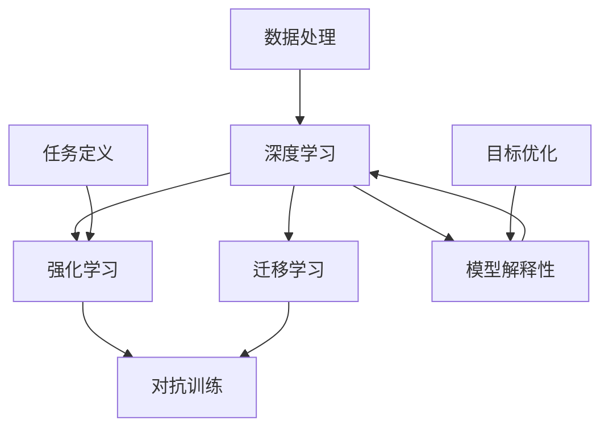

                 

# 释放人类创造力的源泉：人类计算的魅力

## 1. 背景介绍

### 1.1 问题由来

在人类历史的长河中，计算一直扮演着至关重要的角色。从古老的算盘、写字板到现代的计算机，计算技术不断进化，推动了人类社会的进步。然而，传统计算机体系强调机械运算，对于人类创造力的解放仍有所局限。

随着人工智能（AI）技术的发展，人类计算的概念被重新定义。AI不仅在数据处理和自动化任务上展现了巨大潜力，更在模拟人类认知和创造力方面取得了突破。近年来，研究者提出了“人类计算”的概念，旨在结合人类智慧与机器能力，释放人类创造力的源泉。

### 1.2 问题核心关键点

人类计算的核心在于利用AI技术，特别是深度学习和强化学习等算法，模拟人类思维过程，辅助人类进行复杂问题解决和创新工作。其关键点包括：

1. **深度学习**：模仿人类神经网络结构，通过大量数据训练模型，学习复杂非线性关系。
2. **强化学习**：通过奖励机制训练模型，模拟人类的试错和迭代学习过程。
3. **迁移学习**：将一个领域学到的知识，迁移到另一个相关领域，提升模型泛化能力。
4. **对抗训练**：通过引入对抗样本，增强模型鲁棒性和泛化性能。
5. **模型解释性**：提升模型的可解释性，使人类能理解模型的决策过程。

### 1.3 问题研究意义

人类计算的研究对于推动人工智能的跨越式发展，特别是解决复杂认知问题，具有重要意义：

1. **提升人类创造力**：通过模拟人类思维过程，解决复杂问题，提升人类的创造力。
2. **加速科学研究**：辅助人类在生物、物理等科学领域进行实验设计和数据分析，加速科学发现。
3. **推动教育变革**：通过智能辅导系统，提供个性化教学，提高教育效果。
4. **改善医疗健康**：模拟医生决策过程，辅助诊断和治疗方案设计。
5. **优化资源管理**：应用于城市规划、物流管理等领域，提升资源配置效率。

## 2. 核心概念与联系

### 2.1 核心概念概述

为了更好地理解人类计算，本文将介绍几个核心概念及其联系：

- **深度学习**：基于神经网络的机器学习方法，通过多层非线性映射，学习输入数据的复杂特征表示。
- **强化学习**：通过试错过程，学习最优策略以最大化预期奖励，适用于复杂决策问题。
- **迁移学习**：通过将一个领域学到的知识迁移到另一个领域，提升模型的泛化能力。
- **对抗训练**：通过引入对抗样本，提高模型的鲁棒性和泛化性能。
- **模型解释性**：通过可解释的模型结构或特征，使人类理解模型的决策过程。

这些概念之间存在着密切联系，共同构成了人类计算的理论基础和实践框架。

### 2.2 核心概念原理和架构的 Mermaid 流程图



这个流程图展示了深度学习、强化学习、迁移学习、对抗训练和模型解释性之间的联系：

1. **深度学习**：作为核心工具，深度学习用于提取数据中的复杂特征。
2. **强化学习**：在深度学习的基础上，通过奖励机制进行策略优化。
3. **迁移学习**：通过将一个领域学到的知识迁移到另一个领域，提升模型的泛化能力。
4. **对抗训练**：引入对抗样本，提高模型的鲁棒性和泛化性能。
5. **模型解释性**：提升模型的可解释性，使人类理解模型的决策过程。

数据处理和任务定义是这些概念的前提，目标优化则是最终目的。

## 3. 核心算法原理 & 具体操作步骤

### 3.1 算法原理概述

人类计算的核心算法原理主要基于深度学习和强化学习：

- **深度学习**：通过多层神经网络结构，学习输入数据的复杂特征表示。常用的架构包括卷积神经网络（CNN）、循环神经网络（RNN）和变换器（Transformer）。
- **强化学习**：通过试错过程，学习最优策略以最大化预期奖励。强化学习算法包括Q-learning、SARSA、Policy Gradient等。

### 3.2 算法步骤详解

以下详细讲解深度学习和强化学习的具体步骤：

#### 深度学习算法步骤

1. **数据准备**：收集和预处理训练数据，进行数据增强，避免过拟合。
2. **模型设计**：选择合适的网络结构，定义损失函数和优化器。
3. **模型训练**：使用随机梯度下降等优化算法，最小化损失函数。
4. **模型验证**：在验证集上评估模型性能，调整超参数。
5. **模型测试**：在测试集上测试模型性能，进行误差分析。

#### 强化学习算法步骤

1. **环境定义**：定义任务环境，包括状态空间、动作空间和奖励函数。
2. **模型训练**：选择合适的强化学习算法，如Q-learning、Policy Gradient等。
3. **策略优化**：通过反复试错，学习最优策略。
4. **测试评估**：在测试环境中评估模型性能，进行误差分析。

### 3.3 算法优缺点

#### 深度学习的优缺点

**优点**：
1. 能够处理非线性问题。
2. 对大量数据进行建模，学习复杂特征。
3. 易于并行化计算，适用于大规模任务。

**缺点**：
1. 模型复杂，训练时间长。
2. 过拟合风险高。
3. 可解释性差，难以理解决策过程。

#### 强化学习的优缺点

**优点**：
1. 适用于动态环境，能够自我调整策略。
2. 能够解决复杂决策问题。
3. 可以通过经验获取新知识。

**缺点**：
1. 学习过程缓慢，需要大量样本。
2. 策略优化存在局部最优风险。
3. 需要大量的奖励信号，环境设计复杂。

### 3.4 算法应用领域

深度学习和强化学习在多个领域得到了广泛应用，例如：

- **计算机视觉**：图像识别、目标检测、图像生成等。
- **自然语言处理**：机器翻译、文本生成、问答系统等。
- **机器人控制**：自动驾驶、机器人操作、智能家居等。
- **金融投资**：交易策略、风险管理、市场预测等。
- **医疗健康**：疾病诊断、药物研发、智能辅助等。

## 4. 数学模型和公式 & 详细讲解 & 举例说明

### 4.1 数学模型构建

在深度学习中，常用的数学模型包括卷积神经网络（CNN）和变换器（Transformer）。

#### CNN模型

**输入**：输入数据 $x \in \mathbb{R}^n$。
**卷积层**：通过卷积操作提取局部特征 $f(x)$。
**池化层**：通过池化操作减少特征维度 $g(f(x))$。
**全连接层**：通过线性变换输出预测结果 $h(g(f(x)))$。

**损失函数**：常用的损失函数包括均方误差（MSE）和交叉熵（Cross Entropy）。

**优化器**：常用的优化器包括随机梯度下降（SGD）、Adam等。

#### Transformer模型

Transformer模型由编码器和解码器组成，通过自注意力机制学习输入数据的复杂特征。

**输入**：输入数据 $x \in \mathbb{R}^n$。
**编码器**：通过自注意力机制提取特征 $f(x)$。
**解码器**：通过自注意力机制输出预测结果 $h(f(x))$。

**损失函数**：常用的损失函数包括交叉熵（Cross Entropy）。

**优化器**：常用的优化器包括AdamW等。

### 4.2 公式推导过程

以CNN模型为例，推导其前向传播和反向传播的计算过程：

**前向传播**

设输入数据 $x \in \mathbb{R}^n$，卷积核 $k \in \mathbb{R}^m$，卷积层输出的特征图 $f(x) \in \mathbb{R}^{n-m+1}$，池化层输出的特征 $g(f(x)) \in \mathbb{R}^{n/2-m+1}$，全连接层输出的预测结果 $h(g(f(x))) \in \mathbb{R}^k$。

**损失函数**：均方误差（MSE）

$$
L(h,g(f(x)),y) = \frac{1}{N} \sum_{i=1}^N (h_i - y_i)^2
$$

**反向传播**

设损失函数对预测结果的梯度为 $\nabla_L$，全连接层的梯度为 $\nabla_h$，池化层的梯度为 $\nabla_g$，卷积层的梯度为 $\nabla_f$，输入数据的梯度为 $\nabla_x$。

通过链式法则，得到反向传播过程：

$$
\nabla_x L = \nabla_f g^T \nabla_g \nabla_h \nabla_L
$$

其中 $g^T$ 表示池化层的转置操作，$\nabla_h$ 为全连接层对特征 $g(f(x))$ 的梯度，$\nabla_L$ 为损失函数对预测结果 $h(g(f(x)))$ 的梯度。

### 4.3 案例分析与讲解

以机器翻译为例，讲解基于CNN模型的机器翻译过程：

**输入**：英文句子 $x$。
**卷积层**：通过卷积操作提取局部特征 $f(x)$。
**池化层**：通过池化操作减少特征维度 $g(f(x))$。
**全连接层**：通过线性变换输出翻译结果 $h(g(f(x)))$。

**损失函数**：交叉熵（Cross Entropy）

$$
L(h,g(f(x)),y) = -\frac{1}{N} \sum_{i=1}^N y_i \log h_i
$$

其中 $y$ 为翻译结果，$h$ 为预测结果。

**优化器**：AdamW。

**代码实现**：

```python
import torch
import torch.nn as nn
import torch.optim as optim

class CNNModel(nn.Module):
    def __init__(self, input_dim, output_dim, filter_size, kernel_size, padding):
        super(CNNModel, self).__init__()
        self.conv1 = nn.Conv1d(input_dim, filter_size, kernel_size, padding=padding)
        self.pool = nn.MaxPool1d(kernel_size)
        self.fc = nn.Linear(filter_size * (input_dim - kernel_size + 1), output_dim)
    
    def forward(self, x):
        x = self.conv1(x)
        x = self.pool(x)
        x = self.fc(x)
        return x

model = CNNModel(input_dim, output_dim, filter_size, kernel_size, padding)

criterion = nn.CrossEntropyLoss()
optimizer = optim.Adam(model.parameters(), lr=learning_rate)

for epoch in range(num_epochs):
    optimizer.zero_grad()
    output = model(input_tensor)
    loss = criterion(output, target_tensor)
    loss.backward()
    optimizer.step()

    print(f'Epoch {epoch+1}, Loss: {loss:.4f}')
```

## 5. 项目实践：代码实例和详细解释说明

### 5.1 开发环境搭建

要进行深度学习项目开发，需要搭建以下开发环境：

1. **安装Python**：
```bash
sudo apt-get install python3
```

2. **安装NumPy和Pandas**：
```bash
pip install numpy pandas
```

3. **安装TensorFlow或PyTorch**：
```bash
pip install tensorflow
```

4. **安装深度学习框架**：
```bash
pip install keras
```

5. **安装其他依赖库**：
```bash
pip install matplotlib scikit-learn
```

6. **安装GPU加速工具**：
```bash
conda install pytorch torchvision torchaudio -c pytorch -c conda-forge
```

完成上述环境配置后，即可开始深度学习项目开发。

### 5.2 源代码详细实现

以一个简单的图像分类项目为例，展示深度学习模型的实现过程：

```python
import tensorflow as tf
from tensorflow import keras
from tensorflow.keras import layers

model = keras.Sequential([
    layers.Conv2D(32, (3, 3), activation='relu', input_shape=(28, 28, 1)),
    layers.MaxPooling2D((2, 2)),
    layers.Conv2D(64, (3, 3), activation='relu'),
    layers.MaxPooling2D((2, 2)),
    layers.Conv2D(64, (3, 3), activation='relu'),
    layers.Flatten(),
    layers.Dense(64, activation='relu'),
    layers.Dense(10, activation='softmax')
])

model.compile(optimizer='adam',
              loss='sparse_categorical_crossentropy',
              metrics=['accuracy'])

model.fit(train_images, train_labels, epochs=5, validation_data=(test_images, test_labels))
```

### 5.3 代码解读与分析

上述代码展示了使用Keras框架进行图像分类模型的实现。具体步骤包括：

1. **构建模型**：使用Sequential模型，添加卷积层、池化层、全连接层等。
2. **编译模型**：指定优化器、损失函数和评估指标。
3. **训练模型**：使用fit方法进行模型训练，指定训练集和验证集。
4. **评估模型**：使用evaluate方法进行模型评估，输出测试集上的性能指标。

## 6. 实际应用场景

### 6.1 计算机视觉

计算机视觉领域是深度学习的重要应用方向。以目标检测为例，深度学习模型通过卷积神经网络（CNN）结构，学习输入图像的复杂特征，然后通过回归或分类方式进行目标定位和识别。常见的目标检测模型包括R-CNN、Fast R-CNN、YOLO等。

### 6.2 自然语言处理

自然语言处理领域同样是大规模深度学习应用的沃土。以机器翻译为例，Transformer模型通过自注意力机制，学习输入句子的语义表示，然后通过解码器生成翻译结果。常见的机器翻译模型包括BERT、GPT等。

### 6.3 机器人控制

在机器人控制领域，深度学习模型被用于决策和运动规划。以自动驾驶为例，模型通过感知周围环境，学习最优驾驶策略，实现智能导航。

### 6.4 金融投资

金融投资领域，深度学习模型被用于交易策略和市场预测。以股票价格预测为例，模型通过时间序列数据，学习市场趋势，进行价格预测和交易决策。

## 7. 工具和资源推荐

### 7.1 学习资源推荐

1. **深度学习书籍**：《深度学习》（Ian Goodfellow等）、《神经网络与深度学习》（Michael Nielsen）等。
2. **在线课程**：Coursera上的《深度学习》课程、Udacity上的《深度学习基础》课程等。
3. **论文资源**：arXiv、Google Scholar等平台上的深度学习论文资源。
4. **框架文档**：TensorFlow、PyTorch等深度学习框架的官方文档。

### 7.2 开发工具推荐

1. **IDE工具**：PyCharm、Jupyter Notebook等。
2. **数据处理工具**：Pandas、NumPy等。
3. **可视化工具**：Matplotlib、Seaborn等。
4. **分布式训练工具**：Horovod、Distributed TensorFlow等。

### 7.3 相关论文推荐

1. **深度学习**：《ImageNet Classification with Deep Convolutional Neural Networks》（Alex Krizhevsky等）、《Playing Atari with Deep Reinforcement Learning》（Volodymyr Mnih等）等。
2. **强化学习**：《Deep Reinforcement Learning with Double Q-Learning》（John Schulman等）、《Human-level Control Through Deep Reinforcement Learning》（Volodymyr Mnih等）等。
3. **迁移学习**：《Domain Adaptation by Backpropagation》（Yaroslav Ganin等）、《Learning Transferable Image Representations with Cross-Modal Consistency》（Xingchen Yang等）等。

## 8. 总结：未来发展趋势与挑战

### 8.1 研究成果总结

深度学习和强化学习在多个领域取得了突破性进展，推动了人工智能技术的发展。未来，人类计算的研究将进一步深化，带来更多创新应用。

### 8.2 未来发展趋势

1. **深度学习的发展**：深度学习模型的复杂度和可解释性将进一步提升，能够更好地模拟人类思维过程。
2. **强化学习的普及**：强化学习将应用于更多复杂决策问题，提升模型的智能水平。
3. **迁移学习的广泛应用**：迁移学习将使模型能够跨领域迁移，提升泛化能力。
4. **对抗训练的加强**：对抗训练将增强模型的鲁棒性，避免过拟合和泛化性能不足的问题。
5. **模型解释性的提升**：模型解释性将进一步提升，使人类更好地理解模型的决策过程。

### 8.3 面临的挑战

尽管深度学习和强化学习取得了显著进展，但仍面临诸多挑战：

1. **数据质量问题**：高质量标注数据的需求高，数据获取成本大。
2. **计算资源限制**：大规模深度学习模型的训练和推理需要高性能计算资源。
3. **模型复杂性**：深度学习模型复杂，难以理解和调试。
4. **对抗攻击问题**：深度学习模型容易受到对抗攻击，鲁棒性不足。
5. **伦理和安全问题**：深度学习模型的偏见和误导性输出可能带来伦理和安全问题。

### 8.4 研究展望

未来，人类计算的研究将更加注重以下几个方面：

1. **提高模型效率**：开发高效计算算法，减少模型复杂度，提升计算效率。
2. **增强模型解释性**：通过可解释的模型结构和特征，使人类更好地理解模型的决策过程。
3. **解决伦理和安全问题**：设计具有伦理导向的模型，确保输出符合人类价值观和伦理道德。
4. **推动跨领域应用**：拓展深度学习和强化学习在更多领域的应用，推动人类计算的发展。

## 9. 附录：常见问题与解答

**Q1：深度学习和强化学习的主要区别是什么？**

A: 深度学习主要用于图像、文本等数据的特征提取和分类任务，通过多层神经网络结构学习输入数据的复杂特征表示；强化学习主要用于复杂决策问题的解决，通过试错过程学习最优策略。

**Q2：如何提高深度学习模型的鲁棒性？**

A: 引入对抗训练和正则化技术，如L2正则、Dropout等，避免过拟合。使用混合精度训练和模型压缩等技术，减少计算资源消耗。

**Q3：深度学习模型的解释性如何提升？**

A: 使用可解释的模型结构，如决策树、规则集等，进行模型解释。使用可视化工具，如Grad-CAM、LIME等，分析模型特征和决策过程。

**Q4：深度学习在实际应用中面临哪些挑战？**

A: 数据获取和标注成本高，计算资源需求大，模型复杂度难以解释，对抗攻击风险高，伦理和安全问题等。

**Q5：未来深度学习的研究方向有哪些？**

A: 提高模型效率和计算效率，增强模型解释性，解决伦理和安全问题，推动跨领域应用等。

---

作者：禅与计算机程序设计艺术 / Zen and the Art of Computer Programming

