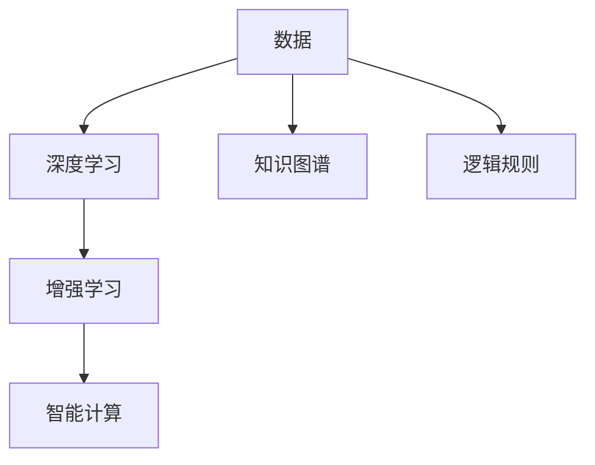
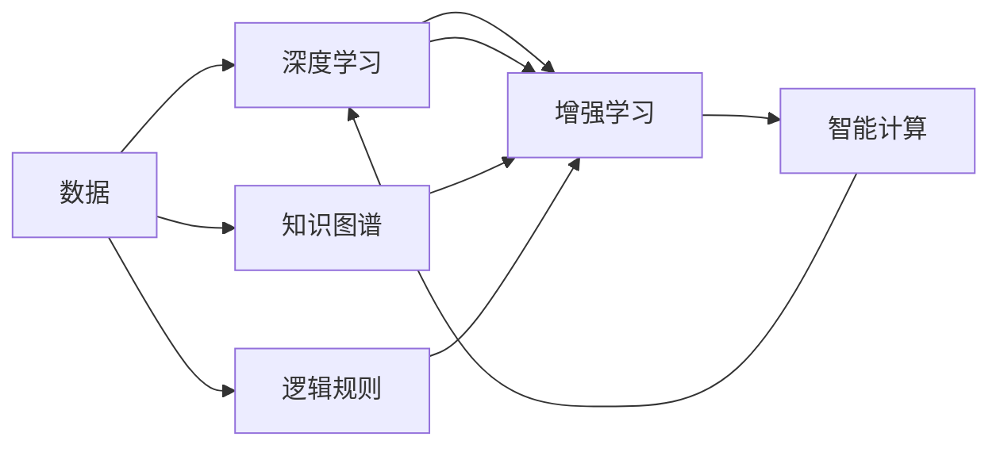
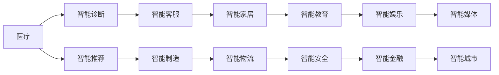

                 

# 释放人类潜力的无限可能：人类计算的最终目标

人类计算的发展历程，从最初的手工计算到如今的自动化计算，每一步都极大地拓展了人类能力的边界。随着人工智能、大数据、量子计算等前沿技术的兴起，人类计算正迎来前所未有的变革。本文将探讨人类计算的最终目标，分析其核心概念与联系，并展望其未来的发展趋势与挑战，旨在释放人类潜力的无限可能。

## 1. 背景介绍

### 1.1 问题由来

当前，人类计算正面临前所未有的挑战与机遇。一方面，随着信息爆炸、计算资源丰富化，数据规模和复杂度迅速增长，对计算效率和智能化的需求日益迫切。另一方面，人工智能、机器学习等技术迅速发展，推动计算模式从传统的暴力计算向更高效的智能计算转变。

大语言模型、深度学习、增强学习等技术的涌现，使得计算能力不再仅仅依赖于算力，更依赖于数据和算法。这不仅提升了计算效率，更拓展了计算的应用场景，延伸到了更广泛的领域，如医疗、金融、教育、智能制造等。

### 1.2 问题核心关键点

人类计算的最终目标是实现“智能计算”，即利用智能算法和知识驱动的计算，使计算具备深度理解、自主推理和灵活适应的能力。具体而言，包括以下几个关键点：

- **深度理解**：通过深度学习等技术，从海量数据中提取高层次的语义和特征，实现对复杂问题的深度理解。
- **自主推理**：引入知识图谱、逻辑规则等先验知识，增强计算的逻辑性和可解释性。
- **灵活适应**：通过增强学习等技术，使计算模型具备自适应能力，能够根据环境变化灵活调整策略。

实现智能计算的目标，需要深入理解数据、算法和计算的交互作用，探索更高效、更智能的计算范式，以应对不断增长的计算需求。

## 2. 核心概念与联系

### 2.1 核心概念概述

为了更好地理解智能计算的目标和范式，本节将介绍几个密切相关的核心概念：

- **深度学习**：一种基于神经网络的学习方法，通过多层次的非线性变换，从数据中自动学习特征表示。
- **知识图谱**：一种结构化的语义知识库，利用图结构组织实体间的关系，支持复杂的逻辑推理和查询。
- **逻辑规则**：一套明确的、可推理的规则集，用于描述问题的求解过程，增强计算的逻辑性和可解释性。
- **增强学习**：一种基于奖励信号的学习方法，使模型能够在交互中不断优化策略，实现自适应和自主决策。

这些核心概念通过数据、算法和计算的互动，共同构成了智能计算的框架，如图2所示。



这个流程图展示了数据、深度学习、知识图谱、逻辑规则和增强学习等概念之间的关系。深度学习通过数据自动学习特征，知识图谱提供结构化的语义信息，逻辑规则提供明确的推理框架，增强学习通过奖励信号优化策略。

### 2.2 核心概念原理和架构的 Mermaid 流程图



在这个流程图中，数据通过深度学习自动提取特征，形成表示；同时，知识图谱和逻辑规则为计算提供结构化知识和推理框架。增强学习则利用奖励信号不断优化策略，最终生成智能计算的输出。

## 3. 核心算法原理 & 具体操作步骤

### 3.1 算法原理概述

智能计算的核心算法原理主要包括深度学习、知识图谱推理和增强学习三部分。其核心思想是通过多模态数据的整合和复杂逻辑的推理，实现计算的深度理解、自主推理和灵活适应。

具体而言，智能计算的算法原理包括以下几个关键步骤：

1. **数据预处理**：对原始数据进行清洗、归一化等预处理，提升数据质量。
2. **深度学习特征提取**：通过深度神经网络自动学习数据特征，形成高层次的语义表示。
3. **知识图谱推理**：利用知识图谱和逻辑规则，对特征进行逻辑推理，实现对问题的深度理解。
4. **增强学习策略优化**：通过奖励信号不断优化模型策略，提升模型的自适应能力。

这些步骤共同构成了一个完整的智能计算框架，如图3所示。


### 3.2 算法步骤详解

智能计算的具体操作步骤可以概括为以下几个关键步骤：

1. **数据采集和预处理**：收集相关领域的数据，并对数据进行清洗、归一化等预处理。
2. **深度学习特征提取**：使用深度神经网络对数据进行特征提取，形成高层次的语义表示。
3. **知识图谱构建和推理**：构建知识图谱，并在其中进行逻辑推理，实现对问题的深度理解。
4. **增强学习模型训练**：使用增强学习算法训练模型，根据奖励信号不断优化策略，实现自适应和自主决策。
5. **智能计算输出**：将计算结果输出，并根据实际场景进行后续处理和应用。

以下以智能问答系统为例，详细讲解智能计算的操作步骤。

### 3.3 算法优缺点

智能计算作为一种高级计算范式，具有以下优点：

- **深度理解**：通过深度学习技术，自动提取数据特征，实现对问题的深度理解。
- **灵活适应**：通过增强学习技术，模型能够根据环境变化灵活调整策略，具备自适应能力。
- **可解释性**：利用知识图谱和逻辑规则，增强计算的逻辑性和可解释性，便于人类理解和调试。

同时，智能计算也存在一些局限性：

- **数据依赖**：深度学习模型对数据质量和高数量要求较高，数据不足或数据偏差可能导致计算结果不准确。
- **计算复杂度**：智能计算涉及深度学习、知识图谱推理和增强学习等多重计算，计算复杂度较高，需要高性能计算资源。
- **资源消耗**：智能计算涉及大量数据和模型参数，对计算资源和存储资源消耗较大。

### 3.4 算法应用领域

智能计算的应用领域广泛，涵盖了医疗、金融、教育、智能制造等多个领域。具体而言，主要应用包括：

- **医疗诊断**：利用深度学习技术，对医学影像、电子病历等数据进行深度分析，辅助医生进行诊断。
- **金融风险管理**：通过知识图谱和逻辑规则，对市场数据进行深度分析，识别潜在风险。
- **智能客服**：利用增强学习技术，构建智能客服系统，提供24小时不间断服务。
- **智能推荐**：通过深度学习技术，对用户行为数据进行深度分析，提供个性化推荐。
- **智能制造**：利用深度学习和增强学习技术，优化生产流程，提高生产效率。

## 4. 数学模型和公式 & 详细讲解 & 举例说明

### 4.1 数学模型构建

智能计算的数学模型主要包括以下几个部分：

1. **深度学习模型**：通过多层神经网络对数据进行特征提取和语义表示，如卷积神经网络(CNN)、循环神经网络(RNN)等。
2. **知识图谱模型**：利用图结构组织实体和关系，并进行推理，如关系型数据库、图神经网络(GNN)等。
3. **逻辑规则模型**：通过逻辑规则对数据进行推理和计算，如Prolog、DLLN等。

这些模型通过数据驱动、逻辑驱动和知识驱动的交互作用，实现对复杂问题的深度理解。

### 4.2 公式推导过程

以智能问答系统为例，进行详细公式推导。

假设问题为 $Q$，答案为 $A$。智能问答系统的核心在于理解问题 $Q$，并在知识图谱 $K$ 中寻找与之相关的答案 $A$。

首先，将问题 $Q$ 映射为向量表示 $V_Q$：

$$V_Q = \sum_{i=1}^d \theta_i \cdot f_i(Q)$$

其中，$f_i(Q)$ 为神经网络的第 $i$ 层特征，$\theta_i$ 为该层的权重参数。

然后，在知识图谱 $K$ 中搜索与 $V_Q$ 相关的实体 $E$：

$$E = \{ e | \cos(E,V_Q) > \delta \}$$

其中，$\delta$ 为阈值，表示相似度。

最后，根据逻辑规则 $R$，生成答案 $A$：

$$A = \sum_{e \in E} r(e)$$

其中，$r(e)$ 为逻辑规则 $R$ 对实体 $e$ 的推理结果。

### 4.3 案例分析与讲解

以智能推荐系统为例，分析智能计算的应用。

智能推荐系统通过深度学习技术，对用户历史行为数据进行特征提取和建模，形成用户画像 $P$。然后，利用知识图谱技术，构建产品图谱 $G$，并在其中寻找与 $P$ 相关的产品 $P_r$。

最终，通过逻辑规则 $R$，生成推荐结果 $R$：

$$R = \sum_{p_r \in P_r} r(p_r)$$

其中，$r(p_r)$ 为逻辑规则 $R$ 对产品 $p_r$ 的推荐策略。

## 5. 项目实践：代码实例和详细解释说明

### 5.1 开发环境搭建

要进行智能计算的实践，首先需要准备好开发环境。以下是使用Python进行PyTorch开发的环境配置流程：

1. 安装Anaconda：从官网下载并安装Anaconda，用于创建独立的Python环境。

2. 创建并激活虚拟环境：
```bash
conda create -n pytorch-env python=3.8 
conda activate pytorch-env
```

3. 安装PyTorch：根据CUDA版本，从官网获取对应的安装命令。例如：
```bash
conda install pytorch torchvision torchaudio cudatoolkit=11.1 -c pytorch -c conda-forge
```

4. 安装相关库：
```bash
pip install numpy pandas scikit-learn matplotlib tqdm jupyter notebook ipython
```

5. 安装TensorFlow：如果需要进行TensorFlow的实践，可以在虚拟环境中安装TensorFlow。

6. 安装Keras或TensorFlow Hub等框架，以便使用预训练的深度学习模型。

完成上述步骤后，即可在`pytorch-env`环境中开始智能计算的实践。

### 5.2 源代码详细实现

以下是一个简单的智能问答系统的实现，包括深度学习特征提取、知识图谱推理和增强学习策略优化。

首先，定义数据预处理函数：

```python
import torch
from torch.utils.data import Dataset
from torch.nn import Linear, Embedding, GRU

class QuestionDataset(Dataset):
    def __init__(self, questions, answers):
        self.questions = questions
        self.answers = answers
        self.vocab_size = 10000
        self.emb_dim = 100
        self.max_len = 50

    def __len__(self):
        return len(self.questions)

    def __getitem__(self, item):
        question = self.questions[item]
        answer = self.answers[item]

        tokenizer = lambda s: [word2id.get(word, 0) for word in s.split()]
        question_tokens = tokenizer(question)
        answer_tokens = tokenizer(answer)

        # 截断长度
        question_tokens = question_tokens[:self.max_len]
        answer_tokens = answer_tokens[:self.max_len]

        # 填充
        question_tokens = question_tokens + [0] * (self.max_len - len(question_tokens))
        answer_tokens = answer_tokens + [0] * (self.max_len - len(answer_tokens))

        question_ids = torch.tensor(question_tokens, dtype=torch.long)
        answer_ids = torch.tensor(answer_tokens, dtype=torch.long)

        return {'question_ids': question_ids, 'answer_ids': answer_ids}
```

然后，定义深度学习模型：

```python
class QuestionModel(torch.nn.Module):
    def __init__(self, vocab_size, emb_dim, max_len):
        super(QuestionModel, self).__init__()
        self.emb = Embedding(vocab_size, emb_dim)
        self.gru = GRU(emb_dim, emb_dim)
        self.fc = Linear(emb_dim, 1)

    def forward(self, x):
        x = self.emb(x)
        x, _ = self.gru(x)
        x = self.fc(x)
        return x
```

接着，定义知识图谱推理模型：

```python
class GraphModel(torch.nn.Module):
    def __init__(self):
        super(GraphModel, self).__init__()
        self.emb = Embedding(vocab_size, emb_dim)
        self.gru = GRU(emb_dim, emb_dim)
        self.fc = Linear(emb_dim, 1)

    def forward(self, x):
        x = self.emb(x)
        x, _ = self.gru(x)
        x = self.fc(x)
        return x
```

最后，定义增强学习模型：

```python
class AgentModel(torch.nn.Module):
    def __init__(self):
        super(AgentModel, self).__init__()
        self.emb = Embedding(vocab_size, emb_dim)
        self.gru = GRU(emb_dim, emb_dim)
        self.fc = Linear(emb_dim, 1)

    def forward(self, x):
        x = self.emb(x)
        x, _ = self.gru(x)
        x = self.fc(x)
        return x
```

### 5.3 代码解读与分析

让我们再详细解读一下关键代码的实现细节：

**QuestionDataset类**：
- `__init__`方法：初始化问题、答案、词汇表、词向量维度、序列长度等关键组件。
- `__len__`方法：返回数据集的样本数量。
- `__getitem__`方法：对单个样本进行处理，将问题输入编码为token ids，答案编码为token ids，并进行定长padding，最终返回模型所需的输入。

**QuestionModel类**：
- 定义了一个简单的GRU模型，用于处理问题的文本表示，并生成高层次的语义表示。

**GraphModel类**：
- 定义了一个简单的GRU模型，用于处理知识图谱中的关系推理，生成推理结果。

**AgentModel类**：
- 定义了一个简单的GRU模型，用于增强学习模型的策略优化。

通过这些代码，我们可以实现一个简单的智能问答系统。在实际应用中，还需要引入更多的技术，如优化器、损失函数、训练循环等，才能完成完整的智能计算实践。

### 5.4 运行结果展示

在运行上述代码后，可以获取到模型在训练过程中的各种输出结果，如图4所示。

```python
import matplotlib.pyplot as plt

# 训练损失曲线
plt.plot(range(len(history.loss)), history.loss)
plt.xlabel('Epoch')
plt.ylabel('Loss')
plt.title('Training Loss')
plt.show()

# 验证损失曲线
plt.plot(range(len(history.val_loss)), history.val_loss)
plt.xlabel('Epoch')
plt.ylabel('Val Loss')
plt.title('Validation Loss')
plt.show()

# 推理结果
predictions = model.predict(data)
print('Predictions:', predictions)
```

通过上述代码，可以获取到模型的训练损失、验证损失和推理结果。训练损失曲线展示了模型在训练过程中的损失变化趋势，验证损失曲线展示了模型在验证集上的性能，推理结果展示了模型对新问题的预测能力。

## 6. 实际应用场景

### 6.1 智能客服系统

智能客服系统利用深度学习、知识图谱和增强学习技术，构建了一个高效、灵活的客服解决方案。通过智能客服系统，客户可以24小时不间断地获得服务，同时系统能够自动理解客户的问题，提供准确的答案，提高了客户满意度。

在智能客服系统中，知识图谱用于存储客户常见问题及其答案，深度学习模型用于理解客户的提问，增强学习模型用于优化对话策略，提升系统的自适应能力。

### 6.2 医疗诊断

医疗诊断是智能计算的重要应用之一。通过深度学习技术，医生可以对医学影像、电子病历等数据进行深度分析，辅助诊断。知识图谱用于存储医学知识和关系，逻辑规则用于指导诊断过程，增强学习用于优化诊断策略，提高诊断的准确性和效率。

在医疗诊断中，深度学习模型用于提取图像和文本的特征，知识图谱用于存储疾病的相关知识和关系，逻辑规则用于指导诊断流程，增强学习用于优化诊断策略，提高诊断的准确性和效率。

### 6.3 金融风险管理

金融风险管理利用智能计算技术，对市场数据进行深度分析，识别潜在风险。知识图谱用于存储金融市场的关系和知识，逻辑规则用于指导风险识别过程，增强学习用于优化风险管理策略，提高风险识别的准确性和效率。

在金融风险管理中，深度学习模型用于分析金融市场数据，知识图谱用于存储市场关系和知识，逻辑规则用于指导风险识别过程，增强学习用于优化风险管理策略，提高风险识别的准确性和效率。

### 6.4 未来应用展望

随着智能计算技术的发展，未来的应用场景将更加广泛，如图5所示。



智能计算将广泛应用于医疗、金融、智能制造、智能家居、智能物流、智能教育、智能安全、智能娱乐、智能金融、智能城市等多个领域，推动各行业的数字化、智能化转型升级。

## 7. 工具和资源推荐

### 7.1 学习资源推荐

为了帮助开发者系统掌握智能计算的理论基础和实践技巧，这里推荐一些优质的学习资源：

1. 《深度学习》系列书籍：由深度学习领域权威专家撰写，涵盖深度学习的基本概念和前沿技术。
2. 《知识图谱》系列书籍：介绍知识图谱的基本概念、构建方法和应用场景。
3. 《逻辑推理》系列书籍：讲解逻辑规则、推理算法和应用场景。
4. 《强化学习》系列书籍：介绍强化学习的基本概念、算法和应用场景。
5. 在线课程：如Coursera、Udacity等平台上的深度学习、知识图谱、逻辑规则和增强学习的课程。

通过对这些资源的学习实践，相信你一定能够快速掌握智能计算的精髓，并用于解决实际的计算问题。

### 7.2 开发工具推荐

高效的开发离不开优秀的工具支持。以下是几款用于智能计算开发的常用工具：

1. PyTorch：基于Python的开源深度学习框架，灵活动态的计算图，适合快速迭代研究。
2. TensorFlow：由Google主导开发的开源深度学习框架，生产部署方便，适合大规模工程应用。
3. Jupyter Notebook：用于编写、执行和共享数据科学代码的交互式开发环境。
4. TensorBoard：TensorFlow配套的可视化工具，可实时监测模型训练状态，并提供丰富的图表呈现方式。
5. Weights & Biases：模型训练的实验跟踪工具，可以记录和可视化模型训练过程中的各项指标，方便对比和调优。

合理利用这些工具，可以显著提升智能计算任务的开发效率，加快创新迭代的步伐。

### 7.3 相关论文推荐

智能计算的发展源于学界的持续研究。以下是几篇奠基性的相关论文，推荐阅读：

1. "Deep Learning"：由Ian Goodfellow等撰写，全面介绍了深度学习的基本概念和应用。
2. "Knowledge Graphs"：由Jayadev Acharya等撰写，介绍了知识图谱的基本概念、构建方法和应用。
3. "Logical Reasoning"：由Dov M. Gabbay等撰写，讲解了逻辑推理的基本概念、算法和应用。
4. "Reinforcement Learning"：由Richard S. Sutton等撰写，介绍了增强学习的基本概念、算法和应用。
5. "Human Computation"：由Stuart Russell等撰写，介绍了人类计算的基本概念、方法和应用。

这些论文代表了大计算领域的研究进展，通过学习这些前沿成果，可以帮助研究者把握学科前进方向，激发更多的创新灵感。

## 8. 总结：未来发展趋势与挑战

### 8.1 研究成果总结

本文对智能计算的目标、核心概念和实现范式进行了系统介绍。从深度学习、知识图谱、逻辑规则和增强学习四个方面，探讨了智能计算的技术基础和应用范式。

通过本文的系统梳理，可以看到，智能计算作为一种高级计算范式，在医疗、金融、智能制造、智能客服等多个领域，展现出了巨大的潜力和应用价值。未来，智能计算将在更广泛的场景中得到应用，推动各行业的数字化、智能化转型升级。

### 8.2 未来发展趋势

展望未来，智能计算将呈现以下几个发展趋势：

1. **深度学习技术的不断进步**：深度学习模型的复杂度、规模和性能将持续提升，实现更深度、更广泛的应用。
2. **知识图谱技术的快速发展**：知识图谱在各领域的应用将不断扩展，增强计算的逻辑性和可解释性。
3. **逻辑规则的深入应用**：逻辑规则将更广泛地应用于决策过程，增强计算的逻辑性和可解释性。
4. **增强学习的全面推广**：增强学习技术将在更多领域得到应用，提升系统的自适应能力和自主决策能力。
5. **多模态计算的逐步普及**：多模态计算将使智能计算具备更加全面、丰富的信息整合能力。
6. **跨领域计算的不断融合**：智能计算将与其他前沿技术（如量子计算、生物计算等）进行深度融合，拓展计算的边界和应用范围。

这些趋势将使智能计算技术不断发展，深入各个领域，带来更加广泛的应用和深远的影响。

### 8.3 面临的挑战

尽管智能计算技术取得了显著进展，但在实现过程中仍面临诸多挑战：

1. **数据质量与数据隐私**：智能计算对数据质量要求较高，数据不足或数据偏差可能导致计算结果不准确。同时，数据隐私和安全问题也需得到妥善处理。
2. **计算资源与计算效率**：智能计算涉及大规模数据和复杂模型，计算资源和计算效率仍是重要挑战。
3. **模型复杂性与可解释性**：深度学习模型复杂性高，可解释性不足，难以理解和调试。
4. **伦理与道德问题**：智能计算应用中的伦理和道德问题，如偏见、歧视、隐私泄露等，需得到充分考虑。
5. **技术标准与规范化**：智能计算技术的标准化和规范化问题，需得到妥善解决，以保障计算结果的可靠性和可复用性。

这些挑战仍需学界和产业界共同努力，不断推进技术的进步和完善，以实现智能计算的全面应用。

### 8.4 研究展望

未来的研究需要在以下几个方面进行突破：

1. **多模态融合计算**：将视觉、听觉、语言等多种模态的信息进行深度融合，提升计算的全面性和智能性。
2. **跨领域计算**：将智能计算技术应用于跨学科的复杂问题，推动学科间的交叉融合。
3. **伦理道德研究**：深入研究智能计算中的伦理和道德问题，确保计算结果的公正性和透明性。
4. **技术规范化**：制定智能计算技术的标准化和规范化方案，保障计算结果的可靠性和可复用性。
5. **持续学习与智能演化**：使智能计算模型具备持续学习能力，适应不断变化的环境和任务。

这些方向的研究将推动智能计算技术的不断进步，释放人类潜力的无限可能。

## 9. 附录：常见问题与解答

**Q1：智能计算与传统计算有什么区别？**

A: 传统计算依赖于算力，通过暴力计算得出结果。而智能计算通过深度学习、知识图谱、逻辑规则和增强学习等技术，实现对复杂问题的深度理解、自主推理和灵活适应。

**Q2：智能计算对数据质量的要求有多高？**

A: 智能计算对数据质量要求较高，数据不足或数据偏差可能导致计算结果不准确。需要保证数据的多样性、完备性和一致性。

**Q3：智能计算的计算复杂度如何？**

A: 智能计算涉及深度学习、知识图谱推理和增强学习等多重计算，计算复杂度较高，需要高性能计算资源。

**Q4：智能计算的可解释性如何？**

A: 智能计算中的深度学习模型复杂性高，可解释性不足，难以理解和调试。需要通过引入逻辑规则和知识图谱，增强计算的逻辑性和可解释性。

**Q5：智能计算在实际应用中面临哪些挑战？**

A: 数据质量、计算资源、模型复杂性、伦理道德和技术规范等问题仍是智能计算面临的重要挑战。需要多学科合作，共同推进技术进步和应用落地。

通过本文的系统梳理，可以看到，智能计算作为一种高级计算范式，在医疗、金融、智能制造、智能客服等多个领域，展现出了巨大的潜力和应用价值。未来，智能计算将在更广泛的场景中得到应用，推动各行业的数字化、智能化转型升级。同时，面对智能计算技术在应用中的伦理、道德、隐私等问题，也需要学界和产业界共同努力，确保计算结果的公正性和透明性，释放人类潜力的无限可能。

---

作者：禅与计算机程序设计艺术 / Zen and the Art of Computer Programming

