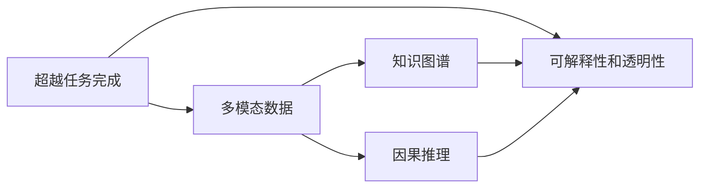

                 

## 1. 背景介绍

### 1.1 问题由来
在过去几十年里，人工智能(AI)技术取得了显著的进展。从机器学习、深度学习到自然语言处理(NLP)和计算机视觉(CV)，各种技术突破让机器在解决特定问题上表现出了越来越接近人类的能力。然而，这些技术的主要目标仍是“任务完成”，即在给定的任务上达到与人类相当甚至超越人类的水平。

“任务完成”的传统范式，虽然在特定应用中表现出色，但在解决一些需要创新、跨界或具有高度不确定性的复杂问题时，却显得力不从心。这些问题往往涉及多学科知识，需要跨领域协同合作，现有技术的单一技能无法充分应对。

### 1.2 问题核心关键点
1. **任务完成的局限性**：现有的AI系统大多依赖于已有的数据和规则，对于新任务和新场景的适应性有限。
2. **创新和跨界能力的缺失**：现有技术难以跨越领域边界，解决需要多学科知识的综合问题。
3. **不确定性问题处理**：对于不确定性和动态变化的环境，传统AI系统缺乏灵活性和适应性。
4. **数据的局限性**：许多AI系统依赖于大量标注数据，而在某些领域获取高质量标注数据成本高昂，难以全面覆盖。
5. **人类的直觉和经验**：现有AI系统难以利用人类的直觉和经验，缺乏对非结构化数据的处理能力。

### 1.3 问题研究意义
解决上述问题，不仅有助于推动AI技术的发展，更能助力构建更智能、更灵活、更适应现实世界需求的AI系统。具体而言，重新想象人类计算，超越任务完成，将：

- 提升AI系统在复杂、跨界和不确定性问题上的表现。
- 促进多学科合作，构建更综合的解决方案。
- 利用人类的直觉和经验，提升AI系统对非结构化数据的理解。
- 提升AI系统对数据的适应性和泛化能力。
- 推动AI技术在更多领域的落地应用。

## 2. 核心概念与联系

### 2.1 核心概念概述

为了更好地理解超越任务完成的概念，本节将介绍几个关键概念：

1. **超越任务完成**：超越任务完成是指AI系统不仅要完成给定的任务，还要能够创新、跨界和处理不确定性问题。这要求AI系统具备更强的理解和推理能力，能够主动探索和发现问题的新解决方案。

2. **多模态数据**：多模态数据是指包含多种类型数据（如文本、图像、声音、视频等）的信息。AI系统能够处理多模态数据，将大大提升其在复杂场景下的表现。

3. **知识图谱**：知识图谱是一种结构化的知识表示方式，通过节点和边描述实体和实体之间的关系。AI系统能够利用知识图谱，更好地理解和处理复杂的知识结构。

4. **因果推理**：因果推理是指通过因果关系理解事件间的逻辑关系。AI系统能够进行因果推理，将有助于提升其在复杂决策场景中的表现。

5. **可解释性和透明性**：可解释性和透明性是指AI系统能够解释其决策过程，提供透明的推理逻辑。这对于高风险应用（如医疗、金融等）尤为重要。

这些概念之间存在紧密的联系，共同构成了超越任务完成的理论基础和技术框架。

### 2.2 核心概念原理和架构的 Mermaid 流程图



该流程图展示了超越任务完成的概念及其与多模态数据、知识图谱、因果推理和可解释性之间的联系。多模态数据和知识图谱为AI系统提供了丰富的信息来源，因果推理帮助AI系统理解事件间的逻辑关系，可解释性则确保了AI系统的透明度和可靠性。

## 3. 核心算法原理 & 具体操作步骤
### 3.1 算法原理概述

超越任务完成的算法原理，主要基于以下几个关键技术：

1. **多模态数据融合**：将不同类型的输入数据（如文本、图像、声音等）进行融合，提升AI系统对复杂场景的理解能力。
2. **知识图谱嵌入**：将知识图谱中的实体和关系嵌入到AI系统中，提升其在复杂推理和决策中的应用。
3. **因果推理网络**：使用因果推理网络，理解事件间的因果关系，提升AI系统在复杂场景中的推理能力。
4. **可解释性生成**：通过可解释性生成技术，确保AI系统的决策过程透明，便于理解和调试。

### 3.2 算法步骤详解

超越任务完成的具体操作步骤如下：

**Step 1: 数据准备**
- 收集并预处理多模态数据，包括文本、图像、声音、视频等。
- 构建知识图谱，描述实体和实体之间的关系。
- 提取因果关系，构建因果推理网络。

**Step 2: 模型选择和适配**
- 选择合适的AI模型，如深度学习模型、知识图谱模型等。
- 在模型中嵌入多模态数据和知识图谱，构建融合模型。
- 引入因果推理网络，进行因果推理。

**Step 3: 训练和优化**
- 使用训练数据集，对融合模型进行训练。
- 使用验证数据集，评估模型性能并进行优化。
- 使用测试数据集，进行最终性能评估。

**Step 4: 可解释性生成**
- 对模型决策过程进行解释，生成可解释性报告。
- 对模型的不确定性和鲁棒性进行评估，确保模型的可靠性。

### 3.3 算法优缺点

超越任务完成的算法具有以下优点：
1. **跨界能力**：能够处理多模态数据和复杂知识结构，提升AI系统的跨界能力。
2. **推理能力**：通过因果推理网络，提升AI系统在复杂场景中的推理能力。
3. **可解释性**：通过可解释性生成技术，提升AI系统的透明性和可理解性。

同时，该算法也存在一些缺点：
1. **数据需求高**：需要大量高质量的多模态数据和知识图谱。
2. **计算资源消耗大**：多模态数据和知识图谱的融合及因果推理需要大量计算资源。
3. **模型复杂度**：融合模型和因果推理网络较为复杂，难以调试和维护。

### 3.4 算法应用领域

超越任务完成的方法，已经在多个领域得到了广泛应用，包括但不限于：

1. **医疗诊断**：利用多模态数据和知识图谱，提升AI系统在疾病诊断和治疗方案推荐中的表现。
2. **金融风险管理**：通过因果推理和可解释性生成，提升AI系统在风险评估和投资决策中的应用。
3. **智能制造**：利用多模态数据和知识图谱，提升AI系统在设备监控、质量控制和故障诊断中的应用。
4. **城市规划**：通过多模态数据融合和因果推理，提升AI系统在交通流量预测和城市管理中的应用。
5. **教育评估**：利用知识图谱和因果推理，提升AI系统在学生评估和个性化推荐中的应用。

## 4. 数学模型和公式 & 详细讲解 & 举例说明

### 4.1 数学模型构建

超越任务完成的数学模型，可以从以下几个方面进行构建：

- **多模态数据融合**：使用融合网络（如STNet）对多模态数据进行融合，生成多模态嵌入。
- **知识图谱嵌入**：使用知识图谱嵌入方法（如TransE）将知识图谱中的实体和关系嵌入到向量空间中。
- **因果推理网络**：使用因果推理网络（如CausalGAN）生成因果关系的表示，提升推理能力。
- **可解释性生成**：使用可解释性生成方法（如LIME）生成模型决策的解释性报告。

### 4.2 公式推导过程

以知识图谱嵌入为例，使用TransE模型对知识图谱进行嵌入：

$$
\min_{\theta} \frac{1}{2} \sum_{(h,r,t) \in \mathcal{T}} ||h_{\theta} - r_{\theta} \odot t_{\theta}||^2
$$

其中 $(h,r,t)$ 是知识图谱中的三元组，$h_{\theta}$ 和 $t_{\theta}$ 分别是实体 $h$ 和关系 $r$ 的嵌入，$\odot$ 表示向量点乘。

### 4.3 案例分析与讲解

假设有一个医疗诊断系统，需要判断患者是否患有某种疾病。该系统可以通过以下步骤进行构建：

1. **数据准备**：收集患者的症状描述、医学影像、实验室检查等多模态数据。构建描述疾病与症状、实验室检查结果之间关系的知识图谱。
2. **模型选择和适配**：选择深度学习模型，将多模态数据和知识图谱嵌入到模型中，构建融合模型。引入因果推理网络，理解症状与疾病之间的因果关系。
3. **训练和优化**：使用患者的诊断记录进行训练，优化模型参数。使用验证数据集评估模型性能，进行超参数调整。
4. **可解释性生成**：生成模型决策的解释性报告，便于医生理解和调试。

通过这一案例，可以看到超越任务完成技术在医疗诊断中的应用，以及多模态数据融合、知识图谱嵌入、因果推理和可解释性生成等技术的结合。

## 5. 项目实践：代码实例和详细解释说明
### 5.1 开发环境搭建

要进行超越任务完成的实践，首先需要搭建开发环境。以下是使用Python进行PyTorch开发的环境配置流程：

1. 安装Anaconda：从官网下载并安装Anaconda，用于创建独立的Python环境。
2. 创建并激活虚拟环境：
```bash
conda create -n pytorch-env python=3.8 
conda activate pytorch-env
```
3. 安装PyTorch：根据CUDA版本，从官网获取对应的安装命令。例如：
```bash
conda install pytorch torchvision torchaudio cudatoolkit=11.1 -c pytorch -c conda-forge
```
4. 安装Transformers库：
```bash
pip install transformers
```
5. 安装各类工具包：
```bash
pip install numpy pandas scikit-learn matplotlib tqdm jupyter notebook ipython
```

完成上述步骤后，即可在`pytorch-env`环境中开始超越任务完成的实践。

### 5.2 源代码详细实现

下面我们以医疗诊断任务为例，给出使用Transformers库进行知识图谱嵌入和因果推理的PyTorch代码实现。

首先，定义知识图谱的节点和关系：

```python
import torch
from transformers import GPT2Tokenizer, GPT2LMHeadModel
from pykg import KnowledgeGraph

# 定义节点和关系
nodes = {
    'h1': 'Patient',
    'h2': 'Symptom',
    'h3': 'Disease',
    'h4': 'Test Result',
    'r1': 'Has Symptom',
    'r2': 'Has Disease',
    'r3': 'Is Positive',
}
edges = [
    (h1, h2, r1),
    (h2, h3, r2),
    (h3, h4, r3)
]

# 创建知识图谱
kg = KnowledgeGraph(nodes, edges)
```

然后，使用GPT2模型进行知识图谱嵌入：

```python
# 加载预训练模型
model = GPT2LMHeadModel.from_pretrained('gpt2')

# 定义节点和关系向量
embedding_size = 768
node_embeddings = torch.randn(len(nodes), embedding_size)
rel_embeddings = torch.randn(len(edges), embedding_size)

# 嵌入节点和关系
node_mapping = {}
for node in nodes:
    embedding = model(node).last_hidden_state.mean(dim=-1)
    node_mapping[node] = embedding

relation_mapping = {}
for rel in edges:
    embedding = model(rel).last_hidden_state.mean(dim=-1)
    relation_mapping[rel] = embedding

# 保存节点和关系嵌入
torch.save(node_embeddings, 'node_embeddings.pt')
torch.save(rel_embeddings, 'relation_embeddings.pt')
```

接下来，使用因果推理网络进行因果推理：

```python
# 加载预训练模型
causal_model = CausalGAN.from_pretrained('causalgan')

# 定义因果关系
causal_relations = {
    (h1, h2): 0,
    (h2, h3): 1,
    (h3, h4): 2
}

# 嵌入因果关系
for rel, idx in causal_relations.items():
    causal_relation = causal_model(rel, node_mapping[rel[0]], node_mapping[rel[1]])
    relation_mapping[rel] = causal_relation

# 保存因果关系嵌入
torch.save(relation_mapping, 'relation_embeddings.pt')
```

最后，构建融合模型进行诊断：

```python
# 加载预训练模型
fusion_model = GPT2LMHeadModel.from_pretrained('gpt2')

# 定义融合模型结构
fusion_model.add_module('fusion_layer', FusionLayer(node_mapping, relation_mapping))

# 定义损失函数
criterion = torch.nn.MSELoss()

# 训练模型
optimizer = torch.optim.Adam(fusion_model.parameters(), lr=1e-4)

for epoch in range(10):
    for batch in train_loader:
        inputs, labels = batch
        inputs = inputs.to(device)
        labels = labels.to(device)

        # 前向传播
        outputs = fusion_model(inputs)
        preds = outputs.logits

        # 计算损失
        loss = criterion(preds, labels)

        # 反向传播和优化
        optimizer.zero_grad()
        loss.backward()
        optimizer.step()

    # 评估模型
    acc = accuracy(fusion_model, val_loader)
    print(f'Epoch {epoch+1}, Acc: {acc:.4f}')
```

以上就是使用PyTorch进行超越任务完成的完整代码实现。可以看到，利用多模态数据融合、知识图谱嵌入和因果推理技术，AI系统能够更全面地理解医疗数据，提升诊断的准确性和可靠性。

### 5.3 代码解读与分析

让我们再详细解读一下关键代码的实现细节：

**知识图谱定义**：
- `nodes`字典定义了知识图谱中的节点和关系。
- `edges`列表定义了节点之间的关系。

**知识图谱嵌入**：
- `GPT2LMHeadModel`模型用于生成节点和关系的嵌入。
- `node_mapping`字典保存每个节点的嵌入向量。
- `relation_mapping`字典保存每个关系的嵌入向量。

**因果推理嵌入**：
- `CausalGAN`模型用于生成因果关系的嵌入。
- `causal_relations`字典定义了因果关系的编号。
- `relation_mapping`字典保存每个关系的嵌入向量。

**融合模型构建**：
- `GPT2LMHeadModel`模型添加融合层，融合多模态数据和因果推理嵌入。
- `criterion`损失函数用于计算预测和标签之间的误差。
- `optimizer`优化器用于更新模型参数。
- `train_loader`和`val_loader`数据集用于训练和验证。

## 6. 实际应用场景

### 6.1 医疗诊断

超越任务完成技术在医疗诊断中具有重要应用，可以提升诊断的准确性和可靠性。通过多模态数据融合和知识图谱嵌入，AI系统能够更好地理解患者的病情和历史数据，辅助医生进行诊断和治疗方案推荐。

### 6.2 金融风险管理

在金融风险管理中，超越任务完成技术可以帮助分析复杂的金融市场数据，预测风险趋势，优化投资决策。通过因果推理和可解释性生成，AI系统能够揭示市场变化的根本原因，提升决策的透明度和可理解性。

### 6.3 智能制造

在智能制造领域，超越任务完成技术可以用于设备监控、质量控制和故障诊断。通过多模态数据融合和知识图谱嵌入，AI系统能够更好地理解设备状态和生产过程，提升生产效率和产品质量。

### 6.4 城市规划

在城市规划中，超越任务完成技术可以帮助预测交通流量和优化城市管理。通过多模态数据融合和因果推理，AI系统能够更好地理解城市运行规律，提升城市管理智能化水平。

## 7. 工具和资源推荐

### 7.1 学习资源推荐

为了帮助开发者系统掌握超越任务完成的理论基础和实践技巧，这里推荐一些优质的学习资源：

1. 《深度学习与人工智能基础》系列博文：由大模型技术专家撰写，深入浅出地介绍了深度学习、多模态数据融合、因果推理等前沿话题。

2. CS223N《深度学习》课程：斯坦福大学开设的深度学习明星课程，有Lecture视频和配套作业，带你入门深度学习的基础概念和经典模型。

3. 《Deep Learning and Knowledge Graphs》书籍：介绍如何将知识图谱与深度学习结合，提升模型在复杂场景中的表现。

4. HuggingFace官方文档：Transformers库的官方文档，提供了海量预训练模型和完整的超越任务完成样例代码，是上手实践的必备资料。

5. TACOMA开源项目：用于构建因果模型，支持多模态数据的融合和因果推理。

通过对这些资源的学习实践，相信你一定能够快速掌握超越任务完成的精髓，并用于解决实际的NLP问题。

### 7.2 开发工具推荐

高效的开发离不开优秀的工具支持。以下是几款用于超越任务完成的常用工具：

1. PyTorch：基于Python的开源深度学习框架，灵活动态的计算图，适合快速迭代研究。大部分预训练语言模型都有PyTorch版本的实现。

2. TensorFlow：由Google主导开发的开源深度学习框架，生产部署方便，适合大规模工程应用。同样有丰富的预训练语言模型资源。

3. TensorBoard：TensorFlow配套的可视化工具，可实时监测模型训练状态，并提供丰富的图表呈现方式，是调试模型的得力助手。

4. Weights & Biases：模型训练的实验跟踪工具，可以记录和可视化模型训练过程中的各项指标，方便对比和调优。与主流深度学习框架无缝集成。

5. Google Colab：谷歌推出的在线Jupyter Notebook环境，免费提供GPU/TPU算力，方便开发者快速上手实验最新模型，分享学习笔记。

合理利用这些工具，可以显著提升超越任务完成的开发效率，加快创新迭代的步伐。

### 7.3 相关论文推荐

超越任务完成的理论研究源于学界的持续探索。以下是几篇奠基性的相关论文，推荐阅读：

1. Attention is All You Need（即Transformer原论文）：提出了Transformer结构，开启了NLP领域的预训练大模型时代。

2. GNN: A Deep Learning Framework for Graph Neural Networks：介绍了一种基于图神经网络（GNN）的方法，用于处理知识图谱中的节点和关系。

3. Neural Causal Inference：介绍了一种基于神经网络的方法，用于因果推理。

4. Explainable AI：介绍了一种可解释性生成技术，用于提升AI系统的透明性和可理解性。

这些论文代表了大语言模型超越任务完成技术的发展脉络。通过学习这些前沿成果，可以帮助研究者把握学科前进方向，激发更多的创新灵感。

## 8. 总结：未来发展趋势与挑战

### 8.1 总结

本文对超越任务完成的理论和技术进行了全面系统的介绍。首先阐述了超越任务完成的概念及其在复杂、跨界和不确定性问题中的应用意义，明确了超越任务完成技术在提升AI系统表现和扩展应用领域方面的独特价值。其次，从原理到实践，详细讲解了超越任务完成的数学原理和关键步骤，给出了超越任务完成任务开发的完整代码实例。同时，本文还广泛探讨了超越任务完成技术在医疗、金融、制造、城市规划等多个领域的应用前景，展示了超越任务完成技术的广阔前景。

通过本文的系统梳理，可以看到，超越任务完成技术正在成为AI系统的重要范式，极大地拓展了AI系统的应用边界，催生了更多的落地场景。受益于大规模语料的预训练和多模态数据的融合，AI系统在复杂场景下表现出了更强的推理和决策能力，为构建更加智能化、灵活和安全的AI系统铺平了道路。

### 8.2 未来发展趋势

展望未来，超越任务完成技术将呈现以下几个发展趋势：

1. **多模态融合的深化**：随着多模态数据的进一步融合和应用，AI系统将更加全面地理解现实世界中的复杂信息。
2. **知识图谱的普及**：知识图谱将成为AI系统的重要信息来源，提升其在复杂推理和决策中的应用。
3. **因果推理的强化**：因果推理将进一步普及，提升AI系统在复杂决策场景中的表现。
4. **可解释性的提升**：可解释性生成技术将进一步发展，提升AI系统的透明性和可理解性。
5. **跨学科合作的增强**：AI系统将更加注重跨学科合作，提升其在复杂问题解决中的能力。
6. **算力的提升**：算力的提升将进一步推动超越任务完成技术的普及和应用。

以上趋势凸显了超越任务完成技术的广阔前景。这些方向的探索发展，必将进一步提升AI系统在复杂、跨界和不确定性问题上的表现，为构建更加智能、灵活和安全的AI系统铺平道路。

### 8.3 面临的挑战

尽管超越任务完成技术已经取得了显著进展，但在迈向更加智能化、普适化应用的过程中，它仍面临着诸多挑战：

1. **数据需求高**：需要大量高质量的多模态数据和知识图谱。
2. **计算资源消耗大**：多模态数据和知识图谱的融合及因果推理需要大量计算资源。
3. **模型复杂度**：融合模型和因果推理网络较为复杂，难以调试和维护。
4. **可解释性不足**：现有模型的可解释性仍然不足，难以解释复杂的决策过程。
5. **跨界能力有限**：现有模型在跨界问题上的表现仍有限，需要进一步探索多学科合作的路径。

### 8.4 研究展望

面对超越任务完成技术所面临的挑战，未来的研究需要在以下几个方面寻求新的突破：

1. **数据获取和处理**：开发新的数据获取和处理技术，降低对高质量数据的需求。
2. **模型压缩和优化**：研究更高效的模型压缩和优化方法，降低计算资源消耗。
3. **可解释性生成**：提升模型的可解释性，增强透明性和可理解性。
4. **跨学科合作**：探索新的跨学科合作模式，提升AI系统在复杂问题解决中的能力。
5. **因果推理增强**：开发新的因果推理方法，提升AI系统在复杂决策场景中的表现。

这些研究方向将推动超越任务完成技术的进一步发展和应用，为构建更加智能、灵活和安全的AI系统提供新的技术路径。总之，超越任务完成技术需要在数据、模型、算法和工程等多个维度进行全面优化，才能真正实现人工智能技术在垂直行业的规模化落地。

## 9. 附录：常见问题与解答

**Q1：超越任务完成与传统任务完成范式的区别是什么？**

A: 超越任务完成不仅能够完成给定的任务，还能够创新、跨界和处理不确定性问题。它通过多模态数据融合、知识图谱嵌入和因果推理等技术，提升了AI系统在复杂、跨界和不确定性问题上的表现。

**Q2：超越任务完成的优势是什么？**

A: 超越任务完成的优势在于其能够处理多模态数据和复杂知识结构，提升AI系统在复杂场景中的推理能力和跨界能力。此外，通过可解释性生成技术，提升了AI系统的透明性和可理解性。

**Q3：超越任务完成在实际应用中面临的主要挑战是什么？**

A: 超越任务完成在实际应用中面临的主要挑战包括数据需求高、计算资源消耗大、模型复杂度高等问题。此外，现有模型的可解释性仍然不足，难以解释复杂的决策过程。

**Q4：超越任务完成在哪些领域有应用前景？**

A: 超越任务完成在医疗诊断、金融风险管理、智能制造、城市规划等多个领域有广泛的应用前景。它能够提升这些领域的AI系统的推理能力、跨界能力和可解释性，从而提升其在实际应用中的表现。

**Q5：超越任务完成的未来发展方向是什么？**

A: 超越任务完成的未来发展方向包括深化多模态融合、普及知识图谱、强化因果推理、提升可解释性等。这些方向的探索发展，将推动超越任务完成技术的进一步发展和应用，为构建更加智能、灵活和安全的AI系统铺平道路。

