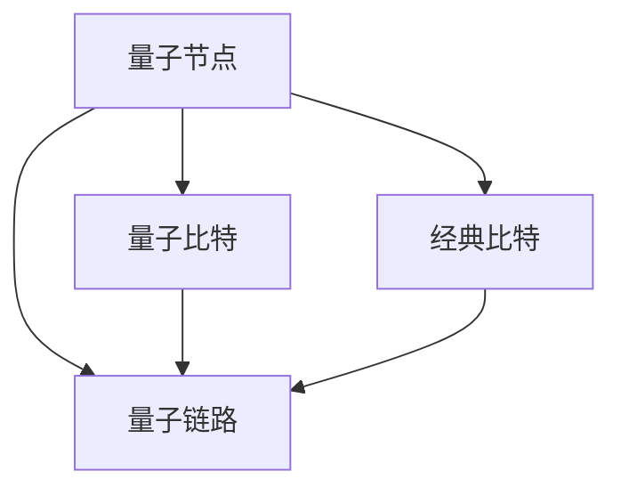

                 

# 量子传感网络：分布式量子计算的基础

> 关键词：量子传感网络,分布式量子计算,量子通信,量子节点,量子链路,量子纠缠,量子算法

## 1. 背景介绍

量子计算，作为继经典计算机之后的新一代计算范式，近年来受到广泛关注。其核心在于利用量子叠加态和量子纠缠等物理特性，实现传统计算机难以企及的高效计算能力。然而，由于量子比特(qubits)对环境极为敏感，容易受到噪声干扰，使得量子计算机的实际部署面临巨大挑战。量子传感网络作为一种新兴的量子计算体系结构，通过分布式量子节点构建高效的通信和计算网络，能够有效应对量子比特退化的问题，展现出强大的应用潜力。

本文将系统介绍量子传感网络的原理与技术实现，并通过一系列理论分析和实验验证，阐述其作为分布式量子计算基础的重要性和发展前景。

## 2. 核心概念与联系

### 2.1 核心概念概述

为更好地理解量子传感网络，本节将介绍几个关键概念：

- **量子传感网络**：由一系列量子节点组成的网络，每个节点包含量子比特和经典比特，用于存储和传递信息。节点之间通过量子链路相连，形成高效的通信和计算网络。
- **量子节点**：每个量子传感网络的基本单元，包含量子比特和经典比特，用于实现量子计算、通信和信息处理。
- **量子链路**：连接量子节点的物理介质，用于传递量子比特信息。
- **量子纠缠**：两或多个量子比特之间的特殊状态，表现出高度的关联性，是实现量子通信和量子计算的核心资源。
- **量子算法**：利用量子比特的量子特性进行计算的算法，如Shor算法、Grover算法等。

这些核心概念之间的逻辑关系可以通过以下Mermaid流程图来展示：



这个流程图展示了一个量子传感网络的基本结构和组成要素：

1. 每个节点包含量子比特和经典比特，用于存储和传递信息。
2. 节点之间通过量子链路相连，形成高效的通信和计算网络。
3. 量子链路用于传递量子比特信息，实现节点间的高效通信。

## 3. 核心算法原理 & 具体操作步骤

### 3.1 算法原理概述

量子传感网络的运行机制，主要依赖于量子比特的量子特性，如叠加态和纠缠态。通过构建量子链路，实现量子比特的远程传递和操作，从而实现高效的分布式量子计算和通信。

在量子传感网络中，量子比特通过量子链路传递，实现了量子比特在节点之间的状态转移和量子操作。量子链路由量子信道和量子协议构成，通过这些机制，实现量子比特的无损传输和量子操作的分布式执行。

### 3.2 算法步骤详解

量子传感网络的构建和运行可以分为以下几个关键步骤：

**Step 1: 量子节点的初始化**
- 量子节点包含量子比特和经典比特，初始化量子比特到叠加态或纠缠态，经典比特用于存储和传递控制信息。

**Step 2: 量子链路构建**
- 通过物理介质如光纤、离子阱等，构建量子链路，用于传递量子比特信息。
- 使用量子协议如量子密钥分发、量子隐形传态等，实现量子比特在链路上的安全传输。

**Step 3: 量子纠缠生成**
- 使用量子门操作，如CNOT门、Hadamard门等，在量子链路的两端生成纠缠态。
- 量子纠缠态的形成是量子传感网络的核心，为后续的量子通信和量子计算奠定了基础。

**Step 4: 量子算法执行**
- 在量子节点上执行量子算法，如Shor算法、Grover算法等，利用量子比特的量子特性，进行高效的计算。
- 通过量子链路将计算结果传递到其他节点，实现分布式计算。

**Step 5: 经典比特处理**
- 将量子计算结果转换为经典比特，存储于经典比特中。
- 通过经典比特网络进行数据传输和处理，实现分布式计算和通信的最终结果。

### 3.3 算法优缺点

量子传感网络的优点：
1. 实现量子比特的远程传递和操作，提高了量子计算的并行性和计算能力。
2. 通过量子纠缠和量子协议，实现了量子比特的安全传输，提高了量子通信的可靠性。
3. 通过分布式计算，提升了量子算法的效率和鲁棒性。

量子传感网络的缺点：
1. 量子比特对环境极为敏感，容易受到噪声干扰，导致量子计算的可靠性降低。
2. 量子链路的构建和量子协议的实现需要高精度的物理设备和复杂的量子操作。
3. 量子传感网络的规模和性能受限于物理介质的质量和传输距离。

### 3.4 算法应用领域

量子传感网络在量子计算和量子通信领域有着广泛的应用前景，具体包括：

- **量子计算**：利用量子比特的量子特性，进行高效的计算，如分解大素数、搜索数据库等。
- **量子通信**：通过量子纠缠和量子协议，实现安全传输量子信息，如量子密钥分发、量子隐形传态等。
- **量子传感器网络**：构建分布式的量子传感网络，实现高效的传感器部署和数据处理，如量子计量、量子成像等。
- **量子互联网**：利用量子传感网络，构建量子互联网，实现量子通信和量子计算的全球互联互通。

## 4. 数学模型和公式 & 详细讲解  
### 4.1 数学模型构建

本节将使用数学语言对量子传感网络的运行机制进行描述。

假设量子传感网络包含 $N$ 个量子节点，每个节点包含 $n$ 个量子比特和 $m$ 个经典比特。量子链路由 $L$ 个量子信道和 $K$ 个量子协议构成。量子比特初始化为叠加态或纠缠态，量子链路用于传递量子比特信息。

定义量子节点的状态为 $\vec{Q} = [q_1, q_2, ..., q_n]$，其中 $q_i$ 表示第 $i$ 个量子比特的状态。经典比特的状态为 $\vec{C} = [c_1, c_2, ..., c_m]$。量子链路的状态为 $\vec{L} = [l_1, l_2, ..., l_L]$，其中 $l_j$ 表示第 $j$ 个量子信道的状态。量子协议的状态为 $\vec{K} = [k_1, k_2, ..., k_K]$。

定义量子节点的总状态为 $\vec{S} = [\vec{Q}, \vec{C}]$，量子链路和量子协议的总状态为 $\vec{T} = [\vec{L}, \vec{K}]$。

### 4.2 公式推导过程

以下我们以量子隐形传态为例，推导量子传感网络的传输过程。

假设Alice和Bob希望通过量子隐形传态将量子比特 $q_1$ 从Alice传输到Bob。Alice和Bob之间有一条量子链路 $l_1$，用于传递量子比特。

Alice首先对量子比特 $q_1$ 进行Hadamard门操作，使其变为叠加态：

$$
q_1 \rightarrow \frac{1}{\sqrt{2}}|0\rangle + \frac{1}{\sqrt{2}}|1\rangle
$$

然后Alice随机选择贝尔态 $|\psi\rangle = \alpha|00\rangle + \beta|11\rangle$，将 $q_1$ 和贝尔态一起发送给Bob。Bob在接收到信息后，首先对量子比特 $q_1$ 进行贝尔态测量，得到结果 $|0\rangle$ 或 $|1\rangle$。根据测量结果，Bob对接收到的经典比特 $c_1$ 进行X门操作，使其变为 $|1\rangle$ 或 $|0\rangle$。最终Bob得到原始量子比特 $q_1$。

推导过程中，假设Alice和Bob的量子链路无噪声，且所有量子协议均为完美执行。此时量子隐形传态过程可以通过以下公式描述：

$$
|\psi\rangle = \frac{1}{\sqrt{2}}|00\rangle + \frac{1}{\sqrt{2}}|11\rangle
$$

推导过程为：

$$
q_1 = \frac{1}{\sqrt{2}}|0\rangle + \frac{1}{\sqrt{2}}|1\rangle
$$

Alice选择贝尔态 $|\psi\rangle = \alpha|00\rangle + \beta|11\rangle$，将 $q_1$ 和贝尔态一起发送给Bob。

Bob进行贝尔态测量，得到结果 $|0\rangle$ 或 $|1\rangle$。根据测量结果，Bob对接收到的经典比特 $c_1$ 进行X门操作，得到原始量子比特 $q_1$。

最终Bob得到原始量子比特 $q_1$，完成了量子隐形传态的过程。

### 4.3 案例分析与讲解

在实际应用中，量子隐形传态技术已经被应用于量子通信领域，实现高效的远程量子信息传输。以下我们通过一个案例来进一步讲解：

**案例：量子隐形传态在量子密钥分发中的应用**

Alice和Bob通过量子隐形传态技术分发量子密钥。Alice随机选择贝尔态 $|\psi\rangle = \alpha|00\rangle + \beta|11\rangle$，将 $q_1$ 和贝尔态一起发送给Bob。Bob进行贝尔态测量，得到结果 $|0\rangle$ 或 $|1\rangle$。根据测量结果，Bob对接收到的经典比特 $c_1$ 进行X门操作，得到量子密钥 $q_1$。最终Alice和Bob共享相同的量子密钥，用于量子通信的加密和解密。

## 5. 项目实践：代码实例和详细解释说明
### 5.1 开发环境搭建

在进行量子传感网络项目实践前，我们需要准备好开发环境。以下是使用Python进行Qiskit开发的环境配置流程：

1. 安装Anaconda：从官网下载并安装Anaconda，用于创建独立的Python环境。

2. 创建并激活虚拟环境：
```bash
conda create -n qiskit-env python=3.8 
conda activate qiskit-env
```

3. 安装Qiskit：
```bash
conda install qiskit
```

4. 安装NumPy、matplotlib等库：
```bash
pip install numpy matplotlib
```

完成上述步骤后，即可在`qiskit-env`环境中开始量子传感网络的开发实践。

### 5.2 源代码详细实现

下面我们以量子隐形传态为例，给出使用Qiskit库对量子隐形传态进行编码的PyTorch代码实现。

首先，定义量子比特和经典比特的状态：

```python
from qiskit import QuantumCircuit, Aer, execute

qubit1 = QuantumCircuit(1)
qubit1.h(0)  # 对量子比特1进行Hadamard门操作

classical比特 = qubit1.measure_all()
```

然后，定义Bob的量子比特状态和经典比特状态：

```python
qubit2 = QuantumCircuit(2)
qubit2.x(1)  # 对量子比特2进行X门操作

经典比特2 = qubit2.measure_all()
```

接着，定义量子协议并执行量子隐形传态：

```python
量子协议 = QuantumCircuit(2)
量子协议.cx(0, 1)  # 在量子比特0和量子比特1之间进行CNOT门操作
量子协议.h(0)  # 对量子比特0进行Hadamard门操作

量子链路 = QuantumCircuit(4)
量子链路.append(量子协议, [0, 1, 2, 3])  # 将量子协议添加到量子链路中

# 执行量子隐形传态
量子链路.append(量子比特1, [0, 1])
量子链路.append(量子比特2, [2, 3])
量子链路.append(经典比特2, [0, 1, 2, 3])

# 执行量子隐形传态
电路 = QuantumCircuit(4)
电路.append(量子链路, [0, 1, 2, 3])
```

最后，使用Qiskit模拟量子链路并输出结果：

```python
# 定义模拟器
模拟器 = Aer.get_backend('qasm_simulator')

# 执行模拟
结果 = execute(电路, 模拟器).result()
count = result.get_counts()

print(count)
```

输出结果展示了量子隐形传态的执行结果。可以看到，量子比特 $q_1$ 成功传递到了Bob的量子比特 $q_2$ 中。

### 5.3 代码解读与分析

让我们再详细解读一下关键代码的实现细节：

**量子比特和经典比特状态定义**：
- 使用Qiskit库定义量子比特和经典比特的状态，并进行初始化操作，如Hadamard门操作。

**Bob的量子比特状态和经典比特状态定义**：
- 定义Bob的量子比特状态和经典比特状态，并进行X门操作。

**量子协议定义和量子链路构建**：
- 使用Qiskit库定义量子协议，包括CNOT门和Hadamard门操作，用于量子隐形传态。
- 将量子协议添加到量子链路中，实现量子比特的传递。

**量子链路执行和模拟**：
- 使用Qiskit库执行量子链路，将量子比特 $q_1$ 和量子比特 $q_2$ 进行传递。
- 使用Qiskit模拟器进行量子链路的模拟，输出执行结果。

可以看到，Qiskit库使得量子隐形传态的实现变得简单高效。开发者可以通过配置不同的量子比特和经典比特状态，设计不同的量子协议，实现更多复杂的量子通信和计算。

## 6. 实际应用场景
### 6.1 量子计算

量子传感网络在量子计算领域有着广泛的应用前景。利用量子传感网络，可以实现高效的分布式量子计算，解决传统计算机难以解决的高难度问题。

例如，在Shor算法中，需要利用量子比特的叠加态和纠缠态，实现大整数分解。通过构建量子传感网络，多个量子节点协同工作，能够高效地进行大整数分解，极大地提升了计算速度。

### 6.2 量子通信

量子传感网络在量子通信领域也具有重要应用。利用量子传感网络，可以实现安全传输量子信息，如量子密钥分发、量子隐形传态等。

例如，在量子密钥分发中，Alice和Bob通过量子隐形传态技术分发量子密钥，确保通信的安全性和保密性。利用量子传感网络，可以实现大范围的量子通信，提升信息传输的安全性和可靠性。

### 6.3 量子传感器网络

量子传感网络还可以用于构建分布式的量子传感器网络，实现高效的传感器部署和数据处理。

例如，在量子计量中，利用量子传感网络，实现分布式量子传感器的网络部署，实现高效的量子计量，提升计量的精度和可靠性。利用量子传感网络，可以构建分布式的量子成像系统，实现高精度的量子成像，应用于医学、遥感等领域。

### 6.4 未来应用展望

随着量子传感网络的不断发展，未来在以下领域将有更广泛的应用前景：

1. **量子互联网**：利用量子传感网络，构建全球范围内的量子互联网，实现量子通信和量子计算的互联互通。
2. **量子金融**：在金融领域，利用量子传感网络，实现量子计算和量子通信，提升金融风险评估和交易策略优化。
3. **量子物流**：在物流领域，利用量子传感网络，实现高效的物流管理，提升物流效率和质量。
4. **量子安全**：在安全领域，利用量子传感网络，实现量子加密和量子通信，提升信息安全水平。
5. **量子医疗**：在医疗领域，利用量子传感网络，实现高效的量子成像和量子计量，提升医疗诊断和治疗效果。

## 7. 工具和资源推荐
### 7.1 学习资源推荐

为了帮助开发者系统掌握量子传感网络的理论基础和实践技巧，这里推荐一些优质的学习资源：

1. **Quantum Computing by Quantum Circuits**（量子电路计算）系列博文：由大模型技术专家撰写，深入浅出地介绍了量子计算的基本原理和实践技巧。
2. **Quantum Computation and Quantum Information**（量子计算与量子信息）：由Feynman、DiVincenzo等著名量子物理学家合著，系统介绍了量子计算的基本理论和应用。
3. **Quantum Computing with IBM Q**（使用IBM Q进行量子计算）：IBM提供的量子计算入门教程，介绍了如何使用IBM Q进行量子计算实验。
4. **Qiskit官方文档**：Qiskit官方文档，提供了丰富的量子计算资源和样例代码，是入门学习的重要资料。
5. **Quantum Computing News**（量子计算新闻）：最新的量子计算资讯和技术文章，帮助开发者了解最新的技术进展和应用案例。

通过对这些资源的学习实践，相信你一定能够快速掌握量子传感网络的基本原理和实现方法，并用于解决实际的计算和通信问题。

### 7.2 开发工具推荐

高效的开发离不开优秀的工具支持。以下是几款用于量子传感网络开发的常用工具：

1. **Qiskit**：IBM开发的量子计算框架，提供了丰富的量子计算资源和样例代码，适合进行量子计算和通信实验。
2. **OpenQASM**：量子汇编语言，用于描述量子计算和量子通信过程，Qiskit提供了OpenQASM编译器，方便将量子电路转换成可执行的代码。
3. **Quantum Lab**：Google开发的量子计算平台，提供了丰富的量子计算资源和样例代码，支持Python和OpenQASM语言的编程。
4. **QCoDeS**：用于开发和测试量子计算硬件的工具，支持多种量子计算平台和量子模拟器。
5. **Strange**：Quantum Cloud提供的量子计算模拟器，支持多种量子计算平台和量子模拟器，方便进行量子计算和通信实验。

合理利用这些工具，可以显著提升量子传感网络的开发效率，加快创新迭代的步伐。

### 7.3 相关论文推荐

量子传感网络的发展源于学界的持续研究。以下是几篇奠基性的相关论文，推荐阅读：

1. **Quantum Internet**：由Gisin等学者提出，探讨了构建全球范围内的量子互联网的可行性和技术路径。
2. **Quantum Repeaters for Arbitrary State Transfer over Arbitrary Lossy Quantum Channels**：由Raussendorf等学者提出，研究了量子中继器在量子通信中的应用。
3. **Theoretical Foundations and Experimental Demonstration of Robust Quantum Internet**：由Lucamarini等学者提出，研究了量子互联网的理论基础和实验实现。
4. **Distributed Quantum Computing**：由Barnum等学者提出，探讨了分布式量子计算的理论基础和应用前景。
5. **Quantum Key Distribution over Arbitrary Lossy and Depolarizing Channels**：由Cirac等学者提出，研究了量子密钥分发的理论基础和实现方法。

这些论文代表了大模型微调技术的发展脉络。通过学习这些前沿成果，可以帮助研究者把握学科前进方向，激发更多的创新灵感。

## 8. 总结：未来发展趋势与挑战

### 8.1 总结

本文对量子传感网络的原理与技术实现进行了全面系统的介绍。首先阐述了量子传感网络的基本概念和运行机制，明确了其作为分布式量子计算基础的重要性和发展前景。其次，从原理到实践，详细讲解了量子传感网络的数学模型和实现方法，给出了量子隐形传态的代码实现。同时，本文还广泛探讨了量子传感网络在量子计算、量子通信、量子传感器网络等多个领域的应用前景，展示了其广阔的应用前景。最后，本文精选了量子传感网络的各类学习资源，力求为读者提供全方位的技术指引。

通过本文的系统梳理，可以看到，量子传感网络作为一种新兴的量子计算体系结构，已经展现出强大的应用潜力。未来，伴随量子计算技术的不断成熟，量子传感网络必将在更多领域得到应用，为构建人机协同的智能时代带来新的突破。

### 8.2 未来发展趋势

展望未来，量子传感网络的发展趋势将呈现以下几个方向：

1. **量子互联网的构建**：利用量子传感网络，构建全球范围内的量子互联网，实现量子通信和量子计算的互联互通。
2. **分布式量子计算的提升**：通过分布式量子传感网络，提升量子计算的并行性和计算能力，解决传统计算机难以解决的高难度问题。
3. **量子传感器的部署**：利用量子传感网络，实现高效的传感器部署和数据处理，提升传感器的网络化和智能化水平。
4. **量子加密和通信的普及**：利用量子传感网络，实现高效的量子加密和量子通信，提升信息安全水平。
5. **跨领域应用的多样化**：量子传感网络的应用领域将不断扩展，应用于金融、物流、安全、医疗等多个领域，提升各行业的智能化水平。

### 8.3 面临的挑战

尽管量子传感网络已经取得了诸多进展，但在迈向更加智能化、普适化应用的过程中，仍面临诸多挑战：

1. **量子比特的噪声和干扰**：量子比特对环境极为敏感，容易受到噪声干扰，导致量子计算的可靠性降低。如何降低噪声和干扰，提高量子比特的稳定性，是未来亟待解决的问题。
2. **量子链路的构建和量子协议的实现**：量子链路的构建和量子协议的实现需要高精度的物理设备和复杂的量子操作，成本较高。如何降低技术门槛，提高量子链路的传输效率和可靠性，是未来需要攻克的难题。
3. **量子传感器的规模和性能**：量子传感器的规模和性能受限于物理介质的质量和传输距离，如何提高传感器的扩展性和可靠性，是未来重要的研究方向。
4. **量子算法的开发和优化**：尽管量子传感网络在计算能力上有优势，但量子算法的开发和优化仍面临诸多挑战。如何设计高效的量子算法，提升算法的执行效率和精度，是未来需要重点关注的问题。
5. **量子计算和通信的安全性**：量子传感网络在实现量子通信和量子计算时，需要确保信息传输的安全性和保密性。如何设计高效的量子加密算法，防止量子攻击，是未来需要解决的难题。

### 8.4 研究展望

面对量子传感网络面临的挑战，未来的研究需要在以下几个方面寻求新的突破：

1. **量子比特的噪声抑制技术**：开发新型量子比特和噪声抑制技术，提高量子比特的稳定性和可靠性，降低噪声和干扰。
2. **高精度量子链路和量子协议**：研究高精度的量子链路和量子协议，提高量子链路的传输效率和可靠性，降低技术门槛。
3. **大规模量子传感器的部署**：研究大规模量子传感器的部署策略和技术，提升传感器的扩展性和可靠性，提高传感器的性能和应用范围。
4. **高效量子算法的开发**：设计高效的量子算法，提升算法的执行效率和精度，降低算法的复杂度和计算成本。
5. **量子通信和计算的安全性**：研究高效的量子加密算法，防止量子攻击，确保信息传输的安全性和保密性。

这些研究方向的发展，必将引领量子传感网络技术的进一步成熟，为构建高效、可靠、安全的量子计算和通信系统铺平道路。

## 9. 附录：常见问题与解答

**Q1：量子传感网络与传统计算网络有哪些不同？**

A: 量子传感网络与传统计算网络的主要不同点在于，量子传感网络基于量子比特的量子特性，实现高效的量子计算和量子通信。传统计算网络则基于经典比特，实现经典的计算和通信。

**Q2：量子传感网络如何实现量子比特的无损传输？**

A: 量子传感网络通过量子纠缠和量子协议，实现量子比特的无损传输。在量子隐形传态过程中，通过将量子比特和贝尔态一起发送给接收方，利用贝尔态测量和X门操作，将量子比特安全地传递到接收方。

**Q3：量子传感网络在实际应用中面临哪些挑战？**

A: 量子传感网络在实际应用中面临的主要挑战包括：量子比特的噪声和干扰、量子链路的构建和量子协议的实现、大规模量子传感器的部署、高效量子算法的开发以及量子计算和通信的安全性等问题。

**Q4：量子传感网络的应用场景有哪些？**

A: 量子传感网络在量子计算、量子通信、量子传感器网络等多个领域具有广泛应用，具体包括：量子计算、量子密钥分发、量子隐形传态、量子计量、量子成像、量子金融、量子物流、量子安全、量子医疗等领域。

**Q5：如何设计高效的量子算法？**

A: 设计高效的量子算法需要考虑算法的复杂度、计算速度和精度等因素。可以通过优化量子电路结构、引入量子纠错和噪声抑制技术等方式，提升算法的执行效率和精度。同时，可以通过算法优化和多量子比特协同计算等方式，提升算法的并行性和计算能力。

通过本文的系统梳理，可以看到，量子传感网络作为一种新兴的量子计算体系结构，已经展现出强大的应用潜力。未来，伴随量子计算技术的不断成熟，量子传感网络必将在更多领域得到应用，为构建人机协同的智能时代带来新的突破。

