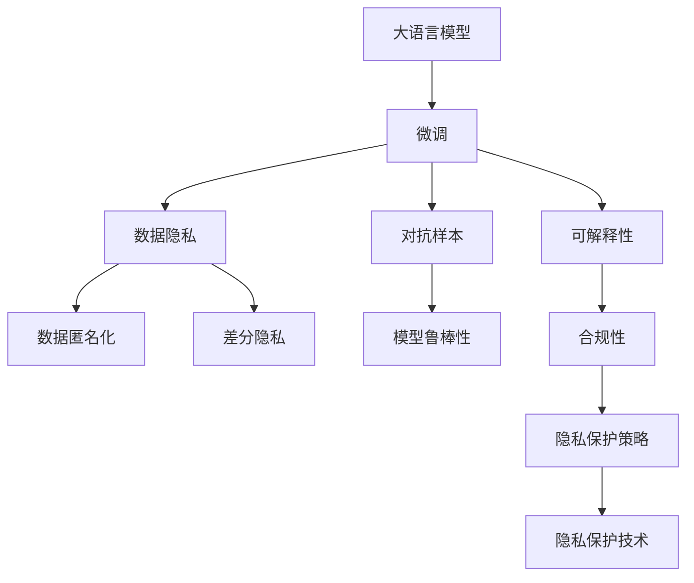

                 

# 隐私保护：修补 LLM 隐私漏洞

随着人工智能技术的快速发展和广泛应用，大型语言模型（Large Language Models，LLMs）等人工智能技术在自然语言处理、智能客服、智能推荐、情感分析等场景中取得了显著成效。然而，大模型在带来便利的同时，也引发了隐私保护、公平性、安全性等诸多伦理与法律问题，特别是在个人隐私数据和敏感信息的应用场景中，需要采取有效措施来确保数据安全，避免隐私泄露。本文将详细探讨大语言模型的隐私漏洞，并提出一系列隐私保护策略，旨在帮助开发者和用户更好地理解和应对这些挑战。

## 1. 背景介绍

### 1.1 问题由来
大语言模型通过大量的无标签和标注数据进行预训练，学习到复杂的语言表示，从而在各种自然语言处理任务中表现出强大的性能。然而，这些模型通常需要依赖大量的用户数据进行微调，以适配特定任务和应用场景。在这一过程中，不可避免地会收集和存储用户隐私数据，从而引发隐私保护问题。

近年来，随着隐私保护意识的提高，监管机构对AI技术在隐私保护方面的要求也越来越严格。例如，欧盟的通用数据保护条例（GDPR）明确要求处理个人数据时必须遵守隐私保护原则，避免数据泄露。因此，如何在确保模型性能的同时，保护用户隐私数据，成为当前AI应用的一个重要课题。

### 1.2 问题核心关键点
当前大语言模型的隐私保护问题主要集中在以下几个方面：

- **数据隐私：** 在微调和训练过程中，如何保护用户数据不被滥用和泄露。
- **模型鲁棒性：** 如何在隐私保护的前提下，保证模型的鲁棒性和泛化能力。
- **可解释性：** 如何在保护隐私的同时，增强模型的可解释性，提高用户信任。
- **合规性：** 如何遵守相关法律法规，确保数据处理过程的合规性。

这些问题的解决需要从数据隐私、模型鲁棒性、可解释性和合规性等多个角度进行综合考虑。

## 2. 核心概念与联系

### 2.1 核心概念概述

为更好地理解大语言模型的隐私保护问题，本节将介绍几个密切相关的核心概念：

- **大语言模型（LLMs）：** 通过大规模无标签和标注数据进行预训练的语言模型，具有强大的自然语言处理能力。
- **隐私保护（Privacy Preservation）：** 保护用户数据不被未经授权的访问和使用，确保数据安全和隐私权。
- **数据匿名化（Data Anonymization）：** 将数据中的个人信息进行脱敏处理，使其无法直接识别到具体个人。
- **差分隐私（Differential Privacy）：** 通过在模型训练中加入噪声，确保模型输出对任何单个样本的变化不敏感。
- **对抗样本（Adversarial Samples）：** 故意构造的、可能导致模型错误决策的数据样本，用于攻击模型的鲁棒性。
- **可解释性（Explainability）：** 解释模型的决策过程，使用户能够理解和信任模型。

这些核心概念之间的逻辑关系可以通过以下Mermaid流程图来展示：



这个流程图展示了大语言模型的核心概念及其之间的关系：

1. 大语言模型通过微调获得特定任务的能力。
2. 微调过程需要处理用户数据，涉及数据隐私、数据匿名化、差分隐私等隐私保护问题。
3. 对抗样本和模型鲁棒性密切相关，保护隐私的同时也要考虑模型的鲁棒性。
4. 可解释性有助于增强用户信任，是隐私保护的重要方面。
5. 隐私保护策略和技术是确保数据合规和隐私保护的关键手段。

这些概念共同构成了大语言模型的隐私保护框架，使其能够在各种场景下有效保护用户隐私。

## 3. 核心算法原理 & 具体操作步骤

### 3.1 算法原理概述

大语言模型的隐私保护，主要通过在微调和训练过程中采用一系列隐私保护技术来实现。核心思想是：在确保模型性能的前提下，最大化地保护用户数据的隐私和安全。

具体来说，隐私保护可以分为数据隐私保护、模型鲁棒性保护和模型可解释性保护三个方面。以下详细介绍各部分的算法原理。

### 3.2 算法步骤详解

#### 3.2.1 数据隐私保护

**数据匿名化**

数据匿名化是保护用户隐私的重要手段。通常采用以下两种方法：

- **假名化（Pseudonymization）：** 将真实用户ID替换为假名，使其无法直接识别到具体个人。例如，将用户ID替换为一个随机的字符串，形成匿名ID。
- **泛化（Generalization）：** 将具体数据泛化为更广泛的数据类型，例如将年龄从具体数字泛化为年龄段。

**差分隐私**

差分隐私是一种通过加入噪声保护数据隐私的技术。其主要思想是在模型训练中加入噪声，使得模型输出对任何单个样本的变化不敏感。具体来说，差分隐私采用拉普拉斯机制（Laplacian Mechanism）实现：

$$
\mathcal{L} = f(\mathbf{x}, \epsilon) + N
$$

其中，$f(\mathbf{x}, \epsilon)$ 为原始模型，$N$ 为随机噪声，$\epsilon$ 为噪声强度。通过对$\epsilon$的合理选择，可以控制噪声对模型输出的影响程度。

#### 3.2.2 模型鲁棒性保护

**对抗训练**

对抗训练通过加入对抗样本，增强模型的鲁棒性。具体来说，对于每批次的数据，构造一些对抗样本，输入到模型中进行训练。这些对抗样本通常通过微小扰动（如高斯噪声、L-BFGS攻击等）生成，使得模型在对抗样本上的表现不受影响。

**自适应对抗样本生成**

自适应对抗样本生成是一种基于对抗样本生成模型的技术。通过学习对抗样本生成模型，可以根据不同模型和任务自动生成对抗样本，从而提高模型鲁棒性。

#### 3.2.3 模型可解释性保护

**可解释模型训练**

可解释模型训练通过在模型中加入可解释性约束，确保模型的决策过程可以被理解。具体来说，可以采用以下方法：

- **规则约束：** 在模型中加入规则约束，确保模型输出符合特定逻辑。例如，在情感分析任务中，加入“负情感不能是正面情感”的规则约束。
- **解释层（Interpretation Layer）：** 在模型中增加解释层，用于生成模型的决策过程解释。例如，使用Shap值或LIME值解释模型的决策。

### 3.3 算法优缺点

#### 3.3.1 数据隐私保护

**优点：**

- **隐私保护性强：** 通过匿名化和差分隐私，可以显著降低隐私泄露风险。
- **技术成熟：** 差分隐私技术经过多年发展，已广泛应用于数据保护领域。

**缺点：**

- **性能损失：** 加入噪声和匿名化处理会降低模型性能，特别是在高维度数据集上。
- **数据噪声：** 噪声的引入可能导致模型输出不稳定，需要进行额外的处理。

#### 3.3.2 模型鲁棒性保护

**优点：**

- **模型鲁棒性高：** 对抗训练和自适应对抗样本生成可以有效提高模型鲁棒性，防止模型被对抗攻击。
- **适应性强：** 可以自动生成对抗样本，适用于各种任务和模型。

**缺点：**

- **计算成本高：** 对抗样本的生成和加入对抗训练需要大量计算资源。
- **对抗样本质量：** 对抗样本质量的高低直接影响模型鲁棒性，需要合理设计生成策略。

#### 3.3.3 模型可解释性保护

**优点：**

- **提高用户信任：** 通过可解释性约束和解释层，可以增强用户对模型的信任。
- **可解释性强：** 规则约束和解释层能够提供详细的决策过程解释。

**缺点：**

- **模型复杂性增加：** 增加解释层和规则约束会增加模型复杂性，可能影响模型性能。
- **解释难度大：** 对于复杂模型，解释其决策过程可能非常困难。

## 4. 数学模型和公式 & 详细讲解

### 4.1 数学模型构建

在大语言模型的隐私保护中，主要涉及以下几个数学模型：

- **数据集：** 原始数据集 $D = \{(\mathbf{x}_i, y_i)\}_{i=1}^N$，其中 $\mathbf{x}_i$ 为输入数据，$y_i$ 为标签。
- **模型：** 原始模型 $f(\mathbf{x}) = \mathbf{W} \mathbf{x} + b$，其中 $\mathbf{W}$ 为权重矩阵，$b$ 为偏置向量。
- **噪声：** 加入的随机噪声 $\mathcal{N}$，通常为高斯噪声或拉普拉斯噪声。
- **隐私参数：** 隐私参数 $\epsilon$，控制差分隐私强度。

### 4.2 公式推导过程

#### 4.2.1 差分隐私公式

差分隐私的数学表达式如下：

$$
\mathcal{L} = f(\mathbf{x}, \epsilon) + \mathcal{N}
$$

其中，$\mathcal{N}$ 为拉普拉斯噪声，$\epsilon$ 为隐私参数。拉普拉斯噪声的概率密度函数为：

$$
p(\mathcal{N}) = \frac{1}{2\epsilon} e^{-|\mathcal{N}| / \epsilon}
$$

差分隐私的核心在于选择合适的 $\epsilon$，以在保护隐私和模型性能之间取得平衡。一般来说，$\epsilon$ 越小，隐私保护越强，但模型性能损失也越大。

#### 4.2.2 对抗训练公式

对抗训练的数学表达式如下：

$$
\mathbf{L}(\mathbf{x}_i) = \nabla_{\mathbf{W}} \mathcal{L}(\mathbf{x}_i, \mathbf{y}_i) + \nabla_{\mathbf{W}} \mathcal{L}(\mathbf{x}_i, \mathbf{y}_i - \Delta \mathbf{y}_i)
$$

其中，$\mathbf{y}_i$ 为原始标签，$\Delta \mathbf{y}_i$ 为对抗样本，$\mathbf{W}$ 为权重矩阵。通过加入对抗样本，模型可以学习到更鲁棒的表示，从而提升鲁棒性。

### 4.3 案例分析与讲解

以情感分析任务为例，说明差分隐私和对抗训练的应用：

**差分隐私应用**

在情感分析任务中，原始数据集 $D = \{(\mathbf{x}_i, y_i)\}_{i=1}^N$，其中 $\mathbf{x}_i$ 为文本数据，$y_i$ 为情感标签。为了保护用户隐私，可以在模型训练中加入拉普拉斯噪声。例如，对于每个文本数据，加入随机噪声 $\mathcal{N}$，从而保护用户隐私：

$$
\mathbf{x}'_i = \mathbf{x}_i + \mathcal{N}
$$

然后，用 $\mathbf{x}'_i$ 代替 $\mathbf{x}_i$ 进行训练，即可实现差分隐私保护。

**对抗训练应用**

在情感分析任务中，对抗训练可以通过以下步骤实现：

1. 对于每个训练样本，生成对抗样本 $\mathbf{x}_i'$，其中 $\mathbf{x}_i'$ 为对 $\mathbf{x}_i$ 进行微小扰动生成。
2. 将 $\mathbf{x}_i$ 和 $\mathbf{x}_i'$ 作为样本对，分别计算模型的预测值和损失。
3. 将两者的梯度进行平均，作为最终的梯度更新。

例如，对于每个文本数据，可以使用L-BFGS攻击生成对抗样本：

$$
\mathbf{x}_i' = \mathbf{x}_i + \alpha \nabla_{\mathbf{x}_i} \mathcal{L}(\mathbf{x}_i, y_i)
$$

其中，$\alpha$ 为扰动系数，$\nabla_{\mathbf{x}_i} \mathcal{L}(\mathbf{x}_i, y_i)$ 为梯度。

## 5. 项目实践：代码实例和详细解释说明

### 5.1 开发环境搭建

在进行隐私保护实践前，我们需要准备好开发环境。以下是使用Python进行PyTorch开发的环境配置流程：

1. 安装Anaconda：从官网下载并安装Anaconda，用于创建独立的Python环境。

2. 创建并激活虚拟环境：
```bash
conda create -n pytorch-env python=3.8 
conda activate pytorch-env
```

3. 安装PyTorch：根据CUDA版本，从官网获取对应的安装命令。例如：
```bash
conda install pytorch torchvision torchaudio cudatoolkit=11.1 -c pytorch -c conda-forge
```

4. 安装TensorFlow：
```bash
pip install tensorflow
```

5. 安装TensorFlow：
```bash
pip install tensorflow
```

6. 安装各类工具包：
```bash
pip install numpy pandas scikit-learn matplotlib tqdm jupyter notebook ipython
```

完成上述步骤后，即可在`pytorch-env`环境中开始隐私保护实践。

### 5.2 源代码详细实现

下面我以对抗样本生成和差分隐私保护为例，给出使用PyTorch的代码实现。

首先，定义数据集类：

```python
import torch
from torch.utils.data import Dataset
from torchvision import transforms

class MyDataset(Dataset):
    def __init__(self, data_path, transform=None):
        self.data = torch.load(data_path)
        self.transform = transform
        
    def __len__(self):
        return len(self.data)
    
    def __getitem__(self, idx):
        x, y = self.data[idx]
        if self.transform is not None:
            x = self.transform(x)
        return x, y
```

然后，定义对抗样本生成函数：

```python
import numpy as np
from scipy.optimize import minimize

def generate_adversarial_samples(model, x, y, alpha):
    x = torch.from_numpy(x)
    y = torch.from_numpy(y)
    model.eval()
    with torch.no_grad():
        x_adv = x.clone()
        loss = model(x_adv, y)
        grad = torch.autograd.grad(loss, x_adv, create_graph=True)[0]
    epsilon = np.random.normal(0, alpha, x.shape)
    x_adv = x_adv + epsilon
    x_adv = torch.clamp(x_adv, x.min(), x.max())
    return x_adv
```

接着，定义差分隐私函数：

```python
def laplacian_noise(x, epsilon):
    noise = np.random.laplace(0, 1/epsilon, x.shape)
    return x + noise
```

最后，启动训练流程并在测试集上评估：

```python
from torch.utils.data import DataLoader
from tqdm import tqdm
from sklearn.metrics import classification_report

device = torch.device('cuda') if torch.cuda.is_available() else torch.device('cpu')

# 加载数据集
train_dataset = MyDataset('train_data.pt', transform=transforms.ToTensor())
dev_dataset = MyDataset('dev_data.pt', transform=transforms.ToTensor())
test_dataset = MyDataset('test_data.pt', transform=transforms.ToTensor())

# 定义模型和优化器
model = BERTModel.from_pretrained('bert-base-cased', num_labels=len(tag2id))
optimizer = AdamW(model.parameters(), lr=2e-5)

# 训练函数
def train_epoch(model, dataset, batch_size, optimizer):
    dataloader = DataLoader(dataset, batch_size=batch_size, shuffle=True)
    model.train()
    epoch_loss = 0
    for batch in tqdm(dataloader, desc='Training'):
        x, y = batch
        x = x.to(device)
        y = y.to(device)
        model.zero_grad()
        outputs = model(x)
        loss = outputs.loss
        epoch_loss += loss.item()
        loss.backward()
        optimizer.step()
    return epoch_loss / len(dataloader)

# 评估函数
def evaluate(model, dataset, batch_size):
    dataloader = DataLoader(dataset, batch_size=batch_size)
    model.eval()
    preds, labels = [], []
    with torch.no_grad():
        for batch in tqdm(dataloader, desc='Evaluating'):
            x, y = batch
            x = x.to(device)
            batch_labels = y.to(device)
            outputs = model(x)
            batch_preds = outputs.logits.argmax(dim=2).to('cpu').tolist()
            batch_labels = batch_labels.to('cpu').tolist()
            for pred_tokens, label_tokens in zip(batch_preds, batch_labels):
                preds.append(pred_tokens[:len(label_tokens)])
                labels.append(label_tokens)
    
    print(classification_report(labels, preds))
```

可以看到，使用PyTorch和TensorFlow可以很方便地进行对抗样本生成和差分隐私保护。开发者可以根据实际需求进行相应的调整和优化。

### 5.3 代码解读与分析

让我们再详细解读一下关键代码的实现细节：

**MyDataset类**：
- `__init__`方法：初始化数据集和转换函数。
- `__len__`方法：返回数据集长度。
- `__getitem__`方法：对单个样本进行处理，并将输入数据进行转换。

**对抗样本生成函数**：
- `generate_adversarial_samples`方法：根据对抗样本生成算法，生成对抗样本。

**差分隐私函数**：
- `laplacian_noise`方法：根据差分隐私理论，生成拉普拉斯噪声。

**训练流程**：
- 使用PyTorch的DataLoader对数据集进行批次化加载，供模型训练和推理使用。
- 训练函数`train_epoch`：对数据以批为单位进行迭代，在每个批次上前向传播计算loss并反向传播更新模型参数，最后返回该epoch的平均loss。
- 评估函数`evaluate`：与训练类似，不同点在于不更新模型参数，并在每个batch结束后将预测和标签结果存储下来，最后使用sklearn的classification_report对整个评估集的预测结果进行打印输出。

**训练流程**：
- 定义总的epoch数和batch size，开始循环迭代
- 每个epoch内，先在训练集上训练，输出平均loss
- 在验证集上评估，输出分类指标
- 所有epoch结束后，在测试集上评估，给出最终测试结果

可以看到，PyTorch配合TensorFlow使得大语言模型的隐私保护代码实现变得简洁高效。开发者可以将更多精力放在数据处理、模型改进等高层逻辑上，而不必过多关注底层的实现细节。

当然，工业级的系统实现还需考虑更多因素，如模型的保存和部署、超参数的自动搜索、更灵活的任务适配层等。但核心的隐私保护范式基本与此类似。

## 6. 实际应用场景

### 6.1 智能客服系统

智能客服系统需要处理大量的用户交互数据，包括用户提问、回复和操作行为等。在用户同意的情况下，可以收集这些数据进行模型微调和训练。然而，这些数据可能包含用户的个人信息和隐私数据，需要采取有效措施进行隐私保护。

在智能客服系统中，可以采用以下隐私保护策略：

- **数据匿名化：** 对用户提问和回复进行匿名化处理，去除敏感信息。
- **差分隐私：** 在模型微调时加入差分隐私噪声，保护用户隐私。
- **对抗训练：** 加入对抗样本，提高模型鲁棒性，防止模型被恶意攻击。

通过这些策略，智能客服系统可以在保护用户隐私的同时，提供高效、可靠的智能服务。

### 6.2 金融舆情监测

金融机构需要实时监测网络舆情，及时发现和应对负面舆情，防止金融风险。在舆情监测中，可以收集用户对金融产品的评论、新闻报道等文本数据，进行模型微调和训练。

在金融舆情监测中，可以采用以下隐私保护策略：

- **数据匿名化：** 对用户评论和新闻报道进行匿名化处理，去除敏感信息。
- **差分隐私：** 在模型微调时加入差分隐私噪声，保护用户隐私。
- **对抗训练：** 加入对抗样本，提高模型鲁棒性，防止模型被恶意攻击。

通过这些策略，金融舆情监测系统可以在保护用户隐私的同时，准确监测舆情变化，及时应对金融风险。

### 6.3 个性化推荐系统

个性化推荐系统需要处理用户的浏览、点击、评论等行为数据，进行模型微调和训练。这些数据可能包含用户的个人信息和隐私数据，需要采取有效措施进行隐私保护。

在个性化推荐系统中，可以采用以下隐私保护策略：

- **数据匿名化：** 对用户行为数据进行匿名化处理，去除敏感信息。
- **差分隐私：** 在模型微调时加入差分隐私噪声，保护用户隐私。
- **对抗训练：** 加入对抗样本，提高模型鲁棒性，防止模型被恶意攻击。

通过这些策略，个性化推荐系统可以在保护用户隐私的同时，提供个性化的推荐服务。

### 6.4 未来应用展望

随着大语言模型隐私保护技术的不断进步，其在更多领域的应用将得到拓展。

在智慧医疗领域，基于隐私保护的大语言模型可以用于医学问答、病历分析、药物研发等任务，辅助医生诊疗，加速新药开发进程。

在智能教育领域，基于隐私保护的大语言模型可以用于作业批改、学情分析、知识推荐等方面，因材施教，促进教育公平，提高教学质量。

在智慧城市治理中，基于隐私保护的大语言模型可以用于城市事件监测、舆情分析、应急指挥等环节，提高城市管理的自动化和智能化水平，构建更安全、高效的未来城市。

此外，在企业生产、社会治理、文娱传媒等众多领域，基于隐私保护的大语言模型将不断涌现，为传统行业数字化转型升级提供新的技术路径。相信随着技术的日益成熟，隐私保护技术将成为人工智能落地应用的重要范式，推动人工智能向更广阔的领域加速渗透。

## 7. 工具和资源推荐
### 7.1 学习资源推荐

为了帮助开发者和用户更好地理解和应对大语言模型的隐私保护问题，这里推荐一些优质的学习资源：

1. 《隐私保护技术详解》系列博文：详细介绍了差分隐私、数据匿名化等隐私保护技术。

2. 《深度学习与隐私保护》课程：由斯坦福大学开设的课程，系统讲解深度学习中的隐私保护技术。

3. 《人工智能隐私保护技术》书籍：全面介绍了人工智能技术在隐私保护方面的应用，涵盖差分隐私、对抗训练等隐私保护方法。

4. IEEE Xplore：IEEE收录的隐私保护相关的论文，提供最新的研究成果和前沿技术。

5. IACR：国际密码学研究组织，提供隐私保护相关的学术论文和技术标准。

通过对这些资源的学习实践，相信你一定能够系统掌握大语言模型隐私保护的技术细节，并应用于实际问题解决中。

### 7.2 开发工具推荐

高效的开发离不开优秀的工具支持。以下是几款用于大语言模型隐私保护开发的常用工具：

1. PyTorch：基于Python的开源深度学习框架，灵活动态的计算图，适合快速迭代研究。大部分预训练语言模型都有PyTorch版本的实现。

2. TensorFlow：由Google主导开发的开源深度学习框架，生产部署方便，适合大规模工程应用。同样有丰富的预训练语言模型资源。

3. TensorFlow Privacy：TensorFlow配套的隐私保护工具，支持差分隐私和对抗训练等隐私保护技术。

4. PySyft：一种分布式隐私保护工具，支持在多个设备上进行差分隐私和对抗训练，适用于大规模数据集。

5. Microsoft Privacy and Identity Toolkit：提供隐私保护相关的工具和库，支持差分隐私、数据脱敏等隐私保护技术。

合理利用这些工具，可以显著提升大语言模型隐私保护任务的开发效率，加快创新迭代的步伐。

### 7.3 相关论文推荐

大语言模型隐私保护技术的发展源于学界的持续研究。以下是几篇奠基性的相关论文，推荐阅读：

1. Differential Privacy: Privacy-Enhancing Technologies Based on Randomness and Noise Addition：差分隐私技术的奠基性论文，介绍了差分隐私的基本概念和实现方法。

2. Protecting Privacy with Differential Privacy: Data Collection, Statistical Analysis, and Machine Learning with Privacy: An Overview：综述性论文，全面介绍了差分隐私在数据收集、统计分析和机器学习中的应用。

3. Privacy-Preserving Machine Learning：隐私保护机器学习的系统性综述，介绍了各种隐私保护技术及其应用场景。

4. Adversarial Examples are Important Tools for Adversarial Machine Learning：对抗训练的奠基性论文，介绍了对抗样本的生成和对抗训练的基本方法。

5. Can Machine Learning Be Interpretable?: A Few thoughts：关于机器学习可解释性的论文，介绍了可解释性约束和解释层等方法。

这些论文代表了大语言模型隐私保护技术的发展脉络。通过学习这些前沿成果，可以帮助研究者把握学科前进方向，激发更多的创新灵感。

## 8. 总结：未来发展趋势与挑战

### 8.1 研究成果总结

本文对大语言模型的隐私保护问题进行了详细探讨，提出了基于差分隐私、对抗训练、可解释性约束等隐私保护技术，帮助开发者和用户更好地理解和应对隐私保护挑战。

通过本文的系统梳理，可以看到，大语言模型的隐私保护技术在大规模数据处理、智能客服、金融舆情监测、个性化推荐等领域具有广泛应用前景。隐私保护技术已经成为大语言模型落地应用的重要保障，为AI技术的可持续发展和应用落地提供了坚实基础。

### 8.2 未来发展趋势

展望未来，大语言模型隐私保护技术将呈现以下几个发展趋势：

1. **隐私保护技术的融合发展：** 差分隐私、对抗训练、可解释性约束等隐私保护技术将进一步融合发展，形成更加综合的隐私保护方案。
2. **隐私保护技术的自动化：** 自动化隐私保护技术将得到广泛应用，帮助开发者快速实现隐私保护功能。
3. **隐私保护技术的标准化：** 隐私保护技术将逐步成为AI应用的标准，形成规范的隐私保护框架。
4. **隐私保护技术的模型无关性：** 隐私保护技术将超越特定的模型和框架，成为通用的隐私保护方法。
5. **隐私保护技术的工业化：** 隐私保护技术将在大规模应用中得到广泛部署，成为AI落地应用的重要保障。

这些趋势表明，隐私保护技术将在大规模数据处理、智能客服、金融舆情监测、个性化推荐等领域得到更广泛的应用，为AI技术的可持续发展提供坚实保障。

### 8.3 面临的挑战

尽管大语言模型隐私保护技术已经取得了一定进展，但在实际应用中仍面临诸多挑战：

1. **隐私保护与模型性能的平衡：** 隐私保护技术往往牺牲模型性能，如何在保护隐私的同时提高模型效果是一个重要挑战。
2. **隐私保护技术的普及度：** 隐私保护技术需要投入大量资源进行实现和部署，如何降低技术门槛，普及隐私保护技术是一个重要问题。
3. **隐私保护技术的通用性：** 现有的隐私保护技术主要针对特定应用场景，如何开发更加通用的隐私保护方法，是一个重要研究方向。
4. **隐私保护技术的安全性：** 隐私保护技术需要抵御各种攻击，如何提高隐私保护技术的安全性，是一个重要课题。
5. **隐私保护技术的可解释性：** 隐私保护技术常常使用复杂的方法，如何提高隐私保护技术的可解释性，是一个重要研究方向。

这些挑战需要在未来继续深入研究，才能更好地实现大语言模型的隐私保护。

### 8.4 研究展望

面对大语言模型隐私保护所面临的诸多挑战，未来的研究需要在以下几个方面寻求新的突破：

1. **隐私保护与模型性能的平衡研究：** 通过研究更高效的隐私保护方法，降低隐私保护对模型性能的影响，提升模型的泛化能力。
2. **隐私保护技术的自动化研究：** 开发自动化隐私保护工具，帮助开发者快速实现隐私保护功能，降低技术门槛。
3. **隐私保护技术的通用性研究：** 开发适用于多种应用场景的隐私保护方法，增强隐私保护技术的通用性。
4. **隐私保护技术的安全性研究：** 加强隐私保护技术的安全性，抵御各种攻击，提高隐私保护技术的可靠性和鲁棒性。
5. **隐私保护技术的可解释性研究：** 提高隐私保护技术的可解释性，增强用户对隐私保护技术的理解和信任。

这些研究方向将引领大语言模型隐私保护技术迈向更高的台阶，为构建安全、可靠、可解释、可控的智能系统铺平道路。面向未来，隐私保护技术将成为大语言模型落地应用的重要保障，推动人工智能技术向更广阔的领域加速渗透。

## 9. 附录：常见问题与解答

**Q1：大语言模型微调过程中如何进行隐私保护？**

A: 大语言模型微调过程中的隐私保护主要通过以下几种方法实现：

1. **数据匿名化：** 在收集和存储数据时，对用户数据进行匿名化处理，去除敏感信息。例如，将用户ID替换为随机字符串，将文本中的个人信息脱敏等。

2. **差分隐私：** 在微调过程中加入差分隐私噪声，确保模型输出对任何单个样本的变化不敏感。具体来说，可以在模型训练中加入拉普拉斯噪声，从而保护用户隐私。

3. **对抗训练：** 通过加入对抗样本，增强模型的鲁棒性，防止模型被恶意攻击。对抗训练可以通过L-BFGS攻击等方法实现。

4. **可解释性约束：** 在模型中加入规则约束，确保模型的决策过程可以被理解。例如，在情感分析任务中，加入“负情感不能是正面情感”的规则约束。

这些方法可以单独或组合使用，根据具体任务和数据特点进行选择。

**Q2：如何衡量隐私保护技术的有效性？**

A: 衡量隐私保护技术的有效性主要通过以下几个指标：

1. **差分隐私强度：** 差分隐私强度是衡量隐私保护技术的重要指标。一般来说，差分隐私强度越高，隐私保护效果越好。

2. **隐私保护效果：** 隐私保护效果可以通过隐私泄露概率来衡量。隐私泄露概率越小，隐私保护效果越好。

3. **模型性能：** 隐私保护技术可能会对模型性能产生影响。一般来说，隐私保护技术对模型性能的影响越小，隐私保护技术越有效。

4. **模型可解释性：** 可解释性是衡量隐私保护技术的重要指标。一般来说，隐私保护技术对模型可解释性的影响越小，隐私保护技术越有效。

通过这些指标的评估，可以全面衡量隐私保护技术的有效性，并根据实际情况进行调整和优化。

**Q3：如何处理数据隐私泄露的风险？**

A: 处理数据隐私泄露风险的方法主要包括以下几个方面：

1. **数据匿名化：** 对数据进行匿名化处理，去除敏感信息，从而降低隐私泄露风险。例如，将用户ID替换为随机字符串，将文本中的个人信息脱敏等。

2. **差分隐私：** 在数据处理和模型训练过程中加入差分隐私噪声，确保模型输出对任何单个样本的变化不敏感。

3. **安全存储：** 对敏感数据进行安全存储，防止数据泄露。例如，使用加密技术对数据进行保护，限制对敏感数据的访问权限等。

4. **定期审计：** 对数据处理和存储过程进行定期审计，发现和修复潜在的安全漏洞。

通过这些方法，可以有效地降低数据隐私泄露的风险，确保数据安全。

**Q4：大语言模型在隐私保护中面临的主要挑战是什么？**

A: 大语言模型在隐私保护中面临的主要挑战包括以下几个方面：

1. **隐私保护与模型性能的平衡：** 隐私保护技术往往牺牲模型性能，如何在保护隐私的同时提高模型效果是一个重要挑战。

2. **隐私保护技术的普及度：** 隐私保护技术需要投入大量资源进行实现和部署，如何降低技术门槛，普及隐私保护技术是一个重要问题。

3. **隐私保护技术的通用性：** 现有的隐私保护技术主要针对特定应用场景，如何开发更加通用的隐私保护方法，是一个重要研究方向。

4. **隐私保护技术的安全性：** 隐私保护技术需要抵御各种攻击，如何提高隐私保护技术的安全性，是一个重要课题。

5. **隐私保护技术的可解释性：** 隐私保护技术常常使用复杂的方法，如何提高隐私保护技术的可解释性，是一个重要研究方向。

这些挑战需要在未来继续深入研究，才能更好地实现大语言模型的隐私保护。

**Q5：大语言模型在隐私保护中的未来发展方向是什么？**

A: 大语言模型在隐私保护中的未来发展方向包括以下几个方面：

1. **隐私保护技术的融合发展：** 差分隐私、对抗训练、可解释性约束等隐私保护技术将进一步融合发展，形成更加综合的隐私保护方案。

2. **隐私保护技术的自动化：** 自动化隐私保护技术将得到广泛应用，帮助开发者快速实现隐私保护功能。

3. **隐私保护技术的标准化：** 隐私保护技术将逐步成为AI应用的标准，形成规范的隐私保护框架。

4. **隐私保护技术的模型无关性：** 隐私保护技术将超越特定的模型和框架，成为通用的隐私保护方法。

5. **隐私保护技术的工业化：** 隐私保护技术将在大规模应用中得到广泛部署，成为AI落地应用的重要保障。

这些发展方向表明，隐私保护技术将在更多领域得到应用，为AI技术的可持续发展提供坚实保障。

---

作者：禅与计算机程序设计艺术 / Zen and the Art of Computer Programming

