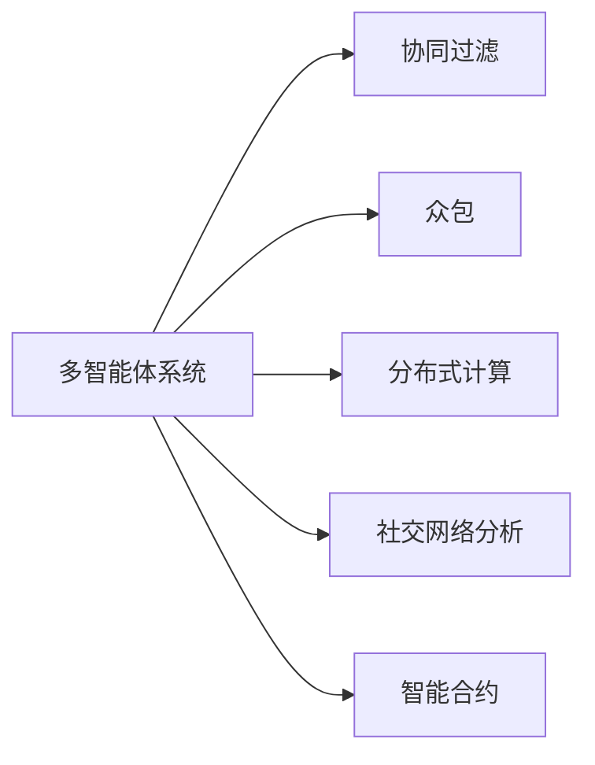

                 

## 1. 背景介绍

### 1.1 问题由来
随着信息技术的飞速发展，社会面临的问题日趋复杂化。从全球气候变化、国际贸易冲突、公共卫生危机，到企业供应链管理、金融风险控制、智能城市建设，这些问题涉及多个学科、多个部门、多个环节，需要跨学科、跨领域、跨地域的协同合作。如何在这种复杂多变的环境中，高效地进行问题分析和解决，成为亟待回答的重要课题。

### 1.2 问题核心关键点
本节将详细介绍集体智慧(Collective Intelligence, CI)的概念及其重要性。集体智慧指的是由多个智能体组成的群体，通过协作、交互和协同完成任务的过程。在人工智能和大数据时代，集体智慧已成为解决复杂问题的核心方法。

**集体智慧的核心要素**：
1. **智能体(Agent)**：每个智能体是具备自主决策和交互能力的实体，可以是人、机器或者软件系统。
2. **协作机制**：智能体之间通过共享知识、信息和策略进行协作。
3. **任务目标**：所有智能体的共同目标是通过协作解决特定问题。
4. **多样性**：参与的智能体应具有多样性和异构性，以提高解决问题的灵活性和鲁棒性。
5. **动态性**：集体智慧系统能根据环境变化和反馈信息不断调整和优化。

集体智慧的优势在于：
- **多角度分析**：多个智能体可以从不同角度和视角分析问题，提供全面和深入的洞察。
- **异构互补**：不同背景、知识和技能的智能体可以互补，发挥各自优势。
- **协同决策**：通过群体协同决策，可以更快速、更准确地找到问题解决方案。
- **自适应调整**：系统能够根据反馈和环境变化进行调整，适应性强。

### 1.3 问题研究意义
研究集体智慧的思路和方法，对于提升问题解决能力、优化决策过程、推动社会进步具有重要意义：

1. **提高决策效率**：集体智慧系统通过并行处理和协同决策，大大缩短问题解决的时间。
2. **增强决策质量**：多样化的视角和知识可以提供更全面、更准确的决策依据。
3. **降低决策风险**：多智能体的协作能够分散决策风险，提高系统的鲁棒性。
4. **促进创新**：不同智能体的交流和合作可以激发新思路、新方法，推动技术创新和应用创新。
5. **赋能社会**：集体智慧技术在公共安全、环境保护、智能城市等领域的应用，能够显著提升社会管理和服务的效率和质量。

## 2. 核心概念与联系

### 2.1 核心概念概述

为更好地理解集体智慧的概念及其应用，本节将介绍几个密切相关的核心概念：

- **多智能体系统(Multi-Agent System,MAS)**：由多个智能体组成的系统，通过协作和交互实现复杂任务的自动化和智能化。
- **协同过滤(Collaborative Filtering, CF)**：利用多个用户的行为数据进行推荐和预测，典型应用包括电子商务推荐系统。
- **众包(Crowdsourcing)**：通过网络平台将任务外包给大量分散的独立工作者，利用集体的智慧和资源。
- **分布式计算(Distributed Computing)**：将计算任务分散到多个计算节点上进行并行处理，提高计算效率和资源利用率。
- **社交网络分析(Social Network Analysis, SNA)**：通过分析社交网络结构，挖掘信息传播和关系网络中的模式和规律。
- **智能合约(Smart Contract)**：基于区块链技术的智能合约系统，能够自动执行、监控和记录合约条款。

这些核心概念之间的逻辑关系可以通过以下Mermaid流程图来展示：



这个流程图展示了大语言模型的核心概念及其之间的关系：

1. 多智能体系统是集体智慧的基础，通过协作和交互实现复杂任务的自动化。
2. 协同过滤和多智能体系统有相似之处，都是通过多个独立体的协作来实现共同目标。
3. 众包、分布式计算、社交网络分析、智能合约等技术，都可以作为多智能体系统的补充，提升其功能和效果。

这些概念共同构成了集体智慧的学习框架，使其能够在各种场景下发挥强大的集体智慧和协作能力。通过理解这些核心概念，我们可以更好地把握集体智慧的工作原理和优化方向。

## 3. 核心算法原理 & 具体操作步骤
### 3.1 算法原理概述

集体智慧算法的核心思想是：通过多个智能体的协作和交互，实现问题的分析和解决。这种协作和交互通常基于特定的通信协议、信息共享机制和决策规则。在集体智慧系统中，智能体通过共享信息、协同工作，共同完成任务目标。

形式化地，设一个集体智慧系统由 $N$ 个智能体 $A_1, A_2, ..., A_N$ 组成，系统目标为 $G$。智能体间的通信协议为 $C$，信息共享机制为 $I$，决策规则为 $R$。则系统的运行过程可以表示为：

1. 每个智能体 $A_i$ 根据其自身的感知、知识和状态 $S_i$，通过通信协议 $C$ 接收其他智能体的信息 $I_i$。
2. 智能体 $A_i$ 根据信息共享机制 $I$ 和决策规则 $R$，更新自身的状态和决策 $D_i$。
3. 智能体 $A_i$ 执行决策 $D_i$，并更新系统状态 $S_{i+1}$。
4. 重复步骤 1-3，直到系统达到目标 $G$ 或满足某个终止条件。

在集体智慧系统中，智能体的协作和交互是关键。如何设计有效的通信协议、信息共享机制和决策规则，是实现集体智慧的核心问题。

### 3.2 算法步骤详解

集体智慧算法的实现一般包括以下几个关键步骤：

**Step 1: 定义智能体和任务**
- 确定集体智慧系统中的智能体类型和数量。例如，可以将智能体分为决策者、执行者、观察者等不同角色。
- 明确系统需要解决的具体任务和目标。例如，协同过滤系统中的任务是推荐商品，智能合约系统中的任务是自动执行合同条款。

**Step 2: 设计通信协议**
- 设计智能体间通信的协议和数据格式，确保信息传递的准确性和实时性。
- 可以采用TCP/IP、HTTP等标准通信协议，也可以设计专门的协议以满足特定需求。

**Step 3: 设计信息共享机制**
- 确定智能体间共享信息的方式和内容，如通过消息队列、共享内存、数据库等。
- 考虑信息的精度、一致性和安全性，确保系统可靠运行。

**Step 4: 设计决策规则**
- 定义智能体间决策的规则和优先级，如投票、加权投票、共识等。
- 考虑决策的效率和公平性，选择合适的决策规则。

**Step 5: 实施集体智慧算法**
- 将智能体部署到相应的计算节点上，启动协同工作。
- 通过监控系统状态和通信数据，调整智能体的行为和决策。
- 根据任务目标和反馈信息，不断优化智能体的协作和交互。

**Step 6: 评估和优化**
- 根据系统的性能指标（如准确率、响应时间、资源利用率等），评估系统效果。
- 根据评估结果，进行系统优化和改进，提升集体智慧系统的性能和可靠性。

### 3.3 算法优缺点

集体智慧算法具有以下优点：
1. **多角度分析**：多个智能体可以从不同角度和视角分析问题，提供全面和深入的洞察。
2. **异构互补**：不同背景、知识和技能的智能体可以互补，发挥各自优势。
3. **协同决策**：通过群体协同决策，可以更快速、更准确地找到问题解决方案。
4. **自适应调整**：系统能够根据反馈和环境变化进行调整，适应性强。

同时，该算法也存在一定的局限性：
1. **通信成本高**：智能体间的通信和信息共享需要消耗大量计算资源和时间，尤其是在大规模系统中。
2. **决策复杂**：协同决策过程中需要处理多个智能体的行为和反馈，决策过程复杂。
3. **安全性问题**：系统中的数据和决策可能被恶意攻击者篡改，影响系统安全性。
4. **可扩展性差**：在大规模系统中，智能体间的协作和通信效率可能受限，系统扩展性差。

尽管存在这些局限性，但就目前而言，集体智慧算法仍是大规模复杂问题解决的重要手段。未来相关研究的重点在于如何进一步降低通信成本，提高决策效率，增强系统的可扩展性和安全性。

### 3.4 算法应用领域

集体智慧算法在多个领域得到了广泛的应用，例如：

- **智能电网**：通过智能电表、智能家居等设备，实现电网的智能监控和优化。
- **智能交通**：利用车辆、交通信号等设备，实现交通流量的智能调控和优化。
- **金融风控**：通过多个金融机构的数据共享，实现风险的协同分析和预测。
- **医疗健康**：利用多个医疗机构的资源和数据，实现疾病的协同诊断和治疗。
- **环境保护**：通过监测站、传感器等设备，实现环境数据的协同监测和预测。
- **智能制造**：通过机器人、传感器等设备，实现生产线的智能监控和优化。
- **公共安全**：通过监控摄像头、传感器等设备，实现公共安全的智能监测和预警。

除了上述这些典型应用外，集体智慧技术还被创新性地应用到更多场景中，如智能城市、智慧物流、智能农业等，为各行各业带来了新的突破。随着集体智慧技术的不断演进，相信其在更多领域的应用前景将更加广阔。

## 4. 数学模型和公式 & 详细讲解  
### 4.1 数学模型构建

本节将使用数学语言对集体智慧算法的核心过程进行更加严格的刻画。

设集体智慧系统由 $N$ 个智能体 $A_1, A_2, ..., A_N$ 组成，系统目标为 $G$。智能体间的通信协议为 $C$，信息共享机制为 $I$，决策规则为 $R$。系统的运行过程可以形式化表示为：

$$
\begin{aligned}
S_{i+1} &= f(S_i, I_i, D_i) \\
I_i &= C(S_i, I_{i-1}, A_i) \\
D_i &= R(S_i, I_i)
\end{aligned}
$$

其中 $S_i$ 表示智能体 $A_i$ 的状态，$I_i$ 表示智能体 $A_i$ 接收到的信息，$D_i$ 表示智能体 $A_i$ 的决策，$f$ 表示智能体状态更新函数，$C$ 表示通信协议函数，$R$ 表示决策规则函数。

### 4.2 公式推导过程

以下我们以协同过滤系统为例，推导协同过滤的数学模型及其求解方法。

设协同过滤系统中的智能体 $A$ 和 $B$ 分别为用户 $U$ 和商品 $I$。系统目标是通过协同过滤推荐商品 $I$ 给用户 $U$。设用户 $U$ 的历史行为数据为 $H_U$，商品 $I$ 的历史评分数据为 $H_I$。则协同过滤的目标函数可以表示为：

$$
\min_{\theta} \sum_{u,i} (y_{ui} - \theta_u^\top x_i)^2
$$

其中 $y_{ui}$ 表示用户 $u$ 对商品 $i$ 的评分，$\theta_u$ 表示用户 $u$ 的潜在特征向量，$x_i$ 表示商品 $i$ 的特征向量。

通过最小二乘法求解目标函数，得到用户 $u$ 的潜在特征向量 $\theta_u$：

$$
\theta_u = \arg\min_{\theta} \sum_{i} (y_{ui} - \theta^\top x_i)^2
$$

得到用户 $u$ 的潜在特征向量后，即可计算商品 $i$ 的推荐评分：

$$
\hat{y}_{ui} = \theta_u^\top x_i
$$

以上是协同过滤的基本数学模型及其求解方法。通过合理设计特征向量 $x_i$ 和潜在特征向量 $\theta_u$，可以进一步优化推荐效果。

## 5. 项目实践：代码实例和详细解释说明
### 5.1 开发环境搭建

在进行集体智慧算法实践前，我们需要准备好开发环境。以下是使用Python进行Sympy开发的环境配置流程：

1. 安装Anaconda：从官网下载并安装Anaconda，用于创建独立的Python环境。

2. 创建并激活虚拟环境：
```bash
conda create -n sympy-env python=3.8 
conda activate sympy-env
```

3. 安装Sympy：从官网获取对应的安装命令。例如：
```bash
conda install sympy
```

4. 安装各类工具包：
```bash
pip install numpy pandas scikit-learn matplotlib tqdm jupyter notebook ipython
```

完成上述步骤后，即可在`sympy-env`环境中开始集体智慧算法的实践。

### 5.2 源代码详细实现

这里我们以协同过滤系统为例，给出使用Sympy进行协同过滤的代码实现。

首先，定义协同过滤的特征向量和目标函数：

```python
from sympy import symbols, Rational, solve, Matrix

# 定义符号变量
theta_u, theta_i = symbols('theta_u:100, theta_i:100')
x_i, y_ui = symbols('x_i:100, y_ui:100')

# 定义协同过滤的目标函数
loss = sum((y_ui - theta_u*x_i)**2 for u in range(N) for i in range(M))

# 定义目标函数的优化方程
eq = solve(loss, theta_u)
```

然后，定义智能体的状态更新和决策规则：

```python
# 定义智能体状态更新函数
def update_state(S_i, I_i, D_i):
    return S_i + I_i + D_i

# 定义智能体决策规则函数
def make_decision(S_i, I_i):
    return S_i.dot(I_i)

# 定义智能体间通信协议函数
def communication(S_i, I_i, A_i):
    return I_i + A_i
```

最后，启动协同过滤系统的运行流程：

```python
# 定义初始状态
S = Matrix(Rational(1, 10), 100)
I = Matrix(Rational(1, 10), 100)

# 定义智能体决策规则和通信协议
D = make_decision(S, I)
I = communication(S, I, D)

# 不断更新状态和决策
while True:
    S = update_state(S, I, D)
    I = communication(S, I, D)
    D = make_decision(S, I)
```

以上就是使用Sympy进行协同过滤的完整代码实现。可以看到，Sympy提供了强大的符号计算能力，能够方便地进行数学建模和求解。

### 5.3 代码解读与分析

让我们再详细解读一下关键代码的实现细节：

**update_state函数**：
- 定义了智能体的状态更新函数，接收当前状态 $S_i$、接收到的信息 $I_i$ 和决策 $D_i$，并返回更新后的状态 $S_{i+1}$。

**make_decision函数**：
- 定义了智能体的决策规则函数，接收当前状态 $S_i$ 和接收到的信息 $I_i$，并返回决策 $D_i$。

**communication函数**：
- 定义了智能体间通信协议函数，接收当前状态 $S_i$、接收到的信息 $I_i$ 和智能体自身的决策 $D_i$，并返回更新后的信息 $I_{i+1}$。

**while循环**：
- 在while循环中，通过不断的更新状态、通信和决策，实现协同过滤的协同工作。

通过这种分层的定义方式，可以清晰地看到智能体的协作机制和决策过程。同时，Sympy的符号计算能力使得模型的数学建模和求解更加方便。

当然，工业级的系统实现还需考虑更多因素，如超参数的优化、模型的保存和部署等。但核心的协同过滤范式基本与此类似。

## 6. 实际应用场景
### 6.1 智能电网

集体智慧技术在智能电网中的应用，可以显著提升电网的智能化水平，实现电网的优化运行和智能调控。智能电网中的智能体可以包括智能电表、智能家居、能源管理平台等。通过这些智能体之间的协作和交互，可以实现电网的实时监控、需求响应、故障检测和优化调度等功能。

具体而言，智能电表可以实时监测用户用电情况，智能家居可以根据用户需求智能控制电力负荷，能源管理平台可以协调优化电力资源分配。通过这些智能体的协同工作，可以实现电网的智能监控和优化。例如，在高峰负荷期，智能电网可以自动调整电力分配，减少负荷尖峰，提高电力系统的稳定性和可靠性。

### 6.2 智能交通

智能交通系统利用集体智慧技术，可以实现交通流量的智能调控和优化。智能交通系统中的智能体可以包括交通信号灯、车辆、监控摄像头等。通过这些智能体之间的协作和交互，可以实现交通流的实时监控、路径规划和交通信号优化等功能。

具体而言，交通信号灯可以根据实时交通流量和路况，动态调整信号灯的绿红比例，优化交通流；车辆可以通过车载传感器和导航系统，实时获取交通路况，调整行驶路径；监控摄像头可以实时监测交通状况，提供实时数据支持。通过这些智能体的协同工作，可以实现交通流量的智能调控和优化，提高交通系统的效率和安全性。

### 6.3 金融风控

金融风控系统利用集体智慧技术，可以实现风险的协同分析和预测。金融风控系统中的智能体可以包括银行、保险公司、金融机构等。通过这些智能体之间的协作和交互，可以实现风险的实时监控、预测和控制等功能。

具体而言，银行可以通过实时数据共享，监测客户的信用风险；保险公司可以通过风险评估和预测，降低赔付风险；金融机构可以通过协同分析，优化投资决策。通过这些智能体的协同工作，可以实现金融风险的实时监控和预测，降低金融系统的风险。

### 6.4 未来应用展望

随着集体智慧技术的不断发展，其在更多领域的应用前景将更加广阔。未来，集体智慧技术将在以下几个方面发挥重要作用：

1. **智慧城市**：通过智能传感器、智能设备等，实现城市交通、环保、公共安全等领域的智能化管理。
2. **智能制造**：通过工业物联网、智能机器人等，实现生产线的智能监控和优化。
3. **智能农业**：通过传感器、无人机等，实现农业生产的智能化管理。
4. **智能医疗**：通过远程医疗、智能诊断等，实现医疗资源的优化分配和协同工作。
5. **智能物流**：通过智能仓库、配送机器人等，实现物流系统的智能化管理。
6. **智能能源**：通过智能电网、能源管理系统等，实现能源系统的智能化管理。

这些领域的应用将极大地提升系统效率、降低成本、提高用户体验，推动各行各业的智能化进程。相信随着技术的不断成熟和应用场景的拓展，集体智慧技术必将在更多领域发挥重要作用。

## 7. 工具和资源推荐
### 7.1 学习资源推荐

为了帮助开发者系统掌握集体智慧的核心概念和实现方法，这里推荐一些优质的学习资源：

1. 《集体智慧：智能系统的协作与决策》系列博文：由集体智慧技术专家撰写，深入浅出地介绍了集体智慧的概念、实现方法和应用场景。

2. 《多智能体系统与分布式算法》课程：由斯坦福大学开设的计算机科学课程，讲解了多智能体系统和分布式算法的理论基础和实际应用。

3. 《协同过滤推荐系统》书籍：详细介绍了协同过滤系统的数学模型和算法实现，包括协同过滤的理论基础和应用案例。

4. 《智能电网技术》课程：由清华大学开设的在线课程，讲解了智能电网的核心技术和应用案例。

5. 《智能交通系统》课程：由北京交通大学开设的在线课程，讲解了智能交通的核心技术和应用案例。

通过对这些资源的学习实践，相信你一定能够快速掌握集体智慧的核心方法，并用于解决实际的复杂问题。

### 7.2 开发工具推荐

高效的开发离不开优秀的工具支持。以下是几款用于集体智慧算法开发的常用工具：

1. Python：作为集体智慧算法的主流开发语言，Python拥有丰富的第三方库和工具，如Sympy、NumPy、Pandas等，适合进行符号计算和数据分析。
2. Jupyter Notebook：Python的交互式开发环境，支持代码块的自由组合和执行，便于实验和分享。
3. TensorFlow：由Google开发的深度学习框架，支持分布式计算和协同优化，适合进行大规模协同计算。
4. Scikit-learn：Python的数据分析库，提供丰富的机器学习算法和工具，支持协同过滤等集体智慧算法。
5. PyTorch：由Facebook开发的深度学习框架，支持动态计算图和自动微分，适合进行复杂的优化计算。

合理利用这些工具，可以显著提升集体智慧算法的开发效率，加快创新迭代的步伐。

### 7.3 相关论文推荐

集体智慧技术的发展源于学界的持续研究。以下是几篇奠基性的相关论文，推荐阅读：

1. Multi-Agent Systems: Architectures and Algorithms 论文：由多智能体系统研究领域的奠基人之一Gerd A. P. Heinz 编写，详细介绍了多智能体系统的基本理论和设计方法。

2. Swarm Intelligence: From Disorder to Complexity 论文：由人工智能领域的知名学者Gary D. Forrest 编写，介绍了群体智能和集体智慧的基本理论和应用案例。

3. AI Alignment: an Introduction 论文：由集体智慧和人工智能安全领域的专家Ian M. Good 编写，探讨了集体智慧技术在AI安全方面的应用和挑战。

4. Crowdsourcing: Research and Practice 论文：由众包领域的知名专家Jeff Zeller 编写，介绍了众包技术的基本理论和应用案例。

这些论文代表了大语言模型微调技术的发展脉络。通过学习这些前沿成果，可以帮助研究者把握学科前进方向，激发更多的创新灵感。

## 8. 总结：未来发展趋势与挑战

### 8.1 总结

本文对集体智慧的概念及其应用进行了全面系统的介绍。首先阐述了集体智慧的核心要素和优势，明确了集体智慧在解决复杂问题中的重要意义。其次，从原理到实践，详细讲解了集体智慧的数学模型和算法实现，给出了集体智慧算法开发的完整代码实例。同时，本文还广泛探讨了集体智慧在智能电网、智能交通、金融风控等众多领域的应用前景，展示了集体智慧技术的发展潜力。此外，本文精选了集体智慧技术的各类学习资源，力求为读者提供全方位的技术指引。

通过本文的系统梳理，可以看到，集体智慧技术已成为解决复杂问题的重要手段，极大地提升了问题解决能力和决策效率。未来，伴随技术的不断发展，集体智慧将在更多领域得到应用，为社会管理和经济活动的智能化注入新的动力。

### 8.2 未来发展趋势

展望未来，集体智慧技术将呈现以下几个发展趋势：

1. **智能化水平提升**：随着智能体能力的增强和技术的演进，集体智慧系统的智能化水平将进一步提升。
2. **系统规模扩大**：随着数据和计算资源的丰富，集体智慧系统的规模将不断扩大，处理能力将更强。
3. **应用场景拓展**：集体智慧技术将更多地应用于智慧城市、智能制造、智能医疗等新兴领域。
4. **跨领域融合**：集体智慧技术将与物联网、区块链、AI等新兴技术深度融合，提升整体系统的功能和效果。
5. **人机协同增强**：集体智慧技术将更多地与人类协作，提升系统的灵活性和适应性。

以上趋势凸显了集体智慧技术的广阔前景。这些方向的探索发展，必将进一步提升系统的智能化水平，为社会管理和经济活动的智能化注入新的动力。

### 8.3 面临的挑战

尽管集体智慧技术已经取得了瞩目成就，但在迈向更加智能化、普适化应用的过程中，它仍面临诸多挑战：

1. **通信和计算成本高**：智能体间的通信和计算需要消耗大量资源，尤其是在大规模系统中。如何降低通信和计算成本，是亟待解决的问题。
2. **安全性问题**：系统中的数据和决策可能被恶意攻击者篡改，影响系统安全性。如何增强系统的安全性，是关键问题。
3. **可扩展性差**：在大规模系统中，智能体间的协作和通信效率可能受限，系统扩展性差。如何提高系统的可扩展性，是重要研究方向。
4. **协同难度大**：智能体间的协同决策过程复杂，如何设计高效的协同机制，是关键问题。
5. **决策效率低**：在协同决策过程中，智能体的协作和交互需要消耗大量时间，决策效率低。如何提高决策效率，是重要研究方向。

这些挑战需要技术界的持续努力，通过优化算法、提升硬件、增强安全性等措施，逐步克服集体智慧技术面临的困难。

### 8.4 研究展望

未来的研究需要在以下几个方面寻求新的突破：

1. **优化通信和计算**：开发更加高效的通信协议和计算模型，降低系统的通信和计算成本。
2. **增强安全性**：引入加密技术、区块链等手段，提高系统的安全性。
3. **提升可扩展性**：设计分布式计算和并行算法，提高系统的可扩展性。
4. **优化协同机制**：引入博弈论、信息理论等手段，设计更加高效的协同决策机制。
5. **提升决策效率**：引入启发式算法、机器学习等手段，提升决策效率和效果。

这些研究方向的探索，必将引领集体智慧技术迈向更高的台阶，为解决复杂问题提供更强大的工具。面向未来，集体智慧技术还需要与其他人工智能技术进行更深入的融合，如知识表示、因果推理、强化学习等，多路径协同发力，共同推动人工智能技术的发展。只有勇于创新、敢于突破，才能不断拓展集体智慧的边界，让智能技术更好地造福人类社会。

## 9. 附录：常见问题与解答

**Q1：集体智慧和分布式计算有什么区别？**

A: 集体智慧和分布式计算都是面向大规模复杂问题的协同计算方法。但二者的侧重点不同：
- 集体智慧强调多个智能体之间的协作和交互，共同解决问题。
- 分布式计算强调将计算任务分散到多个计算节点上进行并行处理。

集体智慧更注重协同决策和信息共享，而分布式计算更注重计算效率和资源利用率。

**Q2：集体智慧在解决复杂问题时有哪些优势？**

A: 集体智慧在解决复杂问题时具有以下优势：
1. **多角度分析**：多个智能体可以从不同角度和视角分析问题，提供全面和深入的洞察。
2. **异构互补**：不同背景、知识和技能的智能体可以互补，发挥各自优势。
3. **协同决策**：通过群体协同决策，可以更快速、更准确地找到问题解决方案。
4. **自适应调整**：系统能够根据反馈和环境变化进行调整，适应性强。

这些优势使得集体智慧在解决复杂问题时，具备更强的适应性、灵活性和鲁棒性。

**Q3：集体智慧在实际应用中需要注意哪些问题？**

A: 集体智慧在实际应用中需要注意以下问题：
1. **通信成本**：智能体间的通信和信息共享需要消耗大量计算资源和时间，尤其是在大规模系统中。
2. **决策效率**：协同决策过程中需要处理多个智能体的行为和反馈，决策效率低。
3. **安全性**：系统中的数据和决策可能被恶意攻击者篡改，影响系统安全性。
4. **可扩展性**：在大规模系统中，智能体间的协作和通信效率可能受限，系统扩展性差。

这些问题需要通过优化算法、提升硬件、增强安全性等措施，逐步克服集体智慧技术面临的困难。

**Q4：集体智慧在智慧城市中的应用有哪些？**

A: 集体智慧在智慧城市中的应用可以包括以下几个方面：
1. **交通管理**：通过智能交通系统，实现交通流量的实时监控、路径规划和交通信号优化。
2. **公共安全**：通过智能监控系统，实现公共安全的实时监测和预警。
3. **环境监测**：通过智能传感器，实现环境数据的实时监测和预测。
4. **能源管理**：通过智能电网和能源管理系统，实现能源系统的优化调控。
5. **智慧市政**：通过智能城市服务平台，实现城市服务的智能管理和优化。

这些应用能够提升智慧城市的智能化水平，改善市民的生活质量和城市管理效率。

**Q5：集体智慧技术在实际应用中面临哪些挑战？**

A: 集体智慧技术在实际应用中面临以下挑战：
1. **通信和计算成本高**：智能体间的通信和计算需要消耗大量资源，尤其是在大规模系统中。
2. **安全性问题**：系统中的数据和决策可能被恶意攻击者篡改，影响系统安全性。
3. **可扩展性差**：在大规模系统中，智能体间的协作和通信效率可能受限，系统扩展性差。
4. **协同难度大**：智能体间的协同决策过程复杂，如何设计高效的协同机制，是关键问题。
5. **决策效率低**：在协同决策过程中，智能体的协作和交互需要消耗大量时间，决策效率低。

这些问题需要通过优化算法、提升硬件、增强安全性等措施，逐步克服集体智慧技术面临的困难。

---

作者：禅与计算机程序设计艺术 / Zen and the Art of Computer Programming

