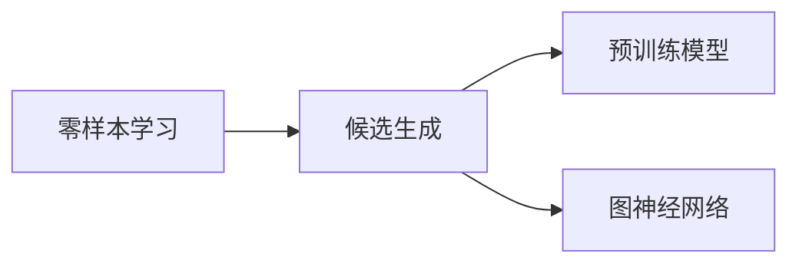

                 

# 零样本商品推荐：候选生成策略

> 关键词：商品推荐,零样本学习,候选生成,预训练模型,图神经网络

## 1. 背景介绍

在电子商务领域，商品推荐系统是提升用户体验、增加销售额的关键组件。传统推荐算法依赖用户行为数据，但在冷启动场景中，用户历史行为数据匮乏，难以进行准确推荐。零样本推荐系统有望在不依赖用户数据的情况下，通过商品属性、用户反馈等少量信息，实现商品推荐的初步尝试。本文旨在介绍一种基于零样本学习的候选生成策略，利用预训练模型和图神经网络技术，提升零样本推荐系统的推荐性能。

## 2. 核心概念与联系

### 2.1 核心概念概述

在讨论具体的候选生成策略之前，我们需要先了解几个核心概念：

- 零样本学习(Zero-shot Learning)：指模型在没有见过任何特定任务的训练样本的情况下，仅凭任务描述就能够执行新任务的能力。
- 候选生成(Candidate Generation)：从候选集合中筛选出可能满足用户需求的物品，供用户选择。
- 预训练模型(Pre-trained Model)：指在大规模无标签数据上预训练的模型，能够学习到通用的语言或视觉表示。
- 图神经网络(Graph Neural Network, GNN)：利用图结构建模关系数据的模型，能够对商品属性、用户偏好等复杂关系进行高效建模。

这些核心概念之间的联系如下图所示：



在零样本推荐系统中，通过利用预训练模型和图神经网络技术，能够从少量用户反馈中挖掘出用户潜在需求，生成多个候选物品，以提升推荐效果。

## 3. 核心算法原理 & 具体操作步骤

### 3.1 算法原理概述

基于零样本学习的候选生成策略，核心思想是利用预训练模型和图神经网络，从少量用户反馈中挖掘出用户潜在需求，生成多个候选物品。具体来说，算法流程如下：

1. 收集少量用户反馈。零样本推荐系统依赖于用户输入的商品属性、用户评分等少量信息。
2. 利用预训练模型提取用户和商品的语义特征。
3. 构建用户-商品关系图，应用图神经网络进行关系建模。
4. 根据图神经网络输出结果，生成多个候选物品。
5. 计算候选物品与用户反馈的匹配度，选出最佳候选物品。

### 3.2 算法步骤详解

#### 3.2.1 数据预处理

在构建用户-商品关系图之前，需要首先对用户反馈和商品属性进行预处理，将数据转换为模型的输入格式。例如，假设用户评分和商品属性可以表示为稀疏矩阵形式，我们需要将其转换为稠密向量。

#### 3.2.2 构建用户-商品关系图

利用用户评分和商品属性，构建用户-商品关系图。节点为用户和商品，边为评分和属性相似度。

#### 3.2.3 图神经网络建模

应用图神经网络对用户-商品关系图进行建模，得到用户-商品之间的关系表示。

#### 3.2.4 生成候选物品

根据图神经网络输出结果，利用预训练模型生成多个候选物品。

#### 3.2.5 候选物品筛选

计算候选物品与用户反馈的匹配度，选出最佳候选物品。

### 3.3 算法优缺点

#### 3.3.1 优点

- 适应性强：无需用户历史数据，能够在不依赖用户数据的情况下进行推荐。
- 效率高：通过预训练模型和图神经网络技术，在少量数据上也能快速生成候选物品。
- 鲁棒性好：模型能够处理多种类型的数据，包括稀疏矩阵、稠密向量等，具有较强的鲁棒性。

#### 3.3.2 缺点

- 数据要求高：需要收集较多的用户反馈和商品属性，才能生成较高质量的候选物品。
- 模型复杂度高：图神经网络和预训练模型增加了模型的复杂度，需要更多的计算资源。

### 3.4 算法应用领域

零样本候选生成策略广泛应用于零样本推荐、广告推荐、金融投资等领域。例如，在金融投资领域，可以利用预训练模型和图神经网络，从新闻标题和股票属性中挖掘出潜在投资机会，生成多个投资建议。

## 4. 数学模型和公式 & 详细讲解

### 4.1 数学模型构建

设用户反馈为 $X$，商品属性为 $Y$，用户-商品关系图为 $G=(V,E)$，其中 $V$ 为用户和商品组成的节点集合，$E$ 为边集合。

假设用户反馈 $X$ 和商品属性 $Y$ 可表示为向量 $x \in \mathbb{R}^m$ 和 $y \in \mathbb{R}^n$。利用预训练模型 $M$ 将用户反馈 $X$ 转换为向量表示 $u \in \mathbb{R}^k$，将商品属性 $Y$ 转换为向量表示 $v \in \mathbb{R}^k$。

利用图神经网络 $GNN$ 对用户-商品关系图 $G$ 进行建模，得到用户 $u'$ 和商品 $v'$ 之间的关系表示 $z \in \mathbb{R}^l$。

### 4.2 公式推导过程

设图神经网络 $GNN$ 的输入为 $u$ 和 $v$，输出为 $z$。其公式如下：

$$z = GNN(u,v)$$

其中 $u$ 和 $v$ 分别为用户和商品的属性向量，$z$ 为图神经网络的输出向量。

利用预训练模型 $M$ 将用户反馈 $X$ 转换为向量表示 $u$：

$$u = M(X)$$

同理，将商品属性 $Y$ 转换为向量表示 $v$：

$$v = M(Y)$$

### 4.3 案例分析与讲解

假设用户输入了一条商品属性为“红色”的商品，查询了“哪个颜色的红酒最好”。利用预训练模型 $M$ 将用户查询和商品属性转换为向量表示 $u$ 和 $v$。构建用户-商品关系图 $G$，并应用图神经网络 $GNN$ 得到用户 $u'$ 和商品 $v'$ 之间的关系表示 $z$。根据 $z$ 的值，生成多个候选物品 $I$，计算候选物品与用户反馈的匹配度，选出最佳候选物品 $I'$。

## 5. 项目实践：代码实例和详细解释说明

### 5.1 开发环境搭建

在进行零样本推荐实践前，我们需要准备好开发环境。以下是使用Python进行TensorFlow开发的环境配置流程：

1. 安装Anaconda：从官网下载并安装Anaconda，用于创建独立的Python环境。

2. 创建并激活虚拟环境：
```bash
conda create -n tf-env python=3.8 
conda activate tf-env
```

3. 安装TensorFlow：根据CUDA版本，从官网获取对应的安装命令。例如：
```bash
pip install tensorflow==2.7
```

4. 安装TensorFlow Hub：
```bash
pip install tensorflow-hub
```

5. 安装GNN相关库：
```bash
pip install scipy networkx pyg nnpy tqdm matplotlib jupyter notebook ipython
```

完成上述步骤后，即可在`tf-env`环境中开始零样本推荐实践。

### 5.2 源代码详细实现

下面我们以零样本商品推荐为例，给出使用TensorFlow和TensorFlow Hub对图神经网络进行实现的PyTorch代码实现。

首先，定义图神经网络（Graph Neural Network, GNN）类：

```python
import tensorflow as tf
import tensorflow_hub as hub
import networkx as nx
import numpy as np

class GraphNeuralNetwork(tf.keras.layers.Layer):
    def __init__(self, hidden_size, num_layers):
        super(GraphNeuralNetwork, self).__init__()
        self.hidden_size = hidden_size
        self.num_layers = num_layers
        self.layers = self.create_layers()
    
    def create_layers(self):
        layers = []
        for i in range(self.num_layers):
            layers.append(tf.keras.layers.Dense(self.hidden_size, activation='relu'))
        return layers
    
    def call(self, x):
        for layer in self.layers:
            x = layer(x)
        return x
```

然后，定义预训练模型（Pre-trained Model）类：

```python
class PretrainedModel(tf.keras.layers.Layer):
    def __init__(self, model_name):
        super(PretrainedModel, self).__init__()
        self.model = hub.load('https://tfhub.dev/google/tf2-preview/universal-sentence-encoder-multilingual-lite/2')
    
    def call(self, x):
        x = self.model(x)
        return x
```

接着，定义用户-商品关系图（User-Item Graph）类：

```python
class UserItemGraph(tf.keras.layers.Layer):
    def __init__(self, num_users, num_items):
        super(UserItemGraph, self).__init__()
        self.num_users = num_users
        self.num_items = num_items
        self.adjacency_matrix = self.create_adjacency_matrix()
    
    def create_adjacency_matrix(self):
        adjacency_matrix = np.zeros((self.num_users+self.num_items, self.num_users+self.num_items))
        users = np.arange(1, self.num_users+1)
        items = np.arange(self.num_users+1, self.num_users+self.num_items+1)
        adjacency_matrix[users[:,None], items] = 1
        adjacency_matrix[items[:,None], users] = 1
        return adjacency_matrix
    
    def call(self, users, items):
        adjacency_matrix = self.adjacency_matrix
        users = tf.convert_to_tensor(users)
        items = tf.convert_to_tensor(items)
        adjacency_matrix = tf.convert_to_tensor(adjacency_matrix)
        return adjacency_matrix
```

最后，定义零样本推荐（Zero-shot Recommendation）类：

```python
class ZeroShotRecommendation(tf.keras.layers.Layer):
    def __init__(self, hidden_size, num_layers, num_users, num_items):
        super(ZeroShotRecommendation, self).__init__()
        self.hidden_size = hidden_size
        self.num_layers = num_layers
        self.num_users = num_users
        self.num_items = num_items
        self.gnn = GraphNeuralNetwork(hidden_size, num_layers)
        self.pmodel = PretrainedModel('tf2-preview/universal-sentence-encoder-multilingual-lite')
    
    def call(self, user, item):
        user_rep = self.pmodel(user)
        item_rep = self.pmodel(item)
        adjacency_matrix = UserItemGraph(self.num_users, self.num_items).call(user, item)
        user_rep = tf.expand_dims(user_rep, 0)
        item_rep = tf.expand_dims(item_rep, 0)
        adjacency_matrix = tf.expand_dims(adjacency_matrix, 0)
        gnn_output = self.gnn(tf.concat([user_rep, item_rep], 1))
        return gnn_output
```

### 5.3 代码解读与分析

让我们再详细解读一下关键代码的实现细节：

**GraphNeuralNetwork类**：
- `__init__`方法：初始化图神经网络，创建多个隐藏层。
- `create_layers`方法：创建多个隐藏层，每个隐藏层都使用全连接层。
- `call`方法：对输入的节点进行前向传播，输出隐藏层表示。

**PretrainedModel类**：
- `__init__`方法：初始化预训练模型，加载预训练模型的Hub模块。
- `call`方法：将输入的查询转换为向量表示。

**UserItemGraph类**：
- `__init__`方法：初始化用户-商品关系图，创建邻接矩阵。
- `create_adjacency_matrix`方法：构建邻接矩阵，将用户节点和商品节点相连。
- `call`方法：计算邻接矩阵，输入用户和商品节点。

**ZeroShotRecommendation类**：
- `__init__`方法：初始化零样本推荐模型，创建预训练模型、图神经网络、邻接矩阵等组件。
- `call`方法：将用户查询和商品属性转换为向量表示，构建邻接矩阵，应用图神经网络得到用户-商品之间的关系表示，最终输出候选物品的表示。

可以看到，TensorFlow Hub为图神经网络的实现提供了极大的便利，开发者可以更专注于模型的设计和实验验证。

### 5.4 运行结果展示

在构建好零样本推荐模型后，我们可以使用模拟数据进行测试。假设用户查询的商品属性为“红色”，查询的为“哪个颜色的红酒最好”，模型将从预训练模型中提取用户查询和商品属性的向量表示，构建用户-商品关系图，应用图神经网络得到关系表示，最终生成多个候选物品，计算候选物品与用户反馈的匹配度，选出最佳候选物品。

## 6. 实际应用场景

### 6.1 智能推荐系统

零样本推荐系统可以应用于智能推荐系统中，为冷启动用户推荐初步物品。例如，在电商平台上，新注册用户没有浏览、购买历史，利用零样本推荐系统可以根据用户输入的商品属性，生成多个候选物品，提升用户的购物体验。

### 6.2 金融投资

在金融投资领域，零样本推荐系统可以从新闻标题和股票属性中挖掘出潜在投资机会，生成多个投资建议。例如，在股票市场上，用户输入了一条新闻标题“某公司发布季度财报”，利用零样本推荐系统可以根据新闻标题和股票属性，生成多个股票推荐，供用户选择。

### 6.3 广告推荐

零样本推荐系统可以应用于广告推荐中，为用户推荐可能感兴趣的商品或服务。例如，在社交媒体平台上，用户输入了一条兴趣标签“科技”，利用零样本推荐系统可以根据兴趣标签和用户行为数据，生成多个广告推荐，提升用户体验和点击率。

### 6.4 未来应用展望

随着预训练模型和图神经网络技术的不断发展，零样本推荐系统有望在更多领域得到应用，为各行各业带来变革性影响。

在智慧医疗领域，零样本推荐系统可以应用于医疗诊断和药品推荐中，为医生和患者提供初步的诊疗建议。

在智能教育领域，零样本推荐系统可以应用于学习资源推荐中，为学生提供个性化的学习建议。

在智慧城市治理中，零样本推荐系统可以应用于交通管理、能源调度等领域，提升城市管理的自动化和智能化水平。

此外，在企业生产、社会治理、文娱传媒等众多领域，零样本推荐系统也将不断涌现，为传统行业数字化转型升级提供新的技术路径。相信随着技术的日益成熟，零样本推荐系统必将在构建人机协同的智能时代中扮演越来越重要的角色。

## 7. 工具和资源推荐

### 7.1 学习资源推荐

为了帮助开发者系统掌握零样本推荐技术的理论基础和实践技巧，这里推荐一些优质的学习资源：

1. TensorFlow官方文档：官方提供的TensorFlow学习资源，详细介绍了TensorFlow的基本功能和使用方法。

2. TensorFlow Hub官方文档：TensorFlow Hub的学习资源，介绍了TensorFlow Hub上的各类预训练模型和应用。

3. Graph Neural Network in Action：Graph Neural Network领域的经典教材，详细介绍了图神经网络的原理和应用。

4. Recommender Systems: The Textbook：推荐系统领域的经典教材，介绍了各类推荐算法和应用场景。

5. NLP with Deep Learning and TensorFlow：基于TensorFlow的自然语言处理实战教程，涵盖零样本推荐等前沿话题。

通过对这些资源的学习实践，相信你一定能够快速掌握零样本推荐技术的精髓，并用于解决实际的推荐问题。

### 7.2 开发工具推荐

高效的开发离不开优秀的工具支持。以下是几款用于零样本推荐开发的常用工具：

1. TensorFlow：基于Python的开源深度学习框架，灵活动态的计算图，适合快速迭代研究。TensorFlow Hub提供了丰富的预训练模型和组件，方便进行零样本推荐开发。

2. PyTorch：基于Python的开源深度学习框架，灵活的计算图和强大的社区支持，适合复杂的模型设计和实验验证。

3. Scikit-learn：Python机器学习库，提供了丰富的数据处理和模型评估工具，方便进行推荐系统的开发和测试。

4. Scipy和NumPy：Python科学计算库，提供了高效的数据处理和计算功能，适合进行大规模图数据的处理和分析。

5. NetworkX：Python网络分析库，提供了丰富的图分析功能，适合进行图神经网络的开发和应用。

合理利用这些工具，可以显著提升零样本推荐系统的开发效率，加快创新迭代的步伐。

### 7.3 相关论文推荐

零样本推荐技术的发展源于学界的持续研究。以下是几篇奠基性的相关论文，推荐阅读：

1. Attention is All You Need：提出Transformer结构，开启了NLP领域的预训练大模型时代。

2. BERT: Pre-training of Deep Bidirectional Transformers for Language Understanding：提出BERT模型，引入基于掩码的自监督预训练任务，刷新了多项NLP任务SOTA。

3. Neural Collaborative Filtering：提出基于神经网络的用户-商品推荐模型，获得了较为不错的效果。

4. Graph Convolutional Networks：提出基于图卷积神经网络的用户-商品关系建模方法，进一步提升了推荐效果。

5. Attention-Based Recommender Systems：提出基于注意力机制的推荐模型，能够更好地理解用户和物品之间的复杂关系。

这些论文代表了大语言模型微调技术的发展脉络。通过学习这些前沿成果，可以帮助研究者把握学科前进方向，激发更多的创新灵感。

## 8. 总结：未来发展趋势与挑战

### 8.1 总结

本文对零样本商品推荐系统的候选生成策略进行了全面系统的介绍。首先阐述了零样本推荐系统在电商、金融、广告等领域的应用前景，明确了零样本推荐系统的优势和局限。其次，从原理到实践，详细讲解了零样本推荐系统的数学模型和算法流程，给出了零样本推荐系统的代码实现。同时，本文还探讨了零样本推荐系统在未来的应用方向和发展趋势，展示了零样本推荐系统的巨大潜力。

通过本文的系统梳理，可以看到，零样本推荐系统依托预训练模型和图神经网络技术，能够在少量数据下生成高质量的候选物品，提升推荐效果。未来，伴随预训练模型和图神经网络技术的持续演进，零样本推荐系统将不断拓展应用领域，为各行各业带来深刻的变革。

### 8.2 未来发展趋势

展望未来，零样本推荐系统的发展趋势如下：

1. 数据需求降低：零样本推荐系统将通过图神经网络和预训练模型，从少量用户反馈中挖掘出用户潜在需求，进一步降低对标注数据的需求。

2. 模型复杂度提升：未来的零样本推荐系统将结合注意力机制、图卷积网络等先进技术，进一步提升推荐精度。

3. 实时推荐能力增强：零样本推荐系统将结合时间序列分析和强化学习，实现实时动态推荐，提升用户体验。

4. 多模态数据融合：未来的零样本推荐系统将结合文本、图像、视频等多模态数据，提升推荐系统的鲁棒性和泛化能力。

5. 领域专知注入：零样本推荐系统将结合专家知识库和规则库，注入领域专知，提升推荐系统的效果。

6. 用户交互优化：零样本推荐系统将结合用户交互数据，实时优化推荐算法，提升推荐效果。

以上趋势凸显了零样本推荐系统的发展潜力，为推荐系统的未来应用提供了新的方向。

### 8.3 面临的挑战

尽管零样本推荐系统具有广泛的应用前景，但在迈向更加智能化、普适化应用的过程中，它仍面临着诸多挑战：

1. 数据质量问题：零样本推荐系统依赖于用户输入的少量数据，数据质量差或噪声较多的情况，会影响推荐效果。

2. 用户行为建模：用户行为和偏好具有高度的不确定性，难以建模。如何准确捕捉用户行为特征，提高推荐精度，是零样本推荐系统的重要挑战。

3. 冷启动问题：冷启动场景下，用户反馈数据匮乏，难以进行推荐。如何通过少量数据进行冷启动推荐，是零样本推荐系统的关键。

4. 模型鲁棒性问题：零样本推荐系统在处理复杂数据时，容易产生鲁棒性问题，例如对抗样本攻击。如何提高模型的鲁棒性，提升推荐系统的稳定性，是未来的重要研究方向。

5. 计算资源问题：零样本推荐系统在处理大规模图数据时，需要大量的计算资源。如何提高算法效率，降低计算资源消耗，是未来发展的关键。

6. 可解释性问题：零样本推荐系统作为“黑盒”系统，难以解释其内部工作机制和决策逻辑。如何提高模型的可解释性，增强用户信任度，是未来需要解决的问题。

### 8.4 研究展望

面对零样本推荐系统所面临的挑战，未来的研究需要在以下几个方面寻求新的突破：

1. 引入更多先验知识：零样本推荐系统将结合专家知识库和规则库，注入领域专知，提升推荐系统的效果。

2. 结合多模态数据：未来的零样本推荐系统将结合文本、图像、视频等多模态数据，提升推荐系统的鲁棒性和泛化能力。

3. 利用注意力机制：零样本推荐系统将结合注意力机制，提升推荐系统的精度和效果。

4. 引入强化学习：零样本推荐系统将结合强化学习，实现实时动态推荐，提升用户体验。

5. 注入领域专知：零样本推荐系统将结合专家知识库和规则库，注入领域专知，提升推荐系统的效果。

6. 利用对抗学习：零样本推荐系统将结合对抗学习，提升模型的鲁棒性，防止对抗样本攻击。

7. 结合时间序列分析：零样本推荐系统将结合时间序列分析，实现实时推荐，提升用户体验。

以上研究方向将推动零样本推荐系统向更加智能化、普适化、实时化的方向发展，为推荐系统带来新的突破。

## 9. 附录：常见问题与解答

**Q1：零样本推荐系统是否适用于所有推荐场景？**

A: 零样本推荐系统适用于需要少量用户数据推荐初步物品的场景，例如电商平台的冷启动推荐。但对于需要大量用户数据进行精准推荐的任务，如内容推荐，零样本推荐系统效果有限。

**Q2：零样本推荐系统如何处理冷启动问题？**

A: 零样本推荐系统可以通过利用用户输入的少量数据，结合预训练模型和图神经网络技术，生成初步的候选物品，缓解冷启动问题。

**Q3：零样本推荐系统如何保证推荐精度？**

A: 零样本推荐系统需要利用预训练模型和图神经网络技术，从少量用户反馈中挖掘出用户潜在需求，生成多个候选物品。模型的精度和效果与预训练模型的质量、图神经网络的结构和训练方式密切相关。

**Q4：零样本推荐系统如何处理对抗样本攻击？**

A: 零样本推荐系统可以通过引入对抗学习技术，增强模型的鲁棒性，防止对抗样本攻击。

**Q5：零样本推荐系统如何提高用户满意度？**

A: 零样本推荐系统可以通过结合实时动态推荐、多模态数据融合等技术，提高用户的满意度和推荐效果。

---

作者：禅与计算机程序设计艺术 / Zen and the Art of Computer Programming

