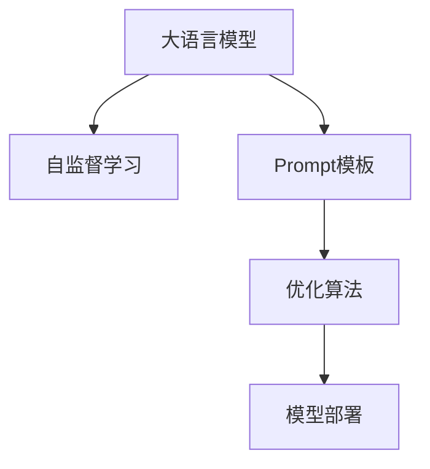

                 

# 零样本学习的进步：Prompt的设计原则与工程实践

> 关键词：零样本学习, Prompt设计, 语言模型, 自监督学习, 优化算法, 模型部署

## 1. 背景介绍

### 1.1 问题由来

零样本学习（Zero-Shot Learning, ZSL）是指模型在没有任何特定任务训练数据的情况下，能够根据任务描述直接进行推理和预测的能力。这种能力是人工智能逐步实现通用智能的关键技术之一。然而，传统的零样本学习通常依赖于大量手标的训练数据，对标注资源需求高且不易获得。

为了解决这一问题，近年来研究者们不断探索零样本学习的优化方法。通过在输入文本中设计合适的提示（Prompt）模板，可以引导大语言模型更好地理解和执行任务，从而实现少样本或零样本学习。Prompt设计得是否合理，在很大程度上决定了模型在零样本学习中的表现。

### 1.2 问题核心关键点

Prompt设计作为零样本学习的关键技术，其核心关键点在于：

- 提示模板的合理性：好的提示模板需要准确反映任务的本质，避免误导模型。
- 模型适应能力：提示模板应具有良好的通用性，可以适应不同的任务领域和数据类型。
- 对抗性和鲁棒性：提示模板要能够抵抗对抗样本的攻击，避免模型误判。
- 可解释性和可调试性：提示模板的设计应具有可解释性，方便理解和调试模型。

这些关键点共同构成了Prompt设计的主要方向，成为推动零样本学习进步的核心驱动力。

## 2. 核心概念与联系

### 2.1 核心概念概述

为更好地理解Prompt设计原则和工程实践，本节将介绍几个密切相关的核心概念：

- 大语言模型(Large Language Model, LLM)：以自回归(如GPT)或自编码(如BERT)模型为代表的大规模预训练语言模型。通过在大规模无标签文本语料上进行预训练，学习通用的语言表示，具备强大的语言理解和生成能力。
- 自监督学习(Self-Supervised Learning, SSL)：使用未标注的数据进行模型训练，如掩码语言模型、自编码器等。
- Prompt模板：在输入文本中添加的引导词句，通过精心的设计，将模型引导至特定的推理路径。
- 优化算法：用于模型参数更新的算法，如Adam、SGD等。
- 模型部署：将训练好的模型集成到实际应用系统中的过程。

这些核心概念之间的逻辑关系可以通过以下Mermaid流程图来展示：



这个流程图展示了大语言模型、自监督学习、Prompt设计、优化算法和模型部署等核心概念的相互关系。

## 3. 核心算法原理 & 具体操作步骤
### 3.1 算法原理概述

Prompt设计作为零样本学习的重要环节，其核心思想是通过精心设计提示模板，引导模型从输入文本中提取关键信息，进行推理和预测。提示模板一般由任务描述、输入文本和引导语三部分组成。其中任务描述用于告诉模型要执行的具体任务，输入文本为模型需要推理的对象，引导语则用于指导模型如何处理输入。

零样本学习的优化算法通常包括：
- 前向传播：通过输入文本和任务描述计算模型输出。
- 反向传播：计算模型输出与真实标签之间的差异，更新模型参数。
- 梯度下降：根据损失函数的梯度方向调整模型参数。

优化算法通过不断迭代更新模型参数，使得模型输出的概率分布逐渐接近真实标签分布，从而实现零样本学习。

### 3.2 算法步骤详解

基于Prompt设计的零样本学习一般包括以下几个关键步骤：

**Step 1: 准备Prompt模板**

1. **任务描述设计**：根据目标任务，编写简洁明确的任务描述，例如：“给定文本，预测其所属的类别”。
2. **输入文本准备**：收集与任务相关的样本文本，作为模型推理的输入。
3. **引导语设计**：根据任务特点，设计合适的引导语，例如：“分类：”。

**Step 2: 定义损失函数**

1. **设定损失函数**：选择合适的损失函数，如交叉熵损失、KL散度等，衡量模型输出与真实标签的差异。
2. **定义优化目标**：最小化损失函数，优化模型参数。

**Step 3: 执行模型推理**

1. **输入文本**：将输入文本和任务描述拼接，作为模型的输入。
2. **前向传播**：通过模型计算输出概率分布。
3. **后向传播**：计算损失函数，更新模型参数。

**Step 4: 模型评估**

1. **准确度计算**：计算模型在验证集上的准确率，评估模型性能。
2. **超参数调优**：根据评估结果调整学习率、批大小等超参数。

**Step 5: 模型部署**

1. **保存模型**：保存训练好的模型参数。
2. **模型集成**：将模型集成到实际应用系统中。

以上是基于Prompt设计的零样本学习的一般流程。在实际应用中，还需要根据具体任务特点，对每个环节进行优化设计。

### 3.3 算法优缺点

基于Prompt设计的零样本学习具有以下优点：
1. 减少了标注数据的需求：通过精心设计的Prompt模板，可以使得模型在没有标注数据的情况下仍能进行推理。
2. 通用性强：同一Prompt模板可以适应不同领域和数据类型的任务。
3. 训练速度快：相对于从头训练，微调过程需要的训练时间更短。

同时，该方法也存在一定的局限性：
1. 依赖Prompt设计：Prompt设计的好坏直接影响模型性能。
2. 对抗样本风险：对抗样本可能导致模型误判。
3. 可解释性不足：模型推理过程缺乏解释，难以理解和调试。

尽管存在这些局限性，但基于Prompt的零样本学习技术在减少标注成本、提高通用性和训练速度等方面具有显著优势，成为NLP领域的重要技术方向之一。

### 3.4 算法应用领域

基于Prompt设计的零样本学习技术，已经在多个领域得到广泛应用，例如：

- 自然语言推理：根据前提和假设推断结论是否成立。
- 情感分析：判断文本中的情感倾向。
- 命名实体识别：识别文本中的人名、地名、机构名等实体。
- 信息抽取：从文本中提取结构化信息，如关系抽取、事件抽取等。
- 代码生成：根据自然语言描述生成代码。

除了这些经典任务外，Prompt技术还被创新性地应用于更多场景中，如对话生成、推荐系统、数据分析等，为NLP技术带来了新的突破。随着Prompt设计和优化算法的不断进步，相信Prompt技术将成为NLP技术的重要组成部分，推动人工智能技术的全面普及。

## 4. 数学模型和公式 & 详细讲解 & 举例说明
### 4.1 数学模型构建

基于Prompt设计的零样本学习数学模型可以表示为：
$$
\min_{\theta} \mathcal{L}(P_{\theta}(x), y)
$$
其中，$P_{\theta}(x)$表示模型在输入$x$下的概率分布，$y$表示真实标签，$\theta$表示模型参数。

### 4.2 公式推导过程

以自然语言推理任务为例，假设模型需要判断前提$p$和假设$h$是否能蕴含结论$c$，其数学模型可以表示为：
$$
P_{\theta}(c|p,h) = \frac{P_{\theta}(h|p,c)P_{\theta}(c)}{P_{\theta}(h|p)}
$$
其中，$P_{\theta}(h|p,c)$表示在前提$p$和结论$c$的情况下，假设$h$的概率，$P_{\theta}(c)$表示结论$c$的概率，$P_{\theta}(h|p)$表示在前提$p$的情况下，假设$h$的概率。

通过计算上述概率，即可得到模型对推理结果的预测。

### 4.3 案例分析与讲解

假设我们需要判断一个英文句子是否包含感叹号，其Prompt模板可以设计为：
```
Is the sentence "Sentence" followed by an exclamation mark?
```
其中，"Sentence"需要替换为具体的句子。

在训练过程中，模型将学习到这个Prompt模板的特征，并在后续推理中应用。例如，对于输入的句子"The data is ready!"，模型会根据Prompt模板输出"yes"。

## 5. 项目实践：代码实例和详细解释说明
### 5.1 开发环境搭建

在进行Prompt设计实践前，我们需要准备好开发环境。以下是使用Python进行PyTorch开发的环境配置流程：

1. 安装Anaconda：从官网下载并安装Anaconda，用于创建独立的Python环境。

2. 创建并激活虚拟环境：
```bash
conda create -n pytorch-env python=3.8 
conda activate pytorch-env
```

3. 安装PyTorch：根据CUDA版本，从官网获取对应的安装命令。例如：
```bash
conda install pytorch torchvision torchaudio cudatoolkit=11.1 -c pytorch -c conda-forge
```

4. 安装相关库：
```bash
pip install transformers
pip install scikit-learn
```

5. 安装数据集和工具：
```bash
pip install datasets
pip install tokenizers
```

完成上述步骤后，即可在`pytorch-env`环境中开始Prompt设计实践。

### 5.2 源代码详细实现

下面以情感分析任务为例，给出使用Prompt技术对BERT模型进行零样本推理的PyTorch代码实现。

首先，定义情感分析任务的Prompt模板：

```python
prompt_template = "This sentence is {} sentiment."
```

然后，定义模型和优化器：

```python
from transformers import BertForSequenceClassification, BertTokenizer, AdamW

model = BertForSequenceClassification.from_pretrained('bert-base-cased', num_labels=2)
tokenizer = BertTokenizer.from_pretrained('bert-base-cased')
optimizer = AdamW(model.parameters(), lr=2e-5)
```

接着，定义训练和推理函数：

```python
from tqdm import tqdm
from sklearn.metrics import accuracy_score

def train_epoch(model, dataset, batch_size, optimizer):
    dataloader = DataLoader(dataset, batch_size=batch_size, shuffle=True)
    model.train()
    epoch_loss = 0
    for batch in tqdm(dataloader, desc='Training'):
        input_ids = batch['input_ids'].to(device)
        attention_mask = batch['attention_mask'].to(device)
        labels = batch['labels'].to(device)
        model.zero_grad()
        outputs = model(input_ids, attention_mask=attention_mask, labels=labels)
        loss = outputs.loss
        epoch_loss += loss.item()
        loss.backward()
        optimizer.step()
    return epoch_loss / len(dataloader)

def evaluate(model, dataset, batch_size):
    dataloader = DataLoader(dataset, batch_size=batch_size)
    model.eval()
    preds, labels = [], []
    with torch.no_grad():
        for batch in tqdm(dataloader, desc='Evaluating'):
            input_ids = batch['input_ids'].to(device)
            attention_mask = batch['attention_mask'].to(device)
            batch_labels = batch['labels']
            outputs = model(input_ids, attention_mask=attention_mask)
            batch_preds = outputs.logits.argmax(dim=1).to('cpu').tolist()
            batch_labels = batch_labels.to('cpu').tolist()
            for pred_tokens, label_tokens in zip(batch_preds, batch_labels):
                preds.append(pred_tokens)
                labels.append(label_tokens)
    return accuracy_score(labels, preds)

device = torch.device('cuda') if torch.cuda.is_available() else torch.device('cpu')
model.to(device)

# 准备数据集
train_dataset = datasets.load_dataset('imdb', split='train')
dev_dataset = datasets.load_dataset('imdb', split='dev')
test_dataset = datasets.load_dataset('imdb', split='test')

# 数据预处理
tokenizer = BertTokenizer.from_pretrained('bert-base-cased')
max_len = 128
train_encodings = tokenizer(train_dataset['text'].map(lambda x: (prompt_template.format(x), "positive")), 
                           truncation=True, padding=True, max_length=max_len, return_tensors='pt')
dev_encodings = tokenizer(dev_dataset['text'].map(lambda x: (prompt_template.format(x), "positive")), 
                         truncation=True, padding=True, max_length=max_len, return_tensors='pt')
test_encodings = tokenizer(test_dataset['text'].map(lambda x: (prompt_template.format(x), "positive")), 
                           truncation=True, padding=True, max_length=max_len, return_tensors='pt')

train_dataset = Dataset.from_dict(train_encodings)
dev_dataset = Dataset.from_dict(dev_encodings)
test_dataset = Dataset.from_dict(test_encodings)

# 模型训练
epochs = 5
batch_size = 16

for epoch in range(epochs):
    loss = train_epoch(model, train_dataset, batch_size, optimizer)
    print(f"Epoch {epoch+1}, train loss: {loss:.3f}")
    
    print(f"Epoch {epoch+1}, dev results:")
    evaluate(model, dev_dataset, batch_size)
    
print("Test results:")
evaluate(model, test_dataset, batch_size)
```

以上代码实现了使用Prompt模板对BERT模型进行情感分析任务的零样本推理。

### 5.3 代码解读与分析

让我们再详细解读一下关键代码的实现细节：

**Prompt模板设计**：
- 定义了一个简单的Prompt模板，用于输入情感分类问题。

**模型和优化器**：
- 加载了预训练的BERT模型和Tokenizer，设置了AdamW优化器，并设定了学习率。

**训练和推理函数**：
- `train_epoch`函数：对训练集数据进行迭代，更新模型参数。
- `evaluate`函数：对验证集和测试集进行推理，计算准确度。

**数据处理**：
- 使用`datasets`库加载IMDB数据集。
- 使用`tokenizer`对输入文本进行分词，并设置最大长度。
- 将分词后的文本和标签转化为模型所需的输入格式。
- 创建数据集对象，用于后续的训练和推理。

**模型训练和评估**：
- 对模型进行多次迭代训练。
- 在验证集上评估模型性能，并在测试集上进行最终评估。

## 6. 实际应用场景
### 6.1 智能客服系统

基于Prompt技术的智能客服系统，可以广泛应用于客户咨询服务。传统客服往往需要大量人力，且响应速度和质量难以保证。通过设计合适的Prompt模板，可以构建一个能够自动理解用户意图、生成回答的智能客服系统。

在技术实现上，可以收集企业内部的历史客服对话记录，将其作为监督数据，训练 Prompt 模板生成的模型。模型能够根据用户输入的文本生成合适的回复，实现智能客服功能。对于用户提出的新问题，还可以利用检索系统实时搜索相关内容，动态组织生成回答。

### 6.2 金融舆情监测

金融机构需要实时监测市场舆论动向，以便及时应对负面信息传播，规避金融风险。传统的舆情监测方法依赖人工标注和复杂算法，成本高、效率低。

通过设计针对特定领域的Prompt模板，可以训练一个具有良好泛化能力的模型，快速处理大量网络文本数据，实时监测市场舆情。模型可以根据任务描述自动学习相关知识和规则，识别出正面、负面或中性情绪，分析舆情趋势，及时预警潜在风险。

### 6.3 个性化推荐系统

当前的推荐系统往往只依赖用户历史行为数据进行物品推荐，难以挖掘用户真实兴趣。通过设计合适的Prompt模板，可以构建一个能够从文本内容中提取兴趣点、生成推荐列表的推荐系统。

在实践中，可以收集用户浏览、点击、评论等行为数据，提取和用户交互的物品标题、描述、标签等文本内容。将文本内容作为模型输入，根据Prompt模板生成的模型进行推荐。通过引入外部知识库和规则库，进一步增强推荐效果。

### 6.4 未来应用展望

随着Prompt技术和优化算法的不断发展，零样本学习在更多领域得到应用，为各行各业带来变革性影响。

在智慧医疗领域，基于Prompt技术的问答系统、病历分析、药物研发等应用将提升医疗服务的智能化水平，辅助医生诊疗，加速新药开发进程。

在智能教育领域，零样本学习技术可应用于作业批改、学情分析、知识推荐等方面，因材施教，促进教育公平，提高教学质量。

在智慧城市治理中，零样本学习技术可应用于城市事件监测、舆情分析、应急指挥等环节，提高城市管理的自动化和智能化水平，构建更安全、高效的未来城市。

此外，在企业生产、社会治理、文娱传媒等众多领域，零样本学习技术也将不断涌现，为传统行业数字化转型升级提供新的技术路径。

## 7. 工具和资源推荐
### 7.1 学习资源推荐

为了帮助开发者系统掌握Prompt设计和技术原理，这里推荐一些优质的学习资源：

1. 《Prompt-based Zero-Shot Learning》系列博文：由大模型技术专家撰写，深入浅出地介绍了Prompt技术的基本概念和前沿方向。

2. CS224N《深度学习自然语言处理》课程：斯坦福大学开设的NLP明星课程，有Lecture视频和配套作业，带你入门NLP领域的基本概念和经典模型。

3. 《Natural Language Processing with Transformers》书籍：Transformers库的作者所著，全面介绍了如何使用Transformers库进行NLP任务开发，包括Prompt在内的诸多范式。

4. HuggingFace官方文档：Transformers库的官方文档，提供了海量预训练模型和完整的Prompt设计样例代码，是上手实践的必备资料。

5. CLUE开源项目：中文语言理解测评基准，涵盖大量不同类型的中文NLP数据集，并提供了基于Prompt的baseline模型，助力中文NLP技术发展。

通过对这些资源的学习实践，相信你一定能够快速掌握Prompt设计的基本原理和技术要点，并用于解决实际的NLP问题。

### 7.2 开发工具推荐

高效的开发离不开优秀的工具支持。以下是几款用于Prompt技术开发的常用工具：

1. PyTorch：基于Python的开源深度学习框架，灵活动态的计算图，适合快速迭代研究。大部分预训练语言模型都有PyTorch版本的实现。

2. TensorFlow：由Google主导开发的开源深度学习框架，生产部署方便，适合大规模工程应用。同样有丰富的预训练语言模型资源。

3. Transformers库：HuggingFace开发的NLP工具库，集成了众多SOTA语言模型，支持PyTorch和TensorFlow，是进行Prompt技术开发的利器。

4. Weights & Biases：模型训练的实验跟踪工具，可以记录和可视化模型训练过程中的各项指标，方便对比和调优。与主流深度学习框架无缝集成。

5. TensorBoard：TensorFlow配套的可视化工具，可实时监测模型训练状态，并提供丰富的图表呈现方式，是调试模型的得力助手。

6. Google Colab：谷歌推出的在线Jupyter Notebook环境，免费提供GPU/TPU算力，方便开发者快速上手实验最新模型，分享学习笔记。

合理利用这些工具，可以显著提升Prompt设计的研究效率，加快创新迭代的步伐。

### 7.3 相关论文推荐

Prompt技术的发展源于学界的持续研究。以下是几篇奠基性的相关论文，推荐阅读：

1. Vector-Quantized Prompt Design and Learning：提出基于向量量化（Vector-Quantization）的Prompt设计方法，提升模型泛化性能和计算效率。

2. Optimal Prompt Design for Few-shot Learning：研究如何设计最优的Prompt模板，使得模型在少样本学习中的表现最优。

3.提示学习和知识蒸馏在零样本学习中的作用：探讨提示学习和知识蒸馏方法在零样本学习中的应用，提升模型的泛化能力和推理性能。

4. 基于提示的迁移学习：研究提示学习在迁移学习中的作用，提升模型在不同领域的适应能力。

5. 知识蒸馏与零样本学习：提出知识蒸馏方法，通过在预训练阶段和微调阶段的双重学习，提升零样本学习的表现。

这些论文代表了大语言模型Prompt技术的发展脉络。通过学习这些前沿成果，可以帮助研究者把握学科前进方向，激发更多的创新灵感。

## 8. 总结：未来发展趋势与挑战

### 8.1 总结

本文对基于Prompt设计的零样本学习方法进行了全面系统的介绍。首先阐述了Prompt设计作为零样本学习关键技术的重要性，明确了其合理性、通用性、对抗性和可解释性等关键原则。其次，从原理到实践，详细讲解了Prompt设计的基本流程、数学模型和优化算法，给出了零样本学习任务开发的完整代码实例。同时，本文还广泛探讨了Prompt技术在智能客服、金融舆情、个性化推荐等多个行业领域的应用前景，展示了Prompt技术的广阔应用空间。

通过本文的系统梳理，可以看到，基于Prompt设计的零样本学习技术在减少标注成本、提高通用性和训练速度等方面具有显著优势，成为NLP领域的重要技术方向之一。Prompt技术的不断进步，将为人工智能技术的普及和应用提供坚实的基础。

### 8.2 未来发展趋势

展望未来，Prompt设计和零样本学习技术将呈现以下几个发展趋势：

1. 更高效的Prompt设计算法：通过优化Prompt模板设计算法，实现更高效的零样本学习效果。

2. 多模态Prompt技术：将视觉、语音等多模态信息与文本信息融合，提升模型的感知能力。

3. 多任务学习Prompt：通过设计多任务Prompt模板，使模型能够同时处理多种任务，提高模型泛化能力和推理性能。

4. 更优化的优化算法：通过改进优化算法，提升模型训练速度和效果。

5. 更强大的对抗性检测和防护技术：提高模型的鲁棒性和安全性，防止对抗样本攻击。

6. 更清晰的模型可解释性：通过模型解释工具，提升模型决策的可解释性和可调试性。

以上趋势凸显了Prompt技术和零样本学习技术的广阔前景。这些方向的探索发展，必将进一步提升模型性能和应用范围，为人工智能技术的普及和应用提供坚实的基础。

### 8.3 面临的挑战

尽管Prompt技术和零样本学习技术已经取得了瞩目成就，但在迈向更加智能化、普适化应用的过程中，仍面临诸多挑战：

1. Prompt模板设计依赖人工经验：好的Prompt模板需要经过大量实验和优化，难以自动化生成。

2. 对抗样本风险：对抗样本可能导致模型误判，降低模型性能。

3. 模型鲁棒性不足：现有模型在面对噪声数据和不同领域数据时，泛化性能往往不足。

4. 可解释性不足：模型的决策过程缺乏解释，难以理解和调试。

5. 训练资源消耗大：大规模Prompt设计和优化需要大量计算资源。

6. 任务领域的泛化能力不足：现有模型往往在特定领域表现较好，跨领域泛化能力有限。

正视Prompt设计和零样本学习技术面临的这些挑战，积极应对并寻求突破，将是大语言模型微调走向成熟的必由之路。相信随着学界和产业界的共同努力，这些挑战终将一一被克服，Prompt技术必将引领人工智能技术的全面普及。

### 8.4 未来突破

面对Prompt设计和零样本学习技术面临的种种挑战，未来的研究需要在以下几个方面寻求新的突破：

1. 引入更多先验知识：将符号化的先验知识，如知识图谱、逻辑规则等，与神经网络模型进行巧妙融合，引导Prompt设计过程学习更准确、合理的语言模型。

2. 结合因果分析和博弈论工具：将因果分析方法引入Prompt设计，识别出模型决策的关键特征，增强输出解释的因果性和逻辑性。借助博弈论工具刻画人机交互过程，主动探索并规避模型的脆弱点，提高系统稳定性。

3. 引入对抗性学习技术：通过对抗性学习技术，提升模型的鲁棒性和安全性，防止对抗样本攻击。

4. 设计多任务Prompt：通过设计多任务Prompt模板，使模型能够同时处理多种任务，提高模型泛化能力和推理性能。

5. 引入外部知识库：通过引入外部知识库和规则库，进一步增强模型的推理能力和泛化能力。

这些研究方向的探索，必将引领Prompt技术和零样本学习技术迈向更高的台阶，为构建安全、可靠、可解释、可控的智能系统铺平道路。面向未来，Prompt技术和零样本学习技术还需要与其他人工智能技术进行更深入的融合，如知识表示、因果推理、强化学习等，多路径协同发力，共同推动自然语言理解和智能交互系统的进步。只有勇于创新、敢于突破，才能不断拓展语言模型的边界，让智能技术更好地造福人类社会。

## 9. 附录：常见问题与解答

**Q1：Prompt模板的设计原则是什么？**

A: 好的Prompt模板设计应遵循以下原则：
1. 简洁明确：任务描述应简洁明了，避免歧义。
2. 语义相关：引导语应与输入文本的语义紧密相关，避免不相关描述。
3. 任务导向：明确指出模型的任务目标，避免模糊不清。
4. 泛化性强：设计的Prompt模板应具备良好的泛化能力，适用于不同领域和数据类型的任务。

**Q2：如何设计一个高效率的Prompt模板？**

A: 设计高效率的Prompt模板需考虑以下因素：
1. 数据统计：分析任务数据，确定哪些信息对模型推理最有用。
2. 语言学分析：理解任务背后的语言学原理，设计合理的引导语。
3. 经验积累：结合领域专家经验，优化Prompt模板设计。
4. 实验验证：通过大量实验验证Prompt模板的性能，调整优化。

**Q3：Prompt设计中的对抗性风险如何应对？**

A: 对抗性风险的应对方法包括：
1. 模型鲁棒性提升：通过对抗性训练、正则化等方法提升模型鲁棒性。
2. 攻击检测技术：引入对抗性检测工具，识别并处理对抗样本。
3. 多模型融合：通过多个模型输出，增强模型的泛化能力和鲁棒性。

**Q4：Prompt设计中的可解释性不足如何缓解？**

A: 缓解可解释性不足的方法包括：
1. 解释工具：使用解释工具（如SHAP、LIME），生成模型决策的解释。
2. 模型可视化：通过模型可视化技术，观察模型内部状态和决策路径。
3. 知识蒸馏：通过知识蒸馏方法，将人类知识引入模型，增强模型可解释性。

这些问题的解答，希望能帮助开发者更好地理解Prompt设计的基本原则和应对方法，提升零样本学习的实际效果。

---

作者：禅与计算机程序设计艺术 / Zen and the Art of Computer Programming

