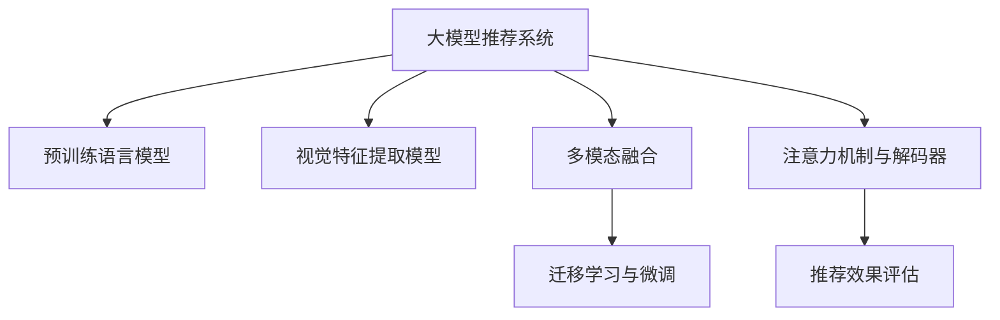

                 

# 音视频领域大模型推荐的机遇与挑战

> 关键词：音视频推荐,大模型推荐,深度学习,自然语言处理,推荐系统,多模态学习

## 1. 背景介绍

### 1.1 问题由来

随着互联网和移动互联网的迅猛发展，音视频内容已成为人们日常生活的重要组成部分。从在线视频、音乐、播客到直播、游戏，各种类型的音视频产品层出不穷。用户对于个性化推荐的需求日益增加，如何准确高效地为用户推荐内容，成为了音视频平台亟需解决的关键问题。传统的推荐系统多基于用户行为数据进行协同过滤或矩阵分解，但面临用户行为数据稀疏、冷启动问题。而利用大模型推荐技术，通过语义和视觉等多模态信息的融合，能够实现跨领域协同学习，生成更为精准、全面的推荐结果。

### 1.2 问题核心关键点

大模型推荐系统是基于大规模预训练模型的推荐技术，通过迁移学习和微调，将通用知识应用于特定推荐任务，生成个性化推荐结果。核心关键点包括：

- 预训练语言模型：如BERT、GPT等，通过海量文本数据预训练，学习语言的通用表示。
- 视觉特征提取模型：如ResNet、Inception等，通过大规模图像数据预训练，学习图像的语义表示。
- 多模态融合：结合语言和视觉信息，提升推荐结果的全面性和准确性。
- 迁移学习与微调：通过预训练模型的迁移学习与微调，优化特定推荐任务的效果。
- 注意力机制与解码器：如Transformer等，提高推荐模型的推理能力和泛化能力。
- 推荐效果评估：使用精确率、召回率、用户满意度等指标，评估推荐系统的性能。

## 2. 核心概念与联系

### 2.1 核心概念概述

为更好地理解大模型推荐系统的核心概念，本节将介绍几个密切相关的核心概念：

- 大模型推荐系统(Large Model Recommendation System, LMRS)：以自回归(如GPT)或自编码(如BERT)模型为代表的大规模预训练模型，通过迁移学习和微调，生成个性化推荐结果。
- 预训练语言模型：如BERT、GPT等，通过海量文本数据预训练，学习语言的通用表示。
- 视觉特征提取模型：如ResNet、Inception等，通过大规模图像数据预训练，学习图像的语义表示。
- 多模态融合：结合语言和视觉信息，提升推荐结果的全面性和准确性。
- 迁移学习与微调：通过预训练模型的迁移学习与微调，优化特定推荐任务的效果。
- 注意力机制与解码器：如Transformer等，提高推荐模型的推理能力和泛化能力。
- 推荐效果评估：使用精确率、召回率、用户满意度等指标，评估推荐系统的性能。

这些核心概念之间的逻辑关系可以通过以下Mermaid流程图来展示：



这个流程图展示了大模型推荐系统的核心概念及其之间的关系：

1. 大模型推荐系统通过预训练语言模型和视觉特征提取模型获取语义和视觉信息。
2. 通过多模态融合技术，将语言和视觉信息进行组合，生成更为全面的表示。
3. 利用迁移学习和微调，将通用知识应用于特定推荐任务，生成个性化推荐结果。
4. 引入注意力机制和解码器，提高推荐模型的推理能力和泛化能力。
5. 通过推荐效果评估指标，不断优化模型性能，提升用户满意度。

## 3. 核心算法原理 & 具体操作步骤
### 3.1 算法原理概述

大模型推荐系统基于大规模预训练模型的推荐技术，通过迁移学习和微调，将通用知识应用于特定推荐任务，生成个性化推荐结果。其核心思想是：将预训练的语言模型和视觉模型视作"知识提取器"，通过多模态融合和注意力机制，生成全面且精准的推荐表示。再通过迁移学习和微调，优化特定推荐任务的效果。

形式化地，假设预训练语言模型为 $L_{\theta_L}$，视觉模型为 $V_{\theta_V}$，其中 $\theta_L$ 和 $\theta_V$ 为预训练得到的模型参数。给定推荐任务 $T$ 的训练集 $D=\{(x_i, y_i)\}_{i=1}^N$，推荐目标是最小化推荐误差，即找到最优的推荐模型参数：

$$
\theta^* = \mathop{\arg\min}_{\theta} \mathcal{L}(L_{\theta_L}, V_{\theta_V}, D)
$$

其中 $\mathcal{L}$ 为针对任务 $T$ 设计的损失函数，用于衡量模型预测结果与真实标签之间的差异。常见的损失函数包括交叉熵损失、均方误差损失等。

### 3.2 算法步骤详解

大模型推荐系统的一般步骤如下：

**Step 1: 准备预训练模型和数据集**
- 选择合适的预训练语言模型 $L_{\theta_L}$ 和视觉模型 $V_{\theta_V}$，如BERT、GPT和ResNet、Inception等。
- 准备推荐任务 $T$ 的训练集 $D$，划分为训练集、验证集和测试集。一般要求标注数据与预训练数据的分布不要差异过大。

**Step 2: 添加任务适配层**
- 根据任务类型，在预训练模型顶层设计合适的输出层和损失函数。
- 对于分类推荐任务，通常在顶层添加线性分类器和交叉熵损失函数。
- 对于生成推荐任务，通常使用语言模型的解码器输出概率分布，并以负对数似然为损失函数。

**Step 3: 设置推荐超参数**
- 选择合适的优化算法及其参数，如 AdamW、SGD 等，设置学习率、批大小、迭代轮数等。
- 设置正则化技术及强度，包括权重衰减、Dropout、Early Stopping等。
- 确定冻结预训练参数的策略，如仅微调顶层，或全部参数都参与微调。

**Step 4: 执行梯度训练**
- 将训练集数据分批次输入模型，前向传播计算损失函数。
- 反向传播计算参数梯度，根据设定的优化算法和学习率更新模型参数。
- 周期性在验证集上评估模型性能，根据性能指标决定是否触发 Early Stopping。
- 重复上述步骤直到满足预设的迭代轮数或 Early Stopping 条件。

**Step 5: 测试和部署**
- 在测试集上评估微调后模型 $L_{\hat{\theta}_L}, V_{\hat{\theta}_V}$ 的性能，对比微调前后的精度提升。
- 使用微调后的模型对新样本进行推理预测，集成到实际的应用系统中。
- 持续收集新的数据，定期重新微调模型，以适应数据分布的变化。

以上是基于监督学习的大模型推荐系统的一般流程。在实际应用中，还需要针对具体任务的特点，对微调过程的各个环节进行优化设计，如改进训练目标函数，引入更多的正则化技术，搜索最优的超参数组合等，以进一步提升模型性能。

### 3.3 算法优缺点

大模型推荐系统具有以下优点：
1. 简单高效。只需准备少量标注数据，即可对预训练模型进行快速适配，生成高质量推荐结果。
2. 通用适用。适用于各种推荐任务，如视频推荐、音乐推荐、游戏推荐等，设计简单的任务适配层即可实现推荐。
3. 参数高效。利用参数高效微调技术，在固定大部分预训练参数的情况下，仍可取得不错的推荐效果。
4. 效果显著。在学术界和工业界的推荐任务上，基于大模型推荐的方法已经刷新了最先进的性能指标。

同时，该方法也存在一定的局限性：
1. 依赖标注数据。推荐效果很大程度上取决于标注数据的质量和数量，获取高质量标注数据的成本较高。
2. 迁移能力有限。当目标任务与预训练数据的分布差异较大时，推荐性能提升有限。
3. 负面效果传递。预训练模型的固有偏见、有害信息等，可能通过推荐传递到下游任务，造成负面影响。
4. 可解释性不足。推荐模型的决策过程通常缺乏可解释性，难以对其推理逻辑进行分析和调试。

尽管存在这些局限性，但就目前而言，基于监督学习的推荐方法仍是大模型推荐系统的主流范式。未来相关研究的重点在于如何进一步降低推荐对标注数据的依赖，提高模型的少样本学习和跨领域迁移能力，同时兼顾可解释性和伦理安全性等因素。

### 3.4 算法应用领域

大模型推荐系统在推荐领域已经得到了广泛的应用，覆盖了几乎所有常见任务，例如：

- 视频推荐：为用户推荐热门视频或相似视频。将视频元数据作为特征输入，在视觉和文本信息上进行推荐模型微调。
- 音乐推荐：根据用户听歌历史和音乐属性推荐音乐。通过多模态融合，结合语言和视觉信息，提升推荐结果的准确性。
- 游戏推荐：推荐适合用户喜好的游戏。使用游戏属性和用户行为数据，结合多模态信息生成推荐结果。
- 电商推荐：根据用户浏览历史、购买记录等推荐商品。利用大模型结合语义和视觉信息，生成多模态推荐结果。

除了上述这些经典任务外，大模型推荐还被创新性地应用到更多场景中，如个性化广告推荐、新闻推荐、在线课程推荐等，为推荐系统带来了全新的突破。随着预训练模型和推荐方法的不断进步，相信推荐系统将在更广阔的应用领域大放异彩。

## 4. 数学模型和公式 & 详细讲解  
### 4.1 数学模型构建

本节将使用数学语言对基于监督学习的大模型推荐系统进行更加严格的刻画。

记预训练语言模型为 $L_{\theta_L}$，视觉模型为 $V_{\theta_V}$，假设推荐任务训练集为 $D=\{(x_i,y_i)\}_{i=1}^N$。

定义模型 $L_{\theta_L}, V_{\theta_V}$ 在数据样本 $(x,y)$ 上的损失函数为 $\ell(L_{\theta_L}(x), V_{\theta_V}(x), y)$，则在数据集 $D$ 上的经验风险为：

$$
\mathcal{L}(\theta_L, \theta_V) = \frac{1}{N} \sum_{i=1}^N \ell(L_{\theta_L}(x_i), V_{\theta_V}(x_i), y_i)
$$

微调的优化目标是最小化经验风险，即找到最优的推荐模型参数：

$$
(\theta_L^*, \theta_V^*) = \mathop{\arg\min}_{\theta_L, \theta_V} \mathcal{L}(\theta_L, \theta_V)
$$

在实践中，我们通常使用基于梯度的优化算法（如SGD、Adam等）来近似求解上述最优化问题。设 $\eta$ 为学习率，$\lambda$ 为正则化系数，则参数的更新公式为：

$$
(\theta_L, \theta_V) \leftarrow (\theta_L, \theta_V) - \eta (\nabla_{\theta_L}\mathcal{L}(\theta_L, \theta_V) + \nabla_{\theta_V}\mathcal{L}(\theta_L, \theta_V)) - \eta (\lambda \theta_L + \lambda \theta_V)
$$

其中 $\nabla_{\theta_L}\mathcal{L}(\theta_L, \theta_V)$ 和 $\nabla_{\theta_V}\mathcal{L}(\theta_L, \theta_V)$ 为损失函数对参数 $\theta_L$ 和 $\theta_V$ 的梯度，可通过反向传播算法高效计算。

### 4.2 公式推导过程

以下我们以视频推荐任务为例，推导多模态推荐损失函数及其梯度的计算公式。

假设视频推荐系统包含视频元数据 $x$ 和用户历史行为数据 $y$，其中 $x$ 包含标题、描述、时长、标签等属性。设 $L_{\theta_L}$ 为预训练语言模型，$V_{\theta_V}$ 为预训练视觉模型。

推荐模型的输入为视频元数据 $x$，输出为视频序号 $y$，对应的损失函数为交叉熵损失：

$$
\ell(L_{\theta_L}(x), V_{\theta_V}(x), y) = -y\log(L_{\theta_L}(x)) - (1-y)\log(1-L_{\theta_L}(x))
$$

将其代入经验风险公式，得：

$$
\mathcal{L}(\theta_L, \theta_V) = -\frac{1}{N}\sum_{i=1}^N [y_i\log L_{\theta_L}(x_i)+(1-y_i)\log(1-L_{\theta_L}(x_i))] + \frac{1}{N}\sum_{i=1}^N [\ell(V_{\theta_V}(x_i), y_i)]
$$

根据链式法则，损失函数对参数 $\theta_L$ 和 $\theta_V$ 的梯度为：

$$
\frac{\partial \mathcal{L}(\theta_L, \theta_V)}{\partial \theta_L} = -\frac{1}{N}\sum_{i=1}^N (\frac{y_i}{L_{\theta_L}(x_i)}-\frac{1-y_i}{1-L_{\theta_L}(x_i)}) \frac{\partial L_{\theta_L}(x_i)}{\partial \theta_L} + \frac{1}{N}\sum_{i=1}^N \frac{\partial \ell(V_{\theta_V}(x_i), y_i)}{\partial \theta_L}
$$

$$
\frac{\partial \mathcal{L}(\theta_L, \theta_V)}{\partial \theta_V} = -\frac{1}{N}\sum_{i=1}^N \frac{\partial \ell(V_{\theta_V}(x_i), y_i)}{\partial \theta_V}
$$

其中 $\frac{\partial \ell(V_{\theta_V}(x_i), y_i)}{\partial \theta_L}$ 和 $\frac{\partial \ell(V_{\theta_V}(x_i), y_i)}{\partial \theta_V}$ 为视觉模型的输出损失函数对语言模型和视觉模型参数的偏导数，可通过反向传播算法计算。

在得到损失函数的梯度后，即可带入参数更新公式，完成模型的迭代优化。重复上述过程直至收敛，最终得到适应推荐任务的最优模型参数 $(\theta_L^*, \theta_V^*)$。

## 5. 项目实践：代码实例和详细解释说明
### 5.1 开发环境搭建

在进行推荐实践前，我们需要准备好开发环境。以下是使用Python进行PyTorch开发的环境配置流程：

1. 安装Anaconda：从官网下载并安装Anaconda，用于创建独立的Python环境。

2. 创建并激活虚拟环境：
```bash
conda create -n pytorch-env python=3.8 
conda activate pytorch-env
```

3. 安装PyTorch：根据CUDA版本，从官网获取对应的安装命令。例如：
```bash
conda install pytorch torchvision torchaudio cudatoolkit=11.1 -c pytorch -c conda-forge
```

4. 安装Transformers库：
```bash
pip install transformers
```

5. 安装各类工具包：
```bash
pip install numpy pandas scikit-learn matplotlib tqdm jupyter notebook ipython
```

完成上述步骤后，即可在`pytorch-env`环境中开始推荐实践。

### 5.2 源代码详细实现

下面我们以视频推荐任务为例，给出使用Transformers库对BERT模型进行微调的PyTorch代码实现。

首先，定义视频推荐任务的数据处理函数：

```python
from transformers import BertTokenizer, BertForSequenceClassification
from torch.utils.data import Dataset
import torch

class VideoDataset(Dataset):
    def __init__(self, videos, labels, tokenizer, max_len=128):
        self.videos = videos
        self.labels = labels
        self.tokenizer = tokenizer
        self.max_len = max_len
        
    def __len__(self):
        return len(self.videos)
    
    def __getitem__(self, item):
        video = self.videos[item]
        label = self.labels[item]
        
        encoding = self.tokenizer(video, return_tensors='pt', max_length=self.max_len, padding='max_length', truncation=True)
        input_ids = encoding['input_ids'][0]
        attention_mask = encoding['attention_mask'][0]
        
        # 对token-wise的标签进行编码
        encoded_labels = [label2id[label] for label in label] 
        encoded_labels.extend([label2id['O']] * (self.max_len - len(encoded_labels)))
        labels = torch.tensor(encoded_labels, dtype=torch.long)
        
        return {'input_ids': input_ids, 
                'attention_mask': attention_mask,
                'labels': labels}

# 标签与id的映射
label2id = {'O': 0, 'hot': 1, 'cold': 2}
id2label = {v: k for k, v in label2id.items()}

# 创建dataset
tokenizer = BertTokenizer.from_pretrained('bert-base-cased')

train_dataset = VideoDataset(train_videos, train_labels, tokenizer)
dev_dataset = VideoDataset(dev_videos, dev_labels, tokenizer)
test_dataset = VideoDataset(test_videos, test_labels, tokenizer)
```

然后，定义模型和优化器：

```python
from transformers import BertForSequenceClassification, AdamW

model = BertForSequenceClassification.from_pretrained('bert-base-cased', num_labels=len(label2id))

optimizer = AdamW(model.parameters(), lr=2e-5)
```

接着，定义训练和评估函数：

```python
from torch.utils.data import DataLoader
from tqdm import tqdm
from sklearn.metrics import classification_report

device = torch.device('cuda') if torch.cuda.is_available() else torch.device('cpu')
model.to(device)

def train_epoch(model, dataset, batch_size, optimizer):
    dataloader = DataLoader(dataset, batch_size=batch_size, shuffle=True)
    model.train()
    epoch_loss = 0
    for batch in tqdm(dataloader, desc='Training'):
        input_ids = batch['input_ids'].to(device)
        attention_mask = batch['attention_mask'].to(device)
        labels = batch['labels'].to(device)
        model.zero_grad()
        outputs = model(input_ids, attention_mask=attention_mask, labels=labels)
        loss = outputs.loss
        epoch_loss += loss.item()
        loss.backward()
        optimizer.step()
    return epoch_loss / len(dataloader)

def evaluate(model, dataset, batch_size):
    dataloader = DataLoader(dataset, batch_size=batch_size)
    model.eval()
    preds, labels = [], []
    with torch.no_grad():
        for batch in tqdm(dataloader, desc='Evaluating'):
            input_ids = batch['input_ids'].to(device)
            attention_mask = batch['attention_mask'].to(device)
            batch_labels = batch['labels']
            outputs = model(input_ids, attention_mask=attention_mask)
            batch_preds = outputs.logits.argmax(dim=2).to('cpu').tolist()
            batch_labels = batch_labels.to('cpu').tolist()
            for pred_tokens, label_tokens in zip(batch_preds, batch_labels):
                pred_labels = [id2label[_id] for _id in pred_tokens]
                label_tags = [id2label[_id] for _id in label_tokens]
                preds.append(pred_labels[:len(label_tags)])
                labels.append(label_tags)
                
    print(classification_report(labels, preds))
```

最后，启动训练流程并在测试集上评估：

```python
epochs = 5
batch_size = 16

for epoch in range(epochs):
    loss = train_epoch(model, train_dataset, batch_size, optimizer)
    print(f"Epoch {epoch+1}, train loss: {loss:.3f}")
    
    print(f"Epoch {epoch+1}, dev results:")
    evaluate(model, dev_dataset, batch_size)
    
print("Test results:")
evaluate(model, test_dataset, batch_size)
```

以上就是使用PyTorch对BERT进行视频推荐任务微调的完整代码实现。可以看到，得益于Transformers库的强大封装，我们可以用相对简洁的代码完成BERT模型的加载和微调。

### 5.3 代码解读与分析

让我们再详细解读一下关键代码的实现细节：

**VideoDataset类**：
- `__init__`方法：初始化视频、标签、分词器等关键组件。
- `__len__`方法：返回数据集的样本数量。
- `__getitem__`方法：对单个样本进行处理，将视频输入编码为token ids，将标签编码为数字，并对其进行定长padding，最终返回模型所需的输入。

**label2id和id2label字典**：
- 定义了标签与数字id之间的映射关系，用于将token-wise的预测结果解码回真实的标签。

**训练和评估函数**：
- 使用PyTorch的DataLoader对数据集进行批次化加载，供模型训练和推理使用。
- 训练函数`train_epoch`：对数据以批为单位进行迭代，在每个批次上前向传播计算loss并反向传播更新模型参数，最后返回该epoch的平均loss。
- 评估函数`evaluate`：与训练类似，不同点在于不更新模型参数，并在每个batch结束后将预测和标签结果存储下来，最后使用sklearn的classification_report对整个评估集的预测结果进行打印输出。

**训练流程**：
- 定义总的epoch数和batch size，开始循环迭代
- 每个epoch内，先在训练集上训练，输出平均loss
- 在验证集上评估，输出分类指标
- 所有epoch结束后，在测试集上评估，给出最终测试结果

可以看到，PyTorch配合Transformers库使得BERT微调的视频推荐任务代码实现变得简洁高效。开发者可以将更多精力放在数据处理、模型改进等高层逻辑上，而不必过多关注底层的实现细节。

当然，工业级的系统实现还需考虑更多因素，如模型的保存和部署、超参数的自动搜索、更灵活的任务适配层等。但核心的微调范式基本与此类似。

## 6. 实际应用场景
### 6.1 智能视频推荐

基于大模型推荐技术的视频推荐系统，可以为用户的观看体验提供有力保障。智能推荐系统能够分析用户的历史行为数据，根据兴趣和喜好推荐视频内容，提升用户的观看满意度。

在技术实现上，可以收集用户的视频观看历史、评分记录、标签等信息，构建推荐模型，在视觉和文本信息上进行多模态融合，生成推荐结果。随着预训练模型和推荐方法的不断进步，推荐系统的推荐结果将更加精准，用户满意度将大幅提升。

### 6.2 个性化音乐推荐

音乐推荐系统通过分析用户的听歌历史、评分、喜好等信息，为用户推荐个性化的音乐内容。音乐推荐系统可以利用大模型结合语义和视觉信息，提升推荐结果的准确性。

具体而言，可以收集用户的历史听歌记录、评分、标签等数据，使用BERT等预训练语言模型对音乐歌词进行语义编码，通过音乐封面图片对视觉信息进行编码。结合多模态融合技术，生成个性化的推荐结果。随着大模型的不断进步，推荐系统将能够更好地理解音乐的语义信息，提升推荐质量。

### 6.3 游戏推荐

游戏推荐系统通过分析用户的游玩历史、评分、评价等信息，为用户推荐适合的游戏内容。游戏推荐系统可以利用大模型结合游戏属性和用户行为数据，生成个性化的推荐结果。

具体而言，可以收集用户的游戏游玩历史、评分、评价等数据，使用BERT等预训练语言模型对游戏属性进行语义编码，通过游戏截图对视觉信息进行编码。结合多模态融合技术，生成个性化的推荐结果。随着大模型的不断进步，推荐系统将能够更好地理解游戏的语义信息，提升推荐质量。

### 6.4 未来应用展望

随着大模型推荐技术的不断发展，未来在更多领域将涌现更多创新应用：

- 在线教育推荐：利用大模型结合学习行为数据和知识图谱，推荐适合用户的学习资源和课程，提升学习效果。
- 在线金融推荐：结合用户交易数据和金融市场信息，为用户推荐合适的金融产品，提高投资收益。
- 社交媒体推荐：利用大模型结合用户行为数据和社交网络信息，推荐适合用户的内容，提升用户体验。
- 智能家居推荐：结合用户的行为数据和家居环境信息，推荐适合用户的生活用品，提升生活质量。
- 健康医疗推荐：结合用户的健康数据和医疗信息，推荐适合用户的医疗方案，提升健康水平。

这些创新应用将使大模型推荐技术在各行各业大放异彩，为人们的生活带来更加便捷、智能的服务。相信随着技术的不断进步，大模型推荐将为更多行业带来颠覆性变革，成为推动产业升级和社会进步的重要力量。

## 7. 工具和资源推荐
### 7.1 学习资源推荐

为了帮助开发者系统掌握大模型推荐技术的基础理论和实践技巧，这里推荐一些优质的学习资源：

1. 《Transformer from Introduction to Production》系列博文：由大模型技术专家撰写，深入浅出地介绍了Transformer原理、BERT模型、推荐系统等前沿话题。

2. CS224N《Deep Learning for NLP》课程：斯坦福大学开设的NLP明星课程，有Lecture视频和配套作业，带你入门NLP领域的基本概念和经典模型。

3. 《Natural Language Processing with Transformers》书籍：Transformers库的作者所著，全面介绍了如何使用Transformers库进行NLP任务开发，包括推荐系统的多项范式。

4. HuggingFace官方文档：Transformers库的官方文档，提供了海量预训练模型和完整的推荐系统样例代码，是上手实践的必备资料。

5. CLUE开源项目：中文语言理解测评基准，涵盖大量不同类型的中文NLP数据集，并提供了基于推荐系统的baseline模型，助力中文推荐系统技术发展。

通过对这些资源的学习实践，相信你一定能够快速掌握大模型推荐技术的精髓，并用于解决实际的推荐问题。
###  7.2 开发工具推荐

高效的开发离不开优秀的工具支持。以下是几款用于大模型推荐开发的常用工具：

1. PyTorch：基于Python的开源深度学习框架，灵活动态的计算图，适合快速迭代研究。大部分预训练语言模型都有PyTorch版本的实现。

2. TensorFlow：由Google主导开发的开源深度学习框架，生产部署方便，适合大规模工程应用。同样有丰富的预训练语言模型资源。

3. Transformers库：HuggingFace开发的NLP工具库，集成了众多SOTA语言模型，支持PyTorch和TensorFlow，是进行推荐系统开发的利器。

4. Weights & Biases：模型训练的实验跟踪工具，可以记录和可视化模型训练过程中的各项指标，方便对比和调优。与主流深度学习框架无缝集成。

5. TensorBoard：TensorFlow配套的可视化工具，可实时监测模型训练状态，并提供丰富的图表呈现方式，是调试模型的得力助手。

6. Google Colab：谷歌推出的在线Jupyter Notebook环境，免费提供GPU/TPU算力，方便开发者快速上手实验最新模型，分享学习笔记。

合理利用这些工具，可以显著提升大模型推荐任务的开发效率，加快创新迭代的步伐。

### 7.3 相关论文推荐

大模型推荐技术的发展源于学界的持续研究。以下是几篇奠基性的相关论文，推荐阅读：

1. Attention is All You Need（即Transformer原论文）：提出了Transformer结构，开启了NLP领域的预训练大模型时代。

2. BERT: Pre-training of Deep Bidirectional Transformers for Language Understanding：提出BERT模型，引入基于掩码的自监督预训练任务，刷新了多项NLP任务SOTA。

3. Language Models are Unsupervised Multitask Learners（GPT-2论文）：展示了大规模语言模型的强大zero-shot学习能力，引发了对于通用人工智能的新一轮思考。

4. Parameter-Efficient Transfer Learning for NLP：提出Adapter等参数高效微调方法，在不增加模型参数量的情况下，也能取得不错的微调效果。

5. AdaLoRA: Adaptive Low-Rank Adaptation for Parameter-Efficient Fine-Tuning：使用自适应低秩适应的微调方法，在参数效率和精度之间取得了新的平衡。

这些论文代表了大模型推荐技术的发展脉络。通过学习这些前沿成果，可以帮助研究者把握学科前进方向，激发更多的创新灵感。

## 8. 总结：未来发展趋势与挑战

### 8.1 总结

本文对基于监督学习的大模型推荐系统进行了全面系统的介绍。首先阐述了大模型推荐系统的研究背景和意义，明确了其在推荐领域的应用价值。其次，从原理到实践，详细讲解了推荐系统的数学原理和关键步骤，给出了推荐任务开发的完整代码实例。同时，本文还广泛探讨了大模型推荐系统在多个行业领域的应用前景，展示了其广阔的发展空间。

通过本文的系统梳理，可以看到，基于大模型的推荐系统正在成为推荐领域的重要范式，极大地拓展了推荐系统的应用边界，提升了推荐结果的全面性和准确性。未来，伴随预训练模型和推荐方法的不断进步，大模型推荐系统必将在更广泛的领域大放异彩，深刻影响人类生产生活方式。

### 8.2 未来发展趋势

展望未来，大模型推荐系统将呈现以下几个发展趋势：

1. 模型规模持续增大。随着算力成本的下降和数据规模的扩张，预训练语言模型和视觉模型的参数量还将持续增长。超大规模模型蕴含的丰富知识，有望支撑更加复杂多变的推荐任务。

2. 推荐方法日趋多样。除了传统的全参数微调外，未来会涌现更多参数高效的推荐方法，如Prefix-Tuning、LoRA等，在节省计算资源的同时也能保证推荐精度。

3. 持续学习成为常态。随着数据分布的不断变化，推荐模型也需要持续学习新知识以保持性能。如何在不遗忘原有知识的同时，高效吸收新样本信息，将成为重要的研究课题。

4. 标注样本需求降低。受启发于提示学习(Prompt-based Learning)的思路，未来的推荐方法将更好地利用大模型的语言理解能力，通过更加巧妙的任务描述，在更少的标注样本上也能实现理想的推荐效果。

5. 多模态推荐崛起。当前的推荐多聚焦于纯文本数据，未来会进一步拓展到图像、视频、语音等多模态数据推荐。多模态信息的融合，将显著提升推荐模型的全面性和鲁棒性。

6. 模型通用性增强。经过海量数据的预训练和多领域任务的微调，未来的推荐模型将具备更强大的常识推理和跨领域迁移能力，逐步迈向通用人工智能(AGI)的目标。

以上趋势凸显了大模型推荐技术的广阔前景。这些方向的探索发展，必将进一步提升推荐系统的性能和应用范围，为人类生产生活方式带来深远影响。

### 8.3 面临的挑战

尽管大模型推荐技术已经取得了瞩目成就，但在迈向更加智能化、普适化应用的过程中，它仍面临着诸多挑战：

1. 标注成本瓶颈。虽然推荐效果很大程度上取决于标注数据的质量和数量，但对于长尾应用场景，难以获得充足的高质量标注数据，成为制约推荐性能的瓶颈。如何进一步降低推荐对标注样本的依赖，将是一大难题。

2. 模型鲁棒性不足。当前推荐模型面对域外数据时，泛化性能往往大打折扣。对于测试样本的微小扰动，推荐模型的预测也容易发生波动。如何提高推荐模型的鲁棒性，避免灾难性遗忘，还需要更多理论和实践的积累。

3. 推荐效果评估问题。传统推荐效果评估指标如精确率、召回率等，难以全面衡量推荐系统的实际效果。如何构建更加全面、多样化的评估指标，综合评价推荐模型的性能，将成为重要的研究课题。

4. 个性化推荐挑战。如何在海量数据中找到用户真正的兴趣点，并实现个性化推荐，是推荐系统面临的重要挑战。个性化推荐需要考虑用户行为的复杂性和多样性，并兼顾模型的解释性和可解释性。

5. 隐私保护与数据安全。随着推荐系统在各行各业的应用，用户的隐私保护和数据安全问题愈发重要。如何在推荐过程中保护用户隐私，防止数据滥用，也是未来推荐系统的重要研究方向。

尽管存在这些挑战，但随着学界和产业界的共同努力，这些难题终将一一被克服，大模型推荐系统必将在构建智能推荐系统中发挥更大作用。相信随着技术的不断进步，大模型推荐系统将在推荐领域引领新一轮技术革命，推动推荐系统的广泛应用和深度普及。

### 8.4 研究展望

面对大模型推荐系统所面临的种种挑战，未来的研究需要在以下几个方面寻求新的突破：

1. 探索无监督和半监督推荐方法。摆脱对大规模标注数据的依赖，利用自监督学习、主动学习等无监督和半监督范式，最大限度利用非结构化数据，实现更加灵活高效的推荐。

2. 研究参数高效和计算高效的推荐范式。开发更加参数高效的推荐方法，在固定大部分预训练参数的同时，只更新极少量的任务相关参数。同时优化推荐模型的计算图，减少前向传播和反向传播的资源消耗，实现更加轻量级、实时性的部署。

3. 引入更多先验知识。将符号化的先验知识，如知识图谱、逻辑规则等，与神经网络模型进行巧妙融合，引导推荐过程学习更准确、合理的推荐模型。同时加强不同模态数据的整合，实现视觉、语音等多模态信息与文本信息的协同建模。

4. 结合因果分析和博弈论工具。将因果分析方法引入推荐模型，识别出推荐决策的关键特征，增强推荐过程的因果性和逻辑性。借助博弈论工具刻画人机交互过程，主动探索并规避推荐模型的脆弱点，提高系统稳定性。

5. 纳入伦理道德约束。在推荐模型训练目标中引入伦理导向的评估指标，过滤和惩罚有偏见、有害的输出倾向。同时加强人工干预和审核，建立推荐模型的监管机制，确保推荐结果符合人类价值观和伦理道德。

这些研究方向的探索，必将引领大模型推荐技术迈向更高的台阶，为构建安全、可靠、可解释、可控的推荐系统铺平道路。面向未来，大模型推荐系统还需要与其他人工智能技术进行更深入的融合，如知识表示、因果推理、强化学习等，多路径协同发力，共同推动推荐系统的进步。只有勇于创新、敢于突破，才能不断拓展推荐模型的边界，让智能推荐系统更好地服务于人类社会。

## 9. 附录：常见问题与解答
### Q1：大模型推荐系统是否适用于所有推荐任务？

A: 大模型推荐系统在大多数推荐任务上都能取得不错的效果，特别是对于数据量较小的任务。但对于一些特定领域的任务，如医药、金融等，仅仅依靠通用语料预训练的模型可能难以很好地适应。此时需要在特定领域语料上进一步预训练，再进行微调，才能获得理想效果。此外，对于一些需要时效性、个性化很强的任务，如对话、推荐等，推荐方法也需要针对性的改进优化。

### Q2：大模型推荐系统的推荐效果是否稳定？

A: 大模型推荐系统的推荐效果相对稳定，但在面对大规模数据时，可能会有一定程度的过拟合问题。为了解决这一问题，可以采用正则化技术、对抗训练等方法，提高模型的泛化能力。同时，通过引入更多先验知识和多模态融合，可以使推荐模型更加全面和鲁棒，进一步提升推荐结果的稳定性。

### Q3：大模型推荐系统对标注数据的需求大吗？

A: 大模型推荐系统对标注数据的需求相对较小，可以通过无监督学习、半监督学习等方法，利用非结构化数据进行模型训练。然而，标注数据仍是提升推荐效果的重要途径，特别是对于某些需要精细化推荐的领域，高质量标注数据的作用不容忽视。因此，在实际应用中，应根据任务特点合理搭配标注数据和非标注数据，以实现最优推荐效果。

### Q4：大模型推荐系统如何保证用户隐私？

A: 大模型推荐系统在推荐过程中，应采取严格的隐私保护措施，如数据脱敏、差分隐私等，保护用户隐私。同时，应避免将用户行为数据用于广告推荐等敏感领域，防止数据滥用。此外，应建立透明的隐私政策，告知用户数据的使用范围和方式，增强用户信任。

### Q5：大模型推荐系统在推荐过程中是否考虑用户多样性？

A: 大模型推荐系统在推荐过程中，可以通过引入多样性指标，如用户行为多样性、内容多样性等，确保推荐结果的多样性和公平性。同时，可以利用推荐系统对用户行为进行分析，发现和避免推荐的偏见和歧视，提升推荐结果的公平性和可解释性。

通过本文的系统梳理，可以看到，大模型推荐系统正在成为推荐领域的重要范式，极大地拓展了推荐系统的应用边界，提升了推荐结果的全面性和准确性。未来，伴随预训练模型和推荐方法的不断进步，大模型推荐系统必将在更广泛的领域大放异彩，深刻影响人类生产生活方式。

