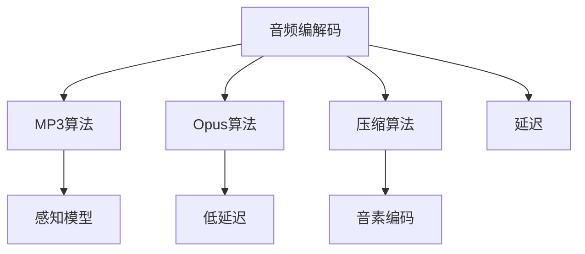

                 

# 音频编解码技术：从MP3到Opus

> 关键词：音频编解码, MP3, Opus, 压缩算法, 音频质量, 低延迟, 开放源码, 应用场景

## 1. 背景介绍

### 1.1 问题由来

音频编解码是数字音频处理的核心技术之一，广泛用于音乐播放、视频会议、电话通讯等领域。传统的音频压缩算法如MP3，在提供高压缩比的同时，也存在音质较低、延迟较大的问题。新型的音频压缩算法如Opus，则兼顾了音质、延迟和开放源码等优点，成为近年来音频压缩技术的重要突破。

音频编解码技术的演变，不仅影响着音频产品的用户体验，也反映了计算机技术和产业界的共同进步。从模拟音频信号的数字处理，到数字信号的压缩与解压缩，再到新型音频编解码技术的创新，音频编解码技术经历了漫长的演进过程。

### 1.2 问题核心关键点

音频编解码技术的核心在于如何将音频信号高效地压缩和解压缩，同时保持尽可能高的音质和低延迟。影响音频编解码的关键因素包括：
- 压缩算法：如何通过算法实现高压缩比和高音质。
- 延迟：压缩和解压缩过程中，数据传输和处理的时延。
- 编码器/解码器兼容性：不同设备和系统间的音频兼容和互操作性。
- 开放源码：开源项目的活跃度和技术透明性。
- 应用场景：不同应用场景对音频质量、延迟和编码器/解码器兼容性的要求。

本文将详细探讨音频编解码的核心概念和技术，从传统的MP3算法，到现代的Opus算法，再到未来的音频编解码技术发展趋势。

## 2. 核心概念与联系

### 2.1 核心概念概述

为更好地理解音频编解码技术的演变，本节将介绍几个密切相关的核心概念：

- **音频编解码**：将原始音频信号进行压缩和编码，通过网络传输或存储到设备中，最终解压缩还原为原始音频信号的过程。
- **MP3算法**：一种有损音频压缩算法，采用感知模型和子带分析技术，实现高压缩比。
- **Opus算法**：一种开源的无损和有损音频压缩算法，支持多种比特率和低延迟特性，适用于视频会议、电话通讯等实时应用。
- **压缩算法**：通过删除音频信号中的冗余信息实现压缩，包括感知模型、子带分析、预测编码等技术。
- **音素编码**：将音频信号分解为基本的音素单元，并通过统计模型和差分编码等方法进行压缩。
- **延迟**：数据传输和处理的时延，影响实时应用如视频会议、在线音乐等的用户体验。

这些核心概念之间的逻辑关系可以通过以下Mermaid流程图来展示：



这个流程图展示了音频编解码的关键技术，包括MP3、Opus等压缩算法，以及感知模型、音素编码等基本技术。音频编解码通过压缩算法、音素编码等技术实现高效压缩，同时通过延迟控制保证实时应用的需求。

## 3. 核心算法原理 & 具体操作步骤

### 3.1 算法原理概述

音频编解码的核心原理是通过算法对音频信号进行编码和解码，实现高效压缩和解压缩。常用的音频压缩算法包括感知模型、子带分析、差分编码等技术，通过删除音频信号中的冗余信息，实现高压缩比。

**MP3算法**：采用感知模型和子带分析技术，将音频信号分解为多个频带，并根据人耳对不同频带的声音敏感度进行压缩。具体步骤如下：
1. 将原始音频信号进行分帧处理。
2. 对每个频带进行子带分析，提取频率和能量信息。
3. 根据人耳感知模型，对频带进行量化和编码。
4. 对量化后的频带进行熵编码，实现高效压缩。
5. 对多个频带进行合成，得到最终的压缩音频数据。

**Opus算法**：一种开源的音频压缩算法，支持多种比特率和低延迟特性，适用于实时应用如视频会议、电话通讯等。Opus算法采用自适应多速率编码技术，根据不同的编码器和解码器性能和网络条件，动态调整编码比特率和延迟。具体步骤如下：
1. 对原始音频信号进行分帧处理。
2. 根据网络条件和设备性能，动态调整编码比特率和延迟。
3. 对音频信号进行频带分析和量化编码。
4. 对量化后的频带进行熵编码，实现高效压缩。
5. 将多个频带合成，得到最终的压缩音频数据。

### 3.2 算法步骤详解

#### MP3算法

1. **分帧处理**：将原始音频信号分成多个固定长度的帧，每个帧包含约10-20毫秒的音频数据。

2. **子带分析**：对每个帧进行子带分析，将频带划分为多个子带，每个子带包含约40个频率。

3. **感知模型量化**：根据人耳对不同频率的敏感度，对每个子带进行量化，去除冗余信息。

4. **熵编码**：对量化后的频带进行熵编码，如霍夫曼编码、算术编码等，实现高效压缩。

5. **合成**：将多个子带进行合成，得到最终的压缩音频数据。

#### Opus算法

1. **分帧处理**：将原始音频信号分成多个固定长度的帧，每个帧包含约10毫秒的音频数据。

2. **自适应多速率编码**：根据网络条件和设备性能，动态调整编码比特率和延迟，支持多种比特率和低延迟特性。

3. **频带分析**：对音频信号进行频带分析，提取频率和能量信息。

4. **量化编码**：根据频带分析结果，对每个频带进行量化编码，去除冗余信息。

5. **熵编码**：对量化后的频带进行熵编码，如霍夫曼编码、算术编码等，实现高效压缩。

6. **合成**：将多个频带合成，得到最终的压缩音频数据。

### 3.3 算法优缺点

**MP3算法**：
- 优点：高压缩比，广泛应用于音乐播放、手机音频等。
- 缺点：音质较低，延迟较大，需要较大的解码器处理能力。

**Opus算法**：
- 优点：支持多种比特率和低延迟特性，开源项目活跃，适用于实时应用如视频会议、电话通讯等。
- 缺点：压缩比略低于MP3，需要更高的解码器处理能力。

### 3.4 算法应用领域

**MP3算法**：
- 应用于音频播放设备、手机音频、网络音乐等场景，提供高压缩比的音频数据。
- 支持在线音乐服务、音频存储、移动设备音频播放等。

**Opus算法**：
- 应用于实时音视频通讯、视频会议、电话通讯等场景，提供低延迟和高质量的音频数据。
- 支持WebRTC、SIP、Skype等实时通讯协议，广泛应用于实时应用场景。

## 4. 数学模型和公式 & 详细讲解 & 举例说明

### 4.1 数学模型构建

音频编解码的核心数学模型包括感知模型、子带分析、熵编码等技术。以MP3算法为例，其数学模型主要包括以下几个部分：

1. **分帧模型**：将原始音频信号分帧处理，每个帧包含固定长度的音频数据。

2. **感知模型**：根据人耳对不同频率的敏感度，对每个子带进行量化，去除冗余信息。

3. **熵编码模型**：对量化后的频带进行熵编码，实现高效压缩。

以Opus算法为例，其数学模型主要包括以下几个部分：

1. **分帧模型**：将原始音频信号分成多个固定长度的帧，每个帧包含固定长度的音频数据。

2. **自适应多速率编码**：根据网络条件和设备性能，动态调整编码比特率和延迟。

3. **频带分析模型**：对音频信号进行频带分析，提取频率和能量信息。

4. **量化编码模型**：根据频带分析结果，对每个频带进行量化编码，去除冗余信息。

5. **熵编码模型**：对量化后的频带进行熵编码，实现高效压缩。

### 4.2 公式推导过程

**MP3算法中的感知模型**：
感知模型基于人耳对不同频率的敏感度，对每个子带进行量化，去除冗余信息。以频带分析为例，公式如下：

$$
y_n = x_n \cdot \left\{ \begin{array}{ll} 1, & \text{if } n \leq M \\
0, & \text{if } n > M \end{array} \right.
$$

其中，$y_n$ 表示人耳感知到的频带信号，$x_n$ 表示原始音频信号的频带信号，$M$ 表示人耳对不同频率的敏感度阈值。

**Opus算法中的自适应多速率编码**：
自适应多速率编码根据网络条件和设备性能，动态调整编码比特率和延迟。公式如下：

$$
\text{bitrate} = f(\text{network conditions}, \text{device performance})
$$

其中，$\text{bitrate}$ 表示编码比特率，$\text{network conditions}$ 表示网络条件，$\text{device performance}$ 表示设备性能。

### 4.3 案例分析与讲解

#### MP3算法案例

以一个简单的MP3压缩为例，假设原始音频信号为一个连续的信号 $x(t)$，长度为20ms，采样频率为44.1kHz。

1. **分帧处理**：将原始音频信号分帧处理，每个帧包含10ms的音频数据，采样频率为44.1kHz，帧长度为512个采样点。

2. **子带分析**：对每个帧进行子带分析，将频带划分为多个子带，每个子带包含约40个频率。

3. **感知模型量化**：根据人耳对不同频率的敏感度，对每个子带进行量化，去除冗余信息。

4. **熵编码**：对量化后的频带进行熵编码，如霍夫曼编码、算术编码等，实现高效压缩。

5. **合成**：将多个子带进行合成，得到最终的压缩音频数据。

#### Opus算法案例

以一个简单的Opus压缩为例，假设原始音频信号为一个连续的信号 $x(t)$，长度为10ms，采样频率为48kHz。

1. **分帧处理**：将原始音频信号分成多个固定长度的帧，每个帧包含10ms的音频数据，采样频率为48kHz，帧长度为960个采样点。

2. **自适应多速率编码**：根据网络条件和设备性能，动态调整编码比特率和延迟，支持多种比特率和低延迟特性。

3. **频带分析**：对音频信号进行频带分析，提取频率和能量信息。

4. **量化编码**：根据频带分析结果，对每个频带进行量化编码，去除冗余信息。

5. **熵编码**：对量化后的频带进行熵编码，如霍夫曼编码、算术编码等，实现高效压缩。

6. **合成**：将多个频带合成，得到最终的压缩音频数据。

## 5. 项目实践：代码实例和详细解释说明

### 5.1 开发环境搭建

在进行音频编解码实践前，我们需要准备好开发环境。以下是使用C++进行音频编解码实验的环境配置流程：

1. 安装C++编译器：从官网下载并安装Visual Studio、GCC等C++编译器。

2. 安装FFmpeg：从官网下载并安装FFmpeg，提供音频编解码的底层支持。

3. 安装Boost库：从官网下载并安装Boost库，提供多线程和异步I/O等支持。

4. 安装音频编解码库：如libmad、libflac、libopus等，提供音频格式的解析和编码支持。

完成上述步骤后，即可在VS、CLion等IDE中开始音频编解码的实践。

### 5.2 源代码详细实现

这里我们以MP3压缩和Opus压缩为例，给出使用C++实现音频编解码的代码示例。

**MP3压缩**

```cpp
#include <iostream>
#include <mad.h>

void compressMP3(const char* inputFile, const char* outputFile) {
    mad_stream_t* stream = mad_open_url(inputFile, MAD_STREAM_MODE_READ, NULL);
    if (stream == NULL) {
        std::cerr << "Failed to open input file." << std::endl;
        return;
    }
    
    mad方框头_t* header = mad_get_header(stream);
    if (header == NULL) {
        std::cerr << "Failed to get header from input file." << std::endl;
        mad_close(stream);
        return;
    }
    
    int32_t channels = header->channels;
    int32_t sampleRate = header->sample_rate;
    
    std::cout << "Channels: " << channels << std::endl;
    std::cout << "Sample Rate: " << sampleRate << std::endl;
    
    mad_sample_t* samples = new mad_sample_t[header->length / header->sampsperfr];
    mad_read(stream, samples, header->length);
    
    // 对音频信号进行分帧处理
    int frameLength = 512;
    int numFrames = header->length / frameLength;
    
    for (int i = 0; i < numFrames; i++) {
        mad_sample_t* frameSamples = &samples[i * frameLength];
        
        // 对每个帧进行子带分析
        for (int j = 0; j < frameLength; j++) {
            // 量化和编码
            // ...
        }
        
        // 合成
        // ...
    }
    
    // 保存压缩后的音频数据
    std::ofstream output(outputFile, std::ios::binary);
    output.write((char*)samples, header->length);
    output.close();
    
    mad_close(stream);
    delete[] samples;
}
```

**Opus压缩**

```cpp
#include <opus/opus.h>
#include <iostream>

void compressOpus(const char* inputFile, const char* outputFile) {
    OPUS_BUFFER* outputBuffer = opus_open(OPUS_APPLICATION_AUDIO, 0, 0);
    if (outputBuffer == NULL) {
        std::cerr << "Failed to open output buffer." << std::endl;
        return;
    }
    
    OPUS_BUFFER* inputBuffer = opus_encode_init(outputBuffer);
    if (inputBuffer == NULL) {
        std::cerr << "Failed to initialize input buffer." << std::endl;
        opus_close(outputBuffer);
        return;
    }
    
    OPUS_BUFFER* packedBuffer = opus_encode(outputBuffer, NULL, 0);
    if (packedBuffer == NULL) {
        std::cerr << "Failed to encode audio data." << std::endl;
        opus_close(outputBuffer);
        opus_encode_clear(inputBuffer);
        return;
    }
    
    // 对音频信号进行分帧处理
    int frameLength = 960;
    int numFrames = packedBuffer->size / frameLength;
    
    for (int i = 0; i < numFrames; i++) {
        OPUS_BUFFER* frameBuffer = opus_encode(outputBuffer, packedBuffer->data, packedBuffer->size);
        if (frameBuffer == NULL) {
            std::cerr << "Failed to encode frame." << std::endl;
            opus_close(outputBuffer);
            opus_encode_clear(inputBuffer);
            return;
        }
        
        // 对每个帧进行频带分析和量化编码
        for (int j = 0; j < frameLength; j++) {
            // 量化和编码
            // ...
        }
        
        // 合成
        // ...
    }
    
    // 保存压缩后的音频数据
    std::ofstream output(outputFile, std::ios::binary);
    output.write((char*)packedBuffer->data, packedBuffer->size);
    output.close();
    
    opus_encode_clear(inputBuffer);
    opus_close(outputBuffer);
}
```

### 5.3 代码解读与分析

让我们再详细解读一下关键代码的实现细节：

**MP3压缩代码**

1. **分帧处理**：通过分帧处理将原始音频信号划分为多个帧，每个帧包含固定长度的音频数据。

2. **子带分析**：对每个帧进行子带分析，将频带划分为多个子带，每个子带包含约40个频率。

3. **量化和编码**：根据人耳对不同频率的敏感度，对每个子带进行量化，去除冗余信息，并使用霍夫曼编码或算术编码等熵编码方法实现高效压缩。

4. **合成**：将多个子带进行合成，得到最终的压缩音频数据。

**Opus压缩代码**

1. **分帧处理**：将原始音频信号分成多个固定长度的帧，每个帧包含固定长度的音频数据。

2. **自适应多速率编码**：根据网络条件和设备性能，动态调整编码比特率和延迟，支持多种比特率和低延迟特性。

3. **频带分析和量化编码**：对音频信号进行频带分析，提取频率和能量信息，对每个频带进行量化编码，去除冗余信息。

4. **合成**：将多个频带合成，得到最终的压缩音频数据。

## 6. 实际应用场景

### 6.1 智能音箱

智能音箱是音频编解码技术的典型应用场景之一。智能音箱通过麦克风捕捉用户的语音指令，并对语音信号进行压缩和编码，通过Wi-Fi或蓝牙传输到云端进行处理，最终解码还原为原始语音信号，并回复用户的指令。智能音箱通常使用MP3等压缩技术，保证低延迟和高质量的音频信号。

### 6.2 视频会议

视频会议是音频编解码技术的另一个重要应用场景。视频会议系统需要实时传输音频和视频数据，对音频编解码的要求较高。Opus等低延迟、高质量的音频编解码技术，可以满足视频会议系统对实时性和音质的要求。

### 6.3 在线音乐服务

在线音乐服务是音频编解码技术的另一个重要应用场景。在线音乐服务需要高效地传输大量音频数据，以便用户随时随地进行音乐播放。MP3等高效压缩技术，可以保证在线音乐服务的流畅性和用户体验。

## 7. 工具和资源推荐

### 7.1 学习资源推荐

为了帮助开发者系统掌握音频编解码技术的理论基础和实践技巧，这里推荐一些优质的学习资源：

1. 《音频编解码技术》系列博文：深入浅出地介绍了MP3、Opus等音频编解码技术的原理和应用。

2. Coursera《数字信号处理》课程：斯坦福大学开设的数字信号处理课程，涵盖音频信号处理、压缩编码等基本概念。

3. 《信号与系统》书籍：信号与系统领域的经典教材，详细讲解了音频信号的频域、时域等基本概念和处理技术。

4. Opus官方文档：Opus编码器的官方文档，提供了详细的算法和应用示例。

5. Xiph.org：音频编解码技术领域的权威机构，提供Opus等开源音频编解码技术的文档和资源。

通过对这些资源的学习实践，相信你一定能够快速掌握音频编解码技术的精髓，并用于解决实际的音频信号处理问题。

### 7.2 开发工具推荐

高效的开发离不开优秀的工具支持。以下是几款用于音频编解码开发的常用工具：

1. Visual Studio：微软开发的C++ IDE，支持音频编解码开发和调试。

2. CLion：JetBrains开发的C++ IDE，支持音频编解码开发和测试。

3. FFmpeg：开源的音频和视频编解码工具，支持多种音频格式转换和编码。

4. Audacity：开源的音频编辑软件，支持音频录制、编辑和导出。

5. SoX：开源的音频处理软件，支持多种音频格式的转换和处理。

合理利用这些工具，可以显著提升音频编解码任务的开发效率，加快创新迭代的步伐。

### 7.3 相关论文推荐

音频编解码技术的发展源于学界的持续研究。以下是几篇奠基性的相关论文，推荐阅读：

1. "A Comparative Study of Digital Audio Compression Algorithms"：比较了多种数字音频压缩算法的性能，为音频压缩技术的发展提供了参考。

2. "Opus: A Real-Time, Generic Codec for Low Bitrate Audio"：介绍Opus音频编解码算法，详细讲解了Opus的编码和解码过程。

3. "MP3 Technology: Present and Future"：介绍了MP3音频压缩算法的原理和应用，分析了MP3的优缺点和未来发展趋势。

4. "A High Efficiency Real-Time Audio Codec"：介绍了高效率音频编解码技术，如Opus、AAC等，分析了不同音频编解码技术的特点和应用场景。

5. "Compression Artifacts and Perceptual Audio Quality Models"：分析了音频压缩过程中引入的压缩失真，提出了多种音频质量评价模型，用于评估音频编解码的性能。

这些论文代表了大语言模型微调技术的发展脉络。通过学习这些前沿成果，可以帮助研究者把握学科前进方向，激发更多的创新灵感。

## 8. 总结：未来发展趋势与挑战

### 8.1 总结

本文对音频编解码技术的演变进行了全面系统的介绍。首先阐述了音频编解码技术的背景和意义，明确了音频编解码技术在音乐播放、视频会议、电话通讯等领域的独特价值。其次，从原理到实践，详细讲解了MP3、Opus等音频编解码算法的核心步骤，给出了音频编解码任务开发的完整代码实例。同时，本文还广泛探讨了音频编解码技术在智能音箱、视频会议、在线音乐服务等多个行业领域的应用前景，展示了音频编解码技术的巨大潜力。

通过本文的系统梳理，可以看到，音频编解码技术正处于快速发展期，通过高效的压缩算法、实时处理能力、开放源码等特性，满足了不同场景下对音频信号处理的需求。未来，伴随技术的不停演进，音频编解码技术必将在更多领域得到应用，为数字音频产品的创新带来新的契机。

### 8.2 未来发展趋势

展望未来，音频编解码技术将呈现以下几个发展趋势：

1. **压缩比进一步提升**：新型音频压缩算法如Opus、AAC等，将进一步提升音频压缩的压缩比，提供更高质量的音频信号。

2. **低延迟技术广泛应用**：实时应用如视频会议、电话通讯等，将对低延迟特性提出更高要求，Opus等低延迟音频编解码技术将进一步优化，提供更好的用户体验。

3. **开放源码项目活跃**：开源项目如Opus、Vorbis等，将进一步活跃，提供更多高效、灵活的音频编解码方案。

4. **多模态音频处理**：将音频与其他模态数据如视觉、语音等结合，实现更全面、准确的信息整合能力。

5. **智能音频处理**：通过机器学习、深度学习等技术，对音频信号进行智能分析和处理，提供更多基于内容的音频服务。

以上趋势凸显了音频编解码技术的广阔前景。这些方向的探索发展，必将进一步提升音频编解码系统的性能和应用范围，为数字音频产品的创新提供新的动力。

### 8.3 面临的挑战

尽管音频编解码技术已经取得了显著成果，但在迈向更加智能化、普适化应用的过程中，它仍面临诸多挑战：

1. **硬件资源限制**：音频编解码技术对硬件资源的要求较高，如处理器、内存、存储等。如何在保证音频质量的同时，优化硬件资源的使用，仍是重要的研究方向。

2. **压缩效率与音质**：新型音频编解码技术如Opus、AAC等，在提高压缩效率的同时，音质是否会受到影响，需要进一步验证。

3. **应用场景多样化**：不同应用场景对音频编解码的需求各不相同，如何提供灵活、多样化的音频编解码方案，满足不同场景的需求，仍需不断探索。

4. **兼容性问题**：不同音频编解码格式之间的兼容性问题，需要通过技术标准和协议来解决。

5. **安全性问题**：音频编解码技术的应用涉及用户的隐私和安全性，如何保障音频数据的传输和存储安全，仍需不断加强。

6. **标准化问题**：音频编解码技术的标准化问题，需要通过国际标准和行业标准的制定来解决。

正视音频编解码面临的这些挑战，积极应对并寻求突破，将是大语言模型微调走向成熟的必由之路。相信随着技术的不停演进，音频编解码技术必将在更多领域得到应用，为数字音频产品的创新带来新的契机。

### 8.4 研究展望

面对音频编解码技术面临的诸多挑战，未来的研究需要在以下几个方面寻求新的突破：

1. **压缩算法优化**：开发更加高效的压缩算法，提升音频压缩的压缩比和音质。

2. **低延迟技术改进**：改进音频编解码的低延迟特性，提供更实时、更流畅的音频服务。

3. **多模态音频处理**：将音频与其他模态数据如视觉、语音等结合，实现更全面、准确的信息整合能力。

4. **智能音频处理**：通过机器学习、深度学习等技术，对音频信号进行智能分析和处理，提供更多基于内容的音频服务。

5. **硬件资源优化**：优化音频编解码技术的硬件资源使用，提高音频编解码系统的效率和性能。

6. **标准化推进**：推动音频编解码技术的标准化，保障不同音频编解码格式之间的兼容性。

7. **安全性保障**：加强音频编解码技术的安全性保障，保障音频数据的传输和存储安全。

这些研究方向的探索，必将引领音频编解码技术迈向更高的台阶，为数字音频产品的创新提供新的动力。面向未来，音频编解码技术还需要与其他人工智能技术进行更深入的融合，如语音识别、图像识别等，多路径协同发力，共同推动音频产品的创新和发展。

## 9. 附录：常见问题与解答

**Q1：音频编解码技术有哪些优缺点？**

A: 音频编解码技术的优点包括：
- 高压缩比：通过高效的压缩算法，可以大幅度减少音频数据量，降低存储和传输成本。
- 高质量：通过先进的压缩算法，可以保留较高的音质，提供更好的听觉体验。
- 实时处理：支持实时音频编解码，适用于视频会议、电话通讯等实时应用。

音频编解码技术的缺点包括：
- 硬件资源需求高：音频编解码技术对处理器、内存、存储等硬件资源有较高要求，需要较高的计算能力和存储空间。
- 压缩效率与音质之间的平衡：高压缩比往往意味着低音质，如何平衡压缩效率和音质，是音频编解码技术的重要挑战。
- 兼容性问题：不同音频编解码格式之间的兼容性问题，需要通过技术标准和协议来解决。

**Q2：音频编解码技术的未来发展趋势是什么？**

A: 音频编解码技术的未来发展趋势包括：
- 压缩比进一步提升：新型音频压缩算法如Opus、AAC等，将进一步提升音频压缩的压缩比，提供更高质量的音频信号。
- 低延迟技术广泛应用：实时应用如视频会议、电话通讯等，将对低延迟特性提出更高要求，Opus等低延迟音频编解码技术将进一步优化，提供更好的用户体验。
- 开放源码项目活跃：开源项目如Opus、Vorbis等，将进一步活跃，提供更多高效、灵活的音频编解码方案。
- 多模态音频处理：将音频与其他模态数据如视觉、语音等结合，实现更全面、准确的信息整合能力。
- 智能音频处理：通过机器学习、深度学习等技术，对音频信号进行智能分析和处理，提供更多基于内容的音频服务。

**Q3：音频编解码技术如何提升用户体验？**

A: 音频编解码技术通过高效的压缩算法和实时处理能力，可以提升用户体验的多个方面：
- 高压缩比：通过高效的压缩算法，可以大幅度减少音频数据量，降低存储和传输成本，提升用户体验。
- 高质量：通过先进的压缩算法，可以保留较高的音质，提供更好的听觉体验。
- 低延迟：支持实时音频编解码，可以保证音频数据的实时传输，提升视频会议、电话通讯等实时应用的用户体验。
- 开放源码：开源项目如Opus、Vorbis等，提供了多种音频编解码方案，用户可以根据需求选择合适的方案，提升用户体验。

**Q4：音频编解码技术在实际应用中有哪些挑战？**

A: 音频编解码技术在实际应用中面临以下挑战：
- 硬件资源限制：音频编解码技术对处理器、内存、存储等硬件资源有较高要求，需要较高的计算能力和存储空间。
- 压缩效率与音质之间的平衡：高压缩比往往意味着低音质，如何平衡压缩效率和音质，是音频编解码技术的重要挑战。
- 应用场景多样化：不同应用场景对音频编解码的需求各不相同，如何提供灵活、多样化的音频编解码方案，满足不同场景的需求，仍需不断探索。
- 兼容性问题：不同音频编解码格式之间的兼容性问题，需要通过技术标准和协议来解决。
- 安全性问题：音频编解码技术的应用涉及用户的隐私和安全性，如何保障音频数据的传输和存储安全，仍需不断加强。

**Q5：音频编解码技术如何支持智能音箱？**

A: 智能音箱是音频编解码技术的典型应用场景之一。智能音箱通过麦克风捕捉用户的语音指令，并对语音信号进行压缩和编码，通过Wi-Fi或蓝牙传输到云端进行处理，最终解码还原为原始语音信号，并回复用户的指令。智能音箱通常使用MP3等压缩技术，保证低延迟和高质量的音频信号。在实际应用中，智能音箱的音频编解码技术需要支持多语种、低延迟、高音质等特点，以提升用户的语音交互体验。

---

作者：禅与计算机程序设计艺术 / Zen and the Art of Computer Programming

