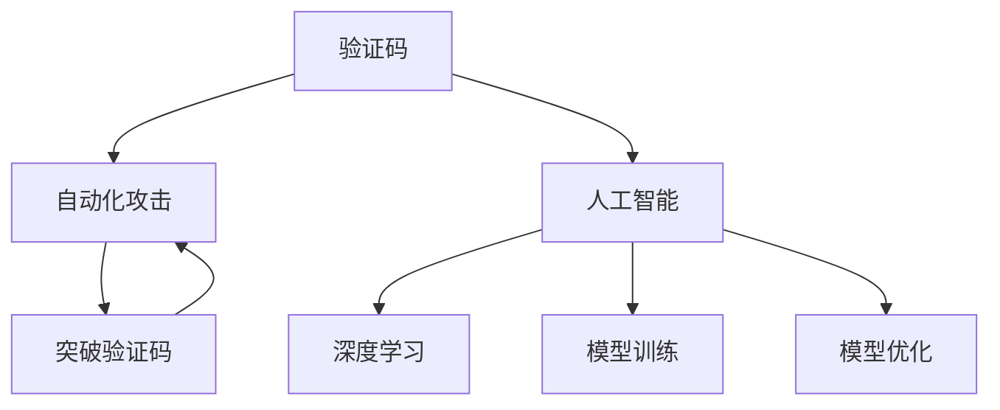

                 

## 1. 背景介绍

在互联网时代，验证码成为了人类计算（Human Computation）的另类应用场景，保护着网络空间的安全与秩序。验证码并非新技术，却是经典而有效的反自动化攻击手段。它巧妙地将人工智能与人类智慧相结合，让机器通过复杂的识别任务验证用户身份，有效防止了自动化脚本的恶意操作，保护了网站和用户的合法权益。

验证码之所以能够经久不衰，主要在于其灵活多变的形式和挑战性的设计，既能够有效防欺诈，又尽量减少了对正常用户的影响。然而，随着技术的进步，攻击者也找到了各种突破验证码的方法，如OCR技术、自动化破解工具等，使得验证码不断面临新的挑战。本文将深入探讨验证码的原理、技术演进与挑战，以及未来的发展趋势。

## 2. 核心概念与联系

### 2.1 核心概念概述

为更好地理解验证码，本节将介绍几个关键概念：

- 验证码（Captcha）：一种用于区分人类和计算机的验证方式，通常要求用户通过识别数字、字母、图案等视觉元素来完成验证过程。
- 自动化攻击（Automated Attack）：利用算法和脚本进行恶意操作的行为，如恶意注册、自动化提交表单等。
- 人工智能（AI）：通过算法使计算机具备模拟人类智能的能力，如图像识别、语音识别等。
- 深度学习（Deep Learning）：一种基于神经网络的机器学习方法，广泛应用于图像识别、自然语言处理等领域。
- 模型训练（Model Training）：通过大量标注数据，训练模型使其具备特定能力的过程。
- 模型优化（Model Optimization）：在模型训练后，对模型参数进行优化以提升模型性能和泛化能力。

这些概念之间的联系可以通过以下Mermaid流程图来展示：



这个流程图展示了一些关键概念及其之间的关系：

1. 验证码通过复杂任务区分人机，防止自动化攻击。
2. 自动化攻击利用AI技术，如深度学习，试图破解验证码。
3. 深度学习是人工智能技术的一个分支，用于训练和优化模型，以识别验证码。
4. 模型训练和优化是提升验证码识别精度的关键步骤。
5. 自动化攻击者通过技术手段试图破解验证码，与防御者形成动态博弈。

## 3. 核心算法原理 & 具体操作步骤

### 3.1 算法原理概述

验证码的设计和识别涉及复杂的计算任务，其中图像识别、文本识别、语音识别等领域的技术都在发挥作用。以下以文本识别验证码为例，探讨其原理和具体操作步骤。

### 3.2 算法步骤详解

文本识别验证码的识别过程一般包括以下步骤：

**Step 1: 生成验证码**
- 从预定义的字符集中随机选择若干字符，生成一段文本。
- 将文本进行像素化处理，生成一张包含文字的验证码图片。
- 在图片中加入随机噪点、扭曲、旋转等干扰元素，增加识别难度。

**Step 2: 设计识别任务**
- 将文本验证码作为目标识别任务，定义识别规则和评判标准。
- 通常需要设定识别准确率、响应时间等指标，作为模型优化的参考。

**Step 3: 模型训练**
- 选择合适的深度学习模型（如卷积神经网络CNN、循环神经网络RNN等），在标注数据集上训练。
- 标注数据集包括正确答案和错误示例，帮助模型学习识别规律。
- 选择合适的优化器（如Adam、SGD等）和损失函数（如交叉熵损失），迭代优化模型参数。

**Step 4: 模型评估**
- 在测试集上评估模型的识别准确率、响应时间等指标，了解模型性能。
- 根据评估结果，调整模型参数或重新训练模型，进一步优化。

**Step 5: 部署和应用**
- 将训练好的模型部署到实际应用场景中，如登录页面、交易确认页面等。
- 实时接收验证码，并调用识别模型进行识别，验证用户身份。

### 3.3 算法优缺点

文本识别验证码的优点包括：

- 简单易实现：生成和验证过程相对简单，适用于各种场景。
- 抗攻击性强：加入了随机干扰元素，防止自动化攻击。
- 灵活可定制：可自定义字符集、任务难度等参数，适应不同场景需求。

同时，该方法也存在一些缺点：

- 识别难度高：加入干扰元素后，识别任务变得更加复杂。
- 成本高：需要人工标注大量数据，训练和优化模型。
- 用户友好性差：验证码形式固定，可能影响用户体验。

### 3.4 算法应用领域

验证码技术广泛应用于网站注册、登录、交易确认、广告点击等领域，防止自动化攻击，保护网站和用户权益。其应用领域包括：

- 用户注册与登录：验证新用户注册信息的真实性，防止恶意注册。
- 交易确认：验证交易信息是否由真实用户操作，防止欺诈行为。
- 广告点击：确认广告点击是否为人工操作，防止恶意点击。
- 评论发布：防止自动化发布恶意评论，维护社区秩序。

此外，验证码技术还被应用于其他领域，如电话客服识别、邮箱验证等，保护数据安全和系统安全。

## 4. 数学模型和公式 & 详细讲解

### 4.1 数学模型构建

验证码识别任务可以形式化为一个分类问题，将输入的验证码图片分类为不同字符。设验证码图片为 $I$，字符为 $C$，模型为 $M$。则目标为最大化分类准确率：

$$
\max_{M} \text{Accuracy}(M)
$$

其中，分类准确率定义为正确分类样本数与总样本数的比例。

### 4.2 公式推导过程

假设模型 $M$ 为卷积神经网络，包括卷积层、池化层、全连接层等。设图片 $I$ 的大小为 $h \times w$，卷积核大小为 $k \times k$，卷积层输出特征图大小为 $h' \times w'$。则模型输出的分类概率为：

$$
\text{Pr}(C_i|I) = \frac{e^{M(I; \theta)}}{\sum_{j=1}^C e^{M(I; \theta_j)}}
$$

其中，$M(I; \theta)$ 为模型在输入 $I$ 下的输出，$\theta$ 为模型参数。

对于训练集 $D=\{(I_i, C_i)\}_{i=1}^N$，模型损失函数为：

$$
\mathcal{L}(\theta) = -\frac{1}{N} \sum_{i=1}^N \log \text{Pr}(C_i|I_i)
$$

目标是通过优化损失函数 $\mathcal{L}(\theta)$，使模型 $M$ 最大化分类准确率。

### 4.3 案例分析与讲解

以手写数字识别验证码为例，分析其数学模型和公式推导过程。

假设验证码图片为 $28 \times 28$ 的灰度图像，每个像素点 $p_{i,j}$ 的灰度值为 $I_{i,j}$，共 $784$ 个像素点。设卷积核大小为 $3 \times 3$，卷积层输出特征图大小为 $14 \times 14$。则卷积层输出的特征图 $\mathcal{G}$ 为：

$$
\mathcal{G}_{i,j} = \sum_{m=1}^9 \sum_{n=1}^9 k_{m,n} \ast I_{(i-1) \times 3 + m, (j-1) \times 3 + n}
$$

其中，$k_{m,n}$ 为卷积核权重，$\ast$ 为卷积运算。

设卷积层输出的特征图大小为 $14 \times 14$，通过两次卷积和池化后，特征图大小为 $7 \times 7$，通过全连接层输出分类概率。设全连接层输出为 $N_{in} \times N_{out}$ 矩阵 $W$，则分类概率为：

$$
\text{Pr}(C_i|I_i) = \text{softmax}(W \cdot \mathcal{G})
$$

其中，$\text{softmax}$ 函数为：

$$
\text{softmax}(x_i) = \frac{e^{x_i}}{\sum_{j=1}^{C} e^{x_j}}
$$

目标是通过优化损失函数 $\mathcal{L}(\theta)$，使模型最大化分类准确率。

## 5. 项目实践：代码实例和详细解释说明

### 5.1 开发环境搭建

在进行验证码识别项目实践前，我们需要准备好开发环境。以下是使用Python进行TensorFlow开发的环境配置流程：

1. 安装Anaconda：从官网下载并安装Anaconda，用于创建独立的Python环境。

2. 创建并激活虚拟环境：
```bash
conda create -n tf-env python=3.8 
conda activate tf-env
```

3. 安装TensorFlow：根据CUDA版本，从官网获取对应的安装命令。例如：
```bash
conda install tensorflow -c tf
```

4. 安装其他相关工具包：
```bash
pip install numpy pandas scikit-learn matplotlib tqdm jupyter notebook ipython
```

完成上述步骤后，即可在`tf-env`环境中开始验证码识别实践。

### 5.2 源代码详细实现

这里我们以手写数字识别验证码为例，给出使用TensorFlow实现卷积神经网络进行验证码识别的代码实现。

首先，定义数据处理函数：

```python
import numpy as np
import tensorflow as tf
from tensorflow.keras.datasets import mnist

class CaptchaDataset(tf.keras.utils.Sequence):
    def __init__(self, images, labels, batch_size=32, shuffle=True):
        self.images = images
        self.labels = labels
        self.batch_size = batch_size
        self.shuffle = shuffle
        self.epochs = 0
        self.on_epoch_end()
        
    def __len__(self):
        return int(np.ceil(len(self.images) / self.batch_size))
        
    def __getitem__(self, index):
        images = self.images[index * self.batch_size: (index + 1) * self.batch_size]
        labels = self.labels[index * self.batch_size: (index + 1) * self.batch_size]
        self.epochs += 1
        if self.shuffle:
            np.random.shuffle(self.images)
            np.random.shuffle(self.labels)
        return images, labels
    
    def on_epoch_end(self):
        self.epochs = 0
        self.shuffle = True
```

然后，定义模型和优化器：

```python
from tensorflow.keras.models import Sequential
from tensorflow.keras.layers import Conv2D, MaxPooling2D, Flatten, Dense, Dropout

model = Sequential()
model.add(Conv2D(32, (3, 3), activation='relu', input_shape=(28, 28, 1)))
model.add(MaxPooling2D((2, 2)))
model.add(Conv2D(64, (3, 3), activation='relu'))
model.add(MaxPooling2D((2, 2)))
model.add(Flatten())
model.add(Dense(64, activation='relu'))
model.add(Dropout(0.5))
model.add(Dense(10, activation='softmax'))

optimizer = tf.keras.optimizers.Adam(learning_rate=0.001)
```

接着，定义训练和评估函数：

```python
def train_epoch(model, dataset, batch_size, optimizer):
    model.compile(optimizer=optimizer, loss='sparse_categorical_crossentropy', metrics=['accuracy'])
    model.fit(dataset, epochs=1, batch_size=batch_size)
    model.evaluate(dataset, batch_size=batch_size)
```

最后，启动训练流程并在测试集上评估：

```python
from tensorflow.keras.datasets import mnist

# 加载MNIST数据集
(X_train, y_train), (X_test, y_test) = mnist.load_data()

# 数据预处理
X_train = X_train.reshape((-1, 28, 28, 1)) / 255.0
X_test = X_test.reshape((-1, 28, 28, 1)) / 255.0

# 创建dataset
train_dataset = CaptchaDataset(X_train, y_train, batch_size=64)
test_dataset = CaptchaDataset(X_test, y_test, batch_size=64)

# 训练模型
train_epoch(model, train_dataset, 64, optimizer)

# 评估模型
test_epoch(model, test_dataset, 64, optimizer)
```

以上就是使用TensorFlow对验证码进行手写数字识别任务的完整代码实现。可以看到，借助TensorFlow的强大封装，我们可以用相对简洁的代码完成验证码的训练和评估。

### 5.3 代码解读与分析

让我们再详细解读一下关键代码的实现细节：

**CaptchaDataset类**：
- `__init__`方法：初始化训练集和测试集，设定批次大小和打乱策略。
- `__len__`方法：计算数据集的批次数。
- `__getitem__`方法：对单个批次进行数据加载和预处理，返回输入图片和标签。
- `on_epoch_end`方法：重置epoch和打乱数据集。

**模型和优化器**：
- 定义了一个简单的卷积神经网络，包括卷积层、池化层、全连接层和Dropout层。
- 使用Adam优化器进行模型训练，设定了学习率和损失函数。

**训练和评估函数**：
- 使用TensorFlow的fit和evaluate方法进行模型训练和评估。

**训练流程**：
- 加载MNIST数据集，并将图像数据归一化。
- 创建训练集和测试集的dataset对象。
- 训练模型，在每个epoch结束后评估模型性能。

可以看到，TensorFlow提供了丰富的工具和接口，使得验证码识别任务的代码实现变得简便高效。开发者可以将更多精力放在数据处理、模型改进等高层逻辑上，而不必过多关注底层的实现细节。

当然，工业级的系统实现还需考虑更多因素，如模型的保存和部署、超参数的自动搜索、更灵活的任务适配层等。但核心的验证码识别范式基本与此类似。

## 6. 实际应用场景

### 6.1 网站安全保护

验证码在网站安全保护方面发挥了重要作用。网站登录、注册、交易确认等场景，通常需要验证用户的真实身份，防止自动化攻击。通过引入验证码，可以有效防止恶意注册、恶意登录、自动化交易等行为，保护网站和用户的安全。

### 6.2 社交媒体互动

社交媒体平台需要防止用户恶意发布信息、进行恶意互动，如恶意评论、恶意举报等。通过在发布、举报等环节加入验证码，可以有效防止自动化脚本的恶意操作，保护平台秩序。

### 6.3 金融交易验证

金融交易需要高度的安全性和准确性，防止欺诈和误操作。通过在交易确认环节加入验证码，可以有效验证用户的真实身份，防止欺诈行为，保障交易安全。

### 6.4 未来应用展望

随着技术的不断进步，验证码技术将呈现以下几个发展趋势：

1. 复杂化设计：加入更多的干扰元素和复杂任务，提升验证码识别难度。
2. 多模态融合：结合语音、图像、生物特征等多模态信息，提升识别精度。
3. 动态生成：根据用户行为实时生成验证码，增加破解难度。
4. 深度学习优化：使用更先进的深度学习模型，提升识别精度。
5. 跨平台应用：将验证码应用到更多平台，如移动端、IoT设备等。

以上趋势将进一步提升验证码技术的安全性和适用性，为网站和应用提供更强大的安全保障。

## 7. 工具和资源推荐

### 7.1 学习资源推荐

为了帮助开发者系统掌握验证码的原理和实践，这里推荐一些优质的学习资源：

1. TensorFlow官方文档：提供了丰富的API文档和示例代码，是学习TensorFlow不可或缺的资源。
2. PyTorch官方文档：提供了详细的API文档和示例代码，是学习深度学习的优秀资源。
3. 《Deep Learning》书籍：由深度学习领域的专家撰写，全面介绍了深度学习的基本概念和实践方法。
4. Coursera和Udacity的机器学习课程：由知名大学教授授课，提供系统化的深度学习学习路径。
5. GitHub上的TensorFlow和PyTorch项目：提供了大量实践案例和开源代码，可以帮助开发者快速上手。

通过对这些资源的学习实践，相信你一定能够快速掌握验证码的精髓，并用于解决实际的NLP问题。

### 7.2 开发工具推荐

高效的开发离不开优秀的工具支持。以下是几款用于验证码开发常用的工具：

1. TensorFlow和PyTorch：流行的深度学习框架，提供了丰富的API和优化器，支持高效的模型训练和评估。
2. Weights & Biases：模型训练的实验跟踪工具，可以记录和可视化模型训练过程中的各项指标，方便对比和调优。
3. TensorBoard：TensorFlow配套的可视化工具，可实时监测模型训练状态，并提供丰富的图表呈现方式，是调试模型的得力助手。
4. GitHub和GitLab：代码版本控制和协作平台，提供高效的版本管理和团队协作功能。
5. Jupyter Notebook：交互式编程环境，适合快速迭代实验和分享学习笔记。

合理利用这些工具，可以显著提升验证码项目的开发效率，加快创新迭代的步伐。

### 7.3 相关论文推荐

验证码技术的发展源于学界的持续研究。以下是几篇奠基性的相关论文，推荐阅读：

1. "Artificial Intelligence: A Guide for Thinking Humans"：探讨了人工智能的发展现状和未来趋势，强调了人工智能对人类社会的影响。
2. "Deep Neural Networks for Image Recognition"：详细介绍了卷积神经网络的原理和实现方法，为验证码识别提供了理论基础。
3. "Human-Computer Interaction Design"：探讨了人机交互的设计原则和方法，为验证码设计提供了设计指导。
4. "Captcha: Using Computers to Do Work for You"：详细介绍了验证码的设计和应用，为验证码技术提供了经典案例。
5. "The Ethics of AI"：探讨了人工智能伦理道德问题，为验证码技术的应用提供了伦理指导。

这些论文代表了大验证码技术的发展脉络。通过学习这些前沿成果，可以帮助研究者把握学科前进方向，激发更多的创新灵感。

## 8. 总结：未来发展趋势与挑战

### 8.1 总结

本文对验证码的原理、技术演进与挑战，以及未来的发展趋势进行了全面系统的介绍。首先阐述了验证码的必要性和设计原理，明确了其在防止自动化攻击方面的独特价值。其次，从原理到实践，详细讲解了验证码的数学模型和具体操作步骤，给出了验证码项目开发的完整代码实例。同时，本文还探讨了验证码在网站安全保护、社交媒体互动、金融交易验证等多个领域的应用前景，展示了验证码技术的广泛适用性。

通过本文的系统梳理，可以看到，验证码技术已经成为互联网安全的重要防线，有效地保护了网站和用户的安全。未来，伴随技术的发展，验证码还将进一步升级，提供更安全、更高效的防御手段。

### 8.2 未来发展趋势

展望未来，验证码技术将呈现以下几个发展趋势：

1. 更强的安全性：加入更多干扰元素和复杂任务，提升破解难度。
2. 更灵活的设计：结合多模态信息，提升识别精度。
3. 更高效的算法：使用更先进的深度学习模型，提升识别速度和精度。
4. 更广泛的应用：应用于更多平台和场景，如移动端、IoT设备等。

这些趋势将进一步提升验证码技术的安全性和适用性，为网站和应用提供更强大的安全保障。

### 8.3 面临的挑战

尽管验证码技术已经取得了较好的效果，但在迈向更高效、更安全、更智能的自动化防御过程中，它仍面临诸多挑战：

1. 破解难度提升：攻击者不断寻找突破验证码的方法，如OCR技术、自动化破解工具等。
2. 用户体验下降：复杂的验证码设计可能影响用户操作体验，降低用户满意度。
3. 系统安全性不足：验证码设计的复杂性可能带来安全隐患，如验证码泄露等。

解决这些问题需要研究者不断创新，开发者不断优化，共同推动验证码技术的持续进步。

### 8.4 研究展望

面对验证码技术面临的挑战，未来的研究需要在以下几个方面寻求新的突破：

1. 动态生成验证码：根据用户行为实时生成验证码，增加破解难度。
2. 跨平台应用：将验证码应用到更多平台，如移动端、IoT设备等。
3. 多模态融合：结合语音、图像、生物特征等多模态信息，提升识别精度。
4. 安全与隐私保护：设计更加安全的验证码系统，保护用户隐私。
5. 用户体验优化：设计更加友好的验证码界面，提升用户体验。

这些研究方向将引领验证码技术的未来发展，提升其在实际应用中的价值和作用。

## 9. 附录：常见问题与解答

**Q1：验证码生成的随机性问题**

A: 验证码生成的随机性问题主要是指随机干扰元素的选择和组合可能不够随机，导致攻击者通过一定的规律破解验证码。为了解决这个问题，可以采用多种随机化策略，如随机旋转、随机扭曲、随机噪点等，增加验证码的复杂度。

**Q2：验证码的验证码率**

A: 验证码率（CAPTCHA rate）指的是被自动化的机器或脚本成功破解验证码的概率。验证码率越低，验证码的安全性越高。为了降低验证码率，可以采用更加复杂的验证码设计，如加入动态元素、多层次验证等。

**Q3：验证码的算法优化**

A: 验证码的算法优化主要指的是通过更高效的算法和模型设计，提升验证码的识别精度和响应速度。可以采用深度学习模型，如卷积神经网络、循环神经网络等，进行模型训练和优化。

**Q4：验证码的跨平台应用**

A: 验证码的跨平台应用指的是将验证码应用到更多平台，如移动端、IoT设备等。为了实现跨平台应用，可以使用Web技术，如HTML5 Canvas、WebGL等，实现图像处理和验证码渲染。

**Q5：验证码的伦理道德问题**

A: 验证码的伦理道德问题指的是验证码设计可能带来的隐私泄露、误判等问题。为了解决这些问题，可以采用更安全的验证码设计，如无噪声验证码、双因素验证等，并加强用户隐私保护和错误判定的准确性。

以上问题及其解答将帮助开发者更好地理解验证码技术，并应用于实际项目中。

---

作者：禅与计算机程序设计艺术 / Zen and the Art of Computer Programming

