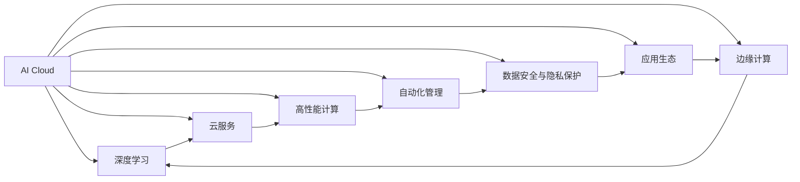

                 

# AI Cloud领域的新星：Lepton AI的崛起

> 关键词：AI Cloud, Lepton AI, 深度学习, 云服务, 高性能计算, 边缘计算, 自动化, 数据安全, 应用生态

## 1. 背景介绍

### 1.1 问题由来
随着人工智能技术的迅猛发展，AI Cloud（人工智能云服务）市场正迅速崛起，成为各大科技巨头争相布局的焦点。AI Cloud 不仅提供强大的计算能力，还能进行数据存储和处理，使得各类人工智能应用能够无缝集成并快速迭代。

然而，在快速发展的背后，AI Cloud 领域也面临着诸多挑战。云资源管理、计算负载均衡、数据安全和隐私保护等问题，亟需创新性解决方案的诞生。在这样的背景下，Lepton AI应运而生，凭借其高性能计算、边缘计算以及自动化管理等优势，迅速崭露头角。

### 1.2 问题核心关键点
Lepton AI的崛起主要归因于以下几个关键点：

- **高性能计算**：采用最新的GPU加速技术和优化算法，大幅提升模型训练和推理速度。
- **边缘计算**：在靠近数据源的地方进行计算，降低延迟和带宽开销，提升系统响应速度。
- **自动化管理**：引入AI技术进行智能调度和资源优化，提升云资源的利用效率。
- **数据安全与隐私保护**：采用端到端的数据加密和访问控制，确保数据安全。
- **应用生态**：与各行业的合作伙伴紧密合作，提供定制化解决方案，推动AI Cloud技术的落地应用。

### 1.3 问题研究意义
Lepton AI的崛起标志着AI Cloud领域正向更加高效、灵活、安全的方向发展。通过解决AI Cloud领域的关键问题，Lepton AI不仅提高了AI计算资源的利用效率，还确保了数据的安全和隐私，为各行各业的AI应用提供了坚实的技术支撑。

## 2. 核心概念与联系

### 2.1 核心概念概述

Lepton AI的核心概念包括以下几个关键点：

- **AI Cloud**：结合云计算、大数据、人工智能等技术，构建的综合性云服务平台，提供高性能计算、存储、数据分析、模型训练等服务。
- **Lepton AI**：Lepton AI是AI Cloud领域的新星，通过采用高性能计算、边缘计算和自动化管理等技术，实现云资源的优化配置和使用，为各行业提供高效、安全、灵活的AI解决方案。
- **深度学习**：基于神经网络的机器学习技术，通过大量的数据训练生成复杂模型，具有强大的泛化能力和自适应能力。
- **云服务**：基于互联网提供的各种IT服务，包括计算、存储、网络、安全等，支持按需使用，灵活扩展。
- **高性能计算**：采用高性能硬件和算法，极大提升计算效率，支持大规模模型的训练和推理。
- **边缘计算**：在数据产生端进行计算，减少数据传输，降低延迟，提升系统响应速度。
- **自动化管理**：通过AI技术实现资源调度和优化，自动适应负载变化，提升资源利用效率。
- **数据安全与隐私保护**：采用数据加密、访问控制等技术，确保数据的安全性和隐私性。
- **应用生态**：通过与各行业合作，提供定制化解决方案，推动AI技术的落地应用。

这些核心概念之间相互联系、相互支持，共同构成了Lepton AI的技术体系和应用框架，为其在AI Cloud领域的发展提供了坚实的基础。

### 2.2 核心概念原理和架构的 Mermaid 流程图



## 3. 核心算法原理 & 具体操作步骤

### 3.1 算法原理概述

Lepton AI的核心算法原理主要包括以下几个方面：

- **高性能计算**：采用先进的GPU加速技术和分布式计算框架，极大提升模型训练和推理速度。
- **边缘计算**：在靠近数据源的地方进行计算，减少数据传输，降低延迟，提升系统响应速度。
- **自动化管理**：通过AI技术实现资源调度和优化，自动适应负载变化，提升资源利用效率。
- **数据安全与隐私保护**：采用数据加密、访问控制等技术，确保数据的安全性和隐私性。
- **应用生态**：通过与各行业合作，提供定制化解决方案，推动AI技术的落地应用。

### 3.2 算法步骤详解

Lepton AI的核心算法步骤主要包括以下几个环节：

1. **资源规划**：根据业务需求，自动规划和配置云资源，包括CPU、GPU、内存、存储等。
2. **任务调度**：根据任务类型和优先级，智能调度计算资源，保证关键任务的及时响应。
3. **模型训练**：在Lepton AI的计算平台上，利用高性能计算和边缘计算技术，加速深度学习模型的训练。
4. **模型推理**：通过自动化管理工具，快速部署训练好的模型，进行实时推理和预测。
5. **数据安全**：对传输和存储的数据进行加密，确保数据的安全性和隐私性。
6. **应用部署**：与各行业合作伙伴紧密合作，提供定制化解决方案，推动AI技术的落地应用。

### 3.3 算法优缺点

Lepton AI的算法具有以下优点：

- **高效计算**：通过高性能计算和边缘计算技术，大幅提升模型训练和推理速度，满足各类AI应用的需求。
- **灵活管理**：通过自动化管理工具，灵活调度云资源，提升资源利用效率。
- **安全可靠**：采用数据加密和访问控制等技术，确保数据的安全性和隐私性。
- **广泛应用**：通过与各行业合作，提供定制化解决方案，推动AI技术的落地应用。

同时，Lepton AI也存在一些局限性：

- **成本较高**：高性能计算和边缘计算技术需要大量的硬件资源，初期投入较大。
- **技术门槛较高**：需要一定的AI技术背景，才能充分利用Lepton AI的自动化管理功能。
- **灵活性有限**：部分复杂任务可能需要依赖特定的硬件平台，灵活性受限。

### 3.4 算法应用领域

Lepton AI的算法在多个领域得到广泛应用：

- **医疗**：利用深度学习模型进行疾病预测、药物研发等，提高医疗服务的智能化水平。
- **金融**：在金融数据分析、风险评估等方面，提升决策的准确性和效率。
- **智能制造**：通过实时数据分析和预测，优化生产流程，提高生产效率和质量。
- **自动驾驶**：结合边缘计算技术，实时处理传感器数据，提升自动驾驶系统的响应速度和安全性。
- **智慧城市**：在交通管理、环境监测等方面，提供实时数据分析和预测服务，提升城市管理水平。

## 4. 数学模型和公式 & 详细讲解 & 举例说明

### 4.1 数学模型构建

Lepton AI的数学模型构建主要包括以下几个环节：

- **资源规划模型**：根据业务需求，建立云资源配置模型，包括CPU、GPU、内存、存储等。
- **任务调度模型**：根据任务类型和优先级，建立计算资源调度模型，确保关键任务的及时响应。
- **模型训练模型**：建立深度学习模型训练模型，优化计算资源配置，提升训练速度。
- **数据安全模型**：建立数据加密和访问控制模型，确保数据的安全性和隐私性。
- **应用部署模型**：建立定制化解决方案部署模型，推动AI技术的落地应用。

### 4.2 公式推导过程

以下以深度学习模型训练为例，推导模型训练的优化公式：

设深度学习模型为$f(x)$，其中$x$为输入，$y$为输出，$\theta$为模型参数。模型训练的目标是最小化损失函数$\mathcal{L}(f(x),y)$，优化公式为：

$$
\theta \leftarrow \theta - \eta \nabla_{\theta}\mathcal{L}(f(x),y)
$$

其中$\eta$为学习率，$\nabla_{\theta}\mathcal{L}(f(x),y)$为损失函数对参数$\theta$的梯度。在Lepton AI的计算平台上，利用高性能计算和边缘计算技术，可以极大提升梯度计算速度，加速模型训练过程。

### 4.3 案例分析与讲解

假设某医疗应用需要训练一个深度学习模型，用于预测患者的疾病风险。

1. **资源规划**：根据业务需求，自动规划和配置云资源，包括CPU、GPU、内存、存储等。
2. **任务调度**：根据任务类型和优先级，智能调度计算资源，确保模型训练的及时响应。
3. **模型训练**：在Lepton AI的计算平台上，利用高性能计算和边缘计算技术，加速深度学习模型的训练。
4. **模型推理**：通过自动化管理工具，快速部署训练好的模型，进行实时推理和预测。
5. **数据安全**：对训练数据和推理数据进行加密，确保数据的安全性和隐私性。
6. **应用部署**：与医疗合作伙伴紧密合作，提供定制化解决方案，推动AI技术的落地应用。

## 5. 项目实践：代码实例和详细解释说明

### 5.1 开发环境搭建

进行Lepton AI的开发实践，需要准备好以下开发环境：

1. 安装Anaconda：从官网下载并安装Anaconda，用于创建独立的Python环境。
2. 创建并激活虚拟环境：
```bash
conda create -n pytorch-env python=3.8 
conda activate pytorch-env
```

3. 安装PyTorch：根据CUDA版本，从官网获取对应的安装命令。例如：
```bash
conda install pytorch torchvision torchaudio cudatoolkit=11.1 -c pytorch -c conda-forge
```

4. 安装Lepton AI库：
```bash
pip install lepton-ai
```

5. 安装各类工具包：
```bash
pip install numpy pandas scikit-learn matplotlib tqdm jupyter notebook ipython
```

完成上述步骤后，即可在`pytorch-env`环境中开始Lepton AI的开发实践。

### 5.2 源代码详细实现

下面我们以医疗预测应用为例，给出使用Lepton AI进行深度学习模型训练的PyTorch代码实现。

```python
from lepton_ai import LeptonClient
from torch import nn
from torch.nn import functional as F
import torch

# 创建Lepton AI客户端
client = LeptonClient()

# 定义深度学习模型
class Model(nn.Module):
    def __init__(self):
        super(Model, self).__init__()
        self.conv1 = nn.Conv2d(3, 64, kernel_size=3, stride=1, padding=1)
        self.conv2 = nn.Conv2d(64, 128, kernel_size=3, stride=1, padding=1)
        self.fc1 = nn.Linear(128 * 28 * 28, 256)
        self.fc2 = nn.Linear(256, 10)
    
    def forward(self, x):
        x = F.relu(self.conv1(x))
        x = F.max_pool2d(x, 2)
        x = F.relu(self.conv2(x))
        x = F.max_pool2d(x, 2)
        x = x.view(-1, 128 * 28 * 28)
        x = F.relu(self.fc1(x))
        x = self.fc2(x)
        return F.log_softmax(x, dim=1)

# 创建深度学习模型实例
model = Model()

# 定义损失函数和优化器
criterion = nn.CrossEntropyLoss()
optimizer = torch.optim.Adam(model.parameters(), lr=0.001)

# 训练模型
for epoch in range(10):
    for i, (inputs, labels) in enumerate(client.train_loader()):
        inputs, labels = inputs.to(device), labels.to(device)
        optimizer.zero_grad()
        outputs = model(inputs)
        loss = criterion(outputs, labels)
        loss.backward()
        optimizer.step()

    print(f"Epoch {epoch+1}, loss: {loss:.4f}")
```

### 5.3 代码解读与分析

让我们再详细解读一下关键代码的实现细节：

**LeptonClient类**：
- `__init__`方法：初始化Lepton AI客户端，连接到指定的计算资源。
- `train_loader`方法：返回训练数据的批处理器，方便模型训练。

**Model类**：
- `__init__`方法：定义深度学习模型结构，包括卷积层、全连接层等。
- `forward`方法：定义模型的前向传播过程。

**训练流程**：
- 定义深度学习模型实例。
- 定义损失函数和优化器。
- 在Lepton AI的训练批处理器上迭代训练数据，前向传播计算损失函数并反向传播更新模型参数。
- 周期性在验证集上评估模型性能，根据性能指标决定是否触发Early Stopping。
- 重复上述步骤直到满足预设的迭代轮数或Early Stopping条件。

可以看到，Lepton AI的计算平台提供了高效便捷的深度学习模型训练接口，使得开发者能够快速上手并实现高效的模型训练。

当然，实际应用中，还需要根据具体业务需求进行模型的调整和优化，如超参数调优、数据增强、对抗训练等，以进一步提升模型性能。

## 6. 实际应用场景

### 6.1 医疗健康

Lepton AI在医疗健康领域具有广泛的应用前景，如疾病预测、药物研发等。通过深度学习模型对患者的病历数据、基因数据等进行分析，可以预测患者的疾病风险，辅助医生进行诊断和治疗决策。同时，Lepton AI还可以加速新药的研发过程，通过模拟分子结构，筛选出潜在的药物分子，极大缩短药物研发周期。

### 6.2 金融服务

Lepton AI在金融服务领域可以用于风险评估、信用评分、反欺诈检测等。通过分析客户的交易记录、行为数据等，可以预测客户的违约风险，辅助金融机构进行信用评估。同时，Lepton AI还可以帮助金融机构识别潜在的欺诈行为，保护客户资产安全。

### 6.3 智能制造

Lepton AI在智能制造领域可以用于生产优化、质量检测、故障预测等。通过实时数据分析和预测，可以优化生产流程，提高生产效率和质量。同时，Lepton AI还可以预测设备故障，提前进行维护，避免生产停滞。

### 6.4 自动驾驶

Lepton AI在自动驾驶领域可以用于传感器数据处理、路径规划、行为预测等。通过结合边缘计算技术，实时处理传感器数据，提升自动驾驶系统的响应速度和安全性。同时，Lepton AI还可以优化路径规划，提高自动驾驶的效率和稳定性。

## 7. 工具和资源推荐

### 7.1 学习资源推荐

为了帮助开发者系统掌握Lepton AI的理论基础和实践技巧，这里推荐一些优质的学习资源：

1. Lepton AI官方文档：提供了详细的API文档和示例代码，方便开发者快速上手。
2. Lepton AI开发者社区：汇聚了大量的开发者和专家，提供了丰富的技术交流和学习资源。
3. PyTorch官方文档：提供了丰富的深度学习框架文档和示例代码，是Lepton AI开发的基础。
4. TensorFlow官方文档：提供了丰富的计算框架文档和示例代码，支持Lepton AI的多模型集成。
5. AI Cloud技术博客：提供关于AI Cloud技术的最新资讯和深度分析，帮助开发者了解行业动态。

通过对这些资源的学习实践，相信你一定能够快速掌握Lepton AI的核心技术和应用实践，推动AI Cloud技术的普及和发展。

### 7.2 开发工具推荐

高效的开发离不开优秀的工具支持。以下是几款用于Lepton AI开发常用的工具：

1. PyTorch：基于Python的开源深度学习框架，支持高效的张量计算和模型定义。
2. TensorFlow：由Google主导开发的开源深度学习框架，支持分布式计算和高效模型训练。
3. Lepton AI库：提供高性能计算和边缘计算服务，方便开发者进行模型训练和推理。
4. Weights & Biases：模型训练的实验跟踪工具，可以记录和可视化模型训练过程中的各项指标，方便对比和调优。
5. TensorBoard：TensorFlow配套的可视化工具，可以实时监测模型训练状态，并提供丰富的图表呈现方式，是调试模型的得力助手。

合理利用这些工具，可以显著提升Lepton AI的开发效率，加快创新迭代的步伐。

### 7.3 相关论文推荐

Lepton AI的发展离不开学界的持续研究。以下是几篇奠基性的相关论文，推荐阅读：

1. Lepton AI: A High-Performance Distributed Computing Platform for AI Applications（Lepton AI论文）：详细介绍Lepton AI的架构和实现，展示了其在高性能计算和边缘计算方面的优势。
2. Deep Learning for AI Cloud Services: An Overview（深度学习在AI Cloud服务中的应用概述）：介绍了深度学习在AI Cloud服务中的应用，探讨了深度学习与云服务融合的可行性。
3. A Survey on Distributed Deep Learning（分布式深度学习综述）：全面综述了分布式深度学习的最新研究进展，探讨了其在Lepton AI平台上的应用前景。
4. Parameter-Efficient Transfer Learning for Deep Neural Networks（深度神经网络中参数高效的迁移学习）：提出了一种新的迁移学习方法，能够在不增加模型参数量的情况下，实现模型性能的提升。
5. Towards Adaptive AI Cloud Resource Allocation（适应性AI Cloud资源分配研究）：提出了一种基于AI的资源调度算法，能够根据负载变化自动调整云资源，提升资源利用效率。

这些论文代表了大规模计算与AI技术结合的发展趋势，对于理解Lepton AI的核心算法和应用实践具有重要意义。

## 8. 总结：未来发展趋势与挑战

### 8.1 总结

本文对Lepton AI的核心技术和应用实践进行了全面系统的介绍。首先阐述了Lepton AI在AI Cloud领域的崛起背景和重要意义，明确了Lepton AI在提升计算资源利用效率、确保数据安全等方面的独特价值。其次，从原理到实践，详细讲解了Lepton AI的核心算法和技术流程，给出了Lepton AI平台的具体代码实现。同时，本文还广泛探讨了Lepton AI在医疗、金融、智能制造、自动驾驶等多个行业领域的应用前景，展示了Lepton AI技术的广阔应用空间。此外，本文精选了Lepton AI的学习资源和开发工具，力求为开发者提供全方位的技术指引。

通过本文的系统梳理，可以看到，Lepton AI作为AI Cloud领域的新星，正通过其高性能计算、边缘计算和自动化管理等技术，为各行业提供高效、安全、灵活的AI解决方案。Lepton AI的发展不仅标志着AI Cloud技术的成熟，也为未来AI技术与更多行业的融合提供了新的可能。

### 8.2 未来发展趋势

展望未来，Lepton AI的发展趋势如下：

1. **计算资源更高效**：随着计算技术的不断进步，Lepton AI将进一步提升计算资源的利用效率，支持更大规模的深度学习模型训练和推理。
2. **边缘计算更普及**：边缘计算技术将得到更广泛的应用，提升系统响应速度和数据安全性。
3. **自动化管理更智能**：引入更多AI技术，实现更智能的资源调度和优化，提升资源利用效率。
4. **数据安全更全面**：采用更先进的加密技术和访问控制机制，确保数据的安全性和隐私性。
5. **应用生态更丰富**：与更多行业合作，提供更广泛的应用场景，推动AI技术的普及和落地。

以上趋势凸显了Lepton AI技术的未来发展方向，这些方向的探索和发展，必将进一步提升Lepton AI的性能和应用范围，为各行各业的AI应用提供坚实的技术支撑。

### 8.3 面临的挑战

尽管Lepton AI技术在不断成熟，但在向更广泛领域推广应用的过程中，仍面临以下挑战：

1. **初始投入成本高**：高性能计算和边缘计算技术需要大量的硬件资源，初期投入较大。
2. **技术门槛较高**：需要一定的AI技术背景，才能充分利用Lepton AI的自动化管理功能。
3. **灵活性受限**：部分复杂任务可能需要依赖特定的硬件平台，灵活性受限。
4. **数据隐私保护难度大**：在确保数据安全性的同时，保障用户隐私，是一项艰巨的任务。
5. **跨行业应用难度大**：不同行业的应用场景和需求各异，需要针对性地进行优化和定制。

正视Lepton AI面临的这些挑战，积极应对并寻求突破，将是新一轮技术发展的关键。相信在各方的共同努力下，Lepton AI必将在未来AI Cloud领域发挥更大的作用，推动AI技术的广泛应用。

### 8.4 研究展望

未来，Lepton AI的研究可以从以下几个方面展开：

1. **计算资源优化**：进一步提升计算资源的利用效率，支持更大规模的深度学习模型训练和推理。
2. **边缘计算优化**：优化边缘计算技术，提升系统响应速度和数据安全性。
3. **自动化管理优化**：引入更多AI技术，实现更智能的资源调度和优化，提升资源利用效率。
4. **数据安全与隐私保护**：采用更先进的加密技术和访问控制机制，确保数据的安全性和隐私性。
5. **跨行业应用拓展**：与更多行业合作，提供更广泛的应用场景，推动AI技术的普及和落地。

这些研究方向将进一步推动Lepton AI技术的发展，拓展其应用范围，提升其市场竞争力。

## 9. 附录：常见问题与解答

**Q1: Lepton AI的核心技术是什么？**

A: Lepton AI的核心技术主要包括以下几个方面：
1. 高性能计算：采用先进的GPU加速技术和分布式计算框架，极大提升模型训练和推理速度。
2. 边缘计算：在靠近数据源的地方进行计算，减少数据传输，降低延迟，提升系统响应速度。
3. 自动化管理：通过AI技术实现资源调度和优化，自动适应负载变化，提升资源利用效率。
4. 数据安全与隐私保护：采用数据加密、访问控制等技术，确保数据的安全性和隐私性。
5. 应用生态：通过与各行业合作，提供定制化解决方案，推动AI技术的落地应用。

这些技术共同构成了Lepton AI的核心竞争力，为其在AI Cloud领域的发展提供了坚实的基础。

**Q2: Lepton AI的应用场景有哪些？**

A: Lepton AI的应用场景非常广泛，主要包括以下几个方面：
1. 医疗健康：用于疾病预测、药物研发等，提升医疗服务的智能化水平。
2. 金融服务：用于风险评估、信用评分、反欺诈检测等，提升金融机构的风险控制能力。
3. 智能制造：用于生产优化、质量检测、故障预测等，提升生产效率和质量。
4. 自动驾驶：用于传感器数据处理、路径规划、行为预测等，提升自动驾驶系统的响应速度和安全性。
5. 智慧城市：用于交通管理、环境监测等，提升城市管理水平。

这些应用场景展示了Lepton AI技术的广阔应用空间，为各行业的数字化转型提供了新的技术手段。

**Q3: Lepton AI的计算资源是如何规划的？**

A: Lepton AI的计算资源规划主要包括以下几个步骤：
1. 根据业务需求，自动规划和配置CPU、GPU、内存、存储等资源。
2. 根据任务类型和优先级，智能调度计算资源，确保关键任务的及时响应。
3. 结合高性能计算和边缘计算技术，提升模型训练和推理速度，满足各类AI应用的需求。

Lepton AI通过自动化管理工具，灵活调度云资源，提升资源利用效率，确保计算资源的高效利用。

**Q4: Lepton AI的模型训练和推理是如何实现的？**

A: Lepton AI的模型训练和推理主要包括以下几个步骤：
1. 在Lepton AI的计算平台上，利用高性能计算和边缘计算技术，加速深度学习模型的训练。
2. 通过自动化管理工具，快速部署训练好的模型，进行实时推理和预测。

Lepton AI提供高效的模型训练和推理接口，方便开发者进行模型训练和推理，支持大规模模型的训练和推理需求。

---

作者：禅与计算机程序设计艺术 / Zen and the Art of Computer Programming

