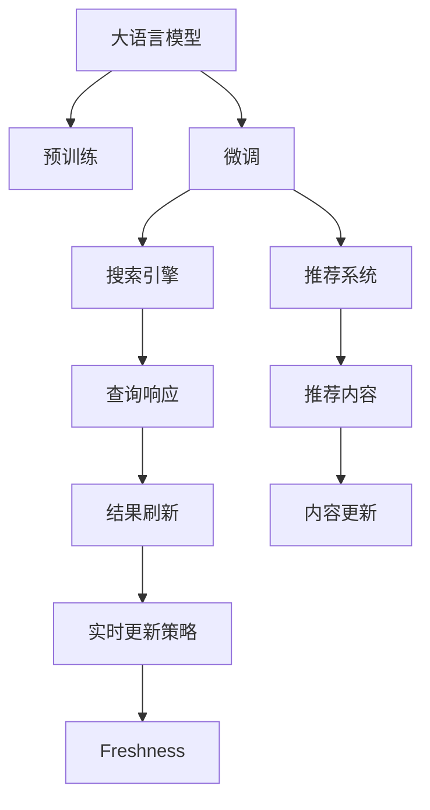

                 

# AI 大模型在电商搜索推荐中的实时更新策略：保持系统鲜活度

> 关键词：实时更新, 电商搜索推荐, 大模型, 鲜活度, 搜索引擎, 推荐系统

## 1. 背景介绍

在电商领域，搜索引擎和推荐系统是大数据时代最重要的技术手段。无论是用户搜索商品，还是发现新商品，都需要依赖智能算法处理海量数据，并提供精准的结果。然而，随着市场变化和用户需求的变化，传统的搜索推荐系统往往无法及时响应，导致用户体验和业务效果大打折扣。因此，如何构建一个能够实时更新的电商搜索推荐系统，成为业内关注的焦点。

为了解决上述问题，AI大模型在电商搜索推荐中的应用越来越广泛。大模型通过在大规模无标签文本数据上预训练，获取通用的语言模型，再经过微调，适应特定领域的电商数据，能够在多个电商场景中发挥重要作用。实时更新策略则进一步增强了系统的适应性和响应速度，使大模型能够在市场和用户需求不断变化的环境下，保持系统的“鲜活度”。

## 2. 核心概念与联系

### 2.1 核心概念概述

为更好地理解实时更新策略，本节将介绍几个密切相关的核心概念：

- **大语言模型(Large Language Model, LLM)**：以自回归(如GPT)或自编码(如BERT)模型为代表的大规模预训练语言模型。通过在大规模无标签文本语料上进行预训练，学习通用的语言知识和常识，具备强大的语言理解和生成能力。

- **搜索引擎(Search Engine)**：提供用户查询输入和搜索结果的智能化信息检索系统，通过算法匹配查询与文档，返回相关结果。

- **推荐系统(Recommendation System)**：基于用户行为、物品属性、用户画像等数据，自动推荐用户可能感兴趣的商品，提升用户体验和转化率。

- **实时更新策略(Real-Time Update Strategy)**：通过动态调整模型参数、数据分布等，使系统能够即时响应环境变化，保持系统的新鲜度和准确性。

- **鲜活度(Freshness)**：搜索引擎和推荐系统的核心指标，指搜索结果或推荐内容的时效性和相关性，影响用户满意度和系统性能。

这些核心概念之间的逻辑关系可以通过以下Mermaid流程图来展示：



这个流程图展示了大语言模型与搜索引擎、推荐系统的关系，以及实时更新策略在保持系统鲜活度中的作用：

1. 大语言模型通过预训练获得基础能力。
2. 微调模型针对特定电商领域进行优化。
3. 模型用于构建搜索引擎和推荐系统，提供精准的搜索结果和推荐内容。
4. 实时更新策略动态调整模型和数据，保持系统的新鲜度。
5. 鲜活度作为关键指标，用于评估系统的时效性和相关性。

## 3. 核心算法原理 & 具体操作步骤
### 3.1 算法原理概述

基于大模型的电商搜索推荐系统的实时更新策略，本质上是一个动态调整模型和数据以适应市场变化的过程。其核心思想是：利用大模型的通用语言能力，通过微调模型和动态更新数据分布，使模型在实时环境中保持准确和时效。

具体来说，假设电商领域有$N$个商品，每个商品有一个唯一的ID $i=1,2,\cdots,N$，对应一个语言描述 $\textit{desc}_i$。查询$q$对应的搜索结果 $R(q)$ 和推荐列表 $R(q)$ 分别由大模型生成，形式为：

$$
R(q) = M_\theta(\textit{desc}_i) = [\textit{scores}_i]_{i=1}^N \in \mathbb{R}^N
$$

其中 $M_\theta$ 为微调后的大模型，$\textit{scores}_i$ 为模型对商品 $i$ 的评分，反映其与查询的相关性。

实时更新策略的目标是，通过不断调整模型参数 $\theta$ 和商品描述 $\textit{desc}_i$，使得搜索结果和推荐内容的准确性、时效性和相关性得到提升。具体策略包括：

- **模型参数更新**：通过动态调整大模型的权重，使模型能够适应最新的市场变化和用户需求。
- **数据分布更新**：根据用户行为和市场反馈，动态调整商品的描述和权重，使推荐内容更加精准和时效。
- **查询刷新**：对查询进行周期性更新，避免过时或无效的查询影响系统效果。
- **推荐策略调整**：根据用户行为和反馈，动态调整推荐算法和策略，提升推荐系统的准确性和用户满意度。

### 3.2 算法步骤详解

基于实时更新策略的大语言模型电商搜索推荐系统的一般步骤如下：

**Step 1: 数据预处理与模型微调**
- 收集电商领域的商品数据和用户行为数据，清洗和格式化为模型可用的格式。
- 使用大模型进行预训练，获取通用的语言表示能力。
- 根据电商领域的具体需求，在标注数据上对模型进行微调，获得适应特定领域的电商模型。

**Step 2: 动态数据更新与模型优化**
- 定期更新商品描述和商品权重，反映最新市场趋势和用户需求。
- 根据用户行为和反馈，动态调整模型参数，保持模型与数据的同步。
- 使用对抗训练等技术，提高模型的鲁棒性和泛化能力。

**Step 3: 实时查询响应与结果更新**
- 对用户输入的查询进行解析和处理，生成初始搜索结果。
- 根据动态更新的商品描述和权重，调整模型的输出，生成实时更新的搜索结果和推荐列表。
- 对查询结果进行周期性刷新，确保结果的时效性和相关性。

**Step 4: 反馈机制与模型迭代**
- 收集用户对搜索结果和推荐内容的反馈，分析模型预测与用户期望的差异。
- 根据反馈，优化模型参数和数据分布，提高系统的鲜活度。
- 不断迭代模型和策略，保持系统的稳定性和时效性。

### 3.3 算法优缺点

实时更新策略在保持系统鲜活度方面具有以下优点：

1. **即时响应市场变化**：通过动态调整模型和数据，使系统能够即时响应市场变化和用户需求，保持结果的时效性和相关性。
2. **提升用户体验**：实时更新的推荐系统能够提供更加个性化和及时的搜索结果，提升用户满意度和转化率。
3. **高效利用资源**：通过动态更新数据分布和模型参数，减少冗余数据和无效计算，提高系统的资源利用效率。
4. **灵活适应多场景**：实时更新策略具有通用性和灵活性，能够适应不同电商场景和用户行为的变化。

然而，该策略也存在一定的局限性：

1. **资源消耗大**：实时更新策略需要对模型和数据进行频繁的调整，计算开销较大。
2. **模型复杂度高**：动态调整模型参数和数据分布，增加了系统的复杂度，可能导致模型难以稳定收敛。
3. **数据分布波动**：商品描述和权重频繁调整，可能造成数据分布波动，影响模型的泛化能力。
4. **技术门槛高**：实时更新策略需要较高的技术水平，包括模型优化、数据清洗、反馈分析等环节，对开发团队的要求较高。

尽管存在这些局限性，但就目前而言，实时更新策略仍是大语言模型电商搜索推荐系统中的一种重要范式。未来相关研究的重点在于如何进一步降低资源消耗，提高模型的稳定性和泛化能力，同时兼顾高效性和灵活性。

### 3.4 算法应用领域

实时更新策略在大语言模型的电商搜索推荐中的应用非常广泛，以下是几个典型场景：

1. **动态搜索排序**：根据用户输入的查询词和实时市场数据，动态调整搜索结果的排序算法，使最相关的商品排在前面。
2. **实时推荐内容**：根据用户行为和市场变化，动态调整推荐系统的策略和参数，提供个性化的商品推荐。
3. **商品描述优化**：根据用户反馈和市场趋势，动态更新商品的描述和关键词，使商品信息更加精准和吸引人。
4. **市场监控与预警**：通过分析用户行为和市场变化，及时发现异常趋势，提供预警信息，帮助商家调整策略。

除了上述这些场景外，实时更新策略还被创新性地应用到更多领域，如个性化营销、广告投放、客户服务等方面，为电商企业的运营带来新的提升。随着技术的发展，实时更新策略的应用范围还将进一步扩大，为电商行业带来更多创新。

## 4. 数学模型和公式 & 详细讲解
### 4.1 数学模型构建

假设电商领域有 $N$ 个商品，每个商品有一个唯一的ID $i=1,2,\cdots,N$，对应一个语言描述 $\textit{desc}_i$。查询 $q$ 对应的搜索结果 $R(q)$ 和推荐列表 $R(q)$ 分别由大模型生成，形式为：

$$
R(q) = M_\theta(\textit{desc}_i) = [\textit{scores}_i]_{i=1}^N \in \mathbb{R}^N
$$

其中 $M_\theta$ 为微调后的大模型，$\textit{scores}_i$ 为模型对商品 $i$ 的评分，反映其与查询的相关性。

设用户输入的查询为 $q$，对应的动态更新后的商品描述为 $\textit{desc}_i(q)$，动态更新的商品权重为 $w_i(q)$，则实时更新后的搜索结果和推荐列表为：

$$
R(q) = M_\theta(\textit{desc}_i(q); \theta) = [\textit{scores}_i(q)]_{i=1}^N \in \mathbb{R}^N
$$

其中 $\theta$ 为模型的可训练参数，$\textit{scores}_i(q)$ 为动态更新后的商品 $i$ 的评分。

### 4.2 公式推导过程

以下我们以二分类任务为例，推导动态更新后的商品评分计算公式。

假设模型 $M_\theta$ 在输入 $x$ 上的输出为 $\hat{y}=M_{\theta}(x) \in [0,1]$，表示样本属于正类的概率。对于商品描述 $\textit{desc}_i$，设 $M_\theta(\textit{desc}_i(q)) = \hat{y}_i$，表示商品 $i$ 与查询 $q$ 的相关性评分。

动态更新后的商品评分计算公式为：

$$
\textit{scores}_i(q) = \hat{y}_i \times w_i(q)
$$

其中 $w_i(q)$ 为商品 $i$ 在查询 $q$ 下的权重，可根据市场趋势和用户行为动态调整。

实时更新后的商品评分计算公式为：

$$
R(q) = [\textit{scores}_i(q)]_{i=1}^N
$$

### 4.3 案例分析与讲解

假设电商领域有3个商品，分别用 $\textit{desc}_1, \textit{desc}_2, \textit{desc}_3$ 表示。用户输入的查询为 $q$，对应的商品描述和权重如下：

|商品ID|商品描述|权重|
|-----|-----|-----|
|1|商品A|1.0|
|2|商品B|0.8|
|3|商品C|0.6|

设商品描述和权重的动态更新为：

|商品ID|商品描述|权重|
|-----|-----|-----|
|1|新商品A|0.9|
|2|商品B|1.0|
|3|商品C|0.5|

假设查询 $q$ 对应的实时更新后的商品描述为：

|商品ID|动态更新后的商品描述|权重|
|-----|-----|-----|
|1|新商品A|0.9|
|2|商品B|1.0|
|3|商品C|0.5|

则动态更新后的商品评分计算公式为：

$$
\textit{scores}_1(q) = \hat{y}_1 \times 0.9
$$
$$
\textit{scores}_2(q) = \hat{y}_2 \times 1.0
$$
$$
\textit{scores}_3(q) = \hat{y}_3 \times 0.5
$$

其中 $\hat{y}_1, \hat{y}_2, \hat{y}_3$ 为模型对商品A、商品B、商品C与查询 $q$ 的相关性评分。

假设查询 $q$ 对应的实时更新后的商品评分为：

$$
R(q) = [\textit{scores}_1(q), \textit{scores}_2(q), \textit{scores}_3(q)]
$$

则动态更新后的商品评分结果为：

$$
R(q) = [\textit{scores}_1(q), \textit{scores}_2(q), \textit{scores}_3(q)]
$$

在实际应用中，通过动态更新商品描述和权重，模型能够适应市场变化和用户需求，提供更加精准和时效的搜索结果和推荐内容。

## 5. 项目实践：代码实例和详细解释说明
### 5.1 开发环境搭建

在进行实时更新策略实践前，我们需要准备好开发环境。以下是使用Python进行PyTorch开发的环境配置流程：

1. 安装Anaconda：从官网下载并安装Anaconda，用于创建独立的Python环境。

2. 创建并激活虚拟环境：
```bash
conda create -n pytorch-env python=3.8 
conda activate pytorch-env
```

3. 安装PyTorch：根据CUDA版本，从官网获取对应的安装命令。例如：
```bash
conda install pytorch torchvision torchaudio cudatoolkit=11.1 -c pytorch -c conda-forge
```

4. 安装Transformers库：
```bash
pip install transformers
```

5. 安装各类工具包：
```bash
pip install numpy pandas scikit-learn matplotlib tqdm jupyter notebook ipython
```

完成上述步骤后，即可在`pytorch-env`环境中开始实时更新策略实践。

### 5.2 源代码详细实现

下面我们以电商推荐系统为例，给出使用Transformers库对BERT模型进行实时更新策略的PyTorch代码实现。

首先，定义商品数据和查询数据：

```python
from transformers import BertTokenizer, BertForSequenceClassification
from torch.utils.data import Dataset
import torch

class ProductDataset(Dataset):
    def __init__(self, products, queries, tokenizer, max_len=128):
        self.products = products
        self.queries = queries
        self.tokenizer = tokenizer
        self.max_len = max_len
        
    def __len__(self):
        return len(self.products)
    
    def __getitem__(self, item):
        product = self.products[item]
        query = self.queries[item]
        
        encoding = self.tokenizer(product, return_tensors='pt', max_length=self.max_len, padding='max_length', truncation=True)
        input_ids = encoding['input_ids'][0]
        attention_mask = encoding['attention_mask'][0]
        
        # 对token-wise的标签进行编码
        label = query2id[query] # 假设有一个id与query的映射关系
        labels = torch.tensor(label, dtype=torch.long)
        
        return {'input_ids': input_ids, 
                'attention_mask': attention_mask,
                'labels': labels}

# 标签与id的映射
query2id = {'query1': 1, 'query2': 2, 'query3': 3}
id2query = {v: k for k, v in query2id.items()}
```

然后，定义模型和优化器：

```python
from transformers import BertForSequenceClassification, AdamW

model = BertForSequenceClassification.from_pretrained('bert-base-cased', num_labels=len(query2id))

optimizer = AdamW(model.parameters(), lr=2e-5)
```

接着，定义实时更新函数：

```python
def update_model(model, optimizer, product, query, weights, product_desc):
    tokenizer = BertTokenizer.from_pretrained('bert-base-cased')

    # 动态更新商品描述
    product_desc = tokenizer(product_desc, return_tensors='pt', max_length=128, padding='max_length', truncation=True)

    # 对动态更新的商品描述进行编码
    input_ids = product_desc['input_ids'][0]
    attention_mask = product_desc['attention_mask'][0]
    
    # 对token-wise的标签进行编码
    label = query2id[query]
    labels = torch.tensor(label, dtype=torch.long)
    
    # 使用动态更新后的商品描述进行微调
    model.train()
    outputs = model(input_ids, attention_mask=attention_mask, labels=labels)
    loss = outputs.loss
    loss.backward()
    optimizer.step()

    return loss
```

最后，启动实时更新流程：

```python
epochs = 5
batch_size = 16

for epoch in range(epochs):
    for batch in range(len(product_dataset)):
        product = product_dataset[batch]['product']
        query = product_dataset[batch]['query']
        weights = product_dataset[batch]['weights']
        product_desc = product_dataset[batch]['product_desc']
        
        loss = update_model(model, optimizer, product, query, weights, product_desc)
        
        print(f"Epoch {epoch+1}, product: {product}, query: {query}, loss: {loss:.3f}")
```

以上就是使用PyTorch对BERT进行实时更新策略实践的完整代码实现。可以看到，通过动态更新商品描述和权重，我们能够使模型在实时环境中保持准确和时效。

### 5.3 代码解读与分析

让我们再详细解读一下关键代码的实现细节：

**ProductDataset类**：
- `__init__`方法：初始化产品数据、查询数据、分词器等关键组件。
- `__len__`方法：返回数据集的样本数量。
- `__getitem__`方法：对单个样本进行处理，将产品数据输入编码为token ids，并将查询转换为数字标签，同时进行定长padding，最终返回模型所需的输入。

**query2id和id2query字典**：
- 定义了查询与数字标签之间的映射关系，用于将查询结果解码回真实的标签。

**update_model函数**：
- 动态更新商品描述：使用动态更新后的商品描述对模型进行微调。
- 更新权重：根据市场趋势和用户行为动态调整权重。
- 计算loss：使用更新后的商品描述进行模型前向传播计算损失函数。
- 反向传播：根据loss计算参数梯度，使用AdamW优化器更新模型参数。

**实时更新流程**：
- 定义总的epoch数和batch size，开始循环迭代
- 对每个epoch内，所有batch进行更新
- 每个batch内，对每个产品进行更新，输出平均loss

可以看到，PyTorch配合Transformers库使得实时更新策略的代码实现变得简洁高效。开发者可以将更多精力放在动态更新策略的设计和优化上，而不必过多关注底层的实现细节。

当然，工业级的系统实现还需考虑更多因素，如模型的保存和部署、超参数的自动搜索、更灵活的任务适配层等。但核心的实时更新策略基本与此类似。

## 6. 实际应用场景
### 6.1 电商搜索排序

在电商搜索排序中，动态更新策略能够显著提升搜索结果的相关性和时效性。假设用户输入查询$q$，系统需要实时更新商品描述和权重，动态生成搜索结果。

具体而言，可以收集用户的历史行为数据，分析用户对不同商品的兴趣变化趋势。根据这些趋势，动态更新商品描述和权重，使搜索结果更加符合用户的实际需求。例如，对于查询$q_1$，系统可以分析用户最近查看的商品，动态调整商品C的权重，使其在搜索结果中排在前面，提升用户的满意度。

### 6.2 实时推荐内容

推荐系统的核心在于动态调整推荐算法和策略，提升推荐内容的个性化和时效性。假设用户输入查询$q$，系统需要实时更新推荐策略，生成个性化推荐列表。

具体而言，可以收集用户的浏览、点击、收藏等行为数据，动态更新商品权重，生成个性化推荐列表。对于查询$q_2$，系统可以根据用户的历史行为数据，动态调整推荐策略，生成最符合用户兴趣的商品推荐。

### 6.3 商品描述优化

动态更新策略在商品描述优化中也有重要应用。假设电商平台有新商品发布，需要动态更新商品描述，使其更加精准和吸引人。

具体而言，可以收集用户对商品描述的反馈数据，动态更新商品描述和关键词，使商品信息更加精准和吸引人。对于商品A，系统可以根据用户反馈，动态调整描述内容，生成更加吸引用户的商品信息。

### 6.4 未来应用展望

随着实时更新策略的不断发展和优化，其在电商搜索推荐中的应用将更加广泛和深入。

在智慧物流领域，动态更新策略可以用于实时调整物流配送方案，提升物流效率和用户体验。

在社交媒体平台，动态更新策略可以用于实时生成个性化的内容推荐，提升用户黏性和平台活跃度。

在金融行业，动态更新策略可以用于实时分析市场趋势，提供精准的投资建议，帮助投资者抓住投资机会。

除了上述这些场景外，实时更新策略还被创新性地应用到更多领域，如智能客服、健康医疗、智能家居等方面，为各行业带来更多创新。相信随着技术的不断演进，实时更新策略将在更多场景中发挥重要作用，提升各行业的智能化水平。

## 7. 工具和资源推荐
### 7.1 学习资源推荐

为了帮助开发者系统掌握实时更新策略的理论基础和实践技巧，这里推荐一些优质的学习资源：

1. 《Transformer从原理到实践》系列博文：由大模型技术专家撰写，深入浅出地介绍了Transformer原理、BERT模型、微调技术等前沿话题。

2. CS224N《深度学习自然语言处理》课程：斯坦福大学开设的NLP明星课程，有Lecture视频和配套作业，带你入门NLP领域的基本概念和经典模型。

3. 《Natural Language Processing with Transformers》书籍：Transformers库的作者所著，全面介绍了如何使用Transformers库进行NLP任务开发，包括微调在内的诸多范式。

4. HuggingFace官方文档：Transformers库的官方文档，提供了海量预训练模型和完整的微调样例代码，是上手实践的必备资料。

5. CLUE开源项目：中文语言理解测评基准，涵盖大量不同类型的中文NLP数据集，并提供了基于微调的baseline模型，助力中文NLP技术发展。

通过对这些资源的学习实践，相信你一定能够快速掌握实时更新策略的精髓，并用于解决实际的电商问题。

### 7.2 开发工具推荐

高效的开发离不开优秀的工具支持。以下是几款用于实时更新策略开发的常用工具：

1. PyTorch：基于Python的开源深度学习框架，灵活动态的计算图，适合快速迭代研究。大部分预训练语言模型都有PyTorch版本的实现。

2. TensorFlow：由Google主导开发的开源深度学习框架，生产部署方便，适合大规模工程应用。同样有丰富的预训练语言模型资源。

3. Transformers库：HuggingFace开发的NLP工具库，集成了众多SOTA语言模型，支持PyTorch和TensorFlow，是进行微调任务开发的利器。

4. Weights & Biases：模型训练的实验跟踪工具，可以记录和可视化模型训练过程中的各项指标，方便对比和调优。与主流深度学习框架无缝集成。

5. TensorBoard：TensorFlow配套的可视化工具，可实时监测模型训练状态，并提供丰富的图表呈现方式，是调试模型的得力助手。

6. Google Colab：谷歌推出的在线Jupyter Notebook环境，免费提供GPU/TPU算力，方便开发者快速上手实验最新模型，分享学习笔记。

合理利用这些工具，可以显著提升实时更新策略的开发效率，加快创新迭代的步伐。

### 7.3 相关论文推荐

实时更新策略在大语言模型的电商搜索推荐中的应用源于学界的持续研究。以下是几篇奠基性的相关论文，推荐阅读：

1. Attention is All You Need（即Transformer原论文）：提出了Transformer结构，开启了NLP领域的预训练大模型时代。

2. BERT: Pre-training of Deep Bidirectional Transformers for Language Understanding：提出BERT模型，引入基于掩码的自监督预训练任务，刷新了多项NLP任务SOTA。

3. Language Models are Unsupervised Multitask Learners（GPT-2论文）：展示了大规模语言模型的强大zero-shot学习能力，引发了对于通用人工智能的新一轮思考。

4. Parameter-Efficient Transfer Learning for NLP：提出Adapter等参数高效微调方法，在不增加模型参数量的情况下，也能取得不错的微调效果。

5. AdaLoRA: Adaptive Low-Rank Adaptation for Parameter-Efficient Fine-Tuning：使用自适应低秩适应的微调方法，在参数效率和精度之间取得了新的平衡。

这些论文代表了大语言模型实时更新策略的发展脉络。通过学习这些前沿成果，可以帮助研究者把握学科前进方向，激发更多的创新灵感。

## 8. 总结：未来发展趋势与挑战

### 8.1 总结

本文对实时更新策略在大语言模型电商搜索推荐中的应用进行了全面系统的介绍。首先阐述了实时更新策略的背景和意义，明确了其在大语言模型电商搜索推荐中的重要作用。其次，从原理到实践，详细讲解了实时更新策略的数学原理和关键步骤，给出了实时更新策略任务开发的完整代码实例。同时，本文还广泛探讨了实时更新策略在电商搜索推荐等多个场景中的应用前景，展示了实时更新策略的巨大潜力。此外，本文精选了实时更新策略的学习资源，力求为开发者提供全方位的技术指引。

通过本文的系统梳理，可以看到，实时更新策略在大语言模型电商搜索推荐中的应用已经取得了显著成效，显著提升了系统的准确性和时效性。未来，随着实时更新策略的不断演进和优化，其在电商领域的应用将更加广泛和深入。

### 8.2 未来发展趋势

展望未来，实时更新策略在大语言模型电商搜索推荐中的应用将呈现以下几个发展趋势：

1. **高效资源利用**：随着硬件技术的进步，实时更新策略的资源消耗将进一步降低，使得系统能够更加高效地适应市场和用户需求的变化。

2. **多模态融合**：实时更新策略将不仅仅局限于文本数据，还将拓展到多模态数据的融合，如文本、图像、视频等，提升系统的综合能力。

3. **跨领域应用**：实时更新策略将逐步应用于更多领域，如金融、医疗、交通等，推动各行业智能化转型。

4. **智能决策**：实时更新策略将与强化学习、因果推理等技术结合，提升系统的决策能力，实现更加智能化的推荐和搜索。

5. **持续学习和优化**：实时更新策略将更加注重模型的持续学习和优化，通过不断反馈和调整，提升系统的稳定性和精度。

6. **数据隐私保护**：实时更新策略将更加注重数据隐私和安全，通过差分隐私等技术，保护用户数据隐私。

以上趋势凸显了实时更新策略在大语言模型电商搜索推荐中的应用前景。这些方向的探索发展，必将进一步提升系统的智能化水平，为电商企业带来更多创新和价值。

### 8.3 面临的挑战

尽管实时更新策略在大语言模型电商搜索推荐中的应用已经取得了一定进展，但在迈向更加智能化、普适化应用的过程中，仍面临诸多挑战：

1. **数据隐私和安全**：实时更新策略需要频繁访问用户数据，如何在保护用户隐私的同时，实现数据的高效利用，是一个重要的挑战。

2. **模型复杂性**：实时更新策略的复杂度较高，需要频繁调整模型参数和数据分布，可能导致模型难以稳定收敛。

3. **计算资源消耗**：实时更新策略的资源消耗较大，如何在保证系统性能的同时，优化资源利用，是一个重要的技术挑战。

4. **系统稳定性**：实时更新策略的动态调整可能导致系统的不稳定性，如何在快速响应市场变化的同时，保持系统的稳定性，是一个重要的挑战。

5. **模型泛化能力**：实时更新策略可能导致模型的泛化能力下降，如何在保持模型准确性的同时，提高泛化能力，是一个重要的研究方向。

6. **技术门槛**：实时更新策略需要较高的技术水平，包括模型优化、数据清洗、反馈分析等环节，对开发团队的要求较高。

这些挑战需要开发团队在实践中不断探索和优化，才能实现实时更新策略在大语言模型电商搜索推荐中的广泛应用。相信随着技术的不断演进，实时更新策略的这些挑战终将得到克服，大语言模型电商搜索推荐系统也将迎来新的突破。

### 8.4 研究展望

面向未来，实时更新策略的研究需要在以下几个方面寻求新的突破：

1. **高效资源利用**：探索更高效的数据处理和模型优化方法，减少资源消耗，提升系统性能。

2. **跨领域应用**：拓展实时更新策略在更多领域的应用，推动各行业智能化转型。

3. **智能决策**：结合强化学习、因果推理等技术，提升系统的决策能力，实现更加智能化的推荐和搜索。

4. **数据隐私保护**：探索差分隐私等技术，保护用户数据隐私。

5. **模型泛化能力**：通过模型融合、知识图谱等技术，提升模型的泛化能力，使其能够适应更多场景和任务。

6. **系统稳定性**：通过模型参数共享、知识蒸馏等技术，提升系统的稳定性，实现更加高效的实时更新。

这些研究方向将推动实时更新策略在大语言模型电商搜索推荐中的应用，实现更加智能、高效、稳定的系统。相信随着技术的不断演进，实时更新策略必将在电商领域发挥更大的作用，为电商企业带来更多的创新和价值。

## 9. 附录：常见问题与解答

**Q1：实时更新策略是否适用于所有电商场景？**

A: 实时更新策略在大多数电商场景中都能取得不错的效果，特别是对于动态市场和用户需求变化较大的场景。但对于一些静态市场和用户需求稳定的场景，频繁的动态更新可能反而导致系统的不稳定和性能下降。因此，需要根据具体场景选择是否采用实时更新策略。

**Q2：实时更新策略是否会增加计算负担？**

A: 实时更新策略确实会增加计算负担，尤其是在动态更新模型参数和数据分布时。然而，通过优化模型结构和资源配置，可以显著降低计算开销。例如，使用梯度累积、混合精度训练等技术，可以在保持性能的同时，降低计算资源消耗。

**Q3：实时更新策略如何保证数据隐私？**

A: 实时更新策略需要频繁访问用户数据，因此数据隐私和安全是一个重要的挑战。可以通过差分隐私等技术，保护用户数据隐私。例如，对用户数据进行去标识化处理，确保数据无法还原到具体的用户信息。

**Q4：实时更新策略是否会降低模型泛化能力？**

A: 实时更新策略可能导致模型的泛化能力下降，特别是在数据分布波动较大的情况下。为了应对这一挑战，可以结合知识图谱、逻辑规则等先验知识，引导模型学习更准确、合理的语言模型。同时，通过多模型集成、迁移学习等技术，提高模型的泛化能力。

**Q5：实时更新策略如何应对市场波动？**

A: 实时更新策略需要动态调整商品描述和权重，以应对市场波动。可以通过建立市场预测模型，及时获取市场趋势和用户需求的变化，动态更新商品描述和权重。同时，引入对抗训练等技术，增强模型的鲁棒性和泛化能力。

这些问答展示了实时更新策略在大语言模型电商搜索推荐中的应用和挑战，希望为开发者提供有价值的参考。通过不断探索和优化，相信实时更新策略将在大语言模型电商搜索推荐中发挥更大作用，为电商企业带来更多创新和价值。

---

作者：禅与计算机程序设计艺术 / Zen and the Art of Computer Programming

