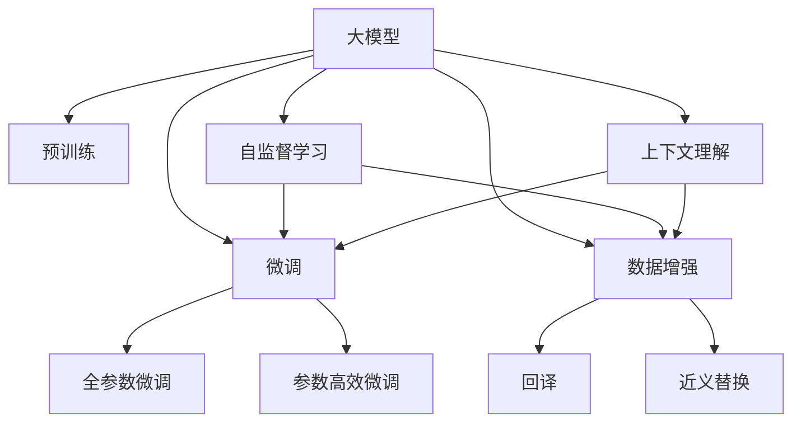

                 

# AI 大模型在电商搜索推荐中的数据处理能力要求：应对大规模复杂数据

> 关键词：
  - 大模型
  - 数据处理
  - 电商搜索推荐
  - 复杂数据
  - 预训练
  - 微调
  - 数据增强
  - 自监督学习

## 1. 背景介绍

随着电商平台的快速发展，消费者对于个性化推荐服务的需求日益增长。传统的推荐系统基于用户的历史行为数据进行个性化推荐，但面临用户行为数据稀疏、冷启动问题等挑战。近年来，AI大模型在电商搜索推荐中的应用逐渐兴起，以其强大的数据处理能力，为电商平台带来了全新的个性化推荐解决方案。

### 1.1 电商搜索推荐概述

电商搜索推荐系统的主要目标是根据用户输入的搜索关键词，快速匹配和推荐相关的商品，使用户能够以最小的代价获取最满意的购物体验。

电商搜索推荐主要分为两部分：

- **搜索**：用户通过搜索框输入关键词，系统自动匹配并推荐相关商品。
- **推荐**：基于用户的历史行为数据和实时搜索行为，系统推荐用户可能感兴趣的商品。

### 1.2 大模型在电商推荐中的应用

电商搜索推荐系统利用AI大模型强大的数据处理和推理能力，能够处理大规模、高维度的数据，实现个性化推荐。大模型通过预训练获取广泛的语言知识和统计规律，然后在微调过程中针对电商推荐任务进行优化，从而提升了推荐的准确性和多样性。

大模型在电商搜索推荐中的应用主要体现在以下几个方面：

- **自然语言处理**：利用大模型处理用户输入的查询，理解用户的查询意图。
- **商品语义表示**：通过大模型学习商品的语义表示，用于相似度计算和推荐。
- **上下文理解**：利用大模型理解用户行为、商品属性和搜索场景，进行上下文感知推荐。

## 2. 核心概念与联系

### 2.1 核心概念概述

- **大模型**：基于深度学习的大规模模型，如BERT、GPT等，通过预训练学习到丰富的语言知识。
- **预训练**：在大规模无标签文本语料上进行自监督学习任务训练通用语言模型。
- **微调**：在预训练模型的基础上，使用电商推荐任务的小规模标注数据，有监督地训练模型在特定任务上的性能。
- **数据增强**：通过数据扩充、回译等方式，丰富训练集，提高模型泛化能力。
- **自监督学习**：通过无监督任务训练模型，使其能够学习到数据的统计规律和语言知识。
- **上下文理解**：利用大模型理解用户行为、商品属性和搜索场景，进行上下文感知推荐。

这些核心概念之间的逻辑关系可以通过以下Mermaid流程图来展示：



这个流程图展示了大模型的核心概念及其之间的关系：

1. 大模型通过预训练获得基础能力。
2. 微调是对预训练模型进行任务特定的优化，可以分为全参数微调和参数高效微调（PEFT）。
3. 数据增强是一种不更新模型参数的方法，可以通过丰富的数据扩充方式提高模型泛化能力。
4. 自监督学习通过无监督任务训练模型，使其学习到数据的统计规律和语言知识。
5. 上下文理解利用大模型理解用户行为、商品属性和搜索场景，进行上下文感知推荐。

## 3. 核心算法原理 & 具体操作步骤

### 3.1 算法原理概述

基于大模型的电商搜索推荐系统，其核心思想是通过预训练和微调过程，使大模型具备电商推荐所需的知识和能力。该系统主要由以下几步组成：

1. **数据预处理**：对电商搜索推荐任务的数据进行清洗、特征工程和标准化处理。
2. **大模型预训练**：在大规模无标签数据上进行预训练，学习到通用的语言知识和统计规律。
3. **任务适配**：在电商推荐任务上对预训练模型进行微调，学习特定任务的知识。
4. **数据增强**：通过数据增强技术，如回译、近义替换等，扩充训练数据。
5. **模型部署和优化**：将微调后的模型部署到生产环境中，并进行优化和调整，以适应实际应用需求。

### 3.2 算法步骤详解

以下是电商搜索推荐系统使用大模型进行微调的具体步骤：

#### 3.2.1 数据预处理

电商搜索推荐任务的数据包括用户搜索历史、商品信息、用户属性、商品属性等，需要进行预处理以提高数据质量。具体步骤如下：

1. **数据清洗**：去除无效、重复和缺失数据。
2. **特征工程**：设计并提取对推荐有帮助的特征，如商品类别、价格、品牌等。
3. **标准化处理**：对数值型特征进行标准化，对文本型特征进行分词和向量化。

#### 3.2.2 大模型预训练

大模型通过在大规模无标签数据上进行的预训练，学习到通用的语言知识和统计规律。预训练过程通常采用自监督学习任务，如掩码语言模型、句子相似度等。

#### 3.2.3 任务适配

电商推荐任务的具体实现步骤包括：

1. **选择预训练模型**：选择适当的预训练模型，如BERT、GPT等。
2. **设计任务适配层**：设计针对电商推荐任务的任务适配层，如线性分类器、语言模型解码器等。
3. **微调模型**：在电商推荐数据集上对预训练模型进行微调，学习特定任务的知识。

#### 3.2.4 数据增强

电商推荐数据集通常较为稀疏，可以通过数据增强技术丰富训练集。具体方法如下：

1. **回译**：将用户搜索查询回译为其他语言，再重新翻译回目标语言。
2. **近义替换**：替换搜索查询中的关键词，生成新的查询。
3. **随机噪声**：在搜索查询中随机插入噪声词，生成新的查询。

#### 3.2.5 模型部署和优化

微调后的模型需要部署到生产环境中，并进行优化以适应实际应用需求。具体方法如下：

1. **模型裁剪**：去除不必要的层和参数，减小模型尺寸，加快推理速度。
2. **量化加速**：将浮点模型转为定点模型，压缩存储空间，提高计算效率。
3. **服务化封装**：将模型封装为标准化服务接口，便于集成调用。
4. **监控告警**：实时采集系统指标，设置异常告警阈值，确保服务稳定性。

### 3.3 算法优缺点

#### 3.3.1 优点

- **数据处理能力强**：大模型可以处理大规模、高维度的数据，提高推荐系统的准确性和多样性。
- **泛化能力强**：预训练和微调过程使大模型能够学习到通用和特定任务的知识，适应多种数据分布。
- **上下文理解能力**：利用大模型理解用户行为、商品属性和搜索场景，进行上下文感知推荐。

#### 3.3.2 缺点

- **资源消耗大**：大规模预训练和微调需要大量的计算资源和时间，部署成本较高。
- **模型复杂度高**：大模型参数量巨大，推理速度较慢，需要优化以提高效率。
- **过拟合风险**：电商推荐数据集较小，大模型容易在训练集上过拟合。

### 3.4 算法应用领域

基于大模型的电商搜索推荐系统，已经在多个电商平台上得到了广泛应用，如亚马逊、淘宝、京东等。具体应用场景包括：

- **商品搜索**：根据用户输入的关键词，快速匹配和推荐相关商品。
- **个性化推荐**：基于用户的历史行为数据和实时搜索行为，推荐用户可能感兴趣的商品。
- **营销活动推荐**：根据用户兴趣和行为，推荐适合的营销活动。
- **商品详情页推荐**：在商品详情页中推荐相关商品，提升用户体验。

## 4. 数学模型和公式 & 详细讲解

### 4.1 数学模型构建

假设电商推荐任务的数据集为 $D=\{(x_i, y_i)\}_{i=1}^N$，其中 $x_i$ 为用户搜索查询，$y_i$ 为商品ID。

微调的目标是最小化损失函数：

$$
\mathcal{L}(\theta) = \frac{1}{N}\sum_{i=1}^N \ell(M_{\theta}(x_i),y_i)
$$

其中 $\ell$ 为损失函数，$M_{\theta}$ 为微调后的模型。常见的损失函数包括交叉熵损失、均方误差损失等。

### 4.2 公式推导过程

以交叉熵损失函数为例，具体推导如下：

假设模型 $M_{\theta}$ 在输入 $x_i$ 上的输出为 $\hat{y}_i=M_{\theta}(x_i)$，$y_i$ 为实际标签。则交叉熵损失函数为：

$$
\ell(M_{\theta}(x_i),y_i) = -y_i\log \hat{y}_i - (1-y_i)\log(1-\hat{y}_i)
$$

将其代入经验风险公式，得：

$$
\mathcal{L}(\theta) = -\frac{1}{N}\sum_{i=1}^N [y_i\log \hat{y}_i + (1-y_i)\log(1-\hat{y}_i)]
$$

根据链式法则，损失函数对参数 $\theta$ 的梯度为：

$$
\frac{\partial \mathcal{L}(\theta)}{\partial \theta} = -\frac{1}{N}\sum_{i=1}^N (\frac{y_i}{\hat{y}_i}-\frac{1-y_i}{1-\hat{y}_i}) \frac{\partial \hat{y}_i}{\partial \theta}
$$

其中 $\frac{\partial \hat{y}_i}{\partial \theta}$ 可以通过自动微分技术高效计算。

### 4.3 案例分析与讲解

以商品搜索推荐为例，具体分析大模型在电商推荐任务中的应用。

假设模型 $M_{\theta}$ 的输入为用户搜索查询 $x$，输出为商品ID $y$。微调过程如下：

1. **数据预处理**：将原始数据进行清洗、特征工程和标准化处理。
2. **大模型预训练**：在大规模无标签文本语料上，通过自监督任务训练预训练模型。
3. **任务适配**：在电商推荐数据集上对预训练模型进行微调，学习特定任务的知识。
4. **数据增强**：通过回译、近义替换等方式丰富训练集。
5. **模型部署和优化**：将微调后的模型部署到生产环境中，并进行优化以适应实际应用需求。

## 5. 项目实践：代码实例和详细解释说明

### 5.1 开发环境搭建

在进行电商推荐系统的大模型微调实践前，我们需要准备好开发环境。以下是使用Python进行PyTorch开发的环境配置流程：

1. 安装Anaconda：从官网下载并安装Anaconda，用于创建独立的Python环境。
2. 创建并激活虚拟环境：
```bash
conda create -n pytorch-env python=3.8 
conda activate pytorch-env
```

3. 安装PyTorch：根据CUDA版本，从官网获取对应的安装命令。例如：
```bash
conda install pytorch torchvision torchaudio cudatoolkit=11.1 -c pytorch -c conda-forge
```

4. 安装Transformers库：
```bash
pip install transformers
```

5. 安装各类工具包：
```bash
pip install numpy pandas scikit-learn matplotlib tqdm jupyter notebook ipython
```

完成上述步骤后，即可在`pytorch-env`环境中开始微调实践。

### 5.2 源代码详细实现

以下是使用PyTorch进行电商推荐系统大模型微调的具体代码实现：

```python
import torch
import torch.nn as nn
import torch.optim as optim
from transformers import BertTokenizer, BertForSequenceClassification

# 加载数据集
train_dataset = ...
val_dataset = ...
test_dataset = ...

# 加载模型和预训练参数
model = BertForSequenceClassification.from_pretrained('bert-base-cased', num_labels=num_classes)
model.train()

# 定义损失函数和优化器
loss_fn = nn.CrossEntropyLoss()
optimizer = optim.Adam(model.parameters(), lr=learning_rate)

# 微调训练过程
for epoch in range(num_epochs):
    for batch in train_dataset:
        inputs = batch['input_ids']
        labels = batch['labels']
        model.zero_grad()
        outputs = model(inputs)
        loss = loss_fn(outputs, labels)
        loss.backward()
        optimizer.step()

    # 验证集评估
    val_loss = ...
    val_accuracy = ...

# 测试集评估
test_loss = ...
test_accuracy = ...

print('测试集准确率：', test_accuracy)
```

### 5.3 代码解读与分析

上述代码中，我们使用了PyTorch和HuggingFace的Transformers库，实现了基于BERT模型的大模型微调。具体步骤如下：

1. **加载数据集**：使用自定义的`train_dataset`、`val_dataset`和`test_dataset`加载训练集、验证集和测试集。
2. **加载模型和预训练参数**：从预训练模型中加载权重，并进行任务适配。
3. **定义损失函数和优化器**：使用交叉熵损失函数和Adam优化器进行模型训练。
4. **微调训练过程**：在每个epoch内，对训练集进行迭代训练，更新模型参数。
5. **验证集评估**：在验证集上计算损失和准确率，评估模型性能。
6. **测试集评估**：在测试集上计算损失和准确率，最终评估模型性能。

## 6. 实际应用场景

### 6.1 智能搜索推荐

智能搜索推荐系统利用大模型强大的数据处理能力，能够处理大规模、高维度的数据，实现个性化推荐。具体应用场景包括：

- **商品搜索**：根据用户输入的关键词，快速匹配和推荐相关商品。
- **个性化推荐**：基于用户的历史行为数据和实时搜索行为，推荐用户可能感兴趣的商品。

### 6.2 上下文感知推荐

大模型在电商推荐任务中，可以理解用户行为、商品属性和搜索场景，进行上下文感知推荐。具体应用场景包括：

- **商品详情页推荐**：在商品详情页中推荐相关商品，提升用户体验。
- **营销活动推荐**：根据用户兴趣和行为，推荐适合的营销活动。

### 6.3 实时推荐

大模型在电商推荐系统中的应用，还涉及到实时推荐。具体应用场景包括：

- **实时搜索**：用户输入实时查询，系统实时推荐相关商品。
- **实时更新**：系统实时更新用户行为和商品信息，及时调整推荐策略。

### 6.4 未来应用展望

基于大模型的电商搜索推荐系统，将在未来有更广泛的应用场景。具体展望如下：

1. **跨平台应用**：电商推荐系统将跨平台应用，实现不同平台的数据融合和推荐。
2. **多模态推荐**：利用大模型的多模态处理能力，融合视觉、语音、文本等多种数据，提升推荐效果。
3. **自适应推荐**：利用大模型的自适应能力，动态调整推荐策略，提升推荐效果。

## 7. 工具和资源推荐

### 7.1 学习资源推荐

为了帮助开发者系统掌握大模型在电商推荐中的应用，这里推荐一些优质的学习资源：

1. 《Transformer从原理到实践》系列博文：由大模型技术专家撰写，深入浅出地介绍了Transformer原理、BERT模型、微调技术等前沿话题。
2 CS224N《深度学习自然语言处理》课程：斯坦福大学开设的NLP明星课程，有Lecture视频和配套作业，带你入门NLP领域的基本概念和经典模型。
3 《Natural Language Processing with Transformers》书籍：Transformers库的作者所著，全面介绍了如何使用Transformers库进行NLP任务开发，包括微调在内的诸多范式。
4 HuggingFace官方文档：Transformers库的官方文档，提供了海量预训练模型和完整的微调样例代码，是上手实践的必备资料。
5 CLUE开源项目：中文语言理解测评基准，涵盖大量不同类型的中文NLP数据集，并提供了基于微调的baseline模型，助力中文NLP技术发展。

通过对这些资源的学习实践，相信你一定能够快速掌握大模型在电商推荐中的应用，并用于解决实际的NLP问题。

### 7.2 开发工具推荐

高效的开发离不开优秀的工具支持。以下是几款用于大模型微调开发的常用工具：

1. PyTorch：基于Python的开源深度学习框架，灵活动态的计算图，适合快速迭代研究。大部分预训练语言模型都有PyTorch版本的实现。
2 TensorFlow：由Google主导开发的开源深度学习框架，生产部署方便，适合大规模工程应用。同样有丰富的预训练语言模型资源。
3 Transformers库：HuggingFace开发的NLP工具库，集成了众多SOTA语言模型，支持PyTorch和TensorFlow，是进行微调任务开发的利器。
4 Weights & Biases：模型训练的实验跟踪工具，可以记录和可视化模型训练过程中的各项指标，方便对比和调优。与主流深度学习框架无缝集成。
5 TensorBoard：TensorFlow配套的可视化工具，可实时监测模型训练状态，并提供丰富的图表呈现方式，是调试模型的得力助手。

合理利用这些工具，可以显著提升大模型微调任务的开发效率，加快创新迭代的步伐。

### 7.3 相关论文推荐

大模型在电商推荐领域的发展源于学界的持续研究。以下是几篇奠基性的相关论文，推荐阅读：

1. Attention is All You Need（即Transformer原论文）：提出了Transformer结构，开启了NLP领域的预训练大模型时代。
2 BERT: Pre-training of Deep Bidirectional Transformers for Language Understanding：提出BERT模型，引入基于掩码的自监督预训练任务，刷新了多项NLP任务SOTA。
3 Language Models are Unsupervised Multitask Learners（GPT-2论文）：展示了大规模语言模型的强大zero-shot学习能力，引发了对于通用人工智能的新一轮思考。
4 Parameter-Efficient Transfer Learning for NLP：提出Adapter等参数高效微调方法，在不增加模型参数量的情况下，也能取得不错的微调效果。
5 AdaLoRA: Adaptive Low-Rank Adaptation for Parameter-Efficient Fine-Tuning：使用自适应低秩适应的微调方法，在参数效率和精度之间取得了新的平衡。

这些论文代表了大模型在电商推荐技术的发展脉络。通过学习这些前沿成果，可以帮助研究者把握学科前进方向，激发更多的创新灵感。

## 8. 总结：未来发展趋势与挑战

### 8.1 总结

本文对基于大模型的电商搜索推荐系统进行了全面系统的介绍。首先阐述了大模型和微调技术的研究背景和意义，明确了微调在拓展预训练模型应用、提升推荐系统性能方面的独特价值。其次，从原理到实践，详细讲解了微调的数学原理和关键步骤，给出了电商推荐任务开发的完整代码实例。同时，本文还广泛探讨了大模型在电商推荐系统中的应用前景，展示了微调范式的巨大潜力。

通过本文的系统梳理，可以看到，基于大模型的电商搜索推荐系统正在成为电商推荐技术的重要范式，极大地拓展了电商推荐系统的应用边界，催生了更多的落地场景。受益于大规模语料的预训练，微调模型以更低的时间和标注成本，在小样本条件下也能取得理想的推荐效果，有力推动了电商推荐技术的产业化进程。未来，伴随预训练语言模型和微调方法的持续演进，相信电商推荐技术必将在更广阔的应用领域大放异彩，深刻影响用户的购物体验和电商平台的发展。

### 8.2 未来发展趋势

展望未来，大模型在电商推荐技术的发展趋势将呈现以下几个方向：

1. **多模态推荐**：利用大模型的多模态处理能力，融合视觉、语音、文本等多种数据，提升推荐效果。
2. **跨平台应用**：电商推荐系统将跨平台应用，实现不同平台的数据融合和推荐。
3. **自适应推荐**：利用大模型的自适应能力，动态调整推荐策略，提升推荐效果。
4. **实时推荐**：实现实时搜索推荐，提升用户体验。
5. **上下文感知推荐**：利用大模型理解用户行为、商品属性和搜索场景，进行上下文感知推荐。

这些方向凸显了大模型在电商推荐技术中的广阔前景。这些方向的探索发展，必将进一步提升电商推荐系统的性能和应用范围，为电商平台的运营带来新的活力。

### 8.3 面临的挑战

尽管大模型在电商推荐领域已经取得了瞩目成就，但在迈向更加智能化、普适化应用的过程中，它仍面临着诸多挑战：

1. **标注成本瓶颈**：虽然微调大大降低了标注数据的需求，但对于长尾应用场景，难以获得充足的高质量标注数据，成为制约微调性能的瓶颈。如何进一步降低微调对标注样本的依赖，将是一大难题。
2. **模型鲁棒性不足**：当前微调模型面对域外数据时，泛化性能往往大打折扣。对于测试样本的微小扰动，微调模型的预测也容易发生波动。如何提高微调模型的鲁棒性，避免灾难性遗忘，还需要更多理论和实践的积累。
3. **推理效率有待提高**：大规模语言模型虽然精度高，但在实际部署时往往面临推理速度慢、内存占用大等效率问题。如何在保证性能的同时，简化模型结构，提升推理速度，优化资源占用，将是重要的优化方向。
4. **可解释性亟需加强**：当前微调模型更像是"黑盒"系统，难以解释其内部工作机制和决策逻辑。对于医疗、金融等高风险应用，算法的可解释性和可审计性尤为重要。如何赋予微调模型更强的可解释性，将是亟待攻克的难题。
5. **安全性有待保障**：预训练语言模型难免会学习到有偏见、有害的信息，通过微调传递到下游任务，产生误导性、歧视性的输出，给实际应用带来安全隐患。如何从数据和算法层面消除模型偏见，避免恶意用途，确保输出的安全性，也将是重要的研究课题。

正视微调面临的这些挑战，积极应对并寻求突破，将是大模型在电商推荐领域走向成熟的必由之路。相信随着学界和产业界的共同努力，这些挑战终将一一被克服，大模型在电商推荐领域必将在构建人机协同的智能时代中扮演越来越重要的角色。

### 8.4 未来突破

面对大模型在电商推荐领域面临的挑战，未来的研究需要在以下几个方面寻求新的突破：

1. **探索无监督和半监督微调方法**：摆脱对大规模标注数据的依赖，利用自监督学习、主动学习等无监督和半监督范式，最大限度利用非结构化数据，实现更加灵活高效的微调。
2. **研究参数高效和计算高效的微调范式**：开发更加参数高效的微调方法，在固定大部分预训练参数的同时，只更新极少量的任务相关参数。同时优化微调模型的计算图，减少前向传播和反向传播的资源消耗，实现更加轻量级、实时性的部署。
3. **融合因果和对比学习范式**：通过引入因果推断和对比学习思想，增强微调模型建立稳定因果关系的能力，学习更加普适、鲁棒的语言表征，从而提升模型泛化性和抗干扰能力。
4. **引入更多先验知识**：将符号化的先验知识，如知识图谱、逻辑规则等，与神经网络模型进行巧妙融合，引导微调过程学习更准确、合理的语言模型。同时加强不同模态数据的整合，实现视觉、语音等多模态信息与文本信息的协同建模。
5. **结合因果分析和博弈论工具**：将因果分析方法引入微调模型，识别出模型决策的关键特征，增强输出解释的因果性和逻辑性。借助博弈论工具刻画人机交互过程，主动探索并规避模型的脆弱点，提高系统稳定性。
6. **纳入伦理道德约束**：在模型训练目标中引入伦理导向的评估指标，过滤和惩罚有偏见、有害的输出倾向。同时加强人工干预和审核，建立模型行为的监管机制，确保输出符合人类价值观和伦理道德。

这些研究方向的探索，必将引领大模型在电商推荐领域迈向更高的台阶，为构建安全、可靠、可解释、可控的智能系统铺平道路。面向未来，大模型在电商推荐领域还需要与其他人工智能技术进行更深入的融合，如知识表示、因果推理、强化学习等，多路径协同发力，共同推动电商推荐系统的进步。只有勇于创新、敢于突破，才能不断拓展语言模型的边界，让智能技术更好地造福电商平台的运营和用户的生活。

## 9. 附录：常见问题与解答

**Q1：电商搜索推荐系统如何处理用户输入的查询？**

A: 电商搜索推荐系统利用大模型强大的自然语言处理能力，能够理解用户输入的查询。具体步骤如下：

1. **分词**：将用户查询进行分词，提取关键词。
2. **嵌入**：将分词后的关键词转化为向量，进行文本表示。
3. **模型推理**：将文本表示输入到微调后的模型中，进行推理预测，得到商品ID。

**Q2：电商推荐系统如何使用用户的历史行为数据？**

A: 电商推荐系统通过用户的历史行为数据，构建用户画像，用于推荐。具体步骤如下：

1. **特征工程**：将用户的历史行为数据进行特征提取，如购买时间、商品类别、价格等。
2. **模型训练**：将用户的历史行为数据作为训练集，对微调后的模型进行训练。
3. **推荐生成**：根据用户的历史行为和实时查询，利用微调后的模型生成推荐结果。

**Q3：电商推荐系统如何处理多模态数据？**

A: 电商推荐系统利用大模型的多模态处理能力，能够融合视觉、语音、文本等多种数据，提升推荐效果。具体步骤如下：

1. **数据收集**：收集用户的多模态数据，如图像、音频、文本等。
2. **特征提取**：将多模态数据进行特征提取，转换为模型可以接受的格式。
3. **模型训练**：将多模态数据输入到微调后的模型中，进行联合训练。
4. **推荐生成**：根据用户的多模态数据和实时查询，利用微调后的模型生成推荐结果。

**Q4：电商推荐系统如何优化推荐策略？**

A: 电商推荐系统通过实时优化推荐策略，提升推荐效果。具体步骤如下：

1. **数据更新**：实时更新用户行为和商品信息，获取最新数据。
2. **模型微调**：根据最新数据，对微调后的模型进行微调，更新推荐策略。
3. **推荐生成**：根据更新后的模型，生成推荐结果，并实时展示给用户。

**Q5：电商推荐系统如何保护用户隐私？**

A: 电商推荐系统通过多方面措施，保护用户隐私。具体步骤如下：

1. **匿名化处理**：对用户数据进行匿名化处理，保护用户隐私。
2. **数据脱敏**：对敏感数据进行脱敏处理，防止数据泄露。
3. **访问控制**：设置访问控制权限，限制数据的访问范围。
4. **隐私保护算法**：采用隐私保护算法，如差分隐私等，保护用户隐私。

通过以上措施，电商推荐系统能够有效保护用户隐私，提升用户信任度。

---

作者：禅与计算机程序设计艺术 / Zen and the Art of Computer Programming

