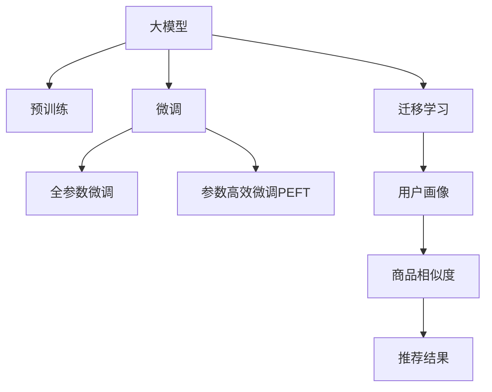

                 

# AI 大模型在电商搜索推荐中的数据处理能力要求：应对大规模实时数据

## 1. 背景介绍

### 1.1 电商搜索推荐系统的需求
电商搜索推荐系统是电商平台上用户和商品交互的重要桥梁，其目的是帮助用户快速找到自己感兴趣的商品，提高购买转化率和用户体验。为实现这一目标，系统需要根据用户历史行为、商品属性等多维度的数据，精准推荐商品。电商搜索推荐系统的核心要求包括：

1. **高效性**：搜索推荐过程需要毫秒级响应，以提升用户体验。
2. **实时性**：随着用户行为的变化，需要实时更新推荐结果。
3. **个性化**：根据用户兴趣和行为，提供个性化的商品推荐。
4. **准确性**：准确预测用户对商品的兴趣和购买意愿，提高推荐效果。

随着电商市场的不断发展，用户需求愈发复杂，商品数量急剧增加，传统的推荐算法无法满足大规模实时数据处理的需求。近年来，大模型（如BERT、GPT、XLNet等）被引入电商推荐系统，利用其强大的数据处理能力，显著提升了推荐系统的性能。

### 1.2 大模型在电商推荐中的应用
大模型通过在电商数据上预训练，学习到丰富的商品和用户特征表示，可以用于推荐系统的用户画像建模和商品相似度计算。具体应用包括：

1. **用户画像建模**：将用户的历史行为、兴趣偏好、评分记录等数据，输入大模型进行编码，生成用户的高维表示向量，用于相似度计算和推荐。
2. **商品相似度计算**：将商品的属性、标签、评分等信息，输入大模型进行编码，生成商品的高维表示向量，计算商品向量之间的相似度，用于推荐相似商品。
3. **推荐结果生成**：基于用户和商品的高维表示向量，使用余弦相似度或点积相似度等方法计算相似度，并根据相似度进行推荐。

大模型的引入，极大地提升了电商搜索推荐系统的性能和效率，成为电商推荐领域的“新宠”。然而，大规模实时数据处理和大模型计算资源的优化，仍是大模型在电商推荐系统中面临的主要挑战。

## 2. 核心概念与联系

### 2.1 核心概念概述
为更好地理解大模型在电商搜索推荐中的数据处理能力，本节将介绍几个核心概念：

- **大模型（Large Model）**：指的是具有大规模参数量的神经网络模型，如BERT、GPT等。这些模型通过在大规模无标签数据上进行预训练，学习到丰富的语言或数据表示。
- **预训练（Pre-training）**：指在大规模无标签数据上，通过自监督学习任务训练通用模型的过程。常见的预训练任务包括掩码语言模型、Next Sentence Prediction等。
- **微调（Fine-tuning）**：指在预训练模型的基础上，使用下游任务的少量标注数据，通过有监督学习优化模型在下游任务上的性能。
- **迁移学习（Transfer Learning）**：指将一个领域学习到的知识，迁移到另一个不同但相关的领域的学习范式。
- **嵌入（Embedding）**：将高维稀疏数据（如文本、图像）映射到低维连续空间，用于模型训练和特征表示。
- **相似度计算（Similarity Computation）**：用于衡量数据对象之间的相似性，常用的方法包括余弦相似度、欧式距离等。
- **推荐系统（Recommender System）**：基于用户兴趣和商品特征，推荐用户可能感兴趣的商品的系统。

这些概念之间的逻辑关系可以通过以下Mermaid流程图来展示：



这个流程图展示了大模型的核心概念及其之间的关系：

1. 大模型通过预训练获得基础能力。
2. 微调是对预训练模型进行任务特定的优化，可以分为全参数微调和参数高效微调（PEFT）。
3. 迁移学习是连接预训练模型与下游任务的桥梁，可以通过微调或迁移学习来实现。
4. 嵌入用于将高维数据映射到低维空间，为模型训练提供有效的特征表示。
5. 相似度计算用于衡量数据对象之间的相似性，是推荐系统中的重要步骤。
6. 推荐系统利用用户和商品的高维表示向量，计算相似度进行推荐。

这些核心概念共同构成了大模型在电商搜索推荐中的数据处理框架，使其能够高效处理大规模实时数据，提供个性化的推荐服务。

## 3. 核心算法原理 & 具体操作步骤
### 3.1 算法原理概述

大模型在电商搜索推荐中的应用，本质上是一个基于迁移学习的推荐过程。其核心思想是：将大模型作为特征提取器，通过在电商数据上预训练，学习商品和用户的特征表示。然后，将预训练模型应用到下游推荐任务上，通过有监督学习优化模型性能，最终生成推荐结果。

具体而言，假设大模型为 $M_{\theta}$，其中 $\theta$ 为预训练得到的模型参数。给定电商推荐任务 $T$ 的标注数据集 $D=\{(x_i,y_i)\}_{i=1}^N$，推荐任务的目标是找到新的模型参数 $\hat{\theta}$，使得推荐系统能够根据用户 $x$ 和商品 $y$ 的特征，生成预测标签 $y'$：

$$
\hat{\theta}=\mathop{\arg\min}_{\theta} \mathcal{L}(M_{\theta},D)
$$

其中 $\mathcal{L}$ 为推荐任务设计的损失函数，用于衡量模型预测输出与真实标签之间的差异。常见的损失函数包括均方误差损失、交叉熵损失等。

通过梯度下降等优化算法，推荐过程不断更新模型参数 $\theta$，最小化损失函数 $\mathcal{L}$，使得模型预测输出逼近真实标签。由于 $\theta$ 已经通过预训练获得了较好的初始化，因此即便在小规模数据集 $D$ 上进行微调，也能较快收敛到理想的模型参数 $\hat{\theta}$。

### 3.2 算法步骤详解

大模型在电商搜索推荐中的数据处理和推荐过程，一般包括以下几个关键步骤：

**Step 1: 准备数据集**
- 收集电商平台的商品数据和用户行为数据，包括商品属性、商品评分、用户浏览记录、购买记录等。
- 对数据进行预处理，包括去重、清洗、归一化等操作。
- 将数据划分为训练集、验证集和测试集，以便评估模型性能。

**Step 2: 数据嵌入（Embedding）**
- 对商品和用户的特征数据进行嵌入，将其映射到低维连续空间。
- 使用Word2Vec、GloVe、BERT等预训练模型，将文本数据转化为向量表示。
- 对非文本数据（如图像、音频等）进行编码，转化为向量表示。

**Step 3: 预训练大模型**
- 在大规模电商数据上，使用自监督学习任务训练大模型。
- 常见的预训练任务包括掩码语言模型、Next Sentence Prediction等。
- 通过预训练学习到商品和用户的特征表示。

**Step 4: 微调优化**
- 在预训练模型的基础上，使用推荐任务的标注数据进行微调。
- 选择合适的优化算法及其参数，如Adam、SGD等，设置学习率、批大小、迭代轮数等。
- 设置正则化技术及强度，包括L2正则、Dropout、Early Stopping等。
- 使用余弦相似度、点积相似度等方法计算用户和商品的相似度，并生成推荐结果。

**Step 5: 模型评估与优化**
- 在验证集上评估模型性能，调整模型参数和超参数，防止过拟合。
- 在测试集上评估模型性能，对比微调前后的推荐效果。
- 持续收集新数据，定期重新微调模型，以适应数据分布的变化。

### 3.3 算法优缺点

大模型在电商搜索推荐中的应用，具有以下优点：
1. **强大的特征提取能力**：大模型能够自动学习复杂的特征表示，提升推荐系统的准确性和个性化。
2. **高效的推荐过程**：大模型的计算能力强大，能够快速生成推荐结果，满足实时性要求。
3. **泛化能力强**：大模型已经在大规模无标签数据上进行了预训练，具有较强的泛化能力，适用于多种推荐场景。

同时，该方法也存在一定的局限性：
1. **数据依赖性强**：大模型需要在大规模电商数据上进行预训练，数据获取和处理成本较高。
2. **计算资源消耗大**：大模型的计算资源消耗大，需要高性能硬件支持。
3. **可解释性不足**：大模型的决策过程难以解释，缺乏透明性。
4. **模型偏见**：大模型可能存在预训练数据的偏见，影响推荐结果的公平性和可信度。

尽管存在这些局限性，但大模型在电商搜索推荐中的应用，已经展现出巨大的潜力，成为推荐系统的重要技术手段。

### 3.4 算法应用领域

大模型在电商搜索推荐中的应用，已经涵盖了多个推荐场景，例如：

- **个性化推荐**：根据用户的历史行为和兴趣，推荐可能感兴趣的商品。
- **新商品推荐**：推荐给新用户未浏览过的商品，提高用户粘性。
- **热门商品推荐**：推荐当前热门商品，满足用户需求。
- **相似商品推荐**：推荐与用户购买过的商品相似的商品。
- **排行榜推荐**：根据商品的评分、销售量等指标，推荐热门商品。

除了上述这些经典推荐场景外，大模型还被创新性地应用于商品价格预测、情感分析、多模态推荐等，进一步丰富了推荐系统的功能和应用场景。

## 4. 数学模型和公式 & 详细讲解

### 4.1 数学模型构建

假设电商推荐任务为二分类任务，即推荐是否购买某一商品，可以定义模型 $M_{\theta}$ 在用户 $x$ 和商品 $y$ 的特征表示向量上的输出为 $\hat{y}=M_{\theta}(x,y) \in [0,1]$，表示用户 $x$ 是否购买商品 $y$ 的概率。

定义模型 $M_{\theta}$ 在数据样本 $(x,y)$ 上的损失函数为 $\ell(M_{\theta}(x,y),y)$，则在数据集 $D$ 上的经验风险为：

$$
\mathcal{L}(\theta) = \frac{1}{N}\sum_{i=1}^N \ell(M_{\theta}(x_i,y_i),y_i)
$$

其中，损失函数 $\ell$ 可以定义如下：

$$
\ell(M_{\theta}(x,y),y) = -y\log M_{\theta}(x,y) - (1-y)\log(1-M_{\theta}(x,y))
$$

为了优化模型参数 $\theta$，通常使用基于梯度的优化算法，如Adam、SGD等，其更新公式为：

$$
\theta \leftarrow \theta - \eta \nabla_{\theta}\mathcal{L}(\theta) - \eta\lambda\theta
$$

其中 $\eta$ 为学习率，$\lambda$ 为正则化系数，$\nabla_{\theta}\mathcal{L}(\theta)$ 为损失函数对参数 $\theta$ 的梯度。

### 4.2 公式推导过程

以下我们以二分类推荐任务为例，推导损失函数及其梯度的计算公式。

假设模型 $M_{\theta}$ 在输入 $(x,y)$ 上的输出为 $\hat{y}=M_{\theta}(x,y) \in [0,1]$，表示用户 $x$ 是否购买商品 $y$ 的概率。真实标签 $y \in \{0,1\}$。则二分类交叉熵损失函数定义为：

$$
\ell(M_{\theta}(x,y),y) = -[y\log \hat{y} + (1-y)\log (1-\hat{y})]
$$

将其代入经验风险公式，得：

$$
\mathcal{L}(\theta) = -\frac{1}{N}\sum_{i=1}^N [y_i\log M_{\theta}(x_i,y_i)+(1-y_i)\log(1-M_{\theta}(x_i,y_i))]
$$

根据链式法则，损失函数对参数 $\theta_k$ 的梯度为：

$$
\frac{\partial \mathcal{L}(\theta)}{\partial \theta_k} = -\frac{1}{N}\sum_{i=1}^N (\frac{y_i}{M_{\theta}(x_i,y_i)}-\frac{1-y_i}{1-M_{\theta}(x_i,y_i)}) \frac{\partial M_{\theta}(x_i,y_i)}{\partial \theta_k}
$$

其中 $\frac{\partial M_{\theta}(x_i,y_i)}{\partial \theta_k}$ 可进一步递归展开，利用自动微分技术完成计算。

在得到损失函数的梯度后，即可带入参数更新公式，完成模型的迭代优化。重复上述过程直至收敛，最终得到适应电商推荐任务的最优模型参数 $\theta^*$。

## 5. 项目实践：代码实例和详细解释说明

### 5.1 开发环境搭建

在进行电商推荐系统的大模型微调实践前，我们需要准备好开发环境。以下是使用Python进行PyTorch开发的环境配置流程：

1. 安装Anaconda：从官网下载并安装Anaconda，用于创建独立的Python环境。

2. 创建并激活虚拟环境：
```bash
conda create -n pytorch-env python=3.8 
conda activate pytorch-env
```

3. 安装PyTorch：根据CUDA版本，从官网获取对应的安装命令。例如：
```bash
conda install pytorch torchvision torchaudio cudatoolkit=11.1 -c pytorch -c conda-forge
```

4. 安装Transformers库：
```bash
pip install transformers
```

5. 安装各类工具包：
```bash
pip install numpy pandas scikit-learn matplotlib tqdm jupyter notebook ipython
```

完成上述步骤后，即可在`pytorch-env`环境中开始微调实践。

### 5.2 源代码详细实现

下面我们以电商推荐任务为例，给出使用Transformers库对BERT模型进行微调的PyTorch代码实现。

首先，定义推荐任务的数据处理函数：

```python
from transformers import BertTokenizer
from torch.utils.data import Dataset
import torch

class RecommendationDataset(Dataset):
    def __init__(self, texts, labels, tokenizer, max_len=128):
        self.texts = texts
        self.labels = labels
        self.tokenizer = tokenizer
        self.max_len = max_len
        
    def __len__(self):
        return len(self.texts)
    
    def __getitem__(self, item):
        text = self.texts[item]
        label = self.labels[item]
        
        encoding = self.tokenizer(text, return_tensors='pt', max_length=self.max_len, padding='max_length', truncation=True)
        input_ids = encoding['input_ids'][0]
        attention_mask = encoding['attention_mask'][0]
        
        # 对label进行编码
        encoded_labels = [1 if label == 1 else 0] 
        encoded_labels.extend([0] * (self.max_len - len(encoded_labels)))
        labels = torch.tensor(encoded_labels, dtype=torch.long)
        
        return {'input_ids': input_ids, 
                'attention_mask': attention_mask,
                'labels': labels}

# 标签与id的映射
label2id = {1: 0, 0: 1}
id2label = {v: k for k, v in label2id.items()}

# 创建dataset
tokenizer = BertTokenizer.from_pretrained('bert-base-cased')

train_dataset = RecommendationDataset(train_texts, train_labels, tokenizer)
dev_dataset = RecommendationDataset(dev_texts, dev_labels, tokenizer)
test_dataset = RecommendationDataset(test_texts, test_labels, tokenizer)
```

然后，定义模型和优化器：

```python
from transformers import BertForTokenClassification, AdamW

model = BertForTokenClassification.from_pretrained('bert-base-cased', num_labels=2)

optimizer = AdamW(model.parameters(), lr=2e-5)
```

接着，定义训练和评估函数：

```python
from torch.utils.data import DataLoader
from tqdm import tqdm
from sklearn.metrics import classification_report

device = torch.device('cuda') if torch.cuda.is_available() else torch.device('cpu')
model.to(device)

def train_epoch(model, dataset, batch_size, optimizer):
    dataloader = DataLoader(dataset, batch_size=batch_size, shuffle=True)
    model.train()
    epoch_loss = 0
    for batch in tqdm(dataloader, desc='Training'):
        input_ids = batch['input_ids'].to(device)
        attention_mask = batch['attention_mask'].to(device)
        labels = batch['labels'].to(device)
        model.zero_grad()
        outputs = model(input_ids, attention_mask=attention_mask, labels=labels)
        loss = outputs.loss
        epoch_loss += loss.item()
        loss.backward()
        optimizer.step()
    return epoch_loss / len(dataloader)

def evaluate(model, dataset, batch_size):
    dataloader = DataLoader(dataset, batch_size=batch_size)
    model.eval()
    preds, labels = [], []
    with torch.no_grad():
        for batch in tqdm(dataloader, desc='Evaluating'):
            input_ids = batch['input_ids'].to(device)
            attention_mask = batch['attention_mask'].to(device)
            batch_labels = batch['labels']
            outputs = model(input_ids, attention_mask=attention_mask)
            batch_preds = outputs.logits.argmax(dim=2).to('cpu').tolist()
            batch_labels = batch_labels.to('cpu').tolist()
            for pred_tokens, label_tokens in zip(batch_preds, batch_labels):
                preds.append(pred_tokens[:len(label_tokens)])
                labels.append(label_tokens)
                
    print(classification_report(labels, preds))
```

最后，启动训练流程并在测试集上评估：

```python
epochs = 5
batch_size = 16

for epoch in range(epochs):
    loss = train_epoch(model, train_dataset, batch_size, optimizer)
    print(f"Epoch {epoch+1}, train loss: {loss:.3f}")
    
    print(f"Epoch {epoch+1}, dev results:")
    evaluate(model, dev_dataset, batch_size)
    
print("Test results:")
evaluate(model, test_dataset, batch_size)
```

以上就是使用PyTorch对BERT进行电商推荐任务微调的完整代码实现。可以看到，得益于Transformers库的强大封装，我们可以用相对简洁的代码完成BERT模型的加载和微调。

### 5.3 代码解读与分析

让我们再详细解读一下关键代码的实现细节：

**RecommendationDataset类**：
- `__init__`方法：初始化文本、标签、分词器等关键组件。
- `__len__`方法：返回数据集的样本数量。
- `__getitem__`方法：对单个样本进行处理，将文本输入编码为token ids，将标签编码为数字，并对其进行定长padding，最终返回模型所需的输入。

**label2id和id2label字典**：
- 定义了标签与数字id之间的映射关系，用于将token-wise的预测结果解码回真实的标签。

**训练和评估函数**：
- 使用PyTorch的DataLoader对数据集进行批次化加载，供模型训练和推理使用。
- 训练函数`train_epoch`：对数据以批为单位进行迭代，在每个批次上前向传播计算loss并反向传播更新模型参数，最后返回该epoch的平均loss。
- 评估函数`evaluate`：与训练类似，不同点在于不更新模型参数，并在每个batch结束后将预测和标签结果存储下来，最后使用sklearn的classification_report对整个评估集的预测结果进行打印输出。

**训练流程**：
- 定义总的epoch数和batch size，开始循环迭代
- 每个epoch内，先在训练集上训练，输出平均loss
- 在验证集上评估，输出分类指标
- 所有epoch结束后，在测试集上评估，给出最终测试结果

可以看到，PyTorch配合Transformers库使得BERT微调的代码实现变得简洁高效。开发者可以将更多精力放在数据处理、模型改进等高层逻辑上，而不必过多关注底层的实现细节。

当然，工业级的系统实现还需考虑更多因素，如模型的保存和部署、超参数的自动搜索、更灵活的任务适配层等。但核心的微调范式基本与此类似。

## 6. 实际应用场景

### 6.1 电商搜索推荐系统

基于大模型的电商搜索推荐系统，可以帮助用户快速找到自己感兴趣的商品，提升用户体验。在大模型的帮助下，系统能够学习到商品和用户的复杂特征表示，实现更加精准的推荐。

具体而言，系统可以收集用户的历史浏览、点击、购买记录，以及商品的评分、标签等数据。将这些数据输入大模型进行嵌入，生成高维特征表示向量。通过余弦相似度等方法计算用户和商品的相似度，并生成推荐结果。系统还可以通过进一步微调，优化推荐模型，提升推荐效果。

### 6.2 个性化推荐引擎

基于大模型的个性化推荐引擎，能够根据用户的历史行为和兴趣，推荐可能感兴趣的商品。这可以应用于电商、视频、音乐等多个领域，提高用户的满意度和转化率。

在大模型的帮助下，系统可以学习到用户的多维特征表示，包括兴趣、行为、时间、地点等。通过对这些特征进行编码，生成高维特征向量，并计算商品向量之间的相似度。通过余弦相似度等方法，推荐与用户最相似的若干商品，实现个性化推荐。

### 6.3 实时推荐系统

大模型在实时推荐系统中的应用，可以满足用户即时性的需求。系统通过实时抓取用户行为数据，更新用户画像和商品向量，并重新计算相似度，生成推荐结果。这可以应用于在线零售、即时通讯、社交网络等多个场景，提升用户的即时体验。

系统可以在用户行为数据到达后，实时计算相似度，生成推荐结果，并推送到用户终端。这种实时推荐方式，能够快速响应用户的需求变化，提高用户的满意度和粘性。

### 6.4 未来应用展望

随着大模型和推荐技术的不断发展，基于大模型的推荐系统将具备更强大的数据处理能力和更丰富的应用场景。未来，大模型在推荐系统中的应用将进一步扩展，推动推荐技术的创新和落地。

在智慧城市治理中，基于大模型的推荐系统可以用于城市事件监测、舆情分析、应急指挥等环节，提高城市管理的自动化和智能化水平。

在智能制造领域，基于大模型的推荐系统可以用于设备维护、生产调度、供应链优化等，提升制造业的效率和柔性。

在智能家居领域，基于大模型的推荐系统可以用于智能设备推荐、智能场景定制等，提升家居生活的智能化水平。

总之，基于大模型的推荐系统将在各个领域发挥重要作用，推动智能化技术的深入应用。

## 7. 工具和资源推荐

### 7.1 学习资源推荐

为了帮助开发者系统掌握大模型在电商推荐中的应用，这里推荐一些优质的学习资源：

1. 《Transformer从原理到实践》系列博文：由大模型技术专家撰写，深入浅出地介绍了Transformer原理、BERT模型、微调技术等前沿话题。

2. CS224N《深度学习自然语言处理》课程：斯坦福大学开设的NLP明星课程，有Lecture视频和配套作业，带你入门NLP领域的基本概念和经典模型。

3. 《Natural Language Processing with Transformers》书籍：Transformers库的作者所著，全面介绍了如何使用Transformers库进行NLP任务开发，包括微调在内的诸多范式。

4. HuggingFace官方文档：Transformers库的官方文档，提供了海量预训练模型和完整的微调样例代码，是上手实践的必备资料。

5. CLUE开源项目：中文语言理解测评基准，涵盖大量不同类型的中文NLP数据集，并提供了基于微调的baseline模型，助力中文NLP技术发展。

通过对这些资源的学习实践，相信你一定能够快速掌握大模型在电商推荐中的应用，并用于解决实际的推荐问题。

### 7.2 开发工具推荐

高效的开发离不开优秀的工具支持。以下是几款用于大模型在电商推荐系统中应用的常用工具：

1. PyTorch：基于Python的开源深度学习框架，灵活动态的计算图，适合快速迭代研究。大部分预训练语言模型都有PyTorch版本的实现。

2. TensorFlow：由Google主导开发的开源深度学习框架，生产部署方便，适合大规模工程应用。同样有丰富的预训练语言模型资源。

3. Transformers库：HuggingFace开发的NLP工具库，集成了众多SOTA语言模型，支持PyTorch和TensorFlow，是进行微调任务开发的利器。

4. Weights & Biases：模型训练的实验跟踪工具，可以记录和可视化模型训练过程中的各项指标，方便对比和调优。与主流深度学习框架无缝集成。

5. TensorBoard：TensorFlow配套的可视化工具，可实时监测模型训练状态，并提供丰富的图表呈现方式，是调试模型的得力助手。

6. Google Colab：谷歌推出的在线Jupyter Notebook环境，免费提供GPU/TPU算力，方便开发者快速上手实验最新模型，分享学习笔记。

合理利用这些工具，可以显著提升大模型在电商推荐系统中的应用效率，加快创新迭代的步伐。

### 7.3 相关论文推荐

大模型和推荐技术的发展源于学界的持续研究。以下是几篇奠基性的相关论文，推荐阅读：

1. Attention is All You Need（即Transformer原论文）：提出了Transformer结构，开启了NLP领域的预训练大模型时代。

2. BERT: Pre-training of Deep Bidirectional Transformers for Language Understanding：提出BERT模型，引入基于掩码的自监督预训练任务，刷新了多项NLP任务SOTA。

3. Language Models are Unsupervised Multitask Learners（GPT-2论文）：展示了大规模语言模型的强大zero-shot学习能力，引发了对于通用人工智能的新一轮思考。

4. Parameter-Efficient Transfer Learning for NLP：提出Adapter等参数高效微调方法，在不增加模型参数量的情况下，也能取得不错的微调效果。

5. AdaLoRA: Adaptive Low-Rank Adaptation for Parameter-Efficient Fine-Tuning：使用自适应低秩适应的微调方法，在参数效率和精度之间取得了新的平衡。

这些论文代表了大模型在推荐系统中的应用的发展脉络。通过学习这些前沿成果，可以帮助研究者把握学科前进方向，激发更多的创新灵感。

## 8. 总结：未来发展趋势与挑战

### 8.1 总结

本文对基于大模型在电商搜索推荐系统中的应用进行了全面系统的介绍。首先阐述了电商搜索推荐系统的需求和背景，明确了电商推荐中的核心要求和应用场景。其次，从原理到实践，详细讲解了基于大模型的电商推荐流程，包括数据处理、模型构建、训练优化等关键步骤，给出了微调任务开发的完整代码实例。同时，本文还广泛探讨了基于大模型的电商推荐在多个实际应用场景中的应用，展示了微调范式的巨大潜力。此外，本文精选了微调技术的各类学习资源，力求为读者提供全方位的技术指引。

通过本文的系统梳理，可以看到，基于大模型的电商推荐系统在数据处理能力和实时性方面具备显著优势，能够快速响应用户需求，提升用户体验。未来，伴随大模型和推荐技术的不断发展，基于大模型的推荐系统将进一步拓展应用范围，推动智能化技术的深入应用。

### 8.2 未来发展趋势

展望未来，大模型在电商搜索推荐中的应用将呈现以下几个发展趋势：

1. **模型规模持续增大**：随着算力成本的下降和数据规模的扩张，预训练语言模型的参数量还将持续增长。超大规模语言模型蕴含的丰富语言知识，有望支撑更加复杂多变的电商推荐任务。

2. **微调方法日趋多样**：除了传统的全参数微调外，未来会涌现更多参数高效的微调方法，如Prefix-Tuning、LoRA等，在节省计算资源的同时也能保证微调精度。

3. **持续学习成为常态**：随着电商数据和用户行为的变化，微调模型也需要持续学习新知识以保持性能。如何在不遗忘原有知识的同时，高效吸收新样本信息，将成为重要的研究课题。

4. **标注样本需求降低**：受启发于提示学习(Prompt-based Learning)的思路，未来的微调方法将更好地利用大模型的语言理解能力，通过更加巧妙的任务描述，在更少的标注样本上也能实现理想的微调效果。

5. **多模态微调崛起**：当前大模型主要用于文本数据，未来会进一步拓展到图像、视频、语音等多模态数据微调。多模态信息的融合，将显著提升大模型的语义表示能力和推荐效果。

6. **知识整合能力增强**：现有的微调模型往往局限于任务内数据，未来可以结合知识图谱、逻辑规则等专家知识，增强大模型的知识整合能力，提升推荐模型的泛化能力和智能水平。

以上趋势凸显了大模型在电商推荐中的应用前景。这些方向的探索发展，必将进一步提升电商推荐系统的性能和效率，为电商市场带来新的增长点。

### 8.3 面临的挑战

尽管大模型在电商推荐中的应用已经取得了显著成果，但在迈向更加智能化、普适化应用的过程中，它仍面临诸多挑战：

1. **数据依赖性强**：大模型需要在大规模电商数据上进行预训练，数据获取和处理成本较高。如何降低数据依赖，获取更多高质量标注数据，将是未来研究的重要方向。

2. **计算资源消耗大**：大模型的计算资源消耗大，需要高性能硬件支持。如何优化模型结构和计算图，降低计算成本，提升推理速度，将是重要的优化方向。

3. **可解释性不足**：大模型的决策过程难以解释，缺乏透明性。如何赋予大模型更强的可解释性，提供透明的决策路径，将是亟待攻克的难题。

4. **模型偏见**：大模型可能存在预训练数据的偏见，影响推荐结果的公平性和可信度。如何从数据和算法层面消除模型偏见，保障推荐结果的公正性，也将是重要的研究课题。

5. **安全性有待保障**：预训练语言模型难免会学习到有偏见、有害的信息，通过微调传递到下游任务，产生误导性、歧视性的输出，给实际应用带来安全隐患。如何从数据和算法层面消除模型偏见，避免恶意用途，确保输出的安全性，也将是重要的研究课题。

6. **知识整合能力不足**：现有的微调模型往往局限于任务内数据，难以灵活吸收和运用更广泛的先验知识。如何让微调过程更好地与外部知识库、规则库等专家知识结合，形成更加全面、准确的信息整合能力，还有很大的想象空间。

正视大模型在电商推荐中所面临的这些挑战，积极应对并寻求突破，将是大模型在电商推荐系统中走向成熟的必由之路。相信随着学界和产业界的共同努力，这些挑战终将一一被克服，大模型在电商推荐中的应用将更加广泛深入。

### 8.4 未来突破

面对大模型在电商推荐系统中的应用所面临的种种挑战，未来的研究需要在以下几个方面寻求新的突破：

1. **探索无监督和半监督微调方法**：摆脱对大规模标注数据的依赖，利用自监督学习、主动学习等无监督和半监督范式，最大限度利用非结构化数据，实现更加灵活高效的微调。

2. **研究参数高效和计算高效的微调范式**：开发更加参数高效的微调方法，在固定大部分预训练参数的同时，只更新极少量的任务相关参数。同时优化微调模型的计算图，减少前向传播和反向传播的资源消耗，实现更加轻量级、实时性的部署。

3. **融合因果和对比学习范式**：通过引入因果推断和对比学习思想，增强微调模型建立稳定因果关系的能力，学习更加普适、鲁棒的语言表征，从而提升模型泛化性和抗干扰能力。

4. **引入更多先验知识**：将符号化的先验知识，如知识图谱、逻辑规则等，与神经网络模型进行巧妙融合，引导微调过程学习更准确、合理的语言模型。同时加强不同模态数据的整合，实现视觉、语音等多模态信息与文本信息的协同建模。

5. **结合因果分析和博弈论工具**：将因果分析方法引入微调模型，识别出模型决策的关键特征，增强输出解释的因果性和逻辑性。借助博弈论工具刻画人机交互过程，主动探索并规避模型的脆弱点，提高系统稳定性。

6. **纳入伦理道德约束**：在模型训练目标中引入伦理导向的评估指标，过滤和惩罚有偏见、有害的输出倾向。同时加强人工干预和审核，建立模型行为的监管机制，确保输出符合人类价值观和伦理道德。

这些研究方向的探索，必将引领大模型在电商推荐系统中的应用迈向更高的台阶，为构建安全、可靠、可解释、可控的智能系统铺平道路。面向未来，大模型在电商推荐系统中的应用还需要与其他人工智能技术进行更深入的融合，如知识表示、因果推理、强化学习等，多路径协同发力，共同推动电商推荐技术的进步。只有勇于创新、敢于突破，才能不断拓展大模型在电商推荐系统中的应用边界，让智能技术更好地造福电商市场。

## 9. 附录：常见问题与解答

**Q1：大模型在电商推荐系统中如何处理大规模数据？**

A: 大模型在电商推荐系统中处理大规模数据，主要依赖于其强大的数据处理能力和高效的计算能力。具体来说，可以通过以下几个步骤实现：

1. **数据预处理**：将电商数据进行去重、清洗、归一化等预处理操作，生成标准化的输入数据。

2. **数据嵌入**：使用BERT等大模型，将电商数据转化为高维向量表示，用于模型训练和特征表示。

3. **分批处理**：将大规模数据分成多个批次进行迭代处理，每批次包含少量数据，以避免内存溢出。

4. **GPU加速**：利用GPU等高性能硬件设备，加速大模型的计算和推理过程，提高处理效率。

5. **增量更新**：采用增量更新的方式，实时更新模型参数，避免在每次更新时重新加载全部数据，提高系统响应速度。

**Q2：如何优化大模型在电商推荐系统中的计算效率？**

A: 优化大模型在电商推荐系统中的计算效率，可以从以下几个方面入手：

1. **参数剪枝**：去除不必要的层和参数，减小模型尺寸，加快推理速度。

2. **量化加速**：将浮点模型转为定点模型，压缩存储空间，提高计算效率。

3. **模型并行**：采用模型并行技术，如数据并行、模型并行等，将大模型拆分为多个小模型并行计算，提高计算效率。

4. **硬件优化**：利用GPU、TPU等高性能硬件设备，加速大模型的计算和推理过程。

5. **优化算法**：选择合适的优化算法，如AdamW、Adafactor等，并进行调参优化，提高模型训练速度。

6. **分布式训练**：利用分布式训练技术，将模型训练任务分配到多个计算节点并行执行，提高训练效率。

通过以上优化措施，可以有效提升大模型在电商推荐系统中的计算效率，满足大规模实时数据处理的需求。

**Q3：如何降低大模型在电商推荐系统中的计算成本？**

A: 降低大模型在电商推荐系统中的计算成本，可以从以下几个方面入手：

1. **参数压缩**：采用参数压缩技术，如剪枝、量化等，减小模型的计算量和存储空间。

2. **模型压缩**：使用模型压缩技术，如知识蒸馏、剪枝等，生成更轻量级的模型，降低计算成本。

3. **硬件优化**：利用GPU、TPU等高性能硬件设备，加速大模型的计算和推理过程。

4. **增量更新**：采用增量更新的方式，实时更新模型参数，避免在每次更新时重新加载全部数据，降低计算成本。

5. **模型裁剪**：根据应用需求，裁剪不必要的层和参数，减小模型尺寸，降低计算成本。

6. **分布式训练**：利用分布式训练技术，将模型训练任务分配到多个计算节点并行执行，降低单次训练的计算成本。

通过以上措施，可以有效降低大模型在电商推荐系统中的计算成本，提升系统的可扩展性和经济性。

**Q4：如何提高大模型在电商推荐系统中的可解释性？**

A: 提高大模型在电商推荐系统中的可解释性，可以从以下几个方面入手：

1. **模型可视化**：使用可视化工具，如TensorBoard、Weights & Biases等，展示大模型的训练和推理过程，提供透明的决策路径。

2. **解释性模型**：引入可解释性模型，如线性模型、决策树等，增强大模型的可解释性。

3. **特征重要性分析**：通过特征重要性分析，识别大模型决策的关键特征，提供透明的决策依据。

4. **可解释性微调**：在微调过程中，引入可解释性指标，如模型的鲁棒性、公平性等，优化模型的可解释性。

5. **用户反馈机制**：引入用户反馈机制，收集用户对推荐结果的评价，调整模型参数和超参数，提高推荐结果的透明度。

通过以上措施，可以有效提高大模型在电商推荐系统中的可解释性，提供透明的决策路径，增强系统的可信度和用户满意度。

**Q5：大模型在电商推荐系统中如何降低数据依赖性？**

A: 降低大模型在电商推荐系统中的数据依赖性，可以从以下几个方面入手：

1. **自监督学习**：利用自监督学习任务，在大规模无标签数据上预训练大模型，减少对标注数据的依赖。

2. **数据增强**：通过数据增强技术，如回译、近义替换等，扩充训练集，提高模型的泛化能力。

3. **迁移学习**：利用迁移学习范式，在大规模预训练模型上微调，提高模型的泛化能力和适应性。

4. **半监督学习**：利用半监督学习技术，在少量标注数据和大量未标注数据上联合训练模型，减少对标注数据的依赖。

5. **零样本学习**：利用零样本学习技术，在大模型上进行微调，在缺乏标注数据的情况下，仍能生成高质量的推荐结果。

通过以上措施，可以有效降低大模型在电商推荐系统中的数据依赖性，提高模型的泛化能力和适应性。

**Q6：如何在大模型在电商推荐系统中的模型偏见问题？**

A: 在大模型在电商推荐系统中的模型偏见问题，可以从以下几个方面入手：

1. **数据清洗**：对训练数据进行清洗，去除含有偏见的数据，提高模型的公平性。

2. **偏差校正**：引入偏差校正技术，如数据重加权、模型正则化等，减少模型的偏见。

3. **多源数据融合**：利用多源数据融合技术，结合不同数据源的信息，提高模型的鲁棒性和公平性。

4. **公平性评估**：引入公平性评估指标，如性别公平性、种族公平性等，评估模型的公平性，并进行调整优化。

5. **伦理约束**：在模型训练目标中引入伦理导向的评估指标，过滤和惩罚有偏见、有害的输出倾向，确保输出符合人类价值观和伦理道德。

通过以上措施，可以有效降低大模型在电商推荐系统中的模型偏见，提高模型的公平性和可信度。

**Q7：大模型在电商推荐系统中的应用存在哪些挑战？**

A: 大模型在电商推荐系统中的应用，主要面临以下挑战：

1. **数据依赖性强**：大模型需要在大规模电商数据上进行预训练，数据获取和处理成本较高。

2. **计算资源消耗大**：大模型的计算资源消耗大，需要高性能硬件支持。

3. **可解释性不足**：大模型的决策过程难以解释，缺乏透明性。

4. **模型偏见**：大模型可能存在预训练数据的偏见，影响推荐结果的公平性和可信度。

5. **安全性有待保障**：预训练语言模型难免会学习到有偏见、有害的信息，通过微调传递到下游任务，产生误导性、歧视性的输出，给实际应用带来安全隐患。

6. **知识整合能力不足**：现有的微调模型往往局限于任务内数据，难以灵活吸收和运用更广泛的先验知识。

正视这些挑战，积极应对并寻求突破，将是大模型在电商推荐系统中走向成熟的必由之路。相信随着学界和产业界的共同努力，这些挑战终将一一被克服，大模型在电商推荐中的应用将更加广泛深入。

**Q8：大模型在电商推荐系统中的未来发展趋势？**

A: 大模型在电商推荐系统中的未来发展趋势，主要体现在以下几个方面：

1. **模型规模持续增大**：随着算力成本的下降和数据规模的扩张，预训练语言模型的参数量还将持续增长。超大规模语言模型蕴含的丰富语言知识，有望支撑更加复杂多变的电商推荐任务。

2. **微调方法日趋多样**：除了传统的全参数微调外，未来会涌现更多参数高效的微调方法，如Prefix-Tuning、Lo

