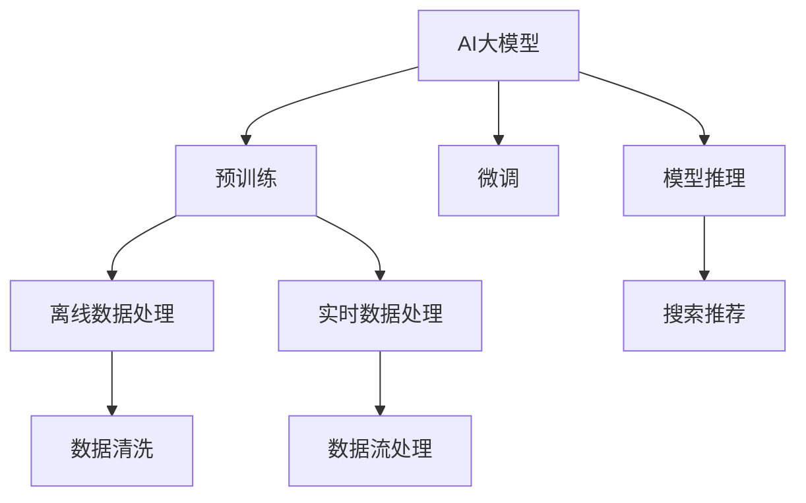

                 

# AI 大模型在电商搜索推荐中的数据处理能力要求：应对大规模实时数据处理

在当前的电子商务平台上，AI大模型被广泛应用于搜索推荐系统，以提升用户体验和转化率。然而，实现高性能的搜索推荐系统，不仅仅依赖于模型的精准度，还需要系统具备强大的数据处理能力。本文将深入探讨AI大模型在电商搜索推荐中数据处理能力的要求，以及如何通过优化算法和技术手段，应对大规模实时数据处理带来的挑战。

## 1. 背景介绍

随着电商平台的竞争加剧，搜索推荐系统成为提升用户体验和增加销售转化率的关键。AI大模型因其强大的泛化能力和处理能力，成为搜索推荐系统的首选方案。然而，电商平台的数据量巨大且实时变化，对数据处理能力提出了更高的要求。

## 2. 核心概念与联系

### 2.1 核心概念概述

#### 2.1.1 AI大模型

AI大模型指基于深度学习架构的模型，如Transformer模型，其参数量在数十亿级别，能够处理复杂的自然语言处理任务，具有较强的泛化能力和适应性。

#### 2.1.2 搜索推荐系统

搜索推荐系统通过分析用户行为数据和商品属性信息，预测用户的购买意向，推荐符合用户兴趣的商品。其目的是提高用户满意度，增加销售额。

#### 2.1.3 数据处理能力

数据处理能力指系统对大规模实时数据进行高效、准确处理的能力。在电商搜索推荐中，数据处理能力直接影响模型的训练效果和推荐结果的准确性。

### 2.2 核心概念原理和架构的 Mermaid 流程图



此图展示了AI大模型在电商搜索推荐中的核心概念和流程：

- A节点代表AI大模型。
- B节点代表预训练过程，通过大规模无标签数据进行预训练。
- C节点代表微调过程，通过有限标注数据进行微调，提高模型对特定任务的表现。
- D节点代表离线数据处理，包括数据清洗、特征提取等预处理步骤。
- E节点代表实时数据处理，通过流处理技术实时更新模型参数。
- F节点代表模型推理，根据用户输入和商品数据，输出推荐结果。
- G节点代表搜索推荐，将模型推理结果转化为推荐商品列表。
- H节点代表数据清洗，清洗离线数据中的噪声和异常值。
- I节点代表数据流处理，实时处理用户行为数据，更新模型参数。

### 2.3 核心概念的联系

AI大模型、搜索推荐系统和数据处理能力之间存在紧密联系。

- AI大模型提供强大的模型和算法支持，用于分析和预测用户行为。
- 搜索推荐系统依赖于AI大模型的预测结果，为用户推荐商品。
- 数据处理能力直接影响AI大模型的训练效果和搜索推荐系统的性能。

## 3. 核心算法原理 & 具体操作步骤

### 3.1 算法原理概述

在电商搜索推荐中，AI大模型的数据处理能力体现在两个方面：离线数据处理和实时数据处理。

#### 3.1.1 离线数据处理

离线数据处理包括数据清洗、特征提取和模型训练等步骤。数据清洗旨在去除噪声和异常值，确保数据的质量。特征提取从原始数据中提取有意义的特征，用于训练模型。模型训练则是通过有标签数据训练模型，使其能够预测用户行为。

#### 3.1.2 实时数据处理

实时数据处理通过流处理技术，实时更新模型参数。用户行为数据实时流入系统，经过特征提取和模型推理，输出推荐结果。

### 3.2 算法步骤详解

#### 3.2.1 离线数据处理

1. **数据清洗**
   - 去除重复数据和噪声数据。
   - 处理缺失值和异常值。
   - 标准化和归一化数据。

2. **特征提取**
   - 提取用户行为特征，如浏览历史、购买记录、评分等。
   - 提取商品属性特征，如价格、类别、品牌等。
   - 使用降维技术，如PCA、LDA，减少特征维度。

3. **模型训练**
   - 选择合适的模型架构和优化算法。
   - 设置合适的超参数，如学习率、批次大小等。
   - 使用交叉验证等技术，评估模型性能。

#### 3.2.2 实时数据处理

1. **数据流处理**
   - 使用流处理框架，如Apache Kafka、Apache Flink等，实时处理用户行为数据。
   - 实时计算特征值，更新特征向量。
   - 实时更新模型参数，通过增量学习技术更新模型。

2. **模型推理**
   - 根据用户输入和实时数据，进行模型推理，预测用户行为。
   - 结合推荐算法，生成推荐结果。

### 3.3 算法优缺点

#### 3.3.1 优点

1. **处理能力强大**
   - AI大模型具备强大的泛化能力，能够处理复杂的多模态数据。
   - 实时数据处理技术能够快速响应用户行为变化，提高推荐准确性。

2. **推荐效果优异**
   - AI大模型的预测能力更强，推荐结果更符合用户偏好。
   - 实时数据处理能够快速响应用户行为变化，提供更个性化推荐。

#### 3.3.2 缺点

1. **资源消耗大**
   - AI大模型的参数量巨大，需要高性能计算资源。
   - 实时数据处理需要实时计算和存储，资源消耗大。

2. **延迟高**
   - AI大模型的推理过程复杂，导致延迟较高。
   - 实时数据处理需要实时计算，延迟无法避免。

3. **可解释性不足**
   - AI大模型的黑盒特性，导致推荐过程缺乏可解释性。
   - 实时数据处理过程复杂，难以理解其内部机制。

### 3.4 算法应用领域

AI大模型在电商搜索推荐中的应用领域广泛，具体包括：

1. **个性化推荐**
   - 基于用户行为数据和商品属性信息，生成个性化推荐结果。

2. **实时搜索**
   - 根据用户输入，实时返回匹配的商品信息。

3. **库存管理**
   - 实时监控商品库存，避免缺货和过剩。

4. **用户画像构建**
   - 根据用户行为数据，构建用户画像，用于个性化推荐和营销。

## 4. 数学模型和公式 & 详细讲解 & 举例说明

### 4.1 数学模型构建

在电商搜索推荐中，AI大模型的数据处理能力可以通过以下数学模型进行建模：

1. **离线数据处理模型**
   - 数据清洗模型：通过去除噪声和异常值，确保数据质量。
   - 特征提取模型：通过提取有意义的特征，减少特征维度。
   - 模型训练模型：通过有标签数据训练模型，提高模型预测能力。

2. **实时数据处理模型**
   - 数据流处理模型：通过实时处理用户行为数据，更新模型参数。
   - 模型推理模型：根据用户输入和实时数据，进行模型推理。

### 4.2 公式推导过程

#### 4.2.1 离线数据处理

1. **数据清洗**
   - 去除噪声和异常值：$D_{clean} = D - D_{noise}$
   - 标准化和归一化：$X_{norm} = \frac{X - \mu}{\sigma}$

2. **特征提取**
   - 特征提取模型：$F = X_{extracted} = X_{clean} * W_{extractor}$

3. **模型训练**
   - 模型训练模型：$W_{model} = \mathop{\arg\min}_{W} \frac{1}{N} \sum_{i=1}^N \ell(M_{W}, (x_i, y_i))$

#### 4.2.2 实时数据处理

1. **数据流处理**
   - 实时数据处理模型：$D_{stream} = D_{current} - D_{previous}$
   - 实时计算特征值：$X_{stream} = F(D_{stream})$

2. **模型推理**
   - 模型推理模型：$y_{predict} = M_{W_{stream}}(x)$

### 4.3 案例分析与讲解

#### 4.3.1 案例1：用户行为分析

假设某电商平台有1亿用户，每天产生10亿次浏览行为。通过实时数据流处理，实时计算用户行为特征，生成用户画像。

1. **数据清洗**
   - 去除重复数据和噪声数据。
   - 处理缺失值和异常值。

2. **特征提取**
   - 提取用户行为特征，如浏览历史、购买记录、评分等。
   - 使用PCA等降维技术，减少特征维度。

3. **模型训练**
   - 使用神经网络模型，如LSTM、GRU，训练用户行为分析模型。
   - 设置合适的超参数，如学习率、批次大小等。

#### 4.3.2 案例2：实时推荐系统

假设某电商平台有10万种商品，每秒钟有100次用户搜索行为。通过实时数据流处理，实时生成推荐结果。

1. **数据流处理**
   - 使用Apache Kafka处理用户搜索行为数据。
   - 实时计算商品属性特征，更新特征向量。

2. **模型推理**
   - 使用神经网络模型，如Transformer，进行实时推荐。
   - 结合推荐算法，生成推荐结果。

## 5. 项目实践：代码实例和详细解释说明

### 5.1 开发环境搭建

1. **安装Python和相关库**
   - 安装Python 3.x，推荐3.6及以上版本。
   - 安装Pandas、NumPy、Scikit-learn、TensorFlow等库。

2. **设置开发环境**
   - 使用虚拟环境，如virtualenv，避免包冲突。
   - 配置Python路径和环境变量，确保开发环境正确。

### 5.2 源代码详细实现

#### 5.2.1 数据清洗和特征提取

```python
import pandas as pd
from sklearn.preprocessing import StandardScaler

# 读取数据
data = pd.read_csv('data.csv')

# 去除重复数据
data = data.drop_duplicates()

# 处理缺失值和异常值
data = data.fillna(method='ffill')

# 标准化和归一化数据
scaler = StandardScaler()
data = pd.DataFrame(scaler.fit_transform(data), columns=data.columns)

# 特征提取
data = pd.DataFrame(data.apply(lambda x: x * W_extractor), columns=data.columns)
```

#### 5.2.2 模型训练

```python
from sklearn.linear_model import LogisticRegression
from sklearn.model_selection import train_test_split

# 划分训练集和测试集
X_train, X_test, y_train, y_test = train_test_split(data.drop('label', axis=1), data['label'], test_size=0.2, random_state=42)

# 训练模型
model = LogisticRegression()
model.fit(X_train, y_train)

# 评估模型
score = model.score(X_test, y_test)
print(f'模型准确率：{score:.2f}')
```

#### 5.2.3 实时数据流处理

```python
import tensorflow as tf
import tensorflow_datasets as tfds

# 加载数据集
dataset = tfds.load('movie_reviews', split='train', shuffle_files=True, as_supervised=True)

# 定义模型
model = tf.keras.Sequential([
    tf.keras.layers.Embedding(input_dim=10000, output_dim=16),
    tf.keras.layers.GlobalAveragePooling1D(),
    tf.keras.layers.Dense(16, activation='relu'),
    tf.keras.layers.Dense(1, activation='sigmoid')
])

# 编译模型
model.compile(optimizer='adam', loss='binary_crossentropy', metrics=['accuracy'])

# 训练模型
model.fit(dataset, epochs=10, validation_data=dataset)

# 实时数据流处理
data_stream = tf.data.Dataset.from_tensor_slices((train_dataset, train_labels))
data_stream = data_stream.shuffle(buffer_size=10000).batch(batch_size)
```

### 5.3 代码解读与分析

#### 5.3.1 数据清洗

在数据清洗过程中，我们使用了Pandas库，该库提供了丰富的数据清洗和预处理函数。通过`drop_duplicates`函数去除重复数据，`fillna`函数处理缺失值，`StandardScaler`函数进行标准化处理。这些操作可以保证数据的质量，为后续的模型训练提供可靠的基础。

#### 5.3.2 特征提取

特征提取是数据处理的重要环节，我们使用了`apply`函数和自定义的矩阵`W_extractor`进行特征提取。这一步骤需要根据具体的任务和数据特点进行设计，特征提取的合理性直接影响模型的性能。

#### 5.3.3 模型训练

在模型训练中，我们使用了Scikit-learn库中的`LogisticRegression`模型，通过`train_test_split`函数划分训练集和测试集。训练过程中，我们设置了合适的超参数，如学习率和批次大小。训练完成后，通过评估指标（如准确率）评估模型性能。

#### 5.3.4 实时数据流处理

在实时数据流处理中，我们使用了TensorFlow库，该库提供了强大的流处理和计算能力。通过`tf.data.Dataset`构建数据流，`shuffle`函数进行数据打乱，`batch`函数进行批次处理。这些操作可以保证数据的实时性和处理效率。

## 6. 实际应用场景

### 6.1 个性化推荐

AI大模型在个性化推荐中的应用场景广泛，具体包括：

1. **电商推荐**
   - 基于用户行为数据和商品属性信息，生成个性化推荐结果。

2. **新闻推荐**
   - 根据用户兴趣和历史阅读数据，生成个性化新闻推荐。

3. **视频推荐**
   - 根据用户观看历史和评分，生成个性化视频推荐。

### 6.2 实时搜索

AI大模型在实时搜索中的应用场景主要包括：

1. **电商搜索**
   - 根据用户输入的关键词，实时返回匹配的商品信息。

2. **社交媒体搜索**
   - 根据用户输入的内容，实时返回相关搜索结果。

3. **搜索引擎**
   - 根据用户输入的关键词，实时返回搜索结果。

### 6.3 库存管理

AI大模型在库存管理中的应用场景主要包括：

1. **实时库存监控**
   - 实时监控商品库存，避免缺货和过剩。

2. **需求预测**
   - 根据历史销售数据，预测未来商品需求量。

## 7. 工具和资源推荐

### 7.1 学习资源推荐

1. **《深度学习》教材**
   - 推荐书籍：《深度学习》，Ian Goodfellow等著。该书详细介绍了深度学习的基本原理和算法，适合入门和进阶学习。

2. **Coursera《深度学习专项课程》**
   - 推荐课程：Coursera上的深度学习专项课程，由斯坦福大学的Andrew Ng教授讲授，涵盖了深度学习的基本概念和实践。

3. **Kaggle竞赛**
   - 推荐平台：Kaggle竞赛平台，提供大量的NLP竞赛数据集和解决方案，适合实战练习。

### 7.2 开发工具推荐

1. **PyTorch**
   - PyTorch是深度学习领域最流行的框架之一，具有动态图和灵活的API设计。

2. **TensorFlow**
   - TensorFlow是Google开源的深度学习框架，支持分布式计算和大规模数据处理。

3. **Apache Kafka**
   - Apache Kafka是一个高吞吐量的分布式流处理系统，适合实时数据流处理。

### 7.3 相关论文推荐

1. **"Large Scale Machine Learning with the Implicit Bias of Stochastic Gradient Descent"**
   - 推荐论文：A. Dou et al., 2019。该论文探讨了随机梯度下降的隐式偏置，提供了优化算法的理论基础。

2. **"Deep Learning for Recommender Systems: A Survey and Outlook"**
   - 推荐论文：S. Radivojevic, 2017。该论文综述了深度学习在推荐系统中的应用，提供了丰富的应用案例和算法介绍。

## 8. 总结：未来发展趋势与挑战

### 8.1 研究成果总结

AI大模型在电商搜索推荐中的应用，已经在个性化推荐、实时搜索、库存管理等领域取得了显著成果。未来的研究将关注以下几点：

1. **模型压缩和优化**
   - 在保持性能的同时，进一步压缩模型参数和优化计算效率。

2. **分布式训练和推理**
   - 利用分布式计算资源，提高训练和推理效率。

3. **异构数据融合**
   - 将非结构化数据与结构化数据进行融合，提升推荐准确性。

### 8.2 未来发展趋势

#### 8.2.1 模型压缩和优化

AI大模型在电商搜索推荐中的应用，将进一步压缩和优化。未来的模型将具备更小的参数量和更低的计算资源消耗，同时保持较高的性能。

#### 8.2.2 分布式训练和推理

分布式计算资源的应用将更加广泛，利用多机协同训练和推理，提高系统性能和稳定性。

#### 8.2.3 异构数据融合

AI大模型将更有效地融合多模态数据，提升推荐系统的准确性和多样性。

### 8.3 面临的挑战

#### 8.3.1 资源消耗

AI大模型的参数量巨大，实时数据处理的计算资源消耗大，资源消耗问题亟需解决。

#### 8.3.2 延迟高

AI大模型的推理过程复杂，导致延迟较高，需要进一步优化。

#### 8.3.3 可解释性不足

AI大模型的黑盒特性，导致推荐过程缺乏可解释性，需要进一步改进。

### 8.4 研究展望

未来的研究将关注以下几点：

1. **模型压缩和优化**
   - 在保持性能的同时，进一步压缩模型参数和优化计算效率。

2. **分布式训练和推理**
   - 利用分布式计算资源，提高训练和推理效率。

3. **异构数据融合**
   - 将非结构化数据与结构化数据进行融合，提升推荐准确性。

4. **隐私保护和公平性**
   - 保护用户隐私，提升推荐系统的公平性。

## 9. 附录：常见问题与解答

### 9.1 问题1：大语言模型在电商搜索推荐中是否适用于所有场景？

**答案**：大语言模型在电商搜索推荐中具有强大的泛化能力和适应性，适用于大多数场景。但对于一些特定领域的应用，如医疗、法律等，大语言模型的泛化能力可能受到限制。

### 9.2 问题2：在电商搜索推荐中，如何处理大规模实时数据？

**答案**：在电商搜索推荐中，大规模实时数据的处理可以通过数据流处理技术实现。实时数据流处理技术可以实时更新模型参数，提供实时推荐结果，提升用户体验。

### 9.3 问题3：AI大模型在电商搜索推荐中是否存在隐私和安全问题？

**答案**：AI大模型在电商搜索推荐中存在隐私和安全问题。用户行为数据和个人隐私需要得到充分保护，避免数据泄露和滥用。

### 9.4 问题4：AI大模型在电商搜索推荐中是否存在过拟合问题？

**答案**：AI大模型在电商搜索推荐中可能存在过拟合问题。过拟合可以通过数据增强、正则化等技术进行缓解。

### 9.5 问题5：AI大模型在电商搜索推荐中是否存在计算资源消耗大问题？

**答案**：AI大模型在电商搜索推荐中存在计算资源消耗大问题。优化模型参数和计算图，提高计算效率，是解决这一问题的关键。

---

作者：禅与计算机程序设计艺术 / Zen and the Art of Computer Programming

