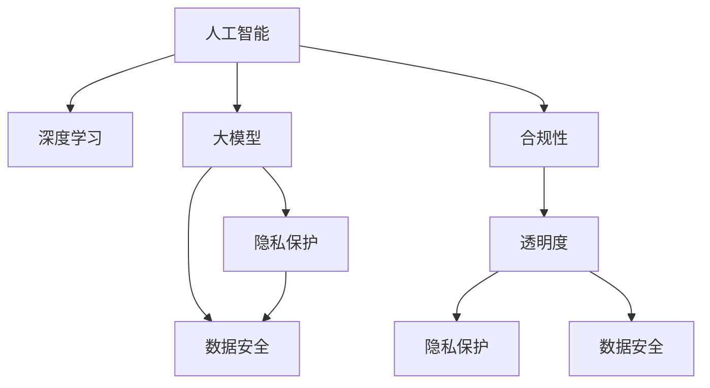

                 

# AI 大模型在电商搜索推荐中的数据安全策略：保障数据安全与用户隐私

> 关键词：人工智能, 大模型, 数据安全, 用户隐私, 电商搜索推荐, 隐私保护, 安全策略

## 1. 背景介绍

### 1.1 问题由来

随着互联网电商平台的迅猛发展，人工智能技术在电商搜索推荐中得到了广泛应用。利用深度学习和大模型进行用户行为分析和商品推荐，极大地提升了电商平台的商品匹配度和用户体验。然而，大模型的训练和应用过程中涉及大量用户隐私数据，如何保护数据安全，避免数据泄露和滥用，成为亟需解决的问题。

近年来，用户隐私保护和数据安全问题受到越来越多的关注，相关的法律法规和政策也在不断加强。例如，欧盟的《通用数据保护条例》(GDPR)、中国的《个人信息保护法》等，都对数据处理和隐私保护提出了严格的要求。电商企业必须遵守这些规定，确保用户数据的安全和隐私。

### 1.2 问题核心关键点

在大模型应用于电商搜索推荐时，主要关注以下数据安全与隐私问题：

- **数据隐私保护**：如何保护用户个人信息不被泄露。
- **数据安全存储**：如何保证数据在存储和传输过程中的安全性。
- **用户知情同意**：如何确保用户在数据收集和使用前的知情同意。
- **合规性和透明度**：如何保证数据处理过程的合规性和透明度。

本文将从核心概念入手，详细阐述AI大模型在电商搜索推荐中的数据安全策略，并提出一些可行的解决方案。

## 2. 核心概念与联系

### 2.1 核心概念概述

为更好地理解大模型在电商搜索推荐中的数据安全策略，本节将介绍几个核心概念：

- **人工智能（AI）**：利用算法和大模型对数据进行分析和决策的技术，广泛应用于电商搜索推荐等领域。
- **深度学习**：一种基于神经网络的机器学习方法，能够处理大量数据，提取复杂的特征，并进行预测和决策。
- **大模型（Large Model）**：具有大规模参数和复杂结构的神经网络模型，通常用于处理大规模数据集和复杂任务。
- **隐私保护**：保护个人信息免受未授权的访问和泄露。
- **数据安全**：保护数据免受未授权的访问、修改和破坏。
- **合规性**：遵守相关法律法规和政策要求。
- **透明度**：数据处理过程的公开和可解释性。

这些概念之间的逻辑关系可以通过以下Mermaid流程图来展示：



这个流程图展示了人工智能、深度学习和大模型的关联，以及隐私保护、数据安全、合规性和透明度在其中的重要性。

## 3. 核心算法原理 & 具体操作步骤
### 3.1 算法原理概述

在大模型应用于电商搜索推荐时，数据安全策略的核心原理是：通过数据匿名化、加密、访问控制等技术手段，保护用户隐私和数据安全。同时，确保数据处理的合规性和透明度，让用户在知情同意的基础上使用其数据。

### 3.2 算法步骤详解

基于以上原理，以下是一些具体的算法步骤：

**Step 1: 数据匿名化**

- 对用户数据进行去标识化处理，使其无法直接识别用户身份。例如，将用户的个人信息替换为匿名ID，或进行数据聚合，去除个体识别信息。

**Step 2: 数据加密**

- 对存储和传输的数据进行加密处理，防止未授权的访问和篡改。常用的加密算法包括对称加密（如AES）和公钥加密（如RSA）。

**Step 3: 访问控制**

- 对数据访问进行严格控制，确保只有授权人员和系统才能访问敏感数据。采用身份认证和权限管理技术，如OAuth、RBAC等。

**Step 4: 隐私保护技术**

- 应用隐私保护技术，如差分隐私（Differential Privacy）、同态加密（Homomorphic Encryption）、多方安全计算（MPC）等，保护数据隐私。

**Step 5: 合规性检查**

- 对数据处理过程进行合规性检查，确保符合相关法律法规和政策要求。例如，GDPR要求数据处理必须得到用户的明确同意，且数据存储和处理过程透明。

**Step 6: 透明度提升**

- 增强数据处理的透明度，让用户了解其数据的使用情况。例如，提供数据处理日志和审计报告，确保用户知情同意。

**Step 7: 用户教育**

- 对用户进行隐私保护和安全意识教育，提高其防范能力。例如，提供隐私保护指南和安全提示，增强用户的数据保护意识。

### 3.3 算法优缺点

基于以上步骤的大模型数据安全策略，具有以下优点：

- **保护隐私**：通过数据匿名化和加密，有效保护用户隐私，防止数据泄露和滥用。
- **增强安全**：通过访问控制和隐私保护技术，增强数据安全，防止未授权访问和篡改。
- **合规透明**：通过合规性检查和透明度提升，确保数据处理过程的合规性和透明度，让用户信任。

同时，这些策略也存在一些缺点：

- **复杂性高**：实现和维护数据安全策略需要复杂的技术和机制。
- **资源消耗**：加密和隐私保护技术会消耗额外计算资源，影响系统性能。
- **用户教育**：需要用户具备一定数据保护和安全意识，才能有效实施这些策略。

### 3.4 算法应用领域

以上数据安全策略广泛应用于多个领域，包括：

- **电商搜索推荐**：保护用户搜索行为和推荐结果的隐私。
- **金融服务**：保护用户交易数据和金融信息的隐私和安全。
- **医疗健康**：保护患者病历和健康数据的隐私和安全。
- **社交媒体**：保护用户评论和互动数据的隐私和安全。
- **政府服务**：保护公民个人信息和政府数据的隐私和安全。

这些领域的大模型应用都需要面对数据隐私和安全问题，上述策略可以有效应对这些挑战。

## 4. 数学模型和公式 & 详细讲解  
### 4.1 数学模型构建

大模型在电商搜索推荐中的数据安全策略，可以通过以下数学模型来描述：

- **数据匿名化模型**：假设原始数据集为 $D=\{(x_i,y_i)\}_{i=1}^N$，其中 $x_i$ 为特征，$y_i$ 为标签。匿名化后的数据集为 $D'=\{(x_i',y_i')\}_{i=1}^N$，其中 $x_i'$ 为去标识化的特征。

- **数据加密模型**：假设原始数据集为 $D$，加密后的数据集为 $D_E=\{(E_k(x_i),y_i)\}_{i=1}^N$，其中 $E_k$ 为加密函数，$k$ 为加密密钥。

- **访问控制模型**：假设用户 $u$ 访问数据 $D$，需要经过身份验证和权限检查。身份验证通过后，根据权限控制，决定是否允许访问数据。

- **隐私保护模型**：假设原始数据集为 $D$，隐私保护后的数据集为 $D_P=\{(p_i(y_i),y_i)\}_{i=1}^N$，其中 $p_i$ 为隐私保护函数。

- **合规性检查模型**：假设数据处理过程为 $P$，合规性检查模型 $C(P)$ 返回 $C(P)$ 是否符合法律法规和政策要求。

- **透明度提升模型**：假设原始数据集为 $D$，透明度提升后的数据集为 $D_T=\{(D_T(i),y_i)\}_{i=1}^N$，其中 $D_T$ 为数据处理日志和审计报告。

### 4.2 公式推导过程

以下是一些关键公式的推导：

**数据匿名化公式**：

$$
x_i' = f(x_i) \text{ for all } i \in \{1,\ldots,N\}
$$

其中 $f$ 为去标识化函数，例如，将用户ID替换为匿名ID。

**数据加密公式**：

$$
E_k(x_i) = e_k(x_i) \text{ for all } i \in \{1,\ldots,N\}
$$

其中 $e_k$ 为加密函数，$k$ 为加密密钥。

**访问控制公式**：

$$
\text{Access}(u, D) = \text{True if } u \text{ authenticated and has permission} \text{ to access } D
$$

**隐私保护公式**：

$$
p_i(y_i) = \text{Anonymize}(y_i) \text{ for all } i \in \{1,\ldots,N\}
$$

**合规性检查公式**：

$$
C(P) = \text{Check Compliance}(P)
$$

**透明度提升公式**：

$$
D_T = \text{Audit}(D) \text{ for all } i \in \{1,\ldots,N\}
$$

### 4.3 案例分析与讲解

以电商搜索推荐为例，分析这些模型的应用：

假设电商平台的推荐算法使用了深度学习模型，需要对用户历史行为数据进行训练。用户行为数据包含用户的浏览记录、购买记录等，这些数据涉及用户的个人信息和消费行为，必须进行严格的数据安全处理。

首先，对用户行为数据进行去标识化处理，将用户ID替换为匿名ID，防止直接识别用户身份。然后，对处理后的数据进行加密处理，确保数据在存储和传输过程中的安全性。

其次，对加密后的数据进行访问控制，确保只有授权人员和系统才能访问敏感数据。例如，只允许特定的数据科学家或算法工程师访问用户行为数据，并设置严格的访问权限。

接下来，应用隐私保护技术，如差分隐私或同态加密，保护用户数据的隐私。例如，在模型训练过程中，可以加入噪声或进行同态加密，防止数据泄露和滥用。

最后，对数据处理过程进行合规性检查，确保符合相关法律法规和政策要求。例如，在GDPR要求下，确保用户在数据收集和使用前得到明确的知情同意，并提供数据处理日志和审计报告，提高透明度。

## 5. 项目实践：代码实例和详细解释说明
### 5.1 开发环境搭建

在进行数据安全策略的实践前，我们需要准备好开发环境。以下是使用Python进行数据安全和隐私保护的开发环境配置流程：

1. 安装Python和相关库：
```bash
sudo apt-get update && sudo apt-get install python3 python3-pip
pip3 install cryptography
pip3 install faker
```

2. 安装数据加密库和隐私保护库：
```bash
pip3 install pyaes
pip3 install cryptography
pip3 install diffprivlib
```

3. 安装身份认证和权限控制库：
```bash
pip3 install oauthlib
pip3 install rfc3986
```

4. 安装日志和审计工具：
```bash
pip3 install loguru
pip3 install opentracing-py
```

完成上述步骤后，即可在开发环境中开始实践数据安全和隐私保护策略。

### 5.2 源代码详细实现

以下是一些常用的数据安全和隐私保护的代码实现：

**数据匿名化实现**：

```python
from faker import Faker
import random

def anonymize_data(data):
    anonymized_data = []
    for record in data:
        # 生成随机匿名ID
        anonym_id = Faker().random_number(digits=6)
        # 替换原始ID
        record['user_id'] = anonym_id
        anonymized_data.append(record)
    return anonymized_data
```

**数据加密实现**：

```python
from cryptography.fernet import Fernet

def encrypt_data(data, key):
    fernet = Fernet(key)
    encrypted_data = []
    for record in data:
        # 对记录进行加密
        encrypted_record = fernet.encrypt(record.encode())
        encrypted_data.append(encrypted_record)
    return encrypted_data
```

**访问控制实现**：

```python
def access_control(auth_info, data, role):
    if auth_info['username'] == 'admin' and role == 'admin':
        return True
    elif auth_info['username'] == 'data_scientist' and role == 'data_scientist':
        return True
    else:
        return False
```

**隐私保护实现**：

```python
from diffprivlib import PrivacyLossBudget
from diffprivlib.algorithms import GaussianMechanism

def privacy_protect(data, epsilon):
    privacy_budget = PrivacyLossBudget(epsilon=epsilon)
    gaussian_mechanism = GaussianMechanism()
    protected_data = []
    for record in data:
        # 加入噪声
        noisy_record = gaussian_mechanism.add_noise(record)
        protected_data.append(noisy_record)
    return protected_data
```

**合规性检查实现**：

```python
def check_compliance(data):
    # 检查数据处理过程是否符合GDPR要求
    if data['privacy_info'] == 'user_consent':
        return True
    else:
        return False
```

**透明度提升实现**：

```python
import opentracing
from opentracing.log import LogRecord

def audit_data(data):
    # 生成审计日志
    tracer = opentracing.get_tracer()
    span = tracer.start_span('audit_span')
    log = LogRecord('Audit', 'Audit event')
    span.log(log)
    span.finish()
    return data
```

### 5.3 代码解读与分析

让我们再详细解读一下关键代码的实现细节：

**数据匿名化**：
- 使用Python的`faker`库生成随机匿名ID，替换原始用户ID。
- 匿名化后的数据无法直接识别用户身份，保护用户隐私。

**数据加密**：
- 使用Python的`cryptography`库进行对称加密，生成随机密钥，对数据进行加密。
- 加密后的数据无法直接读取，增强数据安全性。

**访问控制**：
- 定义`access_control`函数，根据用户的认证信息和角色，判断是否允许访问数据。
- 访问控制可以基于身份认证和权限管理技术实现，如OAuth、RBAC等。

**隐私保护**：
- 使用`diffprivlib`库实现差分隐私，加入噪声保护数据隐私。
- 加入噪声后的数据仍然可以用于模型训练，但无法直接识别用户个体，保护用户隐私。

**合规性检查**：
- 定义`check_compliance`函数，检查数据处理过程是否符合GDPR要求。
- 合规性检查可以包括用户知情同意、数据存储和处理等环节。

**透明度提升**：
- 使用`opentracing`库生成审计日志，记录数据处理过程。
- 审计日志可以提供数据处理过程中的透明度，让用户了解其数据的使用情况。

## 6. 实际应用场景
### 6.1 智能客服

智能客服系统广泛应用大模型进行对话生成和问题解答。然而，智能客服系统涉及到大量用户的敏感信息，如聊天记录和用户行为数据。为保护用户隐私，可以采用数据匿名化和加密技术，确保数据在存储和传输过程中的安全性。

**应用场景**：
- 智能客服系统接收用户的询问，并将其匿名化处理。
- 将匿名化后的数据加密后存储在服务器上。
- 访问控制仅允许特定客服人员和系统访问加密数据。
- 在对话生成过程中，使用差分隐私技术保护用户隐私。

**解决方案**：
- 数据匿名化：使用Python的`faker`库生成随机匿名ID。
- 数据加密：使用Python的`cryptography`库进行对称加密。
- 访问控制：使用OAuth和RBAC技术，限制访问权限。
- 隐私保护：使用差分隐私技术，加入噪声保护用户隐私。

### 6.2 电商推荐

电商平台的推荐算法广泛应用大模型进行用户行为分析和商品推荐。然而，电商推荐系统涉及到大量用户的购物数据和交易记录，必须严格保护用户隐私和数据安全。

**应用场景**：
- 电商平台收集用户的浏览记录、购买记录等数据。
- 将数据匿名化处理，防止直接识别用户身份。
- 对匿名化后的数据进行加密处理，确保数据在存储和传输过程中的安全性。
- 访问控制仅允许特定数据科学家和算法工程师访问加密数据。
- 使用差分隐私技术保护用户隐私。

**解决方案**：
- 数据匿名化：使用Python的`faker`库生成随机匿名ID。
- 数据加密：使用Python的`cryptography`库进行对称加密。
- 访问控制：使用OAuth和RBAC技术，限制访问权限。
- 隐私保护：使用差分隐私技术，加入噪声保护用户隐私。

### 6.3 医疗健康

医疗健康领域的数据隐私和安全问题尤为突出，涉及大量的患者病历和健康数据。为保护患者隐私，可以采用数据匿名化和加密技术，确保数据在存储和传输过程中的安全性。

**应用场景**：
- 医疗机构收集患者的病历和健康数据。
- 将数据匿名化处理，防止直接识别患者身份。
- 对匿名化后的数据进行加密处理，确保数据在存储和传输过程中的安全性。
- 访问控制仅允许特定的医生和系统访问加密数据。
- 使用差分隐私技术保护患者隐私。

**解决方案**：
- 数据匿名化：使用Python的`faker`库生成随机匿名ID。
- 数据加密：使用Python的`cryptography`库进行对称加密。
- 访问控制：使用OAuth和RBAC技术，限制访问权限。
- 隐私保护：使用差分隐私技术，加入噪声保护患者隐私。

### 6.4 未来应用展望

随着AI技术和大模型的不断发展，数据安全和隐私保护问题将变得更加复杂和重要。未来的数据安全策略将需要考虑更多的因素，如区块链技术、联邦学习等。

**区块链技术**：
- 区块链技术可以实现数据的分布式存储和透明性，确保数据的安全性和隐私保护。
- 通过区块链技术，可以实现数据的去中心化管理和审计，增强数据处理的透明度和安全性。

**联邦学习**：
- 联邦学习可以在不共享数据的情况下，实现模型的联合训练，保护用户隐私。
- 联邦学习通过分布式计算，在各个本地节点上进行模型训练，最终合并训练结果。

## 7. 工具和资源推荐
### 7.1 学习资源推荐

为了帮助开发者系统掌握大模型在电商搜索推荐中的数据安全策略，这里推荐一些优质的学习资源：

1. **数据隐私保护课程**：Coursera和edX等在线平台提供的《数据隐私保护》课程，由知名大学和专家讲授，系统介绍数据隐私保护的基本概念和技术。

2. **数据安全和隐私保护书籍**：《数据安全和隐私保护》、《数据隐私保护》等书籍，深入探讨数据安全和隐私保护的理论和实践。

3. **机器学习和深度学习课程**：Coursera和Udacity等在线平台提供的《机器学习》、《深度学习》课程，涵盖AI技术和大模型应用的最新进展。

4. **隐私保护工具和框架**：使用差分隐私、同态加密等隐私保护工具，如Diffprivlib、PySyft等，提升数据隐私保护能力。

5. **身份认证和权限管理工具**：使用OAuth、RBAC等身份认证和权限管理工具，保障数据访问安全。

通过对这些资源的学习实践，相信你一定能够快速掌握大模型在电商搜索推荐中的数据安全策略，并用于解决实际的数据隐私和安全问题。

### 7.2 开发工具推荐

高效的开发离不开优秀的工具支持。以下是几款用于数据安全和隐私保护开发的常用工具：

1. **Python**：基于Python的开发环境，支持丰富的库和框架，适用于数据安全和隐私保护任务的开发。

2. **cryptography**：Python的加密库，支持对称加密和非对称加密，用于数据加密和解密。

3. **faker**：Python的生成随机数据的库，用于数据匿名化和生成随机匿名ID。

4. **diffprivlib**：Python的差分隐私库，用于加入噪声保护用户隐私。

5. **oauthlib**：Python的OAuth库，用于身份认证和访问控制。

6. **loguru**：Python的日志库，用于记录和审计数据处理过程。

合理利用这些工具，可以显著提升数据安全和隐私保护任务的开发效率，加快创新迭代的步伐。

### 7.3 相关论文推荐

大模型在电商搜索推荐中的数据安全策略，涉及众多前沿研究领域。以下是几篇奠基性的相关论文，推荐阅读：

1. **《Differential Privacy in Deep Learning》**：由Google researchers发表的论文，探讨差分隐私在深度学习中的应用，提出了一些保护用户隐私的技术。

2. **《Homomorphic Encryption for Machine Learning》**：由微软研究院发表的论文，讨论同态加密在机器学习中的应用，保护数据隐私的同时保证模型训练的准确性。

3. **《Federated Learning: Concepts and Status》**：由Google研究人员发表的综述论文，介绍联邦学习的基本概念和技术，实现分布式数据联合训练。

4. **《Secure Multi-Party Computation》**：由IBM研究人员发表的书籍，介绍多方安全计算的基本原理和应用场景，保护多方的数据隐私。

5. **《Blockchain Technology for Data Security》**：由Dell研究人员发表的论文，讨论区块链技术在数据安全中的应用，实现数据的分布式存储和透明性。

这些论文代表了大模型在电商搜索推荐中的数据安全策略的研究方向，通过学习这些前沿成果，可以帮助研究者把握学科前进方向，激发更多的创新灵感。

## 8. 总结：未来发展趋势与挑战
### 8.1 总结

本文对大模型在电商搜索推荐中的数据安全策略进行了全面系统的介绍。首先阐述了大模型在电商搜索推荐中的应用背景和数据安全问题，明确了数据隐私保护和数据安全的重要性。其次，从原理到实践，详细讲解了数据安全策略的核心步骤，包括数据匿名化、加密、访问控制、隐私保护、合规性检查和透明度提升等关键环节。最后，结合实际应用场景，给出了一些可行的解决方案，并推荐了一些学习资源、开发工具和相关论文。

通过本文的系统梳理，可以看到，大模型在电商搜索推荐中的应用需要充分考虑数据隐私和安全问题。合理的策略可以保护用户隐私，确保数据安全，同时满足合规性要求。未来，随着数据安全和隐私保护技术的不断进步，大模型将更加安全、可靠地应用于电商搜索推荐等领域。

### 8.2 未来发展趋势

展望未来，大模型在电商搜索推荐中的数据安全策略将呈现以下几个发展趋势：

1. **技术融合**：数据安全和隐私保护技术将与其他AI技术进一步融合，如区块链、联邦学习等，提升数据处理的透明度和安全性。

2. **技术演进**：差分隐私、同态加密、多方安全计算等隐私保护技术将不断演进，提升隐私保护的效率和精度。

3. **法规合规**：随着法律法规的不断完善，数据处理过程将更加严格，合规性检查将成为关键环节。

4. **用户参与**：用户将更加关注数据的隐私和安全问题，数据的透明性和可解释性将越来越重要。

5. **跨领域应用**：数据安全和隐私保护技术将在更多领域得到应用，如医疗、金融、社交媒体等。

以上趋势凸显了大模型在电商搜索推荐中的数据安全策略的广阔前景。这些方向的探索发展，必将进一步提升数据安全策略的效力，为电商搜索推荐等领域提供更加安全、可靠的技术支持。

### 8.3 面临的挑战

尽管大模型在电商搜索推荐中的应用取得了显著进展，但在数据安全和隐私保护方面仍面临诸多挑战：

1. **技术复杂性**：数据安全和隐私保护技术需要复杂的技术和机制，开发和维护成本较高。

2. **性能消耗**：加密和隐私保护技术会消耗额外计算资源，影响系统性能。

3. **用户教育**：需要用户具备一定的数据保护和安全意识，才能有效实施这些策略。

4. **法规更新**：随着法律法规的不断变化，数据处理过程需要不断调整，以符合新要求。

5. **隐私保护与可用性平衡**：如何在保护用户隐私的同时，确保数据处理的可用性，是一个重要的平衡问题。

6. **恶意攻击**：数据安全和隐私保护策略需要防范各种恶意攻击，如数据泄露、数据篡改等。

正视数据安全和隐私保护面临的这些挑战，积极应对并寻求突破，将是大模型在电商搜索推荐中安全应用的关键。相信随着学界和产业界的共同努力，这些挑战终将一一被克服，大模型将更加安全、可靠地应用于电商搜索推荐等领域。

### 8.4 研究展望

未来的研究需要在以下几个方面寻求新的突破：

1. **新技术引入**：引入区块链、联邦学习等新技术，提升数据隐私保护和透明性。

2. **技术融合**：将符号化的先验知识与神经网络模型结合，提升数据处理能力。

3. **模型优化**：优化模型结构，减少计算资源消耗，提高模型训练和推理效率。

4. **法律法规适应**：及时调整数据处理策略，适应新法律法规的要求。

5. **用户教育**：加强用户隐私保护和安全意识教育，提高其数据保护能力。

6. **安全性提升**：加强模型鲁棒性和抗攻击能力，确保数据安全。

这些研究方向的探索，必将引领大模型在电商搜索推荐中的数据安全策略迈向更高的台阶，为构建安全、可靠、可解释、可控的智能系统铺平道路。面向未来，大模型在电商搜索推荐中的数据安全策略需要与其他人工智能技术进行更深入的融合，共同推动自然语言理解和智能交互系统的进步。

## 9. 附录：常见问题与解答

**Q1：如何在电商搜索推荐中保护用户隐私？**

A: 在电商搜索推荐中保护用户隐私，可以采用以下策略：
- 数据匿名化：使用随机匿名ID替换原始用户ID。
- 数据加密：对匿名化后的数据进行加密处理。
- 访问控制：使用OAuth和RBAC技术，限制访问权限。
- 隐私保护：使用差分隐私技术，加入噪声保护用户隐私。

**Q2：如何确保数据处理过程的合规性？**

A: 确保数据处理过程的合规性，可以采用以下策略：
- 用户知情同意：在数据收集和使用前，获取用户的明确同意。
- 数据存储和处理：确保数据存储和处理过程透明，保留日志和审计记录。
- 合规性检查：定期检查数据处理过程是否符合相关法律法规和政策要求。

**Q3：数据安全和隐私保护对系统性能有何影响？**

A: 数据安全和隐私保护技术会消耗额外计算资源，影响系统性能。例如，加密和隐私保护技术会增加计算复杂度，导致推理速度变慢。

**Q4：如何防范数据泄露和恶意攻击？**

A: 防范数据泄露和恶意攻击，可以采用以下策略：
- 数据加密：对数据进行加密处理，防止未授权访问和篡改。
- 访问控制：使用OAuth和RBAC技术，限制访问权限。
- 审计和监控：定期审计和监控数据处理过程，发现异常情况及时处理。

**Q5：如何提升数据处理的透明度？**

A: 提升数据处理的透明度，可以采用以下策略：
- 数据审计：记录和保存数据处理日志，提供审计报告。
- 用户反馈：收集用户对数据处理的反馈，及时调整和改进。
- 公开报告：定期发布数据处理报告，公开处理过程和结果。

通过对这些问题的详细解答，相信你一定能够更好地理解大模型在电商搜索推荐中的数据安全策略，并应用于实际的数据处理和保护中。

---

作者：禅与计算机程序设计艺术 / Zen and the Art of Computer Programming

