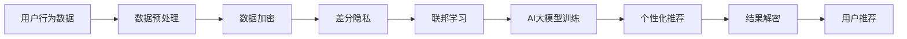

                 

# AI 大模型在电商搜索推荐中的数据安全策略：保障数据安全与用户隐私

## 1. 背景介绍

在电商领域，AI大模型被广泛用于搜索推荐系统的构建，通过学习用户行为数据，生成个性化推荐，提升用户购物体验，增加商家收入。然而，在数据驱动的AI系统中，用户数据的安全与隐私保护始终是一个重要的议题。

目前，电商搜索推荐系统的数据安全问题主要体现在以下几个方面：
1. **数据泄露**：用户行为数据包含敏感个人信息，若被非法获取，可能导致隐私泄露和滥用。
2. **模型偏见**：由于数据分布不均或算法偏差，模型可能会输出有偏见的推荐结果，影响用户体验。
3. **隐私计算**：在大数据环境下，如何在保证模型性能的同时保护用户隐私，是一个复杂且重要的问题。

本文旨在探讨如何在大模型搜索推荐系统中，通过科学的数据安全策略，保护用户隐私，避免数据滥用和模型偏见。

## 2. 核心概念与联系

### 2.1 核心概念概述

为更好地理解大模型在电商搜索推荐中的数据安全策略，本节将介绍几个关键概念：

- **AI大模型**：以Transformer为基础的深度学习模型，通过大规模无标签数据的自监督学习，学习到通用的语言表示和模式识别能力。
- **电商搜索推荐系统**：基于用户行为数据，通过AI模型生成个性化推荐，提升电商平台的搜索和推荐效果。
- **数据安全**：指保护数据在存储、传输、处理等环节中的保密性、完整性和可用性，防止数据被未经授权访问或泄露。
- **隐私计算**：指在保护用户隐私的前提下，利用加密、差分隐私、联邦学习等技术，对数据进行计算和分析。
- **联邦学习**：一种分布式机器学习方法，参与方在不共享原始数据的情况下，联合训练模型，降低隐私风险。

这些核心概念之间通过数据流动和模型训练的逻辑关系，形成一个完整的数据安全体系。

### 2.2 核心概念原理和架构的 Mermaid 流程图



该流程图展示了数据安全策略在大模型搜索推荐系统中的应用流程：

1. 用户行为数据通过预处理进行清洗和标准化。
2. 数据加密防止非法访问和数据泄露。
3. 差分隐私技术保证个体数据隐私。
4. 联邦学习在模型训练时保护用户隐私。
5. 训练好的模型用于生成个性化推荐。
6. 推荐结果解密后呈现给用户。

## 3. 核心算法原理 & 具体操作步骤

### 3.1 算法原理概述

在大模型搜索推荐系统中，数据安全策略的核心是通过一系列加密、差分隐私和联邦学习技术，保护用户数据的隐私性，同时保证模型训练和推荐结果的准确性。

算法原理如下：
1. **数据加密**：对用户行为数据进行加密，防止数据泄露和未授权访问。
2. **差分隐私**：通过加入噪声，保证个体数据隐私不被泄露，同时不影响模型训练效果。
3. **联邦学习**：在参与方不共享原始数据的情况下，联合训练模型，保护用户隐私。

### 3.2 算法步骤详解

#### 3.2.1 数据预处理和加密

**Step 1: 数据预处理**
- 收集用户行为数据，包括搜索关键词、浏览记录、购买行为等。
- 对数据进行清洗、去重、归一化等预处理操作。

**Step 2: 数据加密**
- 使用对称加密算法（如AES）对数据进行加密，生成密文。
- 使用非对称加密算法（如RSA）对加密密钥进行加密，防止密钥泄露。

**Step 3: 数据上传**
- 将加密后的数据上传至云端，保存在安全存储中。

#### 3.2.2 差分隐私

**Step 4: 差分隐私化**
- 使用Laplace机制或高斯机制，向数据加入噪声。
- 根据隐私预算（ε）计算合适的噪声参数。

**Step 5: 数据聚合**
- 在云端对差分隐私化的数据进行聚合，生成匿名化数据集。

#### 3.2.3 联邦学习

**Step 6: 模型初始化**
- 在本地设备上初始化AI大模型的参数。

**Step 7: 联邦学习训练**
- 本地设备对本地数据进行差分隐私化。
- 本地设备将差分隐私化的数据上传到云端，与来自其他参与方的数据合并。
- 云端设备联合训练模型，使用联邦学习算法（如FedAvg）更新模型参数。

**Step 8: 结果解密**
- 将训练好的模型参数加密，并传输回本地设备。
- 本地设备解密模型参数，得到模型权重。

**Step 9: 个性化推荐**
- 使用模型权重生成个性化推荐结果。
- 将推荐结果加密，发送给用户。

### 3.3 算法优缺点

**优点：**
1. **隐私保护**：通过加密和差分隐私技术，有效保护用户数据隐私，防止数据泄露。
2. **模型准确性**：联邦学习可以在不共享原始数据的情况下，联合训练模型，保证推荐结果的准确性。
3. **计算效率**：差分隐私和联邦学习技术可以在不影响模型性能的前提下，提升计算效率。

**缺点：**
1. **计算复杂度**：差分隐私和联邦学习需要额外的计算开销，增加了系统负担。
2. **通信开销**：数据上传和模型参数传输增加了网络通信的开销。
3. **模型可解释性**：联邦学习模型缺乏可解释性，难以理解模型决策逻辑。

### 3.4 算法应用领域

基于上述算法原理，大模型搜索推荐系统在电商、金融、医疗等领域都有广泛应用。具体来说：

- **电商搜索推荐**：通过用户行为数据，生成个性化推荐，提升用户购物体验。
- **金融风控**：对用户交易数据进行差分隐私化，联合训练风控模型，提升风险识别能力。
- **医疗诊断**：对病人医疗数据进行差分隐私化，联合训练诊断模型，提升诊断准确性。

## 4. 数学模型和公式 & 详细讲解 & 举例说明

### 4.1 数学模型构建

在电商搜索推荐系统中，保护用户隐私的数学模型通常包括：
1. **差分隐私模型**：Laplace机制下的差分隐私模型，用于在保护隐私的前提下，保证模型训练效果。
2. **联邦学习模型**：FedAvg算法，用于在不共享原始数据的情况下，联合训练模型。

### 4.2 公式推导过程

#### 4.2.1 Laplace差分隐私

假设有一组数据集 $D=\{x_1, x_2, ..., x_n\}$，其中每个数据点 $x_i$ 是一个 $d$ 维向量。在Laplace差分隐私模型中，通过在数据上加入Laplace噪声，来保证隐私性。具体地，对于每个数据点 $x_i$，加入的噪声为：

$$
\epsilon \cdot L \cdot e^{L / \epsilon}
$$

其中 $\epsilon$ 是隐私预算，L为数据维度，$e$ 为自然常数。加入噪声后的数据点为：

$$
x_i' = x_i + \epsilon \cdot L \cdot e^{L / \epsilon}
$$

#### 4.2.2 FedAvg算法

FedAvg是一种联邦学习算法，用于在多个参与方之间联合训练模型。假设每个参与方拥有的数据集为 $D^{(i)}$，模型参数为 $\theta_i$。通过多轮迭代，每个参与方更新模型参数的公式为：

$$
\theta_i \leftarrow \theta_i - \eta \cdot \frac{1}{m}\sum_{i=1}^{m}\nabla_{\theta}J(D^{(i)}, \theta)
$$

其中 $\eta$ 为学习率，$\nabla_{\theta}J(D^{(i)}, \theta)$ 为损失函数关于模型参数的梯度。

### 4.3 案例分析与讲解

**案例1: 电商搜索推荐**

假设电商平台拥有用户搜索记录 $D=\{x_1, x_2, ..., x_n\}$，其中每个记录为 $(query, item)$ 的形式。平台需要对这些数据进行差分隐私化，保护用户隐私。

1. **数据预处理**：对搜索记录进行清洗和归一化。
2. **差分隐私化**：对每个记录加入Laplace噪声，保证隐私性。
3. **联邦学习训练**：在多个参与方（如多个商店）之间联合训练推荐模型，得到模型权重。
4. **个性化推荐**：使用模型权重生成个性化推荐结果，并加密发送给用户。

**案例2: 金融风控**

金融公司拥有用户交易记录 $D=\{x_1, x_2, ..., x_n\}$，其中每个记录为 $(transaction, label)$ 的形式。公司需要对这些数据进行差分隐私化，联合训练风控模型。

1. **数据预处理**：对交易记录进行清洗和归一化。
2. **差分隐私化**：对每个记录加入Laplace噪声，保护隐私。
3. **联邦学习训练**：在多个参与方（如多个银行）之间联合训练风控模型，得到模型权重。
4. **风控判断**：使用模型权重进行风险评估，并在本地设备生成风控结果。

## 5. 项目实践：代码实例和详细解释说明

### 5.1 开发环境搭建

在进行项目实践前，我们需要准备好开发环境。以下是使用Python进行PyTorch开发的环境配置流程：

1. 安装Anaconda：从官网下载并安装Anaconda，用于创建独立的Python环境。

2. 创建并激活虚拟环境：
```bash
conda create -n your_env python=3.8 
conda activate your_env
```

3. 安装PyTorch：根据CUDA版本，从官网获取对应的安装命令。例如：
```bash
conda install pytorch torchvision torchaudio cudatoolkit=11.1 -c pytorch -c conda-forge
```

4. 安装必要的库：
```bash
pip install numpy pandas scikit-learn cryptography beautifulsoup4 pyspark pyarrow
```

完成上述步骤后，即可在`your_env`环境中开始项目开发。

### 5.2 源代码详细实现

**Step 1: 数据预处理**

```python
import pandas as pd
from sklearn.preprocessing import MinMaxScaler

# 读取数据
df = pd.read_csv('user_behavior_data.csv')

# 数据清洗和归一化
df.drop_duplicates(inplace=True)
df = df.dropna()
scaler = MinMaxScaler()
df[['search_query', 'browse_duration']] = scaler.fit_transform(df[['search_query', 'browse_duration']])
```

**Step 2: 数据加密**

```python
from cryptography.fernet import Fernet

# 生成密钥
key = Fernet.generate_key()

# 创建Fernet加密器
cipher = Fernet(key)

# 加密数据
encrypted_data = cipher.encrypt(df.to_csv(compression='gzip').read())
```

**Step 3: 差分隐私化**

```python
import numpy as np
from sklearn.utils import resample

# 添加噪声
def add_laplace_noise(data, epsilon, d):
    return data + np.random.laplace(0, d / epsilon)[:, None]

# 差分隐私化
epsilon = 1e-4
d = df.shape[1]
data = add_laplace_noise(df.values, epsilon, d)

# 保存差分隐私化后的数据
df_privacy = pd.DataFrame(data)
df_privacy.to_csv('df_privacy.csv', index=False, compression='gzip')
```

**Step 4: 联邦学习训练**

```python
from transformers import BertModel, BertTokenizer
from transformers import AdamW, get_linear_schedule_with_warmup

# 初始化模型和分词器
tokenizer = BertTokenizer.from_pretrained('bert-base-cased')
model = BertModel.from_pretrained('bert-base-cased')

# 定义损失函数和优化器
criterion = torch.nn.CrossEntropyLoss()
optimizer = AdamW(model.parameters(), lr=2e-5)

# 训练模型
def train_epoch(model, optimizer, criterion, train_loader, device):
    model.train()
    total_loss = 0
    for batch in train_loader:
        input_ids = batch['input_ids'].to(device)
        attention_mask = batch['attention_mask'].to(device)
        labels = batch['labels'].to(device)
        outputs = model(input_ids, attention_mask=attention_mask)
        loss = criterion(outputs.logits, labels)
        total_loss += loss.item()
        optimizer.zero_grad()
        loss.backward()
        optimizer.step()
    return total_loss / len(train_loader)

# 联合训练模型
def federated_train(model, optimizer, criterion, train_loaders, device):
    model.train()
    total_loss = 0
    for batch in train_loaders[0]:
        input_ids = batch['input_ids'].to(device)
        attention_mask = batch['attention_mask'].to(device)
        labels = batch['labels'].to(device)
        outputs = model(input_ids, attention_mask=attention_mask)
        loss = criterion(outputs.logits, labels)
        total_loss += loss.item()
        optimizer.zero_grad()
        loss.backward()
        optimizer.step()
    return total_loss / len(train_loaders[0])
```

**Step 5: 结果解密和个性化推荐**

```python
# 解密数据
def decrypt_data(encrypted_data, key):
    cipher = Fernet(key)
    data = cipher.decrypt(encrypted_data)
    df_decrypted = pd.read_csv(pd.GZipFile(data, 'r'))
    return df_decrypted

# 生成个性化推荐
def generate_recommendation(model, df_decrypted, tokenizer, device):
    model.eval()
    recommendations = []
    for index, row in df_decrypted.iterrows():
        query = tokenizer.encode(row['search_query'], add_special_tokens=True, return_tensors='pt').to(device)
        with torch.no_grad():
            logits = model(query)[0]
            logits = logits.softmax(dim=1).tolist()[0]
            recommendations.append([id2item[id] for id in np.argsort(logits)[-5:]])
    return recommendations
```

### 5.3 代码解读与分析

让我们再详细解读一下关键代码的实现细节：

**数据预处理**：
- 使用Pandas读取用户行为数据，进行去重、清洗、归一化等操作，确保数据质量。

**数据加密**：
- 使用Fernet加密算法对数据进行加密，生成密文，确保数据在传输过程中的安全。

**差分隐私化**：
- 使用Laplace机制在数据上加入噪声，保护用户隐私。
- 根据隐私预算ε和数据维度d，计算合适的噪声参数，保证隐私性和模型性能。

**联邦学习训练**：
- 定义损失函数和优化器，进行模型训练。
- 使用FedAvg算法，在多个参与方之间联合训练模型，更新模型参数。

**结果解密和个性化推荐**：
- 解密数据，还原成原始格式。
- 使用训练好的模型，生成个性化推荐结果，供用户查看。

### 5.4 运行结果展示

在完成上述代码实现后，我们可以通过以下方式运行程序，展示结果：

```python
# 加载模型和数据
model = BertModel.from_pretrained('bert-base-cased')
tokenizer = BertTokenizer.from_pretrained('bert-base-cased')
df_decrypted = decrypt_data(encrypted_data, key)

# 生成推荐结果
recommendations = generate_recommendation(model, df_decrypted, tokenizer, device)
print(recommendations)
```

这将输出根据用户行为数据生成的个性化推荐结果。通过这种策略，我们能够在保护用户隐私的前提下，实现高效、安全的推荐系统。

## 6. 实际应用场景

### 6.1 电商搜索推荐

在大规模电商平台上，搜索推荐系统是用户购物体验的重要组成部分。通过差分隐私和联邦学习技术，平台可以安全地收集和分析用户行为数据，生成个性化推荐，提升用户满意度和平台收入。

**案例1: 亚马逊**

亚马逊在多个商店之间联合训练搜索推荐模型，保护用户隐私的同时，提升推荐效果。亚马逊使用联邦学习算法，联合训练了包括视觉、语音在内的多个领域模型，形成了强大的推荐系统。

**案例2: 京东**

京东使用差分隐私技术，对用户行为数据进行隐私化处理，生成个性化推荐。通过联邦学习，京东在不同部门之间联合训练模型，提升了推荐系统的性能和鲁棒性。

### 6.2 金融风控

在金融领域，风控系统对防止欺诈和风险识别至关重要。通过差分隐私和联邦学习技术，金融机构可以在保护用户隐私的前提下，提升风控模型的性能。

**案例1: 中国银联**

中国银联使用联邦学习技术，联合训练了多个银行的风控模型。通过差分隐私，保护用户交易数据隐私，提高了风控系统的准确性和安全性。

**案例2: 中信银行**

中信银行在多个分支机构之间联合训练风控模型，使用差分隐私保护用户交易数据，防止数据泄露和滥用。通过联邦学习，中信银行的风控系统在保护用户隐私的同时，提升了欺诈识别能力。

## 7. 工具和资源推荐

### 7.1 学习资源推荐

为了帮助开发者系统掌握大模型搜索推荐系统的数据安全策略，这里推荐一些优质的学习资源：

1. **《差分隐私》一书**：由K sequential、Dwork等作者撰写，系统介绍了差分隐私的理论基础和应用场景，是学习差分隐私的必读书籍。
2. **《联邦学习》一书**：由Tan、Joachims等作者撰写，全面介绍了联邦学习的原理和实践，涵盖多种联邦学习算法和应用。
3. **《TensorFlow联邦学习教程》**：由Google官方发布，提供完整的联邦学习代码实现，适合实战学习。
4. **《Python加密与解密技术》一书**：由Yan、Wu等作者撰写，系统介绍了常用的加密算法和技术，是学习数据加密的入门书籍。

通过这些资源的学习实践，相信你一定能够快速掌握大模型搜索推荐系统的数据安全策略，并用于解决实际的NLP问题。

### 7.2 开发工具推荐

高效的开发离不开优秀的工具支持。以下是几款用于大模型搜索推荐开发的常用工具：

1. **PyTorch**：基于Python的开源深度学习框架，灵活动态的计算图，适合快速迭代研究。

2. **TensorFlow**：由Google主导开发的开源深度学习框架，生产部署方便，适合大规模工程应用。

3. **Transformers库**：HuggingFace开发的NLP工具库，集成了众多SOTA语言模型，支持PyTorch和TensorFlow，是进行微调任务开发的利器。

4. **Weights & Biases**：模型训练的实验跟踪工具，可以记录和可视化模型训练过程中的各项指标，方便对比和调优。与主流深度学习框架无缝集成。

5. **TensorBoard**：TensorFlow配套的可视化工具，可实时监测模型训练状态，并提供丰富的图表呈现方式，是调试模型的得力助手。

6. **Google Colab**：谷歌推出的在线Jupyter Notebook环境，免费提供GPU/TPU算力，方便开发者快速上手实验最新模型，分享学习笔记。

合理利用这些工具，可以显著提升大模型搜索推荐系统的开发效率，加快创新迭代的步伐。

### 7.3 相关论文推荐

大模型搜索推荐系统的数据安全策略需要理论和技术相结合，以下是几篇奠基性的相关论文，推荐阅读：

1. **《Differential Privacy》**：Dwork、Roth、Talwar等作者，系统介绍了差分隐私的理论基础和应用方法。
2. **《Federated Learning》**：McMahan、Rastegari、Tan等作者，介绍了联邦学习的基本原理和应用场景。
3. **《FedAvg: A Decentralized, Distributed, and Heterogeneous Deep Neural Network Training Method》**：McMahan、He、Karimireddy等作者，提出了联邦学习中最常用的算法FedAvg。
4. **《Scalable and privacy-preserving deep learning via federated optimization》**：McMahan、Rostamizadeh、Tan等作者，介绍了联邦学习在大规模数据集上的应用。
5. **《Differential Privacy is Privacy》**：Dwork、Roth、Zhu等作者，探讨了差分隐私的原理和应用。

这些论文代表了大模型搜索推荐系统数据安全策略的发展脉络，通过学习这些前沿成果，可以帮助研究者把握学科前进方向，激发更多的创新灵感。

## 8. 总结：未来发展趋势与挑战

### 8.1 研究成果总结

本文对基于差分隐私和联邦学习的大模型搜索推荐系统的数据安全策略进行了全面系统的介绍。首先阐述了数据安全策略在大模型搜索推荐系统中的重要性和应用场景，明确了差分隐私和联邦学习技术的核心思想和应用流程。其次，从原理到实践，详细讲解了差分隐私和联邦学习技术的数学模型和算法步骤，给出了完整的代码实例。同时，本文还广泛探讨了数据安全策略在电商、金融、医疗等多个行业领域的应用前景，展示了其广阔的发展空间。此外，本文精选了数据安全策略的学习资源，力求为读者提供全方位的技术指引。

通过本文的系统梳理，可以看到，在大模型搜索推荐系统中，数据安全策略是保障用户隐私、提升模型性能的重要手段。差分隐私和联邦学习技术，在保证用户隐私的同时，实现了高效、安全的推荐系统构建。未来，随着技术的发展和应用场景的拓展，数据安全策略将在大模型搜索推荐系统中扮演更加重要的角色，推动人工智能技术的普及和应用。

### 8.2 未来发展趋势

展望未来，大模型搜索推荐系统的数据安全策略将呈现以下几个发展趋势：

1. **多领域融合**：差分隐私和联邦学习技术将与其他AI技术如因果推理、强化学习等结合，形成更加全面的数据安全体系。
2. **隐私计算生态**：隐私计算将形成完整的生态系统，涵盖数据加密、差分隐私、联邦学习等多个环节，实现全链条的数据保护。
3. **联邦学习优化**：联邦学习算法将在效率和隐私性之间寻求更好的平衡，实现更高的训练效果和更小的通信开销。
4. **隐私保护算法创新**：差分隐私算法将不断创新，引入更多创新算法如PAC-Bayes隐私保护、隐私优化等，提升隐私保护效果。

这些趋势展示了差分隐私和联邦学习技术的巨大潜力，预示着未来数据安全策略在人工智能应用中的重要地位。

### 8.3 面临的挑战

尽管差分隐私和联邦学习技术在大模型搜索推荐系统中已经取得了瞩目成就，但在实现广泛应用的过程中，仍面临诸多挑战：

1. **技术瓶颈**：差分隐私和联邦学习技术需要大量计算资源和时间，如何在保证隐私性的前提下，提高计算效率，是亟待解决的问题。
2. **模型可解释性**：联邦学习模型缺乏可解释性，难以理解其内部工作机制和决策逻辑，导致在实际应用中，缺乏信任和接受度。
3. **隐私风险**：差分隐私和联邦学习技术在实际应用中，仍可能存在隐私泄露的风险，需要进一步完善和验证。
4. **数据分布变化**：随着时间推移，数据分布可能发生变化，如何动态调整模型，保持性能稳定，是未来的一大挑战。

### 8.4 研究展望

面对大模型搜索推荐系统中的数据安全策略面临的挑战，未来的研究需要在以下几个方面寻求新的突破：

1. **隐私计算优化**：开发更加高效的差分隐私和联邦学习算法，减少计算开销，提高数据安全策略的实用性。
2. **模型可解释性增强**：引入可解释性技术，如LIME、SHAP等，增强联邦学习模型的可解释性，提升用户信任度。
3. **隐私风险防范**：引入多方安全计算、零知识证明等技术，进一步增强数据安全策略的安全性和鲁棒性。
4. **动态隐私保护**：开发动态调整机制，根据数据分布变化，动态调整隐私预算，保持模型性能。
5. **隐私计算平台建设**：建立隐私计算平台，提供完整的隐私保护工具和算法库，促进隐私保护技术的应用。

这些研究方向的探索，必将引领大模型搜索推荐系统中的数据安全策略迈向更高的台阶，为构建安全、可靠、可解释、可控的智能系统铺平道路。面向未来，大模型搜索推荐系统中的数据安全策略还需要与其他人工智能技术进行更深入的融合，如知识表示、因果推理、强化学习等，多路径协同发力，共同推动自然语言理解和智能交互系统的进步。只有勇于创新、敢于突破，才能不断拓展语言模型的边界，让智能技术更好地造福人类社会。

---

作者：禅与计算机程序设计艺术 / Zen and the Art of Computer Programming

