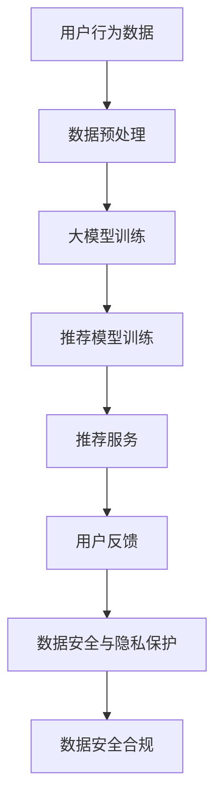

                 

# AI 大模型在电商搜索推荐中的数据安全策略：保障数据安全与用户隐私

## 1. 背景介绍

在电商搜索推荐领域，利用大数据和人工智能技术，可以为用户提供个性化的商品推荐，提升用户体验和交易转化率。然而，随着这些技术的应用，数据安全与用户隐私问题也愈发受到重视。如何在使用AI大模型进行推荐系统优化时，确保数据安全与用户隐私，成为电商企业面临的重要挑战。

## 2. 核心概念与联系

### 2.1 核心概念概述

- **AI 大模型**：指通过大规模数据预训练学习到的复杂语言模型，如BERT、GPT等。在电商推荐中，利用大模型提取用户行为特征，进行推荐模型训练。

- **推荐系统**：通过分析用户行为数据，预测用户感兴趣的商品或服务，向其推荐个性化内容，提升用户体验和转化率。

- **数据安全**：指保护用户数据免受未授权访问、窃取、篡改等威胁，确保数据保密性、完整性和可用性。

- **用户隐私**：指保护个人在网络空间中的个人信息不被泄露，防止其被用于未授权的用途，保障个人数据权利。

- **隐私保护**：指在数据处理和分析过程中，采取措施防止敏感信息泄漏，保护用户隐私。

- **安全合规**：指遵循相关法律法规，如GDPR、CCPA等，保障用户数据处理和使用过程中的合规性。

这些核心概念在电商推荐中相互关联，共同构成了数据安全与隐私保护的重要框架。

### 2.2 核心概念原理和架构的 Mermaid 流程图



## 3. 核心算法原理 & 具体操作步骤

### 3.1 算法原理概述

基于AI大模型的电商推荐系统，通常分为数据预处理、大模型训练、推荐模型训练和推荐服务几个关键环节。在各环节中，如何确保数据安全与用户隐私，是算法设计的核心任务。

具体来说，推荐系统需要处理大量用户行为数据，包括浏览记录、购买历史、评分反馈等，这些数据可能包含敏感信息，如个人偏好、消费习惯等。在大模型训练和推荐模型训练过程中，如何保护这些数据的隐私安全，同时保障数据使用的合法合规，是推荐系统设计中必须解决的问题。

### 3.2 算法步骤详解

**Step 1: 数据预处理**

- **匿名化处理**：对用户行为数据进行匿名化处理，去除直接关联用户身份的信息，如姓名、身份证号等，防止数据泄露。
- **数据去重与归一化**：去除重复数据，对数据进行标准化处理，如将不同格式的数据统一到预设格式。

**Step 2: 大模型训练**

- **选择合适的预训练模型**：如BERT、GPT等大模型，已经在通用语言模型上进行了广泛预训练。
- **预训练数据的隐私保护**：确保预训练数据集的来源合法，不包含侵犯用户隐私的内容。
- **预训练过程的安全性**：在预训练过程中，采用严格的访问控制和数据加密技术，防止未经授权的访问和数据泄露。

**Step 3: 推荐模型训练**

- **隐私保护的数据存储**：将用户数据存储在隐私保护的环境中，如联邦学习、同态加密等技术，保障数据隐私。
- **安全合规的模型训练**：在推荐模型训练中，遵循数据隐私法律法规，如GDPR、CCPA等，保护用户隐私。

**Step 4: 推荐服务**

- **差分隐私**：在推荐服务中，采用差分隐私技术，确保用户数据的使用不泄露个体隐私。
- **安全模型部署**：在推荐服务部署时，使用安全计算环境，如可信执行环境(TEE)，防止模型被篡改和攻击。

### 3.3 算法优缺点

**优点**：
- **增强推荐精度**：利用大模型提取用户行为特征，可以进行更精准的推荐。
- **提升用户满意度**：个性化推荐可以提升用户体验，增加用户粘性。
- **减少数据标注成本**：利用大模型可以减少数据标注工作量，降低推荐系统开发成本。

**缺点**：
- **数据隐私风险**：用户行为数据可能包含敏感信息，需采取措施防止数据泄露。
- **算法复杂性高**：隐私保护与合规性要求增加了算法设计的复杂性。
- **计算成本高**：隐私保护技术和数据加密技术会增加计算成本。

### 3.4 算法应用领域

基于AI大模型的推荐系统，已经在电商、金融、媒体等多个领域得到了广泛应用。在电商搜索推荐中，大模型帮助企业理解用户需求，提供个性化推荐，提升销售业绩。同时，利用大模型进行推荐系统优化，能够有效提升用户满意度，促进品牌忠诚度。

## 4. 数学模型和公式 & 详细讲解

### 4.1 数学模型构建

假设电商平台的推荐系统基于用户历史行为数据 $D=\{x_i, y_i\}_{i=1}^N$ 进行推荐优化，其中 $x_i$ 为用户的浏览记录、评分等特征，$y_i$ 为推荐结果。设 $M_{\theta}$ 为预训练的大模型，$\theta$ 为模型参数。推荐模型 $f$ 为：

$$
f(x_i; \theta) = M_{\theta}(x_i)
$$

推荐系统的目标是最大化用户的点击率和转化率，设 $\mathcal{L}$ 为推荐模型的损失函数，优化目标为：

$$
\theta^* = \mathop{\arg\min}_{\theta} \mathcal{L}(f(x_i; \theta), y_i)
$$

### 4.2 公式推导过程

在推荐模型训练中，常用的损失函数包括交叉熵损失、均方误差损失等。以交叉熵损失为例：

$$
\mathcal{L}(f(x_i; \theta), y_i) = -y_i \log f(x_i; \theta)
$$

其中 $f(x_i; \theta)$ 为推荐模型的输出，$y_i$ 为实际标签。

在推荐模型训练过程中，为了防止数据泄露，通常采用联邦学习等技术，通过分布式训练方式，在各参与方本地进行模型训练，然后合并训练结果。设 $\theta_t^{(i)}$ 为第 $i$ 个用户在第 $t$ 次迭代的本地模型参数，本地模型训练公式为：

$$
\theta_t^{(i)} = \theta_{t-1}^{(i)} - \eta \nabla_{\theta} \mathcal{L}(f(x_i; \theta_{t-1}^{(i)}), y_i)
$$

其中 $\eta$ 为学习率，$\nabla_{\theta} \mathcal{L}(f(x_i; \theta_{t-1}^{(i)}), y_i)$ 为损失函数对模型参数的梯度。

### 4.3 案例分析与讲解

以电商推荐系统为例，假设用户 $i$ 的历史浏览记录 $x_i$ 包含多个商品类别和评分数据，推荐模型 $f$ 能够根据用户历史行为预测其对各个商品的兴趣程度。设 $y_i^{(j)}$ 为第 $j$ 个商品的推荐标签，推荐模型的预测输出为 $f(x_i; \theta)$。

**匿名化处理**：假设用户 $i$ 的浏览记录中包含个人信息 $x_i^{(personal)}$，通过去除个人信息 $x_i^{(personal)}$，将原始数据集转化为匿名数据集 $D_{anonymized}$。

**联邦学习**：将匿名数据集 $D_{anonymized}$ 在多个参与方之间进行分布式训练，每个参与方 $i$ 本地训练模型参数 $\theta_t^{(i)}$，然后将本地模型参数汇总，得到全局模型参数 $\theta_t$。

**差分隐私**：在推荐模型训练过程中，引入差分隐私技术，对模型的梯度进行扰动处理，确保模型训练过程中的隐私保护。设 $\epsilon$ 为隐私保护参数，差分隐私梯度公式为：

$$
\nabla_{\theta} \mathcal{L}(f(x_i; \theta), y_i) \rightarrow \nabla_{\theta} \mathcal{L}(f(x_i; \theta), y_i) + \mathcal{N}(0, \frac{\epsilon}{\Delta})\text{, where } \Delta \text{ is the sensitivity of the loss function}
$$

其中 $\mathcal{N}(0, \frac{\epsilon}{\Delta})$ 为高斯分布噪声，$\epsilon$ 为隐私保护参数，$\Delta$ 为损失函数的敏感度。

## 5. 项目实践：代码实例和详细解释说明

### 5.1 开发环境搭建

**环境配置**：
- **Python**：安装Python 3.8及以上版本。
- **PyTorch**：通过`pip install torch torchvision torchaudio`命令安装。
- **TensorFlow**：通过`pip install tensorflow`命令安装。
- **TensorFlow Federated (TFF)**：通过`pip install tensorflow-federated`命令安装。
- **numpy**：通过`pip install numpy`命令安装。
- **pandas**：通过`pip install pandas`命令安装。

**虚拟环境**：
```bash
conda create --name federated_learning python=3.8
conda activate federated_learning
```

### 5.2 源代码详细实现

以下是一个简单的电商推荐系统联邦学习框架的实现：

```python
import tensorflow as tf
import tensorflow_federated as tff
import numpy as np
import pandas as pd

# 定义推荐模型
class RecommendationModel(tf.keras.Model):
    def __init__(self):
        super(RecommendationModel, self).__init__()
        self.dense1 = tf.keras.layers.Dense(128, activation='relu')
        self.dense2 = tf.keras.layers.Dense(64, activation='relu')
        self.dense3 = tf.keras.layers.Dense(1, activation='sigmoid')
        
    def call(self, inputs):
        x = self.dense1(inputs)
        x = self.dense2(x)
        return self.dense3(x)

# 加载数据集
data = pd.read_csv('data.csv')
data = data.drop(['user_id'], axis=1)
data = data.dropna()
data = data.sample(frac=1).reset_index(drop=True)

# 数据预处理
def preprocess(inputs):
    x = inputs.drop(['item_id'], axis=1)
    y = inputs['item_id']
    x = x.to_numpy()
    y = y.to_numpy()
    return x, y

data = tff.data.Dataset.from_tensor_slices(
    tff.nest.pack_sequence_as((x, y), (preprocess(x), y)))

# 定义模型训练过程
def model_fn():
    model = RecommendationModel()
    optimizer = tf.keras.optimizers.Adam()
    return tff.learning.Model(
        model_fn=lambda _: model,
        loss_fn=lambda _, features, label: tf.keras.losses.binary_crossentropy(y_true=label, y_pred=model(features)),
        train_op=tff.learning.build_train_op(optimizer),
        metrics=tff.metrics.Accuracy())

# 定义联邦学习过程
def federated_learning_fn():
    # 初始化模型
    initial_state = model_fn().initialize()

    # 定义本地训练过程
    def local_train_state_fn(state):
        return model_fn().initialize()

    # 定义聚合函数
    def aggregate_fn(state):
        local_results = tff.collectives.all_reduce(tff.collectives.ReduceOp.SUM, state)
        return local_results

    # 定义迭代过程
    def federated_learning_iteration(state, batch):
        def local_state_fn(state):
            def local_fn(state):
                _, state = model_fn().train_one_step(features=batch, optimizer=optimizer)
                return state
            return local_fn(state)

        result = tff.learning.fit(
            local_train_state_fn=local_state_fn,
            state=state,
            iterator=batch,
            num_iterations=1,
            state_steps=1,
            step_fn=local_fn)
        return result

    # 进行多轮迭代
    federated_state = initial_state
    for _ in range(10):
        federated_state = federated_learning_iteration(federated_state, data)

    return federated_state

# 执行联邦学习
federated_learning_fn()
```

### 5.3 代码解读与分析

**代码解析**：
- **数据加载与预处理**：首先加载电商数据集，并进行匿名化处理，移除个人信息，确保数据安全。
- **模型定义**：定义了一个简单的推荐模型，包括多个密集层，用于提取用户行为特征并预测推荐结果。
- **联邦学习过程**：在联邦学习框架下，定义了本地训练过程、聚合函数、迭代过程，并在多轮迭代中训练模型。
- **结果展示**：最后返回联邦学习结果，可以在推荐服务中进行模型部署和使用。

**注意事项**：
- **隐私保护**：在数据预处理和本地训练过程中，需要确保数据匿名化，防止个人信息泄露。
- **安全计算**：在联邦学习中，需要在本地进行模型训练，并通过安全的聚合函数将所有训练结果汇总。
- **差分隐私**：在本地训练过程中，需要引入差分隐私技术，确保模型训练过程中的隐私保护。

## 6. 实际应用场景

### 6.1 智能客服系统

智能客服系统在电商推荐中起到重要辅助作用，可以帮助用户快速找到所需商品，提供实时客服支持。然而，智能客服系统可能涉及用户隐私信息，如用户浏览记录、购买历史等，需要采取严格的隐私保护措施。

**应用策略**：
- **数据匿名化**：在智能客服系统中，对用户数据进行匿名化处理，移除个人信息，防止数据泄露。
- **差分隐私**：在智能客服推荐模型训练过程中，引入差分隐私技术，保护用户隐私。
- **安全计算**：在智能客服系统中，采用安全计算环境，如可信执行环境(TEE)，防止模型被篡改和攻击。

### 6.2 用户画像系统

用户画像系统通过收集和分析用户行为数据，构建用户画像，进行个性化推荐。用户画像涉及大量敏感信息，如浏览记录、购买偏好等，需采取严格的隐私保护措施。

**应用策略**：
- **数据匿名化**：对用户数据进行匿名化处理，防止个人信息泄露。
- **联邦学习**：利用联邦学习技术，在多个参与方之间分布式训练模型，保护用户隐私。
- **差分隐私**：在用户画像系统构建过程中，引入差分隐私技术，保护用户隐私。

### 6.3 金融风险评估系统

金融风险评估系统通过分析用户历史金融数据，评估其信用风险，提供个性化的贷款和投资建议。金融数据涉及用户隐私和敏感信息，需采取严格的隐私保护措施。

**应用策略**：
- **数据匿名化**：对用户金融数据进行匿名化处理，防止个人信息泄露。
- **联邦学习**：利用联邦学习技术，在多个参与方之间分布式训练模型，保护用户隐私。
- **差分隐私**：在金融风险评估系统构建过程中，引入差分隐私技术，保护用户隐私。

## 7. 工具和资源推荐

### 7.1 学习资源推荐

**《联邦学习原理与实践》**：介绍联邦学习的基本概念、算法设计和应用场景，适合初学者和进阶开发者学习。

**《差分隐私保护技术》**：深入讲解差分隐私的原理和应用，帮助开发者掌握隐私保护技术。

**《深度学习与推荐系统》**：讲解深度学习在推荐系统中的应用，涵盖数据预处理、模型训练和推荐服务等多个环节。

**Google AI Blog**：提供最新的AI技术和实践案例，涵盖大模型训练、联邦学习、差分隐私等多个方向。

### 7.2 开发工具推荐

**TensorFlow Federated (TFF)**：谷歌开发的联邦学习框架，支持分布式训练和隐私保护，适合电商推荐系统的实现。

**TensorFlow**：谷歌开源的深度学习框架，支持高效的模型训练和部署，适合电商推荐系统的构建。

**PyTorch**：Facebook开源的深度学习框架，支持动态计算图和高效模型训练，适合电商推荐系统的实现。

**TensorBoard**：谷歌开源的可视化工具，可以实时监测模型训练状态，方便调试和优化。

### 7.3 相关论文推荐

**《联邦学习：原理与算法》**：介绍联邦学习的基本原理和算法设计，适合理解联邦学习的基础理论。

**《差分隐私：基本概念与技术》**：深入讲解差分隐私的原理和应用，帮助开发者掌握隐私保护技术。

**《深度学习在推荐系统中的应用》**：讲解深度学习在推荐系统中的应用，涵盖数据预处理、模型训练和推荐服务等多个环节。

**《保护用户隐私的AI推荐系统》**：介绍如何在使用AI大模型进行推荐系统优化时，确保数据安全与用户隐私。

## 8. 总结：未来发展趋势与挑战

### 8.1 研究成果总结

本文对基于AI大模型的电商推荐系统中的数据安全与隐私保护问题进行了详细探讨，提出了联邦学习、差分隐私等隐私保护技术的应用策略。通过系统性分析，提出了大模型在推荐系统中的应用方法，并给出了详细的代码实例。

### 8.2 未来发展趋势

- **隐私保护技术的发展**：随着隐私保护技术的不断进步，联邦学习和差分隐私技术将更加成熟，提供更加强大的隐私保护能力。
- **安全计算环境的应用**：可信执行环境(TEE)等安全计算环境将得到更广泛应用，提升推荐系统安全性。
- **跨领域应用的拓展**：AI大模型将更多应用于医疗、金融等领域，隐私保护技术也将得到更加深入的研究和应用。

### 8.3 面临的挑战

- **隐私保护与用户体验的平衡**：如何在保护用户隐私的同时，提升用户体验，是推荐系统设计中的一个重要挑战。
- **隐私保护技术的复杂性**：隐私保护技术涉及复杂的算法设计和实施，需要投入大量资源进行研发和部署。
- **数据安全和合规性的保障**：合规性要求严格，需要确保数据处理和使用过程中的合法合规。

### 8.4 研究展望

未来，AI大模型在电商推荐系统中的应用将面临更多的隐私保护挑战，需要进一步探索隐私保护技术的新方法和新工具。同时，需要加强跨领域应用的协作，提升AI大模型在多个领域中的适用性和可靠性。

## 9. 附录：常见问题与解答

**Q1: 什么是联邦学习？**

A: 联邦学习是一种分布式机器学习方法，多个参与方在不共享本地数据的情况下，联合训练全局模型。通过这种方式，可以在保护数据隐私的同时，提升模型的性能和准确性。

**Q2: 差分隐私是什么？**

A: 差分隐私是一种保护数据隐私的技术，通过在模型训练过程中引入噪声，使得单个样本的加入或删除对模型输出的影响极小，从而保护用户的隐私。

**Q3: 如何在推荐系统中实现联邦学习和差分隐私？**

A: 可以在推荐系统中使用联邦学习框架，如TensorFlow Federated，在多个参与方之间分布式训练模型。同时，在模型训练过程中，引入差分隐私技术，保护用户隐私。

**Q4: 如何在推荐系统中实现数据匿名化？**

A: 可以使用数据去重、归一化等技术，将用户数据转换为匿名数据，确保数据安全。在推荐系统中，可以使用假名化、匿名化等技术，将个人信息移除，防止数据泄露。

**Q5: 推荐系统中的数据安全和隐私保护策略有哪些？**

A: 推荐系统中的数据安全和隐私保护策略包括数据匿名化、差分隐私、联邦学习、安全计算环境等。通过这些技术手段，可以在保护用户隐私的同时，提升推荐系统的性能和可用性。

---

作者：禅与计算机程序设计艺术 / Zen and the Art of Computer Programming

