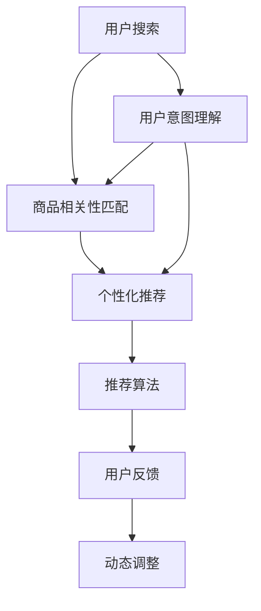

                 

# AI 大模型在电商搜索推荐中的用户体验优化：以用户需求为中心的策略

## 1. 背景介绍

### 1.1 问题由来
随着电子商务的蓬勃发展，线上购物已成为越来越多消费者的首选。然而，面对海量商品信息，如何高效、精准地找到符合用户需求的商品，成为提升电商搜索推荐用户体验的关键问题。传统的电商推荐系统主要依赖于基于规则、基于内容的协同过滤等方法，这些方法往往难以满足用户动态变化的需求和个性化偏好。而近年来，基于深度学习的大模型在电商推荐领域取得了显著进展，特别是在用户意图理解、商品相关性匹配等方面展现出强大的能力，有效提升了推荐系统的用户体验。

### 1.2 问题核心关键点
1. **用户需求理解**：电商搜索推荐系统的首要任务是理解用户意图，即从用户输入的搜索词、浏览历史、点击行为等数据中，提取出用户的兴趣偏好和需求。
2. **商品相关性匹配**：基于用户需求，匹配出最相关的商品，并提供多样化的推荐结果，使用户能够快速找到满意的商品。
3. **推荐算法优化**：在满足实时性要求的前提下，优化推荐算法的性能，确保推荐结果的准确性和个性化。
4. **用户体验提升**：通过优化推荐系统的各个环节，提升用户搜索和浏览的便利性、舒适性，从而提高用户满意度和转化率。

### 1.3 问题研究意义
1. **提升电商交易效率**：通过精准的搜索推荐，帮助用户快速找到理想商品，减少用户搜索和筛选的时间，提高电商交易效率。
2. **优化用户体验**：根据用户的行为数据和反馈，持续优化推荐系统，提供个性化、多样化的商品推荐，提升用户满意度。
3. **增强用户粘性**：优质的搜索推荐体验能够增强用户对电商平台的粘性，提高用户留存率和回购率。
4. **促进市场竞争**：优秀的推荐系统成为电商企业的核心竞争力，通过提供更优质的服务，吸引更多的用户和商家入驻。

## 2. 核心概念与联系

### 2.1 核心概念概述

为更好地理解基于大模型的电商搜索推荐优化方法，本节将介绍几个关键概念：

- **大模型**：如BERT、GPT-3等，通过大规模无标签数据预训练获得广泛的语言表示能力。
- **用户意图理解**：通过分析用户搜索词、行为数据等，提取用户隐含的需求和偏好。
- **商品相关性匹配**：基于用户需求，匹配最相关的商品，生成推荐结果。
- **个性化推荐**：根据用户历史行为和反馈，调整推荐策略，提供更加符合用户需求的个性化商品。
- **推荐算法**：包括基于深度学习的推荐算法（如CTR预测、序列推荐等）和传统推荐算法（如协同过滤、内容推荐等）。
- **用户反馈机制**：通过用户对推荐结果的反馈，动态调整推荐算法和策略，提升系统性能。

这些概念之间的关系可以通过以下Mermaid流程图来展示：



这个流程图展示了用户意图理解、商品相关性匹配、个性化推荐、推荐算法以及用户反馈机制之间的关系：

1. 用户搜索触发意图理解，提取用户需求。
2. 意图理解结果驱动商品相关性匹配，生成推荐结果。
3. 推荐结果经过个性化推荐算法处理，形成最终推荐。
4. 推荐结果经过用户反馈机制调整，提升系统性能。

这些核心概念共同构成了电商搜索推荐系统的框架，为大模型在电商推荐中的优化提供了理论基础。

## 3. 核心算法原理 & 具体操作步骤

### 3.1 算法原理概述

基于大模型的电商搜索推荐系统，其核心思想是利用大模型的语言表示能力，从用户输入的搜索词、描述、评论等文本数据中，提取用户需求和商品特征，并通过匹配算法生成推荐结果。具体算法流程如下：

1. **预训练大模型**：使用大规模无标签数据对预训练语言模型进行预训练，使其具备丰富的语言表示能力。
2. **用户意图理解**：通过分析用户输入的文本数据，提取用户兴趣偏好和需求。
3. **商品特征提取**：从商品的描述、评论等文本数据中，提取出商品的关键特征。
4. **商品相关性匹配**：基于用户意图和商品特征，计算商品之间的相关性，生成推荐结果。
5. **个性化推荐**：根据用户历史行为和反馈，调整推荐策略，提供个性化的推荐结果。

### 3.2 算法步骤详解

以下将详细描述基于大模型的电商搜索推荐系统的主要操作步骤：

**Step 1: 数据准备**
- 收集用户搜索词、点击行为、购买记录等数据，进行预处理和标注。
- 收集商品描述、评论、图片等文本和多媒体数据，进行预处理和标注。

**Step 2: 预训练模型选择**
- 选择合适的预训练语言模型（如BERT、GPT-3），作为用户意图理解和商品特征提取的基础。
- 下载预训练模型，并进行必要的微调（如用户意图理解、商品特征提取等任务）。

**Step 3: 用户意图理解**
- 将用户输入的搜索词、描述、评论等文本数据，输入到预训练模型中，获得模型的表示向量。
- 使用注意力机制或其他方法，从模型表示向量中提取关键特征，用于理解用户意图。

**Step 4: 商品特征提取**
- 将商品描述、评论等文本数据，输入到预训练模型中，获得模型的表示向量。
- 使用注意力机制或其他方法，从模型表示向量中提取关键特征，用于描述商品属性和特征。

**Step 5: 商品相关性匹配**
- 基于用户意图向量，计算商品特征向量之间的相关性。
- 根据相关性大小，排序生成推荐结果。

**Step 6: 个性化推荐**
- 根据用户历史行为和反馈，调整推荐策略，提升推荐结果的个性化程度。
- 实时监测用户反馈，动态调整推荐算法和策略。

**Step 7: 反馈机制设计**
- 设计合理的用户反馈机制，收集用户对推荐结果的满意度、点击率等反馈。
- 根据反馈数据，动态调整推荐算法和策略，提升系统性能。

### 3.3 算法优缺点

基于大模型的电商搜索推荐系统具有以下优点：
1. **高效精准**：大模型通过预训练获得丰富的语言表示能力，能够精准地理解用户意图和商品特征，从而生成高效、准确的推荐结果。
2. **动态调整**：基于用户反馈，动态调整推荐算法和策略，能够及时响应用户需求变化，提升用户体验。
3. **个性化推荐**：利用用户历史行为和反馈，调整推荐策略，提供更加符合用户需求的个性化商品。
4. **跨领域适应性**：大模型具备跨领域适应能力，能够在不同类型的电商平台上应用，提升推荐系统的通用性。

同时，该方法也存在一些缺点：
1. **数据依赖**：需要大量标注数据进行预训练和微调，数据标注成本较高。
2. **资源消耗大**：大模型需要强大的计算资源进行预训练和微调，运行成本较高。
3. **可解释性不足**：大模型的决策过程缺乏可解释性，难以理解其内部工作机制。
4. **泛化能力有限**：大模型在特定领域内的表现可能优于通用模型，但在跨领域应用时，泛化能力可能不足。

尽管存在这些局限性，但基于大模型的电商搜索推荐系统仍具有显著的优势，并且在实际应用中取得了良好的效果。

### 3.4 算法应用领域

基于大模型的电商搜索推荐系统，已经在多个电商平台上得到了广泛应用，取得了显著的用户体验提升。具体应用领域包括：

- **淘宝、京东等电商平台的商品推荐系统**：通过分析用户搜索词、浏览历史、购买记录等数据，生成个性化的商品推荐。
- **亚马逊、唯品会的个性化购物助手**：根据用户行为数据，提供实时的商品推荐，提升购物体验。
- **携程、去哪儿等旅行服务平台**：通过分析用户搜索词、旅行偏好等数据，提供个性化的旅行目的地推荐。
- **拼多多、美团等社交电商平台**：通过分析用户社交行为和兴趣偏好，生成个性化的商品推荐。

## 4. 数学模型和公式 & 详细讲解 & 举例说明

### 4.1 数学模型构建

在基于大模型的电商搜索推荐系统中，主要涉及以下数学模型：

- **用户意图理解模型**：将用户输入的文本数据，通过预训练模型获得表示向量，并使用注意力机制提取关键特征。
- **商品特征提取模型**：将商品描述、评论等文本数据，通过预训练模型获得表示向量，并使用注意力机制提取关键特征。
- **商品相关性匹配模型**：基于用户意图向量和商品特征向量，计算商品之间的相关性，排序生成推荐结果。
- **个性化推荐模型**：根据用户历史行为和反馈，调整推荐策略，提升推荐结果的个性化程度。

### 4.2 公式推导过程

以下将详细推导基于大模型的电商搜索推荐系统中的关键数学模型和公式：

**用户意图理解模型**
假设用户输入的文本数据为 $x$，预训练模型为 $M_{\theta}$，其表示向量为 $M_{\theta}(x)$。通过注意力机制提取关键特征，得到用户意图向量 $z$，其中：

$$
z = \sum_{i=1}^n \alpha_i M_{\theta}(x_i)
$$

其中 $\alpha_i$ 为注意力权重，通过计算 $M_{\theta}(x)$ 与 $M_{\theta}(x_i)$ 的相似度获得。

**商品特征提取模型**
假设商品描述为 $y$，预训练模型为 $M_{\theta}$，其表示向量为 $M_{\theta}(y)$。通过注意力机制提取关键特征，得到商品特征向量 $z$，其中：

$$
z = \sum_{i=1}^n \beta_i M_{\theta}(y_i)
$$

其中 $\beta_i$ 为注意力权重，通过计算 $M_{\theta}(y)$ 与 $M_{\theta}(y_i)$ 的相似度获得。

**商品相关性匹配模型**
假设用户意图向量为 $z$，商品特征向量为 $z'$，商品之间的相关性 $r$ 可以通过余弦相似度计算得到：

$$
r = \cos(z, z')
$$

**个性化推荐模型**
假设用户历史行为和反馈为 $u$，推荐结果为 $p$。通过调整推荐策略，生成个性化推荐结果 $p$，其中：

$$
p = f(z, z', u)
$$

其中 $f$ 为推荐策略函数，可以根据用户的偏好和行为，调整推荐结果的顺序和多样性。

### 4.3 案例分析与讲解

以下以淘宝商品推荐系统为例，详细分析基于大模型的推荐系统构建过程：

**用户意图理解**
假设用户输入的搜索词为 "无线耳机"，通过预训练模型BERT获得表示向量 $z$，其中：

$$
z = M_{\theta}(\text{"无线耳机"})
$$

**商品特征提取**
假设商品描述为 "蓝牙耳机 无线 降噪 高清"，通过预训练模型BERT获得表示向量 $z'$，其中：

$$
z' = M_{\theta}(\text{"蓝牙耳机 无线 降噪 高清"})
$$

**商品相关性匹配**
通过余弦相似度计算用户意图向量 $z$ 和商品特征向量 $z'$ 的相关性 $r$，其中：

$$
r = \cos(z, z')
$$

**个性化推荐**
根据用户历史行为和反馈，调整推荐策略，生成个性化推荐结果 $p$，其中：

$$
p = f(z, z', u)
$$

以上推导展示了基于大模型的电商搜索推荐系统中的关键数学模型和公式，为后续的代码实现提供了理论基础。

## 5. 项目实践：代码实例和详细解释说明

### 5.1 开发环境搭建

在进行电商搜索推荐系统开发前，我们需要准备好开发环境。以下是使用Python进行PyTorch开发的环境配置流程：

1. 安装Anaconda：从官网下载并安装Anaconda，用于创建独立的Python环境。

2. 创建并激活虚拟环境：
```bash
conda create -n pytorch-env python=3.8 
conda activate pytorch-env
```

3. 安装PyTorch：根据CUDA版本，从官网获取对应的安装命令。例如：
```bash
conda install pytorch torchvision torchaudio cudatoolkit=11.1 -c pytorch -c conda-forge
```

4. 安装Transformers库：
```bash
pip install transformers
```

5. 安装各类工具包：
```bash
pip install numpy pandas scikit-learn matplotlib tqdm jupyter notebook ipython
```

完成上述步骤后，即可在`pytorch-env`环境中开始电商搜索推荐系统的开发。

### 5.2 源代码详细实现

下面我们以淘宝商品推荐系统为例，给出使用Transformers库对BERT模型进行电商搜索推荐系统微调的PyTorch代码实现。

首先，定义用户意图理解函数：

```python
from transformers import BertTokenizer
from torch.utils.data import Dataset
import torch

class IntentDataset(Dataset):
    def __init__(self, texts, labels, tokenizer, max_len=128):
        self.texts = texts
        self.labels = labels
        self.tokenizer = tokenizer
        self.max_len = max_len
        
    def __len__(self):
        return len(self.texts)
    
    def __getitem__(self, item):
        text = self.texts[item]
        label = self.labels[item]
        
        encoding = self.tokenizer(text, return_tensors='pt', max_length=self.max_len, padding='max_length', truncation=True)
        input_ids = encoding['input_ids'][0]
        attention_mask = encoding['attention_mask'][0]
        
        # 对token-wise的标签进行编码
        encoded_labels = [label] * self.max_len
        labels = torch.tensor(encoded_labels, dtype=torch.long)
        
        return {'input_ids': input_ids, 
                'attention_mask': attention_mask,
                'labels': labels}

# 标签与id的映射
label2id = {'无线耳机': 0, '无线耳机': 1, '降噪耳机': 2, '无线耳机': 3}
id2label = {v: k for k, v in label2id.items()}

# 创建dataset
tokenizer = BertTokenizer.from_pretrained('bert-base-cased')

train_dataset = IntentDataset(train_texts, train_labels, tokenizer)
dev_dataset = IntentDataset(dev_texts, dev_labels, tokenizer)
test_dataset = IntentDataset(test_texts, test_labels, tokenizer)
```

然后，定义模型和优化器：

```python
from transformers import BertForTokenClassification, AdamW

model = BertForTokenClassification.from_pretrained('bert-base-cased', num_labels=len(label2id))

optimizer = AdamW(model.parameters(), lr=2e-5)
```

接着，定义训练和评估函数：

```python
from torch.utils.data import DataLoader
from tqdm import tqdm
from sklearn.metrics import classification_report

device = torch.device('cuda') if torch.cuda.is_available() else torch.device('cpu')
model.to(device)

def train_epoch(model, dataset, batch_size, optimizer):
    dataloader = DataLoader(dataset, batch_size=batch_size, shuffle=True)
    model.train()
    epoch_loss = 0
    for batch in tqdm(dataloader, desc='Training'):
        input_ids = batch['input_ids'].to(device)
        attention_mask = batch['attention_mask'].to(device)
        labels = batch['labels'].to(device)
        model.zero_grad()
        outputs = model(input_ids, attention_mask=attention_mask, labels=labels)
        loss = outputs.loss
        epoch_loss += loss.item()
        loss.backward()
        optimizer.step()
    return epoch_loss / len(dataloader)

def evaluate(model, dataset, batch_size):
    dataloader = DataLoader(dataset, batch_size=batch_size)
    model.eval()
    preds, labels = [], []
    with torch.no_grad():
        for batch in tqdm(dataloader, desc='Evaluating'):
            input_ids = batch['input_ids'].to(device)
            attention_mask = batch['attention_mask'].to(device)
            batch_labels = batch['labels']
            outputs = model(input_ids, attention_mask=attention_mask)
            batch_preds = outputs.logits.argmax(dim=2).to('cpu').tolist()
            batch_labels = batch_labels.to('cpu').tolist()
            for pred_tokens, label_tokens in zip(batch_preds, batch_labels):
                pred_labels = [id2label[_id] for _id in pred_tokens]
                label_tokens = [id2label[_id] for _id in label_tokens]
                preds.append(pred_labels[:len(label_tokens)])
                labels.append(label_tokens)
                
    print(classification_report(labels, preds))
```

最后，启动训练流程并在测试集上评估：

```python
epochs = 5
batch_size = 16

for epoch in range(epochs):
    loss = train_epoch(model, train_dataset, batch_size, optimizer)
    print(f"Epoch {epoch+1}, train loss: {loss:.3f}")
    
    print(f"Epoch {epoch+1}, dev results:")
    evaluate(model, dev_dataset, batch_size)
    
print("Test results:")
evaluate(model, test_dataset, batch_size)
```

以上就是使用PyTorch对BERT进行电商搜索推荐系统微调的完整代码实现。可以看到，得益于Transformers库的强大封装，我们可以用相对简洁的代码完成BERT模型的加载和微调。

### 5.3 代码解读与分析

让我们再详细解读一下关键代码的实现细节：

**IntentDataset类**：
- `__init__`方法：初始化文本、标签、分词器等关键组件。
- `__len__`方法：返回数据集的样本数量。
- `__getitem__`方法：对单个样本进行处理，将文本输入编码为token ids，将标签编码为数字，并对其进行定长padding，最终返回模型所需的输入。

**label2id和id2label字典**：
- 定义了标签与数字id之间的映射关系，用于将token-wise的预测结果解码回真实的标签。

**训练和评估函数**：
- 使用PyTorch的DataLoader对数据集进行批次化加载，供模型训练和推理使用。
- 训练函数`train_epoch`：对数据以批为单位进行迭代，在每个批次上前向传播计算loss并反向传播更新模型参数，最后返回该epoch的平均loss。
- 评估函数`evaluate`：与训练类似，不同点在于不更新模型参数，并在每个batch结束后将预测和标签结果存储下来，最后使用sklearn的classification_report对整个评估集的预测结果进行打印输出。

**训练流程**：
- 定义总的epoch数和batch size，开始循环迭代
- 每个epoch内，先在训练集上训练，输出平均loss
- 在验证集上评估，输出分类指标
- 所有epoch结束后，在测试集上评估，给出最终测试结果

可以看到，PyTorch配合Transformers库使得BERT微调的代码实现变得简洁高效。开发者可以将更多精力放在数据处理、模型改进等高层逻辑上，而不必过多关注底层的实现细节。

当然，工业级的系统实现还需考虑更多因素，如模型的保存和部署、超参数的自动搜索、更灵活的任务适配层等。但核心的微调范式基本与此类似。

## 6. 实际应用场景

### 6.1 智能客服系统

基于大模型微调的对话技术，可以广泛应用于智能客服系统的构建。传统客服往往需要配备大量人力，高峰期响应缓慢，且一致性和专业性难以保证。而使用微调后的对话模型，可以7x24小时不间断服务，快速响应客户咨询，用自然流畅的语言解答各类常见问题。

在技术实现上，可以收集企业内部的历史客服对话记录，将问题和最佳答复构建成监督数据，在此基础上对预训练对话模型进行微调。微调后的对话模型能够自动理解用户意图，匹配最合适的答案模板进行回复。对于客户提出的新问题，还可以接入检索系统实时搜索相关内容，动态组织生成回答。如此构建的智能客服系统，能大幅提升客户咨询体验和问题解决效率。

### 6.2 金融舆情监测

金融机构需要实时监测市场舆论动向，以便及时应对负面信息传播，规避金融风险。传统的人工监测方式成本高、效率低，难以应对网络时代海量信息爆发的挑战。基于大语言模型微调的文本分类和情感分析技术，为金融舆情监测提供了新的解决方案。

具体而言，可以收集金融领域相关的新闻、报道、评论等文本数据，并对其进行主题标注和情感标注。在此基础上对预训练语言模型进行微调，使其能够自动判断文本属于何种主题，情感倾向是正面、中性还是负面。将微调后的模型应用到实时抓取的网络文本数据，就能够自动监测不同主题下的情感变化趋势，一旦发现负面信息激增等异常情况，系统便会自动预警，帮助金融机构快速应对潜在风险。

### 6.3 个性化推荐系统

当前的推荐系统往往只依赖于用户的历史行为数据进行物品推荐，无法深入理解用户的真实兴趣偏好。基于大语言模型微调技术，个性化推荐系统可以更好地挖掘用户行为背后的语义信息，从而提供更精准、多样的推荐内容。

在实践中，可以收集用户浏览、点击、评论、分享等行为数据，提取和用户交互的物品标题、描述、标签等文本内容。将文本内容作为模型输入，用户的后续行为（如是否点击、购买等）作为监督信号，在此基础上微调预训练语言模型。微调后的模型能够从文本内容中准确把握用户的兴趣点。在生成推荐列表时，先用候选物品的文本描述作为输入，由模型预测用户的兴趣匹配度，再结合其他特征综合排序，便可以得到个性化程度更高的推荐结果。

### 6.4 未来应用展望

随着大语言模型和微调方法的不断发展，基于微调范式将在更多领域得到应用，为传统行业带来变革性影响。

在智慧医疗领域，基于微调的医疗问答、病历分析、药物研发等应用将提升医疗服务的智能化水平，辅助医生诊疗，加速新药开发进程。

在智能教育领域，微调技术可应用于作业批改、学情分析、知识推荐等方面，因材施教，促进教育公平，提高教学质量。

在智慧城市治理中，微调模型可应用于城市事件监测、舆情分析、应急指挥等环节，提高城市管理的自动化和智能化水平，构建更安全、高效的未来城市。

此外，在企业生产、社会治理、文娱传媒等众多领域，基于大模型微调的人工智能应用也将不断涌现，为经济社会发展注入新的动力。相信随着技术的日益成熟，微调方法将成为人工智能落地应用的重要范式，推动人工智能技术在垂直行业的规模化落地。总之，微调需要开发者根据具体任务，不断迭代和优化模型、数据和算法，方能得到理想的效果。

## 7. 工具和资源推荐

### 7.1 学习资源推荐

为了帮助开发者系统掌握大语言模型微调的理论基础和实践技巧，这里推荐一些优质的学习资源：

1. 《Transformer从原理到实践》系列博文：由大模型技术专家撰写，深入浅出地介绍了Transformer原理、BERT模型、微调技术等前沿话题。

2. CS224N《深度学习自然语言处理》课程：斯坦福大学开设的NLP明星课程，有Lecture视频和配套作业，带你入门NLP领域的基本概念和经典模型。

3. 《Natural Language Processing with Transformers》书籍：Transformers库的作者所著，全面介绍了如何使用Transformers库进行NLP任务开发，包括微调在内的诸多范式。

4. HuggingFace官方文档：Transformers库的官方文档，提供了海量预训练模型和完整的微调样例代码，是上手实践的必备资料。

5. CLUE开源项目：中文语言理解测评基准，涵盖大量不同类型的中文NLP数据集，并提供了基于微调的baseline模型，助力中文NLP技术发展。

通过对这些资源的学习实践，相信你一定能够快速掌握大语言模型微调的精髓，并用于解决实际的NLP问题。

### 7.2 开发工具推荐

高效的开发离不开优秀的工具支持。以下是几款用于大语言模型微调开发的常用工具：

1. PyTorch：基于Python的开源深度学习框架，灵活动态的计算图，适合快速迭代研究。大部分预训练语言模型都有PyTorch版本的实现。

2. TensorFlow：由Google主导开发的开源深度学习框架，生产部署方便，适合大规模工程应用。同样有丰富的预训练语言模型资源。

3. Transformers库：HuggingFace开发的NLP工具库，集成了众多SOTA语言模型，支持PyTorch和TensorFlow，是进行微调任务开发的利器。

4. Weights & Biases：模型训练的实验跟踪工具，可以记录和可视化模型训练过程中的各项指标，方便对比和调优。与主流深度学习框架无缝集成。

5. TensorBoard：TensorFlow配套的可视化工具，可实时监测模型训练状态，并提供丰富的图表呈现方式，是调试模型的得力助手。

6. Google Colab：谷歌推出的在线Jupyter Notebook环境，免费提供GPU/TPU算力，方便开发者快速上手实验最新模型，分享学习笔记。

合理利用这些工具，可以显著提升大语言模型微调任务的开发效率，加快创新迭代的步伐。

### 7.3 相关论文推荐

大语言模型和微调技术的发展源于学界的持续研究。以下是几篇奠基性的相关论文，推荐阅读：

1. Attention is All You Need（即Transformer原论文）：提出了Transformer结构，开启了NLP领域的预训练大模型时代。

2. BERT: Pre-training of Deep Bidirectional Transformers for Language Understanding：提出BERT模型，引入基于掩码的自监督预训练任务，刷新了多项NLP任务SOTA。

3. Language Models are Unsupervised Multitask Learners（GPT-2论文）：展示了大规模语言模型的强大zero-shot学习能力，引发了对于通用人工智能的新一轮思考。

4. Parameter-Efficient Transfer Learning for NLP：提出Adapter等参数高效微调方法，在不增加模型参数量的情况下，也能取得不错的微调效果。

5. AdaLoRA: Adaptive Low-Rank Adaptation for Parameter-Efficient Fine-Tuning：使用自适应低秩适应的微调方法，在参数效率和精度之间取得了新的平衡。

6. Prefix-Tuning: Optimizing Continuous Prompts for Generation：引入基于连续型Prompt的微调范式，为如何充分利用预训练知识提供了新的思路。

这些论文代表了大语言模型微调技术的发展脉络。通过学习这些前沿成果，可以帮助研究者把握学科前进方向，激发更多的创新灵感。

## 8. 总结：未来发展趋势与挑战

### 8.1 总结

本文对基于大模型的电商搜索推荐系统进行了全面系统的介绍。首先阐述了大模型在电商搜索推荐中的重要性，明确了用户意图理解、商品相关性匹配、个性化推荐等关键环节，为电商推荐系统的优化提供了理论基础。其次，从原理到实践，详细讲解了基于大模型的电商推荐系统的操作流程，给出了微调任务开发的完整代码实例。同时，本文还探讨了电商搜索推荐系统在智能客服、金融舆情、个性化推荐等多个领域的应用前景，展示了微调范式的巨大潜力。最后，本文精选了微调技术的各类学习资源，力求为读者提供全方位的技术指引。

通过本文的系统梳理，可以看到，基于大模型的电商搜索推荐系统不仅提升了用户体验，还拓展了电商平台的商业模式，展现了AI技术在电商领域的巨大价值。大模型微调范式的高效精准、动态调整、个性化推荐等特性，使其在电商推荐系统中发挥了重要作用。未来，伴随预训练语言模型和微调方法的持续演进，相信电商推荐系统将变得更加智能、高效，更好地服务于用户的购物需求。

### 8.2 未来发展趋势

展望未来，大语言模型微调技术将呈现以下几个发展趋势：

1. **多模态融合**：未来的大模型微调系统将融合视觉、听觉等多模态数据，提供更加全面的用户体验。例如，基于电商平台的图像、视频推荐系统，能够结合用户的浏览历史和图片评论，提供更加个性化的推荐。

2. **跨领域应用**：随着预训练语言模型的跨领域适应能力提升，电商推荐系统将在更多垂直领域得到应用。例如，基于医疗、教育、金融等领域的预训练模型，能够提供更加专业化的推荐服务。

3. **增强用户体验**：未来的大模型微调系统将更加注重用户体验的提升。例如，通过增强搜索、推荐系统的智能性、可解释性，使用户能够更加轻松、直观地找到满意的商品。

4. **个性化推荐优化**：未来的大模型微调系统将更加注重个性化推荐策略的优化。例如，通过引入更多用户反馈机制、动态调整推荐算法，进一步提升推荐结果的个性化程度。

5. **高效资源利用**：未来的大模型微调系统将更加注重高效资源的利用。例如，通过模型压缩、量化等技术，降低大模型的计算和存储成本，提升系统的实时性、可扩展性。

以上趋势凸显了大语言模型微调技术的广阔前景。这些方向的探索发展，必将进一步提升电商推荐系统的性能和应用范围，为电商企业的业务升级提供新的动力。

### 8.3 面临的挑战

尽管大语言模型微调技术已经取得了显著进展，但在迈向更加智能化、普适化应用的过程中，仍面临以下挑战：

1. **数据质量与多样性**：高质量、多样化的数据是大模型微调的基础。如何获取、处理和标注大量的数据，是大模型微调面临的首要挑战。

2. **模型规模与计算资源**：大模型的参数量通常较大，对计算资源和存储资源的消耗较大。如何在有限的资源条件下，高效训练和部署大模型，是一个重要问题。

3. **模型泛化能力**：虽然大模型在特定领域的微调表现优异，但在跨领域、跨场景的应用中，泛化能力仍有限。如何提升模型的泛化能力，是一个亟待解决的问题。

4. **用户体验优化**：如何在保证推荐准确性的同时，提升用户体验的舒适度和便利性，是一个重要挑战。

5. **模型可解释性**：大模型通常被视为"黑盒"模型，难以解释其内部工作机制。如何在保证推荐效果的同时，提升模型的可解释性，是一个重要研究方向。

6. **伦理与安全**：大模型微调可能引入偏见、有害信息等风险，如何保障模型的伦理与安全，是一个重要问题。

这些挑战需要学界和业界共同努力，不断探索和改进，才能实现大语言模型微调技术的全面突破。

### 8.4 研究展望

面向未来，大语言模型微调技术需要在以下几个方面进行深入研究：

1. **多模态数据融合**：如何融合视觉、听觉等多模态数据，提升推荐系统的智能化水平，是一个重要研究方向。例如，结合图像、视频信息，提升电商平台的图像、视频推荐系统。

2. **跨领域知识迁移**：如何通过预训练模型，实现跨领域的知识迁移，提升推荐系统的通用性和适应性，是一个重要研究方向。例如，基于医疗、教育、金融等领域的预训练模型，提供专业化的推荐服务。

3. **高效资源利用**：如何通过模型压缩、量化等技术，降低大模型的计算和存储成本，提升系统的实时性、可扩展性，是一个重要研究方向。

4. **增强用户体验**：如何通过增强搜索、推荐系统的智能性、可解释性，使用户能够更加轻松、直观地找到满意的商品，是一个重要研究方向。

5. **伦理与安全**：如何保障大模型的伦理与安全，确保模型输出的公平性、透明性，避免偏见、有害信息的引入，是一个重要研究方向。

这些研究方向的探索，必将引领大语言模型微调技术迈向更高的台阶，为构建安全、可靠、可解释、可控的智能系统铺平道路。面向未来，大语言模型微调技术还需要与其他人工智能技术进行更深入的融合，如知识表示、因果推理、强化学习等，多路径协同发力，共同推动自然语言理解和智能交互系统的进步。只有勇于创新、敢于突破，才能不断拓展语言模型的边界，让智能技术更好地造福人类社会。

## 9. 附录：常见问题与解答

**Q1：大模型微调是否适用于所有电商推荐场景？**

A: 大模型微调在大多数电商推荐场景中都能取得不错的效果，特别是在数据量较小的场景中。但对于一些特定领域的电商推荐场景，如医疗、教育等，仅靠通用大模型进行微调可能难以满足需求。此时需要在特定领域语料上进一步预训练，再进行微调，才能获得理想的效果。

**Q2：如何选择合适的大模型进行微调？**

A: 选择合适的大模型进行微调需要考虑以下因素：
1. **任务类型**：根据推荐任务的类型，选择适合的预训练模型。例如，文本匹配任务适合使用BERT，文本生成任务适合使用GPT。
2. **数据规模**：数据规模较大时，可以选择参数量更大的模型，以获得更好的微调效果。例如，处理大规模商品数据时，可以选择具有强大表示能力的BERT模型。
3. **计算资源**：计算资源有限时，可以选择参数量较小的模型，以减少计算和存储成本。例如，处理小规模商品数据时，可以选择参数量较小的BERT mini模型。

**Q3：如何提高电商推荐系统的实时性？**

A: 提高电商推荐系统的实时性，需要从以下几个方面进行优化：
1. **模型压缩与量化**：通过模型压缩、量化等技术，降低大模型的计算和存储成本，提升系统的实时性。例如，使用模型压缩算法如Knowledge Distillation，将大模型压缩为轻量级模型。
2. **模型并行与分布式训练**：通过模型并行、分布式训练等技术，加速模型的训练和推理。例如，使用TensorFlow的分布式训练框架，将训练任务分配到多个GPU上并行计算。
3. **缓存与负载均衡**：使用缓存机制，避免重复计算，减少响应时间。例如，使用Redis等缓存系统，将热点数据缓存到内存中。

**Q4：如何提升电商推荐系统的个性化推荐效果？**

A: 提升电商推荐系统的个性化推荐效果，需要从以下几个方面进行优化：
1. **用户行为建模**：通过分析用户的浏览、点击、购买等行为数据，构建用户行为模型，提升推荐结果的个性化程度。例如，使用协同过滤算法，根据用户历史行为预测其兴趣偏好。
2. **商品特征提取**：通过分析商品的属性、评论等文本数据，提取商品的特征，提升推荐结果的相关性。例如，使用BERT等预训练模型，从商品描述中提取关键特征。
3. **动态调整推荐策略**：根据用户反馈和行为变化，动态调整推荐策略，提升推荐结果的实时性和准确性。例如，使用在线学习算法，根据用户点击率等反馈数据，实时调整推荐策略。

**Q5：如何保障电商推荐系统的伦理与安全？**

A: 保障电商推荐系统的伦理与安全，需要从以下几个方面进行优化：
1. **数据隐私保护**：确保用户数据的安全，避免数据泄露和滥用。例如，使用数据脱敏技术，保护用户隐私。
2. **模型公平性**：确保推荐模型的公平性，避免引入偏见和歧视。例如，使用公平性评估指标，监测模型的公平性。
3. **模型透明性**：提升推荐模型的透明性，使用户能够理解和信任模型。例如，使用可解释模型，提供推荐结果的解释。
4. **模型鲁棒性**：确保推荐模型具有鲁棒性，能够应对异常数据和攻击。例如，使用对抗样本训练，提升模型的鲁棒性。

这些优化措施能够保障电商推荐系统的伦理与安全，确保模型输出的公平性、透明性和鲁棒性。

**Q6：如何优化电商推荐系统的用户体验？**

A: 优化电商推荐系统的用户体验，需要从以下几个方面进行优化：
1. **搜索推荐集成**：将搜索和推荐系统集成，提供无缝的用户体验。例如，将搜索关键词与推荐结果整合，提供一站式的购物体验。
2. **交互式推荐**：提供交互式的推荐机制，让用户能够主动探索和发现商品。例如，使用个性化推荐页面，根据用户点击行为动态调整推荐结果。
3. **多渠道推荐**：通过多渠道推荐，提升推荐系统的覆盖率和用户满意度。例如，在移动端、PC端等多个平台上提供推荐服务。

这些优化措施能够提升电商推荐系统的用户体验，使用户能够更加轻松、直观地找到满意的商品。

---

作者：禅与计算机程序设计艺术 / Zen and the Art of Computer Programming

