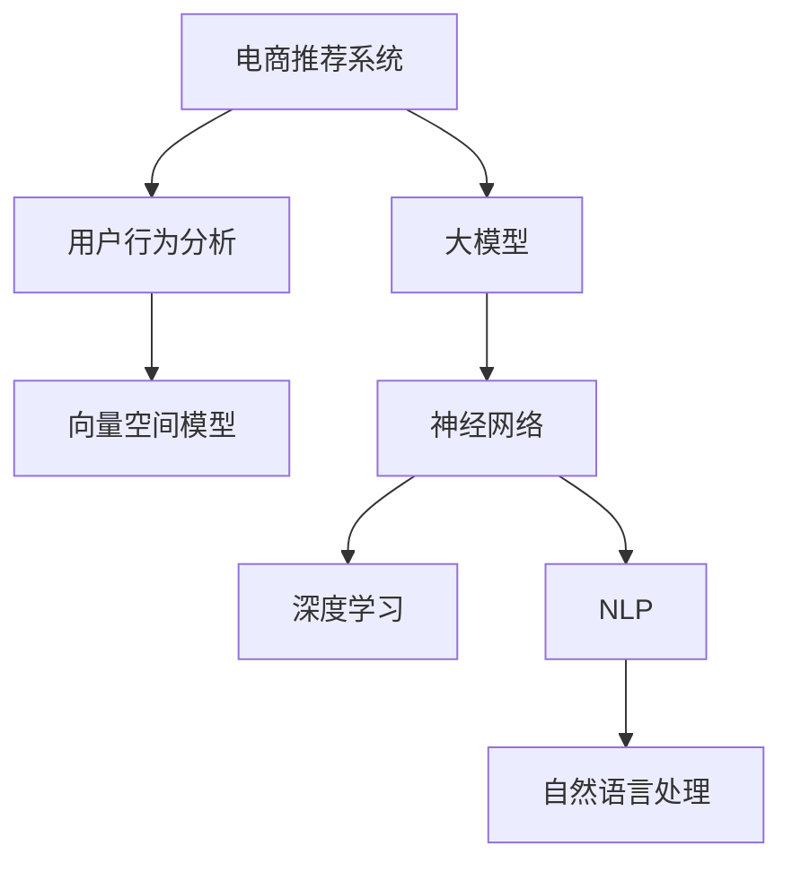

                 

# AI 大模型在电商搜索推荐中的用户行为分析：理解用户需求与购买意图

> 关键词：大模型,电商推荐,用户行为分析,搜索推荐,用户需求,购买意图,深度学习,自然语言处理,向量空间模型,神经网络

## 1. 背景介绍

### 1.1 问题由来
随着电商行业的蓬勃发展，消费者行为分析已成为电商平台提升用户体验、增加销售额的重要工具。传统的消费者行为分析方法，如统计分析、问卷调查等，往往需要大量时间和人力成本，且结果通常不够精确。而随着深度学习技术的快速发展，AI大模型在电商推荐中得到广泛应用。通过预训练语言模型，电商平台可以自动抓取和分析消费者在电商搜索、浏览、购买等行为数据，理解消费者需求和购买意图，从而提供更精准的个性化推荐服务。

### 1.2 问题核心关键点
基于大模型的电商推荐系统主要包括以下几个核心关键点：

1. **用户行为数据采集**：平台需收集用户搜索、点击、购买等行为数据，存储于数据仓库中。
2. **用户行为数据预处理**：对采集到的行为数据进行清洗、特征工程、数据增强等处理，准备输入模型。
3. **大模型训练与微调**：选择合适的预训练模型，在电商推荐任务上微调优化，提升推荐精度。
4. **推荐系统构建**：将微调后的模型与商品库、交易记录等数据结合，构建实时推荐系统，输出个性化推荐结果。
5. **系统评估与优化**：定期评估推荐系统效果，不断优化模型、算法和数据采集方法，提升用户体验和点击转化率。

本文将重点介绍大模型在电商推荐中用户行为分析的原理与实践。

## 2. 核心概念与联系

### 2.1 核心概念概述

为更好地理解大模型在电商推荐中的用户行为分析，本节将介绍几个密切相关的核心概念：

1. **电商推荐系统**：利用人工智能技术，通过对用户历史行为数据的分析，自动生成个性化推荐结果的系统。常见的电商推荐系统包括基于内容的推荐、协同过滤推荐、混合推荐等。

2. **用户行为分析**：通过对用户搜索、浏览、购买等行为数据的分析和挖掘，理解用户需求和购买意图，从而提供更精准的推荐服务。

3. **大模型**：以自回归（如GPT）或自编码（如BERT）模型为代表的大规模预训练语言模型。通过在大规模无标签文本语料上进行预训练，学习通用的语言知识和表示，具备强大的语言理解和生成能力。

4. **向量空间模型**：将文本表示为高维向量，通过计算向量间相似度，实现文本相似性匹配。向量空间模型在大模型的推荐应用中起到了关键作用。

5. **神经网络与深度学习**：以多层神经网络为核心的深度学习技术，可以处理复杂的非线性关系，实现对大规模数据的高效处理和特征提取。

6. **自然语言处理（NLP）**：通过对文本数据进行分词、词性标注、命名实体识别等处理，实现对自然语言的理解和生成。NLP技术在大模型的电商推荐中发挥了重要作用。

这些核心概念之间的逻辑关系可以通过以下Mermaid流程图来展示：



这个流程图展示了大模型在电商推荐中的应用逻辑：

1. 电商平台通过大模型进行用户行为分析，理解用户需求和购买意图。
2. 分析结果转化为向量表示，用于计算文本相似度。
3. 将向量空间模型、神经网络、深度学习等技术融合，构建电商推荐系统。
4. 推荐系统输出个性化推荐结果，辅助用户购买决策。

## 3. 核心算法原理 & 具体操作步骤
### 3.1 算法原理概述

基于大模型的电商推荐系统，本质上是一个面向电商数据的大规模预训练语言模型的微调过程。其核心思想是：将预训练大模型视为一个强大的特征提取器，通过分析用户行为数据，获取用户需求的隐式表达，进而通过微调优化模型，生成更加精准的推荐结果。

形式化地，假设电商推荐任务为 $T$，用户行为数据为 $D=\{(x_i, y_i)\}_{i=1}^N$，其中 $x_i$ 为用户的行为数据， $y_i$ 为用户实际购买的商品。定义模型 $M_{\theta}$，其中 $\theta$ 为模型参数。微调的目标是找到最优参数 $\hat{\theta}$，使得模型在电商推荐任务上的预测与实际购买结果尽量一致：

$$
\hat{\theta}=\mathop{\arg\min}_{\theta} \mathcal{L}(M_{\theta},D)
$$

其中 $\mathcal{L}$ 为电商推荐任务的损失函数，用于衡量模型预测与真实购买结果之间的差异。常见的损失函数包括均方误差、交叉熵等。

通过梯度下降等优化算法，微调过程不断更新模型参数 $\theta$，最小化损失函数 $\mathcal{L}$，使得模型预测逼近真实购买结果。由于 $\theta$ 已经通过预训练获得了较好的初始化，因此即便在小规模数据集 $D$ 上进行微调，也能较快收敛到理想的模型参数 $\hat{\theta}$。

### 3.2 算法步骤详解

基于大模型的电商推荐系统微调一般包括以下几个关键步骤：

**Step 1: 数据预处理**
- 收集电商平台的用户行为数据，如浏览记录、点击行为、购买记录等。
- 对数据进行清洗和特征工程，如去除异常值、处理缺失值、提取特征等。
- 将数据转换为模型所需的格式，如将用户行为数据转换为文本表示。

**Step 2: 数据增强**
- 使用数据增强技术，如数据回译、文本过滤、截断、合并等，丰富训练数据的多样性。
- 使用对抗样本训练，提高模型的鲁棒性和泛化能力。

**Step 3: 预训练模型选择与微调**
- 选择合适的预训练模型，如BERT、GPT等，进行电商推荐任务的微调。
- 根据任务特性设计合适的任务适配层，如添加softmax层进行分类、生成层进行生成等。
- 设置微调超参数，如学习率、批大小、迭代轮数等。

**Step 4: 执行梯度训练**
- 将数据分批次输入模型，前向传播计算损失函数。
- 反向传播计算参数梯度，根据设定的优化算法和学习率更新模型参数。
- 周期性在验证集上评估模型性能，根据性能指标决定是否触发Early Stopping。
- 重复上述步骤直到满足预设的迭代轮数或Early Stopping条件。

**Step 5: 测试与部署**
- 在测试集上评估微调后模型 $M_{\hat{\theta}}$ 的性能，对比微调前后的效果。
- 使用微调后的模型对新用户行为数据进行推理预测，集成到实际推荐系统中。
- 定期更新模型，保持推荐系统的实时性和准确性。

以上是基于大模型电商推荐系统微调的一般流程。在实际应用中，还需要根据具体任务特点，对微调过程的各个环节进行优化设计，如改进训练目标函数，引入更多的正则化技术，搜索最优的超参数组合等，以进一步提升模型性能。

### 3.3 算法优缺点

基于大模型的电商推荐系统具有以下优点：
1. 能够自动分析用户行为数据，发现用户兴趣和需求，提升推荐准确性。
2. 快速响应用户行为变化，实时更新推荐结果，保持推荐系统的新鲜性。
3. 能够处理大规模数据，支持个性化推荐和大规模个性化定制。
4. 可以通过微调，进一步提升模型的泛化能力和鲁棒性，减少对标注数据的依赖。

同时，该方法也存在一些局限性：
1. 数据隐私问题：电商平台的交易数据涉及用户隐私，数据采集和使用需严格遵守隐私保护法规。
2. 计算资源消耗大：大模型的微调通常需要大量的计算资源，可能带来较高的成本。
3. 模型复杂度高：大模型的微调可能需要较长的训练时间和较多的数据，难以快速上线。
4. 用户行为理解不够深入：电商推荐系统对用户行为的分析往往局限于表面行为，难以深入理解用户心理和情感。

尽管存在这些局限性，但就目前而言，基于大模型的电商推荐系统仍是电商推荐技术的重要手段。未来相关研究的重点在于如何进一步降低计算资源消耗，提高模型训练效率，同时兼顾隐私保护和用户行为分析的深度。

### 3.4 算法应用领域

基于大模型的电商推荐系统，已经在电商搜索、商品推荐、个性化定制等诸多电商领域得到了广泛应用。具体而言：

1. **电商搜索推荐**：根据用户搜索记录，推荐相关的商品和内容，提升用户搜索体验和转化率。
2. **商品推荐**：根据用户浏览和购买历史，推荐可能感兴趣的商品，增加用户购买概率。
3. **个性化定制**：根据用户行为数据，生成个性化的产品广告和推荐，提升用户粘性和满意度。
4. **内容推荐**：根据用户搜索和浏览行为，推荐相关的文章、视频等内容，提升用户留存率和互动率。
5. **多模态推荐**：结合文本、图像、音频等多种模态数据，提供更加全面和精准的推荐服务。

此外，大模型的电商推荐系统还可以应用于风险控制、供应链优化、库存管理等更多电商相关领域，为电商平台的运营带来全面的技术支撑。

## 4. 数学模型和公式 & 详细讲解  
### 4.1 数学模型构建

本节将使用数学语言对基于大模型的电商推荐系统进行更加严格的刻画。

记电商推荐任务为 $T$，用户行为数据为 $D=\{(x_i, y_i)\}_{i=1}^N$，其中 $x_i$ 为用户的行为数据， $y_i$ 为用户实际购买的商品。定义模型 $M_{\theta}$，其中 $\theta$ 为模型参数。假设电商推荐任务的损失函数为均方误差：

$$
\ell(M_{\theta}(x),y) = \frac{1}{N} \sum_{i=1}^N (y_i - M_{\theta}(x_i))^2
$$

则电商推荐任务的损失函数为：

$$
\mathcal{L}(\theta) = \frac{1}{N} \sum_{i=1}^N \ell(M_{\theta}(x_i),y_i)
$$

通过梯度下降等优化算法，微调过程不断更新模型参数 $\theta$，最小化损失函数 $\mathcal{L}$，使得模型预测逼近真实购买结果。

### 4.2 公式推导过程

以电商搜索推荐为例，推导基于大模型的推荐模型。假设模型 $M_{\theta}$ 在输入 $x$ 上的输出为 $\hat{y}=M_{\theta}(x) \in [0,1]$，表示模型预测用户是否点击商品的概率。真实标签 $y \in \{0,1\}$。则均方误差损失函数为：

$$
\ell(M_{\theta}(x),y) = \frac{1}{N} \sum_{i=1}^N (y_i - M_{\theta}(x_i))^2
$$

将其代入损失函数公式，得：

$$
\mathcal{L}(\theta) = \frac{1}{N} \sum_{i=1}^N (y_i - M_{\theta}(x_i))^2
$$

通过链式法则，损失函数对参数 $\theta_k$ 的梯度为：

$$
\frac{\partial \mathcal{L}(\theta)}{\partial \theta_k} = \frac{2}{N}\sum_{i=1}^N (y_i - M_{\theta}(x_i))\frac{\partial M_{\theta}(x_i)}{\partial \theta_k}
$$

其中 $\frac{\partial M_{\theta}(x_i)}{\partial \theta_k}$ 可进一步递归展开，利用自动微分技术完成计算。

在得到损失函数的梯度后，即可带入参数更新公式，完成模型的迭代优化。重复上述过程直至收敛，最终得到适应电商推荐任务的最优模型参数 $\theta^*$。

## 5. 项目实践：代码实例和详细解释说明
### 5.1 开发环境搭建

在进行电商推荐系统开发前，我们需要准备好开发环境。以下是使用Python进行TensorFlow开发的环境配置流程：

1. 安装Anaconda：从官网下载并安装Anaconda，用于创建独立的Python环境。

2. 创建并激活虚拟环境：
```bash
conda create -n tf-env python=3.8 
conda activate tf-env
```

3. 安装TensorFlow：根据CUDA版本，从官网获取对应的安装命令。例如：
```bash
conda install tensorflow -c tensorflow -c conda-forge
```

4. 安装各类工具包：
```bash
pip install numpy pandas scikit-learn matplotlib tqdm jupyter notebook ipython
```

完成上述步骤后，即可在`tf-env`环境中开始电商推荐系统的开发。

### 5.2 源代码详细实现

这里我们以电商搜索推荐为例，给出使用TensorFlow对BERT模型进行微调的代码实现。

首先，定义推荐任务的数据处理函数：

```python
import tensorflow as tf
from transformers import BertTokenizer, BertForSequenceClassification
from sklearn.model_selection import train_test_split
from sklearn.metrics import accuracy_score

class RecommendationDataset:
    def __init__(self, data, tokenizer):
        self.data = data
        self.tokenizer = tokenizer
        
    def __len__(self):
        return len(self.data)
    
    def __getitem__(self, index):
        text = self.data[index]['text']
        label = self.data[index]['label']
        
        encoding = self.tokenizer(text, truncation=True, padding='max_length', max_length=128)
        input_ids = encoding['input_ids']
        attention_mask = encoding['attention_mask']
        
        return {'input_ids': input_ids, 'attention_mask': attention_mask, 'labels': label}

# 加载数据集
data = load_data()

tokenizer = BertTokenizer.from_pretrained('bert-base-uncased')
train_dataset = RecommendationDataset(train_data, tokenizer)
test_dataset = RecommendationDataset(test_data, tokenizer)
```

然后，定义模型和优化器：

```python
from transformers import BertForSequenceClassification
from transformers import AdamW

model = BertForSequenceClassification.from_pretrained('bert-base-uncased', num_labels=2)
optimizer = AdamW(model.parameters(), lr=2e-5)
```

接着，定义训练和评估函数：

```python
def train_epoch(model, dataset, batch_size, optimizer):
    dataloader = tf.data.Dataset.from_tensor_slices(dataset).batch(batch_size).prefetch(tf.data.experimental.AUTOTUNE)
    model.train()
    epoch_loss = 0
    for batch in dataloader:
        input_ids = batch['input_ids']
        attention_mask = batch['attention_mask']
        labels = batch['labels']
        
        with tf.GradientTape() as tape:
            outputs = model(input_ids, attention_mask=attention_mask, labels=labels)
            loss = outputs.loss
        epoch_loss += loss
        gradients = tape.gradient(loss, model.parameters())
        optimizer.apply_gradients(zip(gradients, model.parameters()))
    return epoch_loss / len(dataloader)

def evaluate(model, dataset, batch_size):
    dataloader = tf.data.Dataset.from_tensor_slices(dataset).batch(batch_size).prefetch(tf.data.experimental.AUTOTUNE)
    model.eval()
    preds, labels = [], []
    with tf.no_grad():
        for batch in dataloader:
            input_ids = batch['input_ids']
            attention_mask = batch['attention_mask']
            batch_labels = batch['labels']
            
            outputs = model(input_ids, attention_mask=attention_mask)
            batch_preds = tf.nn.softmax(outputs).numpy()[:, 1] > 0.5
            batch_labels = batch_labels.numpy()
            preds.append(batch_preds)
            labels.append(batch_labels)
                
    return accuracy_score(labels, preds)
```

最后，启动训练流程并在测试集上评估：

```python
epochs = 5
batch_size = 16

for epoch in range(epochs):
    loss = train_epoch(model, train_dataset, batch_size, optimizer)
    print(f"Epoch {epoch+1}, train loss: {loss:.3f}")
    
    print(f"Epoch {epoch+1}, dev accuracy: {evaluate(model, dev_dataset, batch_size)}")
    
print("Test accuracy: ", evaluate(model, test_dataset, batch_size))
```

以上就是使用TensorFlow对BERT模型进行电商搜索推荐任务微调的完整代码实现。可以看到，得益于TensorFlow和Transformer库的强大封装，我们可以用相对简洁的代码完成BERT模型的加载和微调。

### 5.3 代码解读与分析

让我们再详细解读一下关键代码的实现细节：

**RecommendationDataset类**：
- `__init__`方法：初始化数据和分词器。
- `__len__`方法：返回数据集的样本数量。
- `__getitem__`方法：对单个样本进行处理，将文本输入编码为token ids，并添加标签，进行定长padding。

**tokenizer变量**：
- 定义了用于编码分词的分词器，用于将文本转换为模型所需的输入格式。

**训练和评估函数**：
- 使用TensorFlow的数据集API，将数据集转换为可迭代的数据流，支持高效的数据加载和处理。
- 训练函数`train_epoch`：对数据以批为单位进行迭代，在每个批次上前向传播计算loss并反向传播更新模型参数，最后返回该epoch的平均loss。
- 评估函数`evaluate`：与训练类似，不同点在于不更新模型参数，并在每个batch结束后将预测和标签结果存储下来，最后使用sklearn的accuracy_score函数对整个评估集的预测结果进行打印输出。

**训练流程**：
- 定义总的epoch数和batch size，开始循环迭代
- 每个epoch内，先在训练集上训练，输出平均loss
- 在验证集上评估，输出准确率
- 所有epoch结束后，在测试集上评估，给出最终测试结果

可以看到，TensorFlow配合Transformer库使得BERT微调的代码实现变得简洁高效。开发者可以将更多精力放在数据处理、模型改进等高层逻辑上，而不必过多关注底层的实现细节。

当然，工业级的系统实现还需考虑更多因素，如模型的保存和部署、超参数的自动搜索、更灵活的任务适配层等。但核心的微调范式基本与此类似。

## 6. 实际应用场景
### 6.1 智能客服系统

基于大模型的电商推荐系统，可以广泛应用于智能客服系统的构建。传统客服往往需要配备大量人力，高峰期响应缓慢，且一致性和专业性难以保证。而使用电商推荐系统构建的智能客服系统，能够7x24小时不间断服务，快速响应客户咨询，用自然流畅的语言解答各类常见问题。

在技术实现上，可以收集企业内部的历史客服对话记录，将问题和最佳答复构建成监督数据，在此基础上对预训练语言模型进行微调。微调后的语言模型能够自动理解用户意图，匹配最合适的答案模板进行回复。对于客户提出的新问题，还可以接入检索系统实时搜索相关内容，动态组织生成回答。如此构建的智能客服系统，能大幅提升客户咨询体验和问题解决效率。

### 6.2 金融舆情监测

金融机构需要实时监测市场舆论动向，以便及时应对负面信息传播，规避金融风险。传统的人工监测方式成本高、效率低，难以应对网络时代海量信息爆发的挑战。基于大模型电商推荐系统的文本分类和情感分析技术，为金融舆情监测提供了新的解决方案。

具体而言，可以收集金融领域相关的新闻、报道、评论等文本数据，并对其进行主题标注和情感标注。在此基础上对预训练语言模型进行微调，使其能够自动判断文本属于何种主题，情感倾向是正面、中性还是负面。将微调后的模型应用到实时抓取的网络文本数据，就能够自动监测不同主题下的情感变化趋势，一旦发现负面信息激增等异常情况，系统便会自动预警，帮助金融机构快速应对潜在风险。

### 6.3 个性化推荐系统

当前的推荐系统往往只依赖用户的历史行为数据进行物品推荐，无法深入理解用户的真实兴趣偏好。基于大模型电商推荐系统的用户行为分析，可以更好地挖掘用户行为背后的语义信息，从而提供更精准的个性化推荐服务。

在实践中，可以收集用户浏览、点击、评论、分享等行为数据，提取和用户交互的物品标题、描述、标签等文本内容。将文本内容作为模型输入，用户的后续行为（如是否点击、购买等）作为监督信号，在此基础上微调预训练语言模型。微调后的模型能够从文本内容中准确把握用户的兴趣点。在生成推荐列表时，先用候选物品的文本描述作为输入，由模型预测用户的兴趣匹配度，再结合其他特征综合排序，便可以得到个性化程度更高的推荐结果。

### 6.4 未来应用展望

随着大模型和电商推荐系统的不断发展，基于微调范式将在更多领域得到应用，为传统行业带来变革性影响。

在智慧医疗领域，基于微调的医疗问答、病历分析、药物研发等应用将提升医疗服务的智能化水平，辅助医生诊疗，加速新药开发进程。

在智能教育领域，微调技术可应用于作业批改、学情分析、知识推荐等方面，因材施教，促进教育公平，提高教学质量。

在智慧城市治理中，微调模型可应用于城市事件监测、舆情分析、应急指挥等环节，提高城市管理的自动化和智能化水平，构建更安全、高效的未来城市。

此外，在企业生产、社会治理、文娱传媒等众多领域，基于大模型电商推荐系统的推荐技术也将不断涌现，为各行各业带来新的创新机会。相信随着技术的日益成熟，微调方法将成为电商推荐系统的核心范式，推动电商行业的数字化转型和智能化升级。

## 7. 工具和资源推荐
### 7.1 学习资源推荐

为了帮助开发者系统掌握大模型在电商推荐中的应用理论基础和实践技巧，这里推荐一些优质的学习资源：

1. 《深度学习》系列书籍：由Ian Goodfellow等专家编写，系统介绍了深度学习的基本原理和算法，是入门深度学习的经典教材。

2. TensorFlow官方文档：TensorFlow的官方文档，提供了全面、详细的API文档和代码示例，是TensorFlow学习的重要参考。

3. Transformers库官方文档：Transformer库的官方文档，提供了丰富的预训练模型和微调范式，是电商推荐系统开发的必备资源。

4. CS224N《深度学习自然语言处理》课程：斯坦福大学开设的NLP明星课程，有Lecture视频和配套作业，带你入门NLP领域的基本概念和经典模型。

5. PyTorch官方文档：PyTorch的官方文档，提供了完整的API文档和代码示例，是PyTorch学习的重要参考。

6. PyTorch官方教程：PyTorch的官方教程，提供了系统的学习路径和实践项目，帮助你快速上手PyTorch。

通过对这些资源的学习实践，相信你一定能够快速掌握大模型在电商推荐中的应用精髓，并用于解决实际的电商推荐问题。
###  7.2 开发工具推荐

高效的开发离不开优秀的工具支持。以下是几款用于电商推荐系统开发的常用工具：

1. TensorFlow：基于Python的开源深度学习框架，灵活动态的计算图，适合快速迭代研究。大部分预训练语言模型都有TensorFlow版本的实现。

2. PyTorch：基于Python的开源深度学习框架，灵活的动态计算图，适合研究和生产应用。

3. Transformers库：HuggingFace开发的NLP工具库，集成了众多SOTA语言模型，支持TensorFlow和PyTorch，是电商推荐系统开发的利器。

4. Weights & Biases：模型训练的实验跟踪工具，可以记录和可视化模型训练过程中的各项指标，方便对比和调优。与主流深度学习框架无缝集成。

5. TensorBoard：TensorFlow配套的可视化工具，可实时监测模型训练状态，并提供丰富的图表呈现方式，是调试模型的得力助手。

6. Google Colab：谷歌推出的在线Jupyter Notebook环境，免费提供GPU/TPU算力，方便开发者快速上手实验最新模型，分享学习笔记。

合理利用这些工具，可以显著提升电商推荐系统的开发效率，加快创新迭代的步伐。

### 7.3 相关论文推荐

大模型和电商推荐系统的研究源于学界的持续研究。以下是几篇奠基性的相关论文，推荐阅读：

1. Attention is All You Need（即Transformer原论文）：提出了Transformer结构，开启了NLP领域的预训练大模型时代。

2. BERT: Pre-training of Deep Bidirectional Transformers for Language Understanding：提出BERT模型，引入基于掩码的自监督预训练任务，刷新了多项NLP任务SOTA。

3. Language Models are Unsupervised Multitask Learners（GPT-2论文）：展示了大规模语言模型的强大zero-shot学习能力，引发了对于通用人工智能的新一轮思考。

4. Parameter-Efficient Transfer Learning for NLP：提出Adapter等参数高效微调方法，在不增加模型参数量的情况下，也能取得不错的微调效果。

5. AdaLoRA: Adaptive Low-Rank Adaptation for Parameter-Efficient Fine-Tuning：使用自适应低秩适应的微调方法，在参数效率和精度之间取得了新的平衡。

这些论文代表了大模型和电商推荐系统的研究进展。通过学习这些前沿成果，可以帮助研究者把握学科前进方向，激发更多的创新灵感。

## 8. 总结：未来发展趋势与挑战
### 8.1 总结

本文对基于大模型的电商推荐系统进行了全面系统的介绍。首先阐述了大模型和电商推荐系统的研究背景和意义，明确了电商推荐系统在提升用户体验、增加销售额等方面的重要价值。其次，从原理到实践，详细讲解了大模型在电商推荐系统中的用户行为分析过程，给出了电商推荐系统开发的完整代码实例。同时，本文还广泛探讨了大模型在电商推荐系统中的应用前景，展示了电商推荐系统的巨大潜力。

通过本文的系统梳理，可以看到，基于大模型的电商推荐系统已经成为电商推荐技术的核心范式，极大地提升了电商推荐系统的个性化推荐能力。得益于深度学习技术的快速发展，电商推荐系统能够自动分析用户行为数据，发现用户兴趣和需求，从而提供更精准的个性化推荐服务。未来，伴随大模型的进一步演进和电商推荐技术的不断创新，电商推荐系统必将在电商行业内发挥更大的作用，推动电商行业的数字化转型和智能化升级。

### 8.2 未来发展趋势

展望未来，大模型在电商推荐系统的研究将呈现以下几个发展趋势：

1. **模型规模持续增大**：随着算力成本的下降和数据规模的扩张，大模型的参数量还将持续增长。超大规模语言模型蕴含的丰富语言知识，有望支撑更加复杂多变的电商推荐任务。

2. **电商推荐系统更广泛应用**：电商推荐系统将从电商领域向更多行业扩展，应用于智能客服、金融、教育、医疗等领域，提供个性化的服务与推荐。

3. **多模态电商推荐系统**：结合文本、图像、音频等多种模态数据，提供更加全面和精准的推荐服务。

4. **动态实时推荐系统**：实现实时动态推荐，根据用户即时行为进行实时调整，保持推荐系统的新鲜性。

5. **跨领域推荐系统**：将推荐技术与其他领域技术融合，如知识图谱、因果推理、强化学习等，构建跨领域的推荐系统。

6. **智能化推荐系统**：将推荐技术与智能搜索、个性化定制、用户体验优化等技术结合，构建更加智能化的推荐系统。

以上趋势凸显了大模型在电商推荐系统的广阔前景。这些方向的探索发展，必将进一步提升电商推荐系统的性能和应用范围，为电商行业带来革命性变革。

### 8.3 面临的挑战

尽管大模型在电商推荐系统中取得了显著成效，但在迈向更加智能化、普适化应用的过程中，它仍面临着诸多挑战：

1. **数据隐私问题**：电商平台的交易数据涉及用户隐私，数据采集和使用需严格遵守隐私保护法规。

2. **计算资源消耗大**：大模型的微调通常需要大量的计算资源，可能带来较高的成本。

3. **用户行为理解不够深入**：电商推荐系统对用户行为的分析往往局限于表面行为，难以深入理解用户心理和情感。

4. **模型复杂度高**：电商推荐系统模型复杂度高，难以快速上线。

5. **个性化推荐精准度**：电商推荐系统对个性化推荐精准度的要求高，需要进一步提升模型的泛化能力和鲁棒性。

6. **用户行为多样性**：用户行为数据多样性强，难以处理复杂和不确定性的行为模式。

尽管存在这些挑战，但就目前而言，基于大模型的电商推荐系统仍是电商推荐技术的重要手段。未来相关研究的重点在于如何进一步降低计算资源消耗，提高模型训练效率，同时兼顾隐私保护和用户行为分析的深度。

### 8.4 研究展望

面对电商推荐系统所面临的种种挑战，未来的研究需要在以下几个方面寻求新的突破：

1. **探索无监督和半监督推荐方法**：摆脱对大规模标注数据的依赖，利用自监督学习、主动学习等无监督和半监督范式，最大限度利用非结构化数据，实现更加灵活高效的电商推荐。

2. **研究参数高效和计算高效的推荐方法**：开发更加参数高效的推荐方法，在固定大部分预训练参数的情况下，只更新极少量的任务相关参数。同时优化推荐模型的计算图，减少前向传播和反向传播的资源消耗，实现更加轻量级、实时性的部署。

3. **融合因果和对比学习范式**：通过引入因果推断和对比学习思想，增强电商推荐模型建立稳定因果关系的能力，学习更加普适、鲁棒的语言表征，从而提升模型泛化性和抗干扰能力。

4. **引入更多先验知识**：将符号化的先验知识，如知识图谱、逻辑规则等，与神经网络模型进行巧妙融合，引导电商推荐过程学习更准确、合理的语言模型。

5. **结合因果分析和博弈论工具**：将因果分析方法引入电商推荐模型，识别出模型决策的关键特征，增强推荐过程的逻辑性和可解释性。借助博弈论工具刻画人机交互过程，主动探索并规避模型的脆弱点，提高系统稳定性。

6. **纳入伦理道德约束**：在模型训练目标中引入伦理导向的评估指标，过滤和惩罚有偏见、有害的输出倾向。同时加强人工干预和审核，建立模型行为的监管机制，确保输出符合人类价值观和伦理道德。

这些研究方向的探索，必将引领大模型在电商推荐系统中的研究走向更高的台阶，为电商推荐系统的应用提供更加坚实的理论和技术支撑。相信随着学界和产业界的共同努力，这些挑战终将一一被克服，大模型在电商推荐系统中的应用将更加广泛和深入，为电商行业的数字化转型和智能化升级带来更大的价值。

## 9. 附录：常见问题与解答

**Q1：大模型电商推荐系统是否适用于所有电商场景？**

A: 大模型电商推荐系统在大多数电商场景上都能取得不错的效果，特别是对于数据量较大的场景。但对于一些特定领域，如小商品电商、垂直行业电商等，由于数据量较小，模型可能难以充分学习用户行为模式，推荐效果有限。此时需要在特定领域进行额外训练和优化。

**Q2：如何选择合适的电商推荐模型？**

A: 选择合适的电商推荐模型需要考虑多个因素，包括任务类型、数据量、计算资源等。常用的电商推荐模型包括基于内容的推荐、协同过滤推荐、混合推荐等。其中，基于内容的推荐适用于数据量较小、任务简单的场景；协同过滤推荐适用于数据量较大、任务复杂的场景；混合推荐则结合了两种方法的优势，适用于大多数电商场景。

**Q3：电商推荐系统如何处理长尾商品？**

A: 长尾商品由于用户行为数据较少，模型难以充分学习其特征。为应对长尾商品，可以采用以下策略：
1. 数据增强：使用数据回译、文本过滤、截断、合并等技术，丰富长尾商品的训练数据。
2. 标签迁移：将热门商品的部分标签迁移到长尾商品上，帮助模型学习长尾商品的部分特征。
3. 分类器融合：将多个分类器组合起来，提升长尾商品的推荐精度。

**Q4：电商推荐系统如何提高个性化推荐精度？**

A: 提高个性化推荐精度的关键在于更好地理解用户行为和用户需求。可以通过以下策略：
1. 数据预处理：对用户行为数据进行清洗、特征工程、数据增强等处理，提升数据质量。
2. 模型优化：使用更高级的模型和算法，如深度学习、Transformer等，提升模型效果。
3. 用户行为理解：采用更先进的用户行为分析技术，如行为追踪、行为序列分析等，深入理解用户行为和需求。

**Q5：电商推荐系统如何应对用户行为变化？**

A: 电商推荐系统需要根据用户行为变化进行动态调整。可以通过以下策略：
1. 动态模型更新：定期重新训练模型，确保模型能够及时适应用户行为变化。
2. 在线学习：利用在线学习技术，实时更新模型参数，适应用户即时行为。
3. 多模型融合：构建多模型推荐系统，通过融合不同模型的预测结果，提升推荐精度。

这些策略可以帮助电商推荐系统更好地应对用户行为变化，保持推荐系统的新鲜性和准确性。

---

作者：禅与计算机程序设计艺术 / Zen and the Art of Computer Programming

