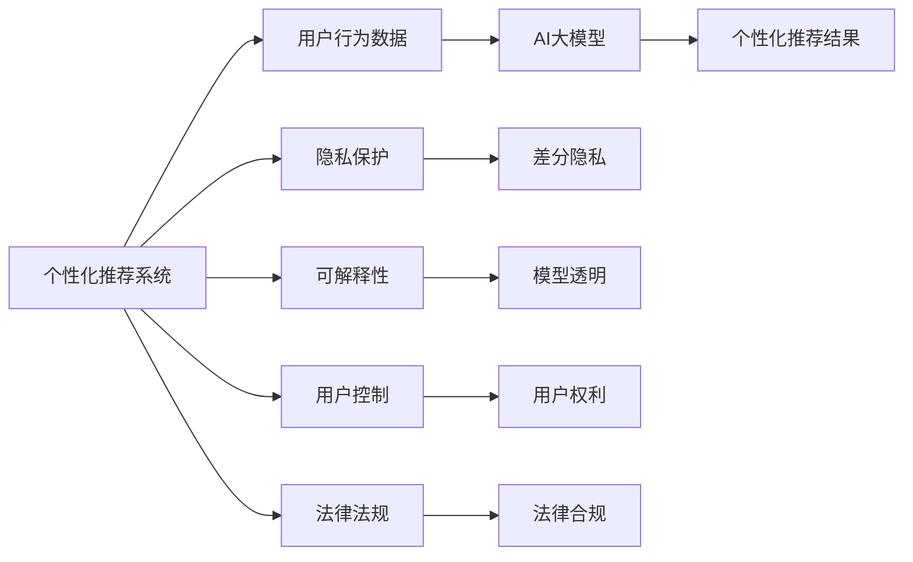

                 

# AI 大模型在电商搜索推荐中的用户隐私保护：平衡推荐效果与用户权利

## 1. 背景介绍

### 1.1 问题由来
随着电商平台的迅猛发展，用户体验的个性化推荐系统已成为提升用户满意度和转化率的关键因素。推荐系统通过大数据和AI技术，从用户行为数据中挖掘出潜在的兴趣和需求，精准匹配产品，极大地提高了购物效率。然而，在推荐过程中，用户隐私保护成为了一个重要课题。电商平台需要平衡推荐效果和用户权利，既要充分利用用户数据进行个性化推荐，又要保证用户信息的安全和隐私。

### 1.2 问题核心关键点
- **数据隐私**：推荐系统中大量涉及用户隐私数据，如何在保护用户隐私的同时，获取足够的用户信息进行个性化推荐？
- **模型透明**：推荐系统的决策逻辑是否透明，用户是否能够了解和信任推荐结果的来源？
- **用户控制**：用户是否能够有效控制自己的数据使用和推荐结果展示，享受自主选择的权利？
- **法律合规**：电商平台如何遵守相关的法律法规，保护用户隐私和数据安全？

这些关键问题迫切需要研究者在技术层面提出有效的解决方案，以实现推荐效果与用户权利的平衡。

### 1.3 问题研究意义
保障用户隐私和权利，是电商平台实现可持续发展的基础。通过引入隐私保护机制，不仅能提升用户信任，还能增强用户黏性和忠诚度。这不仅关乎平台的商业成功，更是承担社会责任的体现。因此，在AI大模型中探讨用户隐私保护问题，对于构建健康、公正、可持续的电商推荐系统，具有重要的理论和实际意义。

## 2. 核心概念与联系

### 2.1 核心概念概述

本节将介绍几个核心的相关概念：

- **个性化推荐系统(Recommendation System)**：利用用户历史行为数据和偏好，通过机器学习算法向用户推荐可能感兴趣的商品或内容，提升用户体验和转化率。

- **隐私保护(P隐私保护)**：保护用户数据的安全，避免数据泄露、滥用和滥用。常见的隐私保护技术包括差分隐私、联邦学习、加密计算等。

- **可解释性(Explainability)**：推荐系统需要具备一定的透明度，用户能够理解推荐结果的生成过程，从而信任推荐系统的决策。

- **用户控制(User Control)**：用户有权控制自己的数据使用方式和推荐结果展示，包括数据隐私设置、推荐偏好设置等。

- **法律法规(Legal & Regulatory Compliance)**：电商平台需要遵守相关的隐私保护法律法规，如GDPR、CCPA等，确保用户数据的使用符合法律要求。

这些核心概念之间的逻辑关系可以通过以下Mermaid流程图来展示：



该流程图展示了个性化推荐系统的工作流程及其与隐私保护、可解释性、用户控制和法律法规之间的关系。

## 3. 核心算法原理 & 具体操作步骤

### 3.1 算法原理概述

个性化推荐系统通常使用AI大模型，通过学习用户历史行为数据，预测用户对不同商品的偏好。然而，这种学习过程不可避免地涉及大量用户隐私数据，需要采取隐私保护措施。同时，为了满足用户隐私保护的需求，推荐系统需要具备一定的可解释性和用户控制能力。

### 3.2 算法步骤详解

#### 3.2.1 数据预处理与隐私保护
- **匿名化(Anonymization)**：对用户行为数据进行匿名化处理，去除或模糊化用户的身份信息，以降低数据泄露风险。
- **差分隐私(Differential Privacy)**：在推荐模型训练过程中，加入一定的随机噪声，使得单个用户的数据泄露对模型输出影响极小，从而保护用户隐私。

#### 3.2.2 模型训练与隐私保护
- **联邦学习(Federated Learning)**：将模型训练任务分配给多个分布式节点，每个节点仅上传本地数据参数而非原始数据，减少数据泄露风险。
- **加密计算(Encrypted Computation)**：在推荐模型训练和推理过程中，使用加密算法保护数据的安全，防止中间过程数据泄露。

#### 3.2.3 推荐结果生成与隐私保护
- **隐私推荐(Privacy-aware Recommendation)**：在推荐结果生成阶段，使用隐私保护技术，如多臂老虎机算法(MAB)，在保护用户隐私的同时，生成个性化推荐。

#### 3.2.4 用户控制与隐私保护
- **用户数据控制(User Data Control)**：提供用户数据隐私设置选项，让用户能够控制自己的数据使用方式，如隐私设置、数据导出等。
- **推荐结果控制(Recommendation Control)**：让用户能够选择接收或隐藏推荐结果，保护用户不被过度推荐。

### 3.3 算法优缺点

**优点**：

- **保护用户隐私**：通过匿名化、差分隐私等技术，有效保护用户数据安全，防止数据泄露和滥用。
- **提升推荐效果**：联邦学习和加密计算等技术，能够在保护隐私的同时，提升推荐模型的性能和鲁棒性。
- **增强用户控制**：通过用户隐私设置和推荐结果控制，提升用户对推荐系统的信任和满意度。

**缺点**：

- **计算复杂**：差分隐私和加密计算等技术，增加了计算复杂度，可能导致推荐系统响应速度下降。
- **数据质量**：匿名化处理可能导致数据质量下降，影响模型性能。
- **技术实现**：隐私保护和用户控制需要复杂的技术实现，对平台技术能力要求较高。

### 3.4 算法应用领域

个性化推荐系统在电商领域具有广泛的应用，包括商品推荐、内容推荐、用户行为分析等。隐私保护和用户控制机制，使其能够在不牺牲推荐效果的前提下，保护用户隐私，增强用户信任和满意度。

## 4. 数学模型和公式 & 详细讲解 & 举例说明

### 4.1 数学模型构建

本节将介绍推荐系统的数学模型及其隐私保护技术。

假设推荐系统从用户历史行为数据中学习到模型参数 $\theta$，并将参数 $\theta$ 应用于新商品 $x$，预测用户对商品 $x$ 的偏好 $y$。推荐模型的目标是最大化模型在训练集上的性能指标，如均方误差：

$$
\min_\theta \frac{1}{N} \sum_{i=1}^N (y_i - M_{\theta}(x_i))^2
$$

其中 $M_{\theta}(x_i)$ 为模型对商品 $x_i$ 的预测偏好。

在隐私保护方面，推荐模型采用差分隐私技术，通过加入随机噪声来保护用户隐私。差分隐私的目标是在保证模型输出稳定性的同时，最小化单个用户对模型输出的影响。差分隐私的数学定义如下：

$$
\mathcal{L}(\epsilon) = \max_{x_i \neq x_i'} \frac{1}{\delta} \log \frac{1}{\epsilon} 
$$

其中 $\epsilon$ 为差分隐私参数，控制噪声的幅度；$\delta$ 为数据隐私的敏感度。

### 4.2 公式推导过程

在推荐模型中，差分隐私的加入可以通过对模型预测函数进行微调实现。假设模型对商品 $x$ 的预测函数为 $M_{\theta}(x) = f_\theta(x)$，其中 $f_\theta$ 为模型函数。加入差分隐私后的预测函数为：

$$
\hat{y} = f_\theta(x) + \epsilon \cdot \mathcal{N}(0, 1)
$$

其中 $\mathcal{N}(0, 1)$ 为均值为0、方差为1的正态分布随机噪声。

差分隐私参数 $\epsilon$ 和噪声的方差 $Var(\epsilon)$ 需要根据具体的隐私保护需求进行调整。一般而言，差分隐私参数 $\epsilon$ 越小，模型输出的稳定性越高，但隐私保护的强度越弱。

### 4.3 案例分析与讲解

假设我们有一个电商推荐系统，使用基于深度神经网络的模型进行推荐。模型对每个用户的历史行为数据进行学习，预测其对商品的偏好。在进行推荐时，我们将商品 $x$ 作为模型的输入，通过差分隐私技术加入随机噪声 $\epsilon$，得到最终的推荐结果 $\hat{y}$。

案例分析：

1. **数据预处理**：对用户历史行为数据进行匿名化处理，去除或模糊化用户的身份信息。
2. **模型训练**：使用联邦学习技术，将模型训练任务分配给多个分布式节点，每个节点仅上传本地数据参数，减少数据泄露风险。
3. **隐私推荐**：在推荐结果生成阶段，使用多臂老虎机算法，在保护用户隐私的同时，生成个性化推荐。

## 5. 项目实践：代码实例和详细解释说明

### 5.1 开发环境搭建

在进行推荐系统开发前，我们需要准备好开发环境。以下是使用Python进行TensorFlow开发的环境配置流程：

1. 安装Anaconda：从官网下载并安装Anaconda，用于创建独立的Python环境。

2. 创建并激活虚拟环境：
```bash
conda create -n tf-env python=3.8 
conda activate tf-env
```

3. 安装TensorFlow：根据CUDA版本，从官网获取对应的安装命令。例如：
```bash
conda install tensorflow -c tf
```

4. 安装相关的库：
```bash
pip install tensorflow-gpu==2.7.0
pip install tensorflow-addons==0.18.0
pip install keras==2.4.3
pip install scikit-learn==0.24.2
```

完成上述步骤后，即可在`tf-env`环境中开始推荐系统开发。

### 5.2 源代码详细实现

下面我们以电商商品推荐系统为例，给出使用TensorFlow进行差分隐私保护的推荐系统开发的PyTorch代码实现。

首先，定义推荐模型的数据处理函数：

```python
import tensorflow as tf
from tensorflow_addons import privacy
from tensorflow.keras import layers

class RecommendationModel(tf.keras.Model):
    def __init__(self, vocab_size, embedding_dim, hidden_dim):
        super(RecommendationModel, self).__init__()
        self.embedding = layers.Embedding(vocab_size, embedding_dim)
        self.lstm = layers.LSTM(hidden_dim, return_sequences=True)
        self.dense = layers.Dense(1, activation='sigmoid')
    
    def call(self, inputs):
        x = self.embedding(inputs)
        x = self.lstm(x)
        x = self.dense(x)
        return x
```

然后，定义差分隐私模型：

```python
def differential_privacy_model(model, dataset, batch_size, epsilon, delta):
    model.trainable = False
    dp_model = privacy.DifferentialPrivacy(
        model, epsilon=epsilon, delta=delta, noise='gaussian')
    dp_model.compile(loss='mse', optimizer=tf.keras.optimizers.Adam())
    
    train_dataset = tf.data.Dataset.from_tensor_slices((dataset.input, dataset.target))
    train_dataset = train_dataset.shuffle(buffer_size=10000).batch(batch_size)
    
    for epoch in range(10):
        for batch, (x_train, y_train) in enumerate(train_dataset):
            dp_model.train_on_batch(x_train, y_train)
```

最后，启动训练流程并在测试集上评估：

```python
train_dataset = tf.data.Dataset.from_tensor_slices((train_data.input, train_data.target))
train_dataset = train_dataset.shuffle(buffer_size=10000).batch(batch_size)

test_dataset = tf.data.Dataset.from_tensor_slices((test_data.input, test_data.target))
test_dataset = test_dataset.batch(batch_size)

epsilon = 0.01
delta = 0.1

differential_privacy_model(model, train_dataset, batch_size, epsilon, delta)
```

以上就是使用TensorFlow对电商商品推荐系统进行差分隐私保护的完整代码实现。可以看到，借助TensorFlow的隐私保护库，实现差分隐私的推荐系统非常简单。

### 5.3 代码解读与分析

让我们再详细解读一下关键代码的实现细节：

**RecommendationModel类**：
- `__init__`方法：初始化模型的各个层。
- `call`方法：定义模型的前向传播过程。

**differential_privacy_model函数**：
- 将原始模型设为不可训练，防止参数更新。
- 使用`privacy.DifferentialPrivacy`库，对模型进行差分隐私化处理。
- 编译模型，设置损失函数和优化器。
- 定义训练数据集，并设置批次大小。
- 循环训练10个epoch，在每个epoch内对数据集进行迭代，使用`train_on_batch`方法进行训练。

**训练流程**：
- 定义训练数据集和测试数据集。
- 设置差分隐私参数epsilon和delta。
- 调用`differential_privacy_model`函数进行差分隐私化训练。

可以看到，TensorFlow的隐私保护库使得差分隐私的实现变得非常简便。开发者可以将更多精力放在推荐模型的设计优化上，而不必过多关注底层的实现细节。

当然，工业级的系统实现还需考虑更多因素，如模型的保存和部署、超参数的自动搜索、更灵活的任务适配层等。但核心的差分隐私方法基本与此类似。

## 6. 实际应用场景

### 6.1 电商平台

在电商平台中，推荐系统是提升用户体验和交易转化率的关键。利用差分隐私技术，电商平台可以在保护用户隐私的前提下，为用户提供个性化推荐。

**应用场景**：

- **商品推荐**：电商平台根据用户历史浏览和购买记录，使用差分隐私化的推荐模型，预测用户对商品的偏好，生成个性化推荐。
- **内容推荐**：电商平台根据用户浏览网页的行为，使用差分隐私化的推荐模型，推荐可能感兴趣的文章或视频。
- **用户行为分析**：电商平台通过差分隐私化的推荐模型，分析用户行为数据，挖掘潜在的用户兴趣和需求，优化推荐策略。

**解决方案**：

- 使用差分隐私化的推荐模型，保护用户隐私。
- 引入联邦学习技术，将推荐模型训练任务分配给多个分布式节点，每个节点仅上传本地数据参数，减少数据泄露风险。
- 提供用户隐私设置选项，让用户能够控制自己的数据使用方式，如隐私设置、数据导出等。

### 6.2 社交网络

社交网络平台中，推荐系统帮助用户发现兴趣相投的内容和用户。利用差分隐私技术，社交网络平台可以在保护用户隐私的同时，提升推荐效果。

**应用场景**：

- **内容推荐**：社交网络平台根据用户点赞、评论和分享的内容，使用差分隐私化的推荐模型，推荐可能感兴趣的文章或视频。
- **用户推荐**：社交网络平台根据用户的好友关系和互动记录，使用差分隐私化的推荐模型，推荐可能感兴趣的用户。
- **广告推荐**：社交网络平台根据用户的兴趣偏好，使用差分隐私化的推荐模型，推荐可能感兴趣的广告。

**解决方案**：

- 使用差分隐私化的推荐模型，保护用户隐私。
- 引入加密计算技术，保护用户数据在推荐过程中不被泄露。
- 提供用户隐私设置选项，让用户能够控制自己的数据使用方式，如隐私设置、数据导出等。

### 6.3 医疗健康

医疗健康领域需要保护患者隐私，同时提供个性化的医疗推荐服务。利用差分隐私技术，医疗平台可以在保护患者隐私的前提下，提供精准的医疗推荐。

**应用场景**：

- **疾病推荐**：医疗平台根据患者的历史病历和体检记录，使用差分隐私化的推荐模型，推荐可能适合的治疗方案。
- **健康建议**：医疗平台根据患者的健康数据，使用差分隐私化的推荐模型，提供个性化的健康建议。
- **用药推荐**：医疗平台根据患者的用药历史和基因数据，使用差分隐私化的推荐模型，推荐可能适合的药物。

**解决方案**：

- 使用差分隐私化的推荐模型，保护患者隐私。
- 引入多臂老虎机算法，在保护患者隐私的同时，生成个性化推荐。
- 提供患者隐私设置选项，患者能够控制自己的数据使用方式，如隐私设置、数据导出等。

## 7. 工具和资源推荐

### 7.1 学习资源推荐

为了帮助开发者系统掌握推荐系统的隐私保护理论基础和实践技巧，这里推荐一些优质的学习资源：

1. 《推荐系统算法》系列书籍：该书系统介绍了推荐系统的基本算法和隐私保护技术，是推荐系统学习的入门书籍。
2. 《TensorFlow Privacy》书籍：该书介绍了TensorFlow中的隐私保护库，是深度学习开发者了解差分隐私的必备资料。
3. 《Federated Learning for Mobile Health》论文：该论文介绍了联邦学习在移动健康领域的应用，展示了隐私保护在实际应用中的效果。
4. 《Differential Privacy: Theory and Practice》论文：该论文系统介绍了差分隐私的理论和实践，是隐私保护领域的经典文献。
5. 《Recommendation Systems with Privacy》视频课程：由斯坦福大学开设的推荐系统课程，涵盖推荐系统隐私保护的最新研究成果。

通过对这些资源的学习实践，相信你一定能够快速掌握推荐系统隐私保护的精髓，并用于解决实际的推荐问题。

### 7.2 开发工具推荐

高效的开发离不开优秀的工具支持。以下是几款用于推荐系统隐私保护开发的常用工具：

1. TensorFlow：基于Python的开源深度学习框架，灵活动态的计算图，适合快速迭代研究。

2. PyTorch：基于Python的开源深度学习框架，灵活的动态图，适合学术研究和工业应用。

3. TensorFlow Privacy：TensorFlow配套的隐私保护库，提供了丰富的隐私保护算法和工具。

4. Keras：基于TensorFlow的高级神经网络API，适合快速搭建和调试推荐模型。

5. Weights & Biases：模型训练的实验跟踪工具，可以记录和可视化模型训练过程中的各项指标，方便对比和调优。

6. Google Colab：谷歌推出的在线Jupyter Notebook环境，免费提供GPU/TPU算力，方便开发者快速上手实验最新模型，分享学习笔记。

合理利用这些工具，可以显著提升推荐系统隐私保护的开发效率，加快创新迭代的步伐。

### 7.3 相关论文推荐

推荐系统的隐私保护技术源于学界的持续研究。以下是几篇奠基性的相关论文，推荐阅读：

1. Differential Privacy: A Systematic Survey（差分隐私综述）：该综述系统介绍了差分隐私的理论和实践，是隐私保护领域的经典文献。
2. Privacy-Aware Recommendation Systems（隐私保护的推荐系统）：该论文介绍了隐私保护技术在推荐系统中的应用，展示了隐私保护的最新进展。
3. Federated Learning in Recommendation Systems（联邦学习在推荐系统中的应用）：该论文介绍了联邦学习在推荐系统中的应用，展示了隐私保护的实际效果。
4. Privacy-Preserving Recommendation Systems：该综述文章系统介绍了推荐系统隐私保护的技术，涵盖了差分隐私、联邦学习、加密计算等多种方法。
5. Privacy-Aware Collaborative Filtering（隐私保护的协同过滤）：该论文介绍了隐私保护技术在协同过滤推荐系统中的应用，展示了隐私保护的最新进展。

这些论文代表了大模型隐私保护的研究方向，通过学习这些前沿成果，可以帮助研究者把握学科前进方向，激发更多的创新灵感。

## 8. 总结：未来发展趋势与挑战

### 8.1 总结

本文对基于差分隐私保护的个性化推荐系统进行了全面系统的介绍。首先阐述了推荐系统与隐私保护的紧密联系，明确了隐私保护在推荐系统中的重要作用。其次，从原理到实践，详细讲解了差分隐私保护的数学原理和关键步骤，给出了推荐系统开发的完整代码实例。同时，本文还广泛探讨了差分隐私保护在电商、社交网络、医疗健康等领域的实际应用场景，展示了差分隐私保护的广泛应用前景。

通过本文的系统梳理，可以看到，差分隐私保护的推荐系统已经在电商、社交网络、医疗健康等领域取得显著成果，为隐私保护和个性化推荐提供了新的解决方案。未来，伴随隐私保护技术的不断演进，推荐系统必将在更多领域大放异彩。

### 8.2 未来发展趋势

展望未来，推荐系统隐私保护技术将呈现以下几个发展趋势：

1. **技术融合**：隐私保护和推荐系统将进一步融合，形成更加智能和高效的推荐系统。例如，差分隐私和对抗训练的结合，可以在保护隐私的同时，提升推荐系统的鲁棒性。
2. **用户参与**：用户将更多地参与到隐私保护和推荐系统设计中，例如通过隐私设置选项，让用户自主控制数据使用方式。
3. **跨领域应用**：隐私保护技术不仅限于电商和社交网络领域，还将广泛应用于医疗健康、金融服务等领域。
4. **多模态融合**：推荐系统将融合多模态数据，如文本、图像、语音等，提供更加全面和准确的推荐。
5. **联邦学习**：联邦学习技术将进一步发展，形成更加安全、高效、分布式的推荐系统。

这些趋势凸显了推荐系统隐私保护技术的广阔前景。这些方向的探索发展，必将进一步提升推荐系统的性能和应用范围，为隐私保护和个性化推荐带来新的突破。

### 8.3 面临的挑战

尽管差分隐私保护的推荐系统已经取得了瞩目成就，但在迈向更加智能化、普适化应用的过程中，它仍面临着诸多挑战：

1. **计算复杂**：差分隐私保护增加了计算复杂度，可能导致推荐系统响应速度下降。
2. **数据质量**：匿名化处理可能导致数据质量下降，影响模型性能。
3. **技术实现**：隐私保护和用户控制需要复杂的技术实现，对平台技术能力要求较高。
4. **用户理解**：用户是否能够理解推荐结果的生成过程，提升用户对推荐系统的信任和满意度。

这些挑战需要研究者不断优化算法和技术，提升隐私保护的效果和推荐系统的性能。

### 8.4 研究展望

面对推荐系统隐私保护所面临的种种挑战，未来的研究需要在以下几个方面寻求新的突破：

1. **优化算法**：开发更加高效的差分隐私算法，在保护隐私的同时，提升推荐系统的响应速度和模型性能。
2. **融合技术**：将隐私保护和推荐系统与其他人工智能技术进行更深入的融合，如知识表示、因果推理、强化学习等。
3. **用户参与**：通过用户参与设计推荐系统，让用户更好地理解和信任隐私保护机制。
4. **跨领域应用**：将隐私保护技术推广到更多领域，如医疗健康、金融服务、物联网等。
5. **联邦学习**：研究更加安全、高效、分布式的联邦学习算法，形成更加智能化的推荐系统。

这些研究方向的探索，必将引领推荐系统隐私保护技术迈向更高的台阶，为构建健康、公正、可持续的推荐系统提供新的解决方案。总之，差分隐私保护的推荐系统需要在技术、应用、用户控制等方面进行全面优化，方能真正实现推荐效果与用户权利的平衡。

## 9. 附录：常见问题与解答

**Q1：推荐系统如何保护用户隐私？**

A: 推荐系统通过差分隐私、联邦学习等隐私保护技术，保护用户数据的安全。具体而言，差分隐私通过加入随机噪声，使得单个用户的数据泄露对模型输出影响极小，从而保护用户隐私。联邦学习将模型训练任务分配给多个分布式节点，每个节点仅上传本地数据参数，减少数据泄露风险。

**Q2：推荐系统是否会影响推荐效果？**

A: 差分隐私保护技术在推荐系统中，通过加入随机噪声，保护用户隐私的同时，不会对推荐效果产生显著影响。联邦学习技术在推荐系统中，通过分布式训练，提升推荐模型的性能和鲁棒性。

**Q3：推荐系统是否需要用户控制？**

A: 推荐系统需要用户控制，用户能够自主控制自己的数据使用方式和推荐结果展示，从而保护用户隐私和权利。例如，用户可以设置隐私设置、选择是否接收推荐结果等。

**Q4：推荐系统如何实现跨领域应用？**

A: 推荐系统可以引入多模态数据融合技术，将文本、图像、语音等多模态数据进行整合，提供更加全面和准确的推荐。例如，使用差分隐私化的多模态推荐模型，融合文本和图像数据，提升推荐系统的性能。

**Q5：推荐系统如何满足用户理解需求？**

A: 推荐系统需要具备一定的透明度，用户能够理解推荐结果的生成过程。例如，使用可解释性强的推荐模型，如多臂老虎机算法，向用户解释推荐结果的生成逻辑。

**Q6：推荐系统如何优化计算效率？**

A: 推荐系统可以通过优化算法和架构，提升计算效率。例如，使用稀疏化存储技术，减少模型的存储空间和计算复杂度。使用混合精度训练技术，加速模型训练过程。

通过以上回答，希望能帮助您更好地理解推荐系统隐私保护的相关问题，并指导您的推荐系统设计和开发。

