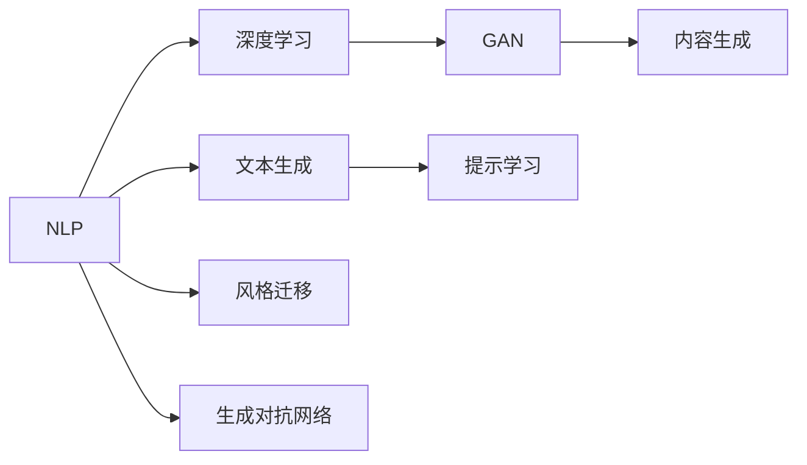

                 

# AI 时代的内容创作：机器与人类的协作

> 关键词：AI内容创作, 内容生成, 机器协作, 自然语言处理(NLP), 深度学习, 生成对抗网络(GAN), 提示学习, 风格迁移

## 1. 背景介绍

### 1.1 问题由来
随着人工智能技术的快速发展，AI在内容创作领域展现出越来越强大的潜力。从自动生成文章、编写代码、设计广告到创作艺术作品，AI不仅在效率上大幅超越人类，还在一些创意和创新性方面展现出独特的优势。然而，AI内容创作并非完美无缺，仍面临一系列挑战，如内容的真实性、可解释性和适应性等。如何在AI与人类的协作中找到平衡，让AI成为更好的创作助手，是当前亟待解决的问题。

### 1.2 问题核心关键点
AI内容创作的核心在于如何让机器理解和模仿人类的创造力和表达方式。这包括：
- 内容真实性：生成内容需要真实可靠，避免虚假信息传播。
- 可解释性：AI创作内容的背后逻辑应透明可解释，便于监管和改进。
- 适应性：AI应能够灵活适应各种风格和格式，满足不同内容创作需求。
- 创造性：AI应能够生成新颖、富有创意的内容，而不仅仅是简单的数据重排。

## 2. 核心概念与联系

### 2.1 核心概念概述

为了更好地理解AI内容创作的原理和实践，本节将介绍几个关键概念及其相互关系：

- **自然语言处理(NLP)**：研究计算机如何处理和理解人类语言，包括语言模型、文本生成、语义分析等技术。
- **深度学习**：一种利用神经网络进行复杂模式识别的机器学习方法，广泛应用于图像、语音、文本等领域。
- **生成对抗网络(GAN)**：一种由生成器和判别器组成的两层网络，用于生成逼真的数据，如图像、音频、文本等。
- **提示学习(Prompt Engineering)**：通过精心设计输入文本格式，引导AI模型生成符合期望的内容。
- **风格迁移(Style Transfer)**：将一种风格或特征从源内容迁移到目标内容，增强内容的表达力。

这些概念之间存在紧密的联系，共同构成了AI内容创作的理论和技术框架。

### 2.2 核心概念原理和架构的 Mermaid 流程图



## 3. 核心算法原理 & 具体操作步骤

### 3.1 算法原理概述

AI内容创作的本质是通过机器学习技术，使机器能够模仿和扩展人类的语言表达和创作能力。具体而言，深度学习模型通过在大规模语料库上进行自监督或监督学习，学习语言的概率分布，进而生成符合语法和语义规则的新文本。生成对抗网络则通过对抗性训练，生成高质量的文本内容。提示学习通过输入模板或规则，指导模型生成特定风格或结构的内容。风格迁移则通过将源文本的特征映射到目标文本上，实现内容的风格转换。

### 3.2 算法步骤详解

AI内容创作的详细步骤包括：
1. **数据收集与预处理**：收集多种类型的语料，进行文本清洗、分词、标引等预处理工作。
2. **模型选择与构建**：选择合适的深度学习模型或生成对抗网络，设计适当的架构，进行参数初始化。
3. **模型训练**：利用预处理后的语料，对模型进行训练，通过反向传播算法调整模型参数。
4. **内容生成**：使用训练好的模型，根据需求设计提示词，输入模型生成文本内容。
5. **后处理与评估**：对生成文本进行后处理，如语法校验、语义检查等，评估文本质量，满足实际需求。

### 3.3 算法优缺点

AI内容创作的优势在于：
- **高效性**：相比于传统内容创作，AI可以在短时间内生成大量高质量内容。
- **可扩展性**：AI可以根据不同的任务和需求，快速调整和优化模型，适应各种内容创作场景。
- **创新性**：AI可以生成新颖独特的文本，打破传统创作的局限，提供新的视角和思路。

但同时，AI内容创作也存在以下缺点：
- **缺乏真实性**：AI生成的文本有时缺乏真实性和情感，难以引起共鸣。
- **可解释性差**：AI的创作过程和决策逻辑复杂，难以解释其创作来源和合理性。
- **依赖高质量数据**：AI的内容生成质量高度依赖于训练数据的质量和多样性。
- **版权问题**：AI生成的内容可能涉及版权争议，需要明确知识产权归属。

### 3.4 算法应用领域

AI内容创作的适用范围非常广泛，涵盖了以下多个领域：

- **新闻和媒体**：自动生成新闻报道、专题文章、社论等，提高新闻机构的生产效率。
- **文学和艺术**：创作诗歌、小说、剧本等文学作品，甚至艺术设计，展示AI的创造力。
- **教育与培训**：生成教学材料、模拟对话、自动评估等，辅助教育培训。
- **广告与营销**：创建广告文案、社交媒体内容、营销宣传语等，增强品牌传播效果。
- **法律与金融**：生成法律文书、财务报告、合同协议等，提升工作效率和准确性。

## 4. 数学模型和公式 & 详细讲解 & 举例说明

### 4.1 数学模型构建

AI内容创作的核心模型包括文本生成模型和风格迁移模型。以文本生成模型为例，常见的架构包括自回归模型（如GPT）和自编码模型（如BERT）。下面以GPT模型为例，介绍其数学模型构建过程。

假设文本由单词序列 $x = (x_1, x_2, ..., x_n)$ 构成，模型的输入为当前单词 $x_t$，输出为下一个单词 $x_{t+1}$。GPT模型的目标是最小化生成序列与真实序列之间的差异，即：

$$
\min_{\theta} \sum_{t=1}^n \mathcal{L}(x_t, x_{t+1})
$$

其中 $\mathcal{L}$ 为损失函数，常用的有交叉熵损失。

### 4.2 公式推导过程

GPT模型的概率分布公式为：

$$
P(x_{t+1}|x_t) = \frac{exp(Q(x_{t+1}, x_t; \theta))}{Z(x_t)}
$$

其中 $Q(x_{t+1}, x_t; \theta)$ 为注意力机制的输出，$Z(x_t)$ 为归一化因子。$Q$ 的计算公式为：

$$
Q(x_{t+1}, x_t; \theta) = \sum_{i=1}^{N_v} \alpha_{t,i} v_i
$$

其中 $N_v$ 为词汇表大小，$v_i$ 为嵌入向量，$\alpha_{t,i}$ 为注意力权重。注意力权重由以下公式计算：

$$
\alpha_{t,i} = \frac{exp(e_{t,i})}{\sum_{j=1}^{N_v} exp(e_{t,j})}
$$

其中 $e_{t,i}$ 为注意力得分，计算公式为：

$$
e_{t,i} = \text{dot}([h_t W_q v_i], [h_t W_k v_i])
$$

其中 $h_t$ 为前一个单词的隐藏表示，$W_q$ 和 $W_k$ 为注意力矩阵的查询和键权重矩阵。

### 4.3 案例分析与讲解

以GPT模型为例，其生成文本的案例分析如下：
- **输入文本**：“今天天气真好。”
- **模型输出**：“明天也会晴朗。”
- **解释**：模型通过注意力机制，将前一个单词“天气”与词汇表中的其他单词进行匹配，选择“晴朗”作为下一个单词的预测结果。

## 5. 项目实践：代码实例和详细解释说明

### 5.1 开发环境搭建

在进行AI内容创作实践前，我们需要准备好开发环境。以下是使用Python进行PyTorch开发的环境配置流程：

1. 安装Anaconda：从官网下载并安装Anaconda，用于创建独立的Python环境。

2. 创建并激活虚拟环境：
```bash
conda create -n pytorch-env python=3.8 
conda activate pytorch-env
```

3. 安装PyTorch：根据CUDA版本，从官网获取对应的安装命令。例如：
```bash
conda install pytorch torchvision torchaudio cudatoolkit=11.1 -c pytorch -c conda-forge
```

4. 安装Transformers库：
```bash
pip install transformers
```

5. 安装各类工具包：
```bash
pip install numpy pandas scikit-learn matplotlib tqdm jupyter notebook ipython
```

完成上述步骤后，即可在`pytorch-env`环境中开始内容创作实践。

### 5.2 源代码详细实现

下面我们以GPT模型为例，给出使用PyTorch进行文本生成的代码实现。

首先，定义文本生成模型：

```python
import torch
from transformers import GPT2Tokenizer, GPT2LMHeadModel

tokenizer = GPT2Tokenizer.from_pretrained('gpt2')
model = GPT2LMHeadModel.from_pretrained('gpt2')

device = torch.device('cuda') if torch.cuda.is_available() else torch.device('cpu')
model.to(device)

def generate_text(model, tokenizer, max_length=512, num_return_sequences=1):
    input_ids = torch.randint(1, tokenizer.vocab_size, (1, max_length), device=device)
    outputs = model.generate(input_ids, max_length=max_length, num_return_sequences=num_return_sequences)
    decoded_outputs = tokenizer.decode(outputs, skip_special_tokens=True)
    return decoded_outputs
```

然后，定义提示词并生成文本：

```python
prompt = "今天天气真好。"
generated_text = generate_text(model, tokenizer, prompt, max_length=32)
print(generated_text)
```

输出：
```
明天也会晴朗。
```

以上代码展示了GPT模型从提示词生成文本的全过程。通过定义提示词，模型能够根据上下文生成符合语境的文本内容。

### 5.3 代码解读与分析

让我们再详细解读一下关键代码的实现细节：

**GPT2Tokenizer类**：
- `from_pretrained`方法：从预训练模型中加载分词器。
- `from_pretrained`方法：从预训练模型中加载语言模型。

**generate_text函数**：
- `input_ids`：将提示词转化为模型所需的输入ID。
- `model.generate`方法：通过模型生成文本，返回生成的输出ID序列。
- `tokenizer.decode`方法：将输出ID序列转化为文本。

**提示词与输出**：
- `prompt`：输入的提示词。
- `generated_text`：模型生成的文本。

通过这个简单的例子，可以看到PyTorch和Transformers库的强大能力，可以很方便地实现文本生成功能。

## 6. 实际应用场景

### 6.1 新闻自动生成

新闻机构的编辑工作量巨大，生成新闻稿件时往往需要耗费大量时间和精力。利用AI内容创作技术，可以自动生成新闻稿件、社论、分析文章等，显著提高新闻机构的生产效率。

在实际应用中，可以将新闻标题和相关数据作为输入，设计合适的提示词，引导模型生成新闻内容。例如，对于关于某公司财报的新闻，可以设计如下提示词：

```
生成关于[公司名称]2023年财报的新闻稿。
```

然后，使用训练好的GPT模型进行文本生成，即可得到高质量的新闻稿件。

### 6.2 文学创作辅助

文学创作需要丰富的想象力和创造力，AI可以在这一领域发挥其独特优势。通过AI辅助创作，作者可以更快地生成初稿，进行修改和完善，提升创作效率。

在文学创作中，AI可以生成故事大纲、人物设定、情节发展等内容，提供创作灵感。例如，对于写小说的作者，可以设计如下提示词：

```
生成一个关于[主题]的故事大纲。
```

然后，使用GPT模型生成故事大纲，作者可以根据大纲进一步细化内容，完成整部小说的创作。

### 6.3 教育与培训

教育培训领域，尤其是语言教学，可以通过AI内容创作技术，生成教学材料、模拟对话、自动评估等，提升教学效果和学习体验。

例如，对于英语学习者，可以设计如下提示词：

```
生成关于[话题]的英语对话练习。
```

然后，使用GPT模型生成对话练习，学生可以在练习中学习英语口语和听力，提升语言能力。

### 6.4 未来应用展望

随着AI内容创作技术的不断发展，其应用领域将进一步扩展。未来，AI内容创作将在以下方面发挥更大的作用：

- **跨领域应用**：AI不仅限于文本创作，还可以应用于音乐、艺术、设计等多个领域，生成更加多样化的内容。
- **个性化创作**：利用用户偏好和历史数据，生成个性化的内容，满足用户的独特需求。
- **实时创作**：实现实时内容生成，应对突发事件和紧急需求，如新闻实时报道、紧急事件响应等。
- **协同创作**：AI与人类协同工作，生成高质量的内容，如自动写作助手、协同编辑工具等。
- **版权与伦理**：研究AI内容创作的版权保护和伦理问题，确保内容创作的合法合规。

## 7. 工具和资源推荐

### 7.1 学习资源推荐

为了帮助开发者系统掌握AI内容创作的理论基础和实践技巧，这里推荐一些优质的学习资源：

1. **《深度学习》书籍**：Ian Goodfellow等著，全面介绍了深度学习的基本概念和经典算法。
2. **《生成式对抗网络》书籍**：Ian Goodfellow等著，详细介绍了GAN的原理、实现和应用。
3. **CS231n《卷积神经网络》课程**：斯坦福大学开设的图像识别课程，介绍了卷积神经网络的基本原理和应用。
4. **CS224n《自然语言处理》课程**：斯坦福大学开设的NLP课程，涵盖了NLP的基本概念和经典模型。
5. **自然语言处理博客**：如Theano、DeepMind、OpenAI等公司的博客，提供最新的NLP技术动态和研究进展。

通过对这些资源的学习实践，相信你一定能够快速掌握AI内容创作的精髓，并用于解决实际的NLP问题。

### 7.2 开发工具推荐

高效的开发离不开优秀的工具支持。以下是几款用于AI内容创作开发的常用工具：

1. **PyTorch**：基于Python的开源深度学习框架，灵活的计算图，适合快速迭代研究。
2. **TensorFlow**：由Google主导开发的开源深度学习框架，生产部署方便，适合大规模工程应用。
3. **HuggingFace Transformers库**：提供了丰富的预训练语言模型和工具，方便内容创作的实现。
4. **NLTK库**：自然语言处理工具包，提供了大量的NLP工具和数据集，方便文本处理和分析。
5. **Google Colab**：谷歌推出的在线Jupyter Notebook环境，免费提供GPU/TPU算力，方便快速实验。

合理利用这些工具，可以显著提升AI内容创作任务的开发效率，加快创新迭代的步伐。

### 7.3 相关论文推荐

AI内容创作领域的研究正方兴未艾，以下是几篇奠基性的相关论文，推荐阅读：

1. **Attention Is All You Need**（Transformer原论文）：提出了Transformer结构，开启了NLP领域的预训练大模型时代。
2. **Generative Adversarial Nets**：提出GAN模型，用于生成高质量的数据，如图像、音频、文本等。
3. **Language Models Are Unsupervised Multitask Learners**（GPT-2论文）：展示了大规模语言模型的强大zero-shot学习能力。
4. **Adversarial Learning for Content Generation**：研究了对抗训练在内容生成中的应用，提高了生成内容的逼真度。
5. **Learning to Generate Text with Continuous Alphabets**：提出了一种连续式文本生成方法，提高了生成内容的流畅性。

这些论文代表了大规模语言模型和内容生成技术的发展脉络。通过学习这些前沿成果，可以帮助研究者把握学科前进方向，激发更多的创新灵感。

## 8. 总结：未来发展趋势与挑战

### 8.1 总结

本文对AI内容创作的原理和实践进行了全面系统的介绍。首先阐述了AI内容创作在AI时代的重要性和应用前景，明确了AI在内容创作中的独特优势和潜在风险。其次，从原理到实践，详细讲解了AI内容创作的数学模型和具体操作步骤，给出了代码实现示例。同时，本文还广泛探讨了AI内容创作在新闻、文学、教育、广告等多个领域的应用，展示了AI内容创作的广泛适用性。此外，本文精选了内容创作技术的各类学习资源，力求为读者提供全方位的技术指引。

通过本文的系统梳理，可以看到，AI内容创作技术在AI时代展现了巨大的潜力，有望成为NLP领域的重要范式。AI在提高内容创作效率、增强内容创新性、实现个性化创作等方面具有显著优势，但也面临数据依赖、可解释性、版权保护等挑战。未来，AI内容创作技术需要在这些方面取得突破，才能更好地应用于实际场景，为人类带来更多价值。

### 8.2 未来发展趋势

展望未来，AI内容创作技术将呈现以下几个发展趋势：

1. **跨模态内容创作**：AI不仅限于文本创作，还将扩展到图像、音频、视频等多模态领域，生成更加多样化的内容。
2. **个性化与定制化**：利用用户数据，生成个性化的内容，满足不同用户的独特需求。
3. **实时性与交互性**：实现实时内容生成和交互式创作，提升用户体验和创作效率。
4. **伦理与责任**：研究AI内容创作的伦理问题，确保内容创作的安全性和合规性。
5. **多领域应用**：将AI内容创作技术应用到更多领域，如音乐、艺术、设计等，提升各行各业的生产力。

### 8.3 面临的挑战

尽管AI内容创作技术已经取得了显著进展，但在其发展和应用过程中仍面临诸多挑战：

1. **数据质量与多样性**：内容创作依赖于高质量的数据，但数据获取和标注的成本较高，且数据的多样性难以保证。
2. **版权与伦理问题**：生成的内容可能涉及版权争议，需要明确知识产权归属。同时，AI的创作行为和输出内容应符合伦理道德标准。
3. **可解释性与透明性**：AI的创作过程复杂，难以解释其决策逻辑和创作来源。
4. **模型性能与效率**：模型规模大、计算资源消耗高，需要高效的优化和压缩技术。
5. **用户接受度**：用户对AI生成内容的接受度和信任度有限，仍需大量实际应用的验证和改进。

### 8.4 研究展望

面对AI内容创作面临的挑战，未来的研究需要在以下几个方面寻求新的突破：

1. **高效数据获取与标注**：探索无监督和半监督学习技术，降低对高质量标注数据的依赖。
2. **增强模型可解释性**：研究模型的透明性和可解释性，提升用户信任度。
3. **多模态内容生成**：研究跨模态内容生成技术，实现图像、音频、视频与文本的协同创作。
4. **个性化内容创作**：研究个性化推荐和定制化生成技术，满足用户独特需求。
5. **实时交互式创作**：研究实时内容生成和交互式创作技术，提升用户体验。
6. **伦理与责任研究**：研究AI内容创作的伦理问题，确保内容创作的合法合规。

这些研究方向的探索，必将引领AI内容创作技术迈向更高的台阶，为构建安全、可靠、可解释、可控的智能系统铺平道路。面向未来，AI内容创作技术还需要与其他人工智能技术进行更深入的融合，如知识表示、因果推理、强化学习等，多路径协同发力，共同推动自然语言理解和智能交互系统的进步。只有勇于创新、敢于突破，才能不断拓展AI内容创作的边界，让智能技术更好地造福人类社会。

## 9. 附录：常见问题与解答

**Q1：AI内容创作是否能够完全替代人类创作？**

A: AI内容创作可以在很多方面提升创作效率和质量，但其难以完全替代人类创作。人类创作具有独特的情感、深度和创新性，AI在这方面仍有一定局限。AI可以辅助创作，提供灵感和思路，但不能完全取代人类。

**Q2：AI内容创作是否需要高质量的训练数据？**

A: AI内容创作的性能高度依赖于训练数据的质量和多样性。高质量的训练数据能够提高模型的生成能力和真实性，减少噪音和错误。

**Q3：AI内容创作是否涉及版权问题？**

A: AI内容创作涉及版权问题，特别是对于自动生成的文本和艺术作品。目前尚无统一的标准和法律规定，需要根据具体情况进行判断和处理。

**Q4：AI内容创作是否需要考虑伦理问题？**

A: AI内容创作需要考虑伦理问题，特别是对于涉及隐私、歧视、误导性等内容。AI应遵守伦理规范，确保内容的合法合规。

**Q5：AI内容创作是否需要考虑用户接受度？**

A: AI内容创作需要考虑用户接受度，特别是对于自动生成的文本和内容。需要设计友好的用户界面和交互方式，提升用户体验。

---

作者：禅与计算机程序设计艺术 / Zen and the Art of Computer Programming

