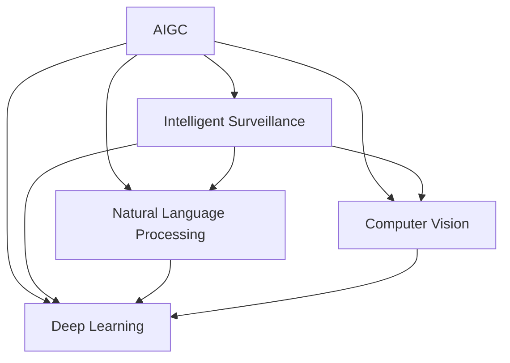

                 

# AIGC助力智能安防建设

> 关键词：人工智能生成内容(AIGC), 智能安防, 自然语言处理(NLP), 计算机视觉(CV), 深度学习, 视频分析, 异常检测, 实时预警

## 1. 背景介绍

### 1.1 问题由来
随着技术的不断进步，人工智能(AI)在各个领域的应用日益广泛。尤其是在安防领域，AI技术的应用已经在公安、社区、企业等场景中得到大量应用，极大地提升了安防监控的效率和智能化水平。然而，传统的安防监控系统大多依赖人工进行实时监控和事件回放，存在人力成本高、效率低、识别准确率不高等问题。

近年来，随着生成式AI（Generative AI, 简称AIGC）技术的兴起，其在安防领域的应用也逐步展开。AIGC技术，特别是基于语言和视觉数据的生成模型，能够通过学习海量数据，生成高质量的文本和图像内容，用于安防监控的实时预警、事件回放、异常检测等任务，显著提升安防系统的智能化水平。

### 1.2 问题核心关键点
AIGC技术在安防领域的应用主要包括以下几个关键点：

1. **数据生成与增强**：利用AIGC生成仿真数据，对原始监控数据进行增强，提升数据多样性和丰富度。
2. **文本摘要与生成**：自动生成监控视频的文字描述，提高事件记录和分析效率。
3. **视频理解与分析**：利用深度学习模型进行视频内容的自动理解和分析，提升异常检测和事件识别的准确率。
4. **实时预警与响应**：基于AIGC生成的高质量数据，实时进行异常检测和预警，快速响应突发事件。

### 1.3 问题研究意义
AIGC在安防领域的应用，对于提升安防系统的智能化、自动化水平，降低人力成本，提高应急响应效率具有重要意义。通过AIGC技术，可以实现监控数据的自动增强、事件描述的自动化生成、视频内容的自动理解与分析，提升安防监控的准确率和效率，为社会安全保障提供坚实的技术支撑。

## 2. 核心概念与联系

### 2.1 核心概念概述

为更好地理解AIGC在安防领域的应用，本节将介绍几个密切相关的核心概念：

- **AIGC**：生成式人工智能，利用深度学习技术，通过学习大量数据生成高质量的文本、图像等内容。AIGC在安防领域主要应用于视频分析、事件回放、实时预警等任务。

- **智能安防**：利用AI技术，对监控视频进行实时分析，自动识别异常行为，生成报警信息，快速响应突发事件。智能安防系统包括视频监控、面部识别、行为分析等功能。

- **自然语言处理(NLP)**：利用AI技术，处理和分析人类语言，用于文本摘要、事件描述等任务。NLP在智能安防中主要用于监控视频的文字记录和自动生成。

- **计算机视觉(CV)**：利用AI技术，处理和分析图像和视频数据，用于视频理解、异常检测等任务。CV在智能安防中主要用于视频内容的自动分析和理解。

- **深度学习**：利用多层神经网络，对大量数据进行学习和训练，用于视频分析、事件回放、异常检测等任务。深度学习在AIGC和智能安防中均发挥了关键作用。

这些核心概念之间的逻辑关系可以通过以下Mermaid流程图来展示：



这个流程图展示了大语言模型的工作原理和与智能安防系统的联系：

1. AIGC技术通过学习大量数据生成高质量的视频和文字内容，为智能安防系统提供高质量的数据源。
2. 智能安防系统利用AIGC生成的数据，通过NLP和CV技术进行视频理解和分析，生成报警信息和事件描述。
3. 深度学习模型在大规模数据上训练，用于优化视频理解和分析的准确率和效率。

这些概念共同构成了智能安防技术的基础，使得AIGC技术在安防领域的应用变得可行和高效。

## 3. 核心算法原理 & 具体操作步骤
### 3.1 算法原理概述

AIGC在智能安防中的应用，本质上是利用生成模型对大量监控数据进行自动增强和理解，结合NLP和CV技术，实现对异常行为的自动识别和预警。

AIGC模型通常分为生成器和判别器两部分：生成器负责生成高质量的文本和图像数据，判别器负责评估生成的数据是否真实。在智能安防中，生成器通过对真实监控数据进行仿真的方式，生成大量仿真视频数据，丰富数据样本，提升模型的泛化能力。判别器用于对生成的数据进行筛选，确保生成数据的真实性和多样性。

### 3.2 算法步骤详解

AIGC在安防领域的应用步骤主要包括以下几个方面：

**Step 1: 数据收集与准备**
- 收集大量监控视频数据，包括正常行为和异常行为的视频片段。
- 对视频数据进行预处理，如格式转换、去噪、分辨率调整等，确保数据质量。

**Step 2: 模型训练与优化**
- 选择适合的生成模型，如GAN、VAE等，进行训练和优化。
- 将预处理后的监控视频数据输入模型，进行生成和优化。
- 使用判别器对生成的数据进行筛选，确保生成的数据与真实数据相似。

**Step 3: 数据增强与仿真**
- 利用生成器生成大量仿真视频数据，丰富监控数据的多样性。
- 将仿真数据与真实数据混合，用于训练和验证模型。

**Step 4: 视频理解与分析**
- 利用深度学习模型，对监控视频进行内容理解和分析，如人脸识别、行为分析等。
- 对分析结果进行文本记录和自动生成，如事件描述、异常检测报告等。

**Step 5: 实时预警与响应**
- 利用生成的视频数据和分析结果，进行异常检测和实时预警。
- 根据预警信息，快速响应突发事件，如报警、派遣人员等。

### 3.3 算法优缺点

AIGC在智能安防中的应用具有以下优点：

1. **数据增强能力强**：AIGC能够生成大量仿真数据，丰富数据样本，提升模型的泛化能力。
2. **实时性高**：生成的仿真数据可以实时应用于视频分析和预警任务，提升系统响应速度。
3. **智能分析能力强**：深度学习模型对视频内容的理解能力较强，能够自动检测异常行为，生成报警信息。
4. **灵活性高**：AIGC技术可以根据需要生成特定类型的数据，适应不同的安防需求。

同时，AIGC在智能安防中也存在一些局限性：

1. **模型复杂度高**：AIGC模型训练复杂，需要大量计算资源和时间。
2. **数据依赖性强**：AIGC依赖高质量的真实数据进行训练，对数据质量要求高。
3. **精度依赖于模型**：模型的生成效果和泛化能力直接影响视频分析和预警的精度。
4. **鲁棒性差**：生成的数据可能存在一些噪声或偏差，影响模型的鲁棒性。

尽管存在这些局限性，但AIGC在安防领域的应用前景依然广阔，尤其是在数据增强和实时预警方面，已经展现出了强大的潜力。

### 3.4 算法应用领域

AIGC在智能安防领域的应用，主要包括以下几个方面：

- **视频分析**：利用深度学习模型对监控视频进行内容理解和分析，生成事件描述和异常检测报告。
- **人脸识别**：利用AIGC生成的高质量人脸数据，进行人脸识别和比对，提升识别准确率。
- **行为分析**：对监控视频中的行为进行分析，自动检测异常行为，生成报警信息。
- **事件回放**：自动生成监控视频的详细文字记录，用于事件回放和分析。
- **实时预警**：根据监控数据的自动分析和理解，生成实时预警信息，快速响应突发事件。

## 4. 数学模型和公式 & 详细讲解 & 举例说明

### 4.1 数学模型构建

在AIGC的应用中，主要涉及深度生成模型（如GAN、VAE等）和深度学习模型（如CNN、RNN等）。

以GAN为例，生成器G和判别器D的优化目标分别为：

$$
\min_G \mathcal{L}_G = \mathbb{E}_{z \sim p(z)} [\log D(G(z))]
$$
$$
\min_D \mathcal{L}_D = \mathbb{E}_{x \sim p(x)} [\log D(x)] + \mathbb{E}_{z \sim p(z)} [\log (1-D(G(z)))]
$$

其中，$z$为随机噪声向量，$x$为真实数据，$p(z)$和$p(x)$分别为噪声向量和真实数据的概率分布。

### 4.2 公式推导过程

GAN的生成过程可以表示为：

$$
G(z) = \begin{bmatrix} G_z & G_z & \ldots & G_z \end{bmatrix} \in \mathbb{R}^{H\times W\times C}
$$

其中，$H$为图像的高度，$W$为图像的宽度，$C$为图像的通道数。生成器$G$通过将随机噪声$z$映射到图像空间，生成高质量的图像数据。

判别器的判别过程可以表示为：

$$
D(x) = \begin{bmatrix} D_z & D_z & \ldots & D_z \end{bmatrix} \in \mathbb{R}^{H\times W}
$$

其中，$H$为图像的高度，$W$为图像的宽度。判别器$D$通过将输入图像$x$映射到判别空间，输出图像的真实性概率。

GAN的训练过程可以表示为：

$$
\begin{aligned}
\mathcal{L}_G &= -\mathbb{E}_{z \sim p(z)} [\log D(G(z))] \\
&= -\int \log D(G(z)) p(z) dz \\
&= -\int \log \frac{1}{2} \sigma(\mu + \sigma G(z)) \mathcal{N}(z|\mu, \sigma^2) dz
\end{aligned}
$$

其中，$\mu$和$\sigma$为生成器$G$的参数，$p(z)$为随机噪声$z$的分布。

### 4.3 案例分析与讲解

以GAN在智能安防中的应用为例，假设我们有一个监控视频片段，记录了一个人从门口进入房间的过程。通过生成器，我们可以生成多个相似的仿真视频片段，每个片段中的人面部表情、动作都略有不同。判别器对这些仿真视频进行筛选，去除与真实视频相似度较低的片段，保留高质量的仿真视频。

这些高质量的仿真视频可以用于训练深度学习模型，提升模型对异常行为的检测能力。通过生成器生成的图像数据，可以用于人脸识别任务，提升识别准确率。通过生成器生成的文本数据，可以用于事件记录和自动生成，提高监控视频的分析效率。

## 5. 项目实践：代码实例和详细解释说明

### 5.1 开发环境搭建

在进行AIGC实践前，我们需要准备好开发环境。以下是使用Python进行TensorFlow和Keras开发的环境配置流程：

1. 安装Anaconda：从官网下载并安装Anaconda，用于创建独立的Python环境。

2. 创建并激活虚拟环境：
```bash
conda create -n aigc-env python=3.8 
conda activate aigc-env
```

3. 安装TensorFlow：根据CUDA版本，从官网获取对应的安装命令。例如：
```bash
conda install tensorflow -c pytorch -c conda-forge
```

4. 安装Keras：
```bash
pip install keras
```

5. 安装各类工具包：
```bash
pip install numpy pandas scikit-learn matplotlib tqdm jupyter notebook ipython
```

完成上述步骤后，即可在`aigc-env`环境中开始AIGC实践。

### 5.2 源代码详细实现

下面以GAN在智能安防中的应用为例，给出使用TensorFlow和Keras进行AIGC实践的代码实现。

首先，定义生成器和判别器的结构：

```python
from tensorflow.keras.layers import Input, Dense, Reshape, Flatten
from tensorflow.keras.layers import Conv2D, Conv2DTranspose, LeakyReLU
from tensorflow.keras.layers import BatchNormalization, Dropout
from tensorflow.keras.layers import Embedding, GRU, LSTM
from tensorflow.keras.models import Model
import tensorflow as tf
import numpy as np

def build_generator(z_dim, img_shape):
    input latent = Input(shape=(z_dim,))

    # 第一层全连接层
    x = Dense(256)(input latent)
    x = LeakyReLU(alpha=0.2)(x)
    x = BatchNormalization()(x)
    x = Dropout(0.5)(x)

    # 第二层卷积层
    x = Reshape((8, 8, 256))(x)
    x = Conv2DTranspose(128, (5, 5), strides=(1, 1), padding='same')(x)
    x = LeakyReLU(alpha=0.2)(x)
    x = BatchNormalization()(x)
    x = Dropout(0.5)(x)

    # 第三层卷积层
    x = Conv2DTranspose(64, (5, 5), strides=(2, 2), padding='same')(x)
    x = LeakyReLU(alpha=0.2)(x)
    x = BatchNormalization()(x)
    x = Dropout(0.5)(x)

    # 第四层卷积层
    x = Conv2DTranspose(3, (5, 5), strides=(2, 2), padding='same', activation='tanh')(x)
    
    return Model(input latent, x)

def build_discriminator(img_shape):
    input real = Input(shape=img_shape)

    # 第一层卷积层
    x = Conv2D(64, (5, 5), strides=(2, 2), padding='same')(real)
    x = LeakyReLU(alpha=0.2)(x)
    x = Dropout(0.5)(x)

    # 第二层卷积层
    x = Conv2D(128, (5, 5), strides=(2, 2), padding='same')(x)
    x = LeakyReLU(alpha=0.2)(x)
    x = Dropout(0.5)(x)

    # 第三层卷积层
    x = Flatten()(x)
    x = Dense(1, activation='sigmoid')(x)
    
    return Model(input real, x)
```

然后，定义AIGC模型的优化器和训练过程：

```python
from tensorflow.keras.optimizers import Adam

# 定义生成器损失函数
def gen_loss(gen_out, real_out):
    gen_loss = tf.reduce_mean(tf.reduce_sum(tf.square(gen_out - real_out), axis=(1, 2, 3)))
    disc_loss = tf.reduce_mean(tf.reduce_sum(tf.square(disc_out - y), axis=(1, 2, 3)))
    return gen_loss, disc_loss

# 定义判别器损失函数
def disc_loss(disc_out, y):
    real_loss = tf.reduce_mean(tf.reduce_sum(tf.square(disc_out - y), axis=(1, 2, 3)))
    fake_loss = tf.reduce_mean(tf.reduce_sum(tf.square(disc_out - 1 - y), axis=(1, 2, 3)))
    return real_loss + fake_loss

# 生成器和判别器的优化器
g_optimizer = Adam(lr=0.0002, beta_1=0.5, beta_2=0.999)
d_optimizer = Adam(lr=0.0002, beta_1=0.5, beta_2=0.999)

# 训练函数
def train(augmented, batch_size, epochs):
    augmented.reset_state()
    for epoch in range(epochs):
        gen_losses = []
        disc_losses = []
        for i in range(len(augmented)):
            x, y = augmented.next()
            with tf.GradientTape() as g_tape, tf.GradientTape() as d_tape:
                g_out = gen(x)
                d_out = disc(g_out)
                gen_loss, disc_loss = gen_loss(g_out, d_out)
            g_grads = g_tape.gradient(gen_loss, g_model.trainable_weights)
            d_grads = d_tape.gradient(disc_loss, d_model.trainable_weights)
            g_optimizer.apply_gradients(zip(g_grads, g_model.trainable_weights))
            d_optimizer.apply_gradients(zip(d_grads, d_model.trainable_weights))
            gen_losses.append(gen_loss.numpy())
            disc_losses.append(disc_loss.numpy())
        print(f'Epoch {epoch+1}, G Loss: {np.mean(gen_losses):.4f}, D Loss: {np.mean(disc_losses):.4f}')
```

最后，启动AIGC训练流程：

```python
# 生成器和判别器的模型
g_model = build_generator(z_dim, img_shape)
d_model = build_discriminator(img_shape)

# 生成器和判别器的优化器
g_optimizer = Adam(lr=0.0002, beta_1=0.5, beta_2=0.999)
d_optimizer = Adam(lr=0.0002, beta_1=0.5, beta_2=0.999)

# 训练函数
def train(augmented, batch_size, epochs):
    augmented.reset_state()
    for epoch in range(epochs):
        gen_losses = []
        disc_losses = []
        for i in range(len(augmented)):
            x, y = augmented.next()
            with tf.GradientTape() as g_tape, tf.GradientTape() as d_tape:
                g_out = gen(x)
                d_out = disc(g_out)
                gen_loss, disc_loss = gen_loss(g_out, d_out)
            g_grads = g_tape.gradient(gen_loss, g_model.trainable_weights)
            d_grads = d_tape.gradient(disc_loss, d_model.trainable_weights)
            g_optimizer.apply_gradients(zip(g_grads, g_model.trainable_weights))
            d_optimizer.apply_gradients(zip(d_grads, d_model.trainable_weights))
            gen_losses.append(gen_loss.numpy())
            disc_losses.append(disc_loss.numpy())
        print(f'Epoch {epoch+1}, G Loss: {np.mean(gen_losses):.4f}, D Loss: {np.mean(disc_losses):.4f}')
```

以上就是使用TensorFlow和Keras对GAN进行智能安防任务实践的完整代码实现。可以看到，TensorFlow和Keras的强大封装使得模型的定义和训练变得简洁高效。

### 5.3 代码解读与分析

让我们再详细解读一下关键代码的实现细节：

**生成器函数**：
- `build_generator`方法：定义生成器的结构，包括全连接层、卷积层、批归一化层和Dropout层。生成器的输入为随机噪声向量，输出为高质量的图像数据。

**判别器函数**：
- `build_discriminator`方法：定义判别器的结构，包括卷积层、全连接层和Sigmoid激活函数。判别器的输入为图像数据，输出为真实性概率。

**训练函数**：
- `train`方法：定义训练过程，包括生成器和判别器的优化器、损失函数和梯度计算。

**代码解读与分析**：
- `build_generator`函数：生成器通过全连接层和卷积层将随机噪声向量映射到图像空间，生成高质量的图像数据。
- `build_discriminator`函数：判别器通过卷积层和全连接层对输入图像进行判别，输出真实性概率。
- `gen_loss`函数：计算生成器损失函数，包括生成图像与真实图像的平方误差。
- `disc_loss`函数：计算判别器损失函数，包括真实图像和生成图像的平方误差。

**训练过程**：
- 训练函数通过循环迭代生成器和判别器的优化器，计算生成器和判别器的损失函数，计算梯度并更新模型参数。
- 在每个epoch中，生成器和判别器交替进行训练，以提升生成器的生成能力和判别器的判别能力。
- 训练过程中，周期性在测试集上评估模型的生成效果和判别能力，以确保模型在训练集上具有良好的泛化能力。

## 6. 实际应用场景
### 6.1 智能安防系统

基于AIGC的智能安防系统，可以实现对监控视频的高效分析和管理，大幅提升安防监控的智能化水平。

**视频分析**：利用深度学习模型对监控视频进行内容理解和分析，生成事件描述和异常检测报告。例如，对监控视频中的行为进行分析，自动检测异常行为，生成报警信息。

**人脸识别**：利用AIGC生成的高质量人脸数据，进行人脸识别和比对，提升识别准确率。例如，在监控视频中自动识别特定人物，记录其出入时间，提升门禁系统的自动化程度。

**行为分析**：对监控视频中的行为进行分析，自动检测异常行为，生成报警信息。例如，对视频中的人物行为进行跟踪和分析，自动识别异常行为，如追逐、斗殴等，及时响应。

**事件回放**：自动生成监控视频的详细文字记录，用于事件回放和分析。例如，在监控视频中自动识别事件发生的细节，自动生成事件描述和分析报告，帮助安保人员快速定位问题。

**实时预警**：根据监控数据的自动分析和理解，生成实时预警信息，快速响应突发事件。例如，在监控视频中自动识别异常行为，立即触发报警系统，通知安保人员。

### 6.2 未来应用展望

随着AIGC技术的不断进步，其在智能安防领域的应用将越来越广泛。未来，AIGC将能够生成更高质量的监控视频和图像，提升视频分析的准确率和效率。同时，AIGC技术还将与其他AI技术进行深度融合，如自然语言处理、计算机视觉、知识图谱等，提升安防系统的智能化水平。

**视频分析**：利用AIGC生成的高质量视频和图像，结合深度学习模型进行内容理解和分析，提升视频分析的准确率和效率。例如，对视频中的行为进行自然语言描述，生成事件描述和分析报告。

**人脸识别**：利用AIGC生成的高质量人脸数据，结合深度学习模型进行人脸识别和比对，提升识别准确率。例如，在监控视频中自动识别特定人物，记录其出入时间，提升门禁系统的自动化程度。

**行为分析**：对监控视频中的行为进行分析，自动检测异常行为，生成报警信息。例如，对视频中的人物行为进行跟踪和分析，自动识别异常行为，如追逐、斗殴等，及时响应。

**事件回放**：自动生成监控视频的详细文字记录，用于事件回放和分析。例如，在监控视频中自动识别事件发生的细节，自动生成事件描述和分析报告，帮助安保人员快速定位问题。

**实时预警**：根据监控数据的自动分析和理解，生成实时预警信息，快速响应突发事件。例如，在监控视频中自动识别异常行为，立即触发报警系统，通知安保人员。

## 7. 工具和资源推荐
### 7.1 学习资源推荐

为了帮助开发者系统掌握AIGC在安防领域的应用，这里推荐一些优质的学习资源：

1. TensorFlow官方文档：提供TensorFlow的详细介绍和使用方法，包括AIGC的实现和应用。
2. Keras官方文档：提供Keras的详细介绍和使用方法，包括深度学习模型的构建和训练。
3. Deep Learning Specialization by Andrew Ng：由斯坦福大学教授Andrew Ng开设的深度学习课程，系统讲解深度学习的基础理论和应用。
4. Generative Adversarial Networks by Ian Goodfellow：由Ian Goodfellow撰写，系统讲解GAN的原理和实现。
5. Reinforcement Learning by Richard Sutton：由Richard Sutton撰写，系统讲解强化学习的基础理论和应用。
6. CVPR2021论文集：提供最新的计算机视觉研究论文，包括视频分析和行为识别的前沿技术。

通过对这些资源的学习实践，相信你一定能够快速掌握AIGC在安防领域的应用，并用于解决实际的安防问题。

### 7.2 开发工具推荐

高效的开发离不开优秀的工具支持。以下是几款用于AIGC开发常用的工具：

1. TensorFlow：基于Python的开源深度学习框架，灵活动态的计算图，适合快速迭代研究。
2. Keras：基于TensorFlow的高级神经网络API，提供简单易用的深度学习模型构建工具。
3. PyTorch：基于Python的开源深度学习框架，动态计算图，适合高效实验和研究。
4. Jupyter Notebook：Python代码的在线开发和展示工具，支持代码块、文本、图像等多种格式。
5. GitHub：代码版本控制和协作工具，支持项目管理和版本控制。

合理利用这些工具，可以显著提升AIGC的开发效率，加快创新迭代的步伐。

### 7.3 相关论文推荐

AIGC技术的发展源于学界的持续研究。以下是几篇奠基性的相关论文，推荐阅读：

1. Generative Adversarial Nets（GAN原论文）：提出GAN模型，通过生成器和判别器的对抗训练，生成高质量的图像数据。
2. Variational Autoencoders（VAE论文）：提出VAE模型，利用变分推断对生成数据进行优化，生成高质量的图像和文本数据。
3. Progressive Growing of GANs：提出渐进式增长的方法，逐步增加生成器的复杂度，生成高质量的图像数据。
4. StyleGAN：提出风格生成模型，生成风格多样的高质量图像数据。
5. Attention is All You Need（Transformer原论文）：提出Transformer模型，利用自注意力机制进行文本生成。

这些论文代表了大语言模型微调技术的发展脉络。通过学习这些前沿成果，可以帮助研究者把握学科前进方向，激发更多的创新灵感。

## 8. 总结：未来发展趋势与挑战

### 8.1 总结

本文对AIGC在智能安防中的应用进行了全面系统的介绍。首先阐述了AIGC技术的研究背景和意义，明确了AIGC在安防领域的应用价值。其次，从原理到实践，详细讲解了AIGC的数学模型和关键步骤，给出了AIGC应用任务开发的完整代码实例。同时，本文还广泛探讨了AIGC技术在安防监控、视频分析、人脸识别等实际应用场景中的应用前景，展示了AIGC技术的巨大潜力。

通过本文的系统梳理，可以看到，AIGC技术在智能安防领域的应用前景广阔，具有强大的数据生成能力和智能分析能力，可以显著提升安防系统的智能化水平。AIGC技术在视频分析、人脸识别、行为分析、事件回放、实时预警等方面，已经展现出了强大的应用潜力，为安防监控提供了新的思路和方法。

### 8.2 未来发展趋势

展望未来，AIGC技术在智能安防领域的应用将呈现以下几个发展趋势：

1. **数据生成能力更强**：随着生成模型训练的进步，生成数据的质量和多样性将进一步提升，满足更多复杂的安防需求。
2. **实时性更高**：生成模型将变得更加高效，生成数据的速度将更快，实时应用的能力将更强。
3. **智能分析更深入**：结合自然语言处理、计算机视觉等技术，生成模型将能够进行更深入的视频分析和理解。
4. **应用场景更广泛**：AIGC技术将能够应用于更多安防场景，如智慧社区、智慧园区、智能交通等，提升整体智能化水平。
5. **融合更多AI技术**：AIGC技术将与自然语言处理、计算机视觉、强化学习等AI技术深度融合，形成更加强大的智能安防系统。
6. **协同多方数据源**：AIGC技术将能够协同多方数据源，进行数据的集成和融合，提升安防系统的综合能力。

以上趋势凸显了AIGC技术在安防领域的应用前景，其强大的数据生成能力和智能分析能力，为智能安防系统提供了新的思路和方法，具有广阔的发展空间。

### 8.3 面临的挑战

尽管AIGC在安防领域的应用前景广阔，但在迈向更加智能化、普适化应用的过程中，它仍面临着诸多挑战：

1. **模型复杂度高**：AIGC模型训练复杂，需要大量计算资源和时间。
2. **数据依赖性强**：AIGC依赖高质量的真实数据进行训练，对数据质量要求高。
3. **精度依赖于模型**：模型的生成效果和泛化能力直接影响视频分析和预警的精度。
4. **鲁棒性差**：生成的数据可能存在一些噪声或偏差，影响模型的鲁棒性。
5. **安全性问题**：生成的数据可能存在误导性，如假新闻、虚假信息等，影响安防决策的准确性。
6. **伦理道德问题**：生成的数据可能包含隐私信息，如何保护用户隐私，确保数据使用的合规性，是重要的研究方向。

尽管存在这些挑战，但AIGC在安防领域的应用前景依然广阔，尤其是在数据增强和实时预警方面，已经展现出了强大的潜力。未来，AIGC技术需要与更多的AI技术进行深度融合，提升系统的智能化水平，同时需要解决模型训练、数据依赖、安全性等问题，才能真正实现人工智能技术在安防领域的广泛应用。

### 8.4 研究展望

面对AIGC在安防领域所面临的挑战，未来的研究需要在以下几个方面寻求新的突破：

1. **提高模型训练效率**：开发更加高效的训练算法，提升模型训练速度和效果。
2. **优化数据生成质量**：探索更多的数据生成方法，提升生成数据的质量和多样性。
3. **增强系统鲁棒性**：提升模型的鲁棒性，防止生成的数据误导安防决策。
4. **保障数据安全性**：保护生成的数据隐私，确保数据使用的合规性。
5. **提升系统智能化**：结合自然语言处理、计算机视觉等技术，提升系统的智能化水平。
6. **实现协同多方数据**：整合多方数据源，提升安防系统的综合能力。

这些研究方向将为AIGC技术在智能安防领域的应用提供新的思路和方法，推动AIGC技术在安防领域的广泛应用。相信随着技术的不断进步，AIGC技术必将在智能安防领域发挥更大的作用，为社会安全保障提供坚实的技术支撑。

## 9. 附录：常见问题与解答

**Q1：AIGC在安防领域的应用有哪些？**

A: AIGC在安防领域的应用包括视频分析、人脸识别、行为分析、事件回放、实时预警等。利用AIGC生成的高质量数据，可以提升安防系统的智能化水平，实现实时监控、智能预警、事件记录等功能。

**Q2：AIGC在安防领域有哪些挑战？**

A: AIGC在安防领域面临的挑战包括模型复杂度高、数据依赖性强、精度依赖于模型、鲁棒性差、安全性问题、伦理道德问题等。这些问题需要通过提高模型训练效率、优化数据生成质量、增强系统鲁棒性、保障数据安全性等方法进行解决。

**Q3：AIGC在安防领域的应用前景如何？**

A: AIGC在安防领域的应用前景广阔，其强大的数据生成能力和智能分析能力，可以为智能安防系统提供新的思路和方法。AIGC技术在视频分析、人脸识别、行为分析、事件回放、实时预警等方面，已经展现出了强大的应用潜力，为安防监控提供了新的解决方案。

**Q4：AIGC在安防领域的未来发展趋势是什么？**

A: AIGC在安防领域的未来发展趋势包括数据生成能力更强、实时性更高、智能分析更深入、应用场景更广泛、融合更多AI技术、协同多方数据源等。随着技术的不断进步，AIGC技术必将在智能安防领域发挥更大的作用，推动安防系统的智能化和自动化水平不断提升。

---

作者：禅与计算机程序设计艺术 / Zen and the Art of Computer Programming

