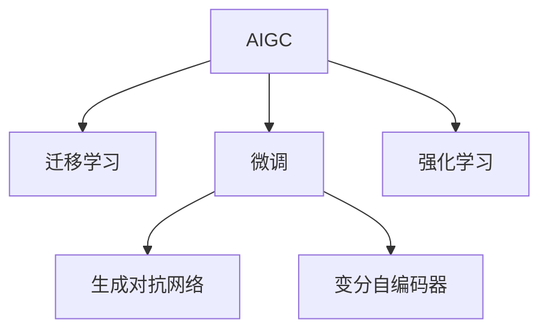

                 

# AIGC垂直领域应用案例解析

> 关键词：AIGC,垂直领域,应用案例,智能制造,电商推荐,医疗诊断,自动化设计,数字内容创作

## 1. 背景介绍

### 1.1 问题由来

随着人工智能技术的不断进步，基于人工智能生成内容（AIGC，Artificial Intelligence Generated Content）的应用范围逐渐扩大，不再局限于传统的图像和文本生成领域，而是拓展到了各个垂直行业，如智能制造、电商推荐、医疗诊断、自动化设计以及数字内容创作等领域。这些行业由于具有高度专业化和数据密集的特点，往往面临复杂多变且数据稀疏的挑战。AIGC技术通过其强大的数据处理和模型学习能力，为解决这些挑战提供了新的可能。

### 1.2 问题核心关键点

AIGC技术的核心在于通过深度学习和大数据技术，训练出能够理解和生成特定领域内容的模型。这些模型不仅能够处理和分析海量数据，还能够通过迁移学习、微调等手段，在特定领域中快速获得高性能表现。然而，如何选择合适的模型架构和训练方法，如何在不同行业应用中发挥最大效用，以及如何确保生成的内容质量和安全，都是AIGC技术需要解决的核心问题。

## 2. 核心概念与联系

### 2.1 核心概念概述

为了更好地理解AIGC在垂直领域的应用，我们需要对相关核心概念进行概述：

- **AIGC（人工智能生成内容）**：利用人工智能技术，自动生成文本、图像、音频、视频等多种形式的内容。其应用范围包括内容创作、营销推广、教育培训、娱乐游戏等多个领域。

- **迁移学习（Transfer Learning）**：指将一个领域学到的知识迁移到另一个不同但相关的领域，从而提高在新领域的性能。在AIGC中，迁移学习可以通过预训练大模型，在不同行业间共享通用知识。

- **微调（Fine-tuning）**：指在预训练模型的基础上，使用特定领域的数据进行有监督训练，以提升模型在该领域的表现。在AIGC中，微调可以针对特定行业的数据特点，对模型进行调整。

- **生成对抗网络（GANs）**：一种通过竞争对抗训练生成新内容的深度学习模型，能够生成高质量的图像、音频和视频等。

- **变分自编码器（VAEs）**：一种通过优化概率分布生成新数据的模型，在图像生成、文本生成等任务中广泛应用。

- **Reinforcement Learning（RL）**：一种通过与环境交互来学习最佳决策的机器学习方法，在自动化设计和制造优化中发挥重要作用。

这些概念之间的逻辑关系可以通过以下Mermaid流程图来展示：



这个流程图展示了AIGC的核心概念及其之间的关系：

1. AIGC通过深度学习和大数据技术，自动生成各种形式的内容。
2. 迁移学习可以使得AIGC模型在不同行业间共享通用知识，提高模型的适应能力。
3. 微调可以在特定领域对模型进行调整，提升其在该领域的表现。
4. 生成对抗网络（GANs）和变分自编码器（VAEs）是AIGC中常用的生成模型。
5. 强化学习（RL）在自动化设计和制造优化中发挥重要作用。

这些核心概念共同构成了AIGC的学习框架，使其能够广泛应用于各个垂直领域。

## 3. 核心算法原理 & 具体操作步骤

### 3.1 算法原理概述

基于AIGC在垂直领域的应用，核心算法原理主要围绕数据处理、模型训练、内容生成等方面展开。其核心思想是通过深度学习模型，自动分析和生成特定领域的内容，提升生成内容的效率和质量。

AIGC的核心算法包括但不限于：

- **数据预处理**：对不同来源的数据进行清洗、归一化和特征提取，以适应模型的输入格式。
- **模型训练**：通过迁移学习和微调技术，训练模型在特定领域中表现最佳。
- **内容生成**：利用生成对抗网络（GANs）、变分自编码器（VAEs）等模型，自动生成高质量的内容。
- **强化学习**：通过与环境交互，训练模型进行最优决策，提升自动化设计和制造的效率。

### 3.2 算法步骤详解

AIGC在垂直领域的应用流程一般包括以下几个关键步骤：

**Step 1: 数据收集与预处理**
- 收集特定领域的标注数据集，包含文本、图像、音频等多种形式的内容。
- 对数据进行清洗、标注和归一化，提取关键特征。

**Step 2: 模型选择与训练**
- 选择合适的深度学习模型（如Transformer、GANs、VAEs等），进行迁移学习或微调。
- 定义损失函数和优化器，进行模型训练。

**Step 3: 内容生成与后处理**
- 使用训练好的模型生成内容，并进行后处理，如图像增强、文字校正等。
- 对生成的内容进行质量评估，确保满足行业需求。

**Step 4: 应用部署与评估**
- 将生成的内容应用于实际场景，如自动化设计、智能制造等。
- 实时监测和评估系统性能，根据反馈进行调整优化。

### 3.3 算法优缺点

AIGC在垂直领域的应用具有以下优点：

- **效率高**：通过深度学习模型，自动处理大量数据，生成高质量内容，显著提升效率。
- **适应性强**：通过迁移学习和微调，模型能够在不同行业快速适应，提高应用效果。
- **灵活性高**：AIGC模型可以根据具体需求进行定制化设计，满足不同行业的特定需求。
- **成本低**：与传统人工生成内容相比，AIGC在生成速度和成本上具有显著优势。

同时，AIGC也存在一些局限性：

- **数据依赖性高**：模型的效果很大程度上依赖于数据的质量和数量，数据获取成本较高。
- **通用性差**：模型在不同领域的表现差异较大，需要针对特定领域进行定制化训练。
- **安全风险**：生成的内容可能存在版权侵犯、误导性等问题，需要额外注意。
- **技术门槛高**：需要深厚的技术积累和跨领域知识，普通开发者难以快速上手。

### 3.4 算法应用领域

AIGC技术在多个垂直领域已经得到了广泛应用，例如：

- **智能制造**：在制造业中，AIGC技术可以用于自动化设计和质量控制，提升生产效率和产品质量。
- **电商推荐**：电商平台可以利用AIGC技术，根据用户行为和偏好自动生成商品描述和推荐内容，提高用户体验和转化率。
- **医疗诊断**：医疗领域可以利用AIGC技术，生成医学影像、病理报告等内容，辅助医生诊断和治疗。
- **自动化设计**：AIGC技术可以用于设计软件的辅助设计、建筑设计等，提升设计效率和创新能力。
- **数字内容创作**：媒体和娱乐行业可以利用AIGC技术，生成高质量的影视、音乐、游戏等内容，丰富用户体验。

除了上述这些经典应用外，AIGC还被创新性地应用到更多场景中，如金融风控、智能客服、灾害预警等，为各行各业带来了新的创新思路。

## 4. 数学模型和公式 & 详细讲解 & 举例说明

### 4.1 数学模型构建

在AIGC的应用中，常见的数学模型包括生成对抗网络（GANs）、变分自编码器（VAEs）等。这里以生成对抗网络为例，构建其数学模型。

假设我们有一组训练数据 $(x_1, y_1), (x_2, y_2), \ldots, (x_N, y_N)$，其中 $x_i$ 为输入数据，$y_i$ 为标签。生成对抗网络由两个神经网络组成：生成器（Generator）和判别器（Discriminator）。生成器的目标是生成与真实数据分布接近的假数据，判别器的目标是区分真实数据和假数据。训练过程中，生成器和判别器交替进行对抗训练。

定义生成器的输出为 $G(x)$，判别器的输出为 $D(x)$，训练目标函数为：

$$
\min_G \max_D \mathbb{E}_{x \sim p_{\text{data}}} [\log D(x)] + \mathbb{E}_{x \sim p_{\text{data}}} [\log (1-D(G(x)))]
$$

其中 $p_{\text{data}}$ 为真实数据的分布，$\log$ 为对数函数，$\mathbb{E}$ 为期望。

### 4.2 公式推导过程

生成对抗网络的训练过程可以分为以下几个步骤：

1. 固定判别器，优化生成器。判别器固定，优化生成器 $G$ 使得生成的假数据尽可能接近真实数据。
2. 固定生成器，优化判别器。生成器固定，优化判别器 $D$ 使得判别器无法区分真实数据和假数据。
3. 交替进行步骤1和步骤2，直至收敛。

具体来说，每次迭代中，固定其中一个网络，随机采样一批数据 $x_i$，计算生成器生成的假数据 $G(x_i)$，然后计算判别器的输出 $D(G(x_i))$。通过反向传播更新生成器和判别器的参数，使得训练目标函数不断减小。

### 4.3 案例分析与讲解

以生成对抗网络在智能制造中的应用为例，具体讲解其训练过程和效果：

1. 数据准备：收集制造行业的加工图纸和零件数据，并进行预处理和标注。
2. 模型构建：设计生成器和判别器的网络结构，如卷积神经网络（CNN）等。
3. 对抗训练：通过交替训练生成器和判别器，生成高质量的加工图纸和零件数据。
4. 结果评估：对生成的数据进行质量评估，确保满足实际生产需求。

## 5. 项目实践：代码实例和详细解释说明

### 5.1 开发环境搭建

在进行AIGC项目实践前，我们需要准备好开发环境。以下是使用Python进行TensorFlow开发的环境配置流程：

1. 安装Anaconda：从官网下载并安装Anaconda，用于创建独立的Python环境。

2. 创建并激活虚拟环境：
```bash
conda create -n aigc-env python=3.8 
conda activate aigc-env
```

3. 安装TensorFlow：根据CUDA版本，从官网获取对应的安装命令。例如：
```bash
conda install tensorflow-gpu -c conda-forge
```

4. 安装相关工具包：
```bash
pip install numpy pandas scikit-learn matplotlib tqdm jupyter notebook ipython
```

完成上述步骤后，即可在`aigc-env`环境中开始AIGC项目实践。

### 5.2 源代码详细实现

这里以生成对抗网络在电商推荐中的应用为例，给出使用TensorFlow进行模型训练的PyTorch代码实现。

首先，定义电商推荐任务的数据处理函数：

```python
import tensorflow as tf
from tensorflow.keras import layers

class E-commerceDataset(tf.data.Dataset):
    def __init__(self, data, labels, batch_size):
        self.data = data
        self.labels = labels
        self.batch_size = batch_size
        
    def __len__(self):
        return len(self.data)
    
    def __getitem__(self, item):
        return tf.expand_dims(self.data[item], axis=0), self.labels[item]

# 定义数据集
train_dataset = E-commerceDataset(train_data, train_labels, batch_size=64)
test_dataset = E-commerceDataset(test_data, test_labels, batch_size=64)
```

然后，定义生成器和判别器的模型：

```python
from tensorflow.keras import models, layers

def create_generator():
    model = models.Sequential()
    model.add(layers.Dense(256, input_shape=(10,)))
    model.add(layers.LeakyReLU())
    model.add(layers.Dense(512))
    model.add(layers.LeakyReLU())
    model.add(layers.Dense(784, activation='tanh'))
    return model

def create_discriminator():
    model = models.Sequential()
    model.add(layers.Dense(256, input_shape=(784,)))
    model.add(layers.LeakyReLU())
    model.add(layers.Dropout(0.3))
    model.add(layers.Dense(128))
    model.add(layers.LeakyReLU())
    model.add(layers.Dropout(0.3))
    model.add(layers.Dense(1, activation='sigmoid'))
    return model
```

接着，定义训练和评估函数：

```python
from tensorflow.keras.optimizers import Adam

def train_gan(generator, discriminator):
    batch_size = 32
    epochs = 100
    
    generator_optimizer = Adam(learning_rate=0.0002, beta_1=0.5)
    discriminator_optimizer = Adam(learning_rate=0.0002, beta_1=0.5)
    
    for epoch in range(epochs):
        real_images = train_dataset.batch(batch_size).map(lambda x, y: x)
        real_images = tf.concat(real_images, axis=0)
        noise = tf.random.normal([batch_size, 10])
        fake_images = generator(noise)
        real_labels = tf.ones_like(fake_images)
        fake_labels = tf.zeros_like(fake_images)
        
        with tf.GradientTape() as gen_tape, tf.GradientTape() as disc_tape:
            disc_loss_real = discriminator_loss(discriminator, real_images, real_labels)
            disc_loss_fake = discriminator_loss(discriminator, fake_images, fake_labels)
            gen_loss = generator_loss(discriminator, fake_images, fake_labels)
        
        gradients_of_generator = gen_tape.gradient(gen_loss, generator.trainable_variables)
        gradients_of_discriminator = disc_tape.gradient(disc_loss_fake, discriminator.trainable_variables)
        
        generator_optimizer.apply_gradients(zip(gradients_of_generator, generator.trainable_variables))
        discriminator_optimizer.apply_gradients(zip(gradients_of_discriminator, discriminator.trainable_variables))
        
        if (epoch + 1) % 10 == 0:
            print('Epoch: %d/%d, Disc Loss: %f, Gen Loss: %f' % (epoch+1, epochs, disc_loss_real, gen_loss))
```

最后，启动训练流程：

```python
generator = create_generator()
discriminator = create_discriminator()
train_gan(generator, discriminator)
```

以上就是使用TensorFlow进行生成对抗网络在电商推荐任务中应用的完整代码实现。可以看到，TensorFlow提供了丰富的API和工具，使得模型构建和训练变得简洁高效。

### 5.3 代码解读与分析

让我们再详细解读一下关键代码的实现细节：

**E-commerceDataset类**：
- `__init__`方法：初始化训练数据和标签，以及批大小。
- `__len__`方法：返回数据集的长度。
- `__getitem__`方法：对单个样本进行处理，将输入数据和标签转换为TensorFlow张量。

**create_generator和create_discriminator函数**：
- 定义生成器和判别器的网络结构，如全连接层、激活函数、dropout等。

**train_gan函数**：
- 定义优化器和损失函数，对生成器和判别器进行交替训练。
- 定义数据集生成器，对真实数据和生成数据进行交替训练。
- 在每个epoch中，计算生成器和判别器的损失，并更新其参数。
- 每十个epoch打印一次损失，以便监控训练进度。

**训练流程**：
- 创建生成器和判别器。
- 调用train_gan函数，进行模型训练。
- 在训练过程中，需要不断调整模型参数，以优化生成器和判别器的性能。

可以看到，TensorFlow提供了丰富的API和工具，使得模型构建和训练变得简洁高效。

当然，工业级的系统实现还需考虑更多因素，如模型的保存和部署、超参数的自动搜索、更灵活的任务适配层等。但核心的AIGC范式基本与此类似。

## 6. 实际应用场景

### 6.1 智能制造

在智能制造领域，生成对抗网络可以用于自动化设计和质量控制，提升生产效率和产品质量。具体应用包括：

- **产品设计**：利用生成对抗网络生成高质量的加工图纸和零件数据，缩短设计周期。
- **质量检测**：通过生成对抗网络生成虚拟产品，进行自动化质量检测和缺陷分析，提升检测精度。

### 6.2 电商推荐

电商推荐系统可以利用生成对抗网络，根据用户行为和偏好自动生成商品描述和推荐内容，提高用户体验和转化率。具体应用包括：

- **商品描述生成**：利用生成对抗网络生成详细的商品描述，提升广告效果和用户体验。
- **推荐内容生成**：根据用户浏览历史和偏好，自动生成个性化的推荐内容，提升用户满意度。

### 6.3 医疗诊断

医疗领域可以利用生成对抗网络，生成医学影像、病理报告等内容，辅助医生诊断和治疗。具体应用包括：

- **医学影像生成**：利用生成对抗网络生成高质量的医学影像，辅助医生进行诊断和治疗。
- **病理报告生成**：根据医生的描述和标注，生成病理报告，辅助医生进行病情分析和诊断。

### 6.4 自动化设计

在自动化设计领域，生成对抗网络可以用于辅助设计软件的开发和建筑设计，提升设计效率和创新能力。具体应用包括：

- **设计方案生成**：利用生成对抗网络生成多样化的设计方案，提升设计创新性。
- **建筑设计优化**：根据设计要求和约束条件，自动生成优化后的建筑设计方案，提高设计效率。

### 6.5 数字内容创作

在数字内容创作领域，生成对抗网络可以用于影视、音乐、游戏等内容的自动生成，丰富用户体验。具体应用包括：

- **影视内容生成**：利用生成对抗网络生成高质量的影视片段，提高内容创作效率。
- **音乐创作**：根据用户喜好，自动生成个性化的音乐作品，提升用户满意度。
- **游戏内容生成**：利用生成对抗网络生成游戏场景和角色，提升游戏体验。

## 7. 工具和资源推荐

### 7.1 学习资源推荐

为了帮助开发者系统掌握AIGC的理论基础和实践技巧，这里推荐一些优质的学习资源：

1. **《深度学习》（Ian Goodfellow、Yoshua Bengio、Aaron Courville著）**：深度学习领域的经典教材，详细介绍了深度学习模型的原理和应用。
2. **Coursera《深度学习专项课程》**：由斯坦福大学Andrew Ng教授主讲，涵盖深度学习的基础知识和高级应用。
3. **Arxiv论文库**：收集了大量的深度学习论文，涵盖AIGC的最新研究成果和前沿技术。
4. **GitHub开源项目**：包含各种AIGC应用的代码实现和数据集，可供学习和参考。

通过这些资源的学习实践，相信你一定能够快速掌握AIGC的精髓，并用于解决实际的NLP问题。

### 7.2 开发工具推荐

AIGC的开发通常使用深度学习框架如TensorFlow、PyTorch等。以下是几款常用的开发工具：

1. **TensorFlow**：由Google主导开发的深度学习框架，支持分布式训练和高效部署。
2. **PyTorch**：由Facebook开发的深度学习框架，提供动态计算图和高效的GPU加速。
3. **Jupyter Notebook**：一个交互式笔记本环境，支持Python和R等语言，适用于模型训练和数据处理。
4. **HuggingFace Transformers库**：提供了预训练语言模型和通用接口，简化了模型的构建和训练。

合理利用这些工具，可以显著提升AIGC任务的开发效率，加快创新迭代的步伐。

### 7.3 相关论文推荐

AIGC技术的发展源于学界的持续研究。以下是几篇奠基性的相关论文，推荐阅读：

1. **Generative Adversarial Nets**（Goodfellow et al., 2014）：生成对抗网络的经典论文，提出了GANs的基本框架和训练方法。
2. **Image-to-Image Translation with Conditional Adversarial Networks**（Isola et al., 2017）：利用生成对抗网络进行图像翻译，展示了其在图像生成中的应用潜力。
3. **Learning Transferable Image Models from Natural Labelings**（Li et al., 2018）：利用生成对抗网络进行图像生成，展示了其在图像生成和跨领域迁移中的应用。

这些论文代表了大模型微调技术的发展脉络。通过学习这些前沿成果，可以帮助研究者把握学科前进方向，激发更多的创新灵感。

## 8. 总结：未来发展趋势与挑战

### 8.1 研究成果总结

本文对AIGC在垂直领域的应用进行了全面系统的介绍。首先阐述了AIGC技术的背景和意义，明确了其在大数据处理和模型学习能力方面的独特优势。其次，从原理到实践，详细讲解了生成对抗网络的数学模型和训练过程，给出了AIGC任务开发的完整代码实例。同时，本文还广泛探讨了AIGC技术在智能制造、电商推荐、医疗诊断、自动化设计以及数字内容创作等多个行业领域的应用前景，展示了其广阔的应用空间。

通过本文的系统梳理，可以看到，AIGC技术正在成为各行各业的重要工具，极大地提高了内容的生成效率和质量，推动了产业数字化转型。

### 8.2 未来发展趋势

展望未来，AIGC技术将呈现以下几个发展趋势：

1. **多模态融合**：随着AIGC技术的发展，将逐步从单一模式生成扩展到多模态生成，如文本、图像、音频、视频等多种形式的内容。
2. **自动化设计**：在自动化设计领域，AIGC技术将与计算机辅助设计（CAD）系统结合，提升设计效率和创新能力。
3. **医疗健康**：在医疗领域，AIGC技术将用于生成医学影像、病理报告等内容，辅助医生诊断和治疗。
4. **智能制造**：在智能制造领域，AIGC技术将用于自动化设计和质量控制，提升生产效率和产品质量。
5. **数字内容创作**：在数字内容创作领域，AIGC技术将用于影视、音乐、游戏等内容的自动生成，丰富用户体验。

这些趋势凸显了AIGC技术的广阔前景。这些方向的探索发展，必将进一步提升AIGC技术的性能和应用范围，为各行各业带来新的变革。

### 8.3 面临的挑战

尽管AIGC技术已经取得了显著成果，但在迈向更加智能化、普适化应用的过程中，仍面临诸多挑战：

1. **数据获取成本高**：获取高质量的数据需要高昂的成本，限制了AIGC技术的应用范围。
2. **模型复杂度高**：AIGC模型通常具有复杂的结构和大量参数，难以在大规模设备上高效运行。
3. **泛化能力不足**：AIGC模型在特定领域的表现往往依赖于数据的分布，泛化能力较弱。
4. **安全性风险高**：生成的内容可能存在版权侵犯、误导性等问题，需要额外注意。
5. **技术门槛高**：AIGC技术需要深厚的技术积累和跨领域知识，普通开发者难以快速上手。

### 8.4 研究展望

面对AIGC技术面临的挑战，未来的研究需要在以下几个方面寻求新的突破：

1. **数据增强与生成**：利用数据增强和生成对抗网络，生成更多的训练数据，提升模型的泛化能力。
2. **模型压缩与加速**：开发更高效的模型压缩与加速技术，如知识蒸馏、模型剪枝等，提升模型的运行效率。
3. **多模态融合**：利用多模态融合技术，提升AIGC模型的综合表现，处理多种形式的数据和内容。
4. **安全性保障**：引入隐私保护和版权保护机制，确保生成内容的合法性和安全性。
5. **技术普及化**：开发更易于使用的工具和框架，降低AIGC技术的入门门槛，推动其普及应用。

这些研究方向的探索，必将引领AIGC技术迈向更高的台阶，为各行各业带来新的创新思路和应用场景。

## 9. 附录：常见问题与解答

**Q1: 什么是AIGC？**

A: AIGC（人工智能生成内容）是指利用人工智能技术，自动生成文本、图像、音频、视频等多种形式的内容。其应用范围包括内容创作、营销推广、教育培训、娱乐游戏等多个领域。

**Q2: 如何选择合适的深度学习模型？**

A: 在AIGC应用中，选择合适的深度学习模型取决于具体的应用场景和数据特点。例如，生成对抗网络（GANs）适用于图像生成，变分自编码器（VAEs）适用于文本生成，卷积神经网络（CNN）适用于图像处理等。

**Q3: 如何进行模型训练和优化？**

A: AIGC模型的训练和优化通常包括数据预处理、模型构建、损失函数设计、优化器选择等步骤。具体而言，可以利用迁移学习和微调技术，在大规模数据上进行训练，并通过调整超参数、正则化等手段优化模型性能。

**Q4: 如何确保生成内容的合法性和安全性？**

A: 在AIGC应用中，需要引入版权保护和隐私保护机制，确保生成内容的合法性和安全性。例如，可以通过加入水印、版权声明等手段，防止侵权行为。

**Q5: 如何提升模型的泛化能力？**

A: 利用数据增强和生成对抗网络，生成更多的训练数据，提升模型的泛化能力。同时，通过多模态融合和模型压缩等技术，优化模型的综合性能。

通过本文的系统梳理，可以看到，AIGC技术正在成为各行各业的重要工具，极大地提高了内容的生成效率和质量，推动了产业数字化转型。未来，随着AIGC技术的不断发展和应用，将进一步提升各行各业的生产效率和创新能力，带来新的商业机会和发展机遇。

---

作者：禅与计算机程序设计艺术 / Zen and the Art of Computer Programming

