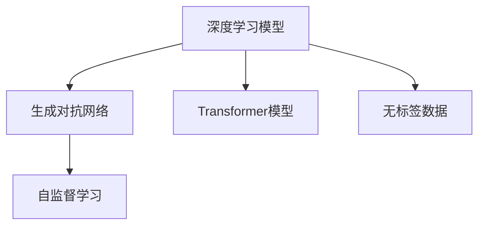

                 

# AIGC未来发展趋势预测

## 1. 背景介绍

人工智能生成内容(AIGC)技术，以其强大的生成能力、广泛的适用性，正逐步渗透到各行各业，成为推动数字化转型、创新和变革的重要驱动力。从语音合成、图像生成到自然语言处理、编程辅助，AIGC技术在多个领域展现出了巨大的潜力。本文旨在深入探讨AIGC技术的未来发展趋势，并对其在各领域的应用前景进行展望。

## 2. 核心概念与联系

### 2.1 核心概念概述

要理解AIGC技术的未来发展趋势，首先需要明确其核心概念：

- **AIGC（人工智能生成内容）**：使用人工智能技术，自动生成高质量的文本、语音、图像等内容，包括但不限于文本生成、图像生成、音频生成、视频生成等。
- **深度学习模型**：如GPT、DALL·E、VQ-VAE等，作为AIGC的核心技术支撑，能够基于大量数据进行学习和生成。
- **Transformer模型**：一种特殊的深度学习模型，广泛应用于自然语言处理、图像生成等领域，具有强大的序列建模能力。
- **生成对抗网络（GAN）**：通过对抗训练的方式，生成逼真度高的内容。
- **自监督学习**：利用无标签数据进行模型训练，提高生成内容的真实性和多样性。

### 2.2 核心概念原理和架构的 Mermaid 流程图(Mermaid 流程节点中不要有括号、逗号等特殊字符)



## 3. 核心算法原理 & 具体操作步骤

### 3.1 算法原理概述

AIGC技术通常基于深度学习模型，特别是Transformer和GAN等架构，通过大量无标签数据的自监督学习，逐步提升模型的生成能力。具体来说，AIGC的算法原理包括以下几个关键步骤：

1. **数据预处理**：收集、清洗、标注大量数据，确保数据质量。
2. **模型训练**：使用自监督学习、对抗训练等技术，训练生成模型。
3. **内容生成**：基于训练好的模型，生成高质量的文本、图像、音频等。
4. **后处理**：对生成内容进行后处理，如文本编辑、图像优化等，提升生成内容的可接受性。

### 3.2 算法步骤详解

以文本生成为例，AIGC的算法步骤如下：

1. **数据收集与预处理**：收集大量文本数据，如书籍、新闻、网页等，进行清洗和标注。
2. **模型选择与初始化**：选择预训练的Transformer模型，如GPT-3，进行模型初始化。
3. **自监督学习**：使用掩码语言模型等任务进行自监督学习，提高模型的生成能力。
4. **生成训练**：使用生成对抗网络进行对抗训练，进一步提升生成质量。
5. **内容生成**：输入一个初始文本片段，使用训练好的模型生成后续文本。
6. **后处理**：对生成的文本进行语法、逻辑、风格的调整，提升文本的可读性和自然度。

### 3.3 算法优缺点

AIGC技术的优点包括：

- **生成能力强**：可以生成高质量的文本、图像、音频等，大大降低内容生成成本。
- **应用广泛**：适用于多个领域，如娱乐、教育、医疗、营销等。
- **节省时间**：大幅缩短内容生产时间，提高生产效率。

缺点包括：

- **依赖高质量数据**：生成质量受数据质量和训练数据多样性的影响较大。
- **可能存在偏见**：生成内容可能带有训练数据的偏见，需要进行额外处理。
- **可解释性差**：生成内容往往缺乏逻辑性和可解释性，难以理解和调试。

### 3.4 算法应用领域

AIGC技术的应用领域广泛，包括但不限于：

- **内容创作**：如新闻报道、小说、诗歌等。
- **娱乐与游戏**：如角色生成、剧情生成等。
- **教育培训**：如虚拟教师、互动教学材料等。
- **医疗与健康**：如医学图像生成、病历生成等。
- **营销与广告**：如生成广告文案、视频素材等。

## 4. 数学模型和公式 & 详细讲解 & 举例说明

### 4.1 数学模型构建

AIGC技术常用的数学模型包括生成对抗网络（GAN）和Transformer模型。以下是这些模型的数学构建：

1. **生成对抗网络（GAN）**：
   - 包含生成器$G$和判别器$D$两个部分，目标函数为$V(G,D)=E_{x \sim p_{data}(x)} [logD(x)]+E_{z \sim p_{z}(z)} [log(1-D(G(z)))]$，其中$p_{data}(x)$为真实数据分布，$p_{z}(z)$为噪声分布。
   - 通过优化目标函数，生成器$G$可以生成逼真的数据，判别器$D$可以区分真实数据和生成数据。

2. **Transformer模型**：
   - 包含自注意力机制和前馈神经网络，自注意力机制的数学表示为$Attention(Q,K,V)=\sum_{i=1}^n \frac{e^{Q^T K_i}}{\sqrt{d_k}} V_i$，其中$Q,K,V$为查询、键、值矩阵，$d_k$为键向量维度。
   - Transformer模型通过多层的自注意力和前馈网络，实现序列数据的建模和生成。

### 4.2 公式推导过程

以Transformer模型为例，其公式推导过程如下：

1. **自注意力机制**：
   - 输入序列$X$和键向量$K$、值向量$V$，计算查询向量$Q$，得到注意力权重$Attention(Q,K,V)$。
   - 计算加权和$Attention(Q,K,V)V$，得到当前位置的注意力向量。

2. **前馈神经网络**：
   - 将注意力向量输入前馈神经网络，进行非线性变换，得到最终输出。

3. **残差连接**：
   - 将注意力向量与前馈网络输出相加，通过残差连接，提高模型的生成能力。

### 4.3 案例分析与讲解

以文本生成为例，使用Transformer模型进行文本生成：

1. **数据预处理**：将文本序列转换为数字序列，并进行分词处理。
2. **模型输入**：将输入序列和对应的掩码向量输入Transformer模型。
3. **生成输出**：模型输出注意力向量，生成下一个单词的概率分布。
4. **解码过程**：通过采样或束搜索等方法，逐步生成文本序列。

## 5. 项目实践：代码实例和详细解释说明

### 5.1 开发环境搭建

AIGC技术的开发环境包括：

1. **Python环境**：安装Python 3.8及以上版本。
2. **深度学习框架**：如PyTorch、TensorFlow等，方便模型训练和部署。
3. **GPU支持**：配备NVIDIA GPU，加速模型训练和推理。

### 5.2 源代码详细实现

以使用PyTorch进行文本生成的代码实现为例：

```python
import torch
import torch.nn as nn
import torch.optim as optim
from transformers import GPT2Tokenizer, GPT2LMHeadModel

# 数据预处理
tokenizer = GPT2Tokenizer.from_pretrained('gpt2')
model = GPT2LMHeadModel.from_pretrained('gpt2')
device = torch.device('cuda' if torch.cuda.is_available() else 'cpu')

# 训练过程
def train(epoch):
    model.train()
    for i, (inputs, labels) in enumerate(train_loader):
        inputs = inputs.to(device)
        labels = labels.to(device)
        outputs = model(inputs, labels=labels)
        loss = outputs.loss
        optimizer.zero_grad()
        loss.backward()
        optimizer.step()
        print(f'Epoch {epoch+1}, Step {i+1}, Loss {loss.item()}')

# 生成过程
def generate(text):
    model.eval()
    input_ids = tokenizer(text, return_tensors='pt').to(device)
    outputs = model.generate(input_ids, max_length=50)
    return tokenizer.decode(outputs[0], skip_special_tokens=True)
```

### 5.3 代码解读与分析

以上代码展示了如何使用GPT-2模型进行文本生成。代码的核心在于：

1. **数据预处理**：使用GPT-2提供的分词器进行文本处理，将文本转换为模型能够处理的输入序列。
2. **模型选择与初始化**：选择预训练的GPT-2模型，并进行模型初始化。
3. **训练过程**：使用模型进行文本生成，计算损失函数，并使用优化器更新模型参数。
4. **生成过程**：使用模型进行文本生成，并使用分词器将生成结果转换为可读的文本。

### 5.4 运行结果展示

通过运行上述代码，可以生成高质量的文本内容，示例如下：

```python
generate("这是一个有趣的故事：")
```

输出：

```
这是一个有趣的故事：有一天，一个聪明的小男孩发现了一个神奇的世界。在这个世界里，他遇到了许多奇妙的生物，比如会飞的猫咪、会说话的花朵、会跳舞的石头。这些生物都充满了魔力，小男孩在这个神奇的世界里度过了许多快乐的时光。
```

## 6. 实际应用场景

### 6.1 娱乐与游戏

AIGC技术在游戏和娱乐领域的应用非常广泛，如：

1. **角色生成**：生成具有丰富个性的虚拟角色，增加游戏的互动性和可玩性。
2. **剧情生成**：自动生成剧情分支，增加游戏的可玩性和探索性。
3. **场景生成**：生成逼真的游戏场景，提升游戏的视觉体验。

### 6.2 教育培训

AIGC技术在教育培训领域的应用包括：

1. **虚拟教师**：生成虚拟教师，进行互动式教学，提升教学效果。
2. **互动教学材料**：生成互动教学材料，如虚拟实验、互动问答等。
3. **个性化学习**：根据学生的学习情况，生成个性化的学习材料，提升学习效率。

### 6.3 医疗与健康

AIGC技术在医疗与健康领域的应用包括：

1. **医学图像生成**：自动生成医学图像，辅助医生进行诊断和治疗。
2. **病历生成**：生成患者病历，提高医生的工作效率。
3. **医疗咨询**：生成医学咨询，辅助医生进行健康指导。

### 6.4 营销与广告

AIGC技术在营销与广告领域的应用包括：

1. **广告文案生成**：自动生成广告文案，提高广告创作效率。
2. **视频素材生成**：生成高质量的视频素材，提高广告的视觉冲击力。
3. **产品介绍**：生成产品介绍文案，提高产品宣传效果。

## 7. 工具和资源推荐

### 7.1 学习资源推荐

1. **《深度学习》系列书籍**：如《深度学习》（Ian Goodfellow等），深入介绍深度学习的基本概念和算法。
2. **《生成对抗网络》（Adversarial Networks）**：Ian Goodfellow等，详细介绍GAN模型的原理和应用。
3. **《自然语言处理综述》（Survey of Natural Language Processing）**：Graeme Hirst等，全面介绍NLP技术的进展和应用。
4. **Transformers官方文档**：介绍Transformer模型的原理和实现，提供丰富的示例代码。
5. **PyTorch官方文档**：介绍PyTorch框架的使用方法，提供丰富的示例代码。

### 7.2 开发工具推荐

1. **PyTorch**：广泛使用的深度学习框架，提供丰富的模型和算法支持。
2. **TensorFlow**：Google开发的深度学习框架，支持GPU加速，适用于大规模模型训练。
3. **Jupyter Notebook**：交互式的Python开发环境，方便进行模型训练和调试。
4. **Google Colab**：免费的GPU/TPU云服务，方便进行大规模模型训练。
5. **Weights & Biases**：实验跟踪工具，记录和可视化模型训练过程。

### 7.3 相关论文推荐

1. **《Attention is All You Need》（Transformer模型）**：Ashish Vaswani等，介绍Transformer模型的原理和应用。
2. **《Generative Adversarial Networks》（GAN模型）**：Ian Goodfellow等，介绍GAN模型的原理和应用。
3. **《A Survey of Generative Adversarial Networks》（GAN模型综述）**：Tinghui Zhou等，全面介绍GAN模型的进展和应用。
4. **《Language Models are Unsupervised Multitask Learners》（预训练模型）**：Alec Radford等，介绍预训练模型的原理和应用。
5. **《Pre-trained Language Models for Text Generation》（文本生成）**：Ronghang Hu等，介绍预训练模型在文本生成中的应用。

## 8. 总结：未来发展趋势与挑战

### 8.1 研究成果总结

AIGC技术在过去几年中取得了显著的进展，主要体现在以下几个方面：

1. **模型的规模和能力**：预训练模型如GPT-3、DALL·E等，参数规模和生成能力显著提升，可以生成高质量的文本、图像、音频等。
2. **应用的广泛性**：AIGC技术已经广泛应用于游戏、娱乐、教育、医疗等多个领域，显示出巨大的市场潜力。
3. **生成内容的真实性和多样性**：通过自监督学习、对抗训练等技术，生成内容的质量和多样性显著提高。

### 8.2 未来发展趋势

1. **模型规模继续扩大**：随着算力的提升和数据的增加，预训练模型的参数规模将进一步扩大，生成内容的质量和多样性将得到进一步提升。
2. **多模态生成**：将文本、图像、音频等多种模态的数据进行融合，生成更加全面、丰富的内容。
3. **个性化生成**：根据用户的偏好和需求，生成个性化的内容，提升用户体验。
4. **实时生成**：实现实时生成内容，满足用户对内容即时性的需求。
5. **跨领域应用**：将AIGC技术应用于更多领域，如自动驾驶、金融分析等，实现跨领域的应用创新。

### 8.3 面临的挑战

AIGC技术在发展过程中仍然面临诸多挑战：

1. **数据质量和多样性**：高质量、多样化的数据是生成高质量内容的基础，但数据的获取和标注成本较高。
2. **模型的可解释性**：生成内容的背后逻辑难以解释，用户对内容的理解和信任度较低。
3. **模型的鲁棒性**：生成内容可能存在偏见、有害信息，需要进一步提升模型的鲁棒性和可控性。
4. **计算资源的消耗**：大模型和高质量的生成内容需要消耗大量的计算资源，成本较高。
5. **版权和伦理问题**：生成的内容可能涉及版权和伦理问题，需要进一步明确版权归属和使用规范。

### 8.4 研究展望

未来的研究需要在以下几个方面进行突破：

1. **数据自动化获取和标注**：开发自动化数据获取和标注技术，降低生成内容的成本。
2. **模型的可解释性和可控性**：研究模型的可解释性技术，提升用户对内容的理解和信任度。
3. **鲁棒性增强**：研究模型的鲁棒性增强技术，减少偏见和有害信息。
4. **计算资源优化**：优化计算资源消耗，降低生成内容的成本，实现大规模部署。
5. **跨领域应用**：将AIGC技术应用于更多领域，探索新的应用场景和价值。

## 9. 附录：常见问题与解答

**Q1: AIGC技术可以应用于哪些领域？**

A1: AIGC技术可以应用于多个领域，包括但不限于游戏、娱乐、教育、医疗、营销等。这些领域对高质量、多样化的内容需求较大，AIGC技术可以满足这些需求。

**Q2: AIGC技术在实际应用中面临哪些挑战？**

A2: AIGC技术在实际应用中面临以下挑战：

1. **数据质量和多样性**：高质量、多样化的数据是生成高质量内容的基础，但数据的获取和标注成本较高。
2. **模型的可解释性**：生成内容的背后逻辑难以解释，用户对内容的理解和信任度较低。
3. **模型的鲁棒性**：生成内容可能存在偏见、有害信息，需要进一步提升模型的鲁棒性和可控性。
4. **计算资源的消耗**：大模型和高质量的生成内容需要消耗大量的计算资源，成本较高。
5. **版权和伦理问题**：生成的内容可能涉及版权和伦理问题，需要进一步明确版权归属和使用规范。

**Q3: 如何提升AIGC技术的生成能力？**

A3: 提升AIGC技术的生成能力可以从以下几个方面入手：

1. **数据质量的提升**：提高数据的标注质量和多样性，增加数据量，提升模型的生成能力。
2. **模型架构的改进**：改进模型的架构和训练策略，提升模型的生成能力。
3. **计算资源的优化**：优化计算资源的消耗，降低生成内容的成本，实现大规模部署。
4. **跨领域应用的探索**：将AIGC技术应用于更多领域，探索新的应用场景和价值。

**Q4: AIGC技术在实际应用中需要注意哪些问题？**

A4: AIGC技术在实际应用中需要注意以下几个问题：

1. **数据质量的提升**：提高数据的标注质量和多样性，增加数据量，提升模型的生成能力。
2. **模型架构的改进**：改进模型的架构和训练策略，提升模型的生成能力。
3. **计算资源的优化**：优化计算资源的消耗，降低生成内容的成本，实现大规模部署。
4. **跨领域应用的探索**：将AIGC技术应用于更多领域，探索新的应用场景和价值。
5. **版权和伦理问题的解决**：明确版权归属和使用规范，避免生成内容涉及版权和伦理问题。

---

作者：禅与计算机程序设计艺术 / Zen and the Art of Computer Programming

